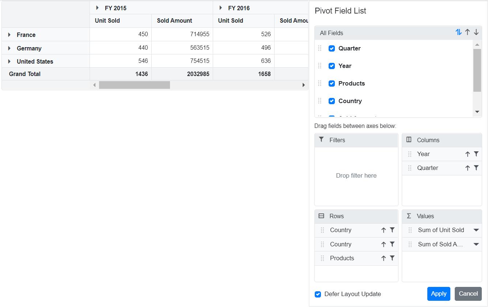

# Defer Layout Update in Blazor Pivot Table Component

Defer update support allows updating the [Blazor Pivot Table](https://www.syncfusion.com/blazor-components/blazor-pivot-table) component only on demand, significantly improving performance for complex data operations. When this feature is enabled, users can drag-and-drop fields between row, column, value, and filter axes, apply sorting and filtering inside the Field List, resulting in changes to the pivot report configuration without immediately updating the pivot table values. Once all operations are performed and the "Apply" button is clicked in the Field List, the pivot table will update with the final modified report. This approach reduces multiple unnecessary renders and brings better performance, especially when working with large datasets or performing multiple field operations.

The field list can be displayed in two different formats to interact with the pivot table:

* **In-built Field List (Popup)**: Displays the field list icon in the pivot table UI to invoke the built-in dialog.
* **Stand-alone Field List (Fixed)**: Displays the field list in a static position within a web page.

## In-built Field List (Popup)

To enable deferred updates in the pivot table, set the property [AllowDeferLayoutUpdate](https://help.syncfusion.com/cr/blazor/Syncfusion.Blazor.PivotView.SfPivotView-1.html#Syncfusion_Blazor_PivotView_SfPivotView_1_AllowDeferLayoutUpdate) in [SfPivotView](https://help.syncfusion.com/cr/blazor/Syncfusion.Blazor.PivotView.SfPivotView-1.html) to **true**. Note that the defer update option can be controlled only via Field List during runtime.

```cshtml
@using Syncfusion.Blazor.PivotView

<SfPivotView TValue="ProductDetails" ShowFieldList="true" AllowDeferLayoutUpdate="true">
     <PivotViewDataSourceSettings DataSource="@data">
        <PivotViewColumns>
            <PivotViewColumn Name="Year"></PivotViewColumn>
            <PivotViewColumn Name="Quarter"></PivotViewColumn>
        </PivotViewColumns>
        <PivotViewRows>
            <PivotViewRow Name="Country"></PivotViewRow>
            <PivotViewRow Name="Products"></PivotViewRow>
        </PivotViewRows>
        <PivotViewValues>
            <PivotViewValue Name="Sold" Caption="Unit Sold"></PivotViewValue>
            <PivotViewValue Name="Amount" Caption="Sold Amount"></PivotViewValue>
        </PivotViewValues>
        <PivotViewFormatSettings>
            <PivotViewFormatSetting Name="Amount" Format="C"></PivotViewFormatSetting>
        </PivotViewFormatSettings>
    </PivotViewDataSourceSettings>
</SfPivotView>

@code{
    public List<ProductDetails> data { get; set; }
    protected override void OnInitialized()
    {
        this.data = ProductDetails.GetProductData().ToList();
        //Bind the data source collection here. Refer "Assigning sample data to the pivot table" section in getting started for more details.
    }
}
```


## Stand-alone Field List (Fixed)

The field list can be rendered in a static position anywhere in the web page layout, functioning as a separate component. To achieve this, set the [RenderMode](https://help.syncfusion.com/cr/blazor/Syncfusion.Blazor.PivotView.SfPivotFieldList-1.html#Syncfusion_Blazor_PivotView_SfPivotFieldList_1_RenderMode) property to [Mode.Fixed](https://help.syncfusion.com/cr/blazor/Syncfusion.Blazor.PivotView.Mode.html) in [SfPivotFieldList](https://help.syncfusion.com/cr/blazor/Syncfusion.Blazor.PivotView.SfPivotFieldList-1.html).

To enable deferred updates in the static fieldlist, set the [AllowDeferLayoutUpdate](https://help.syncfusion.com/cr/blazor/Syncfusion.Blazor.PivotView.SfPivotFieldList-1.html#Syncfusion_Blazor_PivotView_SfPivotFieldList_1_AllowDeferLayoutUpdate) property to **true** in [SfPivotFieldList](https://help.syncfusion.com/cr/blazor/Syncfusion.Blazor.PivotView.SfPivotFieldList-1.html). Note that the defer update option can be controlled only via Field List during runtime.

N> To make the field list interact with the pivot table, use the **UpdateViewAsync** and **UpdateAsync** methods to synchronize data source updates between both the field list and pivot table components simultaneously.

```cshtml
<SfPivotView TValue="ProductDetails" ID="pivotview"  @ref="pivotView" AllowDeferLayoutUpdate="true" Height="530">
    <PivotViewEvents TValue="ProductDetails" EnginePopulated="pivotenginepopulated"></PivotViewEvents>
</SfPivotView>
<SfPivotFieldList TValue="ProductDetails" ID="fieldlist" @ref="fieldList" RenderMode="Mode.Fixed" AllowDeferLayoutUpdate="true">
    <PivotFieldListDataSourceSettings DataSource="@data" EnableSorting=true>
        <PivotFieldListColumns>
            <PivotFieldListColumn Name="Year"></PivotFieldListColumn>
            <PivotFieldListColumn Name="Quarter"></PivotFieldListColumn>
        </PivotFieldListColumns>
        <PivotFieldListRows>
            <PivotFieldListRow Name="Country"></PivotFieldListRow>
            <PivotFieldListRow Name="Products"></PivotFieldListRow>
        </PivotFieldListRows>
        <PivotFieldListValues>
            <PivotFieldListValue Name="Sold" Caption="Unit Sold"></PivotFieldListValue>
            <PivotFieldListValue Name="Amount" Caption="Sold Amount"></PivotFieldListValue>
        </PivotFieldListValues>
    </PivotFieldListDataSourceSettings>
    <PivotFieldListEvents TValue="ProductDetails" EnginePopulated="enginepopulated"></PivotFieldListEvents>
</SfPivotFieldList>
<style>
    #fieldlist {
        width: 42%;
        height: 100%;
        float: right;
    }

    #pivotview {
        width: 57%;
        height: 530px;
        float: left;
    }
</style>
@code{
    SfPivotFieldList<ProductDetails> fieldList;
    SfPivotView<ProductDetails> pivotView;
    public List<ProductDetails> data { get; set; }
    protected override void OnInitialized()
    {
        this.data = ProductDetails.GetProductData();
    }

    public void pivotenginepopulated(EnginePopulatedEventArgs args)
    {
        this.fieldList.UpdateAsync(this.pivotView);
    }
    public void enginepopulated(EnginePopulatedEventArgs args)
    {
        this.fieldList.UpdateViewAsync(this.pivotView);
    }
}
```



N> You can also explore the [Blazor Pivot Table example](https://blazor.syncfusion.com/demos/pivot-table/default-functionalities?theme=bootstrap5) to know how to render and configure the pivot table.