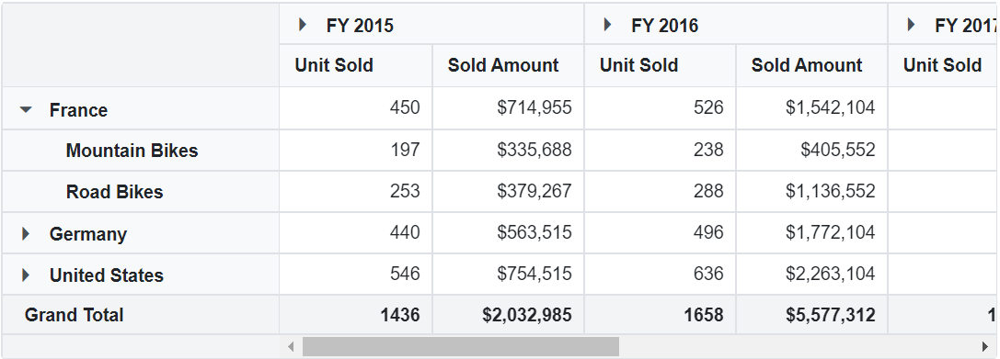
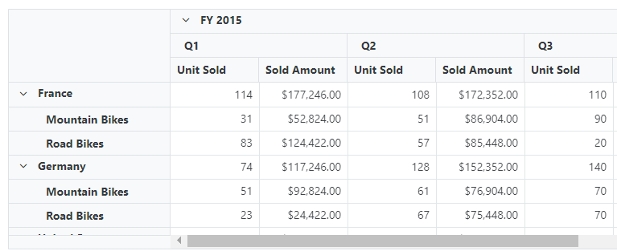
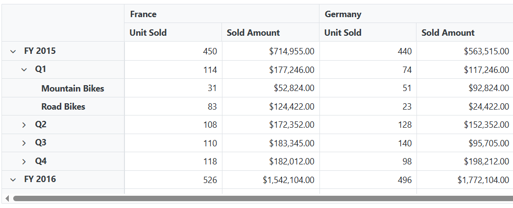

<!-- markdownlint-disable MD034 -->

# Drill Down in Blazor Pivot Table Component

## Drill down and drill up

The drill down and drill up action helps to view the bound data in detailed and abstract view respectively. By default, if member(s) has children, then expand and collapse icon will be displayed in the respective row/column header. On clicking the icon, expand or collapse action will be performed automatically through built-in source code. Meanwhile, leaf member(s) does not contain expand and collapse icon.



## Drill position

It allows to drill only the current position of the selected member and exclude the drilled data of the selected member in other positions. For example, if "FY 2015" and "FY 2016" have "Q1" member as child in next level, and when end user attempts to drill "Q1" under "FY 2016", only it will be expanded and not "Q1" under "FY 2015".

N> This feature is built-in and occurs every time when expand or collapse action is done for better performance.


## Expand all

N> This property is applicable only for the relational data source.

It allows to either expand or collapse all headers that are displayed in row and column axes. To display all headers in expanded state, set the property [ExpandAll](https://help.syncfusion.com/cr/blazor/Syncfusion.Blazor.PivotView.PivotViewDataSourceSettings-1.html#Syncfusion_Blazor_PivotView_PivotViewDataSourceSettings_1_ExpandAll) to **true** and to collapse all headers, set the property [ExpandAll](https://help.syncfusion.com/cr/blazor/Syncfusion.Blazor.PivotView.PivotViewDataSourceSettings-1.html#Syncfusion_Blazor_PivotView_PivotViewDataSourceSettings_1_ExpandAll) to **false**. By default, [ExpandAll](https://help.syncfusion.com/cr/blazor/Syncfusion.Blazor.PivotView.PivotViewDataSourceSettings-1.html#Syncfusion_Blazor_PivotView_PivotViewDataSourceSettings_1_ExpandAll) property is set to **false**.

```cshtml
@using Syncfusion.Blazor.PivotView

<SfPivotView TValue="ProductDetails">
     <PivotViewDataSourceSettings DataSource="@data" ExpandAll="true">
        <PivotViewColumns>
            <PivotViewColumn Name="Year"></PivotViewColumn>
            <PivotViewColumn Name="Quarter"></PivotViewColumn>
        </PivotViewColumns>
        <PivotViewRows>
            <PivotViewRow Name="Country"></PivotViewRow>
            <PivotViewRow Name="Products"></PivotViewRow>
        </PivotViewRows>
        <PivotViewValues>
            <PivotViewValue Name="Sold" Caption="Unit Sold"></PivotViewValue>
            <PivotViewValue Name="Amount" Caption="Sold Amount"></PivotViewValue>
        </PivotViewValues>
        <PivotViewFormatSettings>
            <PivotViewFormatSetting Name="Amount" Format="C"></PivotViewFormatSetting>
        </PivotViewFormatSettings>
    </PivotViewDataSourceSettings>
</SfPivotView>

@code{
    public List<ProductDetails> data { get; set; }
    protected override void OnInitialized()
    {
        this.data = ProductDetails.GetProductData().ToList();
        //Bind the data source collection here. Refer "Assigning sample data to the pivot table" section in getting started for more details.
    }
}
```



## Expand all headers for specific fields

N> This option is applicable only for the relational data source.

Allow to expand or collapse all headers for specific fields(only) in row and column axes. To expand headers for a specific field in row and column axes, set the property [ExpandAll](https://help.syncfusion.com/cr/blazor/Syncfusion.Blazor.PivotView.PivotFieldOptions.html#Syncfusion_Blazor_PivotView_PivotFieldOptions_ExpandAll) in [PivotViewRow](https://help.syncfusion.com/cr/blazor/Syncfusion.Blazor.PivotView.PivotViewRow.html) and [PivotViewColumn](https://help.syncfusion.com/cr/blazor/Syncfusion.Blazor.PivotView.PivotViewColumn.html) to **true**. By default, [ExpandAll](https://help.syncfusion.com/cr/blazor/Syncfusion.Blazor.PivotView.PivotFieldOptions.html#Syncfusion_Blazor_PivotView_PivotFieldOptions_ExpandAll) property in [PivotViewRow](https://help.syncfusion.com/cr/blazor/Syncfusion.Blazor.PivotView.PivotViewRow.html) and [PivotViewColumn](https://help.syncfusion.com/cr/blazor/Syncfusion.Blazor.PivotView.PivotViewColumn.html) is set to **false**.

```cshtml
@using Syncfusion.Blazor.PivotView

<SfPivotView TValue="ProductDetails">
     <PivotViewDataSourceSettings DataSource="@data" ExpandAll="false">
        <PivotViewColumns>
            <PivotViewColumn Name="Year" ExpandAll="true"></PivotViewColumn>
            <PivotViewColumn Name="Quarter"></PivotViewColumn>
        </PivotViewColumns>
        <PivotViewRows>
            <PivotViewRow Name="Country" ExpandAll="true"></PivotViewRow>
            <PivotViewRow Name="Products"></PivotViewRow>
        </PivotViewRows>
        <PivotViewValues>
            <PivotViewValue Name="Sold" Caption="Unit Sold"></PivotViewValue>
            <PivotViewValue Name="Amount" Caption="Sold Amount"></PivotViewValue>
        </PivotViewValues>
        <PivotViewFormatSettings>
            <PivotViewFormatSetting Name="Amount" Format="C"></PivotViewFormatSetting>
        </PivotViewFormatSettings>
    </PivotViewDataSourceSettings>
</SfPivotView>

@code{
    private List<ProductDetails> data { get; set; }
    protected override void OnInitialized()
    {
        this.data = ProductDetails.GetProductData().ToList();
        // Bind the data source collection here. Refer "Assigning sample data to the pivot table" section in getting started for more details.
    }
}

```


## Expand all except specific member(s)

N> This option is applicable only for the relational data source.

In addition to the previous topic, there is an enhancement to expand and collapse all headers except specific header(s). To achieve this, [PivotViewDrilledMember](https://help.syncfusion.com/cr/blazor/Syncfusion.Blazor.PivotView.PivotViewDrilledMember.html) class is used. The required properties of the [PivotViewDrilledMember](https://help.syncfusion.com/cr/blazor/Syncfusion.Blazor.PivotView.PivotViewDrilledMember.html) class are explained as follows:

* [Name](https://help.syncfusion.com/cr/blazor/Syncfusion.Blazor.PivotView.PivotViewDrilledMember.html#Syncfusion_Blazor_PivotView_PivotViewDrilledMember_Name): It allows to set the field name whose member(s) needs to be specifically drilled.
* [Items](https://help.syncfusion.com/cr/blazor/Syncfusion.Blazor.PivotView.PivotViewDrilledMember.html#Syncfusion_Blazor_PivotView_PivotViewDrilledMember_Items): It allows to set the exact member(s) which needs to be drilled.

N> The [PivotViewDrilledMember](https://help.syncfusion.com/cr/blazor/Syncfusion.Blazor.PivotView.PivotViewDrilledMember.html) option always works in vice-versa with respect to the property [ExpandAll](https://help.syncfusion.com/cr/blazor/Syncfusion.Blazor.PivotView.PivotViewDataSourceSettings-1.html#Syncfusion_Blazor_PivotView_PivotViewDataSourceSettings_1_ExpandAll) in pivot table. For example, if [ExpandAll](https://help.syncfusion.com/cr/blazor/Syncfusion.Blazor.PivotView.PivotViewDataSourceSettings-1.html#Syncfusion_Blazor_PivotView_PivotViewDataSourceSettings_1_ExpandAll) is set to **true**, then the member(s) added in [Items](https://help.syncfusion.com/cr/blazor/Syncfusion.Blazor.PivotView.PivotViewDrilledMember.html#Syncfusion_Blazor_PivotView_PivotViewDrilledMember_Items) collection alone will be in collapsed state.

```cshtml
@using Syncfusion.Blazor.PivotView

<SfPivotView TValue="ProductDetails">
     <PivotViewDataSourceSettings DataSource="@data" ExpandAll="true">
        <PivotViewColumns>
            <PivotViewColumn Name="Year"></PivotViewColumn>
            <PivotViewColumn Name="Quarter"></PivotViewColumn>
        </PivotViewColumns>
        <PivotViewRows>
            <PivotViewRow Name="Country"></PivotViewRow>
            <PivotViewRow Name="Products"></PivotViewRow>
        </PivotViewRows>
        <PivotViewValues>
            <PivotViewValue Name="Sold" Caption="Unit Sold"></PivotViewValue>
            <PivotViewValue Name="Amount" Caption="Sold Amount"></PivotViewValue>
        </PivotViewValues>
        <PivotViewFormatSettings>
            <PivotViewFormatSetting Name="Amount" Format="C"></PivotViewFormatSetting>
        </PivotViewFormatSettings>
        <PivotViewDrilledMembers>
            <PivotViewDrilledMember Name="Country" Items="@(new string[] { "France", "Germany" })"></PivotViewDrilledMember>
            </PivotViewDrilledMembers>
    </PivotViewDataSourceSettings>
</SfPivotView>

@code{
    public List<ProductDetails> data { get; set; }
    protected override void OnInitialized()
    {
        this.data = ProductDetails.GetProductData().ToList();
        //Bind the data source collection here. Refer "Assigning sample data to the pivot table" section in getting started for more details.
    }
}

```


## Expand specific member(s)

End user can also manually expand or collapse specific member(s) in each fields under row and column axes using the [PivotViewDrilledMember](https://help.syncfusion.com/cr/blazor/Syncfusion.Blazor.PivotView.PivotViewDrilledMember.html) class from the code behind. The required properties of the [PivotViewDrilledMember](https://help.syncfusion.com/cr/blazor/Syncfusion.Blazor.PivotView.PivotViewDrilledMember.html) class are explained as follows:

* [Name](https://help.syncfusion.com/cr/blazor/Syncfusion.Blazor.PivotView.PivotViewDrilledMember.html#Syncfusion_Blazor_PivotView_PivotViewDrilledMember_Name): It allows to set the field name whose member(s) needs to be specifically drilled.
* [Items](https://help.syncfusion.com/cr/blazor/Syncfusion.Blazor.PivotView.PivotViewDrilledMember.html#Syncfusion_Blazor_PivotView_PivotViewDrilledMember_Items): It allows to set the exact member(s) which needs to be drilled.
* [Delimiter](https://help.syncfusion.com/cr/blazor/Syncfusion.Blazor.PivotView.PivotViewDrilledMember.html#Syncfusion_Blazor_PivotView_PivotViewDrilledMember_Delimiter): It allows to separate next level of member from its parent member.

```cshtml
@using Syncfusion.Blazor.PivotView

<SfPivotView TValue="ProductDetails">
    <PivotViewDataSourceSettings DataSource="@data">
        <PivotViewRows>
            <PivotViewRow Name="Year"></PivotViewRow>
            <PivotViewRow Name="Quarter"></PivotViewRow>
            <PivotViewRow Name="Products"></PivotViewRow>
        </PivotViewRows>
        <PivotViewColumns>
            <PivotViewColumn Name="Country"></PivotViewColumn>
        </PivotViewColumns>
        <PivotViewValues>
            <PivotViewValue Name="Sold" Caption="Unit Sold"></PivotViewValue>
            <PivotViewValue Name="Amount" Caption="Sold Amount"></PivotViewValue>
        </PivotViewValues>
        <PivotViewFormatSettings>
            <PivotViewFormatSetting Name="Amount" Format="C"></PivotViewFormatSetting>
        </PivotViewFormatSettings>
        <PivotViewDrilledMembers>
            <PivotViewDrilledMember Name="Quarter" Delimiter="~~" Items="@(new string[] { "FY 2015~~Q1" })"></PivotViewDrilledMember>
            <PivotViewDrilledMember Name="Year" Items="@(new string[] { "FY 2015","FY 2016" })"></PivotViewDrilledMember>
        </PivotViewDrilledMembers>
    </PivotViewDataSourceSettings>
</SfPivotView>

@code{
    public List<ProductDetails> data { get; set; }
    protected override void OnInitialized()
    {
        this.data = ProductDetails.GetProductData().ToList();
        //Bind the data source collection here. Refer "Assigning sample data to the pivot table" section in getting started for more details.
    }
}
```



## Events

### OnActionBegin

The event [OnActionBegin](https://help.syncfusion.com/cr/blazor/Syncfusion.Blazor.PivotView.PivotViewEvents-1.html#Syncfusion_Blazor_PivotView_PivotViewEvents_1_OnActionBegin) triggers when the UI actions such as drill down and drill up begin. This allows user to identify the current action being performed at runtime. It has the following parameters:

* [DataSourceSettings](https://help.syncfusion.com/cr/blazor/Syncfusion.Blazor.PivotView.PivotActionBeginEventArgs.html#Syncfusion_Blazor_PivotView_PivotActionBeginEventArgs_DataSourceSettings): It holds the current data source settings such as input data source, rows, columns, values, filters, format settings and so on.

* [ActionName](https://help.syncfusion.com/cr/blazor/Syncfusion.Blazor.PivotView.PivotActionBeginEventArgs.html#Syncfusion_Blazor_PivotView_PivotActionBeginEventArgs_ActionName): It holds the name of the current action began. The following are the UI actions and their names:

| Action | Action Name|
|----------------|---------------|
| [Expand](./drill-down#drill-down-and-drill-up)| Drill down|
| [Collapse](./drill-down#drill-down-and-drill-up)| Drill up|

* [Cancel](https://help.syncfusion.com/cr/blazor/Syncfusion.Blazor.PivotView.PivotActionBeginEventArgs.html#Syncfusion_Blazor_PivotView_PivotActionBeginEventArgs_Cancel): It allows user to restrict the current action.

In the following example, drill down and drill up action can be restricted by setting the **args.Cancel** option to **true** in the `OnActionBegin` event.

```cshtml
@using Syncfusion.Blazor.PivotView

<SfPivotView TValue="ProductDetails" ShowFieldList="true" ShowGroupingBar="true">
     <PivotViewDataSourceSettings DataSource="@data">
        <PivotViewColumns>
            <PivotViewColumn Name="Year"></PivotViewColumn>
            <PivotViewColumn Name="Quarter"></PivotViewColumn>
        </PivotViewColumns>
        <PivotViewRows>
            <PivotViewRow Name="Country"></PivotViewRow>
            <PivotViewRow Name="Products"></PivotViewRow>
        </PivotViewRows>
        <PivotViewValues>
            <PivotViewValue Name="Sold" Caption="Unit Sold"></PivotViewValue>
            <PivotViewValue Name="Amount" Caption="Sold Amount"></PivotViewValue>
        </PivotViewValues>
        <PivotViewFormatSettings>
            <PivotViewFormatSetting Name="Amount" Format="C"></PivotViewFormatSetting>
        </PivotViewFormatSettings>
    </PivotViewDataSourceSettings>
   <PivotViewEvents TValue="ProductDetails" OnActionBegin="ActionBegin"></PivotViewEvents>
</SfPivotView>

@code{
    private List<ProductDetails> data { get; set; }
    protected override void OnInitialized()
    {
        data = ProductDetails.GetProductData().ToList();
        //Bind the data source collection here. Refer "Assigning sample data to the pivot table" section in getting started for more details.
    }
    // Triggers when the UI action begins.
    public void ActionBegin(PivotActionBeginEventArgs args)
    {
        if(args.ActionName == "Drill down" || args.ActionName == "Drill up")
        {
          args.Cancel = true;
        }       
    }
}
```
### OnActionComplete

The event [OnActionComplete](https://help.syncfusion.com/cr/blazor/Syncfusion.Blazor.PivotView.PivotViewEvents-1.html#Syncfusion_Blazor_PivotView_PivotViewEvents_1_OnActionComplete) triggers when a UI action such as drill down or drill up, is completed. This allows user to identify the current UI action being completed at runtime. It has the following parameters:

* [DataSourceSettings](https://help.syncfusion.com/cr/blazor/Syncfusion.Blazor.PivotView.PivotActionCompleteEventArgs-1.html#Syncfusion_Blazor_PivotView_PivotActionCompleteEventArgs_1_DataSourceSettings): It holds the current data source settings such as input data source, rows, columns, values, filters, format settings and so on.

* [ActionName](https://help.syncfusion.com/cr/blazor/Syncfusion.Blazor.PivotView.PivotActionCompleteEventArgs-1.html#Syncfusion_Blazor_PivotView_PivotActionCompleteEventArgs_1_ActionName): It holds the name of the current action completed. The following are the UI actions and their names:

| Action | Action Name|
|----------------|---------------|
| [Expand](./drill-down#drill-down-and-drill-up)| Drill down|
| [Collapse](./drill-down#drill-down-and-drill-up)| Drill up|

* [ActionInfo](https://help.syncfusion.com/cr/blazor/Syncfusion.Blazor.PivotView.PivotActionCompleteEventArgs-1.html#Syncfusion_Blazor_PivotView_PivotActionCompleteEventArgs_1_ActionInfo):  It holds the unique information about the current UI action.  For example, if drill down action is completed, the event argument contains information such as field name and the drill information.

```cshtml
@using Syncfusion.Blazor.PivotView

<SfPivotView TValue="ProductDetails" ShowFieldList="true" ShowGroupingBar="true">
    <PivotViewDataSourceSettings DataSource="@data">
        <PivotViewColumns>
            <PivotViewColumn Name="Year"></PivotViewColumn>
            <PivotViewColumn Name="Quarter"></PivotViewColumn>
        </PivotViewColumns>
        <PivotViewRows>
            <PivotViewRow Name="Country"></PivotViewRow>
            <PivotViewRow Name="Products"></PivotViewRow>
        </PivotViewRows>
        <PivotViewValues>
            <PivotViewValue Name="Sold" Caption="Unit Sold"></PivotViewValue>
            <PivotViewValue Name="Amount" Caption="Sold Amount"></PivotViewValue>
        </PivotViewValues>
        <PivotViewFormatSettings>
            <PivotViewFormatSetting Name="Amount" Format="C"></PivotViewFormatSetting>
        </PivotViewFormatSettings>
    </PivotViewDataSourceSettings>
    <PivotViewEvents TValue="ProductDetails" OnActionComplete="ActionComplete"></PivotViewEvents>
</SfPivotView>

@code{
    private List<ProductDetails> data { get; set; }
    protected override void OnInitialized()
    {
        data = ProductDetails.GetProductData().ToList();
        //Bind the data source collection here. Refer "Assigning sample data to the pivot table" section in getting started for more details.
    }
    public void ActionComplete(PivotActionCompleteEventArgs<ProductDetails> args)
    {
        if(args.ActionName == "Drill down" && args.ActionName == "Drill up")
        {
          // Triggers when the drill operations are completed.
        }
    }
}
```
### OnActionFailure

The event [OnActionFailure](https://help.syncfusion.com/cr/blazor/Syncfusion.Blazor.PivotView.PivotViewEvents-1.html#Syncfusion_Blazor_PivotView_PivotViewEvents_1_OnActionFailure) triggers when the current UI action fails to achieve the desired result. It has the following parameters:

* [ActionName](https://help.syncfusion.com/cr/blazor/Syncfusion.Blazor.PivotView.PivotActionFailureEventArgs.html#Syncfusion_Blazor_PivotView_PivotActionFailureEventArgs_ActionName): It holds the name of the current action failed. The following are the UI actions and their names:

| Action | Action Name|
|----------------|---------------|
| [Expand](./drill-down#drill-down-and-drill-up) | Drill down |
| [Collapse](./drill-down#drill-down-and-drill-up)| Drill up |

* [ErrorInfo](https://help.syncfusion.com/cr/blazor/Syncfusion.Blazor.PivotView.PivotActionFailureEventArgs.html#Syncfusion_Blazor_PivotView_PivotActionFailureEventArgs_ErrorInfo): It holds the error information of the current UI action.

```cshtml
@using Syncfusion.Blazor.PivotView

<SfPivotView TValue="ProductDetails" AllowExcelExport="true" AllowPdfExport="true" Width="100%"  ShowToolbar="true" Toolbar="@toolbar" ShowGroupingBar="true" AllowCalculatedField="true"  AllowDrillThrough="true" AllowConditionalFormatting="true" AllowNumberFormatting="true" ShowFieldList="true" Height="350">
     <PivotViewDataSourceSettings DataSource="@data">
        <PivotViewColumns>
            <PivotViewColumn Name="Year"></PivotViewColumn>
            <PivotViewColumn Name="Quarter"></PivotViewColumn>
        </PivotViewColumns>
        <PivotViewRows>
            <PivotViewRow Name="Country"></PivotViewRow>
            <PivotViewRow Name="Products"></PivotViewRow>
        </PivotViewRows>
        <PivotViewValues>
            <PivotViewValue Name="Sold" Caption="Unit Sold"></PivotViewValue>
            <PivotViewValue Name="Amount" Caption="Sold Amount"></PivotViewValue>
        </PivotViewValues>
        <PivotViewFormatSettings>
            <PivotViewFormatSetting Name="Amount" Format="C"></PivotViewFormatSetting>
        </PivotViewFormatSettings>
    </PivotViewDataSourceSettings>
   <PivotViewEvents TValue="ProductDetails" OnActionFailure="ActionFailure"></PivotViewEvents>
</SfPivotView>

@code{
    private List<ProductDetails> data { get; set; }
    private List<Syncfusion.Blazor.PivotView.ToolbarItems> toolbar = new List<Syncfusion.Blazor.PivotView.ToolbarItems> {
        ToolbarItems.New,
        ToolbarItems.Save,
        ToolbarItems.Grid,
        ToolbarItems.Chart,
        ToolbarItems.Export,
        ToolbarItems.SubTotal,
        ToolbarItems.GrandTotal,
        ToolbarItems.ConditionalFormatting,
        ToolbarItems.NumberFormatting,
        ToolbarItems.FieldList            
    };
    protected override void OnInitialized()
    {
        data = ProductDetails.GetProductData().ToList();
        //Bind the data source collection here. Refer "Assigning sample data to the pivot table" section in getting started for more details.
    }
    public void ActionFailure(PivotActionFailureEventArgs args)
    {
        if(args.ActionName == "Drill down" && args.ActionName == "Drill up")
        {
          // Triggers when the current UI action fails to achieve the desired result.
        }
    }
}
```

N> You can refer to the [Blazor Pivot Table](https://www.syncfusion.com/blazor-components/blazor-pivot-table) feature tour page for its groundbreaking feature representations. You can also explore the [Blazor Pivot Table example](https://blazor.syncfusion.com/demos/pivot-table/default-functionalities?theme=bootstrap5) to know how to render and configure the pivot table.
