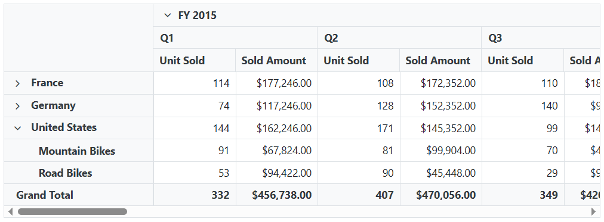
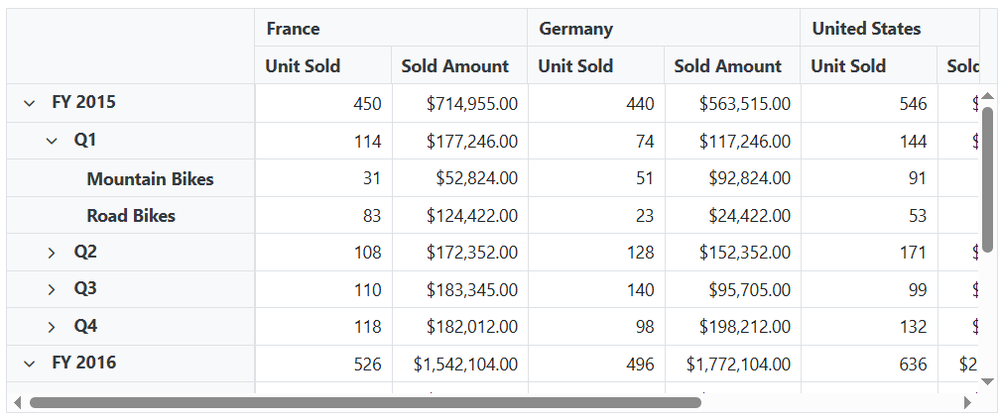

<!-- markdownlint-disable MD034 -->

# Drill Down in Blazor Pivot Table Component

## Drill down and drill up

The drill-down and drill-up features in the Pivot Table component allow users to expand or collapse hierarchical data for detailed or summarized views. When a field member(s) contains child items, expand and collapse icons automatically appear in the corresponding row or column header. Clicking these icons expands the selected item to display its child members or collapses it to show a summarized view. If a field member(s) does not have any further levels to display, the icons will not appear.


## Drill position

The drill-down and drill-up features allow you to expand or collapse data for a specific member in the Pivot Table without affecting the same member in other positions. For example, if both "FY 2015" and "FY 2016" have "Quarter 1" as a child in the next level, drilling down into "Quarter 1" under "FY 2015" will expand only that specific instance. The "Quarter 1" under "FY 2016" will remain unchanged.

N> This feature is built-in and works automatically every time you expand or collapse data, making the pivot table faster and more efficient.


## Expand All

N> This property is applicable only for the relational data source.

The Pivot Table component allows users to interactively expand or collapse all field members displayed in the row and column axes. To display all hierarchical members in an expanded state, set the [`ExpandAll`](https://help.syncfusion.com/cr/blazor/Syncfusion.Blazor.PivotView.PivotViewDataSourceSettings-1.html#Syncfusion_Blazor_PivotView_PivotViewDataSourceSettings_1_ExpandAll) property of [PivotViewDataSourceSettings](https://help.syncfusion.com/cr/blazor/Syncfusion.Blazor.PivotView.PivotViewDataSourceSettings-1.html) to **true**. To collapse all headers, set this property to **false**. By default, [`ExpandAll`](https://help.syncfusion.com/cr/blazor/Syncfusion.Blazor.PivotView.PivotViewDataSourceSettings-1.html#Syncfusion_Blazor_PivotView_PivotViewDataSourceSettings_1_ExpandAll) is set to **false**, so only the top-level field members are shown until the user expands them manually.

```cshtml
@using Syncfusion.Blazor.PivotView

<SfPivotView TValue="ProductDetails">
     <PivotViewDataSourceSettings DataSource="@data" ExpandAll="true">
        <PivotViewColumns>
            <PivotViewColumn Name="Year"></PivotViewColumn>
            <PivotViewColumn Name="Quarter"></PivotViewColumn>
        </PivotViewColumns>
        <PivotViewRows>
            <PivotViewRow Name="Country"></PivotViewRow>
            <PivotViewRow Name="Products"></PivotViewRow>
        </PivotViewRows>
        <PivotViewValues>
            <PivotViewValue Name="Sold" Caption="Unit Sold"></PivotViewValue>
            <PivotViewValue Name="Amount" Caption="Sold Amount"></PivotViewValue>
        </PivotViewValues>
        <PivotViewFormatSettings>
            <PivotViewFormatSetting Name="Amount" Format="C"></PivotViewFormatSetting>
        </PivotViewFormatSettings>
    </PivotViewDataSourceSettings>
</SfPivotView>

@code{
    public List<ProductDetails> data { get; set; }
    protected override void OnInitialized()
    {
        this.data = ProductDetails.GetProductData().ToList();
        //Bind the data source collection here. Refer "Assigning sample data to the pivot table" section in getting started for more details.
    }
}
```


## Expand all headers for specific fields

N> This property is applicable only for the relational data source.

The Pivot Table provides an option to expand or collapse all headers for specific fields in the [`PivotViewRows`](https://help.syncfusion.com/cr/blazor/Syncfusion.Blazor.PivotView.PivotViewRow.html) or [`PivotViewColumns`](https://help.syncfusion.com/cr/blazor/Syncfusion.Blazor.PivotView.PivotViewColumn.html) axis. To expand all headers for a particular field, set the [`ExpandAll`](https://help.syncfusion.com/cr/blazor/Syncfusion.Blazor.PivotView.PivotFieldOptions.html#Syncfusion_Blazor_PivotView_PivotFieldOptions_ExpandAll) property to **true** in the [`PivotViewRows`](https://help.syncfusion.com/cr/blazor/Syncfusion.Blazor.PivotView.PivotViewRow.html) or [`PivotViewColumns`](https://help.syncfusion.com/cr/blazor/Syncfusion.Blazor.PivotView.PivotViewColumn.html) axis. By default, the [`ExpandAll`](https://help.syncfusion.com/cr/blazor/Syncfusion.Blazor.PivotView.PivotFieldOptions.html#Syncfusion_Blazor_PivotView_PivotFieldOptions_ExpandAll) property is set to **false**, meaning the headers are collapsed.

The following code demonstrates how to configure a Pivot Table with the [`ExpandAll`](https://help.syncfusion.com/cr/blazor/Syncfusion.Blazor.PivotView.PivotFieldOptions.html#Syncfusion_Blazor_PivotView_PivotFieldOptions_ExpandAll) property enabled for specific fields. In this example, all headers for the **Year** field in the columns and the **Country** field in the rows are expanded.

```cshtml
@using Syncfusion.Blazor.PivotView

<SfPivotView TValue="ProductDetails">
     <PivotViewDataSourceSettings DataSource="@data" ExpandAll="false">
        <PivotViewColumns>
            <PivotViewColumn Name="Year" ExpandAll="true"></PivotViewColumn>
            <PivotViewColumn Name="Quarter"></PivotViewColumn>
        </PivotViewColumns>
        <PivotViewRows>
            <PivotViewRow Name="Country" ExpandAll="true"></PivotViewRow>
            <PivotViewRow Name="Products"></PivotViewRow>
        </PivotViewRows>
        <PivotViewValues>
            <PivotViewValue Name="Sold" Caption="Unit Sold"></PivotViewValue>
            <PivotViewValue Name="Amount" Caption="Sold Amount"></PivotViewValue>
        </PivotViewValues>
        <PivotViewFormatSettings>
            <PivotViewFormatSetting Name="Amount" Format="C"></PivotViewFormatSetting>
        </PivotViewFormatSettings>
    </PivotViewDataSourceSettings>
</SfPivotView>

@code{
    private List<ProductDetails> data { get; set; }
    protected override void OnInitialized()
    {
        this.data = ProductDetails.GetProductData().ToList();
        // Bind the data source collection here. Refer "Assigning sample data to the pivot table" section in getting started for more details.
    }
}
```


## Expand all except specific member(s)

N> This option is applicable only for the relational data source.

The Pivot Table component supports expanding or collapsing all headers except for specific field members. This functionality allows users to selectively control which members in the fields are expanded or collapsed, making it easier to focus analysis on relevant data in the Pivot Table. The [`PivotViewDrilledMember`](https://help.syncfusion.com/cr/blazor/Syncfusion.Blazor.PivotView.PivotViewDrilledMember.html) property is used to configure this behavior. Its key properties include:

- [`Name`](https://help.syncfusion.com/cr/blazor/Syncfusion.Blazor.PivotView.PivotViewDrilledMember.html#Syncfusion_Blazor_PivotView_PivotViewDrilledMember_Name): Specifies the field name whose members should remain expanded or collapsed.
- [`Items`](https://help.syncfusion.com/cr/blazor/Syncfusion.Blazor.PivotView.PivotViewDrilledMember.html#Syncfusion_Blazor_PivotView_PivotViewDrilledMember_Items): Lists the exact field members to expand or collapse.

The following example demonstrates how to configure a Pivot Table where all headers are expanded except for the **France** member in the **Country** field, which remains collapsed.

```cshtml
@using Syncfusion.Blazor.PivotView

<SfPivotView TValue="ProductDetails">
     <PivotViewDataSourceSettings DataSource="@data" ExpandAll="true">
        <PivotViewColumns>
            <PivotViewColumn Name="Year"></PivotViewColumn>
            <PivotViewColumn Name="Quarter"></PivotViewColumn>
        </PivotViewColumns>
        <PivotViewRows>
            <PivotViewRow Name="Country"></PivotViewRow>
            <PivotViewRow Name="Products"></PivotViewRow>
        </PivotViewRows>
        <PivotViewValues>
            <PivotViewValue Name="Sold" Caption="Unit Sold"></PivotViewValue>
            <PivotViewValue Name="Amount" Caption="Sold Amount"></PivotViewValue>
        </PivotViewValues>
        <PivotViewFormatSettings>
            <PivotViewFormatSetting Name="Amount" Format="C"></PivotViewFormatSetting>
        </PivotViewFormatSettings>
        <PivotViewDrilledMembers>
            <PivotViewDrilledMember Name="Country" Items="@(new string[] { "France", "Germany" })"></PivotViewDrilledMember>
        </PivotViewDrilledMembers>
    </PivotViewDataSourceSettings>
</SfPivotView>

@code{
    public List<ProductDetails> data { get; set; }
    protected override void OnInitialized()
    {
        this.data = ProductDetails.GetProductData().ToList();
        //Bind the data source collection here. Refer "Assigning sample data to the pivot table" section in getting started for more details.
    }
}
```



## Expand or Collapse Specific Members

The Pivot Table component enables users to programmatically expand or collapse specific members in any field placed under the row or column axes. This can be achieved using the [`PivotViewDrilledMember`](https://help.syncfusion.com/cr/blazor/Syncfusion.Blazor.PivotView.PivotViewDrilledMember.html) property. The following properties of [`PivotViewDrilledMember`](https://help.syncfusion.com/cr/blazor/Syncfusion.Blazor.PivotView.PivotViewDrilledMember.html) are described below:

* [`Name`](https://help.syncfusion.com/cr/blazor/Syncfusion.Blazor.PivotView.PivotViewDrilledMember.html#Syncfusion_Blazor_PivotView_PivotViewDrilledMember_Name): Specifies the field name whose members should be expanded or collapsed.
* [`Items`](https://help.syncfusion.com/cr/blazor/Syncfusion.Blazor.PivotView.PivotViewDrilledMember.html#Syncfusion_Blazor_PivotView_PivotViewDrilledMember_Items): Defines the exact members to be expanded or collapsed within the specified field.
* [`Delimiter`](https://help.syncfusion.com/cr/blazor/Syncfusion.Blazor.PivotView.PivotViewDrilledMember.html#Syncfusion_Blazor_PivotView_PivotViewDrilledMember_Delimiter): Sets the character used to separate a child member from its parent when specifying hierarchical members.

The following code demonstrates how to configure the Pivot Table to expand specific members by using the [`PivotViewDrilledMember`](https://help.syncfusion.com/cr/blazor/Syncfusion.Blazor.PivotView.PivotViewDrilledMember.html) property. In this example, the **FY 2015** and **FY 2016** members in the **Year** field, and the **Q1** member under **FY 2015** in the **Quarter** field, are expanded, while other members remain collapsed.

```cshtml
@using Syncfusion.Blazor.PivotView

<SfPivotView TValue="ProductDetails">
    <PivotViewDataSourceSettings DataSource="@data">
        <PivotViewRows>
            <PivotViewRow Name="Year"></PivotViewRow>
            <PivotViewRow Name="Quarter"></PivotViewRow>
            <PivotViewRow Name="Products"></PivotViewRow>
        </PivotViewRows>
        <PivotViewColumns>
            <PivotViewColumn Name="Country"></PivotViewColumn>
        </PivotViewColumns>
        <PivotViewValues>
            <PivotViewValue Name="Sold" Caption="Unit Sold"></PivotViewValue>
            <PivotViewValue Name="Amount" Caption="Sold Amount"></PivotViewValue>
        </PivotViewValues>
        <PivotViewFormatSettings>
            <PivotViewFormatSetting Name="Amount" Format="C"></PivotViewFormatSetting>
        </PivotViewFormatSettings>
        <PivotViewDrilledMembers>
            <PivotViewDrilledMember Name="Quarter" Delimiter="~~" Items="@(new string[] { "FY 2015~~Q1" })"></PivotViewDrilledMember>
            <PivotViewDrilledMember Name="Year" Items="@(new string[] { "FY 2015","FY 2016" })"></PivotViewDrilledMember>
        </PivotViewDrilledMembers>
    </PivotViewDataSourceSettings>
</SfPivotView>

@code{
    public List<ProductDetails> data { get; set; }
    protected override void OnInitialized()
    {
        this.data = ProductDetails.GetProductData().ToList();
        //Bind the data source collection here. Refer "Assigning sample data to the pivot table" section in getting started for more details.
    }
}
```



## Events

### OnActionBegin

The [`OnActionBegin`](https://help.syncfusion.com/cr/blazor/Syncfusion.Blazor.PivotView.PivotViewEvents-1.html#Syncfusion_Blazor_PivotView_PivotViewEvents_1_OnActionBegin) event triggers when a user starts a UI action, such as drilling down (expanding) or drilling up (collapsing) data in the pivot table. This event helps you track the action being performed and customize its behavior. It includes the following parameters:

- [`DataSourceSettings`](https://help.syncfusion.com/cr/blazor/Syncfusion.Blazor.PivotView.PivotActionBeginEventArgs.html#Syncfusion_Blazor_PivotView_PivotActionBeginEventArgs_DataSourceSettings): Contains the current pivot table report settings, including the data source, rows, columns, values, filters, and format settings.
- [`ActionName`](https://help.syncfusion.com/cr/blazor/Syncfusion.Blazor.PivotView.PivotActionBeginEventArgs.html#Syncfusion_Blazor_PivotView_PivotActionBeginEventArgs_ActionName): Indicates the name of the action being performed. The table below lists the UI actions and their corresponding names:

| Action | Action Name|
|----------------|---------------|
| [Expand](./drill-down#drill-down-and-drill-up)| Drill down|
| [Collapse](./drill-down#drill-down-and-drill-up)| Drill up|

- [`Cancel`](https://help.syncfusion.com/cr/blazor/Syncfusion.Blazor.PivotView.PivotActionBeginEventArgs.html#Syncfusion_Blazor_PivotView_PivotActionBeginEventArgs_Cancel): Allows you to block the current action by setting it to `true`.

In the below sample, drill down and drill up action can be restricted by setting the **args.Cancel** option to **true** in the [`OnActionBegin`](https://help.syncfusion.com/cr/blazor/Syncfusion.Blazor.PivotView.PivotViewEvents-1.html#Syncfusion_Blazor_PivotView_PivotViewEvents_1_OnActionBegin) event.

```cshtml
@using Syncfusion.Blazor.PivotView

<SfPivotView TValue="ProductDetails" ShowFieldList="true" ShowGroupingBar="true">
     <PivotViewDataSourceSettings DataSource="@data">
        <PivotViewColumns>
            <PivotViewColumn Name="Year"></PivotViewColumn>
            <PivotViewColumn Name="Quarter"></PivotViewColumn>
        </PivotViewColumns>
        <PivotViewRows>
            <PivotViewRow Name="Country"></PivotViewRow>
            <PivotViewRow Name="Products"></PivotViewRow>
        </PivotViewRows>
        <PivotViewValues>
            <PivotViewValue Name="Sold" Caption="Unit Sold"></PivotViewValue>
            <PivotViewValue Name="Amount" Caption="Sold Amount"></PivotViewValue>
        </PivotViewValues>
        <PivotViewFormatSettings>
            <PivotViewFormatSetting Name="Amount" Format="C"></PivotViewFormatSetting>
        </PivotViewFormatSettings>
    </PivotViewDataSourceSettings>
   <PivotViewEvents TValue="ProductDetails" OnActionBegin="ActionBegin"></PivotViewEvents>
</SfPivotView>

@code{
    private List<ProductDetails> data { get; set; }
    protected override void OnInitialized()
    {
        data = ProductDetails.GetProductData().ToList();
        //Bind the data source collection here. Refer "Assigning sample data to the pivot table" section in getting started for more details.
    }
    // Triggers when the UI action begins.
    public void ActionBegin(PivotActionBeginEventArgs args)
    {
        if(args.ActionName == "Drill down" || args.ActionName == "Drill up")
        {
          args.Cancel = true;
        }       
    }
}
```

### OnActionComplete

The event [`OnActionComplete`](https://help.syncfusion.com/cr/blazor/Syncfusion.Blazor.PivotView.PivotViewEvents-1.html#Syncfusion_Blazor_PivotView_PivotViewEvents_1_OnActionComplete) triggers when a UI action such as drill down or drill up, is completed. This allows user to identify the current UI actions being completed at runtime. It has the following parameters:

* [`DataSourceSettings`](https://help.syncfusion.com/cr/blazor/Syncfusion.Blazor.PivotView.PivotActionCompleteEventArgs-1.html#Syncfusion_Blazor_PivotView_PivotActionCompleteEventArgs_1_DataSourceSettings): It holds the current data source settings such as input data source, rows, columns, values, filters, format settings and so on.

* [`ActionName`](https://help.syncfusion.com/cr/blazor/Syncfusion.Blazor.PivotView.PivotActionCompleteEventArgs-1.html#Syncfusion_Blazor_PivotView_PivotActionCompleteEventArgs_1_ActionName): It holds the name of the current action completed. The following are the UI actions and their names:

| Action | Action Name|
|----------------|---------------|
| [Expand](./drill-down#drill-down-and-drill-up)| Drill down|
| [Collapse](./drill-down#drill-down-and-drill-up)| Drill up|

* [`ActionInfo`](https://help.syncfusion.com/cr/blazor/Syncfusion.Blazor.PivotView.PivotActionCompleteEventArgs-1.html#Syncfusion_Blazor_PivotView_PivotActionCompleteEventArgs_1_ActionInfo): It holds the unique information about the current UI action. For example, if drill down action is completed, the event argument contains information such as field name and the drill information.

```cshtml
@using Syncfusion.Blazor.PivotView

<SfPivotView TValue="ProductDetails" ShowFieldList="true" ShowGroupingBar="true">
    <PivotViewDataSourceSettings DataSource="@data">
        <PivotViewColumns>
            <PivotViewColumn Name="Year"></PivotViewColumn>
            <PivotViewColumn Name="Quarter"></PivotViewColumn>
        </PivotViewColumns>
        <PivotViewRows>
            <PivotViewRow Name="Country"></PivotViewRow>
            <PivotViewRow Name="Products"></PivotViewRow>
        </PivotViewRows>
        <PivotViewValues>
            <PivotViewValue Name="Sold" Caption="Unit Sold"></PivotViewValue>
            <PivotViewValue Name="Amount" Caption="Sold Amount"></PivotViewValue>
        </PivotViewValues>
        <PivotViewFormatSettings>
            <PivotViewFormatSetting Name="Amount" Format="C"></PivotViewFormatSetting>
        </PivotViewFormatSettings>
    </PivotViewDataSourceSettings>
    <PivotViewEvents TValue="ProductDetails" OnActionComplete="ActionComplete"></PivotViewEvents>
</SfPivotView>

@code{
    private List<ProductDetails> data { get; set; }
    protected override void OnInitialized()
    {
        data = ProductDetails.GetProductData().ToList();
        //Bind the data source collection here. Refer "Assigning sample data to the pivot table" section in getting started for more details.
    }
    public void ActionComplete(PivotActionCompleteEventArgs<ProductDetails> args)
    {
        if(args.ActionName == "Drill down" && args.ActionName == "Drill up")
        {
          // Triggers when the drill operations are completed.
        }
    }
}
```

### OnActionFailure

The [`OnActionFailure`](https://help.syncfusion.com/cr/blazor/Syncfusion.Blazor.PivotView.PivotViewEvents-1.html#Syncfusion_Blazor_PivotView_PivotViewEvents_1_OnActionFailure) event is triggered when a UI action does not produce the expected result. It provides details about the failure through the following parameters:

* [`ActionName`](https://help.syncfusion.com/cr/blazor/Syncfusion.Blazor.PivotView.PivotActionFailureEventArgs.html#Syncfusion_Blazor_PivotView_PivotActionFailureEventArgs_ActionName): The name of the action that failed. The table below lists the UI actions and their corresponding names:

| Action | Action Name|
|----------------|---------------|
| [Expand](./drill-down#drill-down-and-drill-up) | Drill down |
| [Collapse](./drill-down#drill-down-and-drill-up)| Drill up |

* [`ErrorInfo`](https://help.syncfusion.com/cr/blazor/Syncfusion.Blazor.PivotView.PivotActionFailureEventArgs.html#Syncfusion_Blazor_PivotView_PivotActionFailureEventArgs_ErrorInfo): Contains details about the error that caused the action to fail.

```cshtml
@using Syncfusion.Blazor.PivotView

<SfPivotView TValue="ProductDetails" AllowExcelExport="true" AllowPdfExport="true" Width="100%"  ShowToolbar="true" Toolbar="@toolbar" ShowGroupingBar="true" AllowCalculatedField="true"  AllowDrillThrough="true" AllowConditionalFormatting="true" AllowNumberFormatting="true" ShowFieldList="true" Height="350">
     <PivotViewDataSourceSettings DataSource="@data">
        <PivotViewColumns>
            <PivotViewColumn Name="Year"></PivotViewColumn>
            <PivotViewColumn Name="Quarter"></PivotViewColumn>
        </PivotViewColumns>
        <PivotViewRows>
            <PivotViewRow Name="Country"></PivotViewRow>
            <PivotViewRow Name="Products"></PivotViewRow>
        </PivotViewRows>
        <PivotViewValues>
            <PivotViewValue Name="Sold" Caption="Unit Sold"></PivotViewValue>
            <PivotViewValue Name="Amount" Caption="Sold Amount"></PivotViewValue>
        </PivotViewValues>
        <PivotViewFormatSettings>
            <PivotViewFormatSetting Name="Amount" Format="C"></PivotViewFormatSetting>
        </PivotViewFormatSettings>
    </PivotViewDataSourceSettings>
   <PivotViewEvents TValue="ProductDetails" OnActionFailure="ActionFailure"></PivotViewEvents>
</SfPivotView>

@code{
    private List<ProductDetails> data { get; set; }
    private List<Syncfusion.Blazor.PivotView.ToolbarItems> toolbar = new List<Syncfusion.Blazor.PivotView.ToolbarItems> {
        ToolbarItems.New,
        ToolbarItems.Save,
        ToolbarItems.Grid,
        ToolbarItems.Chart,
        ToolbarItems.Export,
        ToolbarItems.SubTotal,
        ToolbarItems.GrandTotal,
        ToolbarItems.ConditionalFormatting,
        ToolbarItems.NumberFormatting,
        ToolbarItems.FieldList            
    };
    protected override void OnInitialized()
    {
        data = ProductDetails.GetProductData().ToList();
        //Bind the data source collection here. Refer "Assigning sample data to the pivot table" section in getting started for more details.
    }
    public void ActionFailure(PivotActionFailureEventArgs args)
    {
        if(args.ActionName == "Drill down" && args.ActionName == "Drill up")
        {
          // Triggers when the current UI action fails to achieve the desired result.
        }
    }
}
```

N> You can refer to the [Blazor Pivot Table](https://www.syncfusion.com/blazor-components/blazor-pivot-table) feature tour page for its groundbreaking feature representations. You can also explore the [Blazor Pivot Table example](https://blazor.syncfusion.com/demos/pivot-table/default-functionalities?theme=bootstrap5) to know how to render and configure the pivot table.
