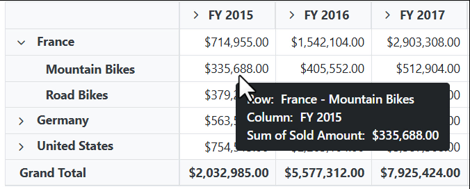
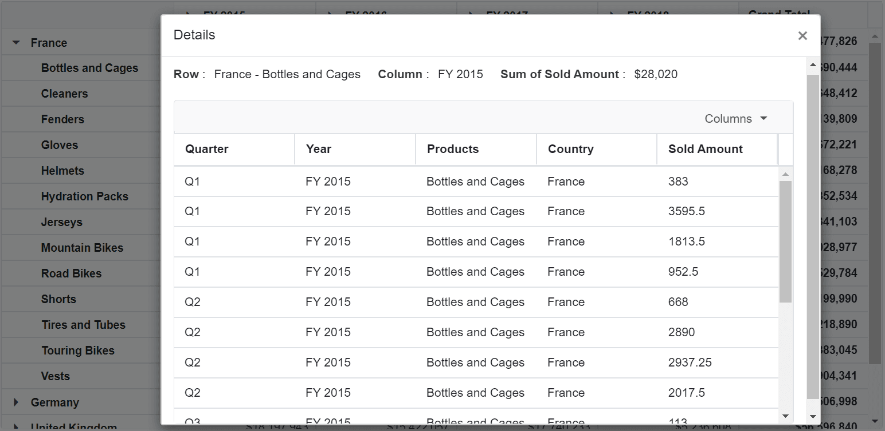
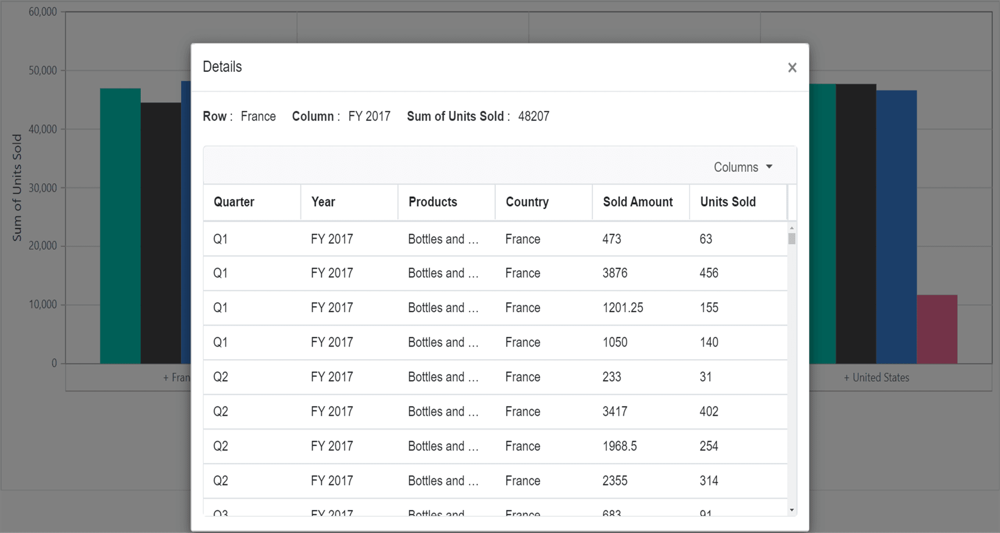

# Drill Through in Blazor Pivot Table Component

It allows to view the underlying raw data of a summarized cell in the pivot table. It can be enabled by setting the [AllowDrillThrough](https://help.syncfusion.com/cr/blazor/Syncfusion.Blazor.PivotView.SfPivotView-1.html#Syncfusion_Blazor_PivotView_SfPivotView_1_AllowDrillThrough) property to **true**. By double-clicking on any value cell, user can view the detailed raw data in a data grid inside a new window. In the new window, row header, column header and measure name of the clicked cell will be shown at the top. Also, the user can include or exclude fields available in the data grid using column chooser option.

```cshtml
@using Syncfusion.Blazor.PivotView

<SfPivotView TValue="ProductDetails" AllowDrillThrough="true">
     <PivotViewDataSourceSettings DataSource="@data">
        <PivotViewColumns>
            <PivotViewColumn Name="Year"></PivotViewColumn>
            <PivotViewColumn Name="Quarter"></PivotViewColumn>
        </PivotViewColumns>
        <PivotViewRows>
            <PivotViewRow Name="Country"></PivotViewRow>
            <PivotViewRow Name="Products"></PivotViewRow>
        </PivotViewRows>
        <PivotViewValues>
            <PivotViewValue Name="Amount" Caption="Sold Amount"></PivotViewValue>
        </PivotViewValues>
        <PivotViewFormatSettings>
            <PivotViewFormatSetting Name="Amount" Format="C"></PivotViewFormatSetting>
        </PivotViewFormatSettings>
    </PivotViewDataSourceSettings>
</SfPivotView>

@code{
    public List<ProductDetails> data { get; set; }
    protected override void OnInitialized()
    {
        this.data = ProductDetails.GetProductData().ToList();
        //Bind the data source collection here. Refer "Assigning sample data to the pivot table" section in getting started for more details.
    }
}
```


<br/>
<br/>


Users can also view the underlying raw data though the pivot chart. By clicking on any data point, user can view the detailed raw data in a data grid inside a new window.

```cshtml
@using Syncfusion.Blazor.PivotView

<SfPivotView TValue="ProductDetails" Width="800" Height="500" AllowDrillThrough="true">
    <PivotViewDataSourceSettings DataSource="@data">
        <PivotViewColumns>
            <PivotViewColumn Name="Year"></PivotViewColumn>
            <PivotViewColumn Name="Quarter"></PivotViewColumn>
        </PivotViewColumns>
        <PivotViewRows>
            <PivotViewRow Name="Country"></PivotViewRow>
            <PivotViewRow Name="Products"></PivotViewRow>
        </PivotViewRows>
        <PivotViewValues>
            <PivotViewValue Name="Sold" Caption="Unit Sold"></PivotViewValue>
            <PivotViewValue Name="Amount" Caption="Sold Amount"></PivotViewValue>
        </PivotViewValues>
        <PivotViewFormatSettings>
            <PivotViewFormatSetting Name="Amount" Format="C"></PivotViewFormatSetting>
        </PivotViewFormatSettings>
    </PivotViewDataSourceSettings>
    <PivotViewDisplayOption View=View.Chart></PivotViewDisplayOption>
    <PivotChartSettings Title="Sales Analysis">
        <PivotChartSeries Type=ChartSeriesType.Column></PivotChartSeries>
    </PivotChartSettings>
</SfPivotView>

@code{
    public List<ProductDetails> data { get; set; }
    protected override void OnInitialized()
    {
        this.data = ProductDetails.GetProductData().ToList();
        //Bind the data source collection here. Refer "Assigning sample data to the pivot table" section in getting started for more details.
    }
}

```


<br/>
<br/>


## Maximum rows to retrieve

N> This property is applicable only for OLAP data sources.

The [MaxRowsInDrillThrough](https://help.syncfusion.com/cr/blazor/Syncfusion.Blazor.PivotView.PivotViewModel-1.html#Syncfusion_Blazor_PivotView_PivotViewModel_1_MaxRowsInDrillThrough) property allows to specify the maximum number of raw data to be returned during the drill through process. By default, this property is set to **"10000"** meaning that if you do not specify this property, you will get 10,000 or less raw data.

```cshtml

@using Syncfusion.Blazor.PivotView

<SfPivotView Width="800" TValue="ProductDetails" Height="350" AllowDrillThrough="true" MaxRowsInDrillThrough="10">
    <PivotViewDataSourceSettings TValue="ProductDetails" ProviderType="ProviderType.SSAS" Catalog="Adventure Works DW 2008 SE" Cube="Adventure Works" Url="https://bi.syncfusion.com/olap/msmdpump.dll" LocaleIdentifier="1033" EnableSorting="true">
        <PivotViewColumns>
            <PivotViewColumn Name="[Product].[Product Categories]" Caption="Product Category"></PivotViewColumn>
            <PivotViewColumn Name="[Measures]" Caption="Measure"></PivotViewColumn>
        </PivotViewColumns>
        <PivotViewRows>
            <PivotViewRow Name="[Customer].[Customer Geography]" Caption="Customer Geography"></PivotViewRow>
        </PivotViewRows>
        <PivotViewValues>
            <PivotViewValue Name="[Measures].[Customer Count]" Caption="Customer Count"></PivotViewValue>
            <PivotViewValue Name="[Measures].[Internet Sales Amount]" Caption="Internet Sales Amount"></PivotViewValue>
        </PivotViewValues>
    </PivotViewDataSourceSettings>
    <PivotViewGridSettings ColumnWidth="160"></PivotViewGridSettings>
</SfPivotView>
<style>
    .e-pivotview {
        min-height: 200px;
    }
</style>
@code {
    public class ProductDetails
    {
        public int Sold { get; set; }
        public double Amount { get; set; }
        public string Country { get; set; }
        public string Products { get; set; }
        public string Year { get; set; }
        public string Quarter { get; set; }
    }
}

```


N> You can refer to the [Blazor Pivot Table](https://www.syncfusion.com/blazor-components/blazor-pivot-table) feature tour page for its groundbreaking feature representations. You can also explore the [Blazor Pivot Table example](https://blazor.syncfusion.com/demos/pivot-table/default-functionalities?theme=bootstrap5) to know how to render and configure the pivot table.