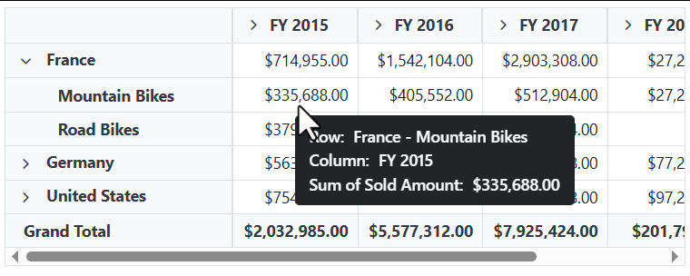
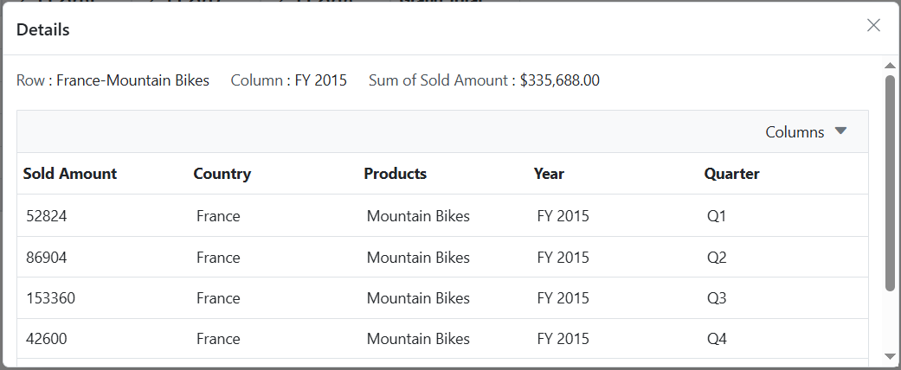
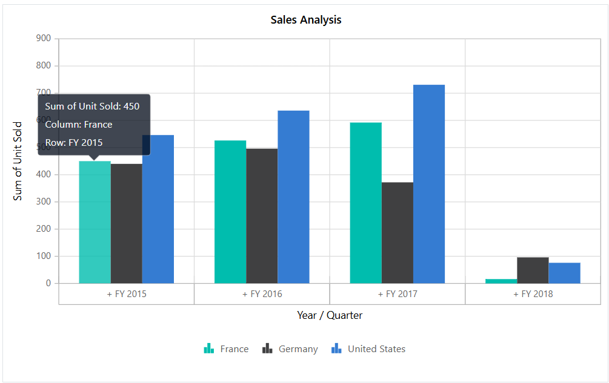

# Drill Through in Blazor Pivot Table Component

The drill-through feature in the Pivot Table component allows users to view the raw, unaggregated data behind any aggregated cell in the pivot table. To enable this feature, set the [AllowDrillThrough](https://help.syncfusion.com/cr/blazor/Syncfusion.Blazor.PivotView.SfPivotView-1.html#Syncfusion_Blazor_PivotView_SfPivotView_1_AllowDrillThrough) property to **true**. By double-clicking an aggregated cell, users can view its detailed raw data in a data grid displayed in a new window. The new window shows the row header, column header, and measure name of the selected cell at the top. Additionally, users can include or exclude fields available in the data grid using the column chooser option.

```cshtml
@using Syncfusion.Blazor.PivotView

<SfPivotView TValue="ProductDetails" AllowDrillThrough="true">
     <PivotViewDataSourceSettings DataSource="@data">
        <PivotViewColumns>
            <PivotViewColumn Name="Year"></PivotViewColumn>
            <PivotViewColumn Name="Quarter"></PivotViewColumn>
        </PivotViewColumns>
        <PivotViewRows>
            <PivotViewRow Name="Country"></PivotViewRow>
            <PivotViewRow Name="Products"></PivotViewRow>
        </PivotViewRows>
        <PivotViewValues>
            <PivotViewValue Name="Amount" Caption="Sold Amount"></PivotViewValue>
        </PivotViewValues>
        <PivotViewFormatSettings>
            <PivotViewFormatSetting Name="Amount" Format="C"></PivotViewFormatSetting>
        </PivotViewFormatSettings>
    </PivotViewDataSourceSettings>
</SfPivotView>

@code{
    public List<ProductDetails> data { get; set; }
    protected override void OnInitialized()
    {
        this.data = ProductDetails.GetProductData().ToList();
        //Bind the data source collection here. Refer "Assigning sample data to the pivot table" section in getting started for more details.
    }
}
```


<br/>
<br/>


Users can also access drill-through data through the pivot chart. By clicking on any data point in the pivot chart, they can view the raw data in a data grid displayed in a new window.

```cshtml
@using Syncfusion.Blazor.PivotView

<SfPivotView TValue="ProductDetails" Width="800" Height="500" AllowDrillThrough="true">
    <PivotViewDataSourceSettings DataSource="@data">
        <PivotViewColumns>
            <PivotViewColumn Name="Year"></PivotViewColumn>
            <PivotViewColumn Name="Quarter"></PivotViewColumn>
        </PivotViewColumns>
        <PivotViewRows>
            <PivotViewRow Name="Country"></PivotViewRow>
            <PivotViewRow Name="Products"></PivotViewRow>
        </PivotViewRows>
        <PivotViewValues>
            <PivotViewValue Name="Sold" Caption="Unit Sold"></PivotViewValue>
            <PivotViewValue Name="Amount" Caption="Sold Amount"></PivotViewValue>
        </PivotViewValues>
        <PivotViewFormatSettings>
            <PivotViewFormatSetting Name="Amount" Format="C"></PivotViewFormatSetting>
        </PivotViewFormatSettings>
    </PivotViewDataSourceSettings>
    <PivotViewDisplayOption View=View.Chart></PivotViewDisplayOption>
    <PivotChartSettings Title="Sales Analysis">
        <PivotChartSeries Type=ChartSeriesType.Column></PivotChartSeries>
    </PivotChartSettings>
</SfPivotView>

@code{
    public List<ProductDetails> data { get; set; }
    protected override void OnInitialized()
    {
        this.data = ProductDetails.GetProductData().ToList();
        //Bind the data source collection here. Refer "Assigning sample data to the pivot table" section in getting started for more details.
    }
}
```


<br/>
<br/>


## Maximum rows to retrieve

N> This property is applicable only for the OLAP data source.

The [MaxRowsInDrillThrough](https://help.syncfusion.com/cr/blazor/Syncfusion.Blazor.PivotView.PivotViewModel-1.html#Syncfusion_Blazor_PivotView_PivotViewModel_1_MaxRowsInDrillThrough) property specifies the maximum number of rows to be returned during a drill-through operation. By default, this property is set to **"10000"**, meaning that if it is not explicitly defined, up to 10,000 rows will be returned.

```cshtml
@using Syncfusion.Blazor.PivotView

<SfPivotView Width="800" TValue="ProductDetails" Height="350" AllowDrillThrough="true" MaxRowsInDrillThrough="10">
    <PivotViewDataSourceSettings TValue="ProductDetails" ProviderType="ProviderType.SSAS" Catalog="Adventure Works DW 2008 SE" Cube="Adventure Works" Url="https://bi.syncfusion.com/olap/msmdpump.dll" LocaleIdentifier="1033" EnableSorting="true">
        <PivotViewColumns>
            <PivotViewColumn Name="[Product].[Product Categories]" Caption="Product Category"></PivotViewColumn>
            <PivotViewColumn Name="[Measures]" Caption="Measure"></PivotViewColumn>
        </PivotViewColumns>
        <PivotViewRows>
            <PivotViewRow Name="[Customer].[Customer Geography]" Caption="Customer Geography"></PivotViewRow>
        </PivotViewRows>
        <PivotViewValues>
            <PivotViewValue Name="[Measures].[Customer Count]" Caption="Customer Count"></PivotViewValue>
            <PivotViewValue Name="[Measures].[Internet Sales Amount]" Caption="Internet Sales Amount"></PivotViewValue>
        </PivotViewValues>
    </PivotViewDataSourceSettings>
    <PivotViewGridSettings ColumnWidth="160"></PivotViewGridSettings>
</SfPivotView>
<style>
    .e-pivotview {
        min-height: 200px;
    }
</style>
@code {
    public class ProductDetails
    {
        public int Sold { get; set; }
        public double Amount { get; set; }
        public string Country { get; set; }
        public string Products { get; set; }
        public string Year { get; set; }
        public string Quarter { get; set; }
    }
}
```


N> You can refer to the [Blazor Pivot Table](https://www.syncfusion.com/blazor-components/blazor-pivot-table) feature tour page for its groundbreaking feature representations. You can also explore the [Blazor Pivot Table example](https://blazor.syncfusion.com/demos/pivot-table/default-functionalities?theme=bootstrap5) to know how to render and configure the pivot table.