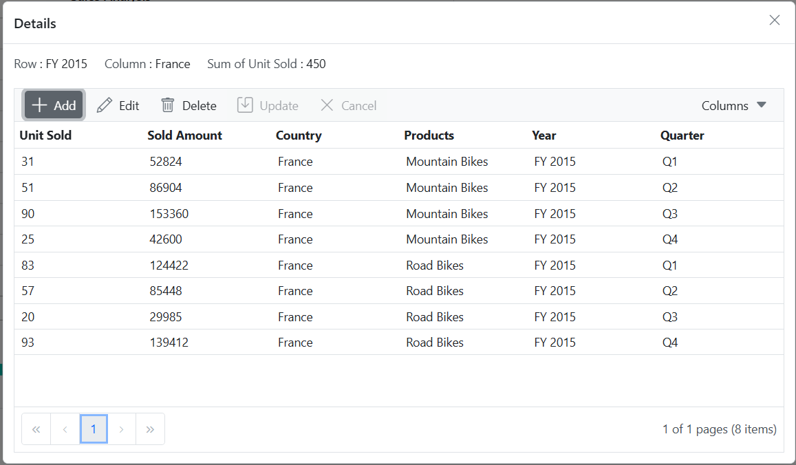

# Editing in Blazor Pivot Table Component

N> This feature is applicable only for the relational data source.

The cell editing option allows users to directly change data in the pivot table by adding, updating, or deleting raw data items within any value cell. When you double-click a value cell, the raw items appear in a data grid within a new window. In this data grid, you can perform CRUD operations by double-clicking cells or using toolbar options. After you finish editing the raw items, the pivot table automatically updates the aggregated values. To enable this option, set the [AllowEditing](https://help.syncfusion.com/cr/blazor/Syncfusion.Blazor.PivotView.PivotViewCellEditSettings.html#Syncfusion_Blazor_PivotView_PivotViewCellEditSettings_AllowEditing) property in [PivotViewCellEditSettings](https://help.syncfusion.com/cr/blazor/Syncfusion.Blazor.PivotView.PivotViewCellEditSettings.html) class to **true**.

The [PivotViewCellEditSettings](https://help.syncfusion.com/cr/blazor/Syncfusion.Blazor.PivotView.PivotViewCellEditSettings.html) class provides comprehensive control over editing behavior through the following options:

* [AllowAdding](https://help.syncfusion.com/cr/blazor/Syncfusion.Blazor.PivotView.PivotViewCellEditSettings.html#Syncfusion_Blazor_PivotView_PivotViewCellEditSettings_AllowAdding): Enables adding new rows to the data grid.
* [AllowEditing](https://help.syncfusion.com/cr/blazor/Syncfusion.Blazor.PivotView.PivotViewCellEditSettings.html#Syncfusion_Blazor_PivotView_PivotViewCellEditSettings_AllowEditing): Allows editing existing records in the data grid.
* [AllowDeleting](https://help.syncfusion.com/cr/blazor/Syncfusion.Blazor.PivotView.PivotViewCellEditSettings.html#Syncfusion_Blazor_PivotView_PivotViewCellEditSettings_AllowDeleting): Enables deleting records directly from the data grid.
* [AllowCommandColumns](https://help.syncfusion.com/cr/blazor/Syncfusion.Blazor.PivotView.PivotViewCellEditSettings.html#Syncfusion_Blazor_PivotView_PivotViewCellEditSettings_AllowCommandColumns): Displays built-in command buttons (edit, delete, save, cancel) in the data grid.
* [Mode](https://help.syncfusion.com/cr/blazor/Syncfusion.Blazor.PivotView.PivotViewCellEditSettings.html#Syncfusion_Blazor_PivotView_PivotViewCellEditSettings_Mode): Sets the editing mode.
* [AllowEditOnDblClick](https://help.syncfusion.com/cr/blazor/Syncfusion.Blazor.PivotView.PivotViewCellEditSettings.html#Syncfusion_Blazor_PivotView_PivotViewCellEditSettings_AllowEditOnDblClick): Enables users to start editing a cell by double-clicking it.
* [ShowConfirmDialog](https://help.syncfusion.com/cr/blazor/Syncfusion.Blazor.PivotView.PivotViewCellEditSettings.html#Syncfusion_Blazor_PivotView_PivotViewCellEditSettings_ShowConfirmDialog): Shows a confirmation dialog before saving changes.
* [ShowDeleteConfirmDialog](https://help.syncfusion.com/cr/blazor/Syncfusion.Blazor.PivotView.PivotViewCellEditSettings.html#Syncfusion_Blazor_PivotView_PivotViewCellEditSettings_ShowDeleteConfirmDialog): Shows a confirmation dialog before deleting a record.
* [AllowInlineEditing](https://help.syncfusion.com/cr/blazor/Syncfusion.Blazor.PivotView.PivotViewCellEditSettings.html#Syncfusion_Blazor_PivotView_PivotViewCellEditSettings_AllowInlineEditing): Allows users to edit content directly in the cell.

The CRUD operations available in the data grid toolbar and command column are:

| Toolbar Button | Actions |
|----------------|---------|
| Add | Add a new row.|
| Edit | Edit the current row or cell.|
| Delete | Delete the current row.|
| Update | Update the edited row or cell.|
| Cancel | Cancel the edited state. |

The following are the supported edit types in the data grid:

* Normal
* Dialog
* Batch
* Command Columns

To learn about how to work with Editing options, you can check on this video for Blazor Pivot Table.



## Normal

Normal edit mode allows users to edit one row at a time in the editing dialog with simple data changes and updates. In normal edit mode, when editing begins, the selected row changes to edit state. Cell values can be modified and saved to the data source by clicking the "Update" toolbar button. To enable normal edit mode, set the [Mode](https://help.syncfusion.com/cr/blazor/Syncfusion.Blazor.PivotView.PivotViewCellEditSettings.html#Syncfusion_Blazor_PivotView_PivotViewCellEditSettings_Mode) property in [PivotViewCellEditSettings](https://help.syncfusion.com/cr/blazor/Syncfusion.Blazor.PivotView.PivotViewCellEditSettings.html) class to [EditMode.Normal](https://help.syncfusion.com/cr/blazor/Syncfusion.Blazor.PivotView.EditMode.html#Syncfusion_Blazor_PivotView_EditMode_Normal).

N> The normal edit mode [EditMode.Normal](https://help.syncfusion.com/cr/blazor/Syncfusion.Blazor.PivotView.EditMode.html#Syncfusion_Blazor_PivotView_EditMode_Normal) is set as the default mode for editing.

```cshtml
@using Syncfusion.Blazor.PivotView

<SfPivotView TValue="ProductDetails">
<PivotViewDataSourceSettings DataSource="@data">
        <PivotViewColumns>
            <PivotViewColumn Name="Year"></PivotViewColumn>
            <PivotViewColumn Name="Quarter"></PivotViewColumn>
        </PivotViewColumns>
        <PivotViewRows>
            <PivotViewRow Name="Country"></PivotViewRow>
            <PivotViewRow Name="Products"></PivotViewRow>
        </PivotViewRows>
        <PivotViewValues>
            <PivotViewValue Name="Amount" Caption="Sold Amount"></PivotViewValue>
        </PivotViewValues>
        <PivotViewFormatSettings>
            <PivotViewFormatSetting Name="Amount" Format="C0"></PivotViewFormatSetting>
        </PivotViewFormatSettings>
    </PivotViewDataSourceSettings>
    <PivotViewCellEditSettings AllowAdding="true" AllowDeleting="true" AllowEditing="true" Mode=EditMode.Normal></PivotViewCellEditSettings>
</SfPivotView>

@code{
    public List<ProductDetails> data { get; set; }
    protected override void OnInitialized()
    {
        this.data = ProductDetails.GetProductData().ToList();
        //Bind the data source collection here. Refer "Assigning sample data to the pivot table" section in getting started for more details.
    }
}
```


## Dialog

The dialog edit mode provides a focused editing environment by displaying the selected row data in an exclusive dialog window, ensuring clear visibility and controlled data modification. In dialog edit mode, when editing begins, the currently selected row data appears in a dedicated dialog. Cell values can be modified and saved to the data source by clicking the "Save" button in the dialog. To enable dialog editing, set the [Mode](https://help.syncfusion.com/cr/blazor/Syncfusion.Blazor.PivotView.PivotViewCellEditSettings.html#Syncfusion_Blazor_PivotView_PivotViewCellEditSettings_Mode) property in [PivotViewCellEditSettings](https://help.syncfusion.com/cr/blazor/Syncfusion.Blazor.PivotView.PivotViewCellEditSettings.html) class to [EditMode.Dialog](https://help.syncfusion.com/cr/blazor/Syncfusion.Blazor.PivotView.EditMode.html#Syncfusion_Blazor_PivotView_EditMode_Dialog).

```cshtml
@using Syncfusion.Blazor.PivotView

<SfPivotView TValue="ProductDetails">
    <PivotViewDataSourceSettings DataSource="@data">
        <PivotViewColumns>
            <PivotViewColumn Name="Year"></PivotViewColumn>
            <PivotViewColumn Name="Quarter"></PivotViewColumn>
        </PivotViewColumns>
        <PivotViewRows>
            <PivotViewRow Name="Country"></PivotViewRow>
            <PivotViewRow Name="Products"></PivotViewRow>
        </PivotViewRows>
        <PivotViewValues>
            <PivotViewValue Name="Amount" Caption="Sold Amount"></PivotViewValue>
        </PivotViewValues>
        <PivotViewFormatSettings>
            <PivotViewFormatSetting Name="Amount" Format="C0"></PivotViewFormatSetting>
        </PivotViewFormatSettings>
    </PivotViewDataSourceSettings>
    <PivotViewCellEditSettings AllowAdding="true" AllowDeleting="true" AllowEditing="true" Mode=EditMode.Dialog></PivotViewCellEditSettings>
</SfPivotView>

@code{
    public List<ProductDetails> data { get; set; }
    protected override void OnInitialized()
    {
        this.data = ProductDetails.GetProductData().ToList();
        //Bind the data source collection here. Refer "Assigning sample data to the pivot table" section in getting started for more details.
    }
}
```


## Batch

Batch editing enables users to make multiple changes to data grid cells and save them all at once, improving efficiency for bulk updates. When a user double-clicks any data grid cell in batch mode, the target cell changes to edit state. Users can perform multiple changes and save all modifications (added, changed, and deleted data) to the data source by clicking the **Update** toolbar button. To enable batch editing, set the [Mode](https://help.syncfusion.com/cr/blazor/Syncfusion.Blazor.PivotView.PivotViewCellEditSettings.html#Syncfusion_Blazor_PivotView_PivotViewCellEditSettings_Mode) property in [PivotViewCellEditSettings](https://help.syncfusion.com/cr/blazor/Syncfusion.Blazor.PivotView.PivotViewCellEditSettings.html) class to [EditMode.Batch](https://help.syncfusion.com/cr/blazor/Syncfusion.Blazor.PivotView.EditMode.html#Syncfusion_Blazor_PivotView_EditMode_Batch).

```cshtml
@using Syncfusion.Blazor.PivotView

<SfPivotView TValue="ProductDetails">
 <PivotViewDataSourceSettings DataSource="@data">
        <PivotViewColumns>
            <PivotViewColumn Name="Year"></PivotViewColumn>
            <PivotViewColumn Name="Quarter"></PivotViewColumn>
        </PivotViewColumns>
        <PivotViewRows>
            <PivotViewRow Name="Country"></PivotViewRow>
            <PivotViewRow Name="Products"></PivotViewRow>
        </PivotViewRows>
        <PivotViewValues>
            <PivotViewValue Name="Amount" Caption="Sold Amount"></PivotViewValue>
        </PivotViewValues>
        <PivotViewFormatSettings>
            <PivotViewFormatSetting Name="Amount" Format="C0"></PivotViewFormatSetting>
        </PivotViewFormatSettings>
    </PivotViewDataSourceSettings>
    <PivotViewCellEditSettings AllowAdding="true" AllowDeleting="true" AllowEditing="true" Mode=EditMode.Batch></PivotViewCellEditSettings>
</SfPivotView>

@code{
    public List<ProductDetails> data { get; set; }
    protected override void OnInitialized()
    {
        this.data = ProductDetails.GetProductData().ToList();
        //Bind the data source collection here. Refer "Assigning sample data to the pivot table" section in getting started for more details.
    }
}
```


## Command column

The command column option provides dedicated action buttons within the data grid for streamlined CRUD operations as an alternative to using toolbar options. An additional column appears in the data grid layout containing command buttons to perform the CRUD operations. To enable the command columns, set the [AllowCommandColumns](https://help.syncfusion.com/cr/blazor/Syncfusion.Blazor.PivotView.PivotViewCellEditSettings.html#Syncfusion_Blazor_PivotView_PivotViewCellEditSettings_AllowCommandColumns) property in [PivotViewCellEditSettings](https://help.syncfusion.com/cr/blazor/Syncfusion.Blazor.PivotView.PivotViewCellEditSettings.html) class to **true**.

The available built-in command buttons are:

| Command Button | Actions |
|----------------|---------|
| Edit | Edit the current row.|
| Delete | Delete the current row.|
| Save | Update the edited row.|
| Cancel | Cancel the edited state. |

N>
- When the command column option is enabled, the Edit, Delete, Update, and Cancel buttons are not shown in the Data Grid's toolbar. Instead, these action buttons appear in the last column of each row within the Data Grid.
- To delete a record directly from the data grid using the **Delete** action button in the command column, you need to set the [AllowDeleting](https://help.syncfusion.com/cr/blazor/Syncfusion.Blazor.PivotView.PivotViewCellEditSettings.html#Syncfusion_Blazor_PivotView_PivotViewCellEditSettings_AllowDeleting) property to **true**.

```cshtml
@using Syncfusion.Blazor.PivotView

<SfPivotView TValue="ProductDetails">
    <PivotViewDataSourceSettings DataSource="@data">
        <PivotViewColumns>
            <PivotViewColumn Name="Year"></PivotViewColumn>
            <PivotViewColumn Name="Quarter"></PivotViewColumn>
        </PivotViewColumns>
        <PivotViewRows>
            <PivotViewRow Name="Country"></PivotViewRow>
            <PivotViewRow Name="Products"></PivotViewRow>
        </PivotViewRows>
        <PivotViewValues>
            <PivotViewValue Name="Amount" Caption="Sold Amount"></PivotViewValue>
        </PivotViewValues>
        <PivotViewFormatSettings>
            <PivotViewFormatSetting Name="Amount" Format="C0"></PivotViewFormatSetting>
        </PivotViewFormatSettings>
    </PivotViewDataSourceSettings>
    <PivotViewCellEditSettings AllowAdding="true" AllowDeleting="true" AllowEditing="true" AllowCommandColumns="true" ></PivotViewCellEditSettings>
</SfPivotView>

@code{
    public List<ProductDetails> data { get; set; }
    protected override void OnInitialized()
    {
        this.data = ProductDetails.GetProductData().ToList();
        //Bind the data source collection here. Refer "Assigning sample data to the pivot table" section in getting started for more details.
    }
}
```


## Inline Editing

The inline editing option provides streamlined data modification by allowing direct editing of value cells without opening an external dialog, improving workflow efficiency for quick data updates. This editing mode applies only when a single raw data item corresponds to the value of the cell and works with all editing modes including normal, batch, dialog, and column commands. Enable inline editing by setting the [AllowInlineEditing](https://help.syncfusion.com/cr/blazor/Syncfusion.Blazor.PivotView.PivotViewCellEditSettings.html#Syncfusion_Blazor_PivotView_PivotViewCellEditSettings_AllowInlineEditing) property in [PivotViewCellEditSettings](https://help.syncfusion.com/cr/blazor/Syncfusion.Blazor.PivotView.PivotViewCellEditSettings.html) to **true**.

```cshtml
@using Syncfusion.Blazor.PivotView

<SfPivotView TValue="ProductDetails">
    <PivotViewDataSourceSettings DataSource="@data">
        <PivotViewColumns>
            <PivotViewColumn Name="Year"></PivotViewColumn>
            <PivotViewColumn Name="Quarter"></PivotViewColumn>
        </PivotViewColumns>
        <PivotViewRows>
            <PivotViewRow Name="Country"></PivotViewRow>
            <PivotViewRow Name="Products"></PivotViewRow>
        </PivotViewRows>
        <PivotViewValues>
            <PivotViewValue Name="Amount" Caption="Sold Amount"></PivotViewValue>
        </PivotViewValues>
        <PivotViewFormatSettings>
            <PivotViewFormatSetting Name="Amount" Format="C0"></PivotViewFormatSetting>
        </PivotViewFormatSettings>
    </PivotViewDataSourceSettings>
    <PivotViewCellEditSettings AllowAdding="true" AllowDeleting="true" AllowEditing="true" AllowInlineEditing="true" ></PivotViewCellEditSettings>
</SfPivotView>

@code{
    public List<ProductDetails> data { get; set; }
    protected override void OnInitialized()
    {
        this.data = ProductDetails.GetProductData().ToList();
        //Bind the data source collection here. Refer "Assigning sample data to the pivot table" section in getting started for more details.
    }
}
```


## Editing using the pivot chart

Pivot chart editing provides an alternative way to conveniently update, add, or remove underlying data associated with any chart data point. This empowers users to perform CRUD (Create, Read, Update, Delete) operations on the underlying raw items linked to visualized data points for enhanced analysis.

Clicking a data point in the pivot chart displays the underlying raw items in a data grid within a popup window. Users can then add, update, or delete these items using any of the supported edit types (normal, dialog, batch, or command column), following the same steps as for pivot table cells.

```cshtml
@using Syncfusion.Blazor.PivotView

<SfPivotView TValue="ProductDetails" Width="800" Height="500">
     <PivotViewDataSourceSettings DataSource="@data">
        <PivotViewColumns>
            <PivotViewColumn Name="Country"></PivotViewColumn>
            <PivotViewColumn Name="Products"></PivotViewColumn>
        </PivotViewColumns>
        <PivotViewRows>
            <PivotViewRow Name="Year"></PivotViewRow>
            <PivotViewRow Name="Quarter"></PivotViewRow>
        </PivotViewRows>
        <PivotViewValues>
            <PivotViewValue Name="Sold" Caption="Unit Sold"></PivotViewValue>
            <PivotViewValue Name="Amount" Caption="Sold Amount"></PivotViewValue>
        </PivotViewValues>
        <PivotViewFormatSettings>
            <PivotViewFormatSetting Name="Amount" Format="C"></PivotViewFormatSetting>
        </PivotViewFormatSettings>
    </PivotViewDataSourceSettings>
    <PivotViewDisplayOption View=View.Chart></PivotViewDisplayOption>
    <PivotChartSettings Title="Sales Analysis">
        <PivotChartSeries Type=ChartSeriesType.Column></PivotChartSeries>
    </PivotChartSettings>
    <PivotViewCellEditSettings AllowAdding="true" AllowDeleting="true" AllowEditing="true" Mode=EditMode.Normal></PivotViewCellEditSettings>
</SfPivotView>

@code{
    public List<ProductDetails> data { get; set; }
    protected override void OnInitialized()
    {
        this.data = ProductDetails.GetProductData().ToList();
        //Bind the data source collection here. Refer "Assigning sample data to the pivot table" section in getting started for more details.
    }
}
```


<br/>
<br/>


## Events

### EditCompleted

The event [EditCompleted](https://help.syncfusion.com/cr/blazor/Syncfusion.Blazor.PivotView.PivotViewEvents-1.html#Syncfusion_Blazor_PivotView_PivotViewEvents_1_EditCompleted) triggers when values cells are edited completely. The event provides edited cell(s) information along with its previous cell value. It also helps to do the CRUD operation by manually updating the database which is connected to the component. It has the following parameters:

* [AddedData](https://help.syncfusion.com/cr/blazor/Syncfusion.Blazor.PivotView.EditCompletedEventArgs-1.html#Syncfusion_Blazor_PivotView_EditCompletedEventArgs_1_AddedData) - It holds the newly added raw data of the current edited cell which is used to add them in the datasource.
* [ModifiedData](https://help.syncfusion.com/cr/blazor/Syncfusion.Blazor.PivotView.EditCompletedEventArgs-1.html#Syncfusion_Blazor_PivotView_EditCompletedEventArgs_1_ModifiedData) - It holds the modified raw data of the current edited cell as well as their current index, which is used to identify and update them in the datasource.
* [RemovedData](https://help.syncfusion.com/cr/blazor/Syncfusion.Blazor.PivotView.EditCompletedEventArgs-1.html#Syncfusion_Blazor_PivotView_EditCompletedEventArgs_1_RemovedData) - It holds the current edited cell's removed raw data as well as their current index, which is used to identify and remove them from the datasource.
* [Cancel](https://help.syncfusion.com/cr/blazor/Syncfusion.Blazor.PivotView.EditCompletedEventArgs-1.html#Syncfusion_Blazor_PivotView_EditCompletedEventArgs_1_Cancel) - It is a boolean property and if it is set as **true**, the editing won’t be reflected in the pivot table.

```cshtml
@using Syncfusion.Blazor.PivotView

<SfPivotView TValue="ProductDetails" ShowFieldList="true" ShowGroupingBar="true">
    <PivotViewDataSourceSettings DataSource="@data">
        <PivotViewColumns>
            <PivotViewColumn Name="Year"></PivotViewColumn>
            <PivotViewColumn Name="Quarter"></PivotViewColumn>
        </PivotViewColumns>
        <PivotViewRows>
            <PivotViewRow Name="Country"></PivotViewRow>
            <PivotViewRow Name="Products"></PivotViewRow>
        </PivotViewRows>
        <PivotViewValues>
            <PivotViewValue Name="Sold" Caption="Unit Sold"></PivotViewValue>
            <PivotViewValue Name="Amount" Caption="Sold Amount"></PivotViewValue>
        </PivotViewValues>
        <PivotViewFormatSettings>
            <PivotViewFormatSetting Name="Amount" Format="C"></PivotViewFormatSetting>
        </PivotViewFormatSettings>
    </PivotViewDataSourceSettings>
    <PivotViewCellEditSettings AllowAdding="true" AllowDeleting="true" AllowEditing="true" Mode=EditMode.Dialog></PivotViewCellEditSettings>
    <PivotViewEvents TValue="ProductDetails" EditCompleted="EditCompleted"></PivotViewEvents>
</SfPivotView>

@code {
    private List<ProductDetails> data { get; set; }
    protected override void OnInitialized()
    {
        data = ProductDetails.GetProductData().ToList();
        //Bind the data source collection here. Refer "Assigning sample data to the pivot table" section in getting started for more details.
    }
    private void EditCompleted(EditCompletedEventArgs<ProductDetails> args)
    {
        // Here you can obtain all the newly added raw data for the current edited cell which is used to add them in the datasource.
        List<ProductDetails> addedData = args.AddedData;

        // Here you can obtain all the modified raw data of the current edited cell as well as their current index, which is used to identify and update them in the datasource.
        Dictionary<int, ProductDetails> modifiedData = args.ModifiedData;

        // Here you can obtain the current edited cell's all the removed raw data as well as their current index, which is used to identify and remove them from the datasource.
        Dictionary<int, ProductDetails> removeData = args.RemovedData;
    }
}
```

### OnActionBegin

The event [OnActionBegin](https://help.syncfusion.com/cr/blazor/Syncfusion.Blazor.PivotView.PivotViewEvents-1.html#Syncfusion_Blazor_PivotView_PivotViewEvents_1_OnActionBegin) triggers when editing actions such as add, edit, save, or delete are started through the UI (either by dialog or inline editing). This event lets users monitor the editing workflow and take action before the operation completes. The following parameters are available in the event:

* [DataSourceSettings](https://help.syncfusion.com/cr/blazor/Syncfusion.Blazor.PivotView.PivotActionBeginEventArgs.html#Syncfusion_Blazor_PivotView_PivotActionBeginEventArgs_DataSourceSettings): Contains the current data source settings, including all input data, rows, columns, values, filters, and format settings.
* [ActionName](https://help.syncfusion.com/cr/blazor/Syncfusion.Blazor.PivotView.PivotActionBeginEventArgs.html#Syncfusion_Blazor_PivotView_PivotActionBeginEventArgs_ActionName): Shows the name of the editing action that has started. The following are the UI actions and their names:

   | Action | Action Name|
   |--------|-------------|
   | Editing| Edit record|
   | Save| Save edited records|
   | Add| Add new record|
   | Delete| Remove record|

* [Cancel](https://help.syncfusion.com/cr/blazor/Syncfusion.Blazor.PivotView.PivotActionBeginEventArgs.html#Syncfusion_Blazor_PivotView_PivotActionBeginEventArgs_Cancel): Allows users to stop (cancel) the action by setting this option to **true**.

In the following example, editing actions such as add and save can be restricted by setting the **args.Cancel** option to **true** in the [OnActionBegin](https://help.syncfusion.com/cr/blazor/Syncfusion.Blazor.PivotView.PivotViewEvents-1.html#Syncfusion_Blazor_PivotView_PivotViewEvents_1_OnActionBegin) event.

```cshtml
@using Syncfusion.Blazor.PivotView

<SfPivotView TValue="ProductDetails" ShowFieldList="true" ShowGroupingBar="true">
     <PivotViewDataSourceSettings DataSource="@data">
        <PivotViewColumns>
            <PivotViewColumn Name="Year"></PivotViewColumn>
            <PivotViewColumn Name="Quarter"></PivotViewColumn>
        </PivotViewColumns>
        <PivotViewRows>
            <PivotViewRow Name="Country"></PivotViewRow>
            <PivotViewRow Name="Products"></PivotViewRow>
        </PivotViewRows>
        <PivotViewValues>
            <PivotViewValue Name="Sold" Caption="Unit Sold"></PivotViewValue>
            <PivotViewValue Name="Amount" Caption="Sold Amount"></PivotViewValue>
        </PivotViewValues>
        <PivotViewFormatSettings>
            <PivotViewFormatSetting Name="Amount" Format="C"></PivotViewFormatSetting>
        </PivotViewFormatSettings>
    </PivotViewDataSourceSettings>
    <PivotViewCellEditSettings AllowAdding="true" AllowDeleting="true" AllowEditing="true" Mode=EditMode.Dialog></PivotViewCellEditSettings>
   <PivotViewEvents TValue="ProductDetails" OnActionBegin="ActionBegin"></PivotViewEvents>
</SfPivotView>

@code{
    private List<ProductDetails> data { get; set; }
    protected override void OnInitialized()
    {
        data = ProductDetails.GetProductData().ToList();
        //Bind the data source collection here. Refer "Assigning sample data to the pivot table" section in getting started for more details.
    }
    // Triggers when the UI action begins.
    public void ActionBegin(PivotActionBeginEventArgs args)
    {
        if(args.ActionName == "Add new record" || args.ActionName == "Save edited records")
        {
          args.Cancel = true;
        }       
    }
}
```

### OnActionComplete

The event [OnActionComplete](https://help.syncfusion.com/cr/blazor/Syncfusion.Blazor.PivotView.PivotViewEvents-1.html#Syncfusion_Blazor_PivotView_PivotViewEvents_1_OnActionComplete) triggers whenever a UI action, such as add, update, remove, or save (using dialog or inline editing), is finished. This lets users know exactly what kind of action has just been completed. The event provides the following details:

* [DataSourceSettings](https://help.syncfusion.com/cr/blazor/Syncfusion.Blazor.PivotView.PivotActionCompleteEventArgs-1.html#Syncfusion_Blazor_PivotView_PivotActionCompleteEventArgs_1_DataSourceSettings): Contains the current data source settings, including input data, rows, columns, values, filters, format settings, and more.
* [ActionName](https://help.syncfusion.com/cr/blazor/Syncfusion.Blazor.PivotView.PivotActionCompleteEventArgs-1.html#Syncfusion_Blazor_PivotView_PivotActionCompleteEventArgs_1_ActionName): It holds the name of the current action completed. The following are the UI actions and their names:

   | Action | Action Name|
   |--------|-------------|
   | Save| Edited records saved|
   | Add| New record added|
   | Delete| Record removed|
   | Update| Records updated|

* [ActionInfo](https://help.syncfusion.com/cr/blazor/Syncfusion.Blazor.PivotView.PivotActionCompleteEventArgs-1.html#Syncfusion_Blazor_PivotView_PivotActionCompleteEventArgs_1_ActionInfo): It holds the unique information about the current UI action. For example, if save action is completed, the event argument contains information such as mode of editing and saved records.

```cshtml
@using Syncfusion.Blazor.PivotView

<SfPivotView TValue="ProductDetails" ShowFieldList="true" ShowGroupingBar="true">
     <PivotViewDataSourceSettings DataSource="@data">
        <PivotViewColumns>
            <PivotViewColumn Name="Year"></PivotViewColumn>
            <PivotViewColumn Name="Quarter"></PivotViewColumn>
        </PivotViewColumns>
        <PivotViewRows>
            <PivotViewRow Name="Country"></PivotViewRow>
            <PivotViewRow Name="Products"></PivotViewRow>
        </PivotViewRows>
        <PivotViewValues>
            <PivotViewValue Name="Sold" Caption="Unit Sold"></PivotViewValue>
            <PivotViewValue Name="Amount" Caption="Sold Amount"></PivotViewValue>
        </PivotViewValues>
        <PivotViewFormatSettings>
            <PivotViewFormatSetting Name="Amount" Format="C"></PivotViewFormatSetting>
        </PivotViewFormatSettings>
    </PivotViewDataSourceSettings>
    <PivotViewCellEditSettings AllowAdding="true" AllowDeleting="true" AllowEditing="true" Mode=EditMode.Dialog></PivotViewCellEditSettings>
   <PivotViewEvents TValue="ProductDetails" OnActionComplete="ActionComplete"></PivotViewEvents>
</SfPivotView>

@code{
    private List<ProductDetails> data { get; set; }
    protected override void OnInitialized()
    {
        data = ProductDetails.GetProductData().ToList();
        //Bind the data source collection here. Refer "Assigning sample data to the pivot table" section in getting started for more details.
    }
    public void ActionComplete(PivotActionCompleteEventArgs<ProductDetails> args)
    {
        if(args.ActionName == "New record added" || args.ActionName == "Edited records saved")
        {
          // Triggers when the editing UI actions such as add and edit are completed.
        }       
    }
}
```

### OnActionFailure

The event [OnActionFailure](https://help.syncfusion.com/cr/blazor/Syncfusion.Blazor.PivotView.PivotViewEvents-1.html#Syncfusion_Blazor_PivotView_PivotViewEvents_1_OnActionFailure) triggers when the current UI action fails to achieve the desired result. It has the following parameters:

* [ActionName](https://help.syncfusion.com/cr/blazor/Syncfusion.Blazor.PivotView.PivotActionFailureEventArgs.html#Syncfusion_Blazor_PivotView_PivotActionFailureEventArgs_ActionName): It holds the name of the current action failed. The following are the UI actions and their names:

   | Action | Action Name|
   |--------|-------------|
   | Editing| Edit record|
   | Save| Save edited records|
   | Add| Add new record|
   | Delete| Remove record|

* [ErrorInfo](https://help.syncfusion.com/cr/blazor/Syncfusion.Blazor.PivotView.PivotActionFailureEventArgs.html#Syncfusion_Blazor_PivotView_PivotActionFailureEventArgs_ErrorInfo): It holds the error information of the current UI action.

```cshtml
@using Syncfusion.Blazor.PivotView

<SfPivotView TValue="ProductDetails" AllowExcelExport="true" AllowPdfExport="true" Width="100%"  ShowToolbar="true" Toolbar="@toolbar" ShowGroupingBar="true" AllowCalculatedField="true"  AllowDrillThrough="true" AllowConditionalFormatting="true" AllowNumberFormatting="true" ShowFieldList="true" Height="350">
     <PivotViewDataSourceSettings DataSource="@data">
        <PivotViewColumns>
            <PivotViewColumn Name="Year"></PivotViewColumn>
            <PivotViewColumn Name="Quarter"></PivotViewColumn>
        </PivotViewColumns>
        <PivotViewRows>
            <PivotViewRow Name="Country"></PivotViewRow>
            <PivotViewRow Name="Products"></PivotViewRow>
        </PivotViewRows>
        <PivotViewValues>
            <PivotViewValue Name="Sold" Caption="Unit Sold"></PivotViewValue>
            <PivotViewValue Name="Amount" Caption="Sold Amount"></PivotViewValue>
        </PivotViewValues>
        <PivotViewFormatSettings>
            <PivotViewFormatSetting Name="Amount" Format="C"></PivotViewFormatSetting>
        </PivotViewFormatSettings>
    </PivotViewDataSourceSettings>
    <PivotViewCellEditSettings AllowAdding="true" AllowDeleting="true" AllowEditing="true" Mode=EditMode.Dialog></PivotViewCellEditSettings>
   <PivotViewEvents TValue="ProductDetails" OnActionFailure="ActionFailure"></PivotViewEvents>
</SfPivotView>

@code{
    private List<ProductDetails> data { get; set; }
    private List<Syncfusion.Blazor.PivotView.ToolbarItems> toolbar = new List<Syncfusion.Blazor.PivotView.ToolbarItems> {
        ToolbarItems.New,
        ToolbarItems.Save,
        ToolbarItems.Grid,
        ToolbarItems.Chart,
        ToolbarItems.Export,
        ToolbarItems.SubTotal,
        ToolbarItems.GrandTotal,
        ToolbarItems.ConditionalFormatting,
        ToolbarItems.NumberFormatting,
        ToolbarItems.FieldList            
    };
    protected override void OnInitialized()
    {
        data = ProductDetails.GetProductData().ToList();
        //Bind the data source collection here. Refer "Assigning sample data to the pivot table" section in getting started for more details.
    }
    public void ActionFailure(PivotActionFailureEventArgs args)
    {
        if(args.ActionName == "Add new record" || args.ActionName == "Edit record")
        {
          // Triggers when the current UI action fails to achieve the desired result.
        }       
    }
}
```

N> You can refer to the [Blazor Pivot Table](https://www.syncfusion.com/blazor-components/blazor-pivot-table) feature tour page for its groundbreaking feature representations. You can also explore the [Blazor Pivot Table example](https://blazor.syncfusion.com/demos/pivot-table/default-functionalities?theme=bootstrap5) to know how to render and configure the pivot table.