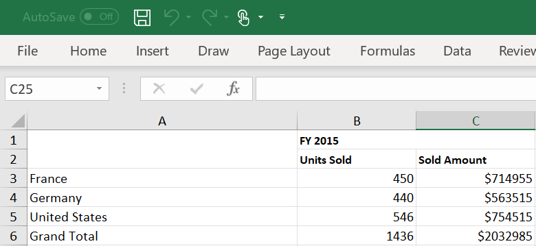
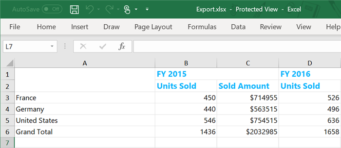
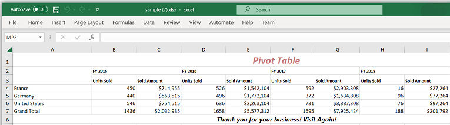
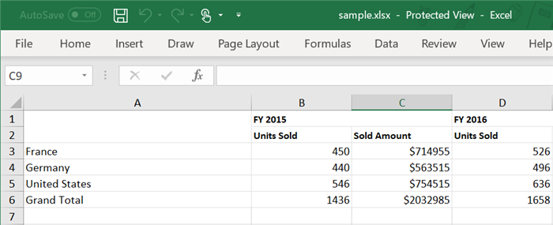
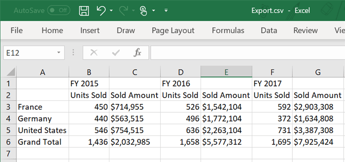
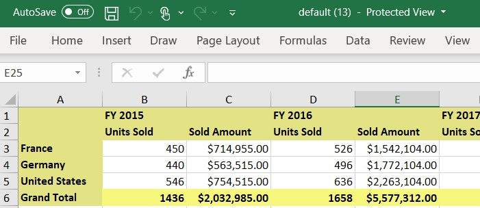

# Excel export in Blazor Pivot Table component

The Excel export feature allows you to export Pivot Table data as an Excel document for offline analysis and reporting. To enable Excel export functionality in the Pivot Table, set the [AllowExcelExport](https://help.syncfusion.com/cr/blazor/Syncfusion.Blazor.PivotView.SfPivotView-1.html#Syncfusion_Blazor_PivotView_SfPivotView_1_AllowExcelExport) property in [SfPivotView](https://help.syncfusion.com/cr/blazor/Syncfusion.Blazor.PivotView.SfPivotView-1.html) class to **true**. Once enabled, use the [ExportToExcelAsync](https://help.syncfusion.com/cr/blazor/Syncfusion.Blazor.PivotView.SfPivotView-1.html#Syncfusion_Blazor_PivotView_SfPivotView_1_ExportToExcelAsync_Syncfusion_Blazor_Grids_ExcelExportProperties_System_Nullable_System_Boolean__System_Object_System_Nullable_System_Boolean__System_Boolean_) method to perform the Excel export operation.

This method accepts a boolean parameter, **"asMemoryStream"**, which determines the export behavior:

* **false:** Downloads the Excel file directly.
* **true:** Returns the file as a memory stream for custom processing, storage, or manipulation.

In the following example, an external button is used to start the Excel export process. When the user clicks the button, the [ExportToExcelAsync](https://help.syncfusion.com/cr/blazor/Syncfusion.Blazor.PivotView.SfPivotView-1.html#Syncfusion_Blazor_PivotView_SfPivotView_1_ExportToExcelAsync_Syncfusion_Blazor_Grids_ExcelExportProperties_System_Nullable_System_Boolean__System_Object_System_Nullable_System_Boolean__System_Boolean_) method is called so that the Pivot Table data can be saved as an Excel file. In this example, **false** is used to initiate a direct download.

N> The Pivot Table component can be exported to Excel format using options available in the toolbar. For more details [refer](./tool-bar) here.

```cshtml
@using Syncfusion.Blazor.PivotView
@using Syncfusion.Blazor.Buttons

<SfButton OnClick="OnExcelExport" Content="Excel Export"></SfButton>
<SfPivotView TValue="ProductDetails" @ref="@pivot" AllowExcelExport="true" >
    <PivotViewDataSourceSettings DataSource="@data" EnableSorting=true>
        <PivotViewColumns>
            <PivotViewColumn Name="Year"></PivotViewColumn>
            <PivotViewColumn Name="Quarter"></PivotViewColumn>
        </PivotViewColumns>
        <PivotViewRows>
            <PivotViewRow Name="Country"></PivotViewRow>
            <PivotViewRow Name="Products"></PivotViewRow>
        </PivotViewRows>
        <PivotViewValues>
            <PivotViewValue Name="Sold" Caption="Units Sold"></PivotViewValue>
            <PivotViewValue Name="Amount" Caption="Sold Amount"></PivotViewValue>
        </PivotViewValues>
        <PivotViewFormatSettings>
            <PivotViewFormatSetting Name="Amount" Format="C0" UseGrouping=true></PivotViewFormatSetting>
        </PivotViewFormatSettings>
    </PivotViewDataSourceSettings>
</SfPivotView>

@code{
    SfPivotView<ProductDetails> pivot;
    public List<ProductDetails> data { get; set; }
    protected override void OnInitialized()
    {
        this.data = ProductDetails.GetProductData().ToList();
       //Bind the data source collection here. Refer "Assigning sample data to the pivot table" section in getting started for more details.
    }

    public void OnExcelExport(Microsoft.AspNetCore.Components.Web.MouseEventArgs args){
        this.pivot.ExportToExcelAsync(false);
    }
}
```



## Changing the Pivot Table style while exporting

The Excel export provides an option to change colors for headers, caption, and records in Pivot Table before exporting. To apply colors, define [Theme](https://help.syncfusion.com/cr/blazor/Syncfusion.Blazor.Grids.ExcelExportProperties.html#Syncfusion_Blazor_Grids_ExcelExportProperties_Theme) settings in [ExcelExportProperties](https://help.syncfusion.com/cr/blazor/Syncfusion.Blazor.Grids.ExcelExportProperties.html) class and pass it as a parameter to the [ExportToExcelAsync](https://help.syncfusion.com/cr/blazor/Syncfusion.Blazor.PivotView.SfPivotView-1.html#Syncfusion_Blazor_PivotView_SfPivotView_1_ExportToExcelAsync_Syncfusion_Blazor_Grids_ExcelExportProperties_System_Nullable_System_Boolean__System_Object_System_Nullable_System_Boolean__System_Boolean_) method.

N> By default, material theme is applied to exported Excel document.

```cshtml
@using Syncfusion.Blazor.PivotView
@using Syncfusion.Blazor.Buttons

<SfButton OnClick="OnExcelExport" Content="Excel Export"></SfButton>
<SfPivotView TValue="ProductDetails" @ref="@pivot" AllowExcelExport="true" >
    <PivotViewDataSourceSettings DataSource="@data" EnableSorting=true>
        <PivotViewColumns>
            <PivotViewColumn Name="Year"></PivotViewColumn>
            <PivotViewColumn Name="Quarter"></PivotViewColumn>
        </PivotViewColumns>
        <PivotViewRows>
            <PivotViewRow Name="Country"></PivotViewRow>
            <PivotViewRow Name="Products"></PivotViewRow>
        </PivotViewRows>
        <PivotViewValues>
            <PivotViewValue Name="Sold" Caption="Units Sold"></PivotViewValue>
            <PivotViewValue Name="Amount" Caption="Sold Amount"></PivotViewValue>
        </PivotViewValues>
        <PivotViewFormatSettings>
            <PivotViewFormatSetting Name="Amount" Format="C0" UseGrouping=true></PivotViewFormatSetting>
        </PivotViewFormatSettings>
    </PivotViewDataSourceSettings>
</SfPivotView>

@code{
    SfPivotView<ProductDetails> pivot;
    public List<ProductDetails> data { get; set; }
    protected override void OnInitialized()
    {
        this.data = ProductDetails.GetProductData().ToList();
       //Bind the data source collection here. Refer "Assigning sample data to the pivot table" section in getting started for more details.
    }

    public void OnExcelExport(Microsoft.AspNetCore.Components.Web.MouseEventArgs args)
    {
        Syncfusion.Blazor.Grids.ExcelExportProperties excelExportProperties = new Syncfusion.Blazor.Grids.ExcelExportProperties()
        {
            Theme = new Syncfusion.Blazor.Grids.ExcelTheme()
            {
                Header = new Syncfusion.Blazor.Grids.ExcelStyle() { FontName = "Segoe UI", FontColor = "#0fb5fc", FontSize = 15, Bold = true },
                Record = new Syncfusion.Blazor.Grids.ExcelStyle() { FontName = "Segoe UI", FontColor = "#000000" },
                Caption = new Syncfusion.Blazor.Grids.ExcelStyle() { FontName = "Segoe UI", FontColor = "#000000" }
            }
        };
        this.pivot.ExportToExcelAsync(excelExportProperties);
    }
}
```



## Add header and footer while exporting

The Excel export provides an option to include header and footer content for the Excel document before exporting. To add header and footer, define [Header](https://help.syncfusion.com/cr/blazor/Syncfusion.Blazor.Grids.ExcelExportProperties.html#Syncfusion_Blazor_Grids_ExcelExportProperties_Header) and [Footer](https://help.syncfusion.com/cr/blazor/Syncfusion.Blazor.Grids.ExcelExportProperties.html#Syncfusion_Blazor_Grids_ExcelExportProperties_Footer) properties in [ExcelExportProperties](https://help.syncfusion.com/cr/blazor/Syncfusion.Blazor.Grids.ExcelExportProperties.html) and pass it as a parameter to the [ExportToExcelAsync](https://help.syncfusion.com/cr/blazor/Syncfusion.Blazor.PivotView.SfPivotView-1.html#Syncfusion_Blazor_PivotView_SfPivotView_1_ExportToExcelAsync_Syncfusion_Blazor_Grids_ExcelExportProperties_System_Nullable_System_Boolean__System_Object_System_Nullable_System_Boolean__System_Boolean_) method.

```cshtml
@using Syncfusion.Blazor.PivotView
@using Syncfusion.Blazor.Buttons

<SfButton OnClick="OnExcelExport" Content="Excel Export"></SfButton>
<SfPivotView TValue="ProductDetails" @ref="@pivot" AllowExcelExport="true">
    <PivotViewDataSourceSettings DataSource="@Data" EnableSorting=true>
        <PivotViewColumns>
            <PivotViewColumn Name="Year"></PivotViewColumn>
            <PivotViewColumn Name="Quarter"></PivotViewColumn>
        </PivotViewColumns>
        <PivotViewRows>
            <PivotViewRow Name="Country"></PivotViewRow>
            <PivotViewRow Name="Products"></PivotViewRow>
        </PivotViewRows>
        <PivotViewValues>
            <PivotViewValue Name="Sold" Caption="Units Sold"></PivotViewValue>
            <PivotViewValue Name="Amount" Caption="Sold Amount"></PivotViewValue>
        </PivotViewValues>
        <PivotViewFormatSettings>
            <PivotViewFormatSetting Name="Amount" Format="C0" UseGrouping=true></PivotViewFormatSetting>
        </PivotViewFormatSettings>
    </PivotViewDataSourceSettings>
</SfPivotView>

@code {
    SfPivotView<ProductDetails> pivot;
    public List<ProductDetails> Data { get; set; }
    protected override void OnInitialized()
    {
        this.Data = ProductDetails.GetProductData().ToList();
    }

    public async Task OnExcelExport(Microsoft.AspNetCore.Components.Web.MouseEventArgs args)
    {
        Syncfusion.Blazor.Grids.ExcelExportProperties ExportProperties = new Syncfusion.Blazor.Grids.ExcelExportProperties();
        Syncfusion.Blazor.Grids.ExcelHeader header = new Syncfusion.Blazor.Grids.ExcelHeader();
        Syncfusion.Blazor.Grids.ExcelFooter footer = new Syncfusion.Blazor.Grids.ExcelFooter();
        header.HeaderRows = 1;
        footer.FooterRows = 1;
        List<Syncfusion.Blazor.Grids.ExcelRow> headerContent = new List<Syncfusion.Blazor.Grids.ExcelRow>
        {
            new Syncfusion.Blazor.Grids.ExcelRow() { Index = 1, Cells = new List<Syncfusion.Blazor.Grids.ExcelCell>
            {
                new Syncfusion.Blazor.Grids.ExcelCell() { Index=1, RowSpan= 1,ColSpan=11 , Value= "Pivot Table", Style = new Syncfusion.Blazor.Grids.ExcelStyle() { FontColor = "#C67878" ,Bold = true, FontSize = 20, Italic= true, HAlign = Syncfusion.Blazor.Grids.ExcelHorizontalAlign.Center }  },
            } },
        };
        List<Syncfusion.Blazor.Grids.ExcelRow> footerContent = new List<Syncfusion.Blazor.Grids.ExcelRow>
        {
            new Syncfusion.Blazor.Grids.ExcelRow() { Index = 1, Cells = new List<Syncfusion.Blazor.Grids.ExcelCell>
            {
                new Syncfusion.Blazor.Grids.ExcelCell() { Index=1, RowSpan= 1,ColSpan=11 , Value= "Thank you for your business! Visit Again!", Style = new Syncfusion.Blazor.Grids.ExcelStyle() { Bold = true, FontSize = 13, Italic= true,  HAlign = Syncfusion.Blazor.Grids.ExcelHorizontalAlign.Center }  },
            } },
        };
        header.Rows = headerContent;
        footer.Rows = footerContent;
        Syncfusion.Blazor.Grids.ExcelExportProperties excelExportProperties = new Syncfusion.Blazor.Grids.ExcelExportProperties()
        {
            FileName = "sample.xlsx",
            Header = header,
            Footer = footer,
        };
        await this.pivot.ExportToExcelAsync(excelExportProperties);
    }
}
```



## Changing the file name while exporting

This option provides flexibility to specify a custom file name for your exported Excel document, making it easier to organize and identify your exported data files. To change the file name, define [FileName](https://help.syncfusion.com/cr/blazor/Syncfusion.Blazor.Grids.ExcelExportProperties.html#Syncfusion_Blazor_Grids_ExcelExportProperties_FileName) property in [ExcelExportProperties](https://help.syncfusion.com/cr/blazor/Syncfusion.Blazor.Grids.ExcelExportProperties.html) class and pass it as a parameter to the [ExportToExcelAsync](https://help.syncfusion.com/cr/blazor/Syncfusion.Blazor.PivotView.SfPivotView-1.html#Syncfusion_Blazor_PivotView_SfPivotView_1_ExportToExcelAsync_Syncfusion_Blazor_Grids_ExcelExportProperties_System_Nullable_System_Boolean__System_Object_System_Nullable_System_Boolean__System_Boolean_) method.

```cshtml
@using Syncfusion.Blazor.PivotView
@using Syncfusion.Blazor.Buttons

<SfButton OnClick="OnExcelExport" Content="Excel Export"></SfButton>
<SfPivotView TValue="ProductDetails" @ref="@pivot" AllowExcelExport="true" >
    <PivotViewDataSourceSettings DataSource="@data" EnableSorting=true>
        <PivotViewColumns>
            <PivotViewColumn Name="Year"></PivotViewColumn>
            <PivotViewColumn Name="Quarter"></PivotViewColumn>
        </PivotViewColumns>
        <PivotViewRows>
            <PivotViewRow Name="Country"></PivotViewRow>
            <PivotViewRow Name="Products"></PivotViewRow>
        </PivotViewRows>
        <PivotViewValues>
            <PivotViewValue Name="Sold" Caption="Units Sold"></PivotViewValue>
            <PivotViewValue Name="Amount" Caption="Sold Amount"></PivotViewValue>
        </PivotViewValues>
        <PivotViewFormatSettings>
            <PivotViewFormatSetting Name="Amount" Format="C0" UseGrouping=true></PivotViewFormatSetting>
        </PivotViewFormatSettings>
    </PivotViewDataSourceSettings>
</SfPivotView>

@code{
    SfPivotView<ProductDetails> pivot;
    public List<ProductDetails> data { get; set; }
    protected override void OnInitialized()
    {
        this.data = ProductDetails.GetProductData().ToList();
       //Bind the data source collection here. Refer "Assigning sample data to the pivot table" section in getting started for more details.
    }

    public void OnExcelExport(Microsoft.AspNetCore.Components.Web.MouseEventArgs args) {
        Syncfusion.Blazor.Grids.ExcelExportProperties excelExportProperties = new Syncfusion.Blazor.Grids.ExcelExportProperties()
        {
            FileName = "sample.xlsx"
        };
        this.pivot.ExportToExcelAsync(excelExportProperties);
    }
}
```



## Limitation when exporting millions of records to Excel format

Understanding this limitation helps you choose the appropriate export format based on your data size requirements and ensures optimal performance for large datasets. By default, Microsoft Excel supports only 1,048,576 records in an Excel sheet. Therefore, it is not possible to export millions of records to Excel format. You can refer to the [documentation link](https://support.microsoft.com/en-gb/office/excel-specifications-and-limits-1672b34d-7043-467e-8e27-269d656771c3) for more details on Microsoft Excel specifications and limits. For large datasets, it is recommended to export the data in CSV (Comma-Separated Values) or other formats that can handle large datasets more efficiently than Excel.

## CSV Export

The CSV export option allows you to export Pivot Table data as a plain text CSV file, making it easy to use the data with other spreadsheet or data analysis applications. To export the Pivot Table as a CSV file, ensure that the [AllowExcelExport](https://help.syncfusion.com/cr/blazor/Syncfusion.Blazor.PivotView.SfPivotView-1.html#Syncfusion_Blazor_PivotView_SfPivotView_1_AllowExcelExport) property in [SfPivotView](https://help.syncfusion.com/cr/blazor/Syncfusion.Blazor.PivotView.SfPivotView-1.html) class is set to **true**. Then, use the [ExportToCsvAsync](https://help.syncfusion.com/cr/blazor/Syncfusion.Blazor.PivotView.SfPivotView-1.html#Syncfusion_Blazor_PivotView_SfPivotView_1_ExportToCsvAsync_System_Boolean_Syncfusion_Blazor_Grids_ExcelExportProperties_System_Boolean_) method to perform the CSV export operation.

This method accepts a boolean parameter, **"asMemoryStream"**, which determines the export behavior:

* **false:** Downloads the Excel file directly.
* **true:** Returns the file as a memory stream for custom processing, storage, or manipulation.

In the following example, an external button is used to start the CSV export process. When the user clicks the button, the [ExportToCsvAsync](https://help.syncfusion.com/cr/blazor/Syncfusion.Blazor.PivotView.SfPivotView-1.html#Syncfusion_Blazor_PivotView_SfPivotView_1_ExportToCsvAsync_System_Boolean_Syncfusion_Blazor_Grids_ExcelExportProperties_System_Boolean_) method is called so that the Pivot Table data can be saved as a CSV file. In this example, **false** is used to initiate a direct download.

N> The Pivot Table component can be exported to CSV format using options available in the toolbar. For more details [refer](./tool-bar) here.

```cshtml
@using Syncfusion.Blazor.PivotView
@using Syncfusion.Blazor.Buttons

<SfButton OnClick="OnCsvExport" Content="Csv Export"></SfButton>
<SfPivotView TValue="ProductDetails" @ref="@pivot" AllowExcelExport="true" >
    <PivotViewDataSourceSettings DataSource="@Data" EnableSorting=true>
        <PivotViewColumns>
            <PivotViewColumn Name="Year"></PivotViewColumn>
            <PivotViewColumn Name="Quarter"></PivotViewColumn>
        </PivotViewColumns>
        <PivotViewRows>
            <PivotViewRow Name="Country"></PivotViewRow>
            <PivotViewRow Name="Products"></PivotViewRow>
        </PivotViewRows>
        <PivotViewValues>
            <PivotViewValue Name="Sold" Caption="Units Sold"></PivotViewValue>
            <PivotViewValue Name="Amount" Caption="Sold Amount"></PivotViewValue>
        </PivotViewValues>
        <PivotViewFormatSettings>
            <PivotViewFormatSetting Name="Amount" Format="C0" UseGrouping=true></PivotViewFormatSetting>
        </PivotViewFormatSettings>
    </PivotViewDataSourceSettings>
</SfPivotView>

@code{
    SfPivotView<ProductDetails> pivot;

    public List<ProductDetails> Data { get; set; }

    protected override void OnInitialized()
    {
        this.Data = ProductDetails.GetProductData().ToList();
       //Bind the data source collection here. Refer "Assigning sample data to the pivot table" section in getting started for more details.
    }

    public void OnCsvExport() {
        this.pivot.ExportToCsvAsync(false);
    }
}
```



## Export all pages

This option gives flexibility to export either the entire dataset rendered by the Pivot Table (all pages) or just the data currently visible in the viewport. To export the entire Pivot Table data, ensure the [EnableVirtualization](https://help.syncfusion.com/cr/blazor/Syncfusion.Blazor.PivotView.SfPivotView-1.html#Syncfusion_Blazor_PivotView_SfPivotView_1_EnableVirtualization) property in the [SfPivotView](https://help.syncfusion.com/cr/blazor/Syncfusion.Blazor.PivotView.SfPivotView-1.html) is set to **true**. Set the [ExportAllPages](https://help.syncfusion.com/cr/blazor/Syncfusion.Blazor.PivotView.SfPivotView-1.html#Syncfusion_Blazor_PivotView_SfPivotView_1_ExportAllPages) property to **false** to export only the visible records. This setting applies to both Excel and CSV exports.

```cshtml
@using Syncfusion.Blazor.PivotView

<SfPivotView TValue="ProductDetails" Height="400" Width="100%" ShowGroupingBar="true" EnableVirtualization=true ShowToolbar=true Toolbar="@Options" ExportAllPages=false AllowExcelExport=true>
    <PivotViewDataSourceSettings DataSource="@Data">
        <PivotViewColumns>
            <PivotViewColumn Name="Year"></PivotViewColumn>
            <PivotViewColumn Name="Products"></PivotViewColumn>
               <PivotViewColumn Name="Quarter"></PivotViewColumn>
        </PivotViewColumns>
        <PivotViewRows>
            <PivotViewRow Name="Sold"></PivotViewRow>
            <PivotViewRow Name="Country"></PivotViewRow>
        </PivotViewRows>
        <PivotViewValues>
            <PivotViewValue Name="Amount" Caption="Sold Amount"></PivotViewValue>
        </PivotViewValues>
        <PivotViewFormatSettings>
            <PivotViewFormatSetting Name="Amount" Format="C"></PivotViewFormatSetting>
        </PivotViewFormatSettings>
    </PivotViewDataSourceSettings>
</SfPivotView>

@code{
    public List<ProductDetails> Data { get; set; }
    protected override void OnInitialized()
    {
        this.Data = ProductDetails.GetProductData().ToList();
          //Bind the data source collection here. Refer "Assigning sample data to the pivot table" section in getting started for more details.
    }
    public List<ToolbarItems> Options = new List<ToolbarItems> {
        ToolbarItems.Export,
    };
}
```

## Saving Excel document to stream

The user can save a Pivot Table as a memory stream instead of downloading it as an Excel file. This is done by setting the `asMemoryStream` parameter to `true` in the [ExportToExcelAsync](https://help.syncfusion.com/cr/blazor/Syncfusion.Blazor.PivotView.SfPivotView-1.html#Syncfusion_Blazor_PivotView_SfPivotView_1_ExcelExport_System_Object_System_Nullable_System_Boolean__System_Object_System_Nullable_System_Boolean__) method. The memory stream can then be processed or saved as needed.

N> This option requires [EnableVirtualization](https://help.syncfusion.com/cr/blazor/Syncfusion.Blazor.PivotView.SfPivotView-1.html#Syncfusion_Blazor_PivotView_SfPivotView_1_EnableVirtualization) to be set to `true` in the Pivot Table.

```cshtml
@using Syncfusion.Blazor.PivotView
@using Syncfusion.Blazor.Buttons
@using Syncfusion.Blazor
@inject IJSRuntime JSRuntime

<SfButton OnClick="OnExcelExport" Content="Excel Export"></SfButton>
<SfPivotView TValue="ProductDetails" @ref="@pivot" AllowExcelExport="true" ShowValuesButton="true" EnableVirtualization="true">
    <PivotViewDataSourceSettings DataSource="@Data" EnableSorting="true">
        <PivotViewColumns>
            <PivotViewColumn Name="Year"></PivotViewColumn>
            <PivotViewColumn Name="Quarter"></PivotViewColumn>
        </PivotViewColumns>
        <PivotViewRows>
            <PivotViewRow Name="Country"></PivotViewRow>
            <PivotViewRow Name="Products"></PivotViewRow>
        </PivotViewRows>
        <PivotViewValues>
            <PivotViewValue Name="Sold" Caption="Units Sold"></PivotViewValue>
            <PivotViewValue Name="Amount" Caption="Sold Amount"></PivotViewValue>
        </PivotViewValues>
        <PivotViewFormatSettings>
            <PivotViewFormatSetting Name="Amount" Format="C0" UseGrouping="true"></PivotViewFormatSetting>
        </PivotViewFormatSettings>
    </PivotViewDataSourceSettings>
</SfPivotView>

<script type="text/javascript">
    function saveAsFile(filename, bytesBase64) {
        var link = document.createElement('a');
        link.download = filename;
        link.href = "data:application/octet-stream;base64," + bytesBase64;
        document.body.appendChild(link);
        link.click();
        document.body.removeChild(link);
    }
</script>

@code {
    private SfPivotView<ProductDetails> pivot;
    private List<ProductDetails> Data { get; set; }
    protected override void OnInitialized()
    {
        //Bind the data source collection here. Refer "Assigning sample data to the pivot table" section in getting started for more details.
        this.Data = ProductDetails.GetProductData().ToList();
    }
    private async Task OnExcelExport(Microsoft.AspNetCore.Components.Web.MouseEventArgs args)
    {
        System.IO.MemoryStream memoryStream = new System.IO.MemoryStream();
        //Excel document as a memory stream by setting the first parameter as "true" in the "ExportToExcelAsync" method.
        memoryStream = await this.pivot.ExportToExcelAsync(true);
        // You can then process the memory stream based on your needs and save it as mentioned in the last statement.
        await JSRuntime.InvokeVoidAsync("saveAsFile", new object[] { "default.xlsx", Convert.ToBase64String(memoryStream.ToArray()),true });
    }
}
```

## Events

### ExcelQueryCellInfo

The [ExcelQueryCellInfo](https://help.syncfusion.com/cr/blazor/Syncfusion.Blazor.PivotView.PivotViewEvents-1.html#Syncfusion_Blazor_PivotView_PivotViewEvents_1_ExcelQueryCellInfo) event is triggered during the creation of each row and value cell while exporting data to Excel. This event offers options to change the content and style of individual cells in the exported Excel document, improving the flexibility and appearance of exported reports. It has the following parameters:

* [Value](https://help.syncfusion.com/cr/blazor/Syncfusion.Blazor.Grids.ExcelQueryCellInfoEventArgs-1.html#Syncfusion_Blazor_Grids_ExcelQueryCellInfoEventArgs_1_Value) : Represents the value of the current cell in the exported Excel sheet.
* [Column](https://help.syncfusion.com/cr/blazor/Syncfusion.Blazor.Grids.ExcelQueryCellInfoEventArgs-1.html#Syncfusion_Blazor_Grids_ExcelQueryCellInfoEventArgs_1_Column) : Provides details about the column to which the current cell belongs. **Note:** This option is applicable only when virtualization is disabled.
* [Cell](https://help.syncfusion.com/cr/blazor/Syncfusion.Blazor.Grids.ExcelQueryCellInfoEventArgs-1.html#Syncfusion_Blazor_Grids_ExcelQueryCellInfoEventArgs_1_Cell) : It holds the current cell information.
* [Style](https://help.syncfusion.com/cr/blazor/Syncfusion.Blazor.Grids.ExcelQueryCellInfoEventArgs-1.html#Syncfusion_Blazor_Grids_ExcelQueryCellInfoEventArgs_1_Style) : Defines the style properties (such as font, color, borders) applied to the current cell.
* [RowIndex](https://help.syncfusion.com/cr/blazor/Syncfusion.Blazor.Grids.ExcelQueryCellInfoEventArgs-1.html#Syncfusion_Blazor_Grids_ExcelQueryCellInfoEventArgs_1_RowIndex) : It holds the row index required to get the current cell information. **Note:** When virtualization is enabled, this option is applicable.
* [ColumnIndex](https://help.syncfusion.com/cr/blazor/Syncfusion.Blazor.Grids.ExcelQueryCellInfoEventArgs-1.html#Syncfusion_Blazor_Grids_ExcelQueryCellInfoEventArgs_1_ColumnIndex) : It holds the column index required to get the current cell information. **Note:** When virtualization is enabled, this option is applicable.

```cshtml
@using Syncfusion.Blazor.PivotView
@using Syncfusion.Blazor.Buttons
@using Syncfusion.Blazor.Grids

<SfButton OnClick="OnExcelExport" Content="Excel Export"></SfButton>
<SfPivotView TValue="ProductDetails" @ref="@pivot" EnableVirtualization="true" AllowExcelExport="true">
    <PivotViewDataSourceSettings DataSource="@Data" ExpandAll="false" EnableSorting="true">
        <PivotViewColumns>
            <PivotViewColumn Name="Year"></PivotViewColumn>
            <PivotViewColumn Name="Quarter"></PivotViewColumn>
        </PivotViewColumns>
        <PivotViewRows>
            <PivotViewRow Name="Country"></PivotViewRow>
            <PivotViewRow Name="Products"></PivotViewRow>
        </PivotViewRows>
        <PivotViewValues>
            <PivotViewValue Name="Sold" Caption="Units Sold"></PivotViewValue>
            <PivotViewValue Name="Amount" Caption="Sold Amount"></PivotViewValue>
        </PivotViewValues>
        <PivotViewFormatSettings>
            <PivotViewFormatSetting Name="Amount" Format="C0" UseGrouping=true></PivotViewFormatSetting>
        </PivotViewFormatSettings>
    </PivotViewDataSourceSettings>
    <PivotViewEvents TValue="ProductDetails" ExcelQueryCellInfo="ExcelQueryEvent"></PivotViewEvents>
</SfPivotView>

@code{
    private SfPivotView<ProductDetails> pivot;
    public List<ProductDetails> Data { get; set; }

    protected override void OnInitialized()
    {
        this.Data = ProductDetails.GetProductData().ToList();
        // Bind the data source collection here. Refer "Assigning sample data to the pivot table" section in getting started for more details.
    }

    public void OnExcelExport(Microsoft.AspNetCore.Components.Web.MouseEventArgs args)
    {
        this.pivot.ExportToExcelAsync(false);
    }

    // Triggers every time for row header and value cells during exporting.
    public void ExcelQueryEvent(ExcelQueryCellInfoEventArgs<ProductDetails> args)
    {
        Matrix<Matrix<AxisSet>> pivotValues = pivot?.PivotValues;
        AxisSet cellInfo = null;

        if (pivot?.EnableVirtualization == true)
        {
            if (pivotValues != null)
            {
                cellInfo = pivotValues[args.RowIndex]?[args.ColumnIndex];
            }
        }
        else
        {
            IDictionary<string, object> cellCoordinates = args.Column?.CustomAttributes;
            if (pivotValues != null && cellCoordinates != null && cellCoordinates.ContainsKey("aria-colindex") && cellCoordinates.ContainsKey("aria-rowindex"))
            {
                // You will get the row index required to find the current cell information from the pivot value collection here.
                int rowIndex = int.Parse(cellCoordinates["aria-rowindex"].ToString(), System.Globalization.NumberStyles.None);
                // You will get the column index required to find the current cell information from the pivot value collection here.
                int colIndex = int.Parse(cellCoordinates["aria-colindex"].ToString(), System.Globalization.NumberStyles.None);
                cellInfo = pivotValues[rowIndex]?[colIndex];
            }
        }
        if (cellInfo?.IsGrandSum == true || cellInfo?.Axis == "row")
        {
            args.Cell.Value = cellInfo?.Axis == "value" ? cellInfo?.Value : cellInfo?.FormattedText;
            args.Style.BackColor = args.Cell.CellStyle.BackColor = cellInfo?.Axis == "row" ? "#e3e384" : "#f7f77c";
            args.Style.Bold = args.Cell.CellStyle.Bold = true;
        }
    }
}
```

### ExcelHeaderQueryCellInfo

N> The row header cell can be obtained by using the `ExcelQueryCellInfo` event. It can be identified using `AxisSet.Axis == "row"` and for reference, see the code snippet in the previous topic.

The [ExcelHeaderQueryCellInfo](https://help.syncfusion.com/cr/blazor/Syncfusion.Blazor.PivotView.PivotViewEvents-1.html#Syncfusion_Blazor_PivotView_PivotViewEvents_1_ExcelHeaderQueryCellInfo) event provides the ability to modify header cell appearance and content during Excel export, ensuring exported documents match specific formatting requirements or business standards. This event triggers while processing each header cell during the Excel export operation. It has the following parameters:

* [Value](https://help.syncfusion.com/cr/blazor/Syncfusion.Blazor.Grids.ExcelHeaderQueryCellInfoEventArgs.html#Syncfusion_Blazor_Grids_ExcelHeaderQueryCellInfoEventArgs_Value) : Represents the value of the current cell in the exported Excel sheet.
* [Column](https://help.syncfusion.com/cr/blazor/Syncfusion.Blazor.Grids.ExcelHeaderQueryCellInfoEventArgs.html#Syncfusion_Blazor_Grids_ExcelHeaderQueryCellInfoEventArgs_Column) : Provides details about the column to which the current cell belongs. **Note:** This option is applicable only when virtualization is disabled.
* [Cell](https://help.syncfusion.com/cr/blazor/Syncfusion.Blazor.Grids.ExcelHeaderQueryCellInfoEventArgs.html#Syncfusion_Blazor_Grids_ExcelHeaderQueryCellInfoEventArgs_Cell) : Contains the current cell information and properties.
* [Style](https://help.syncfusion.com/cr/blazor/Syncfusion.Blazor.Grids.ExcelHeaderQueryCellInfoEventArgs.html#Syncfusion_Blazor_Grids_ExcelHeaderQueryCellInfoEventArgs_Style) : Contains the style properties that can be applied to the cell.
* [RowIndex](https://help.syncfusion.com/cr/blazor/Syncfusion.Blazor.Grids.ExcelHeaderQueryCellInfoEventArgs.html#Syncfusion_Blazor_Grids_ExcelHeaderQueryCellInfoEventArgs_RowIndex) : It holds the row index required to get the current cell information. **Note:** When virtualization is enabled, this option is applicable.
* [ColumnIndex](https://help.syncfusion.com/cr/blazor/Syncfusion.Blazor.Grids.ExcelHeaderQueryCellInfoEventArgs.html#Syncfusion_Blazor_Grids_ExcelHeaderQueryCellInfoEventArgs_ColumnIndex) : It holds the column index required to get the current cell information. **Note:** When virtualization is enabled, this option is applicable.

```cshtml
@using Syncfusion.Blazor.PivotView
@using Syncfusion.Blazor.Buttons
@using Syncfusion.Blazor.Grids

<SfButton OnClick="OnExcelExport" Content="Excel Export"></SfButton>
<SfPivotView TValue="ProductDetails" @ref="@pivot" EnableVirtualization="true"  AllowExcelExport="true" >
    <PivotViewDataSourceSettings DataSource="@data" ExpandAll="false" EnableSorting="true" >
        <PivotViewColumns>
            <PivotViewColumn Name="Year"></PivotViewColumn>
            <PivotViewColumn Name="Quarter"></PivotViewColumn>
        </PivotViewColumns>
        <PivotViewRows>
            <PivotViewRow Name="Country"></PivotViewRow>
            <PivotViewRow Name="Products"></PivotViewRow>
        </PivotViewRows>
        <PivotViewValues>
            <PivotViewValue Name="Sold" Caption="Units Sold"></PivotViewValue>
            <PivotViewValue Name="Amount" Caption="Sold Amount"></PivotViewValue>
        </PivotViewValues>
        <PivotViewFormatSettings>
            <PivotViewFormatSetting Name="Amount" Format="C0" UseGrouping=true></PivotViewFormatSetting>
        </PivotViewFormatSettings>
    </PivotViewDataSourceSettings>
    <PivotViewEvents TValue="ProductDetails" ExcelHeaderQueryCellInfo="ExcelHeaderEvent"></PivotViewEvents>
</SfPivotView>

@code{
    private SfPivotView<ProductDetails> pivot;
    public List<ProductDetails> data { get; set; }

    protected override void OnInitialized()
    {
        this.data = ProductDetails.GetProductData().ToList();
        // Bind the data source collection here. Refer "Assigning sample data to the pivot table" section in getting started for more details.
    }

    public void OnExcelExport(Microsoft.AspNetCore.Components.Web.MouseEventArgs args)
    {
        this.pivot.ExportToExcelAsync(false);
    }

    // Triggers every time for column header cells during exporting
    public void ExcelHeaderEvent(ExcelHeaderQueryCellInfoEventArgs args)
    {
        Matrix<Matrix<AxisSet>> pivotValues = pivot?.PivotValues;
        AxisSet cellInfo = null;

        if (pivot?.EnableVirtualization == true)
        {
            if (pivotValues != null)
            {
                cellInfo = pivotValues[args.RowIndex]?[args.ColumnIndex];
            }
        }
        else
        {
            IDictionary<string, object> cellCoordinates = args.Column?.CustomAttributes;
            if (pivotValues != null && cellCoordinates != null && cellCoordinates.ContainsKey("aria-colindex") && cellCoordinates.ContainsKey("index"))
            {
                // You will get the row index required to find the current cell information from the pivot value collection here.
                int rowIndex = int.Parse(cellCoordinates["index"].ToString(), System.Globalization.NumberStyles.None);
                // You will get the column index required to find the current cell information from the pivot value collection here.
                int colIndex = int.Parse(cellCoordinates["aria-colindex"].ToString(), System.Globalization.NumberStyles.None);
                cellInfo = pivotValues[rowIndex]?[colIndex];
            }
        }
        if (cellInfo != null)
        {
            args.Style.BackColor = args.Cell.CellStyle.BackColor = "#e3e384";
            args.Style.Bold = args.Cell.CellStyle.Bold = true;
        }
    }
}
```



N> You can refer to the [Blazor Pivot Table](https://www.syncfusion.com/blazor-components/blazor-pivot-table) feature tour page for its groundbreaking feature representations. You can also explore the [Blazor Pivot Table example](https://blazor.syncfusion.com/demos/pivot-table/default-functionalities?theme=bootstrap5) to know how to render and configure the pivot table.