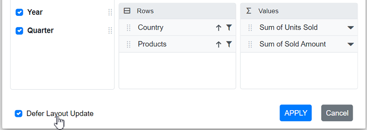

# Field List in Blazor Pivot Table Component

To have a quick glance on how to enable field list in the Blazor Pivot Table, watch this video:



The Field List makes it easy to organize and analyze data in your Pivot Table. It provides a user-friendly interface similar to Microsoft Excel that allows you to add or remove fields and move them between different axes like columns, rows, values, and filters. You can also apply sorting and filtering options while working with your data.

The field list can be displayed in two different formats to interact with pivot table. They are:

* **In-built Field List (Popup)**: Shows a field list icon in the Pivot Table interface. Click this icon to open the field list in a dialog box.
* **Stand-alone Field List (Fixed)**: Displays the field list in a fixed position on your web page alongside the Pivot Table.

## In-built Field List (Popup)

The built-in field list provides quick access to modify your Pivot Table report settings without taking up permanent space on your webpage. To enable the field list in pivot table UI, set the [ShowFieldList](https://help.syncfusion.com/cr/blazor/Syncfusion.Blazor.PivotView.SfPivotView-1.html#Syncfusion_Blazor_PivotView_SfPivotView_1_ShowFieldList) property in [SfPivotView](https://help.syncfusion.com/cr/blazor/Syncfusion.Blazor.PivotView.SfPivotView-1.html) class to **true**. A small icon will appear on the top left corner of the pivot table and clicking on this icon, field list dialog will appear.

N> The field list icon will be displayed at the top right corner of the pivot table, when grouping bar is enabled.

```cshtml
@using Syncfusion.Blazor.PivotView

<SfPivotView TValue="ProductDetails" ShowFieldList="true">
     <PivotViewDataSourceSettings DataSource="@dataSource">
        <PivotViewColumns>
            <PivotViewColumn Name="Year"></PivotViewColumn>
            <PivotViewColumn Name="Quarter"></PivotViewColumn>
        </PivotViewColumns>
        <PivotViewRows>
            <PivotViewRow Name="Country"></PivotViewRow>
            <PivotViewRow Name="Products"></PivotViewRow>
        </PivotViewRows>
        <PivotViewValues>
            <PivotViewValue Name="Sold" Caption="Units Sold"></PivotViewValue>
            <PivotViewValue Name="Amount" Caption="Sold Amount"></PivotViewValue>
        </PivotViewValues>
        <PivotViewFormatSettings>
            <PivotViewFormatSetting Name="Amount" Format="C"></PivotViewFormatSetting>
        </PivotViewFormatSettings>
    </PivotViewDataSourceSettings>
</SfPivotView>

@code{
    public List<ProductDetails> dataSource { get; set; }
    protected override void OnInitialized()
    {
        this.dataSource = ProductDetails.GetProductData().ToList();
        //Bind the data source collection here. Refer "Assigning sample data to the pivot table" section in getting started for more details.
    }
}
```


## Stand-alone Field List (Fixed)

The stand-alone Field List allows users to keep the Field List visible at a specific place on the web page, making it easy to access its options without opening a popup each time. To do so, you need to set the [RenderMode](https://help.syncfusion.com/cr/blazor/Syncfusion.Blazor.PivotView.SfPivotFieldList-1.html#Syncfusion_Blazor_PivotView_SfPivotFieldList_1_RenderMode) property to [Mode.Fixed](https://help.syncfusion.com/cr/blazor/Syncfusion.Blazor.PivotView.Mode.html) in [SfPivotFieldList](https://help.syncfusion.com/cr/blazor/Syncfusion.Blazor.PivotView.SfPivotFieldList-1.html).

N> To ensure the field list works seamlessly with the Pivot Table, use the [UpdateViewAsync](https://help.syncfusion.com/cr/blazor/Syncfusion.Blazor.PivotView.SfPivotFieldList-1.html#Syncfusion_Blazor_PivotView_SfPivotFieldList_1_UpdateViewAsync_Syncfusion_Blazor_PivotView_SfPivotView__0__) and [UpdateAsync](https://help.syncfusion.com/cr/blazor/Syncfusion.Blazor.PivotView.SfPivotFieldList-1.html#Syncfusion_Blazor_PivotView_SfPivotFieldList_1_UpdateAsync_Syncfusion_Blazor_PivotView_SfPivotView__0__) methods. These methods synchronize data source changes between the field list and Pivot Table components, keeping both components in sync when users make modifications.

```cshtml
<SfPivotView TValue="ProductDetails" ID="pivotview"  @ref="pivotView" Height="530">
    <PivotViewEvents TValue="ProductDetails" EnginePopulated="pivotenginepopulated"></PivotViewEvents>
</SfPivotView>
<SfPivotFieldList TValue="ProductDetails" ID="fieldlist" @ref="fieldList" RenderMode="Mode.Fixed" >
    <PivotFieldListDataSourceSettings DataSource="@data" EnableSorting=true>
        <PivotFieldListColumns>
            <PivotFieldListColumn Name="Year"></PivotFieldListColumn>
            <PivotFieldListColumn Name="Quarter"></PivotFieldListColumn>
        </PivotFieldListColumns>
        <PivotFieldListRows>
            <PivotFieldListRow Name="Country"></PivotFieldListRow>
            <PivotFieldListRow Name="Products"></PivotFieldListRow>
        </PivotFieldListRows>
        <PivotFieldListValues>
            <PivotFieldListValue Name="Sold" Caption="Unit Sold"></PivotFieldListValue>
            <PivotFieldListValue Name="Amount" Caption="Sold Amount"></PivotFieldListValue>
        </PivotFieldListValues>
    </PivotFieldListDataSourceSettings>
    <PivotFieldListEvents TValue="ProductDetails" EnginePopulated="enginepopulated"></PivotFieldListEvents>
</SfPivotFieldList>
<style>
    #fieldlist {
        width: 42%;
        height: 100%;
        float: right;
    }

    #pivotview {
        width: 57%;
        height: 530px;
        float: left;
    }
</style>
@code{
    SfPivotFieldList<ProductDetails> fieldList;
    SfPivotView<ProductDetails> pivotView;
    public List<ProductDetails> data { get; set; }
    protected override void OnInitialized()
    {
        this.data = ProductDetails.GetProductData();
    }

    public void pivotenginepopulated(EnginePopulatedEventArgs args)
    {
        this.fieldList.UpdateAsync(this.pivotView);
    }
    public void enginepopulated(EnginePopulatedEventArgs args)
    {
        this.fieldList.UpdateViewAsync(this.pivotView);
    }
}
```


## Search desired field

The field search option helps you quickly locate and work with specific fields in the Field List. Instead of scrolling through the entire list of available fields, you can simply type the field name in the search box to instantly filter and find the desired field.

You can enable the field search option in two different Field List configurations: the Stand-alone Field List or the Pivot Table's built-in popup Field List.

**Stand-alone Field List**

To enable the search box in the stand-alone Field List UI, set the [ShowFieldSearch](https://help.syncfusion.com/cr/blazor/Syncfusion.Blazor.PivotView.SfPivotFieldList-1.html#Syncfusion_Blazor_PivotView_SfPivotFieldList_1_ShowFieldSearch) property to **true** in [SfPivotFieldList](https://help.syncfusion.com/cr/blazor/Syncfusion.Blazor.PivotView.SfPivotFieldList-1.html).

N> By default, the field search option is disabled in the Field List UI. Furthermore, this option is only available for relational data sources.

```cshtml
<SfPivotFieldList TValue="ProductDetails" ID="fieldlist" @ref="fieldList" ShowFieldSearch="true" RenderMode="Mode.Fixed" >
    <PivotFieldListDataSourceSettings DataSource="@data" EnableSorting=true>
        <PivotFieldListColumns>
            <PivotFieldListColumn Name="Year"></PivotFieldListColumn>
            <PivotFieldListColumn Name="Quarter"></PivotFieldListColumn>
        </PivotFieldListColumns>
        <PivotFieldListRows>
            <PivotFieldListRow Name="Country"></PivotFieldListRow>
            <PivotFieldListRow Name="Products"></PivotFieldListRow>
        </PivotFieldListRows>
        <PivotFieldListValues>
            <PivotFieldListValue Name="Sold" Caption="Unit Sold"></PivotFieldListValue>
            <PivotFieldListValue Name="Amount" Caption="Sold Amount"></PivotFieldListValue>
        </PivotFieldListValues>
    </PivotFieldListDataSourceSettings>
</SfPivotFieldList>
<style>
    #fieldlist {
        width: 42%;
        height: 100%;
        float: right;
    }
</style>
@code{
    private SfPivotFieldList<ProductDetails> fieldList;
    private List<ProductDetails> data { get; set; }
    protected override void OnInitialized()
    {
        this.data = ProductDetails.GetProductData();
        //Bind the data source collection here. Refer "Assigning sample data to the pivot table" section in getting started for more details.
    }   
}
```


**Pivot Table's Built-in Popup Field List**

To enable the search box in the Pivot Table's built-in popup Field List UI, set the [ShowFieldSearch](https://help.syncfusion.com/cr/blazor/Syncfusion.Blazor.PivotView.SfPivotView-1.html#Syncfusion_Blazor_PivotView_SfPivotView_1_ShowFieldSearch) property to **true** in [SfPivotView](https://help.syncfusion.com/cr/blazor/Syncfusion.Blazor.PivotView.SfPivotView-1.html).

```cshtml
@using Syncfusion.Blazor.PivotView

<SfPivotView TValue="ProductDetails" ShowFieldList="true" ShowFieldSearch="true">
     <PivotViewDataSourceSettings DataSource="@dataSource">
        <PivotViewColumns>
            <PivotViewColumn Name="Year"></PivotViewColumn>
            <PivotViewColumn Name="Quarter"></PivotViewColumn>
        </PivotViewColumns>
        <PivotViewRows>
            <PivotViewRow Name="Country"></PivotViewRow>
            <PivotViewRow Name="Products"></PivotViewRow>
        </PivotViewRows>
        <PivotViewValues>
            <PivotViewValue Name="Sold" Caption="Units Sold"></PivotViewValue>
            <PivotViewValue Name="Amount" Caption="Sold Amount"></PivotViewValue>
        </PivotViewValues>
        <PivotViewFormatSettings>
            <PivotViewFormatSetting Name="Amount" Format="C"></PivotViewFormatSetting>
        </PivotViewFormatSettings>
    </PivotViewDataSourceSettings>
</SfPivotView>

@code{
    private List<ProductDetails> dataSource { get; set; }
    protected override void OnInitialized()
    {
        this.dataSource = ProductDetails.GetProductData();
        //Bind the data source collection here. Refer "Assigning sample data to the pivot table" section in getting started for more details.
    }
}
```


## Option to sort fields

The field list provides a simple way to organize fields in different orders, making it easier to locate and work with the data you need. Users can sort fields in the field list UI in ascending, descending, or default order (as obtained from the data source) using the built-in sort icons.

N> By default, fields are displayed in the default order as they appear in the data source.


## Add or remove fields

The Field List allows users to quickly modify their data analysis by selecting or unselecting fields as needed. Using the checkbox beside each field, users can easily add fields to include them in the report or remove fields to exclude them from the current analysis at runtime.


## Remove specific field(s) from displaying

When you connect a data source to the Pivot Table, all available fields from the data source are automatically shown in the field list. If you want to hide certain fields from the field list, you can do so easily. To hide one or more fields, add their names to the [ExcludeFields](https://help.syncfusion.com/cr/blazor/Syncfusion.Blazor.PivotView.PivotViewDataSourceSettings-1.html#Syncfusion_Blazor_PivotView_PivotViewDataSourceSettings_1_ExcludeFields) option inside the [PivotViewDataSourceSettings](https://help.syncfusion.com/cr/blazor/Syncfusion.Blazor.PivotView.PivotViewDataSourceSettings-1.html) class.

```cshtml
@using Syncfusion.Blazor.PivotView

<SfPivotView TValue="ProductDetails" ShowFieldList="true">
     <PivotViewDataSourceSettings DataSource="@dataSource" ExcludeFields="@(new string[] { "Products", "Amount" })">
        <PivotViewColumns>
            <PivotViewColumn Name="Year"></PivotViewColumn>
            <PivotViewColumn Name="Quarter"></PivotViewColumn>
        </PivotViewColumns>
        <PivotViewRows>
            <PivotViewRow Name="Country"></PivotViewRow>
            <PivotViewRow Name="Products"></PivotViewRow>
        </PivotViewRows>
        <PivotViewValues>
            <PivotViewValue Name="Sold" Caption="Units Sold"></PivotViewValue>
            <PivotViewValue Name="Amount" Caption="Sold Amount"></PivotViewValue>
        </PivotViewValues>
        <PivotViewFormatSettings>
            <PivotViewFormatSetting Name="Amount" Format="C"></PivotViewFormatSetting>
        </PivotViewFormatSettings>
    </PivotViewDataSourceSettings>
</SfPivotView>

@code{
    public List<ProductDetails> dataSource { get; set; }
    protected override void OnInitialized()
    {
        this.dataSource = ProductDetails.GetProductData().ToList();
        //Bind the data source collection here. Refer "Assigning sample data to the pivot table" section in getting started for more details.
    }
}
```


## Re-arranging fields

To rearrange fields, users can drag a field from the Field List and drop it into the desired axis (column, row, value, or filter) using the drag-and-drop holder. This allows users to modify the report dynamically during runtime, adjusting the layout to suit their needs.


## Filtering members

Users can filter members in the row, column, and filter axes by selecting the filter icon next to each field. This opens a dialog where users can choose to include or exclude specific members from the Pivot Table. To learn more about filtering members, [refer to the filtering documentation](./filtering).


<br/>

<br/>


## Sorting members

The Pivot Table allows users to sort members in the row and column axes using a sort icon next to each field. By clicking this icon, users can arrange members in either ascending or descending order at runtime. This option helps users organize data in a way that suits their needs. For more details on sorting members, [refer here](./sorting).


<br/>


## Calculated fields

The calculated field option allows users to create a new field based on existing fields from the data source using basic arithmetic operations, such as addition, subtraction, multiplication, and division. To use this option in the Field List UI, set the [AllowCalculatedField](https://help.syncfusion.com/cr/blazor/Syncfusion.Blazor.PivotView.SfPivotView-1.html#Syncfusion_Blazor_PivotView_SfPivotView_1_AllowCalculatedField) property in [SfPivotView](https://help.syncfusion.com/cr/blazor/Syncfusion.Blazor.PivotView.SfPivotView-1.html) class to **true**. When enabled, a button appears in the Field List UI. Clicking this button opens the calculated field dialog, where users can define a new calculated field. For more details on calculated fields, [refer to the calculated field documentation](./calculated-field).


<br/>

<br/>


## Changing aggregation type of value fields at runtime

Users can perform calculations on a group of values by selecting an aggregation type. Each value field in the Field List appears with a dropdown icon. Clicking this icon allows users to choose an aggregation type, such as sum, average, or count, at runtime. Once selected, the Pivot Table updates automatically to reflect the chosen aggregation type for the values. For more details on aggregation, [refer](./aggregation) here.


<br/>

<br/>


## Defer layout update

The defer layout update option allows users to update the Pivot Table only when needed, instead of after every change in the Field List. To enable this option, set the [AllowDeferLayoutUpdate](https://help.syncfusion.com/cr/blazor/Syncfusion.Blazor.PivotView.SfPivotView-1.html#Syncfusion_Blazor_PivotView_SfPivotView_1_AllowDeferLayoutUpdate) property in [SfPivotView](https://help.syncfusion.com/cr/blazor/Syncfusion.Blazor.PivotView.SfPivotView-1.html) class to **true**. When enabled, a checkbox appears in the Field List, checked by default. Users can uncheck this checkbox to make changes without updating the Pivot Table immediately, and then apply all changes at once. For more details on defer layout update, [refer](./defer-layout-update) here.



## Show field list using toolbar

The Field List can be displayed in the toolbar by enabling specific options in the Pivot Table. To show the Field List in the toolbar, set the [ShowFieldList](https://help.syncfusion.com/cr/blazor/Syncfusion.Blazor.PivotView.SfPivotView-1.html#Syncfusion_Blazor_PivotView_SfPivotView_1_ShowFieldList) and [ShowToolbar](https://help.syncfusion.com/cr/blazor/Syncfusion.Blazor.PivotView.SfPivotView-1.html#Syncfusion_Blazor_PivotView_SfPivotView_1_ShowToolbar) properties to **true**. Additionally, include the [ToolbarItems.FieldList](https://help.syncfusion.com/cr/blazor/Syncfusion.Blazor.PivotView.ToolbarItems.html#Syncfusion_Blazor_PivotView_ToolbarItems_FieldList) item in the [Toolbar](https://help.syncfusion.com/cr/blazor/Syncfusion.Blazor.PivotView.SfPivotView-1.html#Syncfusion_Blazor_PivotView_SfPivotView_1_Toolbar) property. When these options are enabled, the Field List icon automatically appears in the toolbar, and it will not be displayed in the top-left corner of the Pivot Table.

```cshtml
@using Syncfusion.Blazor.PivotView

<SfPivotView TValue="ProductDetails" ShowFieldList="true" ShowToolbar="true" Toolbar="@toolbar">
        <PivotViewDataSourceSettings DataSource="@data">
            <PivotViewColumns>
                <PivotViewColumn Name="Year"></PivotViewColumn>
                <PivotViewColumn Name="Quarter"></PivotViewColumn>
            </PivotViewColumns>
            <PivotViewRows>
                <PivotViewRow Name="Country"></PivotViewRow>
                <PivotViewRow Name="Products"></PivotViewRow>
            </PivotViewRows>
            <PivotViewValues>
                <PivotViewValue Name="Sold" Caption="Units Sold"></PivotViewValue>
                <PivotViewValue Name="Amount" Caption="Sold Amount"></PivotViewValue>
            </PivotViewValues>
            <PivotViewFormatSettings>
                <PivotViewFormatSetting Name="Amount" Format="C"></PivotViewFormatSetting>
            </PivotViewFormatSettings>
        </PivotViewDataSourceSettings>
</SfPivotView>

@code{
    public List<ToolbarItems> toolbar = new List<ToolbarItems> {
        ToolbarItems.FieldList
    };
    public List<ProductDetails> data { get; set; }
    protected override void OnInitialized()
    {
        this.data = ProductDetails.GetProductData().ToList();
        //Bind the data source collection here. Refer "Assigning sample data to the pivot table" section in getting started for more details.
    }
}
```


## Events

### EnginePopulated

The [EnginePopulated](https://help.syncfusion.com/cr/blazor/Syncfusion.Blazor.PivotView.PivotFieldListEvents-1.html#Syncfusion_Blazor_PivotView_PivotFieldListEvents_1_EnginePopulated) event is available in both Pivot Table and Field List. It triggers after the data engine is populated with the updated report settings, allowing the Pivot Table and Field List to stay in sync when changes are made.

* In the Field List, the [EnginePopulated](https://help.syncfusion.com/cr/blazor/Syncfusion.Blazor.PivotView.PivotFieldListEvents-1.html#Syncfusion_Blazor_PivotView_PivotFieldListEvents_1_EnginePopulated) event is triggered whenever the report is modified, such as when fields are added, removed, or rearranged. The updated report is sent to the Pivot Table using the [UpdateViewAsync](https://help.syncfusion.com/cr/blazor/Syncfusion.Blazor.PivotView.SfPivotFieldList-1.html#Syncfusion_Blazor_PivotView_SfPivotFieldList_1_UpdateViewAsync_Syncfusion_Blazor_PivotView_SfPivotView__0__) method within this event to refresh the Pivot Table's display.

* Likewise, in the Pivot Table, the [EnginePopulated](https://help.syncfusion.com/cr/blazor/Syncfusion.Blazor.PivotView.PivotViewEvents-1.html#Syncfusion_Blazor_PivotView_PivotViewEvents_1_EnginePopulated) event is triggered when the report is updated. The modified report is passed to the Field List using the [UpdateAsync](https://help.syncfusion.com/cr/blazor/Syncfusion.Blazor.PivotView.SfPivotFieldList-1.html#Syncfusion_Blazor_PivotView_SfPivotFieldList_1_UpdateAsync_Syncfusion_Blazor_PivotView_SfPivotView__0__) method to ensure the Field List reflects the changes.

The event [EnginePopulated](https://help.syncfusion.com/cr/blazor/Syncfusion.Blazor.PivotView.PivotFieldListEvents-1.html#Syncfusion_Blazor_PivotView_PivotFieldListEvents_1_EnginePopulated) is triggered after engine is populated. It has following parameters - [DataSourceSettings](https://help.syncfusion.com/cr/blazor/Syncfusion.Blazor.PivotView.EnginePopulatedEventArgs.html#Syncfusion_Blazor_PivotView_EnginePopulatedEventArgs_DataSourceSettings), [PivotFieldList](https://help.syncfusion.com/cr/blazor/Syncfusion.Blazor.PivotView.EnginePopulatedEventArgs.html#Syncfusion_Blazor_PivotView_EnginePopulatedEventArgs_PivotFieldList) and [PivotValues](https://help.syncfusion.com/cr/blazor/Syncfusion.Blazor.PivotView.EnginePopulatedEventArgs.html#Syncfusion_Blazor_PivotView_EnginePopulatedEventArgs_PivotValues).

N> This event is not required for Popup field list since it is a in-built one.

```cshtml
<SfPivotView TValue="ProductDetails" ID="pivotview"  @ref="pivotView" Height="530">
    <PivotViewEvents TValue="ProductDetails" EnginePopulated="pivotenginepopulated"></PivotViewEvents>
</SfPivotView>
<SfPivotFieldList TValue="ProductDetails" ID="fieldlist" @ref="fieldList" RenderMode="Mode.Fixed" >
    <PivotFieldListDataSourceSettings DataSource="@data" EnableSorting=true>
        <PivotFieldListColumns>
            <PivotFieldListColumn Name="Year"></PivotFieldListColumn>
            <PivotFieldListColumn Name="Quarter"></PivotFieldListColumn>
        </PivotFieldListColumns>
        <PivotFieldListRows>
            <PivotFieldListRow Name="Country"></PivotFieldListRow>
            <PivotFieldListRow Name="Products"></PivotFieldListRow>
        </PivotFieldListRows>
        <PivotFieldListValues>
            <PivotFieldListValue Name="Sold" Caption="Unit Sold"></PivotFieldListValue>
            <PivotFieldListValue Name="Amount" Caption="Sold Amount"></PivotFieldListValue>
        </PivotFieldListValues>
    </PivotFieldListDataSourceSettings>
    <PivotFieldListEvents TValue="ProductDetails" EnginePopulated="enginepopulated"></PivotFieldListEvents>
</SfPivotFieldList>
<style>
    #fieldlist {
        width: 42%;
        height: 100%;
        float: right;
    }

    #pivotview {
        width: 57%;
        height: 530px;
        float: left;
    }
</style>
@code{
    SfPivotFieldList<ProductDetails> fieldList;
    SfPivotView<ProductDetails> pivotView;
    public List<ProductDetails> data { get; set; }
    protected override void OnInitialized()
    {
        this.data = ProductDetails.GetProductData();
    }

    public void pivotenginepopulated(EnginePopulatedEventArgs args)
    {
        this.fieldList.UpdateAsync(this.pivotView);
    }
    public void enginepopulated(EnginePopulatedEventArgs args)
    {
        this.fieldList.UpdateViewAsync(this.pivotView);
    }
}
```

### FieldListRefreshed

The [FieldListRefreshed](https://help.syncfusion.com/cr/blazor/Syncfusion.Blazor.PivotView.PivotViewEvents-1.html#Syncfusion_Blazor_PivotView_PivotViewEvents_1_FieldListRefreshed) event triggers whenever a change occurs in the field list UI, such as adding, removing, or rearranging fields, or applying sort or filter options. This event provides two parameters: [DataSourceSettings](https://help.syncfusion.com/cr/blazor/Syncfusion.Blazor.PivotView.FieldListRefreshedEventArgs.html#Syncfusion_Blazor_PivotView_FieldListRefreshedEventArgs_DataSourceSettings) and [PivotValues](https://help.syncfusion.com/cr/blazor/Syncfusion.Blazor.PivotView.FieldListRefreshedEventArgs.html#Syncfusion_Blazor_PivotView_FieldListRefreshedEventArgs_PivotValues). These parameters allow users to track and respond to updates in the field list. The event applies only to the static field list.

For example, when a user sorts a field in the field list, the field list updates, and the [FieldListRefreshed](https://help.syncfusion.com/cr/blazor/Syncfusion.Blazor.PivotView.PivotViewEvents-1.html#Syncfusion_Blazor_PivotView_PivotViewEvents_1_FieldListRefreshed) event triggers. Users can perform custom operation inside that event.

```cshtml
<SfPivotView TValue="ProductDetails" ID="pivotview"  @ref="pivotView" Height="530">
    <PivotViewEvents TValue="ProductDetails" FieldListRefreshed="fieldlistrefresh" EnginePopulated="pivotenginepopulated"></PivotViewEvents>
</SfPivotView>
<SfPivotFieldList TValue="ProductDetails" ID="fieldlist" @ref="fieldList" RenderMode="Mode.Fixed" >
    <PivotFieldListDataSourceSettings DataSource="@data" EnableSorting=true>
        <PivotFieldListColumns>
            <PivotFieldListColumn Name="Year"></PivotFieldListColumn>
            <PivotFieldListColumn Name="Quarter"></PivotFieldListColumn>
        </PivotFieldListColumns>
        <PivotFieldListRows>
            <PivotFieldListRow Name="Country"></PivotFieldListRow>
            <PivotFieldListRow Name="Products"></PivotFieldListRow>
        </PivotFieldListRows>
        <PivotFieldListValues>
            <PivotFieldListValue Name="Sold" Caption="Unit Sold"></PivotFieldListValue>
            <PivotFieldListValue Name="Amount" Caption="Sold Amount"></PivotFieldListValue>
        </PivotFieldListValues>
    </PivotFieldListDataSourceSettings>
    <PivotFieldListEvents TValue="ProductDetails" EnginePopulated="enginepopulated"></PivotFieldListEvents>
</SfPivotFieldList>
<style>
    #fieldlist {
        width: 42%;
        height: 100%;
        float: right;
    }

    #pivotview {
        width: 57%;
        height: 530px;
        float: left;
    }
</style>
@code{
    SfPivotFieldList<ProductDetails> fieldList;
    SfPivotView<ProductDetails> pivotView;
    public List<ProductDetails> data { get; set; }
    protected override void OnInitialized()
    {
        this.data = ProductDetails.GetProductData();
    }

    public void pivotenginepopulated(EnginePopulatedEventArgs args)
    {
        this.fieldList.UpdateAsync(this.pivotView);
    }
    public void enginepopulated(EnginePopulatedEventArgs args)
    {
        this.fieldList.UpdateViewAsync(this.pivotView);
    }
    private void fieldlistrefresh(FieldListRefreshedEventArgs args)
    {
        //args -> Can get the report and engine.
    }
}
```

### FieldDropped

The [FieldDropped](https://help.syncfusion.com/cr/blazor/Syncfusion.Blazor.PivotView.PivotFieldListEvents-1.html#Syncfusion_Blazor_PivotView_PivotFieldListEvents_1_FieldDropped) event triggers when a user drops a field into an axis in the Pivot Table. This event provides access to details about the dropped field and the Pivot Table's configuration through its parameters. The event includes the following parameters:

- [DataSourceSettings](https://help.syncfusion.com/cr/blazor/Syncfusion.Blazor.PivotView.FieldDroppedEventArgs.html#Syncfusion_Blazor_PivotView_FieldDroppedEventArgs_DataSourceSettings): Represents the current report configuration of the Pivot Table, defined in the [PivotViewDataSourceSettings](https://help.syncfusion.com/cr/blazor/Syncfusion.Blazor.PivotView.PivotViewDataSourceSettings-1.html) property. It provides access to the Pivot Table's data structure and settings.
- [DroppedAxis](https://help.syncfusion.com/cr/blazor/Syncfusion.Blazor.PivotView.FieldDroppedEventArgs.html#Syncfusion_Blazor_PivotView_FieldDroppedEventArgs_DroppedAxis): Indicates the axis (such as row, column, value, or filter) where the field has been dropped.
- [DroppedField](https://help.syncfusion.com/cr/blazor/Syncfusion.Blazor.PivotView.FieldDroppedEventArgs.html#Syncfusion_Blazor_PivotView_FieldDroppedEventArgs_DroppedField): Contains details about the field item that was dropped, including its properties.

In the following code example, we changed the caption of the dropped field using this event at runtime:

```cshtml
@using Syncfusion.Blazor.PivotView

<SfPivotView TValue="ProductDetails" ShowFieldList="true">
        <PivotViewDataSourceSettings DataSource="@data">
            <PivotViewColumns>
                <PivotViewColumn Name="Year"></PivotViewColumn>
                <PivotViewColumn Name="Quarter"></PivotViewColumn>
            </PivotViewColumns>
            <PivotViewRows>
                <PivotViewRow Name="Country"></PivotViewRow>
                <PivotViewRow Name="Products"></PivotViewRow>
            </PivotViewRows>
            <PivotViewValues>
                <PivotViewValue Name="Sold" Caption="Units Sold"></PivotViewValue>
                <PivotViewValue Name="Amount" Caption="Sold Amount"></PivotViewValue>
            </PivotViewValues>
            <PivotViewFormatSettings>
                <PivotViewFormatSetting Name="Amount" Format="C"></PivotViewFormatSetting>
            </PivotViewFormatSettings>
        </PivotViewDataSourceSettings>
        <PivotViewEvents TValue="ProductDetails" FieldDropped="fielddropped"></PivotViewEvents>
</SfPivotView>

@code{
    public List<ProductDetails> data { get; set; }
    protected override void OnInitialized()
    {
        this.data = ProductDetails.GetProductData().ToList();
        //Bind the data source collection here. Refer "Assigning sample data to the pivot table" section in getting started for more details.
    }
    public void fielddropped(FieldDroppedEventArgs args)
    {
        args.DroppedField.Caption = args.DroppedField.Name + " --> " + args.DroppedAxis;
    }
}
```


### OnActionBegin

The [OnActionBegin](https://help.syncfusion.com/cr/blazor/Syncfusion.Blazor.PivotView.PivotViewEvents-1.html#Syncfusion_Blazor_PivotView_PivotViewEvents_1_OnActionBegin) event triggers when UI actions such as sorting, filtering, aggregation, or editing calculated fields begin in the field list. This event allows users to identify the current action being performed at runtime and provides the following parameters:

* [DataSourceSettings](https://help.syncfusion.com/cr/blazor/Syncfusion.Blazor.PivotView.PivotActionBeginEventArgs.html#Syncfusion_Blazor_PivotView_PivotActionBeginEventArgs_DataSourceSettings): Contains the current data source settings, including input data source, rows, columns, values, filters, format settings, and other configurations.

* [ActionName](https://help.syncfusion.com/cr/blazor/Syncfusion.Blazor.PivotView.PivotActionBeginEventArgs.html#Syncfusion_Blazor_PivotView_PivotActionBeginEventArgs_ActionName): Contains the name of the current action that has begun. The following table shows the UI actions and their corresponding action names:

| Action | Action Name|
|------|-------------|
| [Sort icon](./field-list#sorting-members)| Sort field|
| [Filter icon](./field-list#filtering-members)| Filter field|
| [Aggregation](./field-list#changing-aggregation-type-of-value-fields-at-runtime) (Value type dropdown and menu)| Aggregate field|
| [Edit icon](./calculated-field#editing-the-existing-calculated-field-formula)| Edit calculated field|
| [Calculated field button](./field-list#calculated-fields)| Open calculated field dialog|
| [Field list](./field-list#in-built-field-list-popup)| Open field list|
| [Field list tree – Sort icon](./field-list#option-to-sort-fields)| Sort field tree|

* [FieldInfo](https://help.syncfusion.com/cr/blazor/Syncfusion.Blazor.PivotView.PivotActionBeginEventArgs.html#Syncfusion_Blazor_PivotView_PivotActionBeginEventArgs_FieldInfo): Contains information about the selected field.

N> This parameter is available only when the action involves a specific field, such as filtering, sorting, removing a field from the grouping bar, editing, or changing the aggregation type.

* [Cancel](https://help.syncfusion.com/cr/blazor/Syncfusion.Blazor.PivotView.PivotActionBeginEventArgs.html#Syncfusion_Blazor_PivotView_PivotActionBeginEventArgs_Cancel): A boolean property that allows you to prevent the current action from completing. Set this to **true** to stop the action from proceeding.

In the following example, opening pop-up field list can be restricted by setting the **args.Cancel** option to **true** in the `OnActionBegin` event.

```cshtml
@using Syncfusion.Blazor.PivotView

<SfPivotView TValue="ProductDetails" ShowFieldList="true">
     <PivotViewDataSourceSettings DataSource="@data">
        <PivotViewColumns>
            <PivotViewColumn Name="Year"></PivotViewColumn>
            <PivotViewColumn Name="Quarter"></PivotViewColumn>
        </PivotViewColumns>
        <PivotViewRows>
            <PivotViewRow Name="Country"></PivotViewRow>
            <PivotViewRow Name="Products"></PivotViewRow>
        </PivotViewRows>
        <PivotViewValues>
            <PivotViewValue Name="Sold" Caption="Unit Sold"></PivotViewValue>
            <PivotViewValue Name="Amount" Caption="Sold Amount"></PivotViewValue>
        </PivotViewValues>
        <PivotViewFormatSettings>
            <PivotViewFormatSetting Name="Amount" Format="C"></PivotViewFormatSetting>
        </PivotViewFormatSettings>
    </PivotViewDataSourceSettings>    
   <PivotViewEvents TValue="ProductDetails" OnActionBegin="ActionBegin"></PivotViewEvents>
</SfPivotView>

@code{
    private List<ProductDetails> data { get; set; }
    protected override void OnInitialized()
    {
        data = ProductDetails.GetProductData().ToList();
        //Bind the data source collection here. Refer "Assigning sample data to the pivot table" section in getting started for more details.
    }

    // Triggers when the UI action begins.
    public void ActionBegin(PivotActionBeginEventArgs args)
    {
        if(args.ActionName == "Open field list")
        {
          args.Cancel = true;
        }       
    }
}
```

### OnActionComplete

The [OnActionComplete](https://help.syncfusion.com/cr/blazor/Syncfusion.Blazor.PivotView.PivotViewEvents-1.html#Syncfusion_Blazor_PivotView_PivotViewEvents_1_OnActionComplete) event is triggered when UI actions such as sorting, filtering, aggregation, or editing calculated fields in the field list are completed. This event allows users to identify which UI action has been completed at runtime. The event provides the following parameters:

* [DataSourceSettings](https://help.syncfusion.com/cr/blazor/Syncfusion.Blazor.PivotView.PivotActionCompleteEventArgs-1.html#Syncfusion_Blazor_PivotView_PivotActionCompleteEventArgs_1_DataSourceSettings): Contains the current data source settings such as input data source, rows, columns, values, filters, format settings, and other configurations.

* [ActionName](https://help.syncfusion.com/cr/blazor/Syncfusion.Blazor.PivotView.PivotActionCompleteEventArgs-1.html#Syncfusion_Blazor_PivotView_PivotActionCompleteEventArgs_1_ActionName): Contains the name of the completed action. The following table shows the UI actions and their corresponding names:

| Action | Action Name |
|------|-------------|
| [Sort icon](./field-list#sorting-members) | Field sorted |
| [Filter icon](./field-list#filtering-members) | Field filtered |
| [Aggregation](./field-list#changing-aggregation-type-of-value-fields-at-runtime) (Value type dropdown and menu) | Field aggregated |
| [Edit icon](./calculated-field#editing-the-existing-calculated-field-formula) | Calculated field edited |
| [Calculated field button](./field-list#calculated-fields) | Calculated field applied |
| [Field list](./field-list#in-built-field-list-popup) | Field list closed |
| [Field list tree – Sort icon](./field-list#option-to-sort-fields) | Field tree sorted |

* [FieldInfo](https://help.syncfusion.com/cr/blazor/Syncfusion.Blazor.PivotView.PivotActionCompleteEventArgs-1.html#Syncfusion_Blazor_PivotView_PivotActionCompleteEventArgs_1_FieldInfo): Contains information about the selected field. This parameter is available only when field-based UI actions are performed, such as filtering, sorting, removing fields from the grouping bar, editing, and changing aggregation types.

N> This parameter is available only when the action involves a specific field, such as filtering, sorting, removing a field from the grouping bar, editing, or changing the aggregation type.

* [ActionInfo](https://help.syncfusion.com/cr/blazor/Syncfusion.Blazor.PivotView.PivotActionCompleteEventArgs-1.html#Syncfusion_Blazor_PivotView_PivotActionCompleteEventArgs_1_ActionInfo): Contains specific information about the current UI action. For example, when sorting is completed, this parameter includes details such as the sort order and field name.

```cshtml
@using Syncfusion.Blazor.PivotView

<SfPivotView TValue="ProductDetails" ShowFieldList="true">
     <PivotViewDataSourceSettings DataSource="@data">
        <PivotViewColumns>
            <PivotViewColumn Name="Year"></PivotViewColumn>
            <PivotViewColumn Name="Quarter"></PivotViewColumn>
        </PivotViewColumns>
        <PivotViewRows>
            <PivotViewRow Name="Country"></PivotViewRow>
            <PivotViewRow Name="Products"></PivotViewRow>
        </PivotViewRows>
        <PivotViewValues>
            <PivotViewValue Name="Sold" Caption="Unit Sold"></PivotViewValue>
            <PivotViewValue Name="Amount" Caption="Sold Amount"></PivotViewValue>
        </PivotViewValues>
        <PivotViewFormatSettings>
            <PivotViewFormatSetting Name="Amount" Format="C"></PivotViewFormatSetting>
        </PivotViewFormatSettings>
    </PivotViewDataSourceSettings>    
   <PivotViewEvents TValue="ProductDetails" OnActionComplete="ActionComplete"></PivotViewEvents>
</SfPivotView>

@code{
    private List<ProductDetails> data { get; set; }
    protected override void OnInitialized()
    {
        data = ProductDetails.GetProductData().ToList();
        //Bind the data source collection here. Refer "Assigning sample data to the pivot table" section in getting started for more details.
    }

    // Triggers when the UI action is completed.
    public void ActionComplete(PivotActionCompleteEventArgs<ProductDetails> args)
    {
        if(args.ActionName == "Field list closed")
        {
          // Triggers when the field list dialog is closed.
        }       
    }
}
```

### OnActionFailure

The [OnActionFailure](https://help.syncfusion.com/cr/blazor/Syncfusion.Blazor.PivotView.PivotViewEvents-1.html#Syncfusion_Blazor_PivotView_PivotViewEvents_1_OnActionFailure) event triggers when a UI action fails to produce the expected result. This event provides detailed information about the failure through the following parameters:

* [ActionName](https://help.syncfusion.com/cr/blazor/Syncfusion.Blazor.PivotView.PivotActionFailureEventArgs.html#Syncfusion_Blazor_PivotView_PivotActionFailureEventArgs_ActionName): It holds the name of the current action failed. The following are the UI actions and their names:

| Action | Action Name|
|------|-------------|
| [Sort icon](./field-list#sorting-members)| Sort field|
| [Filter icon](./field-list#filtering-members)| Filter field|
| [Aggregation](./field-list#changing-aggregation-type-of-value-fields-at-runtime) (Value type drop down and menu)| Aggregate field|
| [Edit icon](./calculated-field#editing-the-existing-calculated-field-formula)| Edit calculated field|
| [Calculated field button](./field-list#calculated-fields)| Open calculated field dialog|
| [Field list](./field-list#in-built-field-list-popup)| Open field list|
| [Field list tree – Sort icon](./field-list#option-to-sort-fields)| Sort field tree|

* [ErrorInfo](https://help.syncfusion.com/cr/blazor/Syncfusion.Blazor.PivotView.PivotActionFailureEventArgs.html#Syncfusion_Blazor_PivotView_PivotActionFailureEventArgs_ErrorInfo): It holds the error information of the current UI action.

```cshtml
@using Syncfusion.Blazor.PivotView

<SfPivotView TValue="ProductDetails" AllowExcelExport="true" AllowPdfExport="true" Width="100%"  ShowToolbar="true" Toolbar="@toolbar" ShowGroupingBar="true" AllowCalculatedField="true"  AllowDrillThrough="true" AllowConditionalFormatting="true" AllowNumberFormatting="true" ShowFieldList="true" Height="350">
     <PivotViewDataSourceSettings DataSource="@data">
        <PivotViewColumns>
            <PivotViewColumn Name="Year"></PivotViewColumn>
            <PivotViewColumn Name="Quarter"></PivotViewColumn>
        </PivotViewColumns>
        <PivotViewRows>
            <PivotViewRow Name="Country"></PivotViewRow>
            <PivotViewRow Name="Products"></PivotViewRow>
        </PivotViewRows>
        <PivotViewValues>
            <PivotViewValue Name="Sold" Caption="Unit Sold"></PivotViewValue>
            <PivotViewValue Name="Amount" Caption="Sold Amount"></PivotViewValue>
        </PivotViewValues>
        <PivotViewFormatSettings>
            <PivotViewFormatSetting Name="Amount" Format="C"></PivotViewFormatSetting>
        </PivotViewFormatSettings>
    </PivotViewDataSourceSettings>    
   <PivotViewEvents TValue="ProductDetails" OnActionFailure="ActionFailure"></PivotViewEvents>
</SfPivotView>

@code{
    private List<ProductDetails> data { get; set; }
    private List<Syncfusion.Blazor.PivotView.ToolbarItems> toolbar = new List<Syncfusion.Blazor.PivotView.ToolbarItems> {
        ToolbarItems.New,
        ToolbarItems.Save,
        ToolbarItems.Grid,
        ToolbarItems.Chart,
        ToolbarItems.Export,
        ToolbarItems.SubTotal,
        ToolbarItems.GrandTotal,
        ToolbarItems.ConditionalFormatting,
        ToolbarItems.NumberFormatting,
        ToolbarItems.FieldList            
    };
    protected override void OnInitialized()
    {
        data = ProductDetails.GetProductData().ToList();
        //Bind the data source collection here. Refer "Assigning sample data to the pivot table" section in getting started for more details.
    }
    // Triggers when the current UI action fails to achieve the desired result.
    public void ActionFailure(PivotActionFailureEventArgs args)
    {
        if(args.ActionName == "Open field list")
        {
          // Your code here.
        }       
    }
}
```

N> You can also explore the [Blazor Pivot Table example](https://blazor.syncfusion.com/demos/pivot-table/default-functionalities?theme=bootstrap5) to know how to render and configure the pivot table.