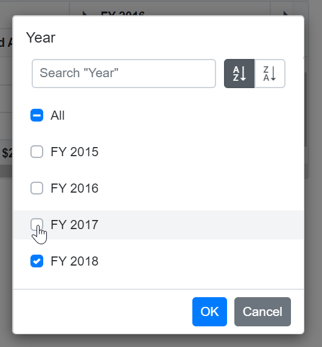
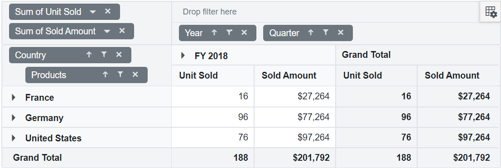
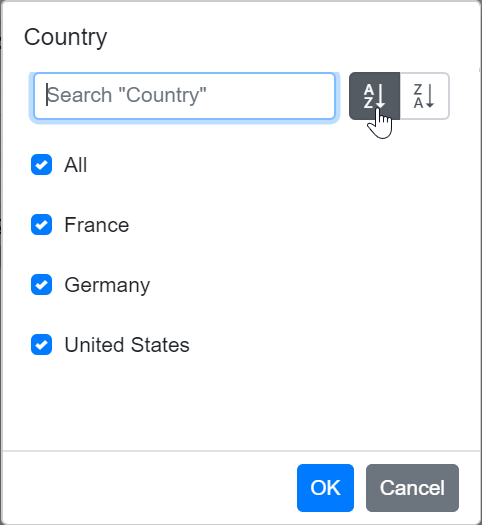
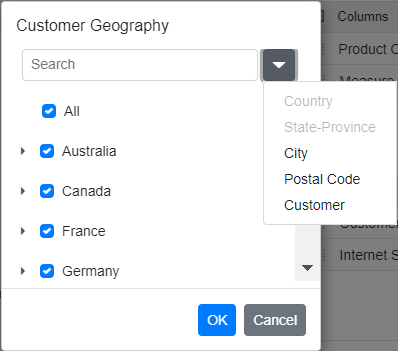
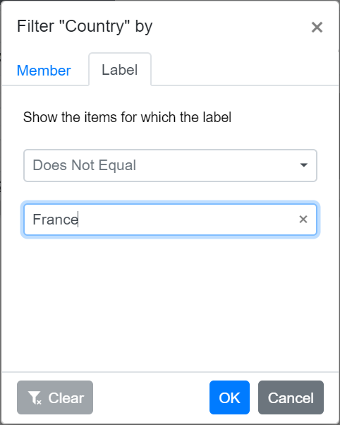
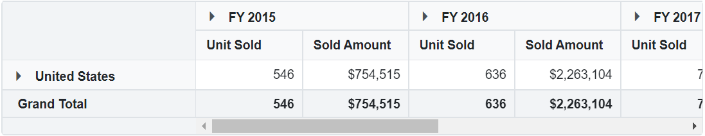
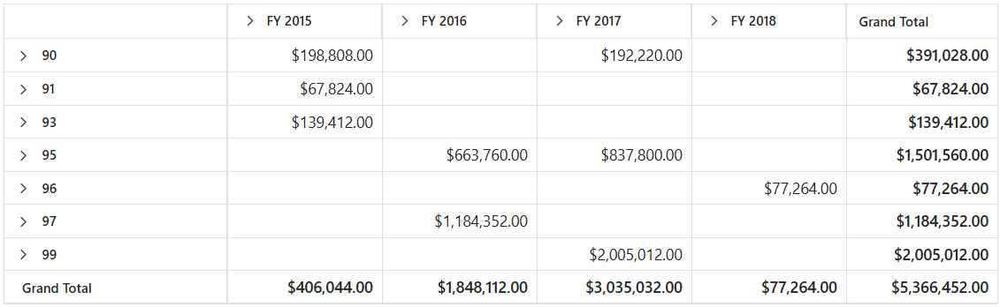

<!-- markdownlint-disable MD012 -->

# Filtering in Blazor Pivot Table Component

Filtering allows to view the pivot table with selective records based on the members that can be either included or excluded through UI and code-behind.

The following are the three different types of filtering:

* Member filtering
* Label filtering
* Value filtering

To have a quick glance about **Filtering** in the Blazor Pivot Table, watch this video:



N> When all the above filtering options are disabled via code-behind, then the filter icon would be disabled in the field list or grouping bar UI.

## Member filtering

It allows to view the pivot table with selective records based on the included and excluded members in each field. By default, member filter option is enabled by the [AllowMemberFilter](https://help.syncfusion.com/cr/blazor/Syncfusion.Blazor.PivotView.PivotViewDataSourceSettings-1.html#Syncfusion_Blazor_PivotView_PivotViewDataSourceSettings_1_AllowMemberFilter) boolean property in [PivotViewDataSourceSettings](https://help.syncfusion.com/cr/blazor/Syncfusion.Blazor.PivotView.PivotViewDataSourceSettings-1.html) class. This UI option helps end user to filter members by clicking the filter icon besides any field in the row, column and filter axes available in the field list or grouping bar UI at runtime.


<br/>

<br/>

<br/>


Meanwhile filtering can also be configured at code behind using the [PivotViewFilterSettings](https://help.syncfusion.com/cr/blazor/Syncfusion.Blazor.PivotView.PivotViewFilterSetting.html) class while initial rendering of the component. The basic settings required to add filter criteria are:

* [Name](https://help.syncfusion.com/cr/blazor/Syncfusion.Blazor.PivotView.PivotViewFilterSetting.html#Syncfusion_Blazor_PivotView_PivotViewFilterSetting_Name): It allows to set the appropriate field name.
* [Type](https://help.syncfusion.com/cr/blazor/Syncfusion.Blazor.PivotView.PivotViewFilterSetting.html#Syncfusion_Blazor_PivotView_PivotViewFilterSetting_Type): It allows to set the filter type as [FilterType.Include](https://help.syncfusion.com/cr/blazor/Syncfusion.Blazor.PivotView.FilterType.html) or [FilterType.Exclude](https://help.syncfusion.com/cr/blazor/Syncfusion.Blazor.PivotView.FilterType.html) to include or exclude field members respectively.
* [Items](https://help.syncfusion.com/cr/blazor/Syncfusion.Blazor.PivotView.PivotViewFilterSetting.html#Syncfusion_Blazor_PivotView_PivotViewFilterSetting_Items): It allows to set the members which needs to be either included or excluded from display.
* [LevelCount](https://help.syncfusion.com/cr/blazor/Syncfusion.Blazor.PivotView.PivotViewFilterSetting.html#Syncfusion_Blazor_PivotView_PivotViewFilterSetting_LevelCount): It allows to set level count of the field to fetch data from the cube. **NOTE: This property is applicable only for OLAP data source.**

N> When specifying unavailable or inappropriate members to include or exclude filter items collection, they will be ignored.

```cshtml
@using Syncfusion.Blazor.PivotView

<SfPivotView TValue="ProductDetails" ShowGroupingBar="true">
     <PivotViewDataSourceSettings DataSource="@data">
        <PivotViewColumns>
            <PivotViewColumn Name="Year"></PivotViewColumn>
            <PivotViewColumn Name="Quarter"></PivotViewColumn>
        </PivotViewColumns>
        <PivotViewRows>
            <PivotViewRow Name="Country"></PivotViewRow>
            <PivotViewRow Name="Products"></PivotViewRow>
        </PivotViewRows>
        <PivotViewValues>
            <PivotViewValue Name="Sold" Caption="Unit Sold"></PivotViewValue>
            <PivotViewValue Name="Amount" Caption="Sold Amount"></PivotViewValue>
        </PivotViewValues>
        <PivotViewFormatSettings>
            <PivotViewFormatSetting Name="Amount" Format="C0" UseGrouping="true"></PivotViewFormatSetting>
        </PivotViewFormatSettings>
        <PivotViewFilterSettings>
            <PivotViewFilterSetting Name="Year" Type=FilterType.Exclude Items="@(new string[] { "FY 2017" })">
        </PivotViewFilterSetting>
        </PivotViewFilterSettings>
    </PivotViewDataSourceSettings>
</SfPivotView>

@code{
    public List<ProductDetails> data { get; set; }
    protected override void OnInitialized()
    {
        this.data = ProductDetails.GetProductData().ToList();
        //Bind the data source collection here. Refer "Assigning sample data to the pivot table" section in getting started for more details.
    }
}

```


### Option to select and unselect all members

The member filter dialog comes with an option "All", which on checked selects all members and on unchecked deselects all members. The option "All" would appear in intermediate state mentioning that both selected and unselected child members are available.


When all members are deselected, the "Ok" button in member filter dialog would be disabled, meaning, at least one member should be selected and bound to the pivot table component.


### Provision to search specific member(s)

By default, search option is available to quickly navigate to the desired members. It can be done by entering the starting character(s) of the actual members.


### Option to sort members

User can sort members within the member editor either to ascending (or) descending using the built-in sort icons. When both ascending and descending options are not chosen, then members will be shown in the default order (retrieved as such from data source).



### Performance Tips

In member filter dialog, end user can set the limit to display members while loading large data. Based on this limit, initial loading will get completed quickly without any performance constraint. Also, a message with remaining member count, which are not a part of the UI, will be displayed in the member editor.

The data limit can be set using the [MaxNodeLimitInMemberEditor](https://help.syncfusion.com/cr/blazor/Syncfusion.Blazor.PivotView.SfPivotView-1.html#Syncfusion_Blazor_PivotView_SfPivotView_1_MaxNodeLimitInMemberEditor) property in [SfPivotView](https://help.syncfusion.com/cr/blazor/Syncfusion.Blazor.PivotView.SfPivotView-1.html) class. By default, the property holds the numeric value **1000**.

```cshtml
@using Syncfusion.Blazor.PivotView

<SfPivotView TValue="ProductDetails" ShowFieldList="true" EnableVirtualization="true" MaxNodeLimitInMemberEditor="500">
    <PivotViewDataSourceSettings DataSource="@data">
        <PivotViewColumns>
            <PivotViewColumn Name="DeliveryDate"></PivotViewColumn>
        </PivotViewColumns>
        <PivotViewRows>
            <PivotViewRow Name="ProductID"></PivotViewRow>
        </PivotViewRows>
        <PivotViewValues>
            <PivotViewValue Name="Sold" Caption="Units Sold"></PivotViewValue>
        </PivotViewValues>
    </PivotViewDataSourceSettings>
</SfPivotView>

@code{
    public List<ProductDetails> data { get; set; }
    protected override void OnInitialized()
    {
        this.data = ProductDetails.GetProductData().ToList();
    }

    public class ProductDetails
    {
        public string ProductID { get; set; }
        public int Sold { get; set; }
        public DateTime DeliveryDate { get; set; }
        public static List<ProductDetails> GetProductData()
        {
            List<ProductDetails> productData = new List<ProductDetails>();
            for (int i = 0; i < 5000; i++)
            {
                int RandomNumber = new Random().Next(1, 10);
                productData.Add(new ProductDetails { Sold = RandomNumber, ProductID = "PRO-" + (i+1001), DeliveryDate = new DateTime(2019, 1, 1).AddDays(RandomNumber) });
            }
            return productData;
        }
    }
}

```


Meanwhile, end user can utilize the search option to refine the members from the exceeded limit. For example, consider that there are 5000 members in the name "Node 1", "Node 2", "Node 3", and so on... and user has set the property [MaxNodeLimitInMemberEditor](https://help.syncfusion.com/cr/blazor/Syncfusion.Blazor.PivotView.SfPivotView-1.html#Syncfusion_Blazor_PivotView_SfPivotView_1_MaxNodeLimitInMemberEditor) to **500**. In this case, only the initial 500 members will be displayed by default leaving a message "4500 more items. Search to refine further.". To get the member(s) between 501 to 5000, enter the starting character(s) in search option to bring the desired member(s) from the exceeded limit to the UI. Now, end user can either check or uncheck to continue with the filtering process.


### Loading members on-demand

N> This property is applicable only for OLAP data sources.

Allows to load members inside the filter dialog on-demand by setting the [LoadOnDemandInMemberEditor](https://help.syncfusion.com/cr/blazor/Syncfusion.Blazor.PivotView.SfPivotView-1.html#Syncfusion_Blazor_PivotView_SfPivotView_1_LoadOnDemandInMemberEditor) property to **true**. By default, first level is loaded in the member editor from the OLAP cube. So, the member editor will be opened quickly, without any performance constraints. By default, this property is set to **true** and the search will only be applied to the level members that are loaded. In the meantime, the next level members can be added using either of the following methods.

* By clicking on the expander button of the respective member, only its child members will be loaded.
* Select a level from the drop-down list that will load all members up to the chosen level from the cube.

This will help to avoid performance lags when opening a member editor whose hierarchy has a large number of members. Once level members are queried and added one after the other, they will be maintained internally (for all operations like dialog re-opening, drag and drop, etc...) and will not be removed until the web page is refreshed.

```cshtml

@using Syncfusion.Blazor.PivotView

<SfPivotView TValue="ProductDetails"  Width="800" Height="350" LoadOnDemandInMemberEditor="true">
    <PivotViewDataSourceSettings TValue="ProductDetails" ProviderType="ProviderType.SSAS" Catalog="Adventure Works DW 2008 SE" Cube="Adventure Works" Url="https://bi.syncfusion.com/olap/msmdpump.dll" LocaleIdentifier="1033" EnableSorting="true">
        <PivotViewColumns>
            <PivotViewColumn Name="[Product].[Product Categories]" Caption="Product Category"></PivotViewColumn>
            <PivotViewColumn Name="[Measures]" Caption="Measure"></PivotViewColumn>
        </PivotViewColumns>
        <PivotViewRows>
            <PivotViewRow Name="[Customer].[Customer Geography]" Caption="Customer Geography"></PivotViewRow>
        </PivotViewRows>
        <PivotViewValues>
            <PivotViewValue Name="[Measures].[Customer Count]" Caption="Customer Count"></PivotViewValue>
            <PivotViewValue Name="[Measures].[Internet Sales Amount]" Caption="Internet Sales Amount"></PivotViewValue>
        </PivotViewValues>
    </PivotViewDataSourceSettings>
    <PivotViewGridSettings ColumnWidth="160"></PivotViewGridSettings>
</SfPivotView>
<style>
    .e-pivotview {
        min-height: 200px;
    }
</style>

```


In the example above, "Customer Geography" dimension is loaded with first level (Country) during initial loading. The search will therefore be applied on the members of the "Country" level alone. After that, you can load members to the next level (State-Province) on-demand by expanding the "Australia" node (or) by selecting the "State-Province" level from the drop down list.

* When you expand "Australia", the "State-Province" members will be loaded to "Australia" alone.
* If you load the members by selecting the "State-Province" level from the drop-down list means, the "State-Province" members will be loaded across all countries like Australia, Canada, France, etc...

Once members are loaded, they are maintained internally and will not be removed until the page is refreshed.

If the property is set to **false**, all members of all levels will be queried and added during initial loading itself. Only one query is executed here to retrieve all members from all levels. Since it fetches large number of members, you can feel the performance difference while opening the member editor. But still, expand and search operation is quick here because the members have already been retrieved and populated.


### Loading members based on level number

N> This property is applicable only for OLAP data sources.

Allows user to load the members on the basis of the level number set in the [LevelCount](https://help.syncfusion.com/cr/blazor/Syncfusion.Blazor.PivotView.PivotViewFilterSetting.html#Syncfusion_Blazor_PivotView_PivotViewFilterSetting_LevelCount) property in the [FilterSettings](https://help.syncfusion.com/cr/blazor/Syncfusion.Blazor.PivotView.PivotViewFilterSettings.html). By default, this property is set to **1** and the search will only take place within the members of the first level.

```cshtml

@using Syncfusion.Blazor.PivotView

<SfPivotView TValue="ProductDetails"  Width="800" Height="350" >
    <PivotViewDataSourceSettings TValue="ProductDetails" ProviderType="ProviderType.SSAS" Catalog="Adventure Works DW 2008 SE" Cube="Adventure Works" Url="https://bi.syncfusion.com/olap/msmdpump.dll" LocaleIdentifier="1033" EnableSorting="true">
        <PivotViewColumns>
            <PivotViewColumn Name="[Product].[Product Categories]" Caption="Product Category"></PivotViewColumn>
            <PivotViewColumn Name="[Measures]" Caption="Measure"></PivotViewColumn>
        </PivotViewColumns>
        <PivotViewRows>
            <PivotViewRow Name="[Customer].[Customer Geography]" Caption="Customer Geography"></PivotViewRow>
        </PivotViewRows>
        <PivotViewValues>
            <PivotViewValue Name="[Measures].[Customer Count]" Caption="Customer Count"></PivotViewValue>
            <PivotViewValue Name="[Measures].[Internet Sales Amount]" Caption="Internet Sales Amount"></PivotViewValue>
        </PivotViewValues>
        <PivotViewFilterSettings>
            <PivotViewFilterSetting Name="[Customer].[Customer Geography]" Type=FilterType.Exclude Items="@(new string[] { '[Customer].[Customer Geography].[State-Province].&[NSW]&[AU]' })" LevelCount="2"></PivotViewFilterSetting>
        </PivotViewFilterSettings>
    </PivotViewDataSourceSettings>
    <PivotViewGridSettings ColumnWidth="160"></PivotViewGridSettings>
</SfPivotView>
<style>
    .e-pivotview {
        min-height: 200px;
    }
</style>

```



In the example above, we set [LevelCount](https://help.syncfusion.com/cr/blazor/Syncfusion.Blazor.PivotView.PivotViewFilterSetting.html#Syncfusion_Blazor_PivotView_PivotViewFilterSetting_LevelCount) as **2** for the "Customer Geography" dimension in [FilterSettings](https://help.syncfusion.com/cr/blazor/Syncfusion.Blazor.PivotView.PivotViewFilterSettings.html). So, the "Customer Geography" dimension is loaded with the "Country" and "State-Province" levels during initial loading itself. The search will therefore be applied only to the members of the "Country" and "State-Province" levels. After that, you can load members to the next level on-demand by expanding the respective "State-Province" node (or) by selecting the "City" level from the drop-down list.

## Label filtering

The label filtering helps to view the pivot table with selective header text in fields across row and column axes based on the applied filter criteria. The following are the three different types of label filtering available:

* Filtering string data type
* Filtering number data type
* Filtering date data type

The label filtering dialog can be enabled by setting the [AllowLabelFilter](https://help.syncfusion.com/cr/blazor/Syncfusion.Blazor.PivotView.PivotViewDataSourceSettings-1.html#Syncfusion_Blazor_PivotView_PivotViewDataSourceSettings_1_AllowLabelFilter) property in [PivotViewDataSourceSettings](https://help.syncfusion.com/cr/blazor/Syncfusion.Blazor.PivotView.PivotViewDataSourceSettings-1.html) class to **true**. After enabling this API, click the filter icon besides any field in row or column axis available in field list or grouping bar UI. Now a filtering dialog will appear and navigate to "Label" tab to perform label filtering operations.

```cshtml
@using Syncfusion.Blazor.PivotView

<SfPivotView TValue="ProductDetails" ShowGroupingBar="true" ShowFieldList="true">
     <PivotViewDataSourceSettings DataSource="@data" AllowLabelFilter="true">
        <PivotViewColumns>
            <PivotViewColumn Name="Year"></PivotViewColumn>
            <PivotViewColumn Name="Quarter"></PivotViewColumn>
        </PivotViewColumns>
        <PivotViewRows>
            <PivotViewRow Name="Country"></PivotViewRow>
            <PivotViewRow Name="Products"></PivotViewRow>
        </PivotViewRows>
        <PivotViewValues>
            <PivotViewValue Name="Sold" Caption="Unit Sold"></PivotViewValue>
            <PivotViewValue Name="Amount" Caption="Sold Amount"></PivotViewValue>
        </PivotViewValues>
        <PivotViewFormatSettings>
            <PivotViewFormatSetting Name="Amount" Format="C0"></PivotViewFormatSetting>
        </PivotViewFormatSettings>
    </PivotViewDataSourceSettings>
</SfPivotView>

@code{
    public List<ProductDetails> data { get; set; }
    protected override void OnInitialized()
    {
        this.data = ProductDetails.GetProductData().ToList();
        //Bind the data source collection here. Refer "Assigning sample data to the pivot table" section in getting started for more details.
    }
}

```


<br/>

<br/>
<br/>

<br/>
<br/>


N> In label filtering UI, based on the field chosen, it’s member data type is automatically recognized and filtering operation will be carried out. Where as in code behind, user need to define the data type through a property and it has been explained in the immediate section below.

### Filtering string data type through code

This type of filtering is exclusively applicable for fields with members in string data type. The filtering can be configured using the [PivotViewFilterSettings](https://help.syncfusion.com/cr/blazor/Syncfusion.Blazor.PivotView.PivotViewFilterSettings.html) class through code-behind. The properties required for label filter are:

* [Name](https://help.syncfusion.com/cr/blazor/Syncfusion.Blazor.PivotView.PivotViewFilterSetting.html#Syncfusion_Blazor_PivotView_PivotViewFilterSetting_Name): Sets the field name.
* [Type](https://help.syncfusion.com/cr/blazor/Syncfusion.Blazor.PivotView.PivotViewFilterSetting.html#Syncfusion_Blazor_PivotView_PivotViewFilterSetting_Type): Sets the filter type as [FilterType.Label](https://help.syncfusion.com/cr/blazor/Syncfusion.Blazor.PivotView.FilterType.html#Syncfusion_Blazor_PivotView_FilterType_Label) to the field.
* [Condition](https://help.syncfusion.com/cr/blazor/Syncfusion.Blazor.PivotView.PivotViewFilterSetting.html#Syncfusion_Blazor_PivotView_PivotViewFilterSetting_Condition): Sets the operator type such as [Operators.Equals](https://help.syncfusion.com/cr/blazor/Syncfusion.Blazor.PivotView.Operators.html), [Operators.GreaterThan](https://help.syncfusion.com/cr/blazor/Syncfusion.Blazor.PivotView.Operators.html#Syncfusion_Blazor_PivotView_Operators_GreaterThan), [Operators.LessThan](https://help.syncfusion.com/cr/blazor/Syncfusion.Blazor.PivotView.Operators.html#Syncfusion_Blazor_PivotView_Operators_LessThan), etc.
* [Value1](https://help.syncfusion.com/cr/blazor/Syncfusion.Blazor.PivotView.PivotViewFilterSetting.html#Syncfusion_Blazor_PivotView_PivotViewFilterSetting_Value1): Sets the start value.
* [Value2](https://help.syncfusion.com/cr/blazor/Syncfusion.Blazor.PivotView.PivotViewFilterSetting.html#Syncfusion_Blazor_PivotView_PivotViewFilterSetting_Value2): Sets the end value. It is applicable only for the operator such as [Operators.Between](https://help.syncfusion.com/cr/blazor/Syncfusion.Blazor.PivotView.Operators.html#Syncfusion_Blazor_PivotView_Operators_Between) and [Operators.NotBetween](https://help.syncfusion.com/cr/blazor/Syncfusion.Blazor.PivotView.Operators.html#Syncfusion_Blazor_PivotView_Operators_NotBetween).
* [SelectedField](https://help.syncfusion.com/cr/blazor/Syncfusion.Blazor.PivotView.PivotViewFilterSetting.html#Syncfusion_Blazor_PivotView_PivotViewFilterSetting_SelectedField): Sets level name of a dimension, where the filter settings are to be applied. **NOTE: This property applicable only for OLAP data source.**

For example, in a "Country" field, to show countries names that contains "United" text alone, set [Value1](https://help.syncfusion.com/cr/blazor/Syncfusion.Blazor.PivotView.PivotViewFilterSetting.html#Syncfusion_Blazor_PivotView_PivotViewFilterSetting_Value1) to "United" and [Condition](https://help.syncfusion.com/cr/blazor/Syncfusion.Blazor.PivotView.PivotViewFilterSetting.html#Syncfusion_Blazor_PivotView_PivotViewFilterSetting_Condition) to [Operators.Contains](https://help.syncfusion.com/cr/blazor/Syncfusion.Blazor.PivotView.Operators.html#Syncfusion_Blazor_PivotView_Operators_Contains) for desired output in pivot table.
[Operators](https://help.syncfusion.com/cr/blazor/Syncfusion.Blazor.PivotView.Operators.html) that can be used in label filtering are:

| Operator | Description |
|------|-------------|
| Equals| Displays the pivot table that matches with the text.|
| DoesNotEquals| Displays the pivot table that does not match with the given text.|
| BeginWith| Displays the pivot table that begins with text.|
| DoesNotBeginWith| Displays the pivot table that does not begins with text.|
| EndsWith| Displays the pivot table that ends with text.|
| DoesNotEndsWith| Displays the pivot table that does not ends with text.|
| Contains| Displays the pivot table that contains text.|
| DoesNotContains| Displays the pivot table that does not contain text.|
| GreaterThan| Displays the pivot table when the text is greater.|
| GreaterThanOrEqualTo| Displays the pivot table when the text is greater than or equal.|
| LessThan| Displays the pivot table when the text is lesser.|
| LessThanOrEqualTo| Displays the pivot table when the text is lesser than or equal.|
| Between| Displays the pivot table that records between the start and end text.|
| NotBetween| Displays the pivot table that does not record between the start and end text.|

```cshtml
@using Syncfusion.Blazor.PivotView

<SfPivotView TValue="ProductDetails">
     <PivotViewDataSourceSettings DataSource="@data" AllowLabelFilter="true">
        <PivotViewColumns>
            <PivotViewColumn Name="Year"></PivotViewColumn>
            <PivotViewColumn Name="Quarter"></PivotViewColumn>
        </PivotViewColumns>
        <PivotViewRows>
            <PivotViewRow Name="Country"></PivotViewRow>
            <PivotViewRow Name="Products"></PivotViewRow>
        </PivotViewRows>
        <PivotViewValues>
            <PivotViewValue Name="Sold" Caption="Unit Sold"></PivotViewValue>
            <PivotViewValue Name="Amount" Caption="Sold Amount"></PivotViewValue>
        </PivotViewValues>
        <PivotViewFormatSettings>
            <PivotViewFormatSetting Name="Amount" Format="C"></PivotViewFormatSetting>
        </PivotViewFormatSettings>
        <PivotViewFilterSettings>
            <PivotViewFilterSetting Name="Country" Type=FilterType.Label Condition=Operators.Contains Value1="United">
        </PivotViewFilterSetting>
        </PivotViewFilterSettings>
    </PivotViewDataSourceSettings>
</SfPivotView>

@code{
    public List<ProductDetails> data { get; set; }
    protected override void OnInitialized()
    {
        this.data = ProductDetails.GetProductData().ToList();
        //Bind the data source collection here. Refer "Assigning sample data to the pivot table" section in getting started for more details.
    }
}

```



### Filtering number data type through code

N> This option is applicable only for relational data source.

This type of filtering is exclusively applicable for fields with members in number data type. The filtering can be configured in a similar way explained in the previous section - "Filtering string data type through code", except the [Type](https://help.syncfusion.com/cr/blazor/Syncfusion.Blazor.PivotView.PivotViewFilterSetting.html#Syncfusion_Blazor_PivotView_PivotViewFilterSetting_Type) property setting. For number data type, set the [Type](https://help.syncfusion.com/cr/blazor/Syncfusion.Blazor.PivotView.PivotViewFilterSetting.html#Syncfusion_Blazor_PivotView_PivotViewFilterSetting_Type) property to [FilterType.Number](https://help.syncfusion.com/cr/blazor/Syncfusion.Blazor.PivotView.FilterType.html#Syncfusion_Blazor_PivotView_FilterType_Number) enumeration.

For example, in a "Sold" field, to show the values between "90" to "100", set [Value1](https://help.syncfusion.com/cr/blazor/Syncfusion.Blazor.PivotView.PivotViewFilterSetting.html#Syncfusion_Blazor_PivotView_PivotViewFilterSetting_Value1) to "90", [Value1](https://help.syncfusion.com/cr/blazor/Syncfusion.Blazor.PivotView.PivotViewFilterSetting.html#Syncfusion_Blazor_PivotView_PivotViewFilterSetting_Value2) to "100" and [Condition](https://help.syncfusion.com/cr/blazor/Syncfusion.Blazor.PivotView.PivotViewFilterSetting.html#Syncfusion_Blazor_PivotView_PivotViewFilterSetting_Condition) to [Operators.Between](https://help.syncfusion.com/cr/blazor/Syncfusion.Blazor.PivotView.Operators.html#Syncfusion_Blazor_PivotView_Operators_Between) for desired output in pivot table.

N> Operators like [Operators.Equals](https://help.syncfusion.com/cr/blazor/Syncfusion.Blazor.PivotView.Operators.html#Syncfusion_Blazor_PivotView_Operators_Equals), [Operators.DoesNotEquals](https://help.syncfusion.com/cr/blazor/Syncfusion.Blazor.PivotView.Operators.html#Syncfusion_Blazor_PivotView_Operators_DoesNotEquals), [Operators.GreaterThan](https://help.syncfusion.com/cr/blazor/Syncfusion.Blazor.PivotView.Operators.html#Syncfusion_Blazor_PivotView_Operators_GreaterThan), [Operators.GreaterThanOrEqualTo](https://help.syncfusion.com/cr/blazor/Syncfusion.Blazor.PivotView.Operators.html#Syncfusion_Blazor_PivotView_Operators_GreaterThanOrEqualTo), [Operators.LessThan](https://help.syncfusion.com/cr/blazor/Syncfusion.Blazor.PivotView.Operators.html#Syncfusion_Blazor_PivotView_Operators_LessThan), [Operators.LessThanOrEqualTo](https://help.syncfusion.com/cr/blazor/Syncfusion.Blazor.PivotView.Operators.html#Syncfusion_Blazor_PivotView_Operators_LessThanOrEqualTo), [Operators.Between](https://help.syncfusion.com/cr/blazor/Syncfusion.Blazor.PivotView.Operators.html), and [Operators.NotBetween](https://help.syncfusion.com/cr/blazor/Syncfusion.Blazor.PivotView.Operators.html#Syncfusion_Blazor_PivotView_Operators_NotBetween) are alone applicable for number data type.

```cshtml
@using Syncfusion.Blazor.PivotView

<SfPivotView TValue="ProductDetails">
    <PivotViewDataSourceSettings DataSource="@data" AllowLabelFilter="true">
        <PivotViewColumns>
            <PivotViewColumn Name="Year"></PivotViewColumn>
            <PivotViewColumn Name="Quarter"></PivotViewColumn>
        </PivotViewColumns>
        <PivotViewRows>
            <PivotViewRow Name="Sold" Caption="Unit Sold"></PivotViewRow>
            <PivotViewRow Name="Country"></PivotViewRow>
            <PivotViewRow Name="Products"></PivotViewRow>
        </PivotViewRows>
        <PivotViewValues>
            <PivotViewValue Name="Amount" Caption="Sold Amount"></PivotViewValue>
        </PivotViewValues>
        <PivotViewFormatSettings>
            <PivotViewFormatSetting Name="Amount" Format="C"></PivotViewFormatSetting>
        </PivotViewFormatSettings>
        <PivotViewFilterSettings>
            <PivotViewFilterSetting Name="Sold" Type=FilterType.Number Condition=Operators.Between Value1=90 Value2=100></PivotViewFilterSetting>
        </PivotViewFilterSettings>
    </PivotViewDataSourceSettings>
</SfPivotView>

@code{
    public List<ProductDetails> data { get; set; }
    protected override void OnInitialized()
    {
        this.data = ProductDetails.GetProductData().ToList();
        //Bind the data source collection here. Refer "Assigning sample data to the pivot table" section in getting started for more details.
    }
}

```



### Filtering date data type through code

This type of filtering is exclusively applicable for fields with members in date data type. The filtering can be configured in a similar way explained in the prior section - "Filtering string data type through code", except the [Type](https://help.syncfusion.com/cr/blazor/Syncfusion.Blazor.PivotView.PivotViewFilterSetting.html#Syncfusion_Blazor_PivotView_PivotViewFilterSetting_Type) property setting. For date data type, set the [Type](https://help.syncfusion.com/cr/blazor/Syncfusion.Blazor.PivotView.PivotViewFilterSetting.html#Syncfusion_Blazor_PivotView_PivotViewFilterSetting_Type) property to [FilterType.Date](https://help.syncfusion.com/cr/blazor/Syncfusion.Blazor.PivotView.FilterType.html#Syncfusion_Blazor_PivotView_FilterType_Date) enumeration.

For example, in a "Delivery Date" field, to show the delivery records of the first week of the year 2019, then set [Value1](https://help.syncfusion.com/cr/blazor/Syncfusion.Blazor.PivotView.PivotViewFilterSetting.html#Syncfusion_Blazor_PivotView_PivotViewFilterSetting_Value1) to "2019-01-07" and [Condition](https://help.syncfusion.com/cr/blazor/Syncfusion.Blazor.PivotView.PivotViewFilterSetting.html#Syncfusion_Blazor_PivotView_PivotViewFilterSetting_Condition) to [Operators.Before](https://help.syncfusion.com/cr/blazor/Syncfusion.Blazor.PivotView.Operators.html#Syncfusion_Blazor_PivotView_Operators_Before) for desired output in pivot table.

N> Operators like [Operators.Equals](https://help.syncfusion.com/cr/blazor/Syncfusion.Blazor.PivotView.Operators.html#Syncfusion_Blazor_PivotView_Operators_Equals), [Operators.DoesNotEquals](https://help.syncfusion.com/cr/blazor/Syncfusion.Blazor.PivotView.Operators.html#Syncfusion_Blazor_PivotView_Operators_DoesNotEquals), [Operators.Before](https://help.syncfusion.com/cr/blazor/Syncfusion.Blazor.PivotView.Operators.html#Syncfusion_Blazor_PivotView_Operators_Before), [Operators.BeforeOrEqualTo](https://help.syncfusion.com/cr/blazor/Syncfusion.Blazor.PivotView.Operators.html#Syncfusion_Blazor_PivotView_Operators_BeforeOrEqualTo), [Operators.After](https://help.syncfusion.com/cr/blazor/Syncfusion.Blazor.PivotView.Operators.html#Syncfusion_Blazor_PivotView_Operators_After), [Operators.AfterOrEqualTo](https://help.syncfusion.com/cr/blazor/Syncfusion.Blazor.PivotView.Operators.html#Syncfusion_Blazor_PivotView_Operators_AfterQrEqualTo), [Operators.Between](https://help.syncfusion.com/cr/blazor/Syncfusion.Blazor.PivotView.Operators.html#Syncfusion_Blazor_PivotView_Operators_Between), and [Operators.NotBetween](https://help.syncfusion.com/cr/blazor/Syncfusion.Blazor.PivotView.Operators.html#Syncfusion_Blazor_PivotView_Operators_NotBetween) are alone applicable for date data type.

```cshtml
@using Syncfusion.Blazor.PivotView

<SfPivotView TValue="ProductDetails">
<PivotViewDataSourceSettings DataSource="@data" AllowLabelFilter="true">
    <PivotViewColumns>
        <PivotViewColumn Name="ProductID"></PivotViewColumn>
    </PivotViewColumns>
    <PivotViewRows>
        <PivotViewRow Name="DeliveryDate"></PivotViewRow>
    </PivotViewRows>
    <PivotViewValues>
        <PivotViewValue Name="Sold" Caption="Units Sold"></PivotViewValue>
    </PivotViewValues>
    <PivotViewFormatSettings>
        <PivotViewFormatSetting Name="DeliveryDate" Type="FormatType.DateTime" Format="dd/MMM/yyyy"></PivotViewFormatSetting>
    </PivotViewFormatSettings>
    <PivotViewFilterSettings>
        <PivotViewFilterSetting Name="DeliveryDate" Type=FilterType.Date Condition=Operators.Before Value1="2019-01-07"></PivotViewFilterSetting>
    </PivotViewFilterSettings>
</PivotViewDataSourceSettings>
</SfPivotView>

@code{
    public List<ProductDetails> data { get; set; }
    protected override void OnInitialized()
    {
        this.data = ProductDetails.GetProductData().ToList();
    }

    public class ProductDetails
    {
        public string ProductID { get; set; }
        public int Sold { get; set; }
        public DateTime DeliveryDate { get; set; }
        public static List<ProductDetails> GetProductData()
        {
            List<ProductDetails> productData = new List<ProductDetails>();
            for (int i = 0; i < 100; i++)
            {
                int RandomNumber = new Random().Next(1, 10);
                productData.Add(new ProductDetails { Sold = RandomNumber, ProductID = "PRO-" + ((i % 10)+1001), DeliveryDate = new DateTime(2019, 1, 1).AddDays(RandomNumber) });
            }
            return productData;
        }
    }
}

```


### Clearing the existing date filter

End user can clear the applied date filter by simply click the "Clear" option at the bottom of the filter dialog under "date" tab.


## Value filtering

The value filtering helps to perform filter operation based only on value fields and its resultant aggregated values over other fields defined in row and column axes.

The value filtering dialog can be enabled by setting the [AllowValueFilter](https://help.syncfusion.com/cr/blazor/Syncfusion.Blazor.PivotView.PivotViewDataSourceSettings-1.html#Syncfusion_Blazor_PivotView_PivotViewDataSourceSettings_1_AllowLabelFilter) property in [PivotViewDataSourceSettings](https://help.syncfusion.com/cr/blazor/Syncfusion.Blazor.PivotView.PivotViewDataSourceSettings-1.html) class to **true**. After enabling this API, click the filter icon besides any field in row or column axis available in field list or grouping bar UI. Now a filtering dialog will appear and navigate to "Value" tab to perform value filtering operations.

```cshtml
@using Syncfusion.Blazor.PivotView

<SfPivotView TValue="ProductDetails" ShowFieldList="true">
     <PivotViewDataSourceSettings DataSource="@data" AllowValueFilter="true">
        <PivotViewColumns>
            <PivotViewColumn Name="Year"></PivotViewColumn>
            <PivotViewColumn Name="Quarter"></PivotViewColumn>
        </PivotViewColumns>
        <PivotViewRows>
            <PivotViewRow Name="Country"></PivotViewRow>
            <PivotViewRow Name="Products"></PivotViewRow>
        </PivotViewRows>
        <PivotViewValues>
            <PivotViewValue Name="Sold" Caption="Unit Sold"></PivotViewValue>
            <PivotViewValue Name="Amount" Caption="Sold Amount"></PivotViewValue>
        </PivotViewValues>
        <PivotViewFormatSettings>
            <PivotViewFormatSetting Name="Amount" Format="C0"></PivotViewFormatSetting>
        </PivotViewFormatSettings>
    </PivotViewDataSourceSettings>
</SfPivotView>

@code{
    public List<ProductDetails> data { get; set; }
    protected override void OnInitialized()
    {
        this.data = ProductDetails.GetProductData().ToList();
        //Bind the data source collection here. Refer "Assigning sample data to the pivot table" section in getting started for more details.
    }
}

```


<br/>

<br/>
<br/>

<br/>
<br/>


The value filtering can also be configured using the [PivotViewFilterSettings](https://help.syncfusion.com/cr/blazor/Syncfusion.Blazor.PivotView.PivotViewFilterSetting.html) class through code-behind. The properties required for value filter are:

* [Name](https://help.syncfusion.com/cr/blazor/Syncfusion.Blazor.PivotView.PivotViewFilterSetting.html#Syncfusion_Blazor_PivotView_PivotViewFilterSetting_Name): Sets the normal field name.
* [Type](https://help.syncfusion.com/cr/blazor/Syncfusion.Blazor.PivotView.PivotViewFilterSetting.html#Syncfusion_Blazor_PivotView_PivotViewFilterSetting_Type): Sets the filter type as [FilterType.Value](https://help.syncfusion.com/cr/blazor/Syncfusion.Blazor.PivotView.FilterType.html) to the field.
* [Measure](https://help.syncfusion.com/cr/blazor/Syncfusion.Blazor.PivotView.PivotViewFilterSetting.html#Syncfusion_Blazor_PivotView_PivotViewFilterSetting_Measure): Sets the value field name.
* [Condition](https://help.syncfusion.com/cr/blazor/Syncfusion.Blazor.PivotView.PivotViewFilterSetting.html#Syncfusion_Blazor_PivotView_PivotViewFilterSetting_Condition): Sets the operator type such as [Operators.Equals](https://help.syncfusion.com/cr/blazor/Syncfusion.Blazor.PivotView.Operators.html), [Operators.GreaterThan](https://help.syncfusion.com/cr/blazor/Syncfusion.Blazor.PivotView.Operators.html), [Operators.LessThan](https://help.syncfusion.com/cr/blazor/Syncfusion.Blazor.PivotView.Operators.html#Syncfusion_Blazor_PivotView_Operators_LessThan) etc.
* [Value1](https://help.syncfusion.com/cr/blazor/Syncfusion.Blazor.PivotView.PivotViewFilterSetting.html#Syncfusion_Blazor_PivotView_PivotViewFilterSetting_Value1): Sets the start value.
* [Value2](https://help.syncfusion.com/cr/blazor/Syncfusion.Blazor.PivotView.PivotViewFilterSetting.html#Syncfusion_Blazor_PivotView_PivotViewFilterSetting_Value2): Sets the end value. It is applicable only for the operator such as [Operators.Between](https://help.syncfusion.com/cr/blazor/Syncfusion.Blazor.PivotView.Operators.html#Syncfusion_Blazor_PivotView_Operators_Between) and [Operators.NotBetween](https://help.syncfusion.com/cr/blazor/Syncfusion.Blazor.PivotView.Operators.html#Syncfusion_Blazor_PivotView_Operators_NotBetween).
* [SelectedField](https://help.syncfusion.com/cr/blazor/Syncfusion.Blazor.PivotView.PivotViewFilterSetting.html#Syncfusion_Blazor_PivotView_PivotViewFilterSetting_SelectedField): Sets level name of a dimension, where the filter settings are to be applied.

N> [SelectedField](https://help.syncfusion.com/cr/blazor/Syncfusion.Blazor.PivotView.PivotViewFilterSetting.html#Syncfusion_Blazor_PivotView_PivotViewFilterSetting_SelectedField) property applicable only for OLAP data source.

For example, to show the data where total sum of units sold for each country exceeding 1500, set [Value1](https://help.syncfusion.com/cr/blazor/Syncfusion.Blazor.PivotView.PivotViewFilterSetting.html#Syncfusion_Blazor_PivotView_PivotViewFilterSetting_Value1) to "1500" and [Condition](https://help.syncfusion.com/cr/blazor/Syncfusion.Blazor.PivotView.PivotViewFilterSetting.html#Syncfusion_Blazor_PivotView_PivotViewFilterSetting_Condition) to [Operators.GreaterThan](https://help.syncfusion.com/cr/blazor/Syncfusion.Blazor.PivotView.Operators.html#Syncfusion_Blazor_PivotView_Operators_GreaterThan) in the "Country" field.

[Operators](https://help.syncfusion.com/cr/blazor/Syncfusion.Blazor.PivotView.Operators.html) that can be used in value filtering are:

| Operator | Description |
|------|-------------|
| Equals| Displays the pivot table that matches with the value.|
| DoesNotEquals| Displays the pivot table that does not match with the given value.|
| GreaterThan| Displays the pivot table when the value is greater.|
| GreaterThanOrEqualTo| Displays the pivot table when the value is greater than or equal.|
| LessThan| Displays the pivot table when the value is lesser.|
| LessThanOrEqualTo| Displays the pivot table when the value is lesser than or equal.|
| Between| Displays the pivot table that records between start and end values.|
| NotBetween| Displays the pivot table that does not record between start and end values.|

```cshtml
@using Syncfusion.Blazor.PivotView

<SfPivotView TValue="ProductDetails" ShowGroupingBar="true">
     <PivotViewDataSourceSettings DataSource="@data" AllowValueFilter="true">
        <PivotViewColumns>
            <PivotViewColumn Name="Year"></PivotViewColumn>
            <PivotViewColumn Name="Quarter"></PivotViewColumn>
        </PivotViewColumns>
        <PivotViewRows>
            <PivotViewRow Name="Country"></PivotViewRow>
            <PivotViewRow Name="Products"></PivotViewRow>
        </PivotViewRows>
        <PivotViewValues>
            <PivotViewValue Name="Sold" Caption="Unit Sold"></PivotViewValue>
            <PivotViewValue Name="Amount" Caption="Sold Amount"></PivotViewValue>
        </PivotViewValues>
        <PivotViewFormatSettings>
            <PivotViewFormatSetting Name="Amount" Format="C0"></PivotViewFormatSetting>
        </PivotViewFormatSettings>
        <PivotViewFilterSettings>
            <PivotViewFilterSetting Name="Country" Measure="Sold" Type=FilterType.Value Condition=Operators.GreaterThan Value1=1500></PivotViewFilterSetting>
        </PivotViewFilterSettings>
    </PivotViewDataSourceSettings>
</SfPivotView>

@code{
    public List<ProductDetails> data { get; set; }
    protected override void OnInitialized()
    {
        this.data = ProductDetails.GetProductData().ToList();
        //Bind the data source collection here. Refer "Assigning sample data to the pivot table" section in getting started for more details.
    }
}

```


### Clearing the existing value filter

End user can clear the applied value filter by simply click the "Clear" option at the bottom of the filter dialog under "Value" tab.


## Events

### MemberEditorOpen

The event [MemberEditorOpen](https://help.syncfusion.com/cr/blazor/Syncfusion.Blazor.PivotView.PivotViewEvents-1.html#Syncfusion_Blazor_PivotView_PivotViewEvents_1_MemberEditorOpen) fires while opening member editor dialog. It allows to customize the field members to be displayed in the dialog. It has the following parameters

* [FieldName](https://help.syncfusion.com/cr/blazor/Syncfusion.Blazor.PivotView.MemberEditorOpenEventArgs.html#Syncfusion_Blazor_PivotView_MemberEditorOpenEventArgs_FieldName): It holds the name of the appropriate field.

* [FieldMembers](https://help.syncfusion.com/cr/blazor/Syncfusion.Blazor.PivotView.MemberEditorOpenEventArgs.html#Syncfusion_Blazor_PivotView_MemberEditorOpenEventArgs_FieldMembers): It holds the members of a field.

* [Cancel](https://help.syncfusion.com/cr/blazor/Syncfusion.Blazor.PivotView.MemberEditorOpenEventArgs.html#Syncfusion_Blazor_PivotView_MemberEditorOpenEventArgs_Cancel): It is a boolean property and by setting this to true, dialog won’t be created.

In the below sample, the member editor of field "Country" shows only the selected Item.

```cshtml
 @using Syncfusion.Blazor.PivotView

<SfPivotView TValue="ProductDetails" ShowGroupingBar="true" >
        <PivotViewDataSourceSettings DataSource="@data">
        <PivotViewColumns>
            <PivotViewColumn Name="Year"></PivotViewColumn>
            <PivotViewColumn Name="Quarter"></PivotViewColumn>
        </PivotViewColumns>
        <PivotViewRows>
            <PivotViewRow Name="Country"></PivotViewRow>
            <PivotViewRow Name="Products"></PivotViewRow>
        </PivotViewRows>
        <PivotViewValues>
            <PivotViewValue Name="Sold" Caption="Unit Sold"></PivotViewValue>
            <PivotViewValue Name="Amount" Caption="Sold Amount"></PivotViewValue>
        </PivotViewValues>
        <PivotViewFormatSettings>
            <PivotViewFormatSetting Name="Amount" Format="C"></PivotViewFormatSetting>
        </PivotViewFormatSettings>
    </PivotViewDataSourceSettings>
    <PivotViewEvents TValue="ProductDetails" MemberEditorOpen="memberEditorOpen"></PivotViewEvents>
</SfPivotView>

@code{
    public List<ProductDetails> data { get; set; }
    protected override void OnInitialized()
    {
        this.data = ProductDetails.GetProductData().ToList();
        //Bind the data source collection here. Refer "Assigning sample data to the pivot table" section in getting started for more details.
    }
    public void memberEditorOpen(MemberEditorOpenEventArgs args) {
        if (args.FieldName == "Country")
        {
            List<TreeDataInfo> updatedItems = new List<TreeDataInfo>();
            for (int i = 0; i < args.FieldMembers.Count; i++)
            {
                TreeDataInfo member = args.FieldMembers[i];
                if (member.Id == "France" || member.Id == "Germany")
                {
                    updatedItems.Add(member);
                }
            }
            args.FieldMembers = updatedItems;
        }
    }
}

```
### OnActionBegin

The event [OnActionBegin](https://help.syncfusion.com/cr/blazor/Syncfusion.Blazor.PivotView.PivotViewEvents-1.html#Syncfusion_Blazor_PivotView_PivotViewEvents_1_OnActionBegin) triggers when clicking the filter icon in the field button, which is present in both grouping bar and field list UI. This allows user to identify the current action being performed at runtime. It has the following parameters:

* [DataSourceSettings](https://help.syncfusion.com/cr/blazor/Syncfusion.Blazor.PivotView.PivotActionBeginEventArgs.html#Syncfusion_Blazor_PivotView_PivotActionBeginEventArgs_DataSourceSettings) : It holds the current data source settings such as input data source, rows, columns, values, filters, format settings and so on.

* [ActionName](https://help.syncfusion.com/cr/blazor/Syncfusion.Blazor.PivotView.PivotActionBeginEventArgs.html#Syncfusion_Blazor_PivotView_PivotActionBeginEventArgs_ActionName): It holds the name of the current action began. For example, while filtering, the action name will be shown as **Filter field**.

* [FieldInfo](https://help.syncfusion.com/cr/blazor/Syncfusion.Blazor.PivotView.PivotActionBeginEventArgs.html#Syncfusion_Blazor_PivotView_PivotActionBeginEventArgs_FieldInfo): It holds the selected field information.

N> This option is applicable only when the field based UI actions are performed such as filtering, sorting, removing field from grouping bar, editing and aggregation type change.

* [Cancel](https://help.syncfusion.com/cr/blazor/Syncfusion.Blazor.PivotView.PivotActionBeginEventArgs.html#Syncfusion_Blazor_PivotView_PivotActionBeginEventArgs_Cancel): It allows user to restrict the current action.

In the following example, filter action can be restricted by setting the **args.Cancel** option to **true** in the `OnActionBegin` event.

```cshtml
@using Syncfusion.Blazor.PivotView

<SfPivotView TValue="ProductDetails" ShowFieldList="true" ShowGroupingBar="true">
     <PivotViewDataSourceSettings DataSource="@data">
        <PivotViewColumns>
            <PivotViewColumn Name="Year"></PivotViewColumn>
            <PivotViewColumn Name="Quarter"></PivotViewColumn>
        </PivotViewColumns>
        <PivotViewRows>
            <PivotViewRow Name="Country"></PivotViewRow>
            <PivotViewRow Name="Products"></PivotViewRow>
        </PivotViewRows>
        <PivotViewValues>
            <PivotViewValue Name="Sold" Caption="Unit Sold"></PivotViewValue>
            <PivotViewValue Name="Amount" Caption="Sold Amount"></PivotViewValue>
        </PivotViewValues>
        <PivotViewFormatSettings>
            <PivotViewFormatSetting Name="Amount" Format="C"></PivotViewFormatSetting>
        </PivotViewFormatSettings>
    </PivotViewDataSourceSettings>    
   <PivotViewEvents TValue="ProductDetails" OnActionBegin="ActionBegin"></PivotViewEvents>
</SfPivotView>

@code{
    private List<ProductDetails> data { get; set; }
    protected override void OnInitialized()
    {
        data = ProductDetails.GetProductData().ToList();
        //Bind the data source collection here. Refer "Assigning sample data to the pivot table" section in getting started for more details.
    }

    // Triggers when the UI action begins.
    public void ActionBegin(PivotActionBeginEventArgs args)
    {
        if(args.ActionName == "Filter field")
        {
          args.Cancel = true;
        }       
    }

}
```
### OnActionComplete

The event [OnActionComplete](https://help.syncfusion.com/cr/blazor/Syncfusion.Blazor.PivotView.PivotViewEvents-1.html#Syncfusion_Blazor_PivotView_PivotViewEvents_1_OnActionComplete) triggers when the filtering action via the field button, which is present in both grouping bar and field list UI, is completed. This allows user to identify the current UI action being completed at runtime. It has the following parameters:

* [DataSourceSettings](https://help.syncfusion.com/cr/blazor/Syncfusion.Blazor.PivotView.PivotActionCompleteEventArgs-1.html#Syncfusion_Blazor_PivotView_PivotActionCompleteEventArgs_1_DataSourceSettings): It holds the current data source settings such as input data source, rows, columns, values, filters, format settings and so on.

* [ActionName](https://help.syncfusion.com/cr/blazor/Syncfusion.Blazor.PivotView.PivotActionCompleteEventArgs-1.html#Syncfusion_Blazor_PivotView_PivotActionCompleteEventArgs_1_ActionName): It holds the name of the current action completed. For example, after filtering, the action name will be shown as **Field filtered**.

* [FieldInfo](https://help.syncfusion.com/cr/blazor/Syncfusion.Blazor.PivotView.PivotActionCompleteEventArgs-1.html#Syncfusion_Blazor_PivotView_PivotActionCompleteEventArgs_1_FieldInfo): It holds the selected field information.

N> This option is applicable only when the field based UI actions are performed such as filtering, sorting, removing field from grouping bar, editing and aggregation type change.

* [ActionInfo](https://help.syncfusion.com/cr/blazor/Syncfusion.Blazor.PivotView.PivotActionCompleteEventArgs-1.html#Syncfusion_Blazor_PivotView_PivotActionCompleteEventArgs_1_ActionInfo):  It holds the unique information about the current UI action. For example, if the filter action is completed, the event argument contains information such as filter members, field name, and so on.

```cshtml
@using Syncfusion.Blazor.PivotView

<SfPivotView TValue="ProductDetails" ShowFieldList="true" ShowGroupingBar="true">
     <PivotViewDataSourceSettings DataSource="@data">
        <PivotViewColumns>
            <PivotViewColumn Name="Year"></PivotViewColumn>
            <PivotViewColumn Name="Quarter"></PivotViewColumn>
        </PivotViewColumns>
        <PivotViewRows>
            <PivotViewRow Name="Country"></PivotViewRow>
            <PivotViewRow Name="Products"></PivotViewRow>
        </PivotViewRows>
        <PivotViewValues>
            <PivotViewValue Name="Sold" Caption="Unit Sold"></PivotViewValue>
            <PivotViewValue Name="Amount" Caption="Sold Amount"></PivotViewValue>
        </PivotViewValues>
        <PivotViewFormatSettings>
            <PivotViewFormatSetting Name="Amount" Format="C"></PivotViewFormatSetting>
        </PivotViewFormatSettings>
    </PivotViewDataSourceSettings>    
   <PivotViewEvents TValue="ProductDetails" OnActionComplete="ActionComplete"></PivotViewEvents>
</SfPivotView>

@code{
    private List<ProductDetails> data { get; set; }
    protected override void OnInitialized()
    {
        data = ProductDetails.GetProductData().ToList();
        //Bind the data source collection here. Refer "Assigning sample data to the pivot table" section in getting started for more details.
    }

    // Triggers when the UI action is completed.
    public void ActionComplete(PivotActionCompleteEventArgs<ProductDetails> args)
    {
        if(args.ActionName == "Field filtered")
        {
          // Triggers when the filter action is completed.
        }       
    }

}
```
### OnActionFailure

The event [OnActionFailure](https://help.syncfusion.com/cr/blazor/Syncfusion.Blazor.PivotView.PivotViewEvents-1.html#Syncfusion_Blazor_PivotView_PivotViewEvents_1_OnActionFailure) triggers when the current UI action fails to achieve the desired result. It has the following parameters:

* [ActionName](https://help.syncfusion.com/cr/blazor/Syncfusion.Blazor.PivotView.PivotActionFailureEventArgs.html#Syncfusion_Blazor_PivotView_PivotActionFailureEventArgs_ActionName): It holds the name of the current action failed. For example, if the action fails while filtering, the action name will be shown as **Filter field**.

* [ErrorInfo](https://help.syncfusion.com/cr/blazor/Syncfusion.Blazor.PivotView.PivotActionFailureEventArgs.html#Syncfusion_Blazor_PivotView_PivotActionFailureEventArgs_ErrorInfo): It holds the error information of the current UI action.

```cshtml
@using Syncfusion.Blazor.PivotView

<SfPivotView TValue="ProductDetails" AllowExcelExport="true" AllowPdfExport="true" Width="100%"  ShowToolbar="true" Toolbar="@toolbar" ShowGroupingBar="true" AllowCalculatedField="true"  AllowDrillThrough="true" AllowConditionalFormatting="true" AllowNumberFormatting="true" ShowFieldList="true" Height="350">
     <PivotViewDataSourceSettings DataSource="@data">
        <PivotViewColumns>
            <PivotViewColumn Name="Year"></PivotViewColumn>
            <PivotViewColumn Name="Quarter"></PivotViewColumn>
        </PivotViewColumns>
        <PivotViewRows>
            <PivotViewRow Name="Country"></PivotViewRow>
            <PivotViewRow Name="Products"></PivotViewRow>
        </PivotViewRows>
        <PivotViewValues>
            <PivotViewValue Name="Sold" Caption="Unit Sold"></PivotViewValue>
            <PivotViewValue Name="Amount" Caption="Sold Amount"></PivotViewValue>
        </PivotViewValues>
        <PivotViewFormatSettings>
            <PivotViewFormatSetting Name="Amount" Format="C"></PivotViewFormatSetting>
        </PivotViewFormatSettings>
    </PivotViewDataSourceSettings>    
   <PivotViewEvents TValue="ProductDetails" OnActionFailure="ActionFailure"></PivotViewEvents>
</SfPivotView>

@code{
    private List<ProductDetails> data { get; set; }
    private List<Syncfusion.Blazor.PivotView.ToolbarItems> toolbar = new List<Syncfusion.Blazor.PivotView.ToolbarItems> {
        ToolbarItems.New,
        ToolbarItems.Save,
        ToolbarItems.Grid,
        ToolbarItems.Chart,
        ToolbarItems.Export,
        ToolbarItems.SubTotal,
        ToolbarItems.GrandTotal,
        ToolbarItems.ConditionalFormatting,
        ToolbarItems.NumberFormatting,
        ToolbarItems.FieldList            
    };
    protected override void OnInitialized()
    {
        data = ProductDetails.GetProductData().ToList();
        //Bind the data source collection here. Refer "Assigning sample data to the pivot table" section in getting started for more details.
    }

    // Triggers when the current UI action fails to achieve the desired result.
    public void ActionFailure(PivotActionFailureEventArgs args)
    {
        if(args.ActionName == "Filter field")
        {
          // Your code here.
        }       
    }
}
```
N> You can refer to our [Blazor Pivot Table](https://www.syncfusion.com/blazor-components/blazor-pivot-table) feature tour page for its groundbreaking feature representations. You can also explore our [Blazor Pivot Table example](https://blazor.syncfusion.com/demos/pivot-table/default-functionalities?theme=bootstrap5) to knows how to render and configure the pivot table.