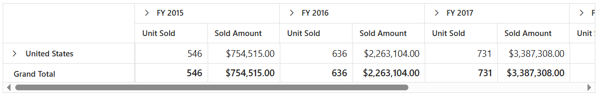

<!-- markdownlint-disable MD012 -->

# Filtering in Blazor Pivot Table Component

Filtering helps you focus on specific data by showing only the records you need in the Pivot Table. This allows you to analyze relevant information more effectively by including or excluding specific members through the user interface or programmatically.

The Pivot Table offers three types of filtering options:

* Member filtering
* Label filtering
* Value filtering

N> When all filtering options are disabled programmatically, the filter icon will not appear in the field list or grouping bar interface.

## Member filtering

This filtering option displays the Pivot Table with selective records based on the members you choose to include or exclude in each field. By default, member filtering is enabled through the [AllowMemberFilter](https://help.syncfusion.com/cr/blazor/Syncfusion.Blazor.PivotView.PivotViewDataSourceSettings-1.html#Syncfusion_Blazor_PivotView_PivotViewDataSourceSettings_1_AllowMemberFilter) property in the [PivotViewDataSourceSettings](https://help.syncfusion.com/cr/blazor/Syncfusion.Blazor.PivotView.PivotViewDataSourceSettings-1.html) class. 

Users can apply member filters at runtime by clicking the filter icon next to any field in the row, column, and filter axes, available in both the field list and grouping bar interfaces.


<br/>

<br/>

<br/>


You can also configure filtering programmatically using the [PivotViewFilterSettings](https://help.syncfusion.com/cr/blazor/Syncfusion.Blazor.PivotView.PivotViewFilterSetting.html) class during the initial rendering of the component. The essential settings required to add filter criteria are:

* [Name](https://help.syncfusion.com/cr/blazor/Syncfusion.Blazor.PivotView.PivotFilterSetting.html#Syncfusion_Blazor_PivotView_PivotFilterSetting_Name): Sets the appropriate field name for filtering.
* [Type](https://help.syncfusion.com/cr/blazor/Syncfusion.Blazor.PivotView.PivotFilterSetting.html#Syncfusion_Blazor_PivotView_PivotFilterSetting_Type): Specifies the filter type as [FilterType.Include](https://help.syncfusion.com/cr/blazor/Syncfusion.Blazor.PivotView.FilterType.html#Syncfusion_Blazor_PivotView_FilterType_Include) or [FilterType.Exclude](https://help.syncfusion.com/cr/blazor/Syncfusion.Blazor.PivotView.FilterType.html#Syncfusion_Blazor_PivotView_FilterType_Exclude) to include or exclude field members respectively.
* [Items](https://help.syncfusion.com/cr/blazor/Syncfusion.Blazor.PivotView.PivotFilterSetting.html#Syncfusion_Blazor_PivotView_PivotFilterSetting_Items): Defines the members that need to be either included or excluded from the display.
* [LevelCount](https://help.syncfusion.com/cr/blazor/Syncfusion.Blazor.PivotView.PivotFilterSetting.html#Syncfusion_Blazor_PivotView_PivotFilterSetting_LevelCount): Sets the level count of the field to fetch data from the cube. **NOTE: This property is applicable only for OLAP data sources.**

N> When you specify unavailable or inappropriate members in the include or exclude filter items collection, they will be ignored.

```cshtml
@using Syncfusion.Blazor.PivotView

<SfPivotView TValue="ProductDetails" ShowGroupingBar="true">
     <PivotViewDataSourceSettings DataSource="@data">
        <PivotViewColumns>
            <PivotViewColumn Name="Year"></PivotViewColumn>
            <PivotViewColumn Name="Quarter"></PivotViewColumn>
        </PivotViewColumns>
        <PivotViewRows>
            <PivotViewRow Name="Country"></PivotViewRow>
            <PivotViewRow Name="Products"></PivotViewRow>
        </PivotViewRows>
        <PivotViewValues>
            <PivotViewValue Name="Sold" Caption="Unit Sold"></PivotViewValue>
            <PivotViewValue Name="Amount" Caption="Sold Amount"></PivotViewValue>
        </PivotViewValues>
        <PivotViewFormatSettings>
            <PivotViewFormatSetting Name="Amount" Format="C0" UseGrouping="true"></PivotViewFormatSetting>
        </PivotViewFormatSettings>
        <PivotViewFilterSettings>
            <PivotViewFilterSetting Name="Year" Type=FilterType.Exclude Items="@(new string[] { "FY 2017" })">
        </PivotViewFilterSetting>
        </PivotViewFilterSettings>
    </PivotViewDataSourceSettings>
</SfPivotView>

@code{
    public List<ProductDetails> data { get; set; }
    protected override void OnInitialized()
    {
        this.data = ProductDetails.GetProductData().ToList();
        //Bind the data source collection here. Refer "Assigning sample data to the pivot table" section in getting started for more details.
    }
}

```


### Option to select and unselect all members

This option lets you quickly manage all members at once, saving time when working with large datasets. The member filter dialog includes an **All** option that provides a convenient way to select or deselect all available members with a single click.

When you check the **All** option, it selects all members in the list. When you uncheck it, all members become deselected. If you manually select some members while others remain unselected, the **All** option displays an intermediate state (partially checked) to show that the list contains both selected and unselected members.


N> When all members are deselected, the **OK** button becomes disabled. You must select at least one member to apply the filter and display data in the Pivot Table.


### Provision to search specific member(s)

This option helps you quickly locate specific members without scrolling through long lists. The member filter dialog includes a built-in search box that allows you to find members by typing part of their name.

Simply enter the starting characters of the member name you want to find, and the list will automatically filter to show only matching members. This makes it easy to locate and select specific members, especially when dealing with large datasets.


### Option to sort members

This option allows you to organize members in a logical order for easier selection and review. The member filter dialog provides built-in sort icons that let you arrange members in ascending or descending order.

You can click the ascending sort icon to arrange members from A to Z (or lowest to highest for numerical values), or click the descending sort icon to arrange them from Z to A (or highest to lowest). When neither sorting option is selected, members appear in their original order as retrieved from the data source.


### Performance tips

The member filter dialog improves loading performance when working with large datasets by limiting the number of members displayed initially. This helps you work with extensive data without experiencing delays while the member list loads.

You can control how many members are displayed in the member filter dialog using the [MaxNodeLimitInMemberEditor](https://help.syncfusion.com/cr/blazor/Syncfusion.Blazor.PivotView.SfPivotView-1.html#Syncfusion_Blazor_PivotView_SfPivotView_1_MaxNodeLimitInMemberEditor) property in [SfPivotView](https://help.syncfusion.com/cr/blazor/Syncfusion.Blazor.PivotView.SfPivotView-1.html) class. By default, this property is set to **1000**. When your data contains more members than this limit, only the specified number will be shown initially, and a message will indicate how many additional members are available.

```cshtml
@using Syncfusion.Blazor.PivotView

<SfPivotView TValue="ProductDetails" ShowFieldList="true" EnableVirtualization="true" MaxNodeLimitInMemberEditor="500">
    <PivotViewDataSourceSettings DataSource="@data">
        <PivotViewColumns>
            <PivotViewColumn Name="DeliveryDate"></PivotViewColumn>
        </PivotViewColumns>
        <PivotViewRows>
            <PivotViewRow Name="ProductID"></PivotViewRow>
        </PivotViewRows>
        <PivotViewValues>
            <PivotViewValue Name="Sold" Caption="Units Sold"></PivotViewValue>
        </PivotViewValues>
    </PivotViewDataSourceSettings>
</SfPivotView>

@code{
    public List<ProductDetails> data { get; set; }
    protected override void OnInitialized()
    {
        this.data = ProductDetails.GetProductData().ToList();
    }

    public class ProductDetails
    {
        public string ProductID { get; set; }
        public int Sold { get; set; }
        public DateTime DeliveryDate { get; set; }
        public static List<ProductDetails> GetProductData()
        {
            List<ProductDetails> productData = new List<ProductDetails>();
            for (int i = 0; i < 5000; i++)
            {
                int RandomNumber = new Random().Next(1, 10);
                productData.Add(new ProductDetails { Sold = RandomNumber, ProductID = "PRO-" + (i+1001), DeliveryDate = new DateTime(2019, 1, 1).AddDays(RandomNumber) });
            }
            return productData;
        }
    }
}

```


When the member count exceeds your set limit, you can use the search option to find specific members beyond the displayed range. For example, if your data contains 5000 members named "Node 1", "Node 2", "Node 3", and so on, and you set the [MaxNodeLimitInMemberEditor](https://help.syncfusion.com/cr/blazor/Syncfusion.Blazor.PivotView.SfPivotView-1.html#Syncfusion_Blazor_PivotView_SfPivotView_1_MaxNodeLimitInMemberEditor) property to **500**, only the first 500 members will appear by default. The dialog will show a message like "4500 more items. Search to refine further." To access members 501 to 5000, type the starting characters in the search box to locate the desired members. Once the members appear in the list, you can select or deselect them to apply your filtering preferences.

### Loading members on-demand

N> This property is applicable only for OLAP data sources.

This option improves the performance of the member editor by loading members only when needed, rather than loading all members at once. You can enable this by setting the [LoadOnDemandInMemberEditor](https://help.syncfusion.com/cr/blazor/Syncfusion.Blazor.PivotView.SfPivotView-1.html#Syncfusion_Blazor_PivotView_SfPivotView_1_LoadOnDemandInMemberEditor) property to **true**. When enabled, only the first level members are loaded initially from the OLAP cube, allowing the member editor to open quickly without performance delays.

By default, this property is set to **true** and search operations will only apply to the currently loaded level members. You can load additional level members using either of the following methods:

* **Expand individual members**: Click the expander button next to any member to load only its child members.
* **Load by level selection**: Choose a specific level from the dropdown list to load all members up to that selected level from the cube.

This approach prevents performance issues when working with hierarchies that contain large numbers of members. Once level members are loaded, they remain available for all subsequent operations (such as reopening the dialog or drag-and-drop actions) and persist until you refresh the web page.

```cshtml

@using Syncfusion.Blazor.PivotView

<SfPivotView TValue="ProductDetails"  Width="800" Height="350" LoadOnDemandInMemberEditor="true">
    <PivotViewDataSourceSettings TValue="ProductDetails" ProviderType="ProviderType.SSAS" Catalog="Adventure Works DW 2008 SE" Cube="Adventure Works" Url="https://bi.syncfusion.com/olap/msmdpump.dll" LocaleIdentifier="1033" EnableSorting="true">
        <PivotViewColumns>
            <PivotViewColumn Name="[Product].[Product Categories]" Caption="Product Category"></PivotViewColumn>
            <PivotViewColumn Name="[Measures]" Caption="Measure"></PivotViewColumn>
        </PivotViewColumns>
        <PivotViewRows>
            <PivotViewRow Name="[Customer].[Customer Geography]" Caption="Customer Geography"></PivotViewRow>
        </PivotViewRows>
        <PivotViewValues>
            <PivotViewValue Name="[Measures].[Customer Count]" Caption="Customer Count"></PivotViewValue>
            <PivotViewValue Name="[Measures].[Internet Sales Amount]" Caption="Internet Sales Amount"></PivotViewValue>
        </PivotViewValues>
    </PivotViewDataSourceSettings>
    <PivotViewGridSettings ColumnWidth="160"></PivotViewGridSettings>
</SfPivotView>
<style>
    .e-pivotview {
        min-height: 200px;
    }
</style>

```


In the example above, the "Customer Geography" dimension loads with only the first level (Country) initially. Search operations will apply only to the "Country" level members. You can then load the next level members (State-Province) on-demand in two ways:

* **Expand specific countries**: When you expand "Australia", the "State-Province" members load only for Australia.
* **Load all states by level**: When you select "State-Province" from the dropdown list, all "State-Province" members load across all countries (Australia, Canada, France, etc.).

Once loaded, these members are stored internally and remain available until you refresh the page.

When the [LoadOnDemandInMemberEditor](https://help.syncfusion.com/cr/blazor/Syncfusion.Blazor.PivotView.SfPivotView-1.html#Syncfusion_Blazor_PivotView_SfPivotView_1_LoadOnDemandInMemberEditor) property is set to **false**, all members from all levels are loaded during the initial setup. This approach executes a single query to retrieve all members at once. While this may cause slower performance when opening the member editor due to the large number of members being fetched, expand and search operations will be faster since all members are already available.


### Loading members based on level number

N> This property is applicable only for OLAP data sources.

This option enables you to control the depth of member loading by specifying how many levels should be loaded initially. By setting the [LevelCount](https://help.syncfusion.com/cr/blazor/Syncfusion.Blazor.PivotView.PivotFilterSetting.html#Syncfusion_Blazor_PivotView_PivotFilterSetting_LevelCount) property in the [PivotViewFilterSettings](https://help.syncfusion.com/cr/blazor/Syncfusion.Blazor.PivotView.PivotViewFilterSettings.html), you can improve performance and focus filtering operations on specific hierarchy levels.

The [LevelCount](https://help.syncfusion.com/cr/blazor/Syncfusion.Blazor.PivotView.PivotFilterSetting.html#Syncfusion_Blazor_PivotView_PivotFilterSetting_LevelCount) property is set to **1** by default, which means only the first level members are loaded initially. When you apply filters or search operations, they will only affect the members within the loaded levels.

```cshtml

@using Syncfusion.Blazor.PivotView

<SfPivotView TValue="ProductDetails"  Width="800" Height="350" >
    <PivotViewDataSourceSettings TValue="ProductDetails" ProviderType="ProviderType.SSAS" Catalog="Adventure Works DW 2008 SE" Cube="Adventure Works" Url="https://bi.syncfusion.com/olap/msmdpump.dll" LocaleIdentifier="1033" EnableSorting="true">
        <PivotViewColumns>
            <PivotViewColumn Name="[Product].[Product Categories]" Caption="Product Category"></PivotViewColumn>
            <PivotViewColumn Name="[Measures]" Caption="Measure"></PivotViewColumn>
        </PivotViewColumns>
        <PivotViewRows>
            <PivotViewRow Name="[Customer].[Customer Geography]" Caption="Customer Geography"></PivotViewRow>
        </PivotViewRows>
        <PivotViewValues>
            <PivotViewValue Name="[Measures].[Customer Count]" Caption="Customer Count"></PivotViewValue>
            <PivotViewValue Name="[Measures].[Internet Sales Amount]" Caption="Internet Sales Amount"></PivotViewValue>
        </PivotViewValues>
        <PivotViewFilterSettings>
            <PivotViewFilterSetting Name="[Customer].[Customer Geography]" Type=FilterType.Exclude Items="@(new string[] { '[Customer].[Customer Geography].[State-Province].&[NSW]&[AU]' })" LevelCount="2"></PivotViewFilterSetting>
        </PivotViewFilterSettings>
    </PivotViewDataSourceSettings>
    <PivotViewGridSettings ColumnWidth="160"></PivotViewGridSettings>
</SfPivotView>
<style>
    .e-pivotview {
        min-height: 200px;
    }
</style>

```


In the example above, the [LevelCount](https://help.syncfusion.com/cr/blazor/Syncfusion.Blazor.PivotView.PivotFilterSetting.html#Syncfusion_Blazor_PivotView_PivotFilterSetting_LevelCount) is set to **2** for the "Customer Geography" dimension in [PivotViewFilterSettings](https://help.syncfusion.com/cr/blazor/Syncfusion.Blazor.PivotView.PivotViewFilterSettings.html). This loads both the "Country" and "State-Province" levels during the initial loading process. Any search or filter operations will be applied only to the members within these two levels. To access members from deeper levels like "City", you can either expand the respective "State-Province" node or select the "City" level from the dropdown list.

## Label filtering

Label filtering allows you to display only the data with specific header text across row and column fields, making it easier to focus on relevant information in your Pivot Table. This filtering works with three types of data:

* String data type
* Number data type
* Date data type

To enable label filtering, set the [AllowLabelFilter](https://help.syncfusion.com/cr/blazor/Syncfusion.Blazor.PivotView.PivotViewDataSourceSettings-1.html#Syncfusion_Blazor_PivotView_PivotViewDataSourceSettings_1_AllowLabelFilter) property to **true** in the [PivotViewDataSourceSettings](https://help.syncfusion.com/cr/blazor/Syncfusion.Blazor.PivotView.PivotViewDataSourceSettings-1.html) class. Once enabled, you can access the filtering options by clicking the filter icon next to any field in the row or column axis of the field list or grouping bar. This opens the filtering dialog where you can navigate to the "Label" tab to apply your label filtering criteria.

```cshtml
@using Syncfusion.Blazor.PivotView

<SfPivotView TValue="ProductDetails" ShowGroupingBar="true" ShowFieldList="true">
     <PivotViewDataSourceSettings DataSource="@data" AllowLabelFilter="true">
        <PivotViewColumns>
            <PivotViewColumn Name="Year"></PivotViewColumn>
            <PivotViewColumn Name="Quarter"></PivotViewColumn>
        </PivotViewColumns>
        <PivotViewRows>
            <PivotViewRow Name="Country"></PivotViewRow>
            <PivotViewRow Name="Products"></PivotViewRow>
        </PivotViewRows>
        <PivotViewValues>
            <PivotViewValue Name="Sold" Caption="Unit Sold"></PivotViewValue>
            <PivotViewValue Name="Amount" Caption="Sold Amount"></PivotViewValue>
        </PivotViewValues>
        <PivotViewFormatSettings>
            <PivotViewFormatSetting Name="Amount" Format="C0"></PivotViewFormatSetting>
        </PivotViewFormatSettings>
    </PivotViewDataSourceSettings>
</SfPivotView>

@code{
    public List<ProductDetails> data { get; set; }
    protected override void OnInitialized()
    {
        this.data = ProductDetails.GetProductData().ToList();
        //Bind the data source collection here. Refer "Assigning sample data to the pivot table" section in getting started for more details.
    }
}

```


<br/>

<br/>
<br/>

<br/>
<br/>


N> In label filtering UI, based on the field chosen, it’s member data type is automatically recognized and filtering operation will be carried out. Where as in code behind, user need to define the data type through a property and it has been explained in the immediate section below.

### Filtering string data type through code

String-based label filtering enables you to programmatically show only data that matches specific text values in your row and column fields, making it easier to focus on the exact information you need.

This filtering approach is specifically designed for fields containing string data type members. You can configure the filtering through the [PivotViewFilterSettings](https://help.syncfusion.com/cr/blazor/Syncfusion.Blazor.PivotView.PivotViewFilterSetting.html) class in your code. The following properties are required for label filtering:

* [Name](https://help.syncfusion.com/cr/blazor/Syncfusion.Blazor.PivotView.PivotFilterSetting.html#Syncfusion_Blazor_PivotView_PivotFilterSetting_Name): Specifies the field name to apply the filter.
* [Type](https://help.syncfusion.com/cr/blazor/Syncfusion.Blazor.PivotView.PivotFilterSetting.html#Syncfusion_Blazor_PivotView_PivotFilterSetting_Type): Sets the filter type as [FilterType.Label](https://help.syncfusion.com/cr/blazor/Syncfusion.Blazor.PivotView.FilterType.html#Syncfusion_Blazor_PivotView_FilterType_Label) for the specified field.
* [Condition](https://help.syncfusion.com/cr/blazor/Syncfusion.Blazor.PivotView.PivotFilterSetting.html#Syncfusion_Blazor_PivotView_PivotFilterSetting_Condition): Defines the operator type such as [Operators.Equals](https://help.syncfusion.com/cr/blazor/Syncfusion.Blazor.PivotView.Operators.html#Syncfusion_Blazor_PivotView_Operators_Equals), [Operators.GreaterThan](https://help.syncfusion.com/cr/blazor/Syncfusion.Blazor.PivotView.Operators.html#Syncfusion_Blazor_PivotView_Operators_GreaterThan), [Operators.LessThan](https://help.syncfusion.com/cr/blazor/Syncfusion.Blazor.PivotView.Operators.html#Syncfusion_Blazor_PivotView_Operators_LessThan), and others.
* [Value1](https://help.syncfusion.com/cr/blazor/Syncfusion.Blazor.PivotView.PivotFilterSetting.html#Syncfusion_Blazor_PivotView_PivotFilterSetting_Value1): Sets the primary value for comparison.
* [Value2](https://help.syncfusion.com/cr/blazor/Syncfusion.Blazor.PivotView.PivotFilterSetting.html#Syncfusion_Blazor_PivotView_PivotFilterSetting_Value2): Sets the secondary value for comparison. This property is only applicable for operators like [Operators.Between](https://help.syncfusion.com/cr/blazor/Syncfusion.Blazor.PivotView.Operators.html#Syncfusion_Blazor_PivotView_Operators_Between) and [Operators.NotBetween](https://help.syncfusion.com/cr/blazor/Syncfusion.Blazor.PivotView.Operators.html#Syncfusion_Blazor_PivotView_Operators_NotBetween).
* [SelectedField](https://help.syncfusion.com/cr/blazor/Syncfusion.Blazor.PivotView.PivotFilterSetting.html#Syncfusion_Blazor_PivotView_PivotFilterSetting_SelectedField): Specifies the level name of a dimension where the filter should be applied. **NOTE: This property is applicable only for OLAP data sources.**

For example, to display only countries containing "United" in their name from a "Country" field, set the [Value1](https://help.syncfusion.com/cr/blazor/Syncfusion.Blazor.PivotView.PivotFilterSetting.html#Syncfusion_Blazor_PivotView_PivotFilterSetting_Value1) property to "United" and the [Condition](https://help.syncfusion.com/cr/blazor/Syncfusion.Blazor.PivotView.PivotFilterSetting.html#Syncfusion_Blazor_PivotView_PivotFilterSetting_Condition) property to [Operators.Contains](https://help.syncfusion.com/cr/blazor/Syncfusion.Blazor.PivotView.Operators.html#Syncfusion_Blazor_PivotView_Operators_Contains).

The following table shows all available operators for label filtering:

| Operator | Description |
|------|-------------|
| Equals| Shows records that exactly match the specified text.|
| DoesNotEquals| Shows records that do not match the specified text.|
| BeginWith| Shows records that start with the specified text.|
| DoesNotBeginWith| Shows records that do not start with the specified text.|
| EndsWith| Shows records that end with the specified text.|
| DoesNotEndsWith| Shows records that do not end with the specified text.|
| Contains| Shows records that contain the specified text anywhere.|
| DoesNotContains| Shows records that do not contain the specified text.|
| GreaterThan| Shows records where the text value is alphabetically greater.|
| GreaterThanOrEqualTo| Shows records where the text value is alphabetically greater than or equal.|
| LessThan| Shows records where the text value is alphabetically less.|
| LessThanOrEqualTo| Shows records where the text value is alphabetically less than or equal.|
| Between| Shows records with text values that fall between two specified values.|
| NotBetween| Shows records with text values that do not fall between two specified values.|

```cshtml
@using Syncfusion.Blazor.PivotView

<SfPivotView TValue="ProductDetails">
     <PivotViewDataSourceSettings DataSource="@data" AllowLabelFilter="true">
        <PivotViewColumns>
            <PivotViewColumn Name="Year"></PivotViewColumn>
            <PivotViewColumn Name="Quarter"></PivotViewColumn>
        </PivotViewColumns>
        <PivotViewRows>
            <PivotViewRow Name="Country"></PivotViewRow>
            <PivotViewRow Name="Products"></PivotViewRow>
        </PivotViewRows>
        <PivotViewValues>
            <PivotViewValue Name="Sold" Caption="Unit Sold"></PivotViewValue>
            <PivotViewValue Name="Amount" Caption="Sold Amount"></PivotViewValue>
        </PivotViewValues>
        <PivotViewFormatSettings>
            <PivotViewFormatSetting Name="Amount" Format="C"></PivotViewFormatSetting>
        </PivotViewFormatSettings>
        <PivotViewFilterSettings>
            <PivotViewFilterSetting Name="Country" Type=FilterType.Label Condition=Operators.Contains Value1="United">
        </PivotViewFilterSetting>
        </PivotViewFilterSettings>
    </PivotViewDataSourceSettings>
</SfPivotView>

@code{
    public List<ProductDetails> data { get; set; }
    protected override void OnInitialized()
    {
        this.data = ProductDetails.GetProductData().ToList();
        //Bind the data source collection here. Refer "Assigning sample data to the pivot table" section in getting started for more details.
    }
}

```



### Filtering number data type through code

N> This option is applicable only for relational data sources.

Filter numeric data programmatically to display only values that meet specific numeric conditions, helping you analyze data patterns and ranges more effectively. This filtering approach is specifically designed for fields containing numeric data types and follows the same configuration method as string data filtering, with one key difference: set the [Type](https://help.syncfusion.com/cr/blazor/Syncfusion.Blazor.PivotView.PivotFilterSetting.html#Syncfusion_Blazor_PivotView_PivotFilterSetting_Type) property to [FilterType.Number](https://help.syncfusion.com/cr/blazor/Syncfusion.Blazor.PivotView.FilterType.html#Syncfusion_Blazor_PivotView_FilterType_Number) enumeration instead of [FilterType.Label](https://help.syncfusion.com/cr/blazor/Syncfusion.Blazor.PivotView.FilterType.html#Syncfusion_Blazor_PivotView_FilterType_Label).

To filter numeric values, specify the filtering criteria using the following properties:
- [Value1](https://help.syncfusion.com/cr/blazor/Syncfusion.Blazor.PivotView.PivotFilterSetting.html#Syncfusion_Blazor_PivotView_PivotFilterSetting_Value1): The primary value for comparison.
- [Condition](https://help.syncfusion.com/cr/blazor/Syncfusion.Blazor.PivotView.PivotFilterSetting.html#Syncfusion_Blazor_PivotView_PivotFilterSetting_Condition): The comparison operator.
- [Value2](https://help.syncfusion.com/cr/blazor/Syncfusion.Blazor.PivotView.PivotFilterSetting.html#Syncfusion_Blazor_PivotView_PivotFilterSetting_Value2): The secondary value (required for [Operators.Between](https://help.syncfusion.com/cr/blazor/Syncfusion.Blazor.PivotView.Operators.html#Syncfusion_Blazor_PivotView_Operators_Between) and [Operators.NotBetween](https://help.syncfusion.com/cr/blazor/Syncfusion.Blazor.PivotView.Operators.html#Syncfusion_Blazor_PivotView_Operators_NotBetween) conditions).

For example, to display only sales data where the "Sold" field values are between 90 and 100, set [Value1](https://help.syncfusion.com/cr/blazor/Syncfusion.Blazor.PivotView.PivotViewFilterSetting.html#Syncfusion_Blazor_PivotView_PivotViewFilterSetting_Value1) to "90", [Value2](https://help.syncfusion.com/cr/blazor/Syncfusion.Blazor.PivotView.PivotViewFilterSetting.html#Syncfusion_Blazor_PivotView_PivotViewFilterSetting_Value2) to "100", and [Condition](https://help.syncfusion.com/cr/blazor/Syncfusion.Blazor.PivotView.PivotViewFilterSetting.html#Syncfusion_Blazor_PivotView_PivotViewFilterSetting_Condition) to [Operators.Between](https://help.syncfusion.com/cr/blazor/Syncfusion.Blazor.PivotView.Operators.html#Syncfusion_Blazor_PivotView_Operators_Between).

N> The following operators are supported for number data type: [Operators.Equals](https://help.syncfusion.com/cr/blazor/Syncfusion.Blazor.PivotView.Operators.html#Syncfusion_Blazor_PivotView_Operators_Equals), [Operators.DoesNotEquals](https://help.syncfusion.com/cr/blazor/Syncfusion.Blazor.PivotView.Operators.html#Syncfusion_Blazor_PivotView_Operators_DoesNotEquals), [Operators.GreaterThan](https://help.syncfusion.com/cr/blazor/Syncfusion.Blazor.PivotView.Operators.html#Syncfusion_Blazor_PivotView_Operators_GreaterThan), [Operators.GreaterThanOrEqualTo](https://help.syncfusion.com/cr/blazor/Syncfusion.Blazor.PivotView.Operators.html#Syncfusion_Blazor_PivotView_Operators_GreaterThanOrEqualTo), [Operators.LessThan](https://help.syncfusion.com/cr/blazor/Syncfusion.Blazor.PivotView.Operators.html#Syncfusion_Blazor_PivotView_Operators_LessThan), [Operators.LessThanOrEqualTo](https://help.syncfusion.com/cr/blazor/Syncfusion.Blazor.PivotView.Operators.html#Syncfusion_Blazor_PivotView_Operators_LessThanOrEqualTo), [Operators.Between](https://help.syncfusion.com/cr/blazor/Syncfusion.Blazor.PivotView.Operators.html#Syncfusion_Blazor_PivotView_Operators_Between), and [Operators.NotBetween](https://help.syncfusion.com/cr/blazor/Syncfusion.Blazor.PivotView.Operators.html#Syncfusion_Blazor_PivotView_Operators_NotBetween).

N> Number filtering is available only when the field contains numeric data format.

```cshtml
@using Syncfusion.Blazor.PivotView

<SfPivotView TValue="ProductDetails">
    <PivotViewDataSourceSettings DataSource="@data" AllowLabelFilter="true">
        <PivotViewColumns>
            <PivotViewColumn Name="Year"></PivotViewColumn>
            <PivotViewColumn Name="Quarter"></PivotViewColumn>
        </PivotViewColumns>
        <PivotViewRows>
            <PivotViewRow Name="Sold" Caption="Unit Sold"></PivotViewRow>
            <PivotViewRow Name="Country"></PivotViewRow>
            <PivotViewRow Name="Products"></PivotViewRow>
        </PivotViewRows>
        <PivotViewValues>
            <PivotViewValue Name="Amount" Caption="Sold Amount"></PivotViewValue>
        </PivotViewValues>
        <PivotViewFormatSettings>
            <PivotViewFormatSetting Name="Amount" Format="C"></PivotViewFormatSetting>
        </PivotViewFormatSettings>
        <PivotViewFilterSettings>
            <PivotViewFilterSetting Name="Sold" Type=FilterType.Number Condition=Operators.Between Value1=90 Value2=100></PivotViewFilterSetting>
        </PivotViewFilterSettings>
    </PivotViewDataSourceSettings>
</SfPivotView>

@code{
    public List<ProductDetails> data { get; set; }
    protected override void OnInitialized()
    {
        this.data = ProductDetails.GetProductData().ToList();
        //Bind the data source collection here. Refer "Assigning sample data to the pivot table" section in getting started for more details.
    }
}

```


### Filtering date data type through code

This filtering option makes it simple to filter data based on date values in your fields, helping you quickly focus on records from specific time periods. This type of filtering is only available for fields that contain date data types and can be configured programmatically using the same approach as explained in the previous section "Filtering string data type through code", with one key difference: set the [Type](https://help.syncfusion.com/cr/blazor/Syncfusion.Blazor.PivotView.PivotFilterSetting.html#Syncfusion_Blazor_PivotView_PivotFilterSetting_Type) property to [FilterType.Date](https://help.syncfusion.com/cr/blazor/Syncfusion.Blazor.PivotView.FilterType.html#Syncfusion_Blazor_PivotView_FilterType_Date).

To apply date filtering, specify your filtering criteria using the [Value1](https://help.syncfusion.com/cr/blazor/Syncfusion.Blazor.PivotView.PivotFilterSetting.html#Syncfusion_Blazor_PivotView_PivotFilterSetting_Value1) and [Condition](https://help.syncfusion.com/cr/blazor/Syncfusion.Blazor.PivotView.PivotFilterSetting.html#Syncfusion_Blazor_PivotView_PivotFilterSetting_Condition) properties. For example, if you have a "Delivery Date" field and want to show delivery records from before a specific date like "2019-01-07", set the [Value1](https://help.syncfusion.com/cr/blazor/Syncfusion.Blazor.PivotView.PivotFilterSetting.html#Syncfusion_Blazor_PivotView_PivotFilterSetting_Value1) property to "2019-01-07" and the [Condition](https://help.syncfusion.com/cr/blazor/Syncfusion.Blazor.PivotView.PivotFilterSetting.html#Syncfusion_Blazor_PivotView_PivotFilterSetting_Condition) property to [Operators.Before](https://help.syncfusion.com/cr/blazor/Syncfusion.Blazor.PivotView.Operators.html#Syncfusion_Blazor_PivotView_Operators_Before). This will display only the records with delivery dates before January 7, 2019 in your Pivot Table.

N> You can use the following operators with date data type filtering: [Operators.Equals](https://help.syncfusion.com/cr/blazor/Syncfusion.Blazor.PivotView.Operators.html#Syncfusion_Blazor_PivotView_Operators_Equals), [Operators.DoesNotEquals](https://help.syncfusion.com/cr/blazor/Syncfusion.Blazor.PivotView.Operators.html#Syncfusion_Blazor_PivotView_Operators_DoesNotEquals), [Operators.Before](https://help.syncfusion.com/cr/blazor/Syncfusion.Blazor.PivotView.Operators.html#Syncfusion_Blazor_PivotView_Operators_Before), [Operators.BeforeOrEqualTo](https://help.syncfusion.com/cr/blazor/Syncfusion.Blazor.PivotView.Operators.html#Syncfusion_Blazor_PivotView_Operators_BeforeOrEqualTo), [Operators.After](https://help.syncfusion.com/cr/blazor/Syncfusion.Blazor.PivotView.Operators.html#Syncfusion_Blazor_PivotView_Operators_After), [Operators.AfterOrEqualTo](https://help.syncfusion.com/cr/blazor/Syncfusion.Blazor.PivotView.Operators.html#Syncfusion_Blazor_PivotView_Operators_AfterOrEqualTo), [Operators.Between](https://help.syncfusion.com/cr/blazor/Syncfusion.Blazor.PivotView.Operators.html#Syncfusion_Blazor_PivotView_Operators_Between), and [Operators.NotBetween](https://help.syncfusion.com/cr/blazor/Syncfusion.Blazor.PivotView.Operators.html#Syncfusion_Blazor_PivotView_Operators_NotBetween).

N> Date filtering is available only when the field has date type [FormatSettings](https://help.syncfusion.com/cr/blazor/Syncfusion.Blazor.PivotView.PivotViewFormatSettings.html) configured.

```cshtml
@using Syncfusion.Blazor.PivotView

<SfPivotView TValue="ProductDetails">
<PivotViewDataSourceSettings DataSource="@data" AllowLabelFilter="true">
    <PivotViewColumns>
        <PivotViewColumn Name="ProductID"></PivotViewColumn>
    </PivotViewColumns>
    <PivotViewRows>
        <PivotViewRow Name="DeliveryDate"></PivotViewRow>
    </PivotViewRows>
    <PivotViewValues>
        <PivotViewValue Name="Sold" Caption="Units Sold"></PivotViewValue>
    </PivotViewValues>
    <PivotViewFormatSettings>
        <PivotViewFormatSetting Name="DeliveryDate" Type="FormatType.DateTime" Format="dd/MMM/yyyy"></PivotViewFormatSetting>
    </PivotViewFormatSettings>
    <PivotViewFilterSettings>
        <PivotViewFilterSetting Name="DeliveryDate" Type=FilterType.Date Condition=Operators.Before Value1="2019-01-07"></PivotViewFilterSetting>
    </PivotViewFilterSettings>
</PivotViewDataSourceSettings>
</SfPivotView>

@code{
    public List<ProductDetails> data { get; set; }
    protected override void OnInitialized()
    {
        this.data = ProductDetails.GetProductData().ToList();
    }

    public class ProductDetails
    {
        public string ProductID { get; set; }
        public int Sold { get; set; }
        public DateTime DeliveryDate { get; set; }
        public static List<ProductDetails> GetProductData()
        {
            List<ProductDetails> productData = new List<ProductDetails>();
            for (int i = 0; i < 100; i++)
            {
                int RandomNumber = new Random().Next(1, 10);
                productData.Add(new ProductDetails { Sold = RandomNumber, ProductID = "PRO-" + ((i % 10)+1001), DeliveryDate = new DateTime(2019, 1, 1).AddDays(RandomNumber) });
            }
            return productData;
        }
    }
}

```


### Clearing the existing label filter

You can clear the applied label filter by clicking the **Clear** option at the bottom of the filter dialog. This option is located under the **Label** tab for string and number type filtering, and under the **Date** tab for date type filtering.


## Value filtering

Value filtering allows you to filter data based on aggregated values from measure fields, helping you focus on specific data ranges that meet your criteria.

You can enable value filtering by setting the [AllowValueFilter](https://help.syncfusion.com/cr/blazor/Syncfusion.Blazor.PivotView.PivotViewDataSourceSettings-1.html#Syncfusion_Blazor_PivotView_PivotViewDataSourceSettings_1_AllowValueFilter) property to **true** in the [PivotViewDataSourceSettings](https://help.syncfusion.com/cr/blazor/Syncfusion.Blazor.PivotView.PivotViewDataSourceSettings-1.html) class. Once enabled, click the filter icon next to any field in the row or column axis within the field list or grouping bar. A filtering dialog will appear where you can navigate to the "Value" tab to perform value filtering operations.

```cshtml
@using Syncfusion.Blazor.PivotView

<SfPivotView TValue="ProductDetails" ShowFieldList="true">
     <PivotViewDataSourceSettings DataSource="@data" AllowValueFilter="true">
        <PivotViewColumns>
            <PivotViewColumn Name="Year"></PivotViewColumn>
            <PivotViewColumn Name="Quarter"></PivotViewColumn>
        </PivotViewColumns>
        <PivotViewRows>
            <PivotViewRow Name="Country"></PivotViewRow>
            <PivotViewRow Name="Products"></PivotViewRow>
        </PivotViewRows>
        <PivotViewValues>
            <PivotViewValue Name="Sold" Caption="Unit Sold"></PivotViewValue>
            <PivotViewValue Name="Amount" Caption="Sold Amount"></PivotViewValue>
        </PivotViewValues>
        <PivotViewFormatSettings>
            <PivotViewFormatSetting Name="Amount" Format="C0"></PivotViewFormatSetting>
        </PivotViewFormatSettings>
    </PivotViewDataSourceSettings>
</SfPivotView>

@code{
    public List<ProductDetails> data { get; set; }
    protected override void OnInitialized()
    {
        this.data = ProductDetails.GetProductData().ToList();
        //Bind the data source collection here. Refer "Assigning sample data to the pivot table" section in getting started for more details.
    }
}

```


<br/>

<br/>
<br/>

<br/>
<br/>


You can also configure value filtering programmatically using the [PivotViewFilterSettings](https://help.syncfusion.com/cr/blazor/Syncfusion.Blazor.PivotView.PivotViewFilterSetting.html) class. The following properties are required for value filtering:

* [Name](https://help.syncfusion.com/cr/blazor/Syncfusion.Blazor.PivotView.PivotFilterSetting.html#Syncfusion_Blazor_PivotView_PivotFilterSetting_Name): Specifies the field name to which the filter applies.
* [Type](https://help.syncfusion.com/cr/blazor/Syncfusion.Blazor.PivotView.PivotFilterSetting.html#Syncfusion_Blazor_PivotView_PivotFilterSetting_Type): Sets the filter type as [FilterType.Value](https://help.syncfusion.com/cr/blazor/Syncfusion.Blazor.PivotView.FilterType.html#Syncfusion_Blazor_PivotView_FilterType_Value).
* [Measure](https://help.syncfusion.com/cr/blazor/Syncfusion.Blazor.PivotView.PivotFilterSetting.html#Syncfusion_Blazor_PivotView_PivotFilterSetting_Measure): Specifies the value field name used for filtering.
* [Condition](https://help.syncfusion.com/cr/blazor/Syncfusion.Blazor.PivotView.PivotFilterSetting.html#Syncfusion_Blazor_PivotView_PivotFilterSetting_Condition): Defines the comparison operator such as [Operators.Equals](https://help.syncfusion.com/cr/blazor/Syncfusion.Blazor.PivotView.Operators.html#Syncfusion_Blazor_PivotView_Operators_Equals), [Operators.GreaterThan](https://help.syncfusion.com/cr/blazor/Syncfusion.Blazor.PivotView.Operators.html#Syncfusion_Blazor_PivotView_Operators_GreaterThan), or [Operators.LessThan](https://help.syncfusion.com/cr/blazor/Syncfusion.Blazor.PivotView.Operators.html#Syncfusion_Blazor_PivotView_Operators_LessThan).
* [Value1](https://help.syncfusion.com/cr/blazor/Syncfusion.Blazor.PivotView.PivotFilterSetting.html#Syncfusion_Blazor_PivotView_PivotFilterSetting_Value1): Sets the comparison value or the start value for range operations.
* [Value2](https://help.syncfusion.com/cr/blazor/Syncfusion.Blazor.PivotView.PivotFilterSetting.html#Syncfusion_Blazor_PivotView_PivotFilterSetting_Value2): Sets the end value, applicable only for [Operators.Between](https://help.syncfusion.com/cr/blazor/Syncfusion.Blazor.PivotView.Operators.html#Syncfusion_Blazor_PivotView_Operators_Between) and [Operators.NotBetween](https://help.syncfusion.com/cr/blazor/Syncfusion.Blazor.PivotView.Operators.html#Syncfusion_Blazor_PivotView_Operators_NotBetween) operators.
* [SelectedField](https://help.syncfusion.com/cr/blazor/Syncfusion.Blazor.PivotView.PivotFilterSetting.html#Syncfusion_Blazor_PivotView_PivotFilterSetting_SelectedField): Specifies the dimension level name where filter settings apply. **Note: This property is only applicable for OLAP data sources.**

For example, to display data where the total sum of units sold for each country exceeds 1500, set the [Value1](https://help.syncfusion.com/cr/blazor/Syncfusion.Blazor.PivotView.PivotFilterSetting.html#Syncfusion_Blazor_PivotView_PivotFilterSetting_Value1) to "1500" and [Condition](https://help.syncfusion.com/cr/blazor/Syncfusion.Blazor.PivotView.PivotFilterSetting.html#Syncfusion_Blazor_PivotView_PivotFilterSetting_Condition) to [Operators.GreaterThan](https://help.syncfusion.com/cr/blazor/Syncfusion.Blazor.PivotView.Operators.html#Syncfusion_Blazor_PivotView_Operators_GreaterThan) for the "Country" field.

The following table shows the available operators for value filtering:

| Operator | Description |
|------|-------------|
| Equals| Shows records that match the specified value.|
| DoesNotEquals| Shows records that do not match the specified value.|
| GreaterThan| Shows records where the value is greater than the specified value.|
| GreaterThanOrEqualTo| Shows records where the value is greater than or equal to the specified value.|
| LessThan| Shows records where the value is less than the specified value.|
| LessThanOrEqualTo| Shows records where the value is less than or equal to the specified value.|
| Between| Shows records with values between the specified start and end values.|
| NotBetween| Shows records with values outside the specified start and end values.|

```cshtml
@using Syncfusion.Blazor.PivotView

<SfPivotView TValue="ProductDetails" ShowGroupingBar="true">
     <PivotViewDataSourceSettings DataSource="@data" AllowValueFilter="true">
        <PivotViewColumns>
            <PivotViewColumn Name="Year"></PivotViewColumn>
            <PivotViewColumn Name="Quarter"></PivotViewColumn>
        </PivotViewColumns>
        <PivotViewRows>
            <PivotViewRow Name="Country"></PivotViewRow>
            <PivotViewRow Name="Products"></PivotViewRow>
        </PivotViewRows>
        <PivotViewValues>
            <PivotViewValue Name="Sold" Caption="Unit Sold"></PivotViewValue>
            <PivotViewValue Name="Amount" Caption="Sold Amount"></PivotViewValue>
        </PivotViewValues>
        <PivotViewFormatSettings>
            <PivotViewFormatSetting Name="Amount" Format="C0"></PivotViewFormatSetting>
        </PivotViewFormatSettings>
        <PivotViewFilterSettings>
            <PivotViewFilterSetting Name="Country" Measure="Sold" Type=FilterType.Value Condition=Operators.GreaterThan Value1=1500></PivotViewFilterSetting>
        </PivotViewFilterSettings>
    </PivotViewDataSourceSettings>
</SfPivotView>

@code{
    public List<ProductDetails> data { get; set; }
    protected override void OnInitialized()
    {
        this.data = ProductDetails.GetProductData().ToList();
        //Bind the data source collection here. Refer "Assigning sample data to the pivot table" section in getting started for more details.
    }
}

```


### Clearing the existing value filter

You can clear the applied value filter by clicking the "Clear" option at the bottom of the filter dialog under the "Value" tab.


## Events

### MemberEditorOpen

When you open the Member Editor dialog, the [MemberEditorOpen](https://help.syncfusion.com/cr/blazor/Syncfusion.Blazor.PivotView.PivotViewEvents-1.html#Syncfusion_Blazor_PivotView_PivotViewEvents_1_MemberEditorOpen) event is triggered. With this event, you can decide which field members are shown, making it easier to include or exclude specific items. The event provides the following options:

* [FieldName](https://help.syncfusion.com/cr/blazor/Syncfusion.Blazor.PivotView.MemberEditorOpenEventArgs.html#Syncfusion_Blazor_PivotView_MemberEditorOpenEventArgs_FieldName): The name of the field for which the Member Editor dialog opens.
* [FieldMembers](https://help.syncfusion.com/cr/blazor/Syncfusion.Blazor.PivotView.MemberEditorOpenEventArgs.html#Syncfusion_Blazor_PivotView_MemberEditorOpenEventArgs_FieldMembers): The list of all members in the selected field.
* [Cancel](https://help.syncfusion.com/cr/blazor/Syncfusion.Blazor.PivotView.MemberEditorOpenEventArgs.html#Syncfusion_Blazor_PivotView_MemberEditorOpenEventArgs_Cancel): If you set this property to true, the Member Editor dialog will not open.
* [FilterSettings](https://help.syncfusion.com/cr/blazor/Syncfusion.Blazor.PivotView.MemberEditorOpenEventArgs.html#Syncfusion_Blazor_PivotView_MemberEditorOpenEventArgs_FilterSetting): Contains the current filter settings including filter items, types, and conditions.

In the below sample, the member editor of field "Country" shows only the selected Item.

```cshtml
@using Syncfusion.Blazor.PivotView

<SfPivotView TValue="ProductDetails" ShowGroupingBar="true" >
        <PivotViewDataSourceSettings DataSource="@data">
        <PivotViewColumns>
            <PivotViewColumn Name="Year"></PivotViewColumn>
            <PivotViewColumn Name="Quarter"></PivotViewColumn>
        </PivotViewColumns>
        <PivotViewRows>
            <PivotViewRow Name="Country"></PivotViewRow>
            <PivotViewRow Name="Products"></PivotViewRow>
        </PivotViewRows>
        <PivotViewValues>
            <PivotViewValue Name="Sold" Caption="Unit Sold"></PivotViewValue>
            <PivotViewValue Name="Amount" Caption="Sold Amount"></PivotViewValue>
        </PivotViewValues>
        <PivotViewFormatSettings>
            <PivotViewFormatSetting Name="Amount" Format="C"></PivotViewFormatSetting>
        </PivotViewFormatSettings>
    </PivotViewDataSourceSettings>
    <PivotViewEvents TValue="ProductDetails" MemberEditorOpen="memberEditorOpen"></PivotViewEvents>
</SfPivotView>

@code{
    public List<ProductDetails> data { get; set; }
    protected override void OnInitialized()
    {
        this.data = ProductDetails.GetProductData().ToList();
        //Bind the data source collection here. Refer "Assigning sample data to the pivot table" section in getting started for more details.
    }
    public void memberEditorOpen(MemberEditorOpenEventArgs args) {
        if (args.FieldName == "Country")
        {
            List<TreeDataInfo> updatedItems = new List<TreeDataInfo>();
            for (int i = 0; i < args.FieldMembers.Count; i++)
            {
                TreeDataInfo member = args.FieldMembers[i];
                if (member.Id == "France" || member.Id == "Germany")
                {
                    updatedItems.Add(member);
                }
            }
            args.FieldMembers = updatedItems;
        }
    }
}
```

### OnActionBegin

The [OnActionBegin](https://help.syncfusion.com/cr/blazor/Syncfusion.Blazor.PivotView.PivotViewEvents-1.html#Syncfusion_Blazor_PivotView_PivotViewEvents_1_OnActionBegin) event is triggered when a user clicks the filter icon on a field button in either the grouping bar or the field list, allowing users to monitor and control actions in the Pivot Table. The event argument includes the following properties:

* [DataSourceSettings](https://help.syncfusion.com/cr/blazor/Syncfusion.Blazor.PivotView.PivotActionBeginEventArgs.html#Syncfusion_Blazor_PivotView_PivotActionBeginEventArgs_DataSourceSettings): Contains the current data source configuration, including input data, rows, columns, values, filters, format settings, and other report settings.
* [ActionName](https://help.syncfusion.com/cr/blazor/Syncfusion.Blazor.PivotView.PivotActionBeginEventArgs.html#Syncfusion_Blazor_PivotView_PivotActionBeginEventArgs_ActionName): Indicates the name of the action being initiated, such as **Filter field** for filtering.
* [FieldInfo](https://help.syncfusion.com/cr/blazor/Syncfusion.Blazor.PivotView.PivotActionBeginEventArgs.html#Syncfusion_Blazor_PivotView_PivotActionBeginEventArgs_FieldInfo): Provides information about the selected field for the action.

N> This option is applicable only when the field based UI actions are performed such as filtering, sorting, removing field from grouping bar, editing and aggregation type change.

* [Cancel](https://help.syncfusion.com/cr/blazor/Syncfusion.Blazor.PivotView.PivotActionBeginEventArgs.html#Syncfusion_Blazor_PivotView_PivotActionBeginEventArgs_Cancel): A boolean property that allows you to prevent the current action from completing. Set this to **true** to stop the action.

In the following example, filter action can be restricted by setting the **args.Cancel** option to **true** in the `OnActionBegin` event.

```cshtml
@using Syncfusion.Blazor.PivotView

<SfPivotView TValue="ProductDetails" ShowFieldList="true" ShowGroupingBar="true">
     <PivotViewDataSourceSettings DataSource="@data">
        <PivotViewColumns>
            <PivotViewColumn Name="Year"></PivotViewColumn>
            <PivotViewColumn Name="Quarter"></PivotViewColumn>
        </PivotViewColumns>
        <PivotViewRows>
            <PivotViewRow Name="Country"></PivotViewRow>
            <PivotViewRow Name="Products"></PivotViewRow>
        </PivotViewRows>
        <PivotViewValues>
            <PivotViewValue Name="Sold" Caption="Unit Sold"></PivotViewValue>
            <PivotViewValue Name="Amount" Caption="Sold Amount"></PivotViewValue>
        </PivotViewValues>
        <PivotViewFormatSettings>
            <PivotViewFormatSetting Name="Amount" Format="C"></PivotViewFormatSetting>
        </PivotViewFormatSettings>
    </PivotViewDataSourceSettings>    
   <PivotViewEvents TValue="ProductDetails" OnActionBegin="ActionBegin"></PivotViewEvents>
</SfPivotView>

@code{
    private List<ProductDetails> data { get; set; }
    protected override void OnInitialized()
    {
        data = ProductDetails.GetProductData().ToList();
        //Bind the data source collection here. Refer "Assigning sample data to the pivot table" section in getting started for more details.
    }

    // Triggers when the UI action begins.
    public void ActionBegin(PivotActionBeginEventArgs args)
    {
        if(args.ActionName == "Filter field")
        {
          args.Cancel = true;
        }       
    }

}
```

### OnActionComplete

The [OnActionComplete](https://help.syncfusion.com/cr/blazor/Syncfusion.Blazor.PivotView.PivotViewEvents-1.html#Syncfusion_Blazor_PivotView_PivotViewEvents_1_OnActionComplete) event triggers when filtering actions are completed through the field button in both the grouping bar and field list UI. You can use this event to monitor current UI actions and implement custom logic based on the completed operations.

The event provides the following parameters:

* [DataSourceSettings](https://help.syncfusion.com/cr/blazor/Syncfusion.Blazor.PivotView.PivotActionCompleteEventArgs-1.html#Syncfusion_Blazor_PivotView_PivotActionCompleteEventArgs_1_DataSourceSettings): Contains the current data source configuration, including input data source, rows, columns, values, filters, format settings, and other report settings.
* [ActionName](https://help.syncfusion.com/cr/blazor/Syncfusion.Blazor.PivotView.PivotActionCompleteEventArgs-1.html#Syncfusion_Blazor_PivotView_PivotActionCompleteEventArgs_1_ActionName): Specifies the name of the completed action. For filtering operations, the action name appears as **Field filtered**.
* [FieldInfo](https://help.syncfusion.com/cr/blazor/Syncfusion.Blazor.PivotView.PivotActionCompleteEventArgs-1.html#Syncfusion_Blazor_PivotView_PivotActionCompleteEventArgs_1_FieldInfo): Contains information about the selected field that was involved in the action.

N> This option is applicable only when the field based UI actions are performed such as filtering, sorting, removing field from grouping bar, editing and aggregation type change.

* [ActionInfo](https://help.syncfusion.com/cr/blazor/Syncfusion.Blazor.PivotView.PivotActionCompleteEventArgs-1.html#Syncfusion_Blazor_PivotView_PivotActionCompleteEventArgs_1_ActionInfo): Provides detailed information about the current UI action. For filtering operations, this includes filter members, field name, and other relevant details.

```cshtml
@using Syncfusion.Blazor.PivotView

<SfPivotView TValue="ProductDetails" ShowFieldList="true" ShowGroupingBar="true">
     <PivotViewDataSourceSettings DataSource="@data">
        <PivotViewColumns>
            <PivotViewColumn Name="Year"></PivotViewColumn>
            <PivotViewColumn Name="Quarter"></PivotViewColumn>
        </PivotViewColumns>
        <PivotViewRows>
            <PivotViewRow Name="Country"></PivotViewRow>
            <PivotViewRow Name="Products"></PivotViewRow>
        </PivotViewRows>
        <PivotViewValues>
            <PivotViewValue Name="Sold" Caption="Unit Sold"></PivotViewValue>
            <PivotViewValue Name="Amount" Caption="Sold Amount"></PivotViewValue>
        </PivotViewValues>
        <PivotViewFormatSettings>
            <PivotViewFormatSetting Name="Amount" Format="C"></PivotViewFormatSetting>
        </PivotViewFormatSettings>
    </PivotViewDataSourceSettings>    
   <PivotViewEvents TValue="ProductDetails" OnActionComplete="ActionComplete"></PivotViewEvents>
</SfPivotView>

@code{
    private List<ProductDetails> data { get; set; }
    protected override void OnInitialized()
    {
        data = ProductDetails.GetProductData().ToList();
        //Bind the data source collection here. Refer "Assigning sample data to the pivot table" section in getting started for more details.
    }

    // Triggers when the UI action is completed.
    public void ActionComplete(PivotActionCompleteEventArgs<ProductDetails> args)
    {
        if(args.ActionName == "Field filtered")
        {
          // Triggers when the filter action is completed.
        }       
    }

}
```

### OnActionFailure

The [OnActionFailure](https://help.syncfusion.com/cr/blazor/Syncfusion.Blazor.PivotView.PivotViewEvents-1.html#Syncfusion_Blazor_PivotView_PivotViewEvents_1_OnActionFailure) event is triggered when a UI action fails to produce the expected result. This event provides detailed information about the failure through the following parameters:

* [ActionName](https://help.syncfusion.com/cr/blazor/Syncfusion.Blazor.PivotView.PivotActionFailureEventArgs.html#Syncfusion_Blazor_PivotView_PivotActionFailureEventArgs_ActionName): It holds the name of the current action failed. For example, if the action fails while filtering, the action name will be shown as **Filter field**.

* [ErrorInfo](https://help.syncfusion.com/cr/blazor/Syncfusion.Blazor.PivotView.PivotActionFailureEventArgs.html#Syncfusion_Blazor_PivotView_PivotActionFailureEventArgs_ErrorInfo): It holds the error information of the current UI action.

```cshtml
@using Syncfusion.Blazor.PivotView

<SfPivotView TValue="ProductDetails" AllowExcelExport="true" AllowPdfExport="true" Width="100%"  ShowToolbar="true" Toolbar="@toolbar" ShowGroupingBar="true" AllowCalculatedField="true"  AllowDrillThrough="true" AllowConditionalFormatting="true" AllowNumberFormatting="true" ShowFieldList="true" Height="350">
     <PivotViewDataSourceSettings DataSource="@data">
        <PivotViewColumns>
            <PivotViewColumn Name="Year"></PivotViewColumn>
            <PivotViewColumn Name="Quarter"></PivotViewColumn>
        </PivotViewColumns>
        <PivotViewRows>
            <PivotViewRow Name="Country"></PivotViewRow>
            <PivotViewRow Name="Products"></PivotViewRow>
        </PivotViewRows>
        <PivotViewValues>
            <PivotViewValue Name="Sold" Caption="Unit Sold"></PivotViewValue>
            <PivotViewValue Name="Amount" Caption="Sold Amount"></PivotViewValue>
        </PivotViewValues>
        <PivotViewFormatSettings>
            <PivotViewFormatSetting Name="Amount" Format="C"></PivotViewFormatSetting>
        </PivotViewFormatSettings>
    </PivotViewDataSourceSettings>    
   <PivotViewEvents TValue="ProductDetails" OnActionFailure="ActionFailure"></PivotViewEvents>
</SfPivotView>

@code{
    private List<ProductDetails> data { get; set; }
    private List<Syncfusion.Blazor.PivotView.ToolbarItems> toolbar = new List<Syncfusion.Blazor.PivotView.ToolbarItems> {
        ToolbarItems.New,
        ToolbarItems.Save,
        ToolbarItems.Grid,
        ToolbarItems.Chart,
        ToolbarItems.Export,
        ToolbarItems.SubTotal,
        ToolbarItems.GrandTotal,
        ToolbarItems.ConditionalFormatting,
        ToolbarItems.NumberFormatting,
        ToolbarItems.FieldList            
    };
    protected override void OnInitialized()
    {
        data = ProductDetails.GetProductData().ToList();
        //Bind the data source collection here. Refer "Assigning sample data to the pivot table" section in getting started for more details.
    }

    // Triggers when the current UI action fails to achieve the desired result.
    public void ActionFailure(PivotActionFailureEventArgs args)
    {
        if(args.ActionName == "Filter field")
        {
          // Your code here.
        }       
    }
}
```

N> You can refer to our [Blazor Pivot Table](https://www.syncfusion.com/blazor-components/blazor-pivot-table) feature tour page for its groundbreaking feature representations. You can also explore our [Blazor Pivot Table example](https://blazor.syncfusion.com/demos/pivot-table/default-functionalities?theme=bootstrap5) to knows how to render and configure the pivot table.