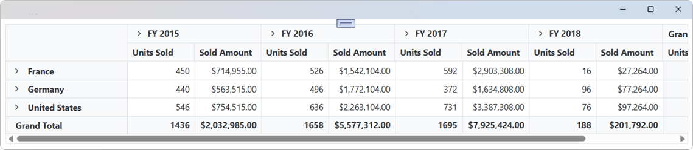
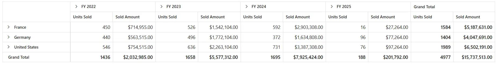

# Getting started with Blazor Pivot Table component in Hybrid MAUI App

This section guides you through the steps to add the [Syncfusion<sup style="font-size:70%">&reg;</sup> Blazor Pivot Table](https://www.syncfusion.com/blazor-components/blazor-pivot-table) component in a Blazor MAUI App using [Visual Studio](https://visualstudio.microsoft.com/vs/) and [Visual Studio Code](https://code.visualstudio.com/).

> **Want to simplify your Syncfusion<sup style="font-size:70%">&reg;</sup> Blazor development?**  
> Explore the power of Syncfusion<sup style="font-size:70%">&reg;</sup> Blazor components with Syncfusion<sup style="font-size:70%">&reg;</sup> AI Coding Assistants. Easily integrate components, set up projects, and get real-time, context-aware code suggestions in AI-powered IDEs like Visual Studio Code, Cursor, Syncfusion<sup style="font-size:70%">&reg;</sup> CodeStudio, and more. [Learn more about Syncfusion<sup style="font-size:70%">&reg;</sup> AI Coding Assistants](https://blazor.syncfusion.com/documentation/ai-coding-assistant/overview).





## Prerequisites

To use the MAUI project templates, install the Mobile development with the .NET extension for Visual Studio. For more details, refer to [here](https://learn.microsoft.com/en-us/dotnet/MAUI/get-started/installation?tabs=vswin) or the [Syncfusion® Blazor Extension](https://blazor.syncfusion.com/documentation/visual-studio-integration/template-studio).

## Create a new Blazor MAUI app in Visual Studio

Create a Blazor MAUI App using Visual Studio via [Microsoft templates](https://learn.microsoft.com/en-us/dotnet/maui/get-started/first-app?pivots=devices-windows&view=net-maui-9.0&tabs=vswin). For detailed instructions, refer to the [Blazor MAUI App Getting Started](https://blazor.syncfusion.com/documentation/getting-started/maui-blazor-app) documentation.





## Prerequisites

To use the MAUI project templates, install the Mobile development with the .NET extension for Visual Studio Code. For more details, refer to [here](https://learn.microsoft.com/en-us/dotnet/maui/get-started/installation?view=net-maui-9.0&tabs=visual-studio-code) or the [Syncfusion® Blazor Extension](https://blazor.syncfusion.com/documentation/visual-studio-code-integration/create-project).

## Create a new Blazor MAUI app in Visual Studio Code

Create a Blazor MAUI App using Visual Studio Code via [Microsoft templates](https://learn.microsoft.com/en-us/dotnet/maui/get-started/first-app?pivots=devices-windows&view=net-maui-9.0&tabs=visual-studio-code) or the [Syncfusion® Blazor Extension](https://blazor.syncfusion.com/documentation/visual-studio-code-integration/create-project). For detailed instructions, refer to the [Blazor MAUI App Getting Started](https://blazor.syncfusion.com/documentation/getting-started/maui-blazor-app) documentation.

Alternatively, create a MAUI application by using the following command in the integrated terminal (<kbd>Ctrl</kbd>+<kbd>`</kbd>).




dotnet new maui-blazor -o MauiBlazorApp
cd MauiBlazorApp








## Install Syncfusion<sup style="font-size:70%">&reg;</sup> Blazor packages

Install [Syncfusion.Blazor.PivotTable](https://www.nuget.org/packages/Syncfusion.Blazor.PivotTable/) and [Syncfusion.Blazor.Themes](https://www.nuget.org/packages/Syncfusion.Blazor.Themes/) NuGet packages in your project using the NuGet Package Manager in Visual Studio (*Tools → NuGet Package Manager → Manage NuGet Packages for Solution*), or the integrated terminal in Visual Studio Code (`dotnet add package`), or the .NET CLI.

Alternatively, run the following commands in the Package Manager Console to achieve the same.




Install-Package Syncfusion.Blazor.PivotTable -Version {{ site.releaseversion }}
Install-Package Syncfusion.Blazor.Themes -Version {{ site.releaseversion }}




N> All Syncfusion Blazor packages are available on [nuget.org](https://www.nuget.org/packages?q=syncfusion.blazor). See the [NuGet packages](https://blazor.syncfusion.com/documentation/nuget-packages) topic for details.

## Add import namespaces

After the packages are installed, open the **~/Components/_Imports.razor** file and add the `Syncfusion.Blazor` and `Syncfusion.Blazor.PivotView` namespaces.




@using Syncfusion.Blazor
@using Syncfusion.Blazor.PivotView




## Register Syncfusion<sup style="font-size:70%">&reg;</sup> Blazor service

Register the Syncfusion<sup style="font-size:70%">&reg;</sup> Blazor service in the **~/MauiProgram.cs** file.




....
using Syncfusion.Blazor;

....

public static class MauiProgram
{
    public static MauiApp CreateMauiApp()
    {
        ....
        builder.Services.AddSyncfusionBlazor();
        ....
    }
}




## Add stylesheet and script resources

The theme stylesheet and script can be accessed from NuGet through [Static Web Assets](https://blazor.syncfusion.com/documentation/appearance/themes#static-web-assets). Include the stylesheet and script references in the **~/index.html** file.

```html

<link href="_content/Syncfusion.Blazor.Themes/fluent2.css" rel="stylesheet" />
<script src="_content/Syncfusion.Blazor.Core/scripts/syncfusion-blazor.min.js" type="text/javascript"></script>

```

N> Check out the [Blazor Themes](https://blazor.syncfusion.com/documentation/appearance/themes) topic to discover various methods ([Static Web Assets](https://blazor.syncfusion.com/documentation/appearance/themes#static-web-assets), [CDN](https://blazor.syncfusion.com/documentation/appearance/themes#cdn-reference), and [CRG](https://blazor.syncfusion.com/documentation/common/custom-resource-generator)) for referencing themes in your Blazor application. Also, check out the [Adding Script Reference](https://blazor.syncfusion.com/documentation/common/adding-script-references) topic to learn different approaches for adding script references in your Blazor application.

## Add Syncfusion<sup style="font-size:70%">&reg;</sup> Blazor Pivot Table component

Add the Syncfusion<sup style="font-size:70%">&reg;</sup> Blazor Pivot Table component in the **~/Pages/Home.razor** file.




@using Syncfusion.Blazor.PivotView

<SfPivotView TValue="ProductDetails" Height="300">
     <PivotViewDataSourceSettings DataSource="@dataSource">
        <PivotViewColumns>
            <PivotViewColumn Name="Year"></PivotViewColumn>
            <PivotViewColumn Name="Quarter"></PivotViewColumn>
        </PivotViewColumns>
        <PivotViewRows>
            <PivotViewRow Name="Country"></PivotViewRow>
            <PivotViewRow Name="Products"></PivotViewRow>
        </PivotViewRows>
        <PivotViewValues>
            <PivotViewValue Name="Sold" Caption="Units Sold"></PivotViewValue>
            <PivotViewValue Name="Amount" Caption="Sold Amount"></PivotViewValue>
        </PivotViewValues>
        <PivotViewFormatSettings>
            <PivotViewFormatSetting Name="Amount" Format="C"></PivotViewFormatSetting>
        </PivotViewFormatSettings>
    </PivotViewDataSourceSettings>
</SfPivotView>

@code{
    public List<ProductDetails> dataSource { get; set; }
    protected override void OnInitialized()
    {
        this.dataSource = ProductDetails.GetProductData().ToList();
    }
}




public class ProductDetails
{
    public int Sold { get; set; }
    public double Amount { get; set; }
    public string Country { get; set; }
    public string Products { get; set; }
    public string Year { get; set; }
    public string Quarter { get; set; }

    public static List<ProductDetails> GetProductData()
    {
        List<ProductDetails> productData = new List<ProductDetails>();
        productData.Add(new ProductDetails { Sold = 31, Amount = 52824, Country = "France", Products = "Mountain Bikes", Year = "FY 2022", Quarter = "Q1" });
        productData.Add(new ProductDetails { Sold = 51, Amount = 86904, Country = "France", Products = "Mountain Bikes", Year = "FY 2022", Quarter = "Q2" });
        productData.Add(new ProductDetails { Sold = 90, Amount = 153360, Country = "France", Products = "Mountain Bikes", Year = "FY 2022", Quarter = "Q3" });
        productData.Add(new ProductDetails { Sold = 25, Amount = 42600, Country = "France", Products = "Mountain Bikes", Year = "FY 2022", Quarter = "Q4" });
        productData.Add(new ProductDetails { Sold = 27, Amount = 46008, Country = "France", Products = "Mountain Bikes", Year = "FY 2023", Quarter = "Q1" });
        productData.Add(new ProductDetails { Sold = 49, Amount = 83496, Country = "France", Products = "Mountain Bikes", Year = "FY 2023", Quarter = "Q2" });
        productData.Add(new ProductDetails { Sold = 95, Amount = 161880, Country = "France", Products = "Mountain Bikes", Year = "FY 2023", Quarter = "Q3" });
        productData.Add(new ProductDetails { Sold = 67, Amount = 114168, Country = "France", Products = "Mountain Bikes", Year = "FY 2023", Quarter = "Q4" });
        productData.Add(new ProductDetails { Sold = 75, Amount = 127800, Country = "France", Products = "Mountain Bikes", Year = "FY 2024", Quarter = "Q1" });
        productData.Add(new ProductDetails { Sold = 67, Amount = 114168, Country = "France", Products = "Mountain Bikes", Year = "FY 2024", Quarter = "Q2" });
        productData.Add(new ProductDetails { Sold = 69, Amount = 117576, Country = "France", Products = "Mountain Bikes", Year = "FY 2024", Quarter = "Q3" });
        productData.Add(new ProductDetails { Sold = 90, Amount = 153360, Country = "France", Products = "Mountain Bikes", Year = "FY 2024", Quarter = "Q4" });
        productData.Add(new ProductDetails { Sold = 16, Amount = 27264, Country = "France", Products = "Mountain Bikes", Year = "FY 2025", Quarter = "Q1" });
        productData.Add(new ProductDetails { Sold = 83, Amount = 124422, Country = "France", Products = "Road Bikes", Year = "FY 2022", Quarter = "Q1" });
        productData.Add(new ProductDetails { Sold = 57, Amount = 85448, Country = "France", Products = "Road Bikes", Year = "FY 2022", Quarter = "Q2" });
        productData.Add(new ProductDetails { Sold = 20, Amount = 29985, Country = "France", Products = "Road Bikes", Year = "FY 2022", Quarter = "Q3" });
        productData.Add(new ProductDetails { Sold = 67, Amount = 70008, Country = "France", Products = "Road Bikes", Year = "FY 2023", Quarter = "Q1" });
        productData.Add(new ProductDetails { Sold = 89, Amount = 60496, Country = "France", Products = "Road Bikes", Year = "FY 2023", Quarter = "Q2" });
        productData.Add(new ProductDetails { Sold = 75, Amount = 801880, Country = "France", Products = "Road Bikes", Year = "FY 2023", Quarter = "Q3" });
        productData.Add(new ProductDetails { Sold = 57, Amount = 204168, Country = "France", Products = "Road Bikes", Year = "FY 2023", Quarter = "Q4" });
        productData.Add(new ProductDetails { Sold = 75, Amount = 737800, Country = "France", Products = "Road Bikes", Year = "FY 2024", Quarter = "Q1" });
        productData.Add(new ProductDetails { Sold = 87, Amount = 884168, Country = "France", Products = "Road Bikes", Year = "FY 2024", Quarter = "Q2" });
        productData.Add(new ProductDetails { Sold = 39, Amount = 729576, Country = "France", Products = "Road Bikes", Year = "FY 2024", Quarter = "Q3" });
        productData.Add(new ProductDetails { Sold = 90, Amount = 38860, Country = "France", Products = "Road Bikes", Year = "FY 2024", Quarter = "Q4" });
        productData.Add(new ProductDetails { Sold = 93, Amount = 139412, Country = "France", Products = "Road Bikes", Year = "FY 2022", Quarter = "Q4" });
        productData.Add(new ProductDetails { Sold = 51, Amount = 92824, Country = "Germany", Products = "Mountain Bikes", Year = "FY 2022", Quarter = "Q1" });
        productData.Add(new ProductDetails { Sold = 61, Amount = 76904, Country = "Germany", Products = "Mountain Bikes", Year = "FY 2022", Quarter = "Q2" });
        productData.Add(new ProductDetails { Sold = 70, Amount = 43360, Country = "Germany", Products = "Mountain Bikes", Year = "FY 2022", Quarter = "Q3" });
        productData.Add(new ProductDetails { Sold = 85, Amount = 62600, Country = "Germany", Products = "Mountain Bikes", Year = "FY 2022", Quarter = "Q4" });
        productData.Add(new ProductDetails { Sold = 97, Amount = 86008, Country = "Germany", Products = "Mountain Bikes", Year = "FY 2023", Quarter = "Q1" });
        productData.Add(new ProductDetails { Sold = 69, Amount = 93496, Country = "Germany", Products = "Mountain Bikes", Year = "FY 2023", Quarter = "Q2" });
        productData.Add(new ProductDetails { Sold = 45, Amount = 301880, Country = "Germany", Products = "Mountain Bikes", Year = "FY 2023", Quarter = "Q3" });
        productData.Add(new ProductDetails { Sold = 77, Amount = 404168, Country = "Germany", Products = "Mountain Bikes", Year = "FY 2023", Quarter = "Q4" });
        productData.Add(new ProductDetails { Sold = 15, Amount = 137800, Country = "Germany", Products = "Mountain Bikes", Year = "FY 2024", Quarter = "Q1" });
        productData.Add(new ProductDetails { Sold = 37, Amount = 184168, Country = "Germany", Products = "Mountain Bikes", Year = "FY 2024", Quarter = "Q2" });
        productData.Add(new ProductDetails { Sold = 49, Amount = 89576, Country = "Germany", Products = "Mountain Bikes", Year = "FY 2024", Quarter = "Q3" });
        productData.Add(new ProductDetails { Sold = 40, Amount = 33360, Country = "Germany", Products = "Mountain Bikes", Year = "FY 2024", Quarter = "Q4" });
        productData.Add(new ProductDetails { Sold = 96, Amount = 77264, Country = "Germany", Products = "Mountain Bikes", Year = "FY 2025", Quarter = "Q1" });
        productData.Add(new ProductDetails { Sold = 23, Amount = 24422, Country = "Germany", Products = "Road Bikes", Year = "FY 2022", Quarter = "Q1" });
        productData.Add(new ProductDetails { Sold = 67, Amount = 75448, Country = "Germany", Products = "Road Bikes", Year = "FY 2022", Quarter = "Q2" });
        productData.Add(new ProductDetails { Sold = 70, Amount = 52345, Country = "Germany", Products = "Road Bikes", Year = "FY 2022", Quarter = "Q3" });
        productData.Add(new ProductDetails { Sold = 13, Amount = 135612, Country = "Germany", Products = "Road Bikes", Year = "FY 2022", Quarter = "Q4" });
        productData.Add(new ProductDetails { Sold = 57, Amount = 90008, Country = "Germany", Products = "Road Bikes", Year = "FY 2023", Quarter = "Q1" });
        productData.Add(new ProductDetails { Sold = 29, Amount = 90496, Country = "Germany", Products = "Road Bikes", Year = "FY 2023", Quarter = "Q2" });
        productData.Add(new ProductDetails { Sold = 45, Amount = 301880, Country = "Germany", Products = "Road Bikes", Year = "FY 2023", Quarter = "Q3" });
        productData.Add(new ProductDetails { Sold = 77, Amount = 404168, Country = "Germany", Products = "Road Bikes", Year = "FY 2023", Quarter = "Q4" });
        productData.Add(new ProductDetails { Sold = 15, Amount = 137800, Country = "Germany", Products = "Road Bikes", Year = "FY 2024", Quarter = "Q1" });
        productData.Add(new ProductDetails { Sold = 37, Amount = 184168, Country = "Germany", Products = "Road Bikes", Year = "FY 2024", Quarter = "Q2" });
        productData.Add(new ProductDetails { Sold = 99, Amount = 829576, Country = "Germany", Products = "Road Bikes", Year = "FY 2024", Quarter = "Q3" });
        productData.Add(new ProductDetails { Sold = 80, Amount = 38360, Country = "Germany", Products = "Road Bikes", Year = "FY 2024", Quarter = "Q4" });
        productData.Add(new ProductDetails { Sold = 91, Amount = 67824, Country = "United States", Products = "Mountain Bikes", Year = "FY 2022", Quarter = "Q1" });
        productData.Add(new ProductDetails { Sold = 81, Amount = 99904, Country = "United States", Products = "Mountain Bikes", Year = "FY 2022", Quarter = "Q2" });
        productData.Add(new ProductDetails { Sold = 70, Amount = 49360, Country = "United States", Products = "Mountain Bikes", Year = "FY 2022", Quarter = "Q3" });
        productData.Add(new ProductDetails { Sold = 65, Amount = 69600, Country = "United States", Products = "Mountain Bikes", Year = "FY 2022", Quarter = "Q4" });
        productData.Add(new ProductDetails { Sold = 57, Amount = 90008, Country = "United States", Products = "Mountain Bikes", Year = "FY 2023", Quarter = "Q1" });
        productData.Add(new ProductDetails { Sold = 29, Amount = 90496, Country = "United States", Products = "Mountain Bikes", Year = "FY 2023", Quarter = "Q2" });
        productData.Add(new ProductDetails { Sold = 85, Amount = 391880, Country = "United States", Products = "Mountain Bikes", Year = "FY 2023", Quarter = "Q3" });
        productData.Add(new ProductDetails { Sold = 97, Amount = 904168, Country = "United States", Products = "Mountain Bikes", Year = "FY 2023", Quarter = "Q4" });
        productData.Add(new ProductDetails { Sold = 85, Amount = 237800, Country = "United States", Products = "Mountain Bikes", Year = "FY 2024", Quarter = "Q1" });
        productData.Add(new ProductDetails { Sold = 77, Amount = 384168, Country = "United States", Products = "Mountain Bikes", Year = "FY 2024", Quarter = "Q2" });
        productData.Add(new ProductDetails { Sold = 99, Amount = 829576, Country = "United States", Products = "Mountain Bikes", Year = "FY 2024", Quarter = "Q3" });
        productData.Add(new ProductDetails { Sold = 80, Amount = 38360, Country = "United States", Products = "Mountain Bikes", Year = "FY 2024", Quarter = "Q4" });
        productData.Add(new ProductDetails { Sold = 76, Amount = 97264, Country = "United States", Products = "Mountain Bikes", Year = "FY 2025", Quarter = "Q1" });
        productData.Add(new ProductDetails { Sold = 53, Amount = 94422, Country = "United States", Products = "Road Bikes", Year = "FY 2022", Quarter = "Q1" });
        productData.Add(new ProductDetails { Sold = 90, Amount = 45448, Country = "United States", Products = "Road Bikes", Year = "FY 2022", Quarter = "Q2" });
        productData.Add(new ProductDetails { Sold = 29, Amount = 92345, Country = "United States", Products = "Road Bikes", Year = "FY 2022", Quarter = "Q3" });
        productData.Add(new ProductDetails { Sold = 67, Amount = 235612, Country = "United States", Products = "Road Bikes", Year = "FY 2022", Quarter = "Q4" });
        productData.Add(new ProductDetails { Sold = 97, Amount = 90008, Country = "United States", Products = "Road Bikes", Year = "FY 2023", Quarter = "Q1" });
        productData.Add(new ProductDetails { Sold = 79, Amount = 90496, Country = "United States", Products = "Road Bikes", Year = "FY 2023", Quarter = "Q2" });
        productData.Add(new ProductDetails { Sold = 95, Amount = 501880, Country = "United States", Products = "Road Bikes", Year = "FY 2023", Quarter = "Q3" });
        productData.Add(new ProductDetails { Sold = 97, Amount = 104168, Country = "United States", Products = "Road Bikes", Year = "FY 2023", Quarter = "Q4" });
        productData.Add(new ProductDetails { Sold = 95, Amount = 837800, Country = "United States", Products = "Road Bikes", Year = "FY 2024", Quarter = "Q1" });
        productData.Add(new ProductDetails { Sold = 87, Amount = 684168, Country = "United States", Products = "Road Bikes", Year = "FY 2024", Quarter = "Q2" });
        productData.Add(new ProductDetails { Sold = 109, Amount = 29576, Country = "United States", Products = "Road Bikes", Year = "FY 2024", Quarter = "Q3" });
        productData.Add(new ProductDetails { Sold = 99, Amount = 345860, Country = "United States", Products = "Road Bikes", Year = "FY 2024", Quarter = "Q4" });
        return productData;
    }
}




### How to run the sample on Windows

To see the Pivot Table in action, run your Blazor MAUI app on a Windows machine. The app will display the Pivot Table as shown below.



### How to run the sample on Android

To run the Blazor Pivot Table in your Blazor MAUI app on an Android emulator, follow the steps below.

1. Set up and start the Android emulator. For help, see the [Android Device Manager guide](https://learn.microsoft.com/en-us/dotnet/maui/android/emulator/device-manager#android-device-manager-on-windows).

2. Run your app using the emulator to view the Pivot Table, as shown below.

N> If you face any issues with the Android emulator, check the [Troubleshooting Android Emulator guide](https://learn.microsoft.com/en-us/dotnet/maui/android/emulator/troubleshooting) for solutions.




## Handling exceptions

You can handle errors that occur during Pivot Table actions without stopping your application. Use the [OnActionFailure](https://help.syncfusion.com/cr/blazor/Syncfusion.Blazor.PivotView.PivotViewEvents-1.html#Syncfusion_Blazor_PivotView_PivotViewEvents_1_OnActionFailure) event to capture error messages or details from the server. We recommend binding this event while building your app, as it helps you identify issues early. You can share these error details with our support team to get help quickly.

The following code example shows how to display a server-side error message to the user when a data operation fails:




@using Syncfusion.Blazor.PivotView

<span class="error">@ErrorDetails</span>
<SfPivotView TValue="PivotViewData" Width="100%" Height="450" AllowDataCompression="true" EnableVirtualization="true" ShowFieldList="true" ShowGroupingBar="true" MaxNodeLimitInMemberEditor="50">
    <PivotViewDataSourceSettings TValue="PivotViewData" Url="https://some.com/invalidUrl" ExpandAll="false" EnableSorting="true" EnableServerSideAggregation="true" AlwaysShowValueHeader="true">
        <PivotViewColumns>
            <PivotViewColumn Name="Year" Caption="Production Year"></PivotViewColumn>
        </PivotViewColumns>
        <PivotViewRows>
            <PivotViewRow Name="ProductID" Caption="Product ID"></PivotViewRow>
        </PivotViewRows>
        <PivotViewValues>
            <PivotViewValue Name="Sold" Caption="Unit Sold"></PivotViewValue>
            <PivotViewValue Name="Price" Caption="Unit Amount"></PivotViewValue>
        </PivotViewValues>
        <PivotViewFormatSettings>
            <PivotViewFormatSetting Name="Price" Format="C0"></PivotViewFormatSetting>
            <PivotViewFormatSetting Name="Sold" Format="N0"></PivotViewFormatSetting>
        </PivotViewFormatSettings>
    </PivotViewDataSourceSettings>
    <PivotViewGridSettings ColumnWidth="120"></PivotViewGridSettings>
    <PivotViewEvents TValue="PivotViewData" OnActionFailure="ActionFailure"></PivotViewEvents>
</SfPivotView>

<style>
    .error {
        color: red;
    }
</style>

@code{
    public string ErrorDetails = "";
    public class PivotViewData
    {
        public string ProductID { get; set; }
        public string Country { get; set; }
        public string Product { get; set; }
        public double Sold { get; set; }
        public double Price { get; set; }
        public string Year { get; set; }
    }
    public void ActionFailure(PivotActionFailureEventArgs args)
    {
        this.ErrorDetails = args.ErrorInfo.Message;
        StateHasChanged();
    }
}




N> [View Sample in GitHub.](https://github.com/SyncfusionExamples/Blazor-Getting-Started-Examples/tree/main/PivotTable)

## See also

* [Getting Started with Syncfusion<sup style="font-size:70%">&reg;</sup> Blazor for Client-Side in .NET Core CLI](https://blazor.syncfusion.com/documentation/getting-started/blazor-webassembly-dotnet-cli)
* [Getting Started with Syncfusion<sup style="font-size:70%">&reg;</sup> Blazor for Client-side in Visual Studio](https://blazor.syncfusion.com/documentation/getting-started/blazor-webassembly-visual-studio)
* [Getting Started with Syncfusion<sup style="font-size:70%">&reg;</sup> Blazor for Server-Side in .NET Core CLI](https://blazor.syncfusion.com/documentation/getting-started/blazor-server-side-dotnet-cli)