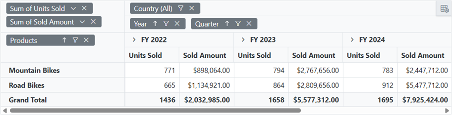

# Getting started with Blazor Pivot Table component in Hybrid MAUI App

This section guides you through the steps to add the Syncfusion<sup style="font-size:70%">&reg;</sup> Blazor Pivot Table component to your Blazor MAUI application using Visual Studio or Visual Studio Code.

> **Want to simplify your Syncfusion<sup style="font-size:70%">&reg;</sup> Blazor development?**  
> Explore the power of Syncfusion<sup style="font-size:70%">&reg;</sup> Blazor components with Syncfusion<sup style="font-size:70%">&reg;</sup> AI Coding Assistants. Easily integrate components, set up projects, and get real-time, context-aware code suggestions in AI-powered IDEs like Visual Studio Code, Cursor, Syncfusion<sup style="font-size:70%">&reg;</sup> CodeStudio, and more. [Learn more about Syncfusion<sup style="font-size:70%">&reg;</sup> AI Coding Assistants](https://blazor.syncfusion.com/documentation/ai-coding-assistants/overview).





## Prerequisites

To create a Blazor MAUI app, you need the Mobile Development with .NET workload installed in Visual Studio. For installation details, see the [Microsoft MAUI installation guide](https://learn.microsoft.com/en-us/dotnet/maui/get-started/installation?tabs=vswin) or the [Syncfusion<sup style="font-size:70%">&reg;</sup> Blazor Extension](https://blazor.syncfusion.com/documentation/visual-studio-integration/template-studio).

## Create a new Blazor MAUI app in Visual Studio

You can set up a Blazor MAUI app using Visual Studio with [Microsoft Templates](https://learn.microsoft.com/en-us/dotnet/maui/get-started/first-app?pivots=devices-windows&view=net-maui-9.0&tabs=vswin). For step-by-step instructions, refer to the [Blazor MAUI app getting started guide](https://blazor.syncfusion.com/documentation/getting-started/maui-blazor-app).

## Install Syncfusion<sup style="font-size:70%">&reg;</sup> Blazor Pivot Table and Themes NuGet packages

To include the Blazor Pivot Table component, open the NuGet Package Manager in Visual Studio (Tools → NuGet Package Manager → Manage NuGet Packages for Solution). Search for and install the [Syncfusion.Blazor.PivotTable](https://www.nuget.org/packages/Syncfusion.Blazor.PivotTable) and [Syncfusion.Blazor.Themes](https://www.nuget.org/packages/Syncfusion.Blazor.Themes/) packages.




Install-Package Syncfusion.Blazor.PivotTable -Version {{ site.releaseversion }}
Install-Package Syncfusion.Blazor.Themes -Version {{ site.releaseversion }}




N> Syncfusion<sup style="font-size:70%">&reg;</sup> Blazor components are available on [nuget.org](https://www.nuget.org/packages?q=syncfusion.blazor). For a complete list of available NuGet packages and their details, refer to the [NuGet packages documentation](https://blazor.syncfusion.com/documentation/nuget-packages).





## Prerequisites

To create a Blazor MAUI app in Visual Studio Code, ensure the .NET MAUI extension is installed. For more information, check the [Microsoft MAUI installation guide](https://learn.microsoft.com/en-us/dotnet/maui/get-started/installation?view=net-maui-9.0&tabs=visual-studio-code) or the [Syncfusion<sup style="font-size:70%">&reg;</sup> Blazor Extension](https://blazor.syncfusion.com/documentation/visual-studio-code-integration/create-project).

## Create a new Blazor MAUI app in Visual Studio Code

You can create a Blazor MAUI app using [Microsoft Templates](https://learn.microsoft.com/en-us/dotnet/maui/get-started/first-app?pivots=devices-windows&view=net-maui-9.0&tabs=visual-studio-code) or the [Syncfusion<sup style="font-size:70%">&reg;</sup> Blazor Extension](https://blazor.syncfusion.com/documentation/visual-studio-code-integration/create-project). For detailed steps, see the [Blazor MAUI app getting started guide](https://blazor.syncfusion.com/documentation/getting-started/maui-blazor-app).

## Install Syncfusion<sup style="font-size:70%">&reg;</sup> Blazor Pivot Table and Themes NuGet packages

To add the Blazor Pivot Table component, open the terminal in Visual Studio Code and run the following commands to install the [Syncfusion.Blazor.PivotTable](https://www.nuget.org/packages/Syncfusion.Blazor.PivotTable) and [Syncfusion.Blazor.Themes](https://www.nuget.org/packages/Syncfusion.Blazor.Themes/) packages.




dotnet add package Syncfusion.Blazor.PivotTable -v {{ site.releaseversion }}
dotnet add package Syncfusion.Blazor.Themes -v {{ site.releaseversion }}
dotnet restore




N> Syncfusion<sup style="font-size:70%">&reg;</sup> Blazor components are available on [nuget.org](https://www.nuget.org/packages?q=syncfusion.blazor). For a complete list of available NuGet packages and their details, refer to the [NuGet packages documentation](https://blazor.syncfusion.com/documentation/nuget-packages).





## Add import namespaces

To use the Pivot Table component, open the **~/_Imports.razor** file and add the `Syncfusion.Blazor` and `Syncfusion.Blazor.PivotView` namespaces.




@using Syncfusion.Blazor
@using Syncfusion.Blazor.PivotView




## Register Syncfusion<sup style="font-size:70%">&reg;</sup> Blazor service

Next, register the Syncfusion<sup style="font-size:70%">&reg;</sup> Blazor service in the **~/MauiProgram.cs** file to enable the Pivot Table component in your app.




using Microsoft.Extensions.Logging;
using Syncfusion.Blazor;

namespace MauiBlazorWindow;

    public static class MauiProgram
    {
        public static MauiApp CreateMauiApp()
        {
            var builder = MauiApp.CreateBuilder();
            builder
                .UseMauiApp<App>()
                .ConfigureFonts(fonts =>
                {
                    fonts.AddFont("OpenSans-Regular.ttf", "OpenSansRegular");
                });

            builder.Services.AddMauiBlazorWebView();
            builder.Services.AddSyncfusionBlazor();
#if DEBUG
            builder.Services.AddBlazorWebViewDeveloperTools();
            builder.Logging.AddDebug();
#endif

            return builder.Build();
        }
    }




## Add stylesheet and script resources

To make the Pivot Table look and work correctly, add the stylesheet and script files from NuGet using [Static Web Assets](https://blazor.syncfusion.com/documentation/appearance/themes#static-web-assets). Place these in the `<head>` section of the **~/index.html** file.

```html
<head>
    ....
    <link href="_content/Syncfusion.Blazor.Themes/bootstrap5.css" rel="stylesheet" />
    <script src="_content/Syncfusion.Blazor.Core/scripts/syncfusion-blazor.min.js" type="text/javascript"></script>

    //Blazor PivotTable Component script reference.
    <!-- <script src="_content/Syncfusion.Blazor.PivotTable/scripts/sf-pivotview.min.js" type="text/javascript"></script> -->
</head>
```

N> You can learn more about adding themes to your Blazor app in the [Blazor Themes documentation](https://blazor.syncfusion.com/documentation/appearance/themes). Options include [Static Web Assets](https://blazor.syncfusion.com/documentation/appearance/themes#static-web-assets), [CDN](https://blazor.syncfusion.com/documentation/appearance/themes#cdn-reference), or [CRG](https://blazor.syncfusion.com/documentation/common/custom-resource-generator). For more on adding scripts, check the [Adding Script Reference guide](https://blazor.syncfusion.com/documentation/common/adding-script-references).

## Add Blazor Pivot Table component

Finally, add the Syncfusion<sup style="font-size:70%">&reg;</sup> Blazor Pivot Table component to the **~/Pages/Index.razor** file to display it in your app.




<SfPivotView TValue="ProductDetails"></SfPivotView>




## Assigning sample data to the Blazor Pivot Table

To enable users to perform meaningful analysis and generate actionable insights, the Pivot Table component requires a well-structured data source. This data source contains the information you want to analyze and visualize.

For demonstration purposes, a collection of objects containing sales details for various products across different periods and regions has been prepared. This sample data is assigned to the Pivot Table component through the [DataSource](https://help.syncfusion.com/cr/blazor/Syncfusion.Blazor.PivotView.PivotViewDataSourceSettings-1.html#Syncfusion_Blazor_PivotView_PivotViewDataSourceSettings_1_DataSource) property under the [PivotViewDataSourceSettings](https://help.syncfusion.com/cr/blazor/Syncfusion.Blazor.PivotView.PivotViewDataSourceSettings-1.html) class.




<SfPivotView TValue="ProductDetails">
     <PivotViewDataSourceSettings DataSource="@dataSource">
    </PivotViewDataSourceSettings>
</SfPivotView>

@code{
    public List<ProductDetails> dataSource { get; set; }
    protected override void OnInitialized()
    {
        this.dataSource = ProductDetails.GetProductData().ToList();
    }

    public class ProductDetails
    {
        public int Sold { get; set; }
        public double Amount { get; set; }
        public string Country { get; set; }
        public string Products { get; set; }
        public string Year { get; set; }
        public string Quarter { get; set; }

        public static List<ProductDetails> GetProductData()
        {
            List<ProductDetails> productData = new List<ProductDetails>();
            productData.Add(new ProductDetails { Sold = 31, Amount = 52824, Country = "France", Products = "Mountain Bikes", Year = "FY 2022", Quarter = "Q1" });
            productData.Add(new ProductDetails { Sold = 51, Amount = 86904, Country = "France", Products = "Mountain Bikes", Year = "FY 2022", Quarter = "Q2" });
            productData.Add(new ProductDetails { Sold = 90, Amount = 153360, Country = "France", Products = "Mountain Bikes", Year = "FY 2022", Quarter = "Q3" });
            productData.Add(new ProductDetails { Sold = 25, Amount = 42600, Country = "France", Products = "Mountain Bikes", Year = "FY 2022", Quarter = "Q4" });
            productData.Add(new ProductDetails { Sold = 27, Amount = 46008, Country = "France", Products = "Mountain Bikes", Year = "FY 2023", Quarter = "Q1" });
            productData.Add(new ProductDetails { Sold = 49, Amount = 83496, Country = "France", Products = "Mountain Bikes", Year = "FY 2023", Quarter = "Q2" });
            productData.Add(new ProductDetails { Sold = 95, Amount = 161880, Country = "France", Products = "Mountain Bikes", Year = "FY 2023", Quarter = "Q3" });
            productData.Add(new ProductDetails { Sold = 67, Amount = 114168, Country = "France", Products = "Mountain Bikes", Year = "FY 2023", Quarter = "Q4" });
            productData.Add(new ProductDetails { Sold = 75, Amount = 127800, Country = "France", Products = "Mountain Bikes", Year = "FY 2024", Quarter = "Q1" });
            productData.Add(new ProductDetails { Sold = 67, Amount = 114168, Country = "France", Products = "Mountain Bikes", Year = "FY 2024", Quarter = "Q2" });
            productData.Add(new ProductDetails { Sold = 69, Amount = 117576, Country = "France", Products = "Mountain Bikes", Year = "FY 2024", Quarter = "Q3" });
            productData.Add(new ProductDetails { Sold = 90, Amount = 153360, Country = "France", Products = "Mountain Bikes", Year = "FY 2024", Quarter = "Q4" });
            productData.Add(new ProductDetails { Sold = 16, Amount = 27264, Country = "France", Products = "Mountain Bikes", Year = "FY 2025", Quarter = "Q1" });
            productData.Add(new ProductDetails { Sold = 83, Amount = 124422, Country = "France", Products = "Road Bikes", Year = "FY 2022", Quarter = "Q1" });
            productData.Add(new ProductDetails { Sold = 57, Amount = 85448, Country = "France", Products = "Road Bikes", Year = "FY 2022", Quarter = "Q2" });
            productData.Add(new ProductDetails { Sold = 20, Amount = 29985, Country = "France", Products = "Road Bikes", Year = "FY 2022", Quarter = "Q3" });
            productData.Add(new ProductDetails { Sold = 67, Amount = 70008, Country = "France", Products = "Road Bikes", Year = "FY 2023", Quarter = "Q1" });
            productData.Add(new ProductDetails { Sold = 89, Amount = 60496, Country = "France", Products = "Road Bikes", Year = "FY 2023", Quarter = "Q2" });
            productData.Add(new ProductDetails { Sold = 75, Amount = 801880, Country = "France", Products = "Road Bikes", Year = "FY 2023", Quarter = "Q3" });
            productData.Add(new ProductDetails { Sold = 57, Amount = 204168, Country = "France", Products = "Road Bikes", Year = "FY 2023", Quarter = "Q4" });
            productData.Add(new ProductDetails { Sold = 75, Amount = 737800, Country = "France", Products = "Road Bikes", Year = "FY 2024", Quarter = "Q1" });
            productData.Add(new ProductDetails { Sold = 87, Amount = 884168, Country = "France", Products = "Road Bikes", Year = "FY 2024", Quarter = "Q2" });
            productData.Add(new ProductDetails { Sold = 39, Amount = 729576, Country = "France", Products = "Road Bikes", Year = "FY 2024", Quarter = "Q3" });
            productData.Add(new ProductDetails { Sold = 90, Amount = 38860, Country = "France", Products = "Road Bikes", Year = "FY 2024", Quarter = "Q4" });
            productData.Add(new ProductDetails { Sold = 93, Amount = 139412, Country = "France", Products = "Road Bikes", Year = "FY 2022", Quarter = "Q4" });
            productData.Add(new ProductDetails { Sold = 51, Amount = 92824, Country = "Germany", Products = "Mountain Bikes", Year = "FY 2022", Quarter = "Q1" });
            productData.Add(new ProductDetails { Sold = 61, Amount = 76904, Country = "Germany", Products = "Mountain Bikes", Year = "FY 2022", Quarter = "Q2" });
            productData.Add(new ProductDetails { Sold = 70, Amount = 43360, Country = "Germany", Products = "Mountain Bikes", Year = "FY 2022", Quarter = "Q3" });
            productData.Add(new ProductDetails { Sold = 85, Amount = 62600, Country = "Germany", Products = "Mountain Bikes", Year = "FY 2022", Quarter = "Q4" });
            productData.Add(new ProductDetails { Sold = 97, Amount = 86008, Country = "Germany", Products = "Mountain Bikes", Year = "FY 2023", Quarter = "Q1" });
            productData.Add(new ProductDetails { Sold = 69, Amount = 93496, Country = "Germany", Products = "Mountain Bikes", Year = "FY 2023", Quarter = "Q2" });
            productData.Add(new ProductDetails { Sold = 45, Amount = 301880, Country = "Germany", Products = "Mountain Bikes", Year = "FY 2023", Quarter = "Q3" });
            productData.Add(new ProductDetails { Sold = 77, Amount = 404168, Country = "Germany", Products = "Mountain Bikes", Year = "FY 2023", Quarter = "Q4" });
            productData.Add(new ProductDetails { Sold = 15, Amount = 137800, Country = "Germany", Products = "Mountain Bikes", Year = "FY 2024", Quarter = "Q1" });
            productData.Add(new ProductDetails { Sold = 37, Amount = 184168, Country = "Germany", Products = "Mountain Bikes", Year = "FY 2024", Quarter = "Q2" });
            productData.Add(new ProductDetails { Sold = 49, Amount = 89576, Country = "Germany", Products = "Mountain Bikes", Year = "FY 2024", Quarter = "Q3" });
            productData.Add(new ProductDetails { Sold = 40, Amount = 33360, Country = "Germany", Products = "Mountain Bikes", Year = "FY 2024", Quarter = "Q4" });
            productData.Add(new ProductDetails { Sold = 96, Amount = 77264, Country = "Germany", Products = "Mountain Bikes", Year = "FY 2025", Quarter = "Q1" });
            productData.Add(new ProductDetails { Sold = 23, Amount = 24422, Country = "Germany", Products = "Road Bikes", Year = "FY 2022", Quarter = "Q1" });
            productData.Add(new ProductDetails { Sold = 67, Amount = 75448, Country = "Germany", Products = "Road Bikes", Year = "FY 2022", Quarter = "Q2" });
            productData.Add(new ProductDetails { Sold = 70, Amount = 52345, Country = "Germany", Products = "Road Bikes", Year = "FY 2022", Quarter = "Q3" });
            productData.Add(new ProductDetails { Sold = 13, Amount = 135612, Country = "Germany", Products = "Road Bikes", Year = "FY 2022", Quarter = "Q4" });
            productData.Add(new ProductDetails { Sold = 57, Amount = 90008, Country = "Germany", Products = "Road Bikes", Year = "FY 2023", Quarter = "Q1" });
            productData.Add(new ProductDetails { Sold = 29, Amount = 90496, Country = "Germany", Products = "Road Bikes", Year = "FY 2023", Quarter = "Q2" });
            productData.Add(new ProductDetails { Sold = 45, Amount = 301880, Country = "Germany", Products = "Road Bikes", Year = "FY 2023", Quarter = "Q3" });
            productData.Add(new ProductDetails { Sold = 77, Amount = 404168, Country = "Germany", Products = "Road Bikes", Year = "FY 2023", Quarter = "Q4" });
            productData.Add(new ProductDetails { Sold = 15, Amount = 137800, Country = "Germany", Products = "Road Bikes", Year = "FY 2024", Quarter = "Q1" });
            productData.Add(new ProductDetails { Sold = 37, Amount = 184168, Country = "Germany", Products = "Road Bikes", Year = "FY 2024", Quarter = "Q2" });
            productData.Add(new ProductDetails { Sold = 99, Amount = 829576, Country = "Germany", Products = "Road Bikes", Year = "FY 2024", Quarter = "Q3" });
            productData.Add(new ProductDetails { Sold = 80, Amount = 38360, Country = "Germany", Products = "Road Bikes", Year = "FY 2024", Quarter = "Q4" });
            productData.Add(new ProductDetails { Sold = 91, Amount = 67824, Country = "United States", Products = "Mountain Bikes", Year = "FY 2022", Quarter = "Q1" });
            productData.Add(new ProductDetails { Sold = 81, Amount = 99904, Country = "United States", Products = "Mountain Bikes", Year = "FY 2022", Quarter = "Q2" });
            productData.Add(new ProductDetails { Sold = 70, Amount = 49360, Country = "United States", Products = "Mountain Bikes", Year = "FY 2022", Quarter = "Q3" });
            productData.Add(new ProductDetails { Sold = 65, Amount = 69600, Country = "United States", Products = "Mountain Bikes", Year = "FY 2022", Quarter = "Q4" });
            productData.Add(new ProductDetails { Sold = 57, Amount = 90008, Country = "United States", Products = "Mountain Bikes", Year = "FY 2023", Quarter = "Q1" });
            productData.Add(new ProductDetails { Sold = 29, Amount = 90496, Country = "United States", Products = "Mountain Bikes", Year = "FY 2023", Quarter = "Q2" });
            productData.Add(new ProductDetails { Sold = 85, Amount = 391880, Country = "United States", Products = "Mountain Bikes", Year = "FY 2023", Quarter = "Q3" });
            productData.Add(new ProductDetails { Sold = 97, Amount = 904168, Country = "United States", Products = "Mountain Bikes", Year = "FY 2023", Quarter = "Q4" });
            productData.Add(new ProductDetails { Sold = 85, Amount = 237800, Country = "United States", Products = "Mountain Bikes", Year = "FY 2024", Quarter = "Q1" });
            productData.Add(new ProductDetails { Sold = 77, Amount = 384168, Country = "United States", Products = "Mountain Bikes", Year = "FY 2024", Quarter = "Q2" });
            productData.Add(new ProductDetails { Sold = 99, Amount = 829576, Country = "United States", Products = "Mountain Bikes", Year = "FY 2024", Quarter = "Q3" });
            productData.Add(new ProductDetails { Sold = 80, Amount = 38360, Country = "United States", Products = "Mountain Bikes", Year = "FY 2024", Quarter = "Q4" });
            productData.Add(new ProductDetails { Sold = 76, Amount = 97264, Country = "United States", Products = "Mountain Bikes", Year = "FY 2025", Quarter = "Q1" });
            productData.Add(new ProductDetails { Sold = 53, Amount = 94422, Country = "United States", Products = "Road Bikes", Year = "FY 2022", Quarter = "Q1" });
            productData.Add(new ProductDetails { Sold = 90, Amount = 45448, Country = "United States", Products = "Road Bikes", Year = "FY 2022", Quarter = "Q2" });
            productData.Add(new ProductDetails { Sold = 29, Amount = 92345, Country = "United States", Products = "Road Bikes", Year = "FY 2022", Quarter = "Q3" });
            productData.Add(new ProductDetails { Sold = 67, Amount = 235612, Country = "United States", Products = "Road Bikes", Year = "FY 2022", Quarter = "Q4" });
            productData.Add(new ProductDetails { Sold = 97, Amount = 90008, Country = "United States", Products = "Road Bikes", Year = "FY 2023", Quarter = "Q1" });
            productData.Add(new ProductDetails { Sold = 79, Amount = 90496, Country = "United States", Products = "Road Bikes", Year = "FY 2023", Quarter = "Q2" });
            productData.Add(new ProductDetails { Sold = 95, Amount = 501880, Country = "United States", Products = "Road Bikes", Year = "FY 2023", Quarter = "Q3" });
            productData.Add(new ProductDetails { Sold = 97, Amount = 104168, Country = "United States", Products = "Road Bikes", Year = "FY 2023", Quarter = "Q4" });
            productData.Add(new ProductDetails { Sold = 95, Amount = 837800, Country = "United States", Products = "Road Bikes", Year = "FY 2024", Quarter = "Q1" });
            productData.Add(new ProductDetails { Sold = 87, Amount = 684168, Country = "United States", Products = "Road Bikes", Year = "FY 2024", Quarter = "Q2" });
            productData.Add(new ProductDetails { Sold = 109, Amount = 29576, Country = "United States", Products = "Road Bikes", Year = "FY 2024", Quarter = "Q3" });
            productData.Add(new ProductDetails { Sold = 99, Amount = 345860, Country = "United States", Products = "Road Bikes", Year = "FY 2024", Quarter = "Q4" });
            return productData;
        }
    }
}




## Adding fields to row, column, value, and filter axes

Organizing fields into appropriate axes transforms raw data into a structured, meaningful Pivot Table that enables users to analyze patterns and trends effectively. With the Pivot Table now initialized and populated with sample data, the next logical step involves organizing the appropriate fields into row, column, value, and filter axes to create a functional data analysis tool.

In the [PivotViewDataSourceSettings](https://help.syncfusion.com/cr/blazor/Syncfusion.Blazor.PivotView.PivotViewDataSourceSettings-1.html) class, four primary axes play a crucial role in defining and organizing fields from the bound data source to render the Pivot Table component in the desired format.

**Understanding the four axes:**

- [PivotViewRows](https://help.syncfusion.com/cr/blazor/Syncfusion.Blazor.PivotView.PivotViewRow.html) – Collection of fields that will be displayed along the row axis of the Pivot Table.
- [PivotViewColumns](https://help.syncfusion.com/cr/blazor/Syncfusion.Blazor.PivotView.PivotViewColumn.html) – Collection of fields that will be displayed along the column axis of the Pivot Table.
- [PivotViewValues](https://help.syncfusion.com/cr/blazor/Syncfusion.Blazor.PivotView.PivotViewValue.html) – Collection of fields that will be displayed as aggregated numeric values within the Pivot Table.
- [PivotViewFilters](https://help.syncfusion.com/cr/blazor/Syncfusion.Blazor.PivotView.PivotViewFilter.html) – Collection of fields that act as master filters over the data bound to the row, column, and value axes of the Pivot Table.

**Essential field properties:**

To define each field in its respective axis, configure the following basic properties:

* [Name](https://help.syncfusion.com/cr/blazor/Syncfusion.Blazor.PivotView.PivotFieldOptions.html#Syncfusion_Blazor_PivotView_PivotFieldOptions_Name): Sets the field name from the bound data source. The casing must match exactly as it appears in the data source, otherwise the Pivot Table will not render correctly.
* [Caption](https://help.syncfusion.com/cr/blazor/Syncfusion.Blazor.PivotView.PivotFieldOptions.html#Syncfusion_Blazor_PivotView_PivotFieldOptions_Caption): Sets the field caption, which serves as the display name for the field in the Pivot Table.
* [Type](https://help.syncfusion.com/cr/blazor/Syncfusion.Blazor.PivotView.PivotFieldOptions.html#Syncfusion_Blazor_PivotView_PivotFieldOptions_Type): Sets the summary type for the field. By default, the [SummaryTypes.Sum](https://help.syncfusion.com/cr/blazor/Syncfusion.Blazor.PivotView.SummaryTypes.html#Syncfusion_Blazor_PivotView_SummaryTypes_Sum) aggregation is applied.




<SfPivotView TValue="ProductDetails" Height="300">
     <PivotViewDataSourceSettings DataSource="@dataSource">
        <PivotViewColumns>
            <PivotViewColumn Name="Year"></PivotViewColumn>
            <PivotViewColumn Name="Quarter"></PivotViewColumn>
        </PivotViewColumns>
        <PivotViewRows>
            <PivotViewRow Name="Country"></PivotViewRow>
            <PivotViewRow Name="Products"></PivotViewRow>
        </PivotViewRows>
        <PivotViewValues>
            <PivotViewValue Name="Sold" Caption="Units Sold"></PivotViewValue>
            <PivotViewValue Name="Amount" Caption="Sold Amount"></PivotViewValue>
        </PivotViewValues>
    </PivotViewDataSourceSettings>
</SfPivotView>

@code{
    public List<ProductDetails> dataSource { get; set; }
    protected override void OnInitialized()
    {
        this.dataSource = ProductDetails.GetProductData().ToList();
        //Bind the data source collection here. Refer "Assigning sample data to the Pivot Table" (https://blazor.syncfusion.com/documentation/pivot-table/getting-started#assigning-sample-data-to-the-blazor-pivot-table) section for more details.
    }
}




## Applying formatting to a value field

Formatting enhances the readability and presentation of numerical data in a Pivot Table, making it more user-friendly and professional. For example, you can display values with currency symbols or adjust the number of decimal places for greater clarity.

To apply formatting to value fields in a Pivot Table, use the [PivotViewFormatSettings](https://help.syncfusion.com/cr/blazor/Syncfusion.Blazor.PivotView.PivotViewDataSourceSettings-1.html#Syncfusion_Blazor_PivotView_PivotViewDataSourceSettings_1_FormatSettings) class. This class accepts a list of [PivotViewFormatSetting](https://help.syncfusion.com/cr/blazor/Syncfusion.Blazor.PivotView.PivotViewFormatSetting.html) objects, each defining formatting rules for a specific field in your data.

Within each [PivotViewFormatSetting](https://help.syncfusion.com/cr/blazor/Syncfusion.Blazor.PivotView.PivotViewFormatSetting.html) object, set the [Name](https://help.syncfusion.com/cr/blazor/Syncfusion.Blazor.PivotView.PivotFormatSetting.html#Syncfusion_Blazor_PivotView_PivotFormatSetting_Name) property to match the exact field name from your value section. Then, specify the desired display format using the [Format](https://help.syncfusion.com/cr/blazor/Syncfusion.Blazor.PivotView.PivotFormatSetting.html#Syncfusion_Blazor_PivotView_PivotFormatSetting_Format) property. In the example below, the **Amount** field is configured to display values in currency format using the "C" pattern, which includes currency symbols.

N> Formatting can only be applied to numeric fields in the value section of the Pivot Table.




<SfPivotView TValue="ProductDetails" Height="300">
     <PivotViewDataSourceSettings DataSource="@dataSource">
        <PivotViewColumns>
            <PivotViewColumn Name="Year"></PivotViewColumn>
            <PivotViewColumn Name="Quarter"></PivotViewColumn>
        </PivotViewColumns>
        <PivotViewRows>
            <PivotViewRow Name="Country"></PivotViewRow>
            <PivotViewRow Name="Products"></PivotViewRow>
        </PivotViewRows>
        <PivotViewValues>
            <PivotViewValue Name="Sold" Caption="Units Sold"></PivotViewValue>
            <PivotViewValue Name="Amount" Caption="Sold Amount"></PivotViewValue>
        </PivotViewValues>
        <PivotViewFormatSettings>
            <PivotViewFormatSetting Name="Amount" Format="C"></PivotViewFormatSetting>
        </PivotViewFormatSettings>
    </PivotViewDataSourceSettings>
</SfPivotView>

@code{
    public List<ProductDetails> dataSource { get; set; }
    protected override void OnInitialized()
    {
        this.dataSource = ProductDetails.GetProductData().ToList();
        //Bind the data source collection here. Refer "Assigning sample data to the Pivot Table" (https://blazor.syncfusion.com/documentation/pivot-table/getting-started#assigning-sample-data-to-the-blazor-pivot-table) section for more details.
    }
}




### How to Run the Sample on Windows

To see the Pivot Table in action, run your Blazor MAUI app on a Windows machine. The app will display the Pivot Table as shown below.


### How to Run the Sample on Android

To run the Blazor Pivot Table in your Blazor MAUI app on an Android emulator, follow the steps below.

1. Set up and start the Android emulator. For help, see the [Android Device Manager guide](https://learn.microsoft.com/en-us/dotnet/maui/android/emulator/device-manager#android-device-manager-on-windows).

2. Run your app using the emulator to view the Pivot Table with formatting, as shown below.

N> If you face any issues with the Android emulator, check the [Troubleshooting Android Emulator guide](https://learn.microsoft.com/en-us/dotnet/maui/android/emulator/troubleshooting) for solutions.


## Enable Field List

The field list enhances user interaction by allowing you to dynamically add, remove, and rearrange fields across different axes, including column, row, value, and filter axes. This user-friendly interface also provides sorting and filtering options that can be applied at runtime without requiring code changes.

To enable the field list, set the [ShowFieldList](https://help.syncfusion.com/cr/blazor/Syncfusion.Blazor.PivotView.SfPivotView-1.html#Syncfusion_Blazor_PivotView_SfPivotView_1_ShowFieldList) property in the [SfPivotView](https://help.syncfusion.com/cr/blazor/Syncfusion.Blazor.PivotView.SfPivotView-1.html) class to **true**. This activates the field list interface, making it accessible to users to modify Pivot Table report settings. For comprehensive details about field list functionality, [refer](./field-list) to the dedicated field list documentation.




<SfPivotView TValue="ProductDetails" ShowFieldList="true" Height="300">
     <PivotViewDataSourceSettings DataSource="@dataSource">
        <PivotViewColumns>
            <PivotViewColumn Name="Year"></PivotViewColumn>
            <PivotViewColumn Name="Quarter"></PivotViewColumn>
        </PivotViewColumns>
        <PivotViewRows>
            <PivotViewRow Name="Country"></PivotViewRow>
            <PivotViewRow Name="Products"></PivotViewRow>
        </PivotViewRows>
        <PivotViewValues>
            <PivotViewValue Name="Sold" Caption="Units Sold"></PivotViewValue>
            <PivotViewValue Name="Amount" Caption="Sold Amount"></PivotViewValue>
        </PivotViewValues>
        <PivotViewFormatSettings>
            <PivotViewFormatSetting Name="Amount" Format="C"></PivotViewFormatSetting>
        </PivotViewFormatSettings>
    </PivotViewDataSourceSettings>
</SfPivotView>

@code{
    public List<ProductDetails> dataSource { get; set; }
    protected override void OnInitialized()
    {
        this.dataSource = ProductDetails.GetProductData().ToList();
        //Bind the data source collection here. Refer "Assigning sample data to the Pivot Table" (https://blazor.syncfusion.com/documentation/pivot-table/getting-started#assigning-sample-data-to-the-blazor-pivot-table) section for more details.
    }
}





## Enable Grouping Bar

The grouping bar allows users to easily manage and modify the report settings of the Pivot Table directly through the user interface. With the grouping bar, users can instantly move fields between columns, rows, values, and filters by dragging them, allowing for quick arrangement and analysis of the data.

Users can also use the grouping bar to sort, filter, or remove fields quickly without needing to write any code. To enable the grouping bar, set the [ShowGroupingBar](https://help.syncfusion.com/cr/blazor/Syncfusion.Blazor.PivotView.SfPivotView-1.html#Syncfusion_Blazor_PivotView_SfPivotView_1_ShowGroupingBar) property in the [SfPivotView](https://help.syncfusion.com/cr/blazor/Syncfusion.Blazor.PivotView.SfPivotView-1.html) class to **true**. For more details about using the grouping bar, see the [Grouping Bar documentation](./grouping-bar).




<SfPivotView TValue="ProductDetails" ShowGroupingBar="true" Height="300">
     <PivotViewDataSourceSettings DataSource="@dataSource">
        <PivotViewColumns>
            <PivotViewColumn Name="Year"></PivotViewColumn>
            <PivotViewColumn Name="Quarter"></PivotViewColumn>
        </PivotViewColumns>
        <PivotViewRows>
            <PivotViewRow Name="Country"></PivotViewRow>
            <PivotViewRow Name="Products"></PivotViewRow>
        </PivotViewRows>
        <PivotViewValues>
            <PivotViewValue Name="Sold" Caption="Units Sold"></PivotViewValue>
            <PivotViewValue Name="Amount" Caption="Sold Amount"></PivotViewValue>
        </PivotViewValues>
        <PivotViewFormatSettings>
            <PivotViewFormatSetting Name="Amount" Format="C"></PivotViewFormatSetting>
        </PivotViewFormatSettings>
    </PivotViewDataSourceSettings>
</SfPivotView>

@code{
    public List<ProductDetails> dataSource { get; set; }
    protected override void OnInitialized()
    {
        this.dataSource = ProductDetails.GetProductData().ToList();
        //Bind the data source collection here. Refer "Assigning sample data to the Pivot Table" (https://blazor.syncfusion.com/documentation/pivot-table/getting-started#assigning-sample-data-to-the-blazor-pivot-table) section for more details.
    }
}





## Exploring Filter Axis

The filter axis lets you show only the data you need in the Blazor Pivot Table, making analysis simpler. You can add fields to the filter axis to control what data appears in the [PivotViewRows](https://help.syncfusion.com/cr/blazor/Syncfusion.Blazor.PivotView.PivotViewRow.html), [PivotViewColumns](https://help.syncfusion.com/cr/blazor/Syncfusion.Blazor.PivotView.PivotViewColumn.html), and [PivotViewValues](https://help.syncfusion.com/cr/blazor/Syncfusion.Blazor.PivotView.PivotViewValue.html) axes. You can set up these fields in two ways: by adding them to the [PivotViewFilters](https://help.syncfusion.com/cr/blazor/Syncfusion.Blazor.PivotView.PivotViewFilter.html) collection in your code, or by dragging and dropping fields from other axes to the filter axis using the grouping bar or field list during runtime. This helps you focus on specific data without changing the Pivot Table’s structure.

The following example shows how to add a field to the filter axis in a Blazor Pivot Table:




<SfPivotView TValue="ProductDetails" ShowGroupingBar="true" ShowFieldList="true" Height="300">
     <PivotViewDataSourceSettings DataSource="@dataSource">
        <PivotViewColumns>
            <PivotViewColumn Name="Year"></PivotViewColumn>
            <PivotViewColumn Name="Quarter"></PivotViewColumn>
        </PivotViewColumns>
        <PivotViewRows>
            <PivotViewRow Name="Products"></PivotViewRow>
        </PivotViewRows>
        <PivotViewFilters>
            <PivotViewFilter Name="Country"></PivotViewFilter>
        </PivotViewFilters>
        <PivotViewValues>
            <PivotViewValue Name="Sold" Caption="Units Sold"></PivotViewValue>
            <PivotViewValue Name="Amount" Caption="Sold Amount"></PivotViewValue>
        </PivotViewValues>
        <PivotViewFormatSettings>
            <PivotViewFormatSetting Name="Amount" Format="C"></PivotViewFormatSetting>
        </PivotViewFormatSettings>
    </PivotViewDataSourceSettings>
</SfPivotView>

@code{
    public List<ProductDetails> dataSource { get; set; }
    protected override void OnInitialized()
    {
        this.dataSource = ProductDetails.GetProductData().ToList();
        //Bind the data source collection here. Refer "Assigning sample data to the Pivot Table" (https://blazor.syncfusion.com/documentation/pivot-table/getting-started#assigning-sample-data-to-the-blazor-pivot-table) section for more details.
    }
}






## Calculated Field

The calculated field feature enables users to create custom value fields using mathematical formulas and existing fields from their data source. Users can perform complex calculations with basic arithmetic operators and seamlessly integrate these custom fields into their Pivot Table for enhanced data visualization and reporting.

Users can add calculated fields in two ways:
- **Using code:** Set up calculated fields through the [PivotViewCalculatedFieldSettings](https://help.syncfusion.com/cr/blazor/Syncfusion.Blazor.PivotView.PivotViewCalculatedFieldSetting.html) class when configuring the Pivot Table.
- **Using the user interface:** Alternatively, calculated fields can be added at runtime through a built-in dialog by setting the [AllowCalculatedField](https://help.syncfusion.com/cr/blazor/Syncfusion.Blazor.PivotView.SfPivotView-1.html#Syncfusion_Blazor_PivotView_SfPivotView_1_AllowCalculatedField) property in the SfPivotView class to **true**. When enabled, a button appears in the Field List UI. Clicking this button opens a dialog that allows users to create, edit, or remove calculated fields at runtime. To learn more about calculated fields, [refer](./calculated-field) here.

N> By default, the calculated fields created through code-behind are only added to the field list and calculated field dialog UI. To display the calculated field in the Pivot Table UI, it must be added to the [PivotViewValues](https://help.syncfusion.com/cr/blazor/Syncfusion.Blazor.PivotView.PivotViewValue.html) class, as shown in the code below. Additionally, calculated fields can only be added to the value axis.

Below is a sample code that shows how to set up calculated fields both through code-behind and using the popup dialog:




<SfPivotView TValue="ProductDetails" ShowFieldList="true" AllowCalculatedField="true" Height="300">
     <PivotViewDataSourceSettings DataSource="@dataSource">
        <PivotViewColumns>
            <PivotViewColumn Name="Year"></PivotViewColumn>
            <PivotViewColumn Name="Quarter"></PivotViewColumn>
        </PivotViewColumns>
        <PivotViewRows>
            <PivotViewRow Name="Country"></PivotViewRow>
            <PivotViewRow Name="Products"></PivotViewRow>
        </PivotViewRows>
        <PivotViewValues>
            <PivotViewValue Name="Sold" Caption="Unit Sold"></PivotViewValue>
            <PivotViewValue Name="Amount" Caption="Sold Amount"></PivotViewValue>
            <PivotViewValue Name="Total" Caption="Total Amount"></PivotViewValue>
        </PivotViewValues>
        <PivotViewFormatSettings>
            <PivotViewFormatSetting Name="Amount" Format="C"></PivotViewFormatSetting>
            <PivotViewFormatSetting Name="Total" Format="C"></PivotViewFormatSetting>
        </PivotViewFormatSettings>
        <PivotViewCalculatedFieldSettings>
            <PivotViewCalculatedFieldSetting Name="Total" Formula="@totalPrice"></PivotViewCalculatedFieldSetting>
        </PivotViewCalculatedFieldSettings>
    </PivotViewDataSourceSettings>
</SfPivotView>

@code{
    public string totalPrice = "\"" + "Sum(Amount)" + "\"" + "+" + "\"" + "Sum(Sold)" + "\"";
    public List<ProductDetails> dataSource { get; set; }
    protected override void OnInitialized()
    {
        this.dataSource = ProductDetails.GetProductData().ToList();
        //Bind the data source collection here. Refer "Assigning sample data to the Pivot Table" (https://blazor.syncfusion.com/documentation/pivot-table/getting-started#assigning-sample-data-to-the-blazor-pivot-table) section for more details.
    }
}





## Handling exceptions

You can handle errors that occur during Pivot Table actions without stopping your application. Use the [OnActionFailure](https://help.syncfusion.com/cr/blazor/Syncfusion.Blazor.PivotView.PivotViewEvents-1.html#Syncfusion_Blazor_PivotView_PivotViewEvents_1_OnActionFailure) event to capture error messages or details from the server. We recommend binding this event while building your app, as it helps you identify issues early. You can share these error details with our support team to get help quickly.

The following code example shows how to display a server-side error message to the user when a data operation fails:




<span class="error">@ErrorDetails</span>
<SfPivotView TValue="PivotViewData" Width="100%" Height="450" AllowDataCompression="true" EnableVirtualization="true" ShowFieldList="true" ShowGroupingBar="true" MaxNodeLimitInMemberEditor="50">
    <PivotViewDataSourceSettings TValue="PivotViewData" Url="https://some.com/invalidUrl" ExpandAll="false" EnableSorting="true" EnableServerSideAggregation="true" AlwaysShowValueHeader="true">
        <PivotViewColumns>
            <PivotViewColumn Name="Year" Caption="Production Year"></PivotViewColumn>
        </PivotViewColumns>
        <PivotViewRows>
            <PivotViewRow Name="ProductID" Caption="Product ID"></PivotViewRow>
        </PivotViewRows>
        <PivotViewValues>
            <PivotViewValue Name="Sold" Caption="Unit Sold"></PivotViewValue>
            <PivotViewValue Name="Price" Caption="Unit Amount"></PivotViewValue>
        </PivotViewValues>
        <PivotViewFormatSettings>
            <PivotViewFormatSetting Name="Price" Format="C0"></PivotViewFormatSetting>
            <PivotViewFormatSetting Name="Sold" Format="N0"></PivotViewFormatSetting>
        </PivotViewFormatSettings>
    </PivotViewDataSourceSettings>
    <PivotViewGridSettings ColumnWidth="120"></PivotViewGridSettings>
    <PivotViewEvents TValue="PivotViewData" OnActionFailure="ActionFailure"></PivotViewEvents>
</SfPivotView>

<style>
    .error {
        color: red;
    }
</style>

@code{
    public string ErrorDetails = "";
    public class PivotViewData
    {
        public string ProductID { get; set; }
        public string Country { get; set; }
        public string Product { get; set; }
        public double Sold { get; set; }
        public double Price { get; set; }
        public string Year { get; set; }
    }
    public void ActionFailure(PivotActionFailureEventArgs args)
    {
        this.ErrorDetails = args.ErrorInfo.Message;
        StateHasChanged();
    }
}




N> [View Sample in GitHub.](https://github.com/SyncfusionExamples/Blazor-Getting-Started-Examples/tree/main/PivotTable)

## See also

* [Getting Started with Syncfusion<sup style="font-size:70%">&reg;</sup> Blazor for Client-Side in .NET Core CLI](https://blazor.syncfusion.com/documentation/getting-started/blazor-webassembly-dotnet-cli)
* [Getting Started with Syncfusion<sup style="font-size:70%">&reg;</sup> Blazor for Client-side in Visual Studio](https://blazor.syncfusion.com/documentation/getting-started/blazor-webassembly-visual-studio)
* [Getting Started with Syncfusion<sup style="font-size:70%">&reg;</sup> Blazor for Server-Side in .NET Core CLI](https://blazor.syncfusion.com/documentation/getting-started/blazor-server-side-dotnet-cli)