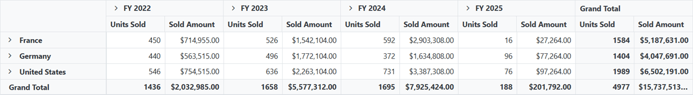
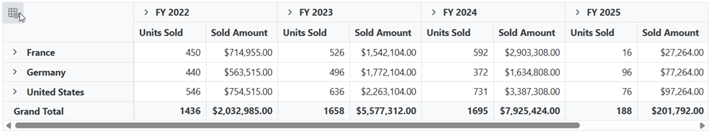
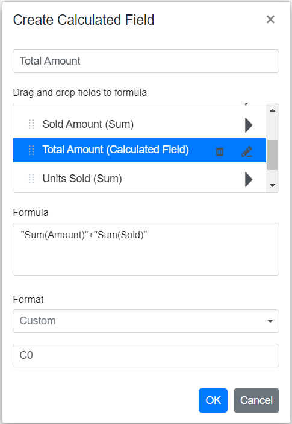

<!-- markdownlint-disable MD024 -->
<!-- markdownlint-disable MD012 -->
<!-- markdownlint-disable MD029 -->
<!-- markdownlint-disable MD009 -->

# Getting Started with Blazor Pivot Table Component

This section briefly explains about how to include a **Pivot Table** in your Blazor Server-Side application. You can refer [Getting Started with Syncfusion Blazor for Server-Side in Visual Studio](https://blazor.syncfusion.com/documentation/getting-started/blazor-server-side-visual-studio/) page for the introduction and configuring the common specifications.

To get start quickly with Blazor Pivot Table component, you can check out this video.



## Importing Syncfusion Blazor Pivot Table component in the application

1. Install the **Syncfusion.Blazor.PivotTable** NuGet package to the application by using the **NuGet Package Manager**.
2. You can add the client-side resources through [CDN](https://blazor.syncfusion.com/documentation/appearance/themes#cdn-reference) or from [NuGet](https://blazor.syncfusion.com/documentation/appearance/themes#static-web-assets) package in the `<head>` element of the **~/Pages/_Host.cshtml** page.

 ```html
<head>
    <link href="_content/Syncfusion.Blazor.Themes/bootstrap4.css" rel="stylesheet" />
    <!---CDN--->
    @*<link href="https://cdn.syncfusion.com/blazor/{{ site.blazorversion }}/styles/bootstrap4.css" rel="stylesheet" />*@

    <!---Additionally refer the below file to use pivot chart--->
    <script src="https://cdnjs.cloudflare.com/ajax/libs/lodash.js/4.17.20/lodash.min.js"></script>
</head>
```

> For Internet Explorer 11 kindly refer the polyfills. Refer the [documentation](https://blazor.syncfusion.com/documentation/common/how-to/render-blazor-server-app-in-ie/) for more information.

 ```html
<head>
    <link href="https://cdn.syncfusion.com/blazor/{{ site.blazorversion }}/styles/bootstrap4.css" rel="stylesheet" />
    <script src="https://github.com/Daddoon/Blazor.Polyfill/releases/download/3.0.1/blazor.polyfill.min.js"></script>

    <!---Additionally refer the below file to use pivot chart--->
    <script src="https://cdnjs.cloudflare.com/ajax/libs/lodash.js/4.17.20/lodash.min.js"></script>
</head>
```

## Adding component package to the application

Open **~/_Imports.razor** file and import the **Syncfusion.Blazor.PivotView** package.

```cshtml
@using Syncfusion.Blazor.PivotView
```

## Add SyncfusionBlazor service in Startup.cs

Open the **Startup.cs** file and add services required by Syncfusion components using  **services.AddSyncfusionBlazor()** method. Add this method in the **ConfigureServices** function as follows.

```csharp
using Syncfusion.Blazor;

namespace BlazorApplication
{
    public class Startup
    {
        ....
        ....
        public void ConfigureServices(IServiceCollection services)
        {
            ....
            ....
            services.AddSyncfusionBlazor();
        }
    }
}
```

The server will be disconnected while performing any UI operations if the bound data source is large. To avoid this, add the following service to increase the buffer size of the message over the SignalR connection. 

```csharp
using Syncfusion.Blazor;

namespace BlazorApplication
{
    public class Startup
    {
        ....
        ....
        public void ConfigureServices(IServiceCollection services)
        {
            ....
            services.AddSignalR(e => {
                  e.MaximumReceiveMessageSize = 102400000;
            }); 
            services.AddSyncfusionBlazor();
        }
    }
}
```

> To enable custom client side resource loading from CRG or CDN. You need to disable resource loading by `AddSyncfusionBlazor(true)` and load the scripts in the HEAD element of the `~/Pages/_Host.cshtml` page.

 ```html
<head>
    <script src="https://cdn.syncfusion.com/blazor/{{ site.blazorversion }}/syncfusion-blazor.min.js"></script>
</head>
```

## Initializing pivot table component in an application

The Syncfusion Pivot Table component can be initialized in any razor page inside `~/Pages` folder. Here, the pivot table component is initialized inside `~/Pages/Index.razor` page. In a new application, if `Index.razor` page has any default content template, then those content can be completely removed and following code can be added.

```cshtml
@using Syncfusion.Blazor.PivotView

<SfPivotView TValue="ProductDetails"></SfPivotView>

```

## Assigning sample data to the pivot table

The [Blazor Pivot Table](https://www.syncfusion.com/blazor-components/blazor-pivot-table) component further needs to be populated with an appropriate data source. For illustration purpose, a collection of objects mentioning the sales details of certain products over a period and region has been prepared. This sample data is assigned to the pivot table component through [DataSource](https://help.syncfusion.com/cr/blazor/Syncfusion.Blazor.PivotView.PivotViewDataSourceSettings-1.html#Syncfusion_Blazor_PivotView_PivotViewDataSourceSettings_1_DataSource) property under [PivotViewDataSourceSettings](https://help.syncfusion.com/cr/blazor/Syncfusion.Blazor.PivotView.PivotViewDataSourceSettings-1.html) class.

```cshtml
@using Syncfusion.Blazor.PivotView

<SfPivotView TValue="ProductDetails">
     <PivotViewDataSourceSettings DataSource="@dataSource">
    </PivotViewDataSourceSettings>
</SfPivotView>

@code{
    public List<ProductDetails> dataSource { get; set; }
    protected override void OnInitialized()
    {
        this.dataSource = ProductDetails.GetProductData().ToList();
    }

    public class ProductDetails
    {
        public int Sold { get; set; }
        public double Amount { get; set; }
        public string Country { get; set; }
        public string Products { get; set; }
        public string Year { get; set; }
        public string Quarter { get; set; }

        public static List<ProductDetails> GetProductData()
        {
            List<ProductDetails> productData = new List<ProductDetails>();
            productData.Add(new ProductDetails { Sold = 31, Amount = 52824, Country = "France", Products = "Mountain Bikes", Year = "FY 2015", Quarter = "Q1" });
            productData.Add(new ProductDetails { Sold = 51, Amount = 86904, Country = "France", Products = "Mountain Bikes", Year = "FY 2015", Quarter = "Q2" });
            productData.Add(new ProductDetails { Sold = 90, Amount = 153360, Country = "France", Products = "Mountain Bikes", Year = "FY 2015", Quarter = "Q3" });
            productData.Add(new ProductDetails { Sold = 25, Amount = 42600, Country = "France", Products = "Mountain Bikes", Year = "FY 2015", Quarter = "Q4" });
            productData.Add(new ProductDetails { Sold = 27, Amount = 46008, Country = "France", Products = "Mountain Bikes", Year = "FY 2016", Quarter = "Q1" });
            productData.Add(new ProductDetails { Sold = 49, Amount = 83496, Country = "France", Products = "Mountain Bikes", Year = "FY 2016", Quarter = "Q2" });
            productData.Add(new ProductDetails { Sold = 95, Amount = 161880, Country = "France", Products = "Mountain Bikes", Year = "FY 2016", Quarter = "Q3" });
            productData.Add(new ProductDetails { Sold = 67, Amount = 114168, Country = "France", Products = "Mountain Bikes", Year = "FY 2016", Quarter = "Q4" });
            productData.Add(new ProductDetails { Sold = 75, Amount = 127800, Country = "France", Products = "Mountain Bikes", Year = "FY 2017", Quarter = "Q1" });
            productData.Add(new ProductDetails { Sold = 67, Amount = 114168, Country = "France", Products = "Mountain Bikes", Year = "FY 2017", Quarter = "Q2" });
            productData.Add(new ProductDetails { Sold = 69, Amount = 117576, Country = "France", Products = "Mountain Bikes", Year = "FY 2017", Quarter = "Q3" });
            productData.Add(new ProductDetails { Sold = 90, Amount = 153360, Country = "France", Products = "Mountain Bikes", Year = "FY 2017", Quarter = "Q4" });
            productData.Add(new ProductDetails { Sold = 16, Amount = 27264, Country = "France", Products = "Mountain Bikes", Year = "FY 2018", Quarter = "Q1" });
            productData.Add(new ProductDetails { Sold = 83, Amount = 124422, Country = "France", Products = "Road Bikes", Year = "FY 2015", Quarter = "Q1" });
            productData.Add(new ProductDetails { Sold = 57, Amount = 85448, Country = "France", Products = "Road Bikes", Year = "FY 2015", Quarter = "Q2" });
            productData.Add(new ProductDetails { Sold = 20, Amount = 29985, Country = "France", Products = "Road Bikes", Year = "FY 2015", Quarter = "Q3" });
            productData.Add(new ProductDetails { Sold = 67, Amount = 70008, Country = "France", Products = "Road Bikes", Year = "FY 2016", Quarter = "Q1" });
            productData.Add(new ProductDetails { Sold = 89, Amount = 60496, Country = "France", Products = "Road Bikes", Year = "FY 2016", Quarter = "Q2" });
            productData.Add(new ProductDetails { Sold = 75, Amount = 801880, Country = "France", Products = "Road Bikes", Year = "FY 2016", Quarter = "Q3" });
            productData.Add(new ProductDetails { Sold = 57, Amount = 204168, Country = "France", Products = "Road Bikes", Year = "FY 2016", Quarter = "Q4" });
            productData.Add(new ProductDetails { Sold = 75, Amount = 737800, Country = "France", Products = "Road Bikes", Year = "FY 2017", Quarter = "Q1" });
            productData.Add(new ProductDetails { Sold = 87, Amount = 884168, Country = "France", Products = "Road Bikes", Year = "FY 2017", Quarter = "Q2" });
            productData.Add(new ProductDetails { Sold = 39, Amount = 729576, Country = "France", Products = "Road Bikes", Year = "FY 2017", Quarter = "Q3" });
            productData.Add(new ProductDetails { Sold = 90, Amount = 38860, Country = "France", Products = "Road Bikes", Year = "FY 2017", Quarter = "Q4" });
            productData.Add(new ProductDetails { Sold = 93, Amount = 139412, Country = "France", Products = "Road Bikes", Year = "FY 2015", Quarter = "Q4" });
            productData.Add(new ProductDetails { Sold = 51, Amount = 92824, Country = "Germany", Products = "Mountain Bikes", Year = "FY 2015", Quarter = "Q1" });
            productData.Add(new ProductDetails { Sold = 61, Amount = 76904, Country = "Germany", Products = "Mountain Bikes", Year = "FY 2015", Quarter = "Q2" });
            productData.Add(new ProductDetails { Sold = 70, Amount = 43360, Country = "Germany", Products = "Mountain Bikes", Year = "FY 2015", Quarter = "Q3" });
            productData.Add(new ProductDetails { Sold = 85, Amount = 62600, Country = "Germany", Products = "Mountain Bikes", Year = "FY 2015", Quarter = "Q4" });
            productData.Add(new ProductDetails { Sold = 97, Amount = 86008, Country = "Germany", Products = "Mountain Bikes", Year = "FY 2016", Quarter = "Q1" });
            productData.Add(new ProductDetails { Sold = 69, Amount = 93496, Country = "Germany", Products = "Mountain Bikes", Year = "FY 2016", Quarter = "Q2" });
            productData.Add(new ProductDetails { Sold = 45, Amount = 301880, Country = "Germany", Products = "Mountain Bikes", Year = "FY 2016", Quarter = "Q3" });
            productData.Add(new ProductDetails { Sold = 77, Amount = 404168, Country = "Germany", Products = "Mountain Bikes", Year = "FY 2016", Quarter = "Q4" });
            productData.Add(new ProductDetails { Sold = 15, Amount = 137800, Country = "Germany", Products = "Mountain Bikes", Year = "FY 2017", Quarter = "Q1" });
            productData.Add(new ProductDetails { Sold = 37, Amount = 184168, Country = "Germany", Products = "Mountain Bikes", Year = "FY 2017", Quarter = "Q2" });
            productData.Add(new ProductDetails { Sold = 49, Amount = 89576, Country = "Germany", Products = "Mountain Bikes", Year = "FY 2017", Quarter = "Q3" });
            productData.Add(new ProductDetails { Sold = 40, Amount = 33360, Country = "Germany", Products = "Mountain Bikes", Year = "FY 2017", Quarter = "Q4" });
            productData.Add(new ProductDetails { Sold = 96, Amount = 77264, Country = "Germany", Products = "Mountain Bikes", Year = "FY 2018", Quarter = "Q1" });
            productData.Add(new ProductDetails { Sold = 23, Amount = 24422, Country = "Germany", Products = "Road Bikes", Year = "FY 2015", Quarter = "Q1" });
            productData.Add(new ProductDetails { Sold = 67, Amount = 75448, Country = "Germany", Products = "Road Bikes", Year = "FY 2015", Quarter = "Q2" });
            productData.Add(new ProductDetails { Sold = 70, Amount = 52345, Country = "Germany", Products = "Road Bikes", Year = "FY 2015", Quarter = "Q3" });
            productData.Add(new ProductDetails { Sold = 13, Amount = 135612, Country = "Germany", Products = "Road Bikes", Year = "FY 2015", Quarter = "Q4" });
            productData.Add(new ProductDetails { Sold = 57, Amount = 90008, Country = "Germany", Products = "Road Bikes", Year = "FY 2016", Quarter = "Q1" });
            productData.Add(new ProductDetails { Sold = 29, Amount = 90496, Country = "Germany", Products = "Road Bikes", Year = "FY 2016", Quarter = "Q2" });
            productData.Add(new ProductDetails { Sold = 45, Amount = 301880, Country = "Germany", Products = "Road Bikes", Year = "FY 2016", Quarter = "Q3" });
            productData.Add(new ProductDetails { Sold = 77, Amount = 404168, Country = "Germany", Products = "Road Bikes", Year = "FY 2016", Quarter = "Q4" });
            productData.Add(new ProductDetails { Sold = 15, Amount = 137800, Country = "Germany", Products = "Road Bikes", Year = "FY 2017", Quarter = "Q1" });
            productData.Add(new ProductDetails { Sold = 37, Amount = 184168, Country = "Germany", Products = "Road Bikes", Year = "FY 2017", Quarter = "Q2" });
            productData.Add(new ProductDetails { Sold = 99, Amount = 829576, Country = "Germany", Products = "Road Bikes", Year = "FY 2017", Quarter = "Q3" });
            productData.Add(new ProductDetails { Sold = 80, Amount = 38360, Country = "Germany", Products = "Road Bikes", Year = "FY 2017", Quarter = "Q4" });
            productData.Add(new ProductDetails { Sold = 91, Amount = 67824, Country = "United States", Products = "Mountain Bikes", Year = "FY 2015", Quarter = "Q1" });
            productData.Add(new ProductDetails { Sold = 81, Amount = 99904, Country = "United States", Products = "Mountain Bikes", Year = "FY 2015", Quarter = "Q2" });
            productData.Add(new ProductDetails { Sold = 70, Amount = 49360, Country = "United States", Products = "Mountain Bikes", Year = "FY 2015", Quarter = "Q3" });
            productData.Add(new ProductDetails { Sold = 65, Amount = 69600, Country = "United States", Products = "Mountain Bikes", Year = "FY 2015", Quarter = "Q4" });
            productData.Add(new ProductDetails { Sold = 57, Amount = 90008, Country = "United States", Products = "Mountain Bikes", Year = "FY 2016", Quarter = "Q1" });
            productData.Add(new ProductDetails { Sold = 29, Amount = 90496, Country = "United States", Products = "Mountain Bikes", Year = "FY 2016", Quarter = "Q2" });
            productData.Add(new ProductDetails { Sold = 85, Amount = 391880, Country = "United States", Products = "Mountain Bikes", Year = "FY 2016", Quarter = "Q3" });
            productData.Add(new ProductDetails { Sold = 97, Amount = 904168, Country = "United States", Products = "Mountain Bikes", Year = "FY 2016", Quarter = "Q4" });
            productData.Add(new ProductDetails { Sold = 85, Amount = 237800, Country = "United States", Products = "Mountain Bikes", Year = "FY 2017", Quarter = "Q1" });
            productData.Add(new ProductDetails { Sold = 77, Amount = 384168, Country = "United States", Products = "Mountain Bikes", Year = "FY 2017", Quarter = "Q2" });
            productData.Add(new ProductDetails { Sold = 99, Amount = 829576, Country = "United States", Products = "Mountain Bikes", Year = "FY 2017", Quarter = "Q3" });
            productData.Add(new ProductDetails { Sold = 80, Amount = 38360, Country = "United States", Products = "Mountain Bikes", Year = "FY 2017", Quarter = "Q4" });
            productData.Add(new ProductDetails { Sold = 76, Amount = 97264, Country = "United States", Products = "Mountain Bikes", Year = "FY 2018", Quarter = "Q1" });
            productData.Add(new ProductDetails { Sold = 53, Amount = 94422, Country = "United States", Products = "Road Bikes", Year = "FY 2015", Quarter = "Q1" });
            productData.Add(new ProductDetails { Sold = 90, Amount = 45448, Country = "United States", Products = "Road Bikes", Year = "FY 2015", Quarter = "Q2" });
            productData.Add(new ProductDetails { Sold = 29, Amount = 92345, Country = "United States", Products = "Road Bikes", Year = "FY 2015", Quarter = "Q3" });
            productData.Add(new ProductDetails { Sold = 67, Amount = 235612, Country = "United States", Products = "Road Bikes", Year = "FY 2015", Quarter = "Q4" });
            productData.Add(new ProductDetails { Sold = 97, Amount = 90008, Country = "United States", Products = "Road Bikes", Year = "FY 2016", Quarter = "Q1" });
            productData.Add(new ProductDetails { Sold = 79, Amount = 90496, Country = "United States", Products = "Road Bikes", Year = "FY 2016", Quarter = "Q2" });
            productData.Add(new ProductDetails { Sold = 95, Amount = 501880, Country = "United States", Products = "Road Bikes", Year = "FY 2016", Quarter = "Q3" });
            productData.Add(new ProductDetails { Sold = 97, Amount = 104168, Country = "United States", Products = "Road Bikes", Year = "FY 2016", Quarter = "Q4" });
            productData.Add(new ProductDetails { Sold = 95, Amount = 837800, Country = "United States", Products = "Road Bikes", Year = "FY 2017", Quarter = "Q1" });
            productData.Add(new ProductDetails { Sold = 87, Amount = 684168, Country = "United States", Products = "Road Bikes", Year = "FY 2017", Quarter = "Q2" });
            productData.Add(new ProductDetails { Sold = 109, Amount = 29576, Country = "United States", Products = "Road Bikes", Year = "FY 2017", Quarter = "Q3" });
            productData.Add(new ProductDetails { Sold = 99, Amount = 345860, Country = "United States", Products = "Road Bikes", Year = "FY 2017", Quarter = "Q4" });
            return productData;
        }
    }
}

```

## Adding fields to row, column, value and filter axes

Now that pivot table is initialized and assigned with sample data, will further move to showcase the component by organizing appropriate fields in row, column, value and filter axes.

In [PivotViewDataSourceSettings](https://help.syncfusion.com/cr/blazor/Syncfusion.Blazor.PivotView.PivotViewDataSourceSettings-1.html) class, four major axes -  [PivotViewRows](https://help.syncfusion.com/cr/blazor/Syncfusion.Blazor.PivotView.PivotViewRow.html), [PivotViewColumns](https://help.syncfusion.com/cr/blazor/Syncfusion.Blazor.PivotView.PivotViewColumn.html), [PivotViewValues](https://help.syncfusion.com/cr/blazor/Syncfusion.Blazor.PivotView.PivotViewValue.html) and [PivotViewFilters](https://help.syncfusion.com/cr/blazor/Syncfusion.Blazor.PivotView.PivotViewFilter.html) plays a vital role in defining and organizing fields from the bound data source, to render the entire pivot table component in a desired format.

[PivotViewRows](https://help.syncfusion.com/cr/blazor/Syncfusion.Blazor.PivotView.PivotViewRow.html) – Collection of fields that needs to be displayed in row axis of the pivot table.

[PivotViewColumns](https://help.syncfusion.com/cr/blazor/Syncfusion.Blazor.PivotView.PivotViewColumn.html) – Collection of fields that needs to be displayed in column axis of the pivot table.

[PivotViewValues](https://help.syncfusion.com/cr/blazor/Syncfusion.Blazor.PivotView.PivotViewValue.html) – Collection of fields that needs to be displayed as aggregated numeric values in the pivot table.

[PivotViewFilters](https://help.syncfusion.com/cr/blazor/Syncfusion.Blazor.PivotView.PivotViewFilter.html) - Collection of fields that would act as master filter over the data bound in row, column and value axes of the pivot table.

In-order to define each field in the respective axis, the following basic properties should be set.

* [Name](https://help.syncfusion.com/cr/blazor/Syncfusion.Blazor.PivotView.PivotViewRow.html#Syncfusion_Blazor_PivotView_PivotViewRow_Name): It allows to set the field name from the bound data source. It’s casing should match exactly like in the data source and if not set properly, the pivot table will not be rendered.
* [Caption](https://help.syncfusion.com/cr/blazor/Syncfusion.Blazor.PivotView.PivotViewRow.html#Syncfusion_Blazor_PivotView_PivotViewRow_Caption): It allows to set the field caption, which is the alias name of the field that needs to be displayed in the pivot table.
* [Type](https://help.syncfusion.com/cr/blazor/Syncfusion.Blazor.PivotView.PivotViewRow.html#Syncfusion_Blazor_PivotView_PivotViewRow_Type): It allows to set the summary type of the field. By default, [SummaryTypes.Sum](https://help.syncfusion.com/cr/blazor/Syncfusion.Blazor.PivotView.SummaryTypes.html) is applied.

In this illustration, "Year" and "Quarter" are added in column, "Country" and "Products" in row, and "Sold" and "Amount" in value section respectively.

```cshtml
@using Syncfusion.Blazor.PivotView

<SfPivotView TValue="ProductDetails" Height="300">
     <PivotViewDataSourceSettings DataSource="@dataSource">
        <PivotViewColumns>
            <PivotViewColumn Name="Year"></PivotViewColumn>
            <PivotViewColumn Name="Quarter"></PivotViewColumn>
        </PivotViewColumns>
        <PivotViewRows>
            <PivotViewRow Name="Country"></PivotViewRow>
            <PivotViewRow Name="Products"></PivotViewRow>
        </PivotViewRows>
        <PivotViewValues>
            <PivotViewValue Name="Sold" Caption="Units Sold"></PivotViewValue>
            <PivotViewValue Name="Amount" Caption="Sold Amount"></PivotViewValue>
        </PivotViewValues>
    </PivotViewDataSourceSettings>
</SfPivotView>

@code{
    public List<ProductDetails> dataSource { get; set; }
    protected override void OnInitialized()
    {
        this.dataSource = ProductDetails.GetProductData().ToList();
        //Bind the data source collection here. Refer "Assigning sample data to the pivot table" section for more details.
    }
}

```

## Applying formatting to a value field

Formatting defines a way in which values should be displayed. For example, format **"C"** denotes the values should be displayed in currency pattern. To do so, define the [PivotViewFormatSetting](https://help.syncfusion.com/cr/blazor/Syncfusion.Blazor.PivotView.PivotViewFilterSetting.html) class with its [Name](https://help.syncfusion.com/cr/blazor/Syncfusion.Blazor.PivotView.PivotViewFormatSetting.html#Syncfusion_Blazor_PivotView_PivotViewFormatSetting_Name) and [Format](https://help.syncfusion.com/cr/blazor/Syncfusion.Blazor.PivotView.PivotViewFormatSetting.html#Syncfusion_Blazor_PivotView_PivotViewFormatSetting_Format) properties and add it to [PivotViewFormatSettings](https://help.syncfusion.com/cr/blazor/Syncfusion.Blazor.PivotView.PivotViewFilterSettings.html). In this illustration, the [Name](https://help.syncfusion.com/cr/blazor/Syncfusion.Blazor.PivotView.PivotViewFormatSetting.html#Syncfusion_Blazor_PivotView_PivotViewFormatSetting_Name) property is set as **Amount**, a field from value section and its format is set as currency. Likewise, we can set format for other value fields as well and add it to [PivotViewFormatSettings](https://help.syncfusion.com/cr/blazor/Syncfusion.Blazor.PivotView.PivotViewFilterSettings.html).

> Only fields from value section, which is in the form of numeric data values are applicable for formatting.

```cshtml
@using Syncfusion.Blazor.PivotView

<SfPivotView TValue="ProductDetails" Height="300">
     <PivotViewDataSourceSettings DataSource="@dataSource">
        <PivotViewColumns>
            <PivotViewColumn Name="Year"></PivotViewColumn>
            <PivotViewColumn Name="Quarter"></PivotViewColumn>
        </PivotViewColumns>
        <PivotViewRows>
            <PivotViewRow Name="Country"></PivotViewRow>
            <PivotViewRow Name="Products"></PivotViewRow>
        </PivotViewRows>
        <PivotViewValues>
            <PivotViewValue Name="Sold" Caption="Units Sold"></PivotViewValue>
            <PivotViewValue Name="Amount" Caption="Sold Amount"></PivotViewValue>
        </PivotViewValues>
        <PivotViewFormatSettings>
            <PivotViewFormatSetting Name="Amount" Format="C"></PivotViewFormatSetting>
        </PivotViewFormatSettings>
    </PivotViewDataSourceSettings>
</SfPivotView>

@code{
    public List<ProductDetails> dataSource { get; set; }
    protected override void OnInitialized()
    {
        this.dataSource = ProductDetails.GetProductData().ToList();
        //Bind the data source collection here. Refer "Assigning sample data to the pivot table" section for more details.
    }
}

```

After successful compilation of the application, simply press F5 to run the same. The pivot table component will render in the default web browser like below.

 

## Enable Field List

The field list allows to add or remove fields and also rearrange the fields between different axes, including column, row, value, and filter along with filter and sort options dynamically at runtime. It can be enabled by setting the [ShowFieldList](https://help.syncfusion.com/cr/blazor/Syncfusion.Blazor.PivotView.SfPivotView-1.html#Syncfusion_Blazor_PivotView_SfPivotView_1_ShowFieldList) property to **true**. To know more about field list, [refer](./field-list) here.

 ```cshtml
@using Syncfusion.Blazor.PivotView

<SfPivotView TValue="ProductDetails" ShowFieldList="true" Height="300">
     <PivotViewDataSourceSettings DataSource="@dataSource">
        <PivotViewColumns>
            <PivotViewColumn Name="Year"></PivotViewColumn>
            <PivotViewColumn Name="Quarter"></PivotViewColumn>
        </PivotViewColumns>
        <PivotViewRows>
            <PivotViewRow Name="Country"></PivotViewRow>
            <PivotViewRow Name="Products"></PivotViewRow>
        </PivotViewRows>
        <PivotViewValues>
            <PivotViewValue Name="Sold" Caption="Units Sold"></PivotViewValue>
            <PivotViewValue Name="Amount" Caption="Sold Amount"></PivotViewValue>
        </PivotViewValues>
        <PivotViewFormatSettings>
            <PivotViewFormatSetting Name="Amount" Format="C"></PivotViewFormatSetting>
        </PivotViewFormatSettings>
    </PivotViewDataSourceSettings>
</SfPivotView>

@code{
    public List<ProductDetails> dataSource { get; set; }
    protected override void OnInitialized()
    {
        this.dataSource = ProductDetails.GetProductData().ToList();
        //Bind the data source collection here. Refer "Assigning sample data to the pivot table" section for more details.
    }
}

```


<br/>


## Enable Grouping Bar

The grouping bar feature automatically populates fields from the bound data source and allows end users to drag fields between different axes such as columns, rows, values, and filters, and alter pivot table at runtime. It also provides option to sort, filter and remove fields. It can be enabled by setting the [ShowGroupingBar](https://help.syncfusion.com/cr/blazor/Syncfusion.Blazor.PivotView.SfPivotView-1.html#Syncfusion_Blazor_PivotView_SfPivotView_1_ShowGroupingBar) property to **true**. To know more about grouping bar, [refer](./grouping-bar) here.

 ```cshtml
@using Syncfusion.Blazor.PivotView

<SfPivotView TValue="ProductDetails" ShowGroupingBar="true" Height="300">
     <PivotViewDataSourceSettings DataSource="@dataSource">
        <PivotViewColumns>
            <PivotViewColumn Name="Year"></PivotViewColumn>
            <PivotViewColumn Name="Quarter"></PivotViewColumn>
        </PivotViewColumns>
        <PivotViewRows>
            <PivotViewRow Name="Country"></PivotViewRow>
            <PivotViewRow Name="Products"></PivotViewRow>
        </PivotViewRows>
        <PivotViewValues>
            <PivotViewValue Name="Sold" Caption="Units Sold"></PivotViewValue>
            <PivotViewValue Name="Amount" Caption="Sold Amount"></PivotViewValue>
        </PivotViewValues>
        <PivotViewFormatSettings>
            <PivotViewFormatSetting Name="Amount" Format="C"></PivotViewFormatSetting>
        </PivotViewFormatSettings>
    </PivotViewDataSourceSettings>
</SfPivotView>

@code{
    public List<ProductDetails> dataSource { get; set; }
    protected override void OnInitialized()
    {
        this.dataSource = ProductDetails.GetProductData().ToList();
        //Bind the data source collection here. Refer "Assigning sample data to the pivot table" section for more details.
    }
}

```


## Exploring Filter Axis

The filter axis contains collection of fields that would act as master filter over the data bound in row, column and value axes of the pivot table. The fields along with filter members could be set to filter axis either through report via code behind or by dragging and dropping fields from other axes to filter axis via grouping bar or field list at runtime.

 ```cshtml
@using Syncfusion.Blazor.PivotView

<SfPivotView TValue="ProductDetails" ShowGroupingBar="true" ShowFieldList="true" Height="300">
     <PivotViewDataSourceSettings DataSource="@dataSource">
        <PivotViewColumns>
            <PivotViewColumn Name="Year"></PivotViewColumn>
            <PivotViewColumn Name="Quarter"></PivotViewColumn>
        </PivotViewColumns>
        <PivotViewRows>
            <PivotViewRow Name="Products"></PivotViewRow>
        </PivotViewRows>
        <PivotViewFilters>
            <PivotViewFilter Name="Country"></PivotViewFilter>
        </PivotViewFilters>
        <PivotViewValues>
            <PivotViewValue Name="Sold" Caption="Units Sold"></PivotViewValue>
            <PivotViewValue Name="Amount" Caption="Sold Amount"></PivotViewValue>
        </PivotViewValues>
        <PivotViewFormatSettings>
            <PivotViewFormatSetting Name="Amount" Format="C"></PivotViewFormatSetting>
        </PivotViewFormatSettings>
    </PivotViewDataSourceSettings>
</SfPivotView>

@code{
    public List<ProductDetails> dataSource { get; set; }
    protected override void OnInitialized()
    {
        this.dataSource = ProductDetails.GetProductData().ToList();
        //Bind the data source collection here. Refer "Assigning sample data to the pivot table" section for more details.
    }
}

```


<br/>
<br/>
<br/>


## Calculated Field

The calculated field feature allows user to insert or add a new calculated field based on the available fields from the bound data source using basic arithmetic operators. The calculated field can be included in pivot table using the [PivotViewCalculatedFieldSetting](https://help.syncfusion.com/cr/blazor/Syncfusion.Blazor.PivotView.PivotViewCalculatedFieldSetting.html) class from code behind. Or else, calculated fields can be added at run time through the built-in dialog by just setting the [AllowCalculatedField](https://help.syncfusion.com/cr/blazor/Syncfusion.Blazor.PivotView.SfPivotView-1.html#Syncfusion_Blazor_PivotView_SfPivotView_1_AllowCalculatedField) property to **true** in pivot table. You will see a button enabled in the Field List UI automatically to invoke the calculated field dialog and perform necessary operation. To know more about calculated field, [refer](./calculated-field) here.

```cshtml
@using Syncfusion.Blazor.PivotView

<SfPivotView TValue="ProductDetails" ShowFieldList="true" AllowCalculatedField="true" Height="300">
     <PivotViewDataSourceSettings DataSource="@dataSource">
        <PivotViewColumns>
            <PivotViewColumn Name="Year"></PivotViewColumn>
            <PivotViewColumn Name="Quarter"></PivotViewColumn>
        </PivotViewColumns>
        <PivotViewRows>
            <PivotViewRow Name="Country"></PivotViewRow>
            <PivotViewRow Name="Products"></PivotViewRow>
        </PivotViewRows>
        <PivotViewValues>
            <PivotViewValue Name="Sold" Caption="Unit Sold"></PivotViewValue>
            <PivotViewValue Name="Amount" Caption="Sold Amount"></PivotViewValue>
            <PivotViewValue Name="Total" Caption="Total Amount"></PivotViewValue>
        </PivotViewValues>
        <PivotViewFormatSettings>
            <PivotViewFormatSetting Name="Amount" Format="C"></PivotViewFormatSetting>
            <PivotViewFormatSetting Name="Total" Format="C"></PivotViewFormatSetting>
        </PivotViewFormatSettings>
         <PivotViewCalculatedFieldSettings>
            <PivotViewCalculatedFieldSetting Name="Total" Formula="@totalPrice"></PivotViewCalculatedFieldSetting>
        </PivotViewCalculatedFieldSettings>
    </PivotViewDataSourceSettings>
</SfPivotView>

@code{
    public string totalPrice = "\"" + "Sum(Amount)" + "\"" + "+" + "\"" + "Sum(Sold)" + "\"";
    public List<ProductDetails> dataSource { get; set; }
    protected override void OnInitialized()
    {
        this.dataSource = ProductDetails.GetProductData().ToList();
        //Bind the data source collection here. Refer "Assigning sample data to the pivot table" section for more details.
    }
}

```


<br/>

<br/>


> You can also explore our [Blazor Pivot Table example](https://blazor.syncfusion.com/demos/pivot-table/default-functionalities?theme=bootstrap4) to knows how to render and configure the pivot table.

## See Also

* [Getting Started with Syncfusion Blazor for Client-Side in .NET Core CLI](https://blazor.syncfusion.com/documentation/getting-started/blazor-webassembly-dotnet-cli/)
* [Getting Started with Syncfusion Blazor for Client-side in Visual Studio 2019](https://blazor.syncfusion.com/documentation/getting-started/blazor-webassembly-visual-studio-2019/)
* [Getting Started with Syncfusion Blazor for Server-Side in .NET Core CLI](https://blazor.syncfusion.com/documentation/getting-started/blazor-server-side-dotnet-cli/)