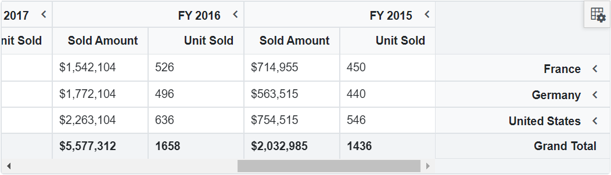

# Globalization in Blazor Pivot Table Component

## Localization

[Blazor PivotTable](https://www.syncfusion.com/blazor-components/blazor-pivot-table) component can be localized. Refer to [Blazor Localization](https://blazor.syncfusion.com/documentation/common/localization) topic to localize Syncfusion<sup style="font-size:70%">&reg;</sup> Blazor components.

## Right-to-left (RTL)

Right-to-left (RTL) provides an option to switch the text direction and layout of the pivot table component from right to left. It improves user experiences and accessibility for users who use right-to-left languages (Arabic, Farsi, Urdu, etc.). In the following code sample, the `EnableRtl` property is used to enable RTL in the pivot table.

```cshtml
@using Syncfusion.Blazor.PivotView

<SfPivotView TValue="ProductDetails" ShowFieldList="true" EnableRtl="true">
     <PivotViewDataSourceSettings DataSource="@data">
        <PivotViewColumns>
            <PivotViewColumn Name="Year"></PivotViewColumn>
            <PivotViewColumn Name="Quarter"></PivotViewColumn>
        </PivotViewColumns>
        <PivotViewRows>
            <PivotViewRow Name="Country"></PivotViewRow>
            <PivotViewRow Name="Products"></PivotViewRow>
        </PivotViewRows>
        <PivotViewValues>
            <PivotViewValue Name="Sold" Caption="Unit Sold"></PivotViewValue>
            <PivotViewValue Name="Amount" Caption="Sold Amount"></PivotViewValue>
        </PivotViewValues>
        <PivotViewFormatSettings>
            <PivotViewFormatSetting Name="Amount" Format="C0" UseGrouping=true></PivotViewFormatSetting>
        </PivotViewFormatSettings>
    </PivotViewDataSourceSettings>
</SfPivotView>

@code{
    public List<ProductDetails> data { get; set; }
    protected override void OnInitialized()
    {
        this.data = ProductDetails.GetProductData().ToList();
        //Bind the data source collection here. Refer "Assigning sample data to the pivot table" section in getting started for more details.
    }
}

```



N> Refer to the [Blazor Pivot Table](https://www.syncfusion.com/blazor-components/blazor-pivot-table) feature tour page for its groundbreaking feature representations. You can also explore the [Blazor Pivot Table example](https://blazor.syncfusion.com/demos/pivot-table/default-functionalities?theme=bootstrap4) to know how to render and configure the pivot table.