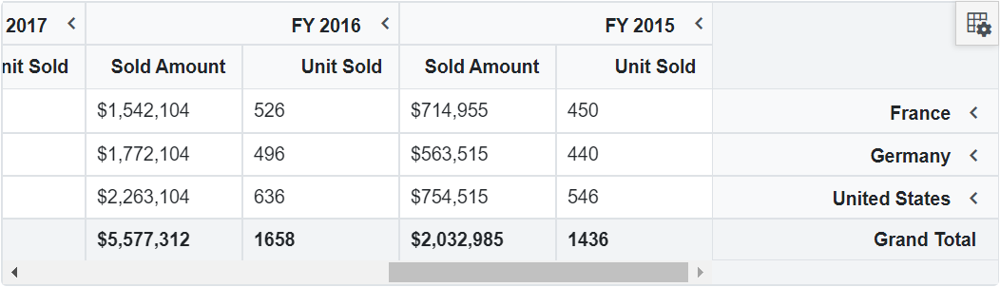

# Globalization in Blazor Pivot Table

Globalization in the Blazor Pivot Table covers two related features: **localization** (translating the component's built-in strings, such as field-list labels and toolbar items, into another language) and **right-to-left (RTL) layout** (rendering the component with a right-to-left reading direction for languages such as Arabic, Farsi, and Urdu). The two features are independent and can be used together.

N> **Prerequisites:** The samples in this page use the `ProductDetails` model defined in the [Getting Started](./getting-started) topic under **Assigning sample data to the pivot table**. The Blazor Pivot Table is compatible with Syncfusion Blazor 28.1.33 and later on .NET 6.0+.

## Key changes in the RTL sample

The Pivot Table is rendered in RTL by adding a single attribute to `SfPivotView`:

- **`EnableRtl="true"`** — enables right-to-left rendering for the grid, toolbar, field list, grouping bar, context menu, conditional formatting dialog, calculated field dialog, and the Pivot Chart view. Defaults to **false** (left-to-right).

This documentation is compatible with Syncfusion Blazor PivotTable version 28.1.33 and later.

## Localization

The [Blazor Pivot Table](https://www.syncfusion.com/blazor-components/blazor-pivot-table) component can be localized. Refer to the [Blazor Localization](https://blazor.syncfusion.com/documentation/common/localization) topic to localize Blazor components. Localization requires registering `AddLocalization()` in `Program.cs`, adding `IStringLocalizer` injection in the consuming component, and shipping a `.resx` resource file with translated strings; see the linked topic for the exact setup.

## Right-to-left (RTL)

Right-to-left (RTL) support makes the Pivot Table more accessible and user-friendly for people who read and write right-to-left languages such as Arabic, Farsi, and Urdu. This feature switches the Pivot Table's text direction and layout from left-to-right to right-to-left. To enable RTL in the Pivot Table, set the [`EnableRtl`](https://help.syncfusion.com/cr/blazor/Syncfusion.Blazor.PivotView.SfPivotView-1.html#Syncfusion_Blazor_PivotView_SfPivotView_1_EnableRtl) property to **true** on the `SfPivotView` component. The property defaults to **false** (left-to-right).

The RTL setting applies to the following areas of the component: the grid, the toolbar, the field list, the grouping bar, the context menu, the conditional formatting dialog, the calculated field dialog, and the Pivot Chart view. The same `EnableRtl` value is honored by the embedded Pivot Chart view (`<PivotViewDisplayOption View="View.Both" />`) so you do not need to set the property twice.

N> **Limitations:** `EnableRtl` flips the layout direction but does not translate any built-in labels; combine it with localization for fully translated right-to-left experiences such as Arabic or Hebrew. Numeric formatting in the value cells follows the active culture and is not affected by `EnableRtl`.

```cshtml
@using Syncfusion.Blazor.PivotView

<SfPivotView TValue="ProductDetails" ShowFieldList="true" EnableRtl="true">
     <PivotViewDataSourceSettings DataSource="@data">
        <PivotViewColumns>
            <PivotViewColumn Name="Year"></PivotViewColumn>
            <PivotViewColumn Name="Quarter"></PivotViewColumn>
        </PivotViewColumns>
        <PivotViewRows>
            <PivotViewRow Name="Country"></PivotViewRow>
            <PivotViewRow Name="Products"></PivotViewRow>
        </PivotViewRows>
        <PivotViewValues>
            <PivotViewValue Name="Sold" Caption="Unit Sold"></PivotViewValue>
            <PivotViewValue Name="Amount" Caption="Sold Amount"></PivotViewValue>
        </PivotViewValues>
        <PivotViewFormatSettings>
            <PivotViewFormatSetting Name="Amount" Format="C0" UseGrouping=true></PivotViewFormatSetting>
        </PivotViewFormatSettings>
    </PivotViewDataSourceSettings>
</SfPivotView>

@code{
    public List<ProductDetails> data { get; set; }
    protected override void OnInitialized()
    {
        this.data = ProductDetails.GetProductData().ToList();
        //Bind the data source collection here. Refer "Assigning sample data to the pivot table" section in getting started for more details.
    }
}

```



N> Refer to the [Blazor Pivot Table](https://www.syncfusion.com/blazor-components/blazor-pivot-table) feature tour page for its groundbreaking feature representations. You can also explore the [Blazor Pivot Table example](https://blazor.syncfusion.com/demos/pivot-table/default-functionalities?theme=fluent2) to know how to render and configure the pivot table.
