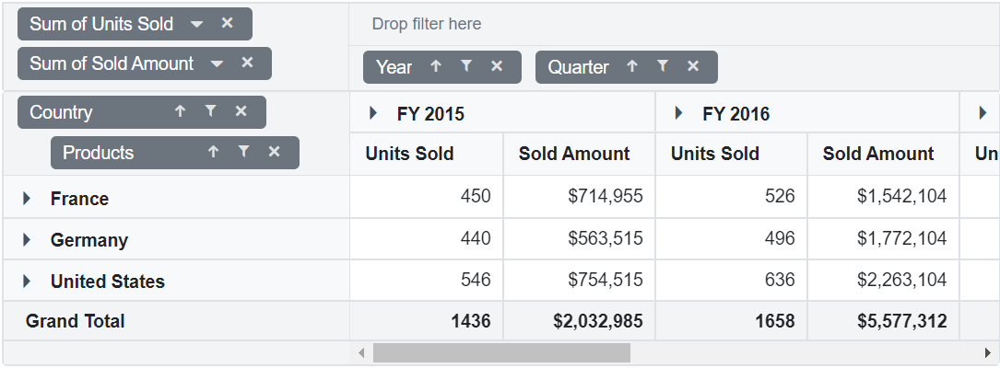
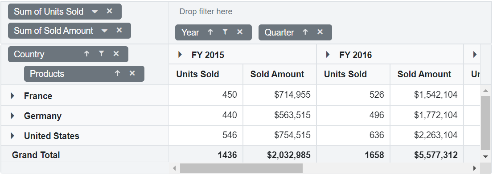
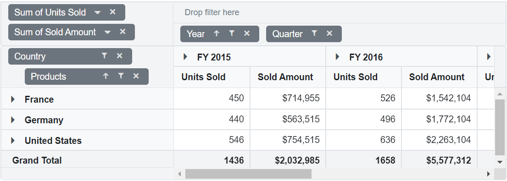
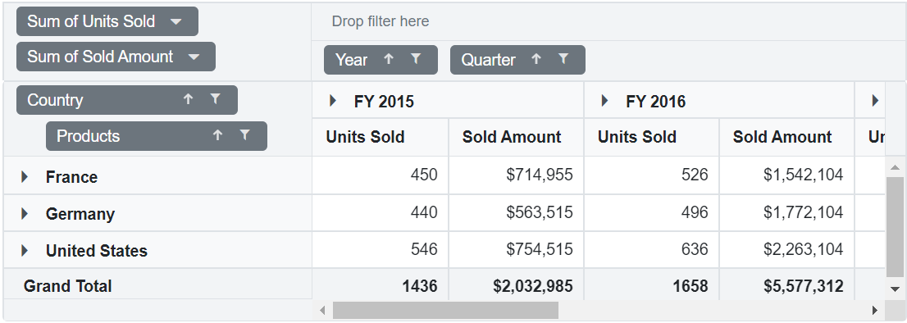
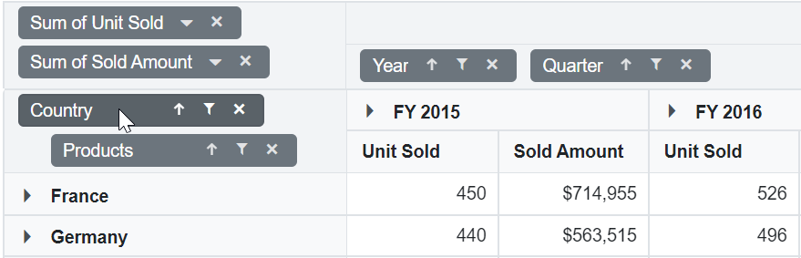
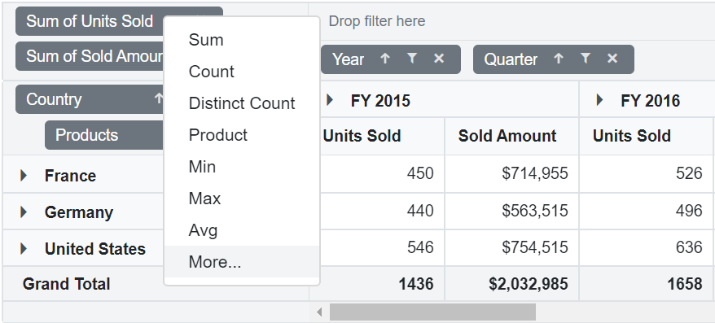
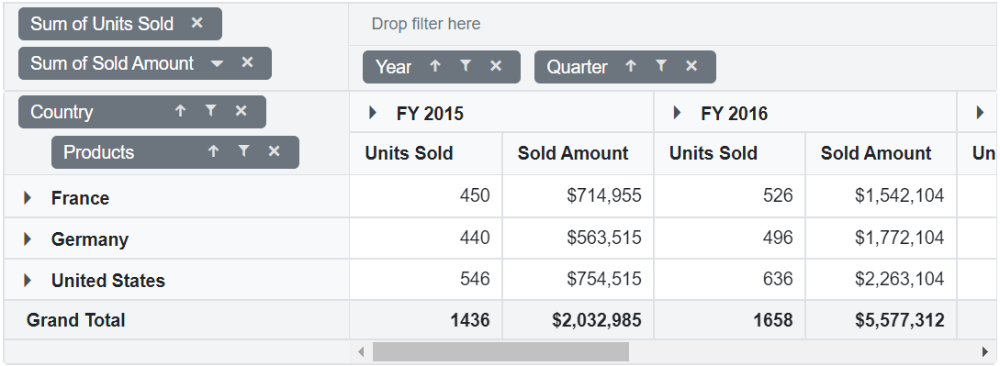

# Grouping Bar in Blazor Pivot Table Component

The Grouping Bar option in pivot table automatically populates fields from the bound data source and allows end users to drag fields between different axes such as columns, rows, values, and filters, and create pivot table at runtime. It can be enabled by setting the [`ShowGroupingBar`](https://help.syncfusion.com/cr/blazor/Syncfusion.Blazor.PivotView.SfPivotView-1.html#Syncfusion_Blazor_PivotView_SfPivotView_1_ShowGroupingBar) property in [`SfPivotView`](https://help.syncfusion.com/cr/blazor/Syncfusion.Blazor.PivotView.SfPivotView-1.html) class to **true**.

Similar to Field List, Grouping Bar UI also comes with basic interactions like,

* Re-arranging fields through drag-and-drop operation between row, column, value and filter axes.
* Remove fields from the existing report using remove icon.
* Add fields to the report using fields panel option.
* Filtering members of specific fields using filter icon.
* Sorting members of specific fields using sort icon.

 ```csharp
    @using Syncfusion.Blazor.PivotView

    <SfPivotView TValue="ProductDetails" ShowGroupingBar="true">
         <PivotViewDataSourceSettings DataSource="@dataSource">
            <PivotViewColumns>
                <PivotViewColumn Name="Year"></PivotViewColumn>
                <PivotViewColumn Name="Quarter"></PivotViewColumn>
            </PivotViewColumns>
            <PivotViewRows>
                <PivotViewRow Name="Country"></PivotViewRow>
                <PivotViewRow Name="Products"></PivotViewRow>
            </PivotViewRows>
            <PivotViewValues>
                <PivotViewValue Name="Sold" Caption="Units Sold"></PivotViewValue>
                <PivotViewValue Name="Amount" Caption="Sold Amount"></PivotViewValue>
            </PivotViewValues>
            <PivotViewFormatSettings>
                <PivotViewFormatSetting Name="Amount" Format="C"></PivotViewFormatSetting>
            </PivotViewFormatSettings>
        </PivotViewDataSourceSettings>
    </SfPivotView>

    @code{
        public List<ProductDetails> dataSource { get; set; }
        protected override void OnInitialized()
        {
           this.dataSource = ProductDetails.GetProductData().ToList();
           //Bind the data source collection here. Refer "Assigning sample data to the pivot table" section in getting started for more details.
        }
    }

```



## Show or hide fields panel

The fields panel, which is positioned above the grouping bar, displays the fields that are available in the data source but are not bound in the report. The fields can be dragged and dropped into the appropriate axis. In addition, any field removed from any axes will be automatically added to the fields panel. The fields panel can be displayed by setting the [`ShowFieldsPanel`](https://help.syncfusion.com/cr/blazor/Syncfusion.Blazor.PivotView.PivotViewGroupingBarSettings.html#Syncfusion_Blazor_PivotView_PivotViewGroupingBarSettings_ShowFieldsPanel) property in the [`PivotViewGroupingBarSettings`](https://help.syncfusion.com/cr/blazor/Syncfusion.Blazor.PivotView.PivotViewGroupingBarSettings.html) to **true**.

```csharp
    @using Syncfusion.Blazor.PivotView

    <SfPivotView TValue="ProductDetails" Height="500" Width="1000" ShowGroupingBar="true">
        <PivotViewDataSourceSettings DataSource="@dataSource">
            <PivotViewColumns>
                <PivotViewColumn Name="Year"></PivotViewColumn>
            </PivotViewColumns>
            <PivotViewRows>
                <PivotViewRow Name="Country"></PivotViewRow>
            </PivotViewRows>
            <PivotViewValues>
                <PivotViewValue Name="Sold" Caption="Units Sold"></PivotViewValue>
            </PivotViewValues>
        </PivotViewDataSourceSettings>
        <PivotViewGroupingBarSettings ShowFieldsPanel="true"></PivotViewGroupingBarSettings>
    </SfPivotView>

    @code{
        public List<ProductDetails> data { get; set; }
        protected override void OnInitialized()
        {
            this.data = ProductDetails.GetDefaultData().ToList();
           //Bind the data source collection here. Refer "Assigning sample data to the pivot table" section in getting started for more details.
        }
    }
```


## Show or hide all filter icon

The Grouping Bar has an option to filter members of particular fields at runtime in pivot table. In-order to filter members in a field, click the filter icon and check/uncheck members that needs to be displayed. By default, filter icon besides each field is enabled in the grouping bar. To disable the filter icon, set the property [`ShowFilterIcon`](https://help.syncfusion.com/cr/blazor/Syncfusion.Blazor.PivotView.PivotViewGroupingBarSettings.html#Syncfusion_Blazor_PivotView_PivotViewGroupingBarSettings_ShowFilterIcon) in [`PivotViewGroupingBarSettings`](https://help.syncfusion.com/cr/blazor/Syncfusion.Blazor.PivotView.PivotViewGroupingBarSettings.html) class to **false**.

```csharp
    @using Syncfusion.Blazor.PivotView

    <SfPivotView TValue="ProductDetails" ShowGroupingBar="true">
        <PivotViewDataSourceSettings DataSource="@data">
            <PivotViewColumns>
                <PivotViewColumn Name="Year"></PivotViewColumn>
                <PivotViewColumn Name="Quarter"></PivotViewColumn>
            </PivotViewColumns>
            <PivotViewRows>
                <PivotViewRow Name="Country"></PivotViewRow>
                <PivotViewRow Name="Products"></PivotViewRow>
            </PivotViewRows>
            <PivotViewValues>
                <PivotViewValue Name="Sold" Caption="Unit Sold"></PivotViewValue>
                <PivotViewValue Name="Amount" Caption="Sold Amount"></PivotViewValue>
            </PivotViewValues>
            <PivotViewFormatSettings>
                <PivotViewFormatSetting Name="Amount" Format="C"></PivotViewFormatSetting>
            </PivotViewFormatSettings>
        </PivotViewDataSourceSettings>
        <PivotViewGroupingBarSettings ShowFilterIcon="false"></PivotViewGroupingBarSettings>
    </SfPivotView>

    @code{
        public List<ProductDetails> data { get; set; }
        protected override void OnInitialized()
        {
            this.data = ProductDetails.GetDefaultData().ToList();
           //Bind the data source collection here. Refer "Assigning sample data to the pivot table" section in getting started for more details.
        }
    }
```


## Show or hide specific filter icon

To disable the filter icon for a specific field, set the property [`ShowFilterIcon`](https://help.syncfusion.com/cr/blazor/Syncfusion.Blazor.PivotView.PivotViewRow.html#Syncfusion_Blazor_PivotView_PivotViewRow_ShowFilterIcon) to **false** to the corresponding field in [`PivotViewDataSourceSettings`](https://help.syncfusion.com/cr/blazor/Syncfusion.Blazor.PivotView.DataSourceSettingsModel-1.html).

In the below sample, the filter icon of "Quarter" and "Products" fields have been hidden.

```csharp
    @using Syncfusion.Blazor.PivotView

    <SfPivotView TValue="ProductDetails" ShowGroupingBar="true">
        <PivotViewDataSourceSettings DataSource="@data">
            <PivotViewColumns>
                <PivotViewColumn Name="Year"></PivotViewColumn>
                <PivotViewColumn Name="Quarter" ShowFilterIcon="false"></PivotViewColumn>
            </PivotViewColumns>
            <PivotViewRows>
                <PivotViewRow Name="Country"></PivotViewRow>
                <PivotViewRow Name="Products" ShowFilterIcon="false"></PivotViewRow>
            </PivotViewRows>
            <PivotViewValues>
                <PivotViewValue Name="Sold" Caption="Unit Sold"></PivotViewValue>
                <PivotViewValue Name="Amount" Caption="Sold Amount"></PivotViewValue>
            </PivotViewValues>
            <PivotViewFormatSettings>
                <PivotViewFormatSetting Name="Amount" Format="C"></PivotViewFormatSetting>
            </PivotViewFormatSettings>
        </PivotViewDataSourceSettings>
    </SfPivotView>

    @code{
        public List<ProductDetails> data { get; set; }
        protected override void OnInitialized()
        {
            this.data = ProductDetails.GetDefaultData().ToList();
           //Bind the data source collection here. Refer "Assigning sample data to the pivot table" section in getting started for more details.
        }
    }
```



## Show or hide all sort icon

The Grouping Bar has an option to order members of a particular fields either in ascending or descending at runtime. In order to sort a field, click the sort icon and to reverse its sort direction, once again click the same sort icon. By default, the sort icon besides each field is enabled in the grouping bar and members will be arranged in ascending order. To disable the sort option, set the property [`ShowSortIcon`](https://help.syncfusion.com/cr/blazor/Syncfusion.Blazor.PivotView.PivotViewGroupingBarSettings.html#Syncfusion_Blazor_PivotView_PivotViewGroupingBarSettings_ShowSortIcon) in [`PivotViewGroupingBarSettings`](https://help.syncfusion.com/cr/blazor/Syncfusion.Blazor.PivotView.PivotViewGroupingBarSettings.html) class to **false**.

```csharp
    @using Syncfusion.Blazor.PivotView

    <SfPivotView TValue="ProductDetails" ShowGroupingBar="true">
        <PivotViewDataSourceSettings DataSource="@data">
            <PivotViewColumns>
                <PivotViewColumn Name="Year"></PivotViewColumn>
                <PivotViewColumn Name="Quarter"></PivotViewColumn>
            </PivotViewColumns>
            <PivotViewRows>
                <PivotViewRow Name="Country"></PivotViewRow>
                <PivotViewRow Name="Products"></PivotViewRow>
            </PivotViewRows>
            <PivotViewValues>
                <PivotViewValue Name="Sold" Caption="Unit Sold"></PivotViewValue>
                <PivotViewValue Name="Amount" Caption="Sold Amount"></PivotViewValue>
            </PivotViewValues>
            <PivotViewFormatSettings>
                <PivotViewFormatSetting Name="Amount" Format="C"></PivotViewFormatSetting>
            </PivotViewFormatSettings>
        </PivotViewDataSourceSettings>
        <PivotViewGroupingBarSettings ShowSortIcon="false" ></PivotViewGroupingBarSettings>
    </SfPivotView>

    @code{
        public List<ProductDetails> data { get; set; }
        protected override void OnInitialized()
        {
            this.data = ProductDetails.GetDefaultData().ToList();
           //Bind the data source collection here. Refer "Assigning sample data to the pivot table" section in getting started for more details.
        }
    }

```


## Show or hide specific sort icon

To disable the sort icon for a specific button, set the property [`ShowSortIcon`](https://help.syncfusion.com/cr/blazor/Syncfusion.Blazor.PivotView.PivotViewRow.html#Syncfusion_Blazor_PivotView_PivotViewRow_ShowSortIcon) to **false** to the corresponding field in [`PivotViewDataSourceSettings`](https://help.syncfusion.com/cr/blazor/Syncfusion.Blazor.PivotView.DataSourceSettingsModel-1.html).

In the below sample, the sort icon of "Quarter" and "Country" fields have been hidden.

```csharp
    @using Syncfusion.Blazor.PivotView

    <SfPivotView TValue="ProductDetails" ShowGroupingBar="true">
        <PivotViewDataSourceSettings DataSource="@data">
            <PivotViewColumns>
                <PivotViewColumn Name="Year"></PivotViewColumn>
                <PivotViewColumn Name="Quarter" ShowSortIcon="false"></PivotViewColumn>
            </PivotViewColumns>
            <PivotViewRows>
                <PivotViewRow Name="Country" ShowSortIcon="false"></PivotViewRow>
                <PivotViewRow Name="Products"></PivotViewRow>
            </PivotViewRows>
            <PivotViewValues>
                <PivotViewValue Name="Sold" Caption="Unit Sold"></PivotViewValue>
                <PivotViewValue Name="Amount" Caption="Sold Amount"></PivotViewValue>
            </PivotViewValues>
            <PivotViewFormatSettings>
                <PivotViewFormatSetting Name="Amount" Format="C"></PivotViewFormatSetting>
            </PivotViewFormatSettings>
        </PivotViewDataSourceSettings>
    </SfPivotView>

    @code{
        public List<ProductDetails> data { get; set; }
        protected override void OnInitialized()
        {
            this.data = ProductDetails.GetDefaultData().ToList();
           //Bind the data source collection here. Refer "Assigning sample data to the pivot table" section in getting started for more details.
        }
    }

```



## Show or hide all remove icon

The Grouping Bar has an option to remove any field at runtime. To remove a field, just click the remove icon. By default, the remove icon besides each field is enabled in the grouping bar. To disable the remove icon, set the property [`ShowRemoveIcon`](https://help.syncfusion.com/cr/blazor/Syncfusion.Blazor.PivotView.PivotViewGroupingBarSettings.html#Syncfusion_Blazor_PivotView_PivotViewGroupingBarSettings_ShowRemoveIcon) in [`PivotViewGroupingBarSettings`](https://help.syncfusion.com/cr/blazor/Syncfusion.Blazor.PivotView.PivotViewGroupingBarSettings.html) class to **false**.

```csharp
    @using Syncfusion.Blazor.PivotView

    <SfPivotView TValue="ProductDetails" ShowGroupingBar="true">
        <PivotViewDataSourceSettings DataSource="@data">
            <PivotViewColumns>
                <PivotViewColumn Name="Year"></PivotViewColumn>
                <PivotViewColumn Name="Quarter"></PivotViewColumn>
            </PivotViewColumns>
            <PivotViewRows>
                <PivotViewRow Name="Country"></PivotViewRow>
                <PivotViewRow Name="Products"></PivotViewRow>
            </PivotViewRows>
            <PivotViewValues>
                <PivotViewValue Name="Sold" Caption="Unit Sold"></PivotViewValue>
                <PivotViewValue Name="Amount" Caption="Sold Amount"></PivotViewValue>
            </PivotViewValues>
            <PivotViewFormatSettings>
                <PivotViewFormatSetting Name="Amount" Format="C"></PivotViewFormatSetting>
            </PivotViewFormatSettings>
        </PivotViewDataSourceSettings>
        <PivotViewGroupingBarSettings ShowRemoveIcon="false"></PivotViewGroupingBarSettings>
    </SfPivotView>

    @code{
        public List<ProductDetails> data { get; set; }
        protected override void OnInitialized()
        {
            this.data = ProductDetails.GetDefaultData().ToList();
           //Bind the data source collection here. Refer "Assigning sample data to the pivot table" section in getting started for more details.
        }
    }
```



## Show or hide specific remove icon

To disable the remove icon for a specific button, set the property [`ShowRemoveIcon`](https://help.syncfusion.com/cr/blazor/Syncfusion.Blazor.PivotView.PivotViewRow.html#Syncfusion_Blazor_PivotView_PivotViewRow_ShowRemoveIcon) to **false** to the corresponding field in [`PivotViewDataSourceSettings`](https://help.syncfusion.com/cr/blazor/Syncfusion.Blazor.PivotView.DataSourceSettingsModel-1.html).

In the below sample, the remove icon of fields "Year", "Units Sold" and "Products" have been hidden.

```csharp
    @using Syncfusion.Blazor.PivotView

    <SfPivotView TValue="ProductDetails" ShowGroupingBar="true">
        <PivotViewDataSourceSettings DataSource="@data">
            <PivotViewColumns>
                <PivotViewColumn Name="Year" ShowRemoveIcon="false"></PivotViewColumn>
                <PivotViewColumn Name="Quarter"></PivotViewColumn>
            </PivotViewColumns>
            <PivotViewRows>
                <PivotViewRow Name="Country"></PivotViewRow>
                <PivotViewRow Name="Products" ShowRemoveIcon="false"></PivotViewRow>
            </PivotViewRows>
            <PivotViewValues>
                <PivotViewValue Name="Sold" Caption="Unit Sold" ShowRemoveIcon="false"></PivotViewValue>
                <PivotViewValue Name="Amount" Caption="Sold Amount"></PivotViewValue>
            </PivotViewValues>
            <PivotViewFormatSettings>
                <PivotViewFormatSetting Name="Amount" Format="C"></PivotViewFormatSetting>
            </PivotViewFormatSettings>
        </PivotViewDataSourceSettings>
    </SfPivotView>

    @code{
        public List<ProductDetails> data { get; set; }
        protected override void OnInitialized()
        {
            this.data = ProductDetails.GetDefaultData().ToList();
           //Bind the data source collection here. Refer "Assigning sample data to the pivot table" section in getting started for more details.
        }
    }
```


## Disable all fields from dragging

The Grouping Bar has an option to drag-and-drop fields between row, column, value and filter axes in-order to change report at runtime. By default, all fields are available for drag-and-drop operation in the grouping bar. To disable these fields, set the property [`AllowDragAndDrop`](https://help.syncfusion.com/cr/blazor/Syncfusion.Blazor.PivotView.PivotViewGroupingBarSettings.html#Syncfusion_Blazor_PivotView_PivotViewGroupingBarSettings_AllowDragAndDrop) in [`PivotViewGroupingBarSettings`](https://help.syncfusion.com/cr/blazor/Syncfusion.Blazor.PivotView.PivotViewGroupingBarSettings.html) class to **false**. This will prevent end user from changing the current report.

```csharp
    @using Syncfusion.Blazor.PivotView

    <SfPivotView TValue="ProductDetails" ShowGroupingBar="true">
        <PivotViewDataSourceSettings DataSource="@data">
            <PivotViewColumns>
                <PivotViewColumn Name="Year"></PivotViewColumn>
                <PivotViewColumn Name="Quarter"></PivotViewColumn>
            </PivotViewColumns>
            <PivotViewRows>
                <PivotViewRow Name="Country"></PivotViewRow>
                <PivotViewRow Name="Products"></PivotViewRow>
            </PivotViewRows>
            <PivotViewValues>
                <PivotViewValue Name="Sold" Caption="Unit Sold"></PivotViewValue>
                <PivotViewValue Name="Amount" Caption="Sold Amount"></PivotViewValue>
            </PivotViewValues>
            <PivotViewFormatSettings>
                <PivotViewFormatSetting Name="Amount" Format="C"></PivotViewFormatSetting>
            </PivotViewFormatSettings>
        </PivotViewDataSourceSettings>
        <PivotViewGroupingBarSettings AllowDragAndDrop="false"></PivotViewGroupingBarSettings>
    </SfPivotView>

    @code{
        public List<ProductDetails> data { get; set; }
        protected override void OnInitialized()
        {
            this.data = ProductDetails.GetDefaultData().ToList();
           //Bind the data source collection here. Refer "Assigning sample data to the pivot table" section in getting started for more details.
        }
    }
```



## Disable specific field from dragging

To disable dragging for a specific button, set the property [`AllowDragAndDrop`](https://help.syncfusion.com/cr/blazor/Syncfusion.Blazor.PivotView.PivotViewRow.html#Syncfusion_Blazor_PivotView_PivotViewRow_AllowDragAndDrop) to **false** to the corresponding  field in [`PivotViewDataSourceSettings`](https://help.syncfusion.com/cr/blazor/Syncfusion.Blazor.PivotView.DataSourceSettingsModel-1.html).

In the below sample, the drag and drop of the fields "Year" and "Products" have been restricted.

```csharp
    @using Syncfusion.Blazor.PivotView

    <SfPivotView TValue="ProductDetails" ShowGroupingBar="true">
        <PivotViewDataSourceSettings DataSource="@data">
            <PivotViewColumns>
                <PivotViewColumn Name="Year" AllowDragAndDrop="false"></PivotViewColumn>
                <PivotViewColumn Name="Quarter"></PivotViewColumn>
            </PivotViewColumns>
            <PivotViewRows>
                <PivotViewRow Name="Country"></PivotViewRow>
                <PivotViewRow Name="Products" AllowDragAndDrop="false"></PivotViewRow>
            </PivotViewRows>
            <PivotViewValues>
                <PivotViewValue Name="Sold" Caption="Unit Sold"></PivotViewValue>
                <PivotViewValue Name="Amount" Caption="Sold Amount"></PivotViewValue>
            </PivotViewValues>
            <PivotViewFormatSettings>
                <PivotViewFormatSetting Name="Amount" Format="C"></PivotViewFormatSetting>
            </PivotViewFormatSettings>
        </PivotViewDataSourceSettings>
    </SfPivotView>

    @code{
        public List<ProductDetails> data { get; set; }
        protected override void OnInitialized()
        {
            this.data = ProductDetails.GetDefaultData().ToList();
           //Bind the data source collection here. Refer "Assigning sample data to the pivot table" section in getting started for more details.
        }
    }
```

## Changing aggregation type of value fields at runtime

End user can perform calculations over a group of values using the aggregation option. The value fields bound to the field list, appears with a dropdown icon, helps to select an appropriate aggregation type at runtime. On selection, the values in the Pivot Table will be changed dynamically. By default, the icon to set aggregation type is enabled in the grouping bar. To disable this icon, set the property [`ShowValueTypeIcon`](https://help.syncfusion.com/cr/blazor/Syncfusion.Blazor.PivotView.PivotViewGroupingBarSettings.html#Syncfusion_Blazor_PivotView_PivotViewGroupingBarSettings_ShowValueTypeIcon) in [`PivotViewGroupingBarSettings`](https://help.syncfusion.com/cr/blazor/Syncfusion.Blazor.PivotView.PivotViewGroupingBarSettings.html) class to **false**. To know more about aggregation, [`refer`](./aggregation) here.

```csharp
    @using Syncfusion.Blazor.PivotView

    <SfPivotView TValue="ProductDetails" ShowGroupingBar="true">
        <PivotViewDataSourceSettings DataSource="@data">
            <PivotViewColumns>
                <PivotViewColumn Name="Year"></PivotViewColumn>
                <PivotViewColumn Name="Quarter"></PivotViewColumn>
            </PivotViewColumns>
            <PivotViewRows>
                <PivotViewRow Name="Country"></PivotViewRow>
                <PivotViewRow Name="Products"></PivotViewRow>
            </PivotViewRows>
            <PivotViewValues>
                <PivotViewValue Name="Sold" Caption="Unit Sold"></PivotViewValue>
                <PivotViewValue Name="Amount" Caption="Sold Amount"></PivotViewValue>
            </PivotViewValues>
            <PivotViewFormatSettings>
                <PivotViewFormatSetting Name="Amount" Format="C"></PivotViewFormatSetting>
            </PivotViewFormatSettings>
        </PivotViewDataSourceSettings>
        <PivotViewGroupingBarSettings ShowValueTypeIcon="true"></PivotViewGroupingBarSettings>
    </SfPivotView>

    @code{
        public List<ProductDetails> data { get; set; }
        protected override void OnInitialized()
        {
            this.data = ProductDetails.GetDefaultData().ToList();
           //Bind the data source collection here. Refer "Assigning sample data to the pivot table" section in getting started for more details.
        }
    }
```

<!-- markdownlint-disable MD012 -->

<br/>
<br/>
<br/>


## Show or hide specific dropdown icon

To disable the dropdown icon for a specific button, set the property [`ShowValueTypeIcon`](https://help.syncfusion.com/cr/blazor/Syncfusion.Blazor.PivotView.PivotViewRow.html#Syncfusion_Blazor_PivotView_PivotViewRow_ShowValueTypeIcon) to **false** to the corresponding field in [`PivotViewDataSourceSettings`](https://help.syncfusion.com/cr/blazor/Syncfusion.Blazor.PivotView.DataSourceSettingsModel-1.html).

In the below sample, the dropdown icon of field "Units Sold" is hidden.

```csharp
    @using Syncfusion.Blazor.PivotView

    <SfPivotView TValue="ProductDetails" ShowGroupingBar="true">
        <PivotViewDataSourceSettings DataSource="@data">
            <PivotViewColumns>
                <PivotViewColumn Name="Year"></PivotViewColumn>
                <PivotViewColumn Name="Quarter"></PivotViewColumn>
            </PivotViewColumns>
            <PivotViewRows>
                <PivotViewRow Name="Country"></PivotViewRow>
                <PivotViewRow Name="Products"></PivotViewRow>
            </PivotViewRows>
            <PivotViewValues>
                <PivotViewValue Name="Sold" Caption="Units Sold" ShowValueTypeIcon="false"></PivotViewValue>
                <PivotViewValue Name="Amount" Caption="Sold Amount"></PivotViewValue>
            </PivotViewValues>
            <PivotViewFormatSettings>
                <PivotViewFormatSetting Name="Amount" Format="C"></PivotViewFormatSetting>
            </PivotViewFormatSettings>
        </PivotViewDataSourceSettings>
    </SfPivotView>

    @code{
        public List<ProductDetails> data { get; set; }
        protected override void OnInitialized()
        {
            this.data = ProductDetails.GetDefaultData().ToList();
           //Bind the data source collection here. Refer "Assigning sample data to the pivot table" section in getting started for more details.
        }
    }
```



 >The property [`ShowFilterIcon`](https://help.syncfusion.com/cr/blazor/Syncfusion.Blazor.PivotView.PivotViewRow.html#Syncfusion_Blazor_PivotView_PivotViewRow_ShowFilterIcon), [`ShowSortIcon`](https://help.syncfusion.com/cr/blazor/Syncfusion.Blazor.PivotView.PivotViewRow.html#Syncfusion_Blazor_PivotView_PivotViewRow_ShowSortIcon), [`ShowValueTypeIcon`](https://help.syncfusion.com/cr/blazor/Syncfusion.Blazor.PivotView.PivotViewRow.html#Syncfusion_Blazor_PivotView_PivotViewRow_ShowValueTypeIcon) and [`AllowDragAndDrop`](https://help.syncfusion.com/cr/blazor/Syncfusion.Blazor.PivotView.PivotViewRow.html#Syncfusion_Blazor_PivotView_PivotViewRow_AllowDragAndDrop) in fields of [`PivotViewDataSourceSettings`](https://help.syncfusion.com/cr/blazor/Syncfusion.Blazor.PivotView.DataSourceSettingsModel-1.html) are applicable for both grouping bar and field list.

## Event

### FieldDropped

The event [`FieldDropped`](https://help.syncfusion.com/cr/blazor/Syncfusion.Blazor.PivotView.PivotViewEvents-1.html#Syncfusion_Blazor_PivotView_PivotViewEvents_1_FieldDropped) fires on whenever a field is dropped over an axis.

It has following parameters - [`DroppedAxis`](https://help.syncfusion.com/cr/blazor/Syncfusion.Blazor.PivotView.FieldDroppedEventArgs.html#Syncfusion_Blazor_PivotView_FieldDroppedEventArgs_DroppedAxis), [`DroppedField`](https://help.syncfusion.com/cr/blazor/Syncfusion.Blazor.PivotView.FieldDroppedEventArgs.html#Syncfusion_Blazor_PivotView_FieldDroppedEventArgs_DroppedField) and [`DataSourceSettings`](https://help.syncfusion.com/cr/blazor/Syncfusion.Blazor.PivotView.FieldDroppedEventArgs.html#Syncfusion_Blazor_PivotView_FieldDroppedEventArgs_DataSourceSettings). In this sample we have modified the [`DroppedField`](https://help.syncfusion.com/cr/blazor/Syncfusion.Blazor.PivotView.FieldDroppedEventArgs.html#Syncfusion_Blazor_PivotView_FieldDroppedEventArgs_DroppedField) caption based on the [`DroppedAxis`](https://help.syncfusion.com/cr/blazor/Syncfusion.Blazor.PivotView.FieldDroppedEventArgs.html#Syncfusion_Blazor_PivotView_FieldDroppedEventArgs_DroppedAxis).

```csharp
    @using Syncfusion.Blazor.PivotView

    <SfPivotView TValue="ProductDetails" ShowGroupingBar="true">
            <PivotViewDataSourceSettings DataSource="@data">
                <PivotViewColumns>
                    <PivotViewColumn Name="Year"></PivotViewColumn>
                    <PivotViewColumn Name="Quarter"></PivotViewColumn>
                </PivotViewColumns>
                <PivotViewRows>
                    <PivotViewRow Name="Country"></PivotViewRow>
                    <PivotViewRow Name="Products"></PivotViewRow>
                </PivotViewRows>
                <PivotViewValues>
                    <PivotViewValue Name="Sold" Caption="Units Sold"></PivotViewValue>
                    <PivotViewValue Name="Amount" Caption="Sold Amount"></PivotViewValue>
                </PivotViewValues>
                <PivotViewFormatSettings>
                    <PivotViewFormatSetting Name="Amount" Format="C"></PivotViewFormatSetting>
                </PivotViewFormatSettings>
            </PivotViewDataSourceSettings>
            <PivotViewEvents TValue="ProductDetails" FieldDropped="Fielddropped"></PivotViewEvents>
    </SfPivotView>

    @code{
        public List<ProductDetails> data { get; set; }
        protected override void OnInitialized()
        {
            this.data = ProductDetails.GetProductData().ToList();
            //Bind the data source collection here. Refer "Assigning sample data to the pivot table" section in getting started for more details.
        }
        public void Fielddropped(FieldDroppedEventArgs args)
        {
            args.DroppedField.Caption = args.DroppedField.Name + " --> " + args.DroppedAxis;
        }
    }

```

### FieldDragStart

The event [`FieldDragStart`](https://help.syncfusion.com/cr/blazor/Syncfusion.Blazor.PivotView.PivotViewEvents-1.html#Syncfusion_Blazor_PivotView_PivotViewEvents_1_FieldDragStart) fires whenever a field drag starts from its axis. It allows the user to restrict the drag operation based on its parameters. It has the following parameters  

* [`FieldName`](https://help.syncfusion.com/cr/blazor/Syncfusion.Blazor.PivotView.FieldDragStartEventArgs.html#Syncfusion_Blazor_PivotView_FieldDragStartEventArgs_FieldName): It holds the name of the appropriate field.

* [`FieldItem`](https://help.syncfusion.com/cr/blazor/Syncfusion.Blazor.PivotView.FieldDragStartEventArgs.html#Syncfusion_Blazor_PivotView_FieldDragStartEventArgs_FieldItem): It holds the complete definition of the appropriate field mentioned in data source settings.

* [`Axis`](https://help.syncfusion.com/cr/blazor/Syncfusion.Blazor.PivotView.FieldDragStartEventArgs.html#Syncfusion_Blazor_PivotView_FieldDragStartEventArgs_Axis): It holds the axis name where the draggable field lies.

* [`Cancel`](https://help.syncfusion.com/cr/blazor/Syncfusion.Blazor.PivotView.FieldDragStartEventArgs.html#Syncfusion_Blazor_PivotView_FieldDragStartEventArgs_Cancel): It is a boolean property and by setting this to true, user can restrict the field from dragging.

In the below sample, the drag operation for the fields in row axis alone is restricted.

```csharp
    @using Syncfusion.Blazor.PivotView

    <SfPivotView TValue="ProductDetails" ShowGroupingBar="true">
            <PivotViewDataSourceSettings DataSource="@data">
                <PivotViewColumns>
                    <PivotViewColumn Name="Year"></PivotViewColumn>
                    <PivotViewColumn Name="Quarter"></PivotViewColumn>
                </PivotViewColumns>
                <PivotViewRows>
                    <PivotViewRow Name="Country"></PivotViewRow>
                    <PivotViewRow Name="Products"></PivotViewRow>
                </PivotViewRows>
                <PivotViewValues>
                    <PivotViewValue Name="Sold" Caption="Units Sold"></PivotViewValue>
                    <PivotViewValue Name="Amount" Caption="Sold Amount"></PivotViewValue>
                </PivotViewValues>
                <PivotViewFormatSettings>
                    <PivotViewFormatSetting Name="Amount" Format="C"></PivotViewFormatSetting>
                </PivotViewFormatSettings>
            </PivotViewDataSourceSettings>
            <PivotViewEvents TValue="ProductDetails" FieldDragStart="FieldDragStart"></PivotViewEvents>
    </SfPivotView>

    @code{
        public List<ProductDetails> data { get; set; }
        protected override void OnInitialized()
        {
            this.data = ProductDetails.GetProductData().ToList();
            //Bind the data source collection here. Refer "Assigning sample data to the pivot table" section in getting started for more details.
        }
        public void FieldDragStart(FieldDragStartEventArgs args)
        {
            if(args.Axis == "rows") {
                args.Cancel = true;
            }
        }
    }

```

### FieldDrop

The event [`FieldDrop`](https://help.syncfusion.com/cr/blazor/Syncfusion.Blazor.PivotView.PivotViewEvents-1.html#Syncfusion_Blazor_PivotView_PivotViewEvents_1_FieldDrop) fires whenever a field is dropped into an axis. It allows the user to restrict the drop operation based on its parameters. It has the following parameters  

* [`FieldName`](https://help.syncfusion.com/cr/blazor/Syncfusion.Blazor.PivotView.FieldDropEventArgs.html#Syncfusion_Blazor_PivotView_FieldDropEventArgs_FieldName): It holds the name of the appropriate field.

* [`DropField`](https://help.syncfusion.com/cr/blazor/Syncfusion.Blazor.PivotView.FieldDropEventArgs.html#Syncfusion_Blazor_PivotView_FieldDropEventArgs_DropField): It holds the complete definition of the appropriate field mentioned in data source settings.

* [`DraggedAxis`](https://help.syncfusion.com/cr/blazor/Syncfusion.Blazor.PivotView.FieldDropEventArgs.html#Syncfusion_Blazor_PivotView_FieldDropEventArgs_DraggedAxis): It holds the axis name from where dragging was started.

* [`DropAxis`](https://help.syncfusion.com/cr/blazor/Syncfusion.Blazor.PivotView.FieldDropEventArgs.html#Syncfusion_Blazor_PivotView_FieldDropEventArgs_DropAxis): It holds the axis name where the field is dropped.

* [`DropPosition`](https://help.syncfusion.com/cr/blazor/Syncfusion.Blazor.PivotView.FieldDropEventArgs.html#Syncfusion_Blazor_PivotView_FieldDropEventArgs_DropPosition): It holds the dropped index among other existing fields in the axis.

* [`DataSourceSettings`](https://help.syncfusion.com/cr/blazor/Syncfusion.Blazor.PivotView.FieldDropEventArgs.html#Syncfusion_Blazor_PivotView_FieldDropEventArgs_DataSourceSettings): It holds complete pivot report.

* [`Cancel`](https://help.syncfusion.com/cr/blazor/Syncfusion.Blazor.PivotView.FieldDropEventArgs.html#Syncfusion_Blazor_PivotView_FieldDropEventArgs_Cancel): It is a boolean property and by setting this to true, user can restrict the field from being dropped.

In the below sample, the value axis doesn't allow to drop any field it.

```csharp
    @using Syncfusion.Blazor.PivotView

    <SfPivotView TValue="ProductDetails" ShowGroupingBar="true">
            <PivotViewDataSourceSettings DataSource="@data">
                <PivotViewColumns>
                    <PivotViewColumn Name="Year"></PivotViewColumn>
                    <PivotViewColumn Name="Quarter"></PivotViewColumn>
                </PivotViewColumns>
                <PivotViewRows>
                    <PivotViewRow Name="Country"></PivotViewRow>
                    <PivotViewRow Name="Products"></PivotViewRow>
                </PivotViewRows>
                <PivotViewValues>
                    <PivotViewValue Name="Sold" Caption="Units Sold"></PivotViewValue>
                    <PivotViewValue Name="Amount" Caption="Sold Amount"></PivotViewValue>
                </PivotViewValues>
                <PivotViewFormatSettings>
                    <PivotViewFormatSetting Name="Amount" Format="C"></PivotViewFormatSetting>
                </PivotViewFormatSettings>
            </PivotViewDataSourceSettings>
            <PivotViewEvents TValue="ProductDetails" FieldDrop="FieldDrop"></PivotViewEvents>
    </SfPivotView>

    @code{
        public List<ProductDetails> data { get; set; }
        protected override void OnInitialized()
        {
            this.data = ProductDetails.GetProductData().ToList();
            //Bind the data source collection here. Refer "Assigning sample data to the pivot table" section in getting started for more details.
        }
        public void FieldDrop(FieldDropEventArgs args)
        {
            if(args.DropAxis == "values") {
                args.Cancel = true;
            }
        }
    }

```

### FieldRemove

The event [`FieldRemove`](https://help.syncfusion.com/cr/blazor/Syncfusion.Blazor.PivotView.PivotViewEvents-1.html#Syncfusion_Blazor_PivotView_PivotViewEvents_1_FieldRemove) fires when removing any field from their axis. It helps the user to limit the elimination of a field based on its parameters. It has the following parameters  

* [`FieldName`](https://help.syncfusion.com/cr/blazor/Syncfusion.Blazor.PivotView.FieldRemoveEventArgs.html#Syncfusion_Blazor_PivotView_FieldRemoveEventArgs_FieldName): It holds the name of the field to be removed.

* [`FieldItem`](https://help.syncfusion.com/cr/blazor/Syncfusion.Blazor.PivotView.FieldRemoveEventArgs.html#Syncfusion_Blazor_PivotView_FieldRemoveEventArgs_FieldItem): It holds the complete definition of the appropriate field mentioned in data source settings.

* [`Axis`](https://help.syncfusion.com/cr/blazor/Syncfusion.Blazor.PivotView.FieldRemoveEventArgs.html#Syncfusion_Blazor_PivotView_FieldRemoveEventArgs_Axis): It holds the name of the axis from where it is to remove the field.

* [`DataSourceSettings`](https://help.syncfusion.com/cr/blazor/Syncfusion.Blazor.PivotView.FieldRemoveEventArgs.html#Syncfusion_Blazor_PivotView_FieldRemoveEventArgs_DataSourceSettings): It holds complete pivot report.

* [`Cancel`](https://help.syncfusion.com/cr/blazor/Syncfusion.Blazor.PivotView.FieldRemoveEventArgs.html#Syncfusion_Blazor_PivotView_FieldRemoveEventArgs_Cancel): It is a boolean property and by setting this to true, user can restrict the field from removing.

In the below sample, the field "Country" could not be removed by clicking its remove icon.

```csharp
    @using Syncfusion.Blazor.PivotView

    <SfPivotView TValue="ProductDetails" ShowGroupingBar="true">
            <PivotViewDataSourceSettings DataSource="@data">
                <PivotViewColumns>
                    <PivotViewColumn Name="Year"></PivotViewColumn>
                    <PivotViewColumn Name="Quarter"></PivotViewColumn>
                </PivotViewColumns>
                <PivotViewRows>
                    <PivotViewRow Name="Country"></PivotViewRow>
                    <PivotViewRow Name="Products"></PivotViewRow>
                </PivotViewRows>
                <PivotViewValues>
                    <PivotViewValue Name="Sold" Caption="Units Sold"></PivotViewValue>
                    <PivotViewValue Name="Amount" Caption="Sold Amount"></PivotViewValue>
                </PivotViewValues>
                <PivotViewFormatSettings>
                    <PivotViewFormatSetting Name="Amount" Format="C"></PivotViewFormatSetting>
                </PivotViewFormatSettings>
            </PivotViewDataSourceSettings>
            <PivotViewEvents TValue="ProductDetails" FieldRemove="FieldRemove"></PivotViewEvents>
    </SfPivotView>

    @code{
        public List<ProductDetails> data { get; set; }
        protected override void OnInitialized()
        {
            this.data = ProductDetails.GetProductData().ToList();
            //Bind the data source collection here. Refer "Assigning sample data to the pivot table" section in getting started for more details.
        }
        public void FieldRemove(FieldRemoveEventArgs args)
        {
            if(args.FieldName == "Country") {
                args.Cancel = true;
            }
        }
    }

```

### AggregateMenuOpen

The event [`AggregateMenuOpen`](https://help.syncfusion.com/cr/blazor/Syncfusion.Blazor.PivotView.PivotViewEvents-1.html#Syncfusion_Blazor_PivotView_PivotViewEvents_1_AggregateMenuOpen) fires while clicking dropdown icon of the value field button UI. It allows to customize the aggregate types to be displayed in the dropdown menu. It has the following parameters

* [`FieldName`](https://help.syncfusion.com/cr/blazor/Syncfusion.Blazor.PivotView.AggregateMenuOpenEventArgs.html#Syncfusion_Blazor_PivotView_AggregateMenuOpenEventArgs_FieldName): It holds the name of the field that opens the aggregate menu.

* [`AggregateTypes`](https://help.syncfusion.com/cr/blazor/Syncfusion.Blazor.PivotView.AggregateMenuOpenEventArgs.html#Syncfusion_Blazor_PivotView_AggregateMenuOpenEventArgs_AggregateTypes): It holds the aggregation types set for a field.

* [`Cancel`](https://help.syncfusion.com/cr/blazor/Syncfusion.Blazor.PivotView.AggregateMenuOpenEventArgs.html#Syncfusion_Blazor_PivotView_AggregateMenuOpenEventArgs_Cancel): It is a boolean property and by setting this to true, dropdown menu won’t be displayed.

In the below sample, the aggregate types of the field "Amount" has been customized in it's dropdown menu.

```csharp
    @using Syncfusion.Blazor.PivotView

    <SfPivotView TValue="ProductDetails" ShowGroupingBar="true">
            <PivotViewDataSourceSettings DataSource="@data">
                <PivotViewColumns>
                    <PivotViewColumn Name="Year"></PivotViewColumn>
                    <PivotViewColumn Name="Quarter"></PivotViewColumn>
                </PivotViewColumns>
                <PivotViewRows>
                    <PivotViewRow Name="Country"></PivotViewRow>
                    <PivotViewRow Name="Products"></PivotViewRow>
                </PivotViewRows>
                <PivotViewValues>
                    <PivotViewValue Name="Sold" Caption="Units Sold"></PivotViewValue>
                    <PivotViewValue Name="Amount" Caption="Sold Amount"></PivotViewValue>
                </PivotViewValues>
                <PivotViewFormatSettings>
                    <PivotViewFormatSetting Name="Amount" Format="C"></PivotViewFormatSetting>
                </PivotViewFormatSettings>
            </PivotViewDataSourceSettings>
            <PivotViewEvents TValue="ProductDetails" AggregateMenuOpen="AggregateMenuOpen"></PivotViewEvents>
    </SfPivotView>

    @code{
        public List<ProductDetails> data { get; set; }
        protected override void OnInitialized()
        {
            this.data = ProductDetails.GetProductData().ToList();
            //Bind the data source collection here. Refer "Assigning sample data to the pivot table" section in getting started for more details.
        }
        public void AggregateMenuOpen(AggregateMenuOpenEventArgs args)
        {
            if (args.FieldName == "Amount")
            {
                args.AggregateTypes = new List<SummaryTypes> { SummaryTypes.Sum, SummaryTypes.Avg, SummaryTypes.Max };
            }
        }
    }

```

> The events [`FieldRemove`](https://help.syncfusion.com/cr/blazor/Syncfusion.Blazor.PivotView.PivotViewEvents-1.html#Syncfusion_Blazor_PivotView_PivotViewEvents_1_FieldRemove), [`FieldDrop`](https://help.syncfusion.com/cr/blazor/Syncfusion.Blazor.PivotView.PivotViewEvents-1.html#Syncfusion_Blazor_PivotView_PivotViewEvents_1_FieldDrop), [`FieldDragStart`](https://help.syncfusion.com/cr/blazor/Syncfusion.Blazor.PivotView.PivotViewEvents-1.html#Syncfusion_Blazor_PivotView_PivotViewEvents_1_FieldDragStart), [`FieldDropped`](https://help.syncfusion.com/cr/blazor/Syncfusion.Blazor.PivotView.PivotViewEvents-1.html#Syncfusion_Blazor_PivotView_PivotViewEvents_1_FieldDropped) and [`AggregateMenuOpen`](https://help.syncfusion.com/cr/blazor/Syncfusion.Blazor.PivotView.PivotViewEvents-1.html#Syncfusion_Blazor_PivotView_PivotViewEvents_1_AggregateMenuOpen) are applicable for both grouping bar and field list.
> You can refer to our [Blazor Pivot Table](https://www.syncfusion.com/blazor-components/blazor-pivot-table) feature tour page for its groundbreaking feature representations. You can also explore our [Blazor Pivot Table example](https://blazor.syncfusion.com/demos/pivot-table/default-functionalities?theme=bootstrap4) to knows how to render and configure the pivot table.