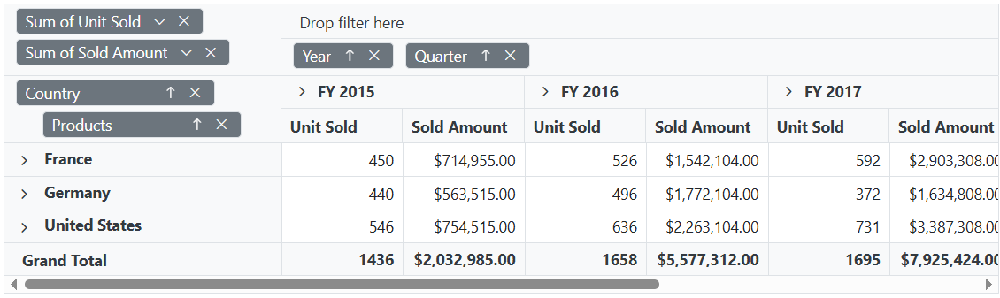

# Grouping Bar in Blazor Pivot Table Component

To have a quick glance about **Grouping Bar** in the Blazor Pivot Table, watch this video:



The Grouping Bar option in the Pivot Table automatically displays fields from the bound data source. It allows users to drag and drop fields between different axes such as columns, rows, values, and filters to create a pivot table at runtime. You can enable it by setting the [ShowGroupingBar](https://help.syncfusion.com/cr/blazor/Syncfusion.Blazor.PivotView.SfPivotView-1.html#Syncfusion_Blazor_PivotView_SfPivotView_1_ShowGroupingBar) property in [SfPivotView](https://help.syncfusion.com/cr/blazor/Syncfusion.Blazor.PivotView.SfPivotView-1.html) class to **true**.

The grouping bar provides intuitive interactions similar to the Field List, making report creation accessible to all users. These interactions include:

* Re-arranging fields through drag-and-drop operations between row, column, value, and filter axes.
* Removing fields from the existing report using the remove icon.
* Adding fields to the report using the fields panel option.
* Filtering members of specific fields using the filter icon.
* Sorting members of specific fields using the sort icon.

```cshtml
@using Syncfusion.Blazor.PivotView

<SfPivotView TValue="ProductDetails" ShowGroupingBar="true">
     <PivotViewDataSourceSettings DataSource="@dataSource">
        <PivotViewColumns>
            <PivotViewColumn Name="Year"></PivotViewColumn>
            <PivotViewColumn Name="Quarter"></PivotViewColumn>
        </PivotViewColumns>
        <PivotViewRows>
            <PivotViewRow Name="Country"></PivotViewRow>
            <PivotViewRow Name="Products"></PivotViewRow>
        </PivotViewRows>
        <PivotViewValues>
            <PivotViewValue Name="Sold" Caption="Units Sold"></PivotViewValue>
            <PivotViewValue Name="Amount" Caption="Sold Amount"></PivotViewValue>
        </PivotViewValues>
        <PivotViewFormatSettings>
            <PivotViewFormatSetting Name="Amount" Format="C"></PivotViewFormatSetting>
        </PivotViewFormatSettings>
    </PivotViewDataSourceSettings>
</SfPivotView>

@code{
    public List<ProductDetails> dataSource { get; set; }
    protected override void OnInitialized()
    {
        this.dataSource = ProductDetails.GetProductData().ToList();
        //Bind the data source collection here. Refer "Assigning sample data to the pivot table" section in getting started for more details.
    }
}

```


## Show or hide fields panel

The fields panel appears above the grouping bar and shows all the fields that are available in the data source but not currently used in the Pivot Table report. Users can drag and drop these fields into the appropriate axes (rows, columns, values, or filters) to build their desired Pivot Table layout. When a field is removed from any axis, it automatically returns to the fields panel for reuse.

To display the fields panel, set the [ShowFieldsPanel](https://help.syncfusion.com/cr/blazor/Syncfusion.Blazor.PivotView.PivotViewGroupingBarSettings.html#Syncfusion_Blazor_PivotView_PivotViewGroupingBarSettings_ShowFieldsPanel) property to **true** within the [PivotViewGroupingBarSettings](https://help.syncfusion.com/cr/blazor/Syncfusion.Blazor.PivotView.PivotViewGroupingBarSettings.html) configuration.

```cshtml
@using Syncfusion.Blazor.PivotView

<SfPivotView TValue="ProductDetails" Height="500" Width="1000" ShowGroupingBar="true">
    <PivotViewDataSourceSettings DataSource="@data">
        <PivotViewColumns>
            <PivotViewColumn Name="Year"></PivotViewColumn>
        </PivotViewColumns>
        <PivotViewRows>
            <PivotViewRow Name="Country"></PivotViewRow>
        </PivotViewRows>
        <PivotViewValues>
            <PivotViewValue Name="Sold" Caption="Units Sold"></PivotViewValue>
        </PivotViewValues>
    </PivotViewDataSourceSettings>
    <PivotViewGroupingBarSettings ShowFieldsPanel="true"></PivotViewGroupingBarSettings>
</SfPivotView>

@code {
    public List<ProductDetails> data { get; set; }
    protected override void OnInitialized()
    {
        this.data = ProductDetails.GetProductData().ToList();
        //Bind the data source collection here. Refer "Assigning sample data to the pivot table" section in getting started for more details.
    }
}
```


## Show or hide all filter icon

The Grouping Bar provides an option to filter members of specific fields during runtime in the Pivot Table. To filter members in a field, click the filter icon next to the field name and select or deselect the members you want to display.

By default, the filter icon appears next to each field in the grouping bar. If you want to hide the filter icon, set the [ShowFilterIcon](https://help.syncfusion.com/cr/blazor/Syncfusion.Blazor.PivotView.PivotViewGroupingBarSettings.html#Syncfusion_Blazor_PivotView_PivotViewGroupingBarSettings_ShowFilterIcon) property to **false** within the [PivotViewGroupingBarSettings](https://help.syncfusion.com/cr/blazor/Syncfusion.Blazor.PivotView.PivotViewGroupingBarSettings.html) configuration.

> By default, the filter icon is enabled in the grouping bar.

```cshtml
@using Syncfusion.Blazor.PivotView

<SfPivotView TValue="ProductDetails" ShowGroupingBar="true">
    <PivotViewDataSourceSettings DataSource="@data">
        <PivotViewColumns>
            <PivotViewColumn Name="Year"></PivotViewColumn>
            <PivotViewColumn Name="Quarter"></PivotViewColumn>
        </PivotViewColumns>
        <PivotViewRows>
            <PivotViewRow Name="Country"></PivotViewRow>
            <PivotViewRow Name="Products"></PivotViewRow>
        </PivotViewRows>
        <PivotViewValues>
            <PivotViewValue Name="Sold" Caption="Units Sold"></PivotViewValue>
            <PivotViewValue Name="Amount" Caption="Sold Amount"></PivotViewValue>
        </PivotViewValues>
        <PivotViewFormatSettings>
            <PivotViewFormatSetting Name="Amount" Format="C"></PivotViewFormatSetting>
        </PivotViewFormatSettings>
    </PivotViewDataSourceSettings>
    <PivotViewGroupingBarSettings ShowFilterIcon="false"></PivotViewGroupingBarSettings>
</SfPivotView>

@code{
    public List<ProductDetails> data { get; set; }
    protected override void OnInitialized()
    {
        this.data = ProductDetails.GetProductData().ToList();
        //Bind the data source collection here. Refer "Assigning sample data to the pivot table" section in getting started for more details.
    }
}
```



## Show or hide specific filter icon

By default, the filter icon appears for all fields in the grouping bar. To hide the filter icon for specific fields, set the [ShowFilterIcon](https://help.syncfusion.com/cr/blazor/Syncfusion.Blazor.PivotView.PivotFieldOptions.html#Syncfusion_Blazor_PivotView_PivotFieldOptions_ShowFilterIcon) property to **false** for those fields in the [PivotViewDataSourceSettings](https://help.syncfusion.com/cr/blazor/Syncfusion.Blazor.PivotView.PivotViewDataSourceSettings-1.html). This lets you control which fields can be filtered, providing a cleaner and more focused user interface.

In the sample below, the filter icons for the "Quarter" and "Products" fields are hidden.

```cshtml
@using Syncfusion.Blazor.PivotView

<SfPivotView TValue="ProductDetails" ShowGroupingBar="true">
    <PivotViewDataSourceSettings DataSource="@data">
        <PivotViewColumns>
            <PivotViewColumn Name="Year"></PivotViewColumn>
            <PivotViewColumn Name="Quarter" ShowFilterIcon="false"></PivotViewColumn>
        </PivotViewColumns>
        <PivotViewRows>
            <PivotViewRow Name="Country"></PivotViewRow>
            <PivotViewRow Name="Products" ShowFilterIcon="false"></PivotViewRow>
        </PivotViewRows>
        <PivotViewValues>
            <PivotViewValue Name="Sold" Caption="Units Sold"></PivotViewValue>
            <PivotViewValue Name="Amount" Caption="Sold Amount"></PivotViewValue>
        </PivotViewValues>
        <PivotViewFormatSettings>
            <PivotViewFormatSetting Name="Amount" Format="C"></PivotViewFormatSetting>
        </PivotViewFormatSettings>
    </PivotViewDataSourceSettings>
</SfPivotView>

@code{
    public List<ProductDetails> data { get; set; }
    protected override void OnInitialized()
    {
        this.data = ProductDetails.GetProductData().ToList();
        //Bind the data source collection here. Refer "Assigning sample data to the pivot table" section in getting started for more details.
    }
}
```


## Show or hide all sort icon

The Grouping Bar provides an option to sort members of a particular field in either ascending or descending order at runtime. To sort a field, click the sort icon next to the field name. To reverse the sort direction, click the same sort icon again. By default, the sort icon is displayed next to each field in the grouping bar, and members are arranged in ascending order.

To disable the sort option, set the [ShowSortIcon](https://help.syncfusion.com/cr/blazor/Syncfusion.Blazor.PivotView.PivotViewGroupingBarSettings.html#Syncfusion_Blazor_PivotView_PivotViewGroupingBarSettings_ShowSortIcon) property to **false** within the [PivotViewGroupingBarSettings](https://help.syncfusion.com/cr/blazor/Syncfusion.Blazor.PivotView.PivotViewGroupingBarSettings.html) configuration.

> By default, the sort icon is enabled in the grouping bar.

```cshtml
@using Syncfusion.Blazor.PivotView

<SfPivotView TValue="ProductDetails" ShowGroupingBar="true">
    <PivotViewDataSourceSettings DataSource="@data">
        <PivotViewColumns>
            <PivotViewColumn Name="Year"></PivotViewColumn>
            <PivotViewColumn Name="Quarter"></PivotViewColumn>
        </PivotViewColumns>
        <PivotViewRows>
            <PivotViewRow Name="Country"></PivotViewRow>
            <PivotViewRow Name="Products"></PivotViewRow>
        </PivotViewRows>
        <PivotViewValues>
            <PivotViewValue Name="Sold" Caption="Units Sold"></PivotViewValue>
            <PivotViewValue Name="Amount" Caption="Sold Amount"></PivotViewValue>
        </PivotViewValues>
        <PivotViewFormatSettings>
            <PivotViewFormatSetting Name="Amount" Format="C"></PivotViewFormatSetting>
        </PivotViewFormatSettings>
    </PivotViewDataSourceSettings>
    <PivotViewGroupingBarSettings ShowSortIcon="false" ></PivotViewGroupingBarSettings>
</SfPivotView>

@code{
    public List<ProductDetails> data { get; set; }
    protected override void OnInitialized()
    {
        this.data = ProductDetails.GetProductData().ToList();
        //Bind the data source collection here. Refer "Assigning sample data to the pivot table" section in getting started for more details.
    }
}

```


## Show or hide specific sort icon

You can choose to show or hide the sort icon for individual fields in the Pivot Table's grouping bar. To hide the sort icon for a particular field, set the [ShowSortIcon](https://help.syncfusion.com/cr/blazor/Syncfusion.Blazor.PivotView.PivotFieldOptions.html#Syncfusion_Blazor_PivotView_PivotFieldOptions_ShowSortIcon) property to **false** for that field in the [PivotViewDataSourceSettings](https://help.syncfusion.com/cr/blazor/Syncfusion.Blazor.PivotView.PivotViewDataSourceSettings-1.html) property.

In the example below, the sort icons for the "Quarter" and "Country" fields are hidden in the grouping bar. This allows users to prevent sorting for these fields while keeping other fields sortable.

```cshtml
@using Syncfusion.Blazor.PivotView

<SfPivotView TValue="ProductDetails" ShowGroupingBar="true">
    <PivotViewDataSourceSettings DataSource="@data">
        <PivotViewColumns>
            <PivotViewColumn Name="Year"></PivotViewColumn>
            <PivotViewColumn Name="Quarter" ShowSortIcon="false"></PivotViewColumn>
        </PivotViewColumns>
        <PivotViewRows>
            <PivotViewRow Name="Country" ShowSortIcon="false"></PivotViewRow>
            <PivotViewRow Name="Products"></PivotViewRow>
        </PivotViewRows>
        <PivotViewValues>
            <PivotViewValue Name="Sold" Caption="Units Sold"></PivotViewValue>
            <PivotViewValue Name="Amount" Caption="Sold Amount"></PivotViewValue>
        </PivotViewValues>
        <PivotViewFormatSettings>
            <PivotViewFormatSetting Name="Amount" Format="C"></PivotViewFormatSetting>
        </PivotViewFormatSettings>
    </PivotViewDataSourceSettings>
</SfPivotView>

@code{
    public List<ProductDetails> data { get; set; }
    protected override void OnInitialized()
    {
        this.data = ProductDetails.GetProductData().ToList();
        //Bind the data source collection here. Refer "Assigning sample data to the pivot table" section in getting started for more details.
    }
}

```


## Show or hide all remove icon

The grouping bar in the Pivot Table lets users remove any field at runtime by clicking the remove icon next to the field. By default, the remove icon is visible beside each field in the grouping bar.

If you want to hide the remove icon, set the [ShowRemoveIcon](https://help.syncfusion.com/cr/blazor/Syncfusion.Blazor.PivotView.PivotViewGroupingBarSettings.html#Syncfusion_Blazor_PivotView_PivotViewGroupingBarSettings_ShowRemoveIcon) property to **false** within the [PivotViewGroupingBarSettings](https://help.syncfusion.com/cr/blazor/Syncfusion.Blazor.PivotView.PivotViewGroupingBarSettings.html) configuration. This will prevent users from removing fields directly from the grouping bar.

> Note: The remove icon is enabled in the grouping bar by default.

```cshtml
@using Syncfusion.Blazor.PivotView

<SfPivotView TValue="ProductDetails" ShowGroupingBar="true">
    <PivotViewDataSourceSettings DataSource="@data">
        <PivotViewColumns>
            <PivotViewColumn Name="Year"></PivotViewColumn>
            <PivotViewColumn Name="Quarter"></PivotViewColumn>
        </PivotViewColumns>
        <PivotViewRows>
            <PivotViewRow Name="Country"></PivotViewRow>
            <PivotViewRow Name="Products"></PivotViewRow>
        </PivotViewRows>
        <PivotViewValues>
            <PivotViewValue Name="Sold" Caption="Units Sold"></PivotViewValue>
            <PivotViewValue Name="Amount" Caption="Sold Amount"></PivotViewValue>
        </PivotViewValues>
        <PivotViewFormatSettings>
            <PivotViewFormatSetting Name="Amount" Format="C"></PivotViewFormatSetting>
        </PivotViewFormatSettings>
    </PivotViewDataSourceSettings>
    <PivotViewGroupingBarSettings ShowRemoveIcon="false"></PivotViewGroupingBarSettings>
</SfPivotView>

@code{
    public List<ProductDetails> data { get; set; }
    protected override void OnInitialized()
    {
        this.data = ProductDetails.GetProductData().ToList();
        //Bind the data source collection here. Refer "Assigning sample data to the pivot table" section in getting started for more details.
    }
}
```


## Show or hide specific remove icon

You can hide the remove icon for an individual field button in the Pivot Table grouping bar. To do this, set the [ShowRemoveIcon](https://help.syncfusion.com/cr/blazor/Syncfusion.Blazor.PivotView.PivotFieldOptions.html#Syncfusion_Blazor_PivotView_PivotFieldOptions_ShowRemoveIcon) property to **false** for the desired field within the [PivotViewDataSourceSettings](https://help.syncfusion.com/cr/blazor/Syncfusion.Blazor.PivotView.PivotViewDataSourceSettings-1.html) options.

In the example below, the remove icon for the "Year", "Sold", and "Products" fields has been hidden. This helps prevent users from accidentally removing those fields while interacting with the Pivot Table.

```cshtml
@using Syncfusion.Blazor.PivotView

<SfPivotView TValue="ProductDetails" ShowGroupingBar="true">
    <PivotViewDataSourceSettings DataSource="@data">
        <PivotViewColumns>
            <PivotViewColumn Name="Year" ShowRemoveIcon="false"></PivotViewColumn>
            <PivotViewColumn Name="Quarter"></PivotViewColumn>
        </PivotViewColumns>
        <PivotViewRows>
            <PivotViewRow Name="Country"></PivotViewRow>
            <PivotViewRow Name="Products" ShowRemoveIcon="false"></PivotViewRow>
        </PivotViewRows>
        <PivotViewValues>
            <PivotViewValue Name="Sold" Caption="Units Sold" ShowRemoveIcon="false"></PivotViewValue>
            <PivotViewValue Name="Amount" Caption="Sold Amount"></PivotViewValue>
        </PivotViewValues>
        <PivotViewFormatSettings>
            <PivotViewFormatSetting Name="Amount" Format="C"></PivotViewFormatSetting>
        </PivotViewFormatSettings>
    </PivotViewDataSourceSettings>
</SfPivotView>

@code{
    public List<ProductDetails> data { get; set; }
    protected override void OnInitialized()
    {
        this.data = ProductDetails.GetProductData().ToList();
        //Bind the data source collection here. Refer "Assigning sample data to the pivot table" section in getting started for more details.
    }
}
```


## Disable all fields from dragging

In the Pivot Table, the grouping bar lets users move fields between the row, column, value, and filter axes to change the report as needed. By default, all fields can be moved using drag-and-drop in the grouping bar. To prevent users from dragging any fields, set the [AllowDragAndDrop](https://help.syncfusion.com/cr/blazor/Syncfusion.Blazor.PivotView.PivotViewGroupingBarSettings.html#Syncfusion_Blazor_PivotView_PivotViewGroupingBarSettings_AllowDragAndDrop) option in [PivotViewGroupingBarSettings](https://help.syncfusion.com/cr/blazor/Syncfusion.Blazor.PivotView.PivotViewGroupingBarSettings.html) to **false**. This will lock the layout of the current report, so users cannot rearrange fields in the grouping bar.

```cshtml
@using Syncfusion.Blazor.PivotView

<SfPivotView TValue="ProductDetails" ShowGroupingBar="true">
    <PivotViewDataSourceSettings DataSource="@data">
        <PivotViewColumns>
            <PivotViewColumn Name="Year"></PivotViewColumn>
            <PivotViewColumn Name="Quarter"></PivotViewColumn>
        </PivotViewColumns>
        <PivotViewRows>
            <PivotViewRow Name="Country"></PivotViewRow>
            <PivotViewRow Name="Products"></PivotViewRow>
        </PivotViewRows>
        <PivotViewValues>
            <PivotViewValue Name="Sold" Caption="Units Sold"></PivotViewValue>
            <PivotViewValue Name="Amount" Caption="Sold Amount"></PivotViewValue>
        </PivotViewValues>
        <PivotViewFormatSettings>
            <PivotViewFormatSetting Name="Amount" Format="C"></PivotViewFormatSetting>
        </PivotViewFormatSettings>
    </PivotViewDataSourceSettings>
    <PivotViewGroupingBarSettings AllowDragAndDrop="false"></PivotViewGroupingBarSettings>
</SfPivotView>

@code{
    public List<ProductDetails> data { get; set; }
    protected override void OnInitialized()
    {
        this.data = ProductDetails.GetProductData().ToList();
        //Bind the data source collection here. Refer "Assigning sample data to the pivot table" section in getting started for more details.
    }
}
```


## Disable specific field from dragging

You can prevent users from dragging certain fields in the grouping bar of the Pivot Table. To do this, set the [AllowDragAndDrop](https://help.syncfusion.com/cr/blazor/Syncfusion.Blazor.PivotView.PivotFieldOptions.html#Syncfusion_Blazor_PivotView_PivotFieldOptions_AllowDragAndDrop) property to **false** for the specific field within the [PivotViewDataSourceSettings](https://help.syncfusion.com/cr/blazor/Syncfusion.Blazor.PivotView.PivotViewDataSourceSettings-1.html).

In the example below, users cannot drag the "Year" and "Products" fields. This setting helps you control which fields can be arranged in the column, row, value, or filter axes at runtime.

```cshtml
@using Syncfusion.Blazor.PivotView

<SfPivotView TValue="ProductDetails" ShowGroupingBar="true">
    <PivotViewDataSourceSettings DataSource="@data">
        <PivotViewColumns>
            <PivotViewColumn Name="Year" AllowDragAndDrop="false"></PivotViewColumn>
            <PivotViewColumn Name="Quarter"></PivotViewColumn>
        </PivotViewColumns>
        <PivotViewRows>
            <PivotViewRow Name="Country"></PivotViewRow>
            <PivotViewRow Name="Products" AllowDragAndDrop="false"></PivotViewRow>
        </PivotViewRows>
        <PivotViewValues>
            <PivotViewValue Name="Sold" Caption="Units Sold"></PivotViewValue>
            <PivotViewValue Name="Amount" Caption="Sold Amount"></PivotViewValue>
        </PivotViewValues>
        <PivotViewFormatSettings>
            <PivotViewFormatSetting Name="Amount" Format="C"></PivotViewFormatSetting>
        </PivotViewFormatSettings>
    </PivotViewDataSourceSettings>
</SfPivotView>

@code{
    public List<ProductDetails> data { get; set; }
    protected override void OnInitialized()
    {
        this.data = ProductDetails.GetProductData().ToList();
        //Bind the data source collection here. Refer "Assigning sample data to the pivot table" section in getting started for more details.
    }
}
```

## Changing aggregation type of value fields at runtime

Users can easily perform calculations on groups of values in the Pivot Table by using the aggregation option. Each value field in the Pivot Table appears in the grouping bar with a dropdown icon next to it. This icon lets users select a different aggregation type, such as Sum, Average, or Count, at runtime. When an aggregation type is selected, the Pivot Table values update immediately to reflect the new calculation.

By default, the icon for setting the aggregation type is visible in the grouping bar. To hide this icon, set the [ShowValueTypeIcon](https://help.syncfusion.com/cr/blazor/Syncfusion.Blazor.PivotView.PivotViewGroupingBarSettings.html#Syncfusion_Blazor_PivotView_PivotViewGroupingBarSettings_ShowValueTypeIcon) property to **false** inside [PivotViewGroupingBarSettings](https://help.syncfusion.com/cr/blazor/Syncfusion.Blazor.PivotView.PivotViewGroupingBarSettings.html). For more details about aggregation options, see the [aggregation](./aggregation) section.

```cshtml
@using Syncfusion.Blazor.PivotView

<SfPivotView TValue="ProductDetails" ShowGroupingBar="true">
    <PivotViewDataSourceSettings DataSource="@data">
        <PivotViewColumns>
            <PivotViewColumn Name="Year"></PivotViewColumn>
            <PivotViewColumn Name="Quarter"></PivotViewColumn>
        </PivotViewColumns>
        <PivotViewRows>
            <PivotViewRow Name="Country"></PivotViewRow>
            <PivotViewRow Name="Products"></PivotViewRow>
        </PivotViewRows>
        <PivotViewValues>
            <PivotViewValue Name="Sold" Caption="Units Sold"></PivotViewValue>
            <PivotViewValue Name="Amount" Caption="Sold Amount"></PivotViewValue>
        </PivotViewValues>
        <PivotViewFormatSettings>
            <PivotViewFormatSetting Name="Amount" Format="C"></PivotViewFormatSetting>
        </PivotViewFormatSettings>
    </PivotViewDataSourceSettings>
    <PivotViewGroupingBarSettings ShowValueTypeIcon="true"></PivotViewGroupingBarSettings>
</SfPivotView>

@code{
    public List<ProductDetails> data { get; set; }
    protected override void OnInitialized()
    {
        this.data = ProductDetails.GetProductData().ToList();
        //Bind the data source collection here. Refer "Assigning sample data to the pivot table" section in getting started for more details.
    }
}
```

<!-- markdownlint-disable MD012 -->

<br/>
<br/>
<br/>


## Show or hide specific dropdown icon

You can hide the dropdown icon for a particular field button in the Pivot Table’s grouping bar. To do this, set the [ShowValueTypeIcon](https://help.syncfusion.com/cr/blazor/Syncfusion.Blazor.PivotView.PivotFieldOptions.html#Syncfusion_Blazor_PivotView_PivotFieldOptions_ShowValueTypeIcon) property to **false** for the desired field within the [PivotViewDataSourceSettings](https://help.syncfusion.com/cr/blazor/Syncfusion.Blazor.PivotView.PivotViewDataSourceSettings-1.html).

In the following example, the dropdown icon for the "Sold" field is hidden:

```cshtml
@using Syncfusion.Blazor.PivotView

<SfPivotView TValue="ProductDetails" ShowGroupingBar="true">
    <PivotViewDataSourceSettings DataSource="@data">
        <PivotViewColumns>
            <PivotViewColumn Name="Year"></PivotViewColumn>
            <PivotViewColumn Name="Quarter"></PivotViewColumn>
        </PivotViewColumns>
        <PivotViewRows>
            <PivotViewRow Name="Country"></PivotViewRow>
            <PivotViewRow Name="Products"></PivotViewRow>
        </PivotViewRows>
        <PivotViewValues>
            <PivotViewValue Name="Sold" Caption="Units Sold" ShowValueTypeIcon="false"></PivotViewValue>
            <PivotViewValue Name="Amount" Caption="Sold Amount"></PivotViewValue>
        </PivotViewValues>
        <PivotViewFormatSettings>
            <PivotViewFormatSetting Name="Amount" Format="C"></PivotViewFormatSetting>
        </PivotViewFormatSettings>
    </PivotViewDataSourceSettings>
</SfPivotView>

@code{
    public List<ProductDetails> data { get; set; }
    protected override void OnInitialized()
    {
        this.data = ProductDetails.GetProductData().ToList();
        //Bind the data source collection here. Refer "Assigning sample data to the pivot table" section in getting started for more details.
    }
}
```


N> The properties [ShowFilterIcon](https://help.syncfusion.com/cr/blazor/Syncfusion.Blazor.PivotView.PivotFieldOptions.html#Syncfusion_Blazor_PivotView_PivotFieldOptions_ShowFilterIcon), [ShowSortIcon](https://help.syncfusion.com/cr/blazor/Syncfusion.Blazor.PivotView.PivotFieldOptions.html#Syncfusion_Blazor_PivotView_PivotFieldOptions_ShowSortIcon), [ShowValueTypeIcon](https://help.syncfusion.com/cr/blazor/Syncfusion.Blazor.PivotView.PivotFieldOptions.html#Syncfusion_Blazor_PivotView_PivotFieldOptions_ShowValueTypeIcon), and [AllowDragAndDrop](https://help.syncfusion.com/cr/blazor/Syncfusion.Blazor.PivotView.PivotFieldOptions.html#Syncfusion_Blazor_PivotView_PivotFieldOptions_AllowDragAndDrop) in fields of [PivotViewDataSourceSettings](https://help.syncfusion.com/cr/blazor/Syncfusion.Blazor.PivotView.PivotViewDataSourceSettings-1.html) are applicable for both grouping bar and field list.

## Events

### OnFieldDropped

The [OnFieldDropped](https://help.syncfusion.com/cr/blazor/Syncfusion.Blazor.PivotView.PivotViewEvents-1.html#Syncfusion_Blazor_PivotView_PivotViewEvents_1_FieldDropped) event in the Pivot Table triggers whenever a user moves and drops a field into a new axis, such as columns, rows, values, or filters. This event provides the following parameters:

- [DataSourceSettings](https://help.syncfusion.com/cr/blazor/Syncfusion.Blazor.PivotView.FieldDroppedEventArgs.html#Syncfusion_Blazor_PivotView_FieldDroppedEventArgs_DataSourceSettings): Defines the current report in the Pivot Table.
- [DroppedAxis](https://help.syncfusion.com/cr/blazor/Syncfusion.Blazor.PivotView.FieldDroppedEventArgs.html#Syncfusion_Blazor_PivotView_FieldDroppedEventArgs_DroppedAxis): Defines the axis where the field has been dropped.
- [DroppedField](https://help.syncfusion.com/cr/blazor/Syncfusion.Blazor.PivotView.FieldDroppedEventArgs.html#Syncfusion_Blazor_PivotView_FieldDroppedEventArgs_DroppedField): Defines the dropped field item.
- [DroppedPosition](https://help.syncfusion.com/cr/blazor/Syncfusion.Blazor.PivotView.FieldDroppedEventArgs.html#Syncfusion_Blazor_PivotView_FieldDroppedEventArgs_DroppedPosition): Defines the position where the field has been dropped.

For example, you can use this event to change the caption of the [DroppedField](https://help.syncfusion.com/cr/blazor/Syncfusion.Blazor.PivotView.FieldDroppedEventArgs.html#Syncfusion_Blazor_PivotView_FieldDroppedEventArgs_DroppedField) instantly at runtime when a user moves a field to a different axis.

```cshtml
@using Syncfusion.Blazor.PivotView

<SfPivotView TValue="ProductDetails" ShowGroupingBar="true">
        <PivotViewDataSourceSettings DataSource="@data">
            <PivotViewColumns>
                <PivotViewColumn Name="Year"></PivotViewColumn>
                <PivotViewColumn Name="Quarter"></PivotViewColumn>
            </PivotViewColumns>
            <PivotViewRows>
                <PivotViewRow Name="Country"></PivotViewRow>
                <PivotViewRow Name="Products"></PivotViewRow>
            </PivotViewRows>
            <PivotViewValues>
                <PivotViewValue Name="Sold" Caption="Units Sold"></PivotViewValue>
                <PivotViewValue Name="Amount" Caption="Sold Amount"></PivotViewValue>
            </PivotViewValues>
            <PivotViewFormatSettings>
                <PivotViewFormatSetting Name="Amount" Format="C"></PivotViewFormatSetting>
            </PivotViewFormatSettings>
        </PivotViewDataSourceSettings>
        <PivotViewEvents TValue="ProductDetails" FieldDropped="Fielddropped"></PivotViewEvents>
</SfPivotView>

@code{
    public List<ProductDetails> data { get; set; }
    protected override void OnInitialized()
    {
        this.data = ProductDetails.GetProductData().ToList();
        //Bind the data source collection here. Refer "Assigning sample data to the pivot table" section in getting started for more details.
    }
    public void Fielddropped(FieldDroppedEventArgs args)
    {
        args.DroppedField.Caption = args.DroppedField.Name + " --> " + args.DroppedAxis;
    }
}

```

### FieldDragStart

The [FieldDragStart](https://help.syncfusion.com/cr/blazor/Syncfusion.Blazor.PivotView.PivotViewEvents-1.html#Syncfusion_Blazor_PivotView_PivotViewEvents_1_FieldDragStart) event is triggered when a field begins to be dragged from its axis in the Pivot Table. Users can use this event to limit or prevent the drag action based on certain conditions. The event provides the following parameters:

- [FieldName](https://help.syncfusion.com/cr/blazor/Syncfusion.Blazor.PivotView.FieldDragStartEventArgs.html#Syncfusion_Blazor_PivotView_FieldDragStartEventArgs_FieldName): This parameter contains the name of the field being dragged.
- [FieldItem](https://help.syncfusion.com/cr/blazor/Syncfusion.Blazor.PivotView.FieldDragStartEventArgs.html#Syncfusion_Blazor_PivotView_FieldDragStartEventArgs_FieldItem): This parameter holds the complete details of the field as described in the [PivotViewDataSourceSettings](https://help.syncfusion.com/cr/blazor/Syncfusion.Blazor.PivotView.PivotViewDataSourceSettings-1.html).
- [Axis](https://help.syncfusion.com/cr/blazor/Syncfusion.Blazor.PivotView.FieldDragStartEventArgs.html#Syncfusion_Blazor_PivotView_FieldDragStartEventArgs_Axis): This specifies the axis (such as columns, rows, values, or filters) from which the field is being dragged.
- [Cancel](https://help.syncfusion.com/cr/blazor/Syncfusion.Blazor.PivotView.FieldDragStartEventArgs.html#Syncfusion_Blazor_PivotView_FieldDragStartEventArgs_Cancel): This boolean property can be set to **true** by the user to prevent the selected field from being dragged.
- [DataSourceSettings](https://help.syncfusion.com/cr/blazor/Syncfusion.Blazor.PivotView.FieldDragStartEventArgs.html#Syncfusion_Blazor_PivotView_FieldDragStartEventArgs_DataSourceSettings): This property returns the current [PivotViewDataSourceSettings](https://help.syncfusion.com/cr/blazor/Syncfusion.Blazor.PivotView.PivotViewDataSourceSettings-1.html) used in the Pivot Table.

In the following example, the drag action is prevented only for fields placed in the rows axis. Users will not be able to drag fields from the rows axis, but can still drag fields from other axes.

```cshtml
@using Syncfusion.Blazor.PivotView

<SfPivotView TValue="ProductDetails" ShowGroupingBar="true">
        <PivotViewDataSourceSettings DataSource="@data">
            <PivotViewColumns>
                <PivotViewColumn Name="Year"></PivotViewColumn>
                <PivotViewColumn Name="Quarter"></PivotViewColumn>
            </PivotViewColumns>
            <PivotViewRows>
                <PivotViewRow Name="Country"></PivotViewRow>
                <PivotViewRow Name="Products"></PivotViewRow>
            </PivotViewRows>
            <PivotViewValues>
                <PivotViewValue Name="Sold" Caption="Units Sold"></PivotViewValue>
                <PivotViewValue Name="Amount" Caption="Sold Amount"></PivotViewValue>
            </PivotViewValues>
            <PivotViewFormatSettings>
                <PivotViewFormatSetting Name="Amount" Format="C"></PivotViewFormatSetting>
            </PivotViewFormatSettings>
        </PivotViewDataSourceSettings>
        <PivotViewEvents TValue="ProductDetails" FieldDragStart="FieldDragStart"></PivotViewEvents>
</SfPivotView>

@code{
    public List<ProductDetails> data { get; set; }
    protected override void OnInitialized()
    {
        this.data = ProductDetails.GetProductData().ToList();
        //Bind the data source collection here. Refer "Assigning sample data to the pivot table" section in getting started for more details.
    }
    public void FieldDragStart(FieldDragStartEventArgs args)
    {
        if(args.Axis == "rows") {
            args.Cancel = true;
        }
    }
}

```

### FieldDrop

The [FieldDrop](https://help.syncfusion.com/cr/blazor/Syncfusion.Blazor.PivotView.PivotViewEvents-1.html#Syncfusion_Blazor_PivotView_PivotViewEvents_1_FieldDrop) event is triggered whenever a user drags and drops a field into a different axis in the Pivot Table. This event helps users control whether a field should be allowed to move to a new axis by using the event’s parameters. The event provides the following information:

- [FieldName](https://help.syncfusion.com/cr/blazor/Syncfusion.Blazor.PivotView.FieldDropEventArgs.html#Syncfusion_Blazor_PivotView_FieldDropEventArgs_FieldName): The name of the field being moved.
- [DraggedAxis](https://help.syncfusion.com/cr/blazor/Syncfusion.Blazor.PivotView.FieldDropEventArgs.html#Syncfusion_Blazor_PivotView_FieldDropEventArgs_DraggedAxis): The axis where the user started dragging the field.
- [DropAxis](https://help.syncfusion.com/cr/blazor/Syncfusion.Blazor.PivotView.FieldDropEventArgs.html#Syncfusion_Blazor_PivotView_FieldDropEventArgs_DropAxis): The axis where the field is dropped.
- [DropPosition](https://help.syncfusion.com/cr/blazor/Syncfusion.Blazor.PivotView.FieldDropEventArgs.html#Syncfusion_Blazor_PivotView_FieldDropEventArgs_DropPosition): The position where the field is dropped among the fields in the target axis.
- [DropField](https://help.syncfusion.com/cr/blazor/Syncfusion.Blazor.PivotView.FieldDropEventArgs.html#Syncfusion_Blazor_PivotView_FieldDropEventArgs_DropField): The complete definition of the field as defined in the [PivotViewDataSourceSettings](https://help.syncfusion.com/cr/blazor/Syncfusion.Blazor.PivotView.PivotViewDataSourceSettings-1.html).
- [DataSourceSettings](https://help.syncfusion.com/cr/blazor/Syncfusion.Blazor.PivotView.FieldDropEventArgs.html#Syncfusion_Blazor_PivotView_FieldDropEventArgs_DataSourceSettings): The entire configuration of the Pivot Table’s data source.
- [Cancel](https://help.syncfusion.com/cr/blazor/Syncfusion.Blazor.PivotView.FieldDropEventArgs.html#Syncfusion_Blazor_PivotView_FieldDropEventArgs_Cancel): A boolean value. If set to **true**, this stops the field from being dropped into the axis.

In the example below, dropping any field into the "Values" axis is prevented. This is managed by setting the `Cancel` parameter to **true** when a field is dropped onto the "Values" axis.

```cshtml
@using Syncfusion.Blazor.PivotView

<SfPivotView TValue="ProductDetails" ShowGroupingBar="true">
        <PivotViewDataSourceSettings DataSource="@data">
            <PivotViewColumns>
                <PivotViewColumn Name="Year"></PivotViewColumn>
                <PivotViewColumn Name="Quarter"></PivotViewColumn>
            </PivotViewColumns>
            <PivotViewRows>
                <PivotViewRow Name="Country"></PivotViewRow>
                <PivotViewRow Name="Products"></PivotViewRow>
            </PivotViewRows>
            <PivotViewValues>
                <PivotViewValue Name="Sold" Caption="Units Sold"></PivotViewValue>
                <PivotViewValue Name="Amount" Caption="Sold Amount"></PivotViewValue>
            </PivotViewValues>
            <PivotViewFormatSettings>
                <PivotViewFormatSetting Name="Amount" Format="C"></PivotViewFormatSetting>
            </PivotViewFormatSettings>
        </PivotViewDataSourceSettings>
        <PivotViewEvents TValue="ProductDetails" FieldDrop="FieldDrop"></PivotViewEvents>
</SfPivotView>

@code{
    public List<ProductDetails> data { get; set; }
    protected override void OnInitialized()
    {
        this.data = ProductDetails.GetProductData().ToList();
        //Bind the data source collection here. Refer "Assigning sample data to the pivot table" section in getting started for more details.
    }
    public void FieldDrop(FieldDropEventArgs args)
    {
        if(args.DropAxis == "values") {
            args.Cancel = true;
        }
    }
}

```

### FieldRemove

The [FieldRemove](https://help.syncfusion.com/cr/blazor/Syncfusion.Blazor.PivotView.PivotViewEvents-1.html#Syncfusion_Blazor_PivotView_PivotViewEvents_1_FieldRemove) event occurs when a user tries to remove a field from an axis in the Pivot Table. This event can be used to control whether a field should be removed, based on specific conditions.

The event provides the following parameters:

- [FieldName](https://help.syncfusion.com/cr/blazor/Syncfusion.Blazor.PivotView.FieldRemoveEventArgs.html#Syncfusion_Blazor_PivotView_FieldRemoveEventArgs_FieldName): The name of the field that the user wants to remove.
- [FieldItem](https://help.syncfusion.com/cr/blazor/Syncfusion.Blazor.PivotView.FieldRemoveEventArgs.html#Syncfusion_Blazor_PivotView_FieldRemoveEventArgs_FieldItem): The full definition of the field as specified in the [PivotViewDataSourceSettings](https://help.syncfusion.com/cr/blazor/Syncfusion.Blazor.PivotView.PivotViewDataSourceSettings-1.html).
- [Axis](https://help.syncfusion.com/cr/blazor/Syncfusion.Blazor.PivotView.FieldRemoveEventArgs.html#Syncfusion_Blazor_PivotView_FieldRemoveEventArgs_Axis): The name of the axis (row, column, value, or filter) from which the field will be removed.
- [DataSourceSettings](https://help.syncfusion.com/cr/blazor/Syncfusion.Blazor.PivotView.FieldRemoveEventArgs.html#Syncfusion_Blazor_PivotView_FieldRemoveEventArgs_DataSourceSettings): The complete configuration of the Pivot Table data source.
- [Cancel](https://help.syncfusion.com/cr/blazor/Syncfusion.Blazor.PivotView.FieldRemoveEventArgs.html#Syncfusion_Blazor_PivotView_FieldRemoveEventArgs_Cancel): A boolean property; set this to **true** to prevent the field from being removed.

In the following example, the field "Country" cannot be removed from the report by any UI action. This is achieved by handling the [FieldRemove](https://help.syncfusion.com/cr/blazor/Syncfusion.Blazor.PivotView.PivotViewEvents-1.html#Syncfusion_Blazor_PivotView_PivotViewEvents_1_FieldRemove) event and setting the `Cancel` property to **true** if the field name matches "Country".

```cshtml
@using Syncfusion.Blazor.PivotView

<SfPivotView TValue="ProductDetails" ShowGroupingBar="true">
        <PivotViewDataSourceSettings DataSource="@data">
            <PivotViewColumns>
                <PivotViewColumn Name="Year"></PivotViewColumn>
                <PivotViewColumn Name="Quarter"></PivotViewColumn>
            </PivotViewColumns>
            <PivotViewRows>
                <PivotViewRow Name="Country"></PivotViewRow>
                <PivotViewRow Name="Products"></PivotViewRow>
            </PivotViewRows>
            <PivotViewValues>
                <PivotViewValue Name="Sold" Caption="Units Sold"></PivotViewValue>
                <PivotViewValue Name="Amount" Caption="Sold Amount"></PivotViewValue>
            </PivotViewValues>
            <PivotViewFormatSettings>
                <PivotViewFormatSetting Name="Amount" Format="C"></PivotViewFormatSetting>
            </PivotViewFormatSettings>
        </PivotViewDataSourceSettings>
        <PivotViewEvents TValue="ProductDetails" FieldRemove="FieldRemove"></PivotViewEvents>
</SfPivotView>

@code{
    public List<ProductDetails> data { get; set; }
    protected override void OnInitialized()
    {
        this.data = ProductDetails.GetProductData().ToList();
        //Bind the data source collection here. Refer "Assigning sample data to the pivot table" section in getting started for more details.
    }
    public void FieldRemove(FieldRemoveEventArgs args)
    {
        if(args.FieldName == "Country") {
            args.Cancel = true;
        }
    }
}

```

### AggregateMenuOpen

The [AggregateMenuOpen](https://help.syncfusion.com/cr/blazor/Syncfusion.Blazor.PivotView.PivotViewEvents-1.html#Syncfusion_Blazor_PivotView_PivotViewEvents_1_AggregateMenuOpen) event is triggered when a user clicks the dropdown icon in a value field button in the Pivot Table’s grouping bar. This event allows users to control which aggregation types appear in the dropdown menu.

The event provides the following parameters:

- [FieldName](https://help.syncfusion.com/cr/blazor/Syncfusion.Blazor.PivotView.AggregateMenuOpenEventArgs.html#Syncfusion_Blazor_PivotView_AggregateMenuOpenEventArgs_FieldName): The name of the field for which the aggregation menu is opened.
- [AggregateTypes](https://help.syncfusion.com/cr/blazor/Syncfusion.Blazor.PivotView.AggregateMenuOpenEventArgs.html#Syncfusion_Blazor_PivotView_AggregateMenuOpenEventArgs_AggregateTypes): The list of aggregation types available for the selected field.
- [Cancel](https://help.syncfusion.com/cr/blazor/Syncfusion.Blazor.PivotView.AggregateMenuOpenEventArgs.html#Syncfusion_Blazor_PivotView_AggregateMenuOpenEventArgs_Cancel): A boolean that, when set to true, prevents the dropdown menu from opening.

In the following sample, the dropdown menu for the "Amount" field is customized to show specific aggregation types.

```cshtml
@using Syncfusion.Blazor.PivotView

<SfPivotView TValue="ProductDetails" ShowGroupingBar="true">
        <PivotViewDataSourceSettings DataSource="@data">
            <PivotViewColumns>
                <PivotViewColumn Name="Year"></PivotViewColumn>
                <PivotViewColumn Name="Quarter"></PivotViewColumn>
            </PivotViewColumns>
            <PivotViewRows>
                <PivotViewRow Name="Country"></PivotViewRow>
                <PivotViewRow Name="Products"></PivotViewRow>
            </PivotViewRows>
            <PivotViewValues>
                <PivotViewValue Name="Sold" Caption="Units Sold"></PivotViewValue>
                <PivotViewValue Name="Amount" Caption="Sold Amount"></PivotViewValue>
            </PivotViewValues>
            <PivotViewFormatSettings>
                <PivotViewFormatSetting Name="Amount" Format="C"></PivotViewFormatSetting>
            </PivotViewFormatSettings>
        </PivotViewDataSourceSettings>
        <PivotViewEvents TValue="ProductDetails" AggregateMenuOpen="AggregateMenuOpen"></PivotViewEvents>
</SfPivotView>

@code{
    public List<ProductDetails> data { get; set; }
    protected override void OnInitialized()
    {
        this.data = ProductDetails.GetProductData().ToList();
        //Bind the data source collection here. Refer "Assigning sample data to the pivot table" section in getting started for more details.
    }
    public void AggregateMenuOpen(AggregateMenuOpenEventArgs args)
    {
        if (args.FieldName == "Amount")
        {
            args.AggregateTypes = new List<SummaryTypes> { SummaryTypes.Sum, SummaryTypes.Avg, SummaryTypes.Max };
        }
    }
}

```

N> The events [FieldRemove](https://help.syncfusion.com/cr/blazor/Syncfusion.Blazor.PivotView.PivotViewEvents-1.html#Syncfusion_Blazor_PivotView_PivotViewEvents_1_FieldRemove), [FieldDrop](https://help.syncfusion.com/cr/blazor/Syncfusion.Blazor.PivotView.PivotViewEvents-1.html#Syncfusion_Blazor_PivotView_PivotViewEvents_1_FieldDrop), [FieldDragStart](https://help.syncfusion.com/cr/blazor/Syncfusion.Blazor.PivotView.PivotViewEvents-1.html#Syncfusion_Blazor_PivotView_PivotViewEvents_1_FieldDragStart), [OnFieldDropped](https://help.syncfusion.com/cr/blazor/Syncfusion.Blazor.PivotView.PivotViewEvents-1.html#Syncfusion_Blazor_PivotView_PivotViewEvents_1_FieldDropped), and [AggregateMenuOpen](https://help.syncfusion.com/cr/blazor/Syncfusion.Blazor.PivotView.PivotViewEvents-1.html#Syncfusion_Blazor_PivotView_PivotViewEvents_1_AggregateMenuOpen) are applicable for both grouping bar and field list.

### OnActionBegin

The [OnActionBegin](https://help.syncfusion.com/cr/blazor/Syncfusion.Blazor.PivotView.PivotViewEvents-1.html#Syncfusion_Blazor_PivotView_PivotViewEvents_1_OnActionBegin) event occurs whenever an action begins in the grouping bar of the Pivot Table. These actions include sorting, filtering, changing aggregation, removing fields, or editing a calculated field using the grouping bar UI. This event helps the user identify and manage what is happening in real time. The event provides several helpful parameters:

- [DataSourceSettings](https://help.syncfusion.com/cr/blazor/Syncfusion.Blazor.PivotView.PivotActionBeginEventArgs.html#Syncfusion_Blazor_PivotView_PivotActionBeginEventArgs_DataSourceSettings): This provides the current report settings, which include the input data, row fields, column fields, values, filters, formatting settings, and more.
- [ActionName](https://help.syncfusion.com/cr/blazor/Syncfusion.Blazor.PivotView.PivotActionBeginEventArgs.html#Syncfusion_Blazor_PivotView_PivotActionBeginEventArgs_ActionName): This contains the name of the action that has started. The most common actions and their respective names are:

  | Action                                 | Action Name         |
  |-----------------------------------------|---------------------|
  | Clicking the sort icon                  | Sort field          |
  | Using the filter icon                   | Filter field        |
  | Selecting aggregation in the drop-down  | Aggregate field     |
  | Clicking the remove icon                | Remove field        |
  | Clicking the edit icon                  | Edit calculated field|

- [FieldInfo](https://help.syncfusion.com/cr/blazor/Syncfusion.Blazor.PivotView.PivotActionBeginEventArgs.html#Syncfusion_Blazor_PivotView_PivotActionBeginEventArgs_FieldInfo): This provides information about the selected field on which the action is performed.

N> This option applies only to actions performed through the field-based UI, such as filtering, sorting, removing a field from the grouping bar, editing, and changing the aggregation type.

- [Cancel](https://help.syncfusion.com/cr/blazor/Syncfusion.Blazor.PivotView.PivotActionBeginEventArgs.html#Syncfusion_Blazor_PivotView_PivotActionBeginEventArgs_Cancel): Set this property to **true** within the event to prevent the current action from being completed.

In the example below, users can restrict actions like sorting or filtering from the grouping bar by setting `args.Cancel` to **true** within the [OnActionBegin](https://help.syncfusion.com/cr/blazor/Syncfusion.Blazor.PivotView.PivotViewEvents-1.html#Syncfusion_Blazor_PivotView_PivotViewEvents_1_OnActionBegin) event.

```cshtml
@using Syncfusion.Blazor.PivotView

<SfPivotView TValue="ProductDetails" ShowFieldList="true" ShowGroupingBar="true">
     <PivotViewDataSourceSettings DataSource="@data">
        <PivotViewColumns>
            <PivotViewColumn Name="Year"></PivotViewColumn>
            <PivotViewColumn Name="Quarter"></PivotViewColumn>
        </PivotViewColumns>
        <PivotViewRows>
            <PivotViewRow Name="Country"></PivotViewRow>
            <PivotViewRow Name="Products"></PivotViewRow>
        </PivotViewRows>
        <PivotViewValues>
            <PivotViewValue Name="Sold" Caption="Units Sold"></PivotViewValue>
            <PivotViewValue Name="Amount" Caption="Sold Amount"></PivotViewValue>
        </PivotViewValues>
        <PivotViewFormatSettings>
            <PivotViewFormatSetting Name="Amount" Format="C"></PivotViewFormatSetting>
        </PivotViewFormatSettings>
    </PivotViewDataSourceSettings>    
   <PivotViewEvents TValue="ProductDetails" OnActionBegin="ActionBegin"></PivotViewEvents>
</SfPivotView>

@code{
    private List<ProductDetails> data { get; set; }
    protected override void OnInitialized()
    {
        data = ProductDetails.GetProductData().ToList();
        //Bind the data source collection here. Refer "Assigning sample data to the pivot table" section in getting started for more details.
    }

    // Triggers when the UI action begins.
    public void ActionBegin(PivotActionBeginEventArgs args)
    {
        if(args.ActionName == "Sort field" || args.ActionName == "Filter field")
        {
          args.Cancel = true;
        }
    }

}
```

### OnActionComplete

The [OnActionComplete](https://help.syncfusion.com/cr/blazor/Syncfusion.Blazor.PivotView.PivotViewEvents-1.html#Syncfusion_Blazor_PivotView_PivotViewEvents_1_OnActionComplete) event in the Pivot Table is triggered whenever a user completes a UI action in the grouping bar, such as sorting, filtering, changing the aggregation type, editing a calculated field, or removing a field. This event helps users track the specific interaction that has just been finished, supporting a smooth workflow within the Pivot Table.

The event provides the following parameters:

- [DataSourceSettings](https://help.syncfusion.com/cr/blazor/Syncfusion.Blazor.PivotView.PivotActionCompleteEventArgs-1.html#Syncfusion_Blazor_PivotView_PivotActionCompleteEventArgs_1_DataSourceSettings): Contains the current report settings, including information about the input data, rows, columns, values, filters, and format settings used in the Pivot Table.
- [ActionName](https://help.syncfusion.com/cr/blazor/Syncfusion.Blazor.PivotView.PivotActionCompleteEventArgs-1.html#Syncfusion_Blazor_PivotView_PivotActionCompleteEventArgs_1_ActionName): Specifies the name of the action just completed. The table below lists possible UI actions and their corresponding action names:

  | Action                                          | Action Name               |
  |-------------------------------------------------|--------------------------|
  | Sort icon clicked                               | Field sorted             |
  | Filter icon clicked                             | Field filtered           |
  | Aggregation changed (using value type dropdown) | Field aggregated         |
  | Remove icon clicked                             | Field removed            |
  | Edit icon (calculated field) clicked            | Calculated field edited  |

- [FieldInfo](https://help.syncfusion.com/cr/blazor/Syncfusion.Blazor.PivotView.PivotActionCompleteEventArgs-1.html#Syncfusion_Blazor_PivotView_PivotActionCompleteEventArgs_1_FieldInfo): Provides information about the field selected during the action.

N> The [FieldInfo](https://help.syncfusion.com/cr/blazor/Syncfusion.Blazor.PivotView.PivotActionCompleteEventArgs-1.html#Syncfusion_Blazor_PivotView_PivotActionCompleteEventArgs_1_FieldInfo) parameter is provided only for actions related to sorting, filtering, aggregation changes, removing a field, or editing a calculated field using the grouping bar.

- [ActionInfo](https://help.syncfusion.com/cr/blazor/Syncfusion.Blazor.PivotView.PivotActionCompleteEventArgs-1.html#Syncfusion_Blazor_PivotView_PivotActionCompleteEventArgs_1_ActionInfo): Supplies detailed information about the UI action. For example, when sorting is finished, this parameter includes the sort order and the name of the field involved.

```cshtml
@using Syncfusion.Blazor.PivotView

<SfPivotView TValue="ProductDetails" ShowFieldList="true" ShowGroupingBar="true">
     <PivotViewDataSourceSettings DataSource="@data">
        <PivotViewColumns>
            <PivotViewColumn Name="Year"></PivotViewColumn>
            <PivotViewColumn Name="Quarter"></PivotViewColumn>
        </PivotViewColumns>
        <PivotViewRows>
            <PivotViewRow Name="Country"></PivotViewRow>
            <PivotViewRow Name="Products"></PivotViewRow>
        </PivotViewRows>
        <PivotViewValues>
            <PivotViewValue Name="Sold" Caption="Units Sold"></PivotViewValue>
            <PivotViewValue Name="Amount" Caption="Sold Amount"></PivotViewValue>
        </PivotViewValues>
        <PivotViewFormatSettings>
            <PivotViewFormatSetting Name="Amount" Format="C"></PivotViewFormatSetting>
        </PivotViewFormatSettings>
    </PivotViewDataSourceSettings>    
   <PivotViewEvents TValue="ProductDetails" OnActionComplete="ActionComplete"></PivotViewEvents>
</SfPivotView>

@code{
    private List<ProductDetails> data { get; set; }
    protected override void OnInitialized()
    {
        data = ProductDetails.GetProductData().ToList();
        //Bind the data source collection here. Refer "Assigning sample data to the pivot table" section in getting started for more details.
    }
    public void ActionComplete(PivotActionCompleteEventArgs<ProductDetails> args)
    {
        if(args.ActionName == "Field filtered" || args.ActionName == "Field sorted")
        {
          // Triggers when the grouping bar UI actions such as sorting and filtering are completed.
        }       
    }

}
```

### OnActionFailure

The [OnActionFailure](https://help.syncfusion.com/cr/blazor/Syncfusion.Blazor.PivotView.PivotViewEvents-1.html#Syncfusion_Blazor_PivotView_PivotViewEvents_1_OnActionFailure) event occurs when a user action in the Pivot Table does not complete as expected. This event helps users understand what went wrong during interactions with the grouping bar.

**Event Parameters**

- [ActionName](https://help.syncfusion.com/cr/blazor/Syncfusion.Blazor.PivotView.PivotActionFailureEventArgs.html#Syncfusion_Blazor_PivotView_PivotActionFailureEventArgs_ActionName): Identifies which user action did not succeed. The table below lists the actions and their corresponding names:

  | Action                                                | Action Name         |
  |-------------------------------------------------------|---------------------|
  | Clicking the sort icon                                | Sort field          |
  | Applying a filter using the filter icon               | Filter field        |
  | Choosing a value type from the aggregation dropdown   | Aggregate field     |
  | Removing a field by clicking the remove icon          | Remove field        |
  | Editing a calculated field using the edit icon        | Edit calculated field|

- [ErrorInfo](https://help.syncfusion.com/cr/blazor/Syncfusion.Blazor.PivotView.PivotActionFailureEventArgs.html#Syncfusion_Blazor_PivotView_PivotActionFailureEventArgs_ErrorInfo): Provides details about the error that occurred for the specific user action.

When this event is triggered, users can refer to the information in these parameters to identify the action that failed and the reason for the failure. This helps users correct issues with actions such as sorting, filtering, aggregating, removing, or editing fields in the Pivot Table's grouping bar.

```cshtml
@using Syncfusion.Blazor.PivotView

<SfPivotView TValue="ProductDetails" AllowExcelExport="true" AllowPdfExport="true" Width="100%"  ShowToolbar="true" Toolbar="@toolbar" ShowGroupingBar="true" AllowCalculatedField="true"  AllowDrillThrough="true" AllowConditionalFormatting="true" AllowNumberFormatting="true" ShowFieldList="true" Height="350">
     <PivotViewDataSourceSettings DataSource="@data">
        <PivotViewColumns>
            <PivotViewColumn Name="Year"></PivotViewColumn>
            <PivotViewColumn Name="Quarter"></PivotViewColumn>
        </PivotViewColumns>
        <PivotViewRows>
            <PivotViewRow Name="Country"></PivotViewRow>
            <PivotViewRow Name="Products"></PivotViewRow>
        </PivotViewRows>
        <PivotViewValues>
            <PivotViewValue Name="Sold" Caption="Units Sold"></PivotViewValue>
            <PivotViewValue Name="Amount" Caption="Sold Amount"></PivotViewValue>
        </PivotViewValues>
        <PivotViewFormatSettings>
            <PivotViewFormatSetting Name="Amount" Format="C"></PivotViewFormatSetting>
        </PivotViewFormatSettings>
    </PivotViewDataSourceSettings>    
   <PivotViewEvents TValue="ProductDetails" OnActionFailure="ActionFailure"></PivotViewEvents>
</SfPivotView>

@code{
    private List<ProductDetails> data { get; set; }
    private List<Syncfusion.Blazor.PivotView.ToolbarItems> toolbar = new List<Syncfusion.Blazor.PivotView.ToolbarItems> {
        ToolbarItems.New,
        ToolbarItems.Save,
        ToolbarItems.Grid,
        ToolbarItems.Chart,
        ToolbarItems.Export,
        ToolbarItems.SubTotal,
        ToolbarItems.GrandTotal,
        ToolbarItems.ConditionalFormatting,
        ToolbarItems.NumberFormatting,
        ToolbarItems.FieldList            
    };
    protected override void OnInitialized()
    {
        data = ProductDetails.GetProductData().ToList();
        //Bind the data source collection here. Refer "Assigning sample data to the pivot table" section in getting started for more details.
    }
    public void ActionFailure(PivotActionFailureEventArgs args)
    {
        if(args.ActionName == "Filter field" || args.ActionName == "Sort field")
        {
          // Triggers when the current UI action fails to achieve the desired result.
        }       
    }
}
```

N> Refer to the [Blazor Pivot Table](https://www.syncfusion.com/blazor-components/blazor-pivot-table) feature tour page for its groundbreaking feature representations. You can also explore the [Blazor Pivot Table example](https://blazor.syncfusion.com/demos/pivot-table/default-functionalities?theme=bootstrap5) to know how to render and configure the pivot table.