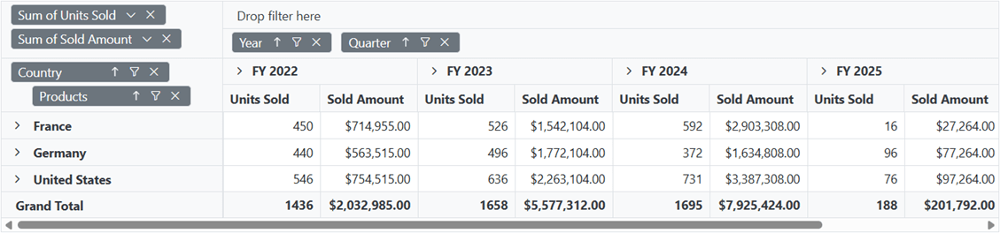
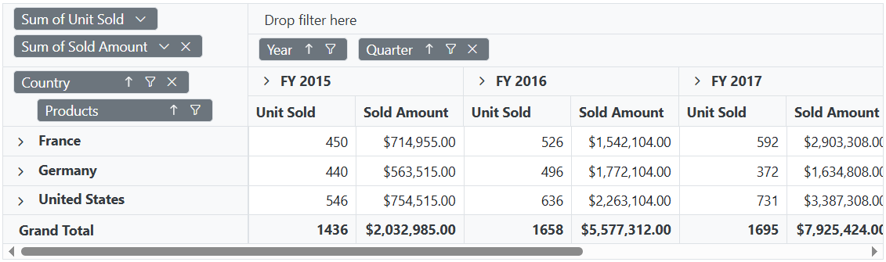
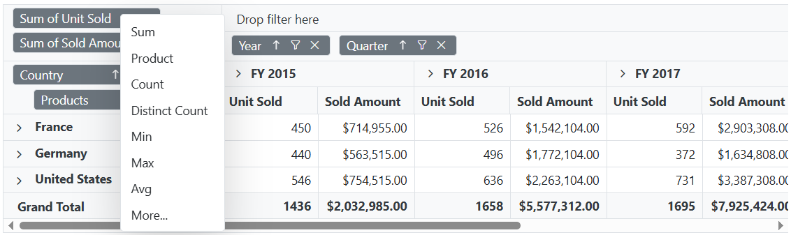

# Grouping Bar in Blazor Pivot Table Component

To have a quick glance about **Grouping Bar** in the Blazor Pivot Table, watch this video:



The Grouping Bar option in pivot table automatically populates fields from the bound data source and allows end users to drag fields between different axes such as columns, rows, values, and filters, and create pivot table at runtime. It can be enabled by setting the [ShowGroupingBar](https://help.syncfusion.com/cr/blazor/Syncfusion.Blazor.PivotView.SfPivotView-1.html#Syncfusion_Blazor_PivotView_SfPivotView_1_ShowGroupingBar) property in [SfPivotView](https://help.syncfusion.com/cr/blazor/Syncfusion.Blazor.PivotView.SfPivotView-1.html) class to **true**.

Similar to Field List, Grouping Bar UI also comes with basic interactions like,

* Re-arranging fields through drag-and-drop operation between row, column, value and filter axes.
* Remove fields from the existing report using remove icon.
* Add fields to the report using fields panel option.
* Filtering members of specific fields using filter icon.
* Sorting members of specific fields using sort icon.

 ```cshtml
@using Syncfusion.Blazor.PivotView

<SfPivotView TValue="ProductDetails" ShowGroupingBar="true">
     <PivotViewDataSourceSettings DataSource="@dataSource">
        <PivotViewColumns>
            <PivotViewColumn Name="Year"></PivotViewColumn>
            <PivotViewColumn Name="Quarter"></PivotViewColumn>
        </PivotViewColumns>
        <PivotViewRows>
            <PivotViewRow Name="Country"></PivotViewRow>
            <PivotViewRow Name="Products"></PivotViewRow>
        </PivotViewRows>
        <PivotViewValues>
            <PivotViewValue Name="Sold" Caption="Units Sold"></PivotViewValue>
            <PivotViewValue Name="Amount" Caption="Sold Amount"></PivotViewValue>
        </PivotViewValues>
        <PivotViewFormatSettings>
            <PivotViewFormatSetting Name="Amount" Format="C"></PivotViewFormatSetting>
        </PivotViewFormatSettings>
    </PivotViewDataSourceSettings>
</SfPivotView>

@code{
    public List<ProductDetails> dataSource { get; set; }
    protected override void OnInitialized()
    {
        this.dataSource = ProductDetails.GetProductData().ToList();
        //Bind the data source collection here. Refer "Assigning sample data to the pivot table" section in getting started for more details.
    }
}

```



## Show or hide fields panel

The fields panel which is positioned above the grouping bar, displays the fields that are available in the data source but are not bound in the report. The fields can be dragged and dropped into the appropriate axis. In addition, any field removed from any axes will be automatically added to the fields panel. The fields panel can be displayed by setting the [ShowFieldsPanel](https://help.syncfusion.com/cr/blazor/Syncfusion.Blazor.PivotView.PivotViewGroupingBarSettings.html#Syncfusion_Blazor_PivotView_PivotViewGroupingBarSettings_ShowFieldsPanel) property in the [PivotViewGroupingBarSettings](https://help.syncfusion.com/cr/blazor/Syncfusion.Blazor.PivotView.PivotViewGroupingBarSettings.html) to **true**.

```cshtml
@using Syncfusion.Blazor.PivotView

<SfPivotView TValue="ProductDetails" Height="500" Width="1000" ShowGroupingBar="true">
	<PivotViewDataSourceSettings DataSource="@data">
		<PivotViewColumns>
			<PivotViewColumn Name="Year"></PivotViewColumn>
		</PivotViewColumns>
		<PivotViewRows>
			<PivotViewRow Name="Country"></PivotViewRow>
		</PivotViewRows>
		<PivotViewValues>
			<PivotViewValue Name="Sold" Caption="Units Sold"></PivotViewValue>
		</PivotViewValues>
	</PivotViewDataSourceSettings>
	<PivotViewGroupingBarSettings ShowFieldsPanel="true"></PivotViewGroupingBarSettings>
</SfPivotView>

@code {
	public List<ProductDetails> data { get; set; }
	protected override void OnInitialized()
	{
		this.data = ProductDetails.GetProductData().ToList();
		//Bind the data source collection here. Refer "Assigning sample data to the pivot table" section in getting started for more details.
	}
}
```


## Show or hide all filter icon

The Grouping Bar has an option to filter members of particular fields at runtime in pivot table. In-order to filter members in a field, click the filter icon and check/uncheck members that needs to be displayed. By default, filter icon besides each field is enabled in the grouping bar. To disable the filter icon, set the property [ShowFilterIcon](https://help.syncfusion.com/cr/blazor/Syncfusion.Blazor.PivotView.PivotViewGroupingBarSettings.html#Syncfusion_Blazor_PivotView_PivotViewGroupingBarSettings_ShowFilterIcon) in [PivotViewGroupingBarSettings](https://help.syncfusion.com/cr/blazor/Syncfusion.Blazor.PivotView.PivotViewGroupingBarSettings.html) class to **false**.

```cshtml
@using Syncfusion.Blazor.PivotView

<SfPivotView TValue="ProductDetails" ShowGroupingBar="true">
    <PivotViewDataSourceSettings DataSource="@data">
        <PivotViewColumns>
            <PivotViewColumn Name="Year"></PivotViewColumn>
            <PivotViewColumn Name="Quarter"></PivotViewColumn>
        </PivotViewColumns>
        <PivotViewRows>
            <PivotViewRow Name="Country"></PivotViewRow>
            <PivotViewRow Name="Products"></PivotViewRow>
        </PivotViewRows>
        <PivotViewValues>
            <PivotViewValue Name="Sold" Caption="Unit Sold"></PivotViewValue>
            <PivotViewValue Name="Amount" Caption="Sold Amount"></PivotViewValue>
        </PivotViewValues>
        <PivotViewFormatSettings>
            <PivotViewFormatSetting Name="Amount" Format="C"></PivotViewFormatSetting>
        </PivotViewFormatSettings>
    </PivotViewDataSourceSettings>
    <PivotViewGroupingBarSettings ShowFilterIcon="false"></PivotViewGroupingBarSettings>
</SfPivotView>

@code{
    public List<ProductDetails> data { get; set; }
    protected override void OnInitialized()
    {
        this.data = ProductDetails.GetProductData().ToList();
        //Bind the data source collection here. Refer "Assigning sample data to the pivot table" section in getting started for more details.
    }
}
```


## Show or hide specific filter icon

To disable the filter icon for a specific field, set the property [ShowFilterIcon](https://help.syncfusion.com/cr/blazor/Syncfusion.Blazor.PivotView.PivotViewRow.html#Syncfusion_Blazor_PivotView_PivotViewRow_ShowFilterIcon) to **false** to the corresponding field in [PivotViewDataSourceSettings](https://help.syncfusion.com/cr/blazor/Syncfusion.Blazor.PivotView.PivotViewDataSourceSettings-1.html).


```cshtml
@using Syncfusion.Blazor.PivotView

<SfPivotView TValue="ProductDetails" ShowGroupingBar="true">
    <PivotViewDataSourceSettings DataSource="@data">
        <PivotViewColumns>
            <PivotViewColumn Name="Year"></PivotViewColumn>
            <PivotViewColumn Name="Quarter" ShowFilterIcon="false"></PivotViewColumn>
        </PivotViewColumns>
        <PivotViewRows>
            <PivotViewRow Name="Country"></PivotViewRow>
            <PivotViewRow Name="Products" ShowFilterIcon="false"></PivotViewRow>
        </PivotViewRows>
        <PivotViewValues>
            <PivotViewValue Name="Sold" Caption="Unit Sold"></PivotViewValue>
            <PivotViewValue Name="Amount" Caption="Sold Amount"></PivotViewValue>
        </PivotViewValues>
        <PivotViewFormatSettings>
            <PivotViewFormatSetting Name="Amount" Format="C"></PivotViewFormatSetting>
        </PivotViewFormatSettings>
    </PivotViewDataSourceSettings>
</SfPivotView>

@code{
    public List<ProductDetails> data { get; set; }
    protected override void OnInitialized()
    {
        this.data = ProductDetails.GetProductData().ToList();
        //Bind the data source collection here. Refer "Assigning sample data to the pivot table" section in getting started for more details.
    }
}
```


## Show or hide all sort icon

The Grouping Bar has an option to order members of a particular fields either in ascending or descending at runtime. In order to sort a field, click the sort icon and to reverse its sort direction, once again click the same sort icon. By default, the sort icon besides each field is enabled in the grouping bar and members will be arranged in ascending order. To disable the sort option, set the property [ShowSortIcon](https://help.syncfusion.com/cr/blazor/Syncfusion.Blazor.PivotView.PivotViewGroupingBarSettings.html#Syncfusion_Blazor_PivotView_PivotViewGroupingBarSettings_ShowSortIcon) in [PivotViewGroupingBarSettings](https://help.syncfusion.com/cr/blazor/Syncfusion.Blazor.PivotView.PivotViewGroupingBarSettings.html) class to **false**.

```cshtml
@using Syncfusion.Blazor.PivotView

<SfPivotView TValue="ProductDetails" ShowGroupingBar="true">
    <PivotViewDataSourceSettings DataSource="@data">
        <PivotViewColumns>
            <PivotViewColumn Name="Year"></PivotViewColumn>
            <PivotViewColumn Name="Quarter"></PivotViewColumn>
        </PivotViewColumns>
        <PivotViewRows>
            <PivotViewRow Name="Country"></PivotViewRow>
            <PivotViewRow Name="Products"></PivotViewRow>
        </PivotViewRows>
        <PivotViewValues>
            <PivotViewValue Name="Sold" Caption="Unit Sold"></PivotViewValue>
            <PivotViewValue Name="Amount" Caption="Sold Amount"></PivotViewValue>
        </PivotViewValues>
        <PivotViewFormatSettings>
            <PivotViewFormatSetting Name="Amount" Format="C"></PivotViewFormatSetting>
        </PivotViewFormatSettings>
    </PivotViewDataSourceSettings>
    <PivotViewGroupingBarSettings ShowSortIcon="false" ></PivotViewGroupingBarSettings>
</SfPivotView>

@code{
    public List<ProductDetails> data { get; set; }
    protected override void OnInitialized()
    {
        this.data = ProductDetails.GetProductData().ToList();
        //Bind the data source collection here. Refer "Assigning sample data to the pivot table" section in getting started for more details.
    }
}

```


## Show or hide specific sort icon

To disable the sort icon for a specific button, set the property [ShowSortIcon](https://help.syncfusion.com/cr/blazor/Syncfusion.Blazor.PivotView.PivotViewRow.html#Syncfusion_Blazor_PivotView_PivotViewRow_ShowSortIcon) to **false** to the corresponding field in the [PivotViewDataSourceSettings](https://help.syncfusion.com/cr/blazor/Syncfusion.Blazor.PivotView.PivotViewDataSourceSettings-1.html).

```cshtml
@using Syncfusion.Blazor.PivotView

<SfPivotView TValue="ProductDetails" ShowGroupingBar="true">
    <PivotViewDataSourceSettings DataSource="@data">
        <PivotViewColumns>
            <PivotViewColumn Name="Year"></PivotViewColumn>
            <PivotViewColumn Name="Quarter" ShowSortIcon="false"></PivotViewColumn>
        </PivotViewColumns>
        <PivotViewRows>
            <PivotViewRow Name="Country" ShowSortIcon="false"></PivotViewRow>
            <PivotViewRow Name="Products"></PivotViewRow>
        </PivotViewRows>
        <PivotViewValues>
            <PivotViewValue Name="Sold" Caption="Unit Sold"></PivotViewValue>
            <PivotViewValue Name="Amount" Caption="Sold Amount"></PivotViewValue>
        </PivotViewValues>
        <PivotViewFormatSettings>
            <PivotViewFormatSetting Name="Amount" Format="C"></PivotViewFormatSetting>
        </PivotViewFormatSettings>
    </PivotViewDataSourceSettings>
</SfPivotView>

@code{
    public List<ProductDetails> data { get; set; }
    protected override void OnInitialized()
    {
        this.data = ProductDetails.GetProductData().ToList();
        //Bind the data source collection here. Refer "Assigning sample data to the pivot table" section in getting started for more details.
    }
}

```


## Show or hide all remove icon

The Grouping Bar has an option to remove any field at runtime. To remove a field, just click the remove icon. By default, the remove icon besides each field is enabled in the grouping bar. To disable the remove icon, set the property [ShowRemoveIcon](https://help.syncfusion.com/cr/blazor/Syncfusion.Blazor.PivotView.PivotViewGroupingBarSettings.html#Syncfusion_Blazor_PivotView_PivotViewGroupingBarSettings_ShowRemoveIcon) in [PivotViewGroupingBarSettings](https://help.syncfusion.com/cr/blazor/Syncfusion.Blazor.PivotView.PivotViewGroupingBarSettings.html) class to **false**.

```cshtml
@using Syncfusion.Blazor.PivotView

<SfPivotView TValue="ProductDetails" ShowGroupingBar="true">
    <PivotViewDataSourceSettings DataSource="@data">
        <PivotViewColumns>
            <PivotViewColumn Name="Year"></PivotViewColumn>
            <PivotViewColumn Name="Quarter"></PivotViewColumn>
        </PivotViewColumns>
        <PivotViewRows>
            <PivotViewRow Name="Country"></PivotViewRow>
            <PivotViewRow Name="Products"></PivotViewRow>
        </PivotViewRows>
        <PivotViewValues>
            <PivotViewValue Name="Sold" Caption="Unit Sold"></PivotViewValue>
            <PivotViewValue Name="Amount" Caption="Sold Amount"></PivotViewValue>
        </PivotViewValues>
        <PivotViewFormatSettings>
            <PivotViewFormatSetting Name="Amount" Format="C"></PivotViewFormatSetting>
        </PivotViewFormatSettings>
    </PivotViewDataSourceSettings>
    <PivotViewGroupingBarSettings ShowRemoveIcon="false"></PivotViewGroupingBarSettings>
</SfPivotView>

@code{
    public List<ProductDetails> data { get; set; }
    protected override void OnInitialized()
    {
        this.data = ProductDetails.GetProductData().ToList();
        //Bind the data source collection here. Refer "Assigning sample data to the pivot table" section in getting started for more details.
    }
}
```


## Show or hide specific remove icon

To disable the remove icon for a specific button, set the property [ShowRemoveIcon](https://help.syncfusion.com/cr/blazor/Syncfusion.Blazor.PivotView.PivotViewRow.html#Syncfusion_Blazor_PivotView_PivotViewRow_ShowRemoveIcon) to **false** to the corresponding field in the [PivotViewDataSourceSettings](https://help.syncfusion.com/cr/blazor/Syncfusion.Blazor.PivotView.PivotViewDataSourceSettings-1.html).


```cshtml
@using Syncfusion.Blazor.PivotView

<SfPivotView TValue="ProductDetails" ShowGroupingBar="true">
    <PivotViewDataSourceSettings DataSource="@data">
        <PivotViewColumns>
            <PivotViewColumn Name="Year" ShowRemoveIcon="false"></PivotViewColumn>
            <PivotViewColumn Name="Quarter"></PivotViewColumn>
        </PivotViewColumns>
        <PivotViewRows>
            <PivotViewRow Name="Country"></PivotViewRow>
            <PivotViewRow Name="Products" ShowRemoveIcon="false"></PivotViewRow>
        </PivotViewRows>
        <PivotViewValues>
            <PivotViewValue Name="Sold" Caption="Unit Sold" ShowRemoveIcon="false"></PivotViewValue>
            <PivotViewValue Name="Amount" Caption="Sold Amount"></PivotViewValue>
        </PivotViewValues>
        <PivotViewFormatSettings>
            <PivotViewFormatSetting Name="Amount" Format="C"></PivotViewFormatSetting>
        </PivotViewFormatSettings>
    </PivotViewDataSourceSettings>
</SfPivotView>

@code{
    public List<ProductDetails> data { get; set; }
    protected override void OnInitialized()
    {
        this.data = ProductDetails.GetProductData().ToList();
        //Bind the data source collection here. Refer "Assigning sample data to the pivot table" section in getting started for more details.
    }
}
```



## Disable all fields from dragging

The Grouping Bar has an option to drag-and-drop fields between row, column, value and filter axes in-order to change report at runtime. By default, all fields are available for drag-and-drop operation in the grouping bar. To disable these fields, set the property [AllowDragAndDrop](https://help.syncfusion.com/cr/blazor/Syncfusion.Blazor.PivotView.PivotViewGroupingBarSettings.html#Syncfusion_Blazor_PivotView_PivotViewGroupingBarSettings_AllowDragAndDrop) in [PivotViewGroupingBarSettings](https://help.syncfusion.com/cr/blazor/Syncfusion.Blazor.PivotView.PivotViewGroupingBarSettings.html) class to **false**. This will prevent end user from changing the current report.

```cshtml
@using Syncfusion.Blazor.PivotView

<SfPivotView TValue="ProductDetails" ShowGroupingBar="true">
    <PivotViewDataSourceSettings DataSource="@data">
        <PivotViewColumns>
            <PivotViewColumn Name="Year"></PivotViewColumn>
            <PivotViewColumn Name="Quarter"></PivotViewColumn>
        </PivotViewColumns>
        <PivotViewRows>
            <PivotViewRow Name="Country"></PivotViewRow>
            <PivotViewRow Name="Products"></PivotViewRow>
        </PivotViewRows>
        <PivotViewValues>
            <PivotViewValue Name="Sold" Caption="Unit Sold"></PivotViewValue>
            <PivotViewValue Name="Amount" Caption="Sold Amount"></PivotViewValue>
        </PivotViewValues>
        <PivotViewFormatSettings>
            <PivotViewFormatSetting Name="Amount" Format="C"></PivotViewFormatSetting>
        </PivotViewFormatSettings>
    </PivotViewDataSourceSettings>
    <PivotViewGroupingBarSettings AllowDragAndDrop="false"></PivotViewGroupingBarSettings>
</SfPivotView>

@code{
    public List<ProductDetails> data { get; set; }
    protected override void OnInitialized()
    {
        this.data = ProductDetails.GetProductData().ToList();
        //Bind the data source collection here. Refer "Assigning sample data to the pivot table" section in getting started for more details.
    }
}
```


## Disable specific field from dragging

To disable dragging for a specific button, set the property [AllowDragAndDrop](https://help.syncfusion.com/cr/blazor/Syncfusion.Blazor.PivotView.PivotViewRow.html#Syncfusion_Blazor_PivotView_PivotViewRow_AllowDragAndDrop) to **false** to the corresponding  field in the  [PivotViewDataSourceSettings](https://help.syncfusion.com/cr/blazor/Syncfusion.Blazor.PivotView.PivotViewDataSourceSettings-1.html).


```cshtml
@using Syncfusion.Blazor.PivotView

<SfPivotView TValue="ProductDetails" ShowGroupingBar="true">
    <PivotViewDataSourceSettings DataSource="@data">
        <PivotViewColumns>
            <PivotViewColumn Name="Year" AllowDragAndDrop="false"></PivotViewColumn>
            <PivotViewColumn Name="Quarter"></PivotViewColumn>
        </PivotViewColumns>
        <PivotViewRows>
            <PivotViewRow Name="Country"></PivotViewRow>
            <PivotViewRow Name="Products" AllowDragAndDrop="false"></PivotViewRow>
        </PivotViewRows>
        <PivotViewValues>
            <PivotViewValue Name="Sold" Caption="Unit Sold"></PivotViewValue>
            <PivotViewValue Name="Amount" Caption="Sold Amount"></PivotViewValue>
        </PivotViewValues>
        <PivotViewFormatSettings>
            <PivotViewFormatSetting Name="Amount" Format="C"></PivotViewFormatSetting>
        </PivotViewFormatSettings>
    </PivotViewDataSourceSettings>
</SfPivotView>

@code{
    public List<ProductDetails> data { get; set; }
    protected override void OnInitialized()
    {
        this.data = ProductDetails.GetProductData().ToList();
        //Bind the data source collection here. Refer "Assigning sample data to the pivot table" section in getting started for more details.
    }
}
```

## Changing aggregation type of value fields at runtime

End user can perform calculations over a group of values using the aggregation option. The value fields bound to the field list, appears with a dropdown icon, helps to select an appropriate aggregation type at runtime. On selection, the values in the Pivot Table will be changed dynamically. By default, the icon to set aggregation type is enabled in the grouping bar. To disable this icon, set the property [ShowValueTypeIcon](https://help.syncfusion.com/cr/blazor/Syncfusion.Blazor.PivotView.PivotViewGroupingBarSettings.html#Syncfusion_Blazor_PivotView_PivotViewGroupingBarSettings_ShowValueTypeIcon) in the [PivotViewGroupingBarSettings](https://help.syncfusion.com/cr/blazor/Syncfusion.Blazor.PivotView.PivotViewGroupingBarSettings.html) class to **false**. To know more about aggregation, [refer](./aggregation) here.

```cshtml
@using Syncfusion.Blazor.PivotView

<SfPivotView TValue="ProductDetails" ShowGroupingBar="true">
    <PivotViewDataSourceSettings DataSource="@data">
        <PivotViewColumns>
            <PivotViewColumn Name="Year"></PivotViewColumn>
            <PivotViewColumn Name="Quarter"></PivotViewColumn>
        </PivotViewColumns>
        <PivotViewRows>
            <PivotViewRow Name="Country"></PivotViewRow>
            <PivotViewRow Name="Products"></PivotViewRow>
        </PivotViewRows>
        <PivotViewValues>
            <PivotViewValue Name="Sold" Caption="Unit Sold"></PivotViewValue>
            <PivotViewValue Name="Amount" Caption="Sold Amount"></PivotViewValue>
        </PivotViewValues>
        <PivotViewFormatSettings>
            <PivotViewFormatSetting Name="Amount" Format="C"></PivotViewFormatSetting>
        </PivotViewFormatSettings>
    </PivotViewDataSourceSettings>
    <PivotViewGroupingBarSettings ShowValueTypeIcon="true"></PivotViewGroupingBarSettings>
</SfPivotView>

@code{
    public List<ProductDetails> data { get; set; }
    protected override void OnInitialized()
    {
        this.data = ProductDetails.GetProductData().ToList();
        //Bind the data source collection here. Refer "Assigning sample data to the pivot table" section in getting started for more details.
    }
}
```

<!-- markdownlint-disable MD012 -->

<br/>
<br/>
<br/>


## Show or hide specific dropdown icon

To disable the dropdown icon for a specific button, set the property [ShowValueTypeIcon](https://help.syncfusion.com/cr/blazor/Syncfusion.Blazor.PivotView.PivotViewRow.html#Syncfusion_Blazor_PivotView_PivotViewRow_ShowValueTypeIcon) to **false** to the corresponding field in the [PivotViewDataSourceSettings](https://help.syncfusion.com/cr/blazor/Syncfusion.Blazor.PivotView.PivotViewDataSourceSettings-1.html).

```cshtml
@using Syncfusion.Blazor.PivotView

<SfPivotView TValue="ProductDetails" ShowGroupingBar="true">
    <PivotViewDataSourceSettings DataSource="@data">
        <PivotViewColumns>
            <PivotViewColumn Name="Year"></PivotViewColumn>
            <PivotViewColumn Name="Quarter"></PivotViewColumn>
        </PivotViewColumns>
        <PivotViewRows>
            <PivotViewRow Name="Country"></PivotViewRow>
            <PivotViewRow Name="Products"></PivotViewRow>
        </PivotViewRows>
        <PivotViewValues>
            <PivotViewValue Name="Sold" Caption="Units Sold" ShowValueTypeIcon="false"></PivotViewValue>
            <PivotViewValue Name="Amount" Caption="Sold Amount"></PivotViewValue>
        </PivotViewValues>
        <PivotViewFormatSettings>
            <PivotViewFormatSetting Name="Amount" Format="C"></PivotViewFormatSetting>
        </PivotViewFormatSettings>
    </PivotViewDataSourceSettings>
</SfPivotView>

@code{
    public List<ProductDetails> data { get; set; }
    protected override void OnInitialized()
    {
        this.data = ProductDetails.GetProductData().ToList();
        //Bind the data source collection here. Refer "Assigning sample data to the pivot table" section in getting started for more details.
    }
}
```


 N>The property [ShowFilterIcon](https://help.syncfusion.com/cr/blazor/Syncfusion.Blazor.PivotView.PivotViewRow.html#Syncfusion_Blazor_PivotView_PivotViewRow_ShowFilterIcon), [ShowSortIcon](https://help.syncfusion.com/cr/blazor/Syncfusion.Blazor.PivotView.PivotViewRow.html#Syncfusion_Blazor_PivotView_PivotViewRow_ShowSortIcon), [ShowValueTypeIcon](https://help.syncfusion.com/cr/blazor/Syncfusion.Blazor.PivotView.PivotViewRow.html#Syncfusion_Blazor_PivotView_PivotViewRow_ShowValueTypeIcon) and [AllowDragAndDrop](https://help.syncfusion.com/cr/blazor/Syncfusion.Blazor.PivotView.PivotViewRow.html#Syncfusion_Blazor_PivotView_PivotViewRow_AllowDragAndDrop) in fields of [PivotViewDataSourceSettings](https://help.syncfusion.com/cr/blazor/Syncfusion.Blazor.PivotView.PivotViewDataSourceSettings-1.html) are applicable for both grouping bar and field list.

## Events

### FieldDropped

The event [FieldDropped](https://help.syncfusion.com/cr/blazor/Syncfusion.Blazor.PivotView.PivotViewEvents-1.html#Syncfusion_Blazor_PivotView_PivotViewEvents_1_FieldDropped) fires on whenever a field is dropped over an axis.

It has following parameters - [DroppedAxis](https://help.syncfusion.com/cr/blazor/Syncfusion.Blazor.PivotView.FieldDroppedEventArgs.html#Syncfusion_Blazor_PivotView_FieldDroppedEventArgs_DroppedAxis), [DroppedField](https://help.syncfusion.com/cr/blazor/Syncfusion.Blazor.PivotView.FieldDroppedEventArgs.html#Syncfusion_Blazor_PivotView_FieldDroppedEventArgs_DroppedField) and [DataSourceSettings](https://help.syncfusion.com/cr/blazor/Syncfusion.Blazor.PivotView.FieldDroppedEventArgs.html#Syncfusion_Blazor_PivotView_FieldDroppedEventArgs_DataSourceSettings). In this sample, the [DroppedField](https://help.syncfusion.com/cr/blazor/Syncfusion.Blazor.PivotView.FieldDroppedEventArgs.html#Syncfusion_Blazor_PivotView_FieldDroppedEventArgs_DroppedField) caption was modified based on the [DroppedAxis](https://help.syncfusion.com/cr/blazor/Syncfusion.Blazor.PivotView.FieldDroppedEventArgs.html#Syncfusion_Blazor_PivotView_FieldDroppedEventArgs_DroppedAxis).

```cshtml
@using Syncfusion.Blazor.PivotView

<SfPivotView TValue="ProductDetails" ShowGroupingBar="true">
        <PivotViewDataSourceSettings DataSource="@data">
            <PivotViewColumns>
                <PivotViewColumn Name="Year"></PivotViewColumn>
                <PivotViewColumn Name="Quarter"></PivotViewColumn>
            </PivotViewColumns>
            <PivotViewRows>
                <PivotViewRow Name="Country"></PivotViewRow>
                <PivotViewRow Name="Products"></PivotViewRow>
            </PivotViewRows>
            <PivotViewValues>
                <PivotViewValue Name="Sold" Caption="Units Sold"></PivotViewValue>
                <PivotViewValue Name="Amount" Caption="Sold Amount"></PivotViewValue>
            </PivotViewValues>
            <PivotViewFormatSettings>
                <PivotViewFormatSetting Name="Amount" Format="C"></PivotViewFormatSetting>
            </PivotViewFormatSettings>
        </PivotViewDataSourceSettings>
        <PivotViewEvents TValue="ProductDetails" FieldDropped="Fielddropped"></PivotViewEvents>
</SfPivotView>

@code{
    public List<ProductDetails> data { get; set; }
    protected override void OnInitialized()
    {
        this.data = ProductDetails.GetProductData().ToList();
        //Bind the data source collection here. Refer "Assigning sample data to the pivot table" section in getting started for more details.
    }
    public void Fielddropped(FieldDroppedEventArgs args)
    {
        args.DroppedField.Caption = args.DroppedField.Name + " --> " + args.DroppedAxis;
    }
}

```

### FieldDragStart

The event [FieldDragStart](https://help.syncfusion.com/cr/blazor/Syncfusion.Blazor.PivotView.PivotViewEvents-1.html#Syncfusion_Blazor_PivotView_PivotViewEvents_1_FieldDragStart) fires whenever a field drag starts from its axis. It allows the user to restrict the drag operation based on its parameters. It has the following parameters  

* [FieldName](https://help.syncfusion.com/cr/blazor/Syncfusion.Blazor.PivotView.FieldDragStartEventArgs.html#Syncfusion_Blazor_PivotView_FieldDragStartEventArgs_FieldName): It holds the name of the appropriate field.

* [FieldItem](https://help.syncfusion.com/cr/blazor/Syncfusion.Blazor.PivotView.FieldDragStartEventArgs.html#Syncfusion_Blazor_PivotView_FieldDragStartEventArgs_FieldItem): It holds the complete definition of the appropriate field mentioned in data source settings.

* [Axis](https://help.syncfusion.com/cr/blazor/Syncfusion.Blazor.PivotView.FieldDragStartEventArgs.html#Syncfusion_Blazor_PivotView_FieldDragStartEventArgs_Axis): It holds the axis name where the draggable field lies.

* [Cancel](https://help.syncfusion.com/cr/blazor/Syncfusion.Blazor.PivotView.FieldDragStartEventArgs.html#Syncfusion_Blazor_PivotView_FieldDragStartEventArgs_Cancel): It is a boolean property and by setting this to true, user can restrict the field from dragging.


```cshtml
@using Syncfusion.Blazor.PivotView

<SfPivotView TValue="ProductDetails" ShowGroupingBar="true">
        <PivotViewDataSourceSettings DataSource="@data">
            <PivotViewColumns>
                <PivotViewColumn Name="Year"></PivotViewColumn>
                <PivotViewColumn Name="Quarter"></PivotViewColumn>
            </PivotViewColumns>
            <PivotViewRows>
                <PivotViewRow Name="Country"></PivotViewRow>
                <PivotViewRow Name="Products"></PivotViewRow>
            </PivotViewRows>
            <PivotViewValues>
                <PivotViewValue Name="Sold" Caption="Units Sold"></PivotViewValue>
                <PivotViewValue Name="Amount" Caption="Sold Amount"></PivotViewValue>
            </PivotViewValues>
            <PivotViewFormatSettings>
                <PivotViewFormatSetting Name="Amount" Format="C"></PivotViewFormatSetting>
            </PivotViewFormatSettings>
        </PivotViewDataSourceSettings>
        <PivotViewEvents TValue="ProductDetails" FieldDragStart="FieldDragStart"></PivotViewEvents>
</SfPivotView>

@code{
    public List<ProductDetails> data { get; set; }
    protected override void OnInitialized()
    {
        this.data = ProductDetails.GetProductData().ToList();
        //Bind the data source collection here. Refer "Assigning sample data to the pivot table" section in getting started for more details.
    }
    public void FieldDragStart(FieldDragStartEventArgs args)
    {
        if(args.Axis == "rows") {
            args.Cancel = true;
        }
    }
}

```

### FieldDrop

The event [FieldDrop](https://help.syncfusion.com/cr/blazor/Syncfusion.Blazor.PivotView.PivotViewEvents-1.html#Syncfusion_Blazor_PivotView_PivotViewEvents_1_FieldDrop) fires whenever a field is dropped into an axis. It allows the user to restrict the drop operation based on its parameters. It has the following parameters,  

* [FieldName](https://help.syncfusion.com/cr/blazor/Syncfusion.Blazor.PivotView.FieldDropEventArgs.html#Syncfusion_Blazor_PivotView_FieldDropEventArgs_FieldName): It holds the name of the appropriate field.

* [DropField](https://help.syncfusion.com/cr/blazor/Syncfusion.Blazor.PivotView.FieldDropEventArgs.html#Syncfusion_Blazor_PivotView_FieldDropEventArgs_DropField): It holds the complete definition of the appropriate field mentioned in data source settings.

* [DraggedAxis](https://help.syncfusion.com/cr/blazor/Syncfusion.Blazor.PivotView.FieldDropEventArgs.html#Syncfusion_Blazor_PivotView_FieldDropEventArgs_DraggedAxis): It holds the axis name from where dragging was started.

* [DropAxis](https://help.syncfusion.com/cr/blazor/Syncfusion.Blazor.PivotView.FieldDropEventArgs.html#Syncfusion_Blazor_PivotView_FieldDropEventArgs_DropAxis): It holds the axis name from where the field is dropped.

* [DropPosition](https://help.syncfusion.com/cr/blazor/Syncfusion.Blazor.PivotView.FieldDropEventArgs.html#Syncfusion_Blazor_PivotView_FieldDropEventArgs_DropPosition): It holds the dropped index among other existing fields in the axis.

* [DataSourceSettings](https://help.syncfusion.com/cr/blazor/Syncfusion.Blazor.PivotView.FieldDropEventArgs.html#Syncfusion_Blazor_PivotView_FieldDropEventArgs_DataSourceSettings): It holds the complete pivot report.

* [Cancel](https://help.syncfusion.com/cr/blazor/Syncfusion.Blazor.PivotView.FieldDropEventArgs.html#Syncfusion_Blazor_PivotView_FieldDropEventArgs_Cancel): It is a boolean property and by setting this to true, user can restrict the field from being dropped.


```cshtml
@using Syncfusion.Blazor.PivotView

<SfPivotView TValue="ProductDetails" ShowGroupingBar="true">
        <PivotViewDataSourceSettings DataSource="@data">
            <PivotViewColumns>
                <PivotViewColumn Name="Year"></PivotViewColumn>
                <PivotViewColumn Name="Quarter"></PivotViewColumn>
            </PivotViewColumns>
            <PivotViewRows>
                <PivotViewRow Name="Country"></PivotViewRow>
                <PivotViewRow Name="Products"></PivotViewRow>
            </PivotViewRows>
            <PivotViewValues>
                <PivotViewValue Name="Sold" Caption="Units Sold"></PivotViewValue>
                <PivotViewValue Name="Amount" Caption="Sold Amount"></PivotViewValue>
            </PivotViewValues>
            <PivotViewFormatSettings>
                <PivotViewFormatSetting Name="Amount" Format="C"></PivotViewFormatSetting>
            </PivotViewFormatSettings>
        </PivotViewDataSourceSettings>
        <PivotViewEvents TValue="ProductDetails" FieldDrop="FieldDrop"></PivotViewEvents>
</SfPivotView>

@code{
    public List<ProductDetails> data { get; set; }
    protected override void OnInitialized()
    {
        this.data = ProductDetails.GetProductData().ToList();
        //Bind the data source collection here. Refer "Assigning sample data to the pivot table" section in getting started for more details.
    }
    public void FieldDrop(FieldDropEventArgs args)
    {
        if(args.DropAxis == "values") {
            args.Cancel = true;
        }
    }
}

```

### FieldRemove

The event [FieldRemove](https://help.syncfusion.com/cr/blazor/Syncfusion.Blazor.PivotView.PivotViewEvents-1.html#Syncfusion_Blazor_PivotView_PivotViewEvents_1_FieldRemove) fires when removing any field from their axis. It helps the user to limit the elimination of a field based on its parameters. It has the following parameters,  

* [FieldName](https://help.syncfusion.com/cr/blazor/Syncfusion.Blazor.PivotView.FieldRemoveEventArgs.html#Syncfusion_Blazor_PivotView_FieldRemoveEventArgs_FieldName): It holds the name of the field to be removed.

* [FieldItem](https://help.syncfusion.com/cr/blazor/Syncfusion.Blazor.PivotView.FieldRemoveEventArgs.html#Syncfusion_Blazor_PivotView_FieldRemoveEventArgs_FieldItem): It holds the complete definition of the appropriate field mentioned in data source settings.

* [Axis](https://help.syncfusion.com/cr/blazor/Syncfusion.Blazor.PivotView.FieldRemoveEventArgs.html#Syncfusion_Blazor_PivotView_FieldRemoveEventArgs_Axis): It holds the name of the axis from where it is to remove the field.

* [DataSourceSettings](https://help.syncfusion.com/cr/blazor/Syncfusion.Blazor.PivotView.FieldRemoveEventArgs.html#Syncfusion_Blazor_PivotView_FieldRemoveEventArgs_DataSourceSettings): It holds the complete pivot report.

* [Cancel](https://help.syncfusion.com/cr/blazor/Syncfusion.Blazor.PivotView.FieldRemoveEventArgs.html#Syncfusion_Blazor_PivotView_FieldRemoveEventArgs_Cancel): It is a boolean property and by setting this to true, user can restrict the field from removing.


```cshtml
@using Syncfusion.Blazor.PivotView

<SfPivotView TValue="ProductDetails" ShowGroupingBar="true">
        <PivotViewDataSourceSettings DataSource="@data">
            <PivotViewColumns>
                <PivotViewColumn Name="Year"></PivotViewColumn>
                <PivotViewColumn Name="Quarter"></PivotViewColumn>
            </PivotViewColumns>
            <PivotViewRows>
                <PivotViewRow Name="Country"></PivotViewRow>
                <PivotViewRow Name="Products"></PivotViewRow>
            </PivotViewRows>
            <PivotViewValues>
                <PivotViewValue Name="Sold" Caption="Units Sold"></PivotViewValue>
                <PivotViewValue Name="Amount" Caption="Sold Amount"></PivotViewValue>
            </PivotViewValues>
            <PivotViewFormatSettings>
                <PivotViewFormatSetting Name="Amount" Format="C"></PivotViewFormatSetting>
            </PivotViewFormatSettings>
        </PivotViewDataSourceSettings>
        <PivotViewEvents TValue="ProductDetails" FieldRemove="FieldRemove"></PivotViewEvents>
</SfPivotView>

@code{
    public List<ProductDetails> data { get; set; }
    protected override void OnInitialized()
    {
        this.data = ProductDetails.GetProductData().ToList();
        //Bind the data source collection here. Refer "Assigning sample data to the pivot table" section in getting started for more details.
    }
    public void FieldRemove(FieldRemoveEventArgs args)
    {
        if(args.FieldName == "Country") {
            args.Cancel = true;
        }
    }
}

```

### AggregateMenuOpen

The event [AggregateMenuOpen](https://help.syncfusion.com/cr/blazor/Syncfusion.Blazor.PivotView.PivotViewEvents-1.html#Syncfusion_Blazor_PivotView_PivotViewEvents_1_AggregateMenuOpen) fires while clicking dropdown icon of the value field button UI. It allows to customize the aggregate types to be displayed in the dropdown menu. It has the following parameters,

* [FieldName](https://help.syncfusion.com/cr/blazor/Syncfusion.Blazor.PivotView.AggregateMenuOpenEventArgs.html#Syncfusion_Blazor_PivotView_AggregateMenuOpenEventArgs_FieldName): It holds the name of the field that opens the aggregate menu.

* [AggregateTypes](https://help.syncfusion.com/cr/blazor/Syncfusion.Blazor.PivotView.AggregateMenuOpenEventArgs.html#Syncfusion_Blazor_PivotView_AggregateMenuOpenEventArgs_AggregateTypes): It holds the aggregation types set for a field.

* [Cancel](https://help.syncfusion.com/cr/blazor/Syncfusion.Blazor.PivotView.AggregateMenuOpenEventArgs.html#Syncfusion_Blazor_PivotView_AggregateMenuOpenEventArgs_Cancel): It is a boolean property and by setting this to true, dropdown menu won’t be displayed.

```cshtml
@using Syncfusion.Blazor.PivotView

<SfPivotView TValue="ProductDetails" ShowGroupingBar="true">
        <PivotViewDataSourceSettings DataSource="@data">
            <PivotViewColumns>
                <PivotViewColumn Name="Year"></PivotViewColumn>
                <PivotViewColumn Name="Quarter"></PivotViewColumn>
            </PivotViewColumns>
            <PivotViewRows>
                <PivotViewRow Name="Country"></PivotViewRow>
                <PivotViewRow Name="Products"></PivotViewRow>
            </PivotViewRows>
            <PivotViewValues>
                <PivotViewValue Name="Sold" Caption="Units Sold"></PivotViewValue>
                <PivotViewValue Name="Amount" Caption="Sold Amount"></PivotViewValue>
            </PivotViewValues>
            <PivotViewFormatSettings>
                <PivotViewFormatSetting Name="Amount" Format="C"></PivotViewFormatSetting>
            </PivotViewFormatSettings>
        </PivotViewDataSourceSettings>
        <PivotViewEvents TValue="ProductDetails" AggregateMenuOpen="AggregateMenuOpen"></PivotViewEvents>
</SfPivotView>

@code{
    public List<ProductDetails> data { get; set; }
    protected override void OnInitialized()
    {
        this.data = ProductDetails.GetProductData().ToList();
        //Bind the data source collection here. Refer "Assigning sample data to the pivot table" section in getting started for more details.
    }
    public void AggregateMenuOpen(AggregateMenuOpenEventArgs args)
    {
        if (args.FieldName == "Amount")
        {
            args.AggregateTypes = new List<SummaryTypes> { SummaryTypes.Sum, SummaryTypes.Avg, SummaryTypes.Max };
        }
    }
}

```

N> The events [FieldRemove](https://help.syncfusion.com/cr/blazor/Syncfusion.Blazor.PivotView.PivotViewEvents-1.html#Syncfusion_Blazor_PivotView_PivotViewEvents_1_FieldRemove), [FieldDrop](https://help.syncfusion.com/cr/blazor/Syncfusion.Blazor.PivotView.PivotViewEvents-1.html#Syncfusion_Blazor_PivotView_PivotViewEvents_1_FieldDrop), [FieldDragStart](https://help.syncfusion.com/cr/blazor/Syncfusion.Blazor.PivotView.PivotViewEvents-1.html#Syncfusion_Blazor_PivotView_PivotViewEvents_1_FieldDragStart), [FieldDropped](https://help.syncfusion.com/cr/blazor/Syncfusion.Blazor.PivotView.PivotViewEvents-1.html#Syncfusion_Blazor_PivotView_PivotViewEvents_1_FieldDropped) and [AggregateMenuOpen](https://help.syncfusion.com/cr/blazor/Syncfusion.Blazor.PivotView.PivotViewEvents-1.html#Syncfusion_Blazor_PivotView_PivotViewEvents_1_AggregateMenuOpen) are applicable for both grouping bar and field list.

### OnActionBegin

The event [OnActionBegin](https://help.syncfusion.com/cr/blazor/Syncfusion.Blazor.PivotView.PivotViewEvents-1.html#Syncfusion_Blazor_PivotView_PivotViewEvents_1_OnActionBegin) triggers when the UI action such as as sorting, filtering, aggregation or edit calculated field, that are present in the grouping bar UI begin. This allows user to identify the current action being performed at runtime. It has the following parameters:

* [DataSourceSettings](https://help.syncfusion.com/cr/blazor/Syncfusion.Blazor.PivotView.PivotActionBeginEventArgs.html#Syncfusion_Blazor_PivotView_PivotActionBeginEventArgs_DataSourceSettings) : It holds the current data source settings such as input data source, rows, columns, values, filters, format settings and so on.

* [ActionName](https://help.syncfusion.com/cr/blazor/Syncfusion.Blazor.PivotView.PivotActionBeginEventArgs.html#Syncfusion_Blazor_PivotView_PivotActionBeginEventArgs_ActionName): It holds the name of the current action began. The following are the UI actions and their names:

| Action | Action Name|
|----------------|-------------|
| Sort icon| Sort field|
| Filter icon| Filter field|
| Aggregation (Value type drop down and menu)| Aggregate field|
| Remove icon| Remove field|
| Edit icon| Edit calculated field|

* [FieldInfo](https://help.syncfusion.com/cr/blazor/Syncfusion.Blazor.PivotView.PivotActionBeginEventArgs.html#Syncfusion_Blazor_PivotView_PivotActionBeginEventArgs_FieldInfo): It holds the selected field information.

N> This option is applicable only when the field based UI actions are performed such as filtering, sorting, removing field from grouping bar, editing and aggregation type change.

* [Cancel](https://help.syncfusion.com/cr/blazor/Syncfusion.Blazor.PivotView.PivotActionBeginEventArgs.html#Syncfusion_Blazor_PivotView_PivotActionBeginEventArgs_Cancel): It allows user to restrict the current action.

In the below example, grouping bar UI actions such as sorting and filtering can be restricted by setting the **args.Cancel** option to **true** in the `OnActionBegin` event.

```cshtml
@using Syncfusion.Blazor.PivotView

<SfPivotView TValue="ProductDetails" ShowFieldList="true" ShowGroupingBar="true">
     <PivotViewDataSourceSettings DataSource="@data">
        <PivotViewColumns>
            <PivotViewColumn Name="Year"></PivotViewColumn>
            <PivotViewColumn Name="Quarter"></PivotViewColumn>
        </PivotViewColumns>
        <PivotViewRows>
            <PivotViewRow Name="Country"></PivotViewRow>
            <PivotViewRow Name="Products"></PivotViewRow>
        </PivotViewRows>
        <PivotViewValues>
            <PivotViewValue Name="Sold" Caption="Unit Sold"></PivotViewValue>
            <PivotViewValue Name="Amount" Caption="Sold Amount"></PivotViewValue>
        </PivotViewValues>
        <PivotViewFormatSettings>
            <PivotViewFormatSetting Name="Amount" Format="C"></PivotViewFormatSetting>
        </PivotViewFormatSettings>
    </PivotViewDataSourceSettings>    
   <PivotViewEvents TValue="ProductDetails" OnActionBegin="ActionBegin"></PivotViewEvents>
</SfPivotView>

@code{
    private List<ProductDetails> data { get; set; }
    protected override void OnInitialized()
    {
        data = ProductDetails.GetProductData().ToList();
        //Bind the data source collection here. Refer "Assigning sample data to the pivot table" section in getting started for more details.
    }

    // Triggers when the UI action begins.
    public void ActionBegin(PivotActionBeginEventArgs args)
    {
        if(args.ActionName == "Sort field" || args.ActionName == "Filter field")
        {
          args.Cancel = true;
        }
    }

}
```
### OnActionComplete

The event [OnActionComplete](https://help.syncfusion.com/cr/blazor/Syncfusion.Blazor.PivotView.PivotViewEvents-1.html#Syncfusion_Blazor_PivotView_PivotViewEvents_1_OnActionComplete) triggers when the UI action such as as sorting, filtering, aggregation or edit calculated field, that are present in the grouping bar UI, is completed. This allows user to identify the current UI action being completed at runtime. It has the following parameters:

* [DataSourceSettings](https://help.syncfusion.com/cr/blazor/Syncfusion.Blazor.PivotView.PivotActionCompleteEventArgs-1.html#Syncfusion_Blazor_PivotView_PivotActionCompleteEventArgs_1_DataSourceSettings): It holds the current data source settings such as input data source, rows, columns, values, filters, format settings and so on.

* [ActionName](https://help.syncfusion.com/cr/blazor/Syncfusion.Blazor.PivotView.PivotActionCompleteEventArgs-1.html#Syncfusion_Blazor_PivotView_PivotActionCompleteEventArgs_1_ActionName): It holds the name of the current action completed. The following are the UI actions and their names:

| Action | Action Name|
|----------------|-------------|
| Sort icon| Field sorted|
| Filter icon| Field filtered|
| Aggregation (Value type drop down and menu)| Field aggregated|
| Remove icon| Field removed|
| Edit icon| Calculated field edited|

* [FieldInfo](https://help.syncfusion.com/cr/blazor/Syncfusion.Blazor.PivotView.PivotActionCompleteEventArgs-1.html#Syncfusion_Blazor_PivotView_PivotActionCompleteEventArgs_1_FieldInfo): It holds the selected field information.

N> This option is applicable only when the field based UI actions are performed such as filtering, sorting, removing field from grouping bar, editing and aggregation type change.

* [ActionInfo](https://help.syncfusion.com/cr/blazor/Syncfusion.Blazor.PivotView.PivotActionCompleteEventArgs-1.html#Syncfusion_Blazor_PivotView_PivotActionCompleteEventArgs_1_ActionInfo):  It holds the unique information about the current UI action. For example, if sorting is completed, the event argument contains information such as sort order and the field name.

```cshtml
@using Syncfusion.Blazor.PivotView

<SfPivotView TValue="ProductDetails" ShowFieldList="true" ShowGroupingBar="true">
     <PivotViewDataSourceSettings DataSource="@data">
        <PivotViewColumns>
            <PivotViewColumn Name="Year"></PivotViewColumn>
            <PivotViewColumn Name="Quarter"></PivotViewColumn>
        </PivotViewColumns>
        <PivotViewRows>
            <PivotViewRow Name="Country"></PivotViewRow>
            <PivotViewRow Name="Products"></PivotViewRow>
        </PivotViewRows>
        <PivotViewValues>
            <PivotViewValue Name="Sold" Caption="Unit Sold"></PivotViewValue>
            <PivotViewValue Name="Amount" Caption="Sold Amount"></PivotViewValue>
        </PivotViewValues>
        <PivotViewFormatSettings>
            <PivotViewFormatSetting Name="Amount" Format="C"></PivotViewFormatSetting>
        </PivotViewFormatSettings>
    </PivotViewDataSourceSettings>    
   <PivotViewEvents TValue="ProductDetails" OnActionComplete="ActionComplete"></PivotViewEvents>
</SfPivotView>

@code{
    private List<ProductDetails> data { get; set; }
    protected override void OnInitialized()
    {
        data = ProductDetails.GetProductData().ToList();
        //Bind the data source collection here. Refer "Assigning sample data to the pivot table" section in getting started for more details.
    }
    public void ActionComplete(PivotActionCompleteEventArgs<ProductDetails> args)
    {
        if(args.ActionName == "Field filtered" || args.ActionName == "Field sorted")
        {
          // Triggers when the grouping bar UI actions such as sorting and filtering are completed.
        }       
    }

}
```
### OnActionFailure

The event [OnActionFailure](https://help.syncfusion.com/cr/blazor/Syncfusion.Blazor.PivotView.PivotViewEvents-1.html#Syncfusion_Blazor_PivotView_PivotViewEvents_1_OnActionFailure) triggers when the current UI action fails to achieve the desired result. It has the following parameters:

* [ActionName](https://help.syncfusion.com/cr/blazor/Syncfusion.Blazor.PivotView.PivotActionFailureEventArgs.html#Syncfusion_Blazor_PivotView_PivotActionFailureEventArgs_ActionName): It holds the name of the current action failed. The following are the UI actions and their names:

| Action | Action Name|
|----------------|-------------|
| Sort icon| Sort field|
| Filter icon| Filter field|
| Aggregation (Value type drop down and menu)| Aggregate field|
| Remove icon| Remove field|
| Edit icon| Edit calculated field|

* [ErrorInfo](https://help.syncfusion.com/cr/blazor/Syncfusion.Blazor.PivotView.PivotActionFailureEventArgs.html#Syncfusion_Blazor_PivotView_PivotActionFailureEventArgs_ErrorInfo): It holds the error information of the current UI action.

```cshtml
@using Syncfusion.Blazor.PivotView

<SfPivotView TValue="ProductDetails" AllowExcelExport="true" AllowPdfExport="true" Width="100%"  ShowToolbar="true" Toolbar="@toolbar" ShowGroupingBar="true" AllowCalculatedField="true"  AllowDrillThrough="true" AllowConditionalFormatting="true" AllowNumberFormatting="true" ShowFieldList="true" Height="350">
     <PivotViewDataSourceSettings DataSource="@data">
        <PivotViewColumns>
            <PivotViewColumn Name="Year"></PivotViewColumn>
            <PivotViewColumn Name="Quarter"></PivotViewColumn>
        </PivotViewColumns>
        <PivotViewRows>
            <PivotViewRow Name="Country"></PivotViewRow>
            <PivotViewRow Name="Products"></PivotViewRow>
        </PivotViewRows>
        <PivotViewValues>
            <PivotViewValue Name="Sold" Caption="Unit Sold"></PivotViewValue>
            <PivotViewValue Name="Amount" Caption="Sold Amount"></PivotViewValue>
        </PivotViewValues>
        <PivotViewFormatSettings>
            <PivotViewFormatSetting Name="Amount" Format="C"></PivotViewFormatSetting>
        </PivotViewFormatSettings>
    </PivotViewDataSourceSettings>    
   <PivotViewEvents TValue="ProductDetails" OnActionFailure="ActionFailure"></PivotViewEvents>
</SfPivotView>

@code{
    private List<ProductDetails> data { get; set; }
    private List<Syncfusion.Blazor.PivotView.ToolbarItems> toolbar = new List<Syncfusion.Blazor.PivotView.ToolbarItems> {
        ToolbarItems.New,
        ToolbarItems.Save,
        ToolbarItems.Grid,
        ToolbarItems.Chart,
        ToolbarItems.Export,
        ToolbarItems.SubTotal,
        ToolbarItems.GrandTotal,
        ToolbarItems.ConditionalFormatting,
        ToolbarItems.NumberFormatting,
        ToolbarItems.FieldList            
    };
    protected override void OnInitialized()
    {
        data = ProductDetails.GetProductData().ToList();
        //Bind the data source collection here. Refer "Assigning sample data to the pivot table" section in getting started for more details.
    }
    public void ActionFailure(PivotActionFailureEventArgs args)
    {
        if(args.ActionName == "Filter field" || args.ActionName == "Sort field")
        {
          // Triggers when the current UI action fails to achieve the desired result.
        }       
    }
}
```

N> Refer to the [Blazor Pivot Table](https://www.syncfusion.com/blazor-components/blazor-pivot-table) feature tour page for its groundbreaking feature representations. You can also explore the [Blazor Pivot Table example](https://blazor.syncfusion.com/demos/pivot-table/default-functionalities?theme=bootstrap5) to know how to render and configure the pivot table.