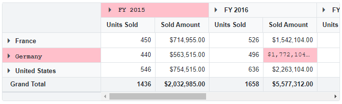

# Apply custom style to pivot cells in Blazor Pivot Table Component

The [EnginePopulated](https://help.syncfusion.com/cr/blazor/Syncfusion.Blazor.PivotView.PivotViewEvents-1.html#Syncfusion_Blazor_PivotView_PivotViewEvents_1_EnginePopulated) event in the [PivotViewEvents](https://help.syncfusion.com/cr/blazor/Syncfusion.Blazor.PivotView.PivotViewEvents-1.html) triggers each time the report changes and the engine updates. This event lets you add your own styles to row, column, and value cells in the Pivot Table.

In the following example, a custom style is applied to the column header **FY 2015** the row header **Germany** and the corresponding value cell for **Amount** under **FY 2016** via the [EnginePopulated](https://help.syncfusion.com/cr/blazor/Syncfusion.Blazor.PivotView.PivotViewEvents-1.html#Syncfusion_Blazor_PivotView_PivotViewEvents_1_EnginePopulated) event by adding the **e-custom** class to the `cellData.CssClass` property.

```cshtml
@using Syncfusion.Blazor.PivotView

<SfPivotView TValue="ProductDetails">
    <PivotViewDataSourceSettings DataSource="@data">
        <PivotViewColumns>
            <PivotViewColumn Name="Year"></PivotViewColumn>
            <PivotViewColumn Name="Quarter"></PivotViewColumn>
        </PivotViewColumns>
        <PivotViewRows>
            <PivotViewRow Name="Country"></PivotViewRow>
            <PivotViewRow Name="Products"></PivotViewRow>
        </PivotViewRows>
        <PivotViewValues>
            <PivotViewValue Name="Sold" Caption="Units Sold"></PivotViewValue>
            <PivotViewValue Name="Amount" Caption="Sold Amount"></PivotViewValue>
        </PivotViewValues>
        <PivotViewFormatSettings>
            <PivotViewFormatSetting Name="Amount" Format="C"></PivotViewFormatSetting>
        </PivotViewFormatSettings>
    </PivotViewDataSourceSettings>
    <PivotViewEvents TValue="ProductDetails" EnginePopulated="EnginePopulated"></PivotViewEvents>
</SfPivotView>

<style>
    .e-pivotview .e-custom,
    .e-pivotview .e-custom.e-headercell {
        font-family: 'Courier New', Courier, monospace;
        font-size: 12px !important;
        background: pink !important;
    }
</style>

@code {
    private List<ProductDetails> data { get; set; }

    protected override void OnInitialized()
    {
        this.data = ProductDetails.GetProductData().ToList();
    }

    private void EnginePopulated(EnginePopulatedEventArgs args)
    {
        for (int i = 0, j = args.PivotValues.Count(); i < j; i++)
        {
            var rowData = args.PivotValues[i];
            for (var k = 0; (rowData != null && k < rowData.Count()); k++)
            {
                var cellData = args.PivotValues[i][k];
                if (cellData != null)
                {
                    if ((cellData.Axis == "row" && cellData.FormattedText == "Germany"))
                    {
                        cellData.CssClass = "e-custom";
                    }
                    if ((cellData.Axis == "column" && cellData.FormattedText == "FY 2015"))
                    {
                        cellData.CssClass = "e-custom";
                    }
                    if ((cellData.Axis == "value" && cellData.ColumnHeaders.ToString() == "FY 2016" && cellData.RowHeaders.ToString() == "Germany" && cellData.ActualText.ToString() == "Amount"))
                    {
                        cellData.CssClass = "e-custom";
                    }
                }
            }
        }
    }
}

```

