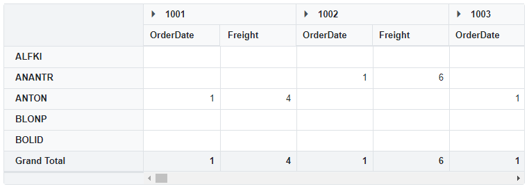

# Convert complex data to flat data and assign it to the Pivot Table

By default, flat data can only bind to the pivot table. However, using **ExpandoObject**, you can connect complex data to the pivot table by converting it to flat data via code-behind and binding it to the pivot table using the [DataSource](https://help.syncfusion.com/cr/blazor/Syncfusion.Blazor.PivotView.PivotViewDataSourceSettings-1.html#Syncfusion_Blazor_PivotView_PivotViewDataSourceSettings_1_DataSource) property under [PivotViewDataSourceSettings](https://help.syncfusion.com/cr/blazor/Syncfusion.Blazor.PivotView.PivotViewDataSourceSettings-1.html).

In the following example, the **ConvertToFlatData()** function is used to convert complex data to flat data and bind it to the pivot table using the [DataSource](https://help.syncfusion.com/cr/blazor/Syncfusion.Blazor.PivotView.PivotViewDataSourceSettings-1.html#Syncfusion_Blazor_PivotView_PivotViewDataSourceSettings_1_DataSource) property, then bind the field names to the rows and columns based on the converted flat data under [PivotViewDataSourceSettings](https://help.syncfusion.com/cr/blazor/Syncfusion.Blazor.PivotView.PivotViewDataSourceSettings-1.html).

```cshtml
@using Syncfusion.Blazor.PivotView
@using System.Dynamic

<SfPivotView TValue="ExpandoObject">
    <PivotViewDataSourceSettings DataSource="@Orders">
        <PivotViewColumns>
            <PivotViewColumn Name="OrderID"></PivotViewColumn>
            <PivotViewColumn Name="ShipName"></PivotViewColumn>
        </PivotViewColumns>
        <PivotViewRows>
            <PivotViewRow Name="CustomerID"></PivotViewRow>
        </PivotViewRows>
        <PivotViewValues>
            <PivotViewValue Name="OrderDate"></PivotViewValue>
            <PivotViewValue Name="Freight" Type="SummaryTypes.Max"></PivotViewValue>
        </PivotViewValues>
    </PivotViewDataSourceSettings>
</SfPivotView>

@code {
    public List<ExpandoObject> Orders { get; set; } = new List<ExpandoObject>();
    protected override void OnInitialized()
    {
        Orders = Enumerable.Range(1, 75).Select((x) =>
        {
            dynamic d = new ExpandoObject();
            d.OrderID = 1000 + x;
            d.CustomerID = (new string[] { "ALFKI", "ANANTR", "ANTON", "BLONP", "BOLID" })[new Random().Next(5)];
            d.Freight = (new double[] { 2, 1, 4, 5, 3 })[new Random().Next(5)] * x;
            d.OrderDate = (new DateTime[] { new DateTime(2010, 11, 5), new DateTime(2018, 10, 3), new DateTime(1995, 9, 9), new DateTime(2012, 8, 2), new DateTime(2015, 4, 11) })[new Random().Next(5)];
            d.ShipCountry = (new string[] { "USA", "UK" })[new Random().Next(2)];
            d.Verified = (new bool[] { true, false })[new Random().Next(2)];
            d.ShipDetails = new ExpandoObject();
            d.ShipDetails.ShipName = (new string[] { "ALTEN-I", "BONTER", "GITOR", "MELON", "CRUISE" })[new Random().Next(5)];
            d.ShipDetails.ShipId = 25000 + x;
            return d;
        }).Cast<ExpandoObject>().ToList<ExpandoObject>();
        Orders = ConvertToFlatData(Orders);
    }

    public List<ExpandoObject> ConvertToFlatData(List<ExpandoObject> Data)
    {
        List<ExpandoObject> flatData = new List<ExpandoObject>();        
        foreach (var item in Data)
        {
            dynamic obj = new ExpandoObject();
            foreach (var child in item)
            {
                if (child.Value.ToString() == "System.Dynamic.ExpandoObject")
                {
                    var dynamicObj = (IDictionary<string, object>)child.Value;
                    foreach (var New in dynamicObj)
                    {
                        var field = New.Key;
                        var fieldvalue = dynamicObj[field];
                        ((IDictionary<String, Object>)obj).Add(field, fieldvalue);
                    }
                }
                else
                {
                    var field = child.Key;
                    var dynamicObj = (IDictionary<string, object>)item;
                    var fieldvalue = dynamicObj[field];
                    ((IDictionary<String, Object>)obj).Add(field, fieldvalue);
                }
            }
            flatData.Add(obj);
        }
        return flatData;
    }
}

```


