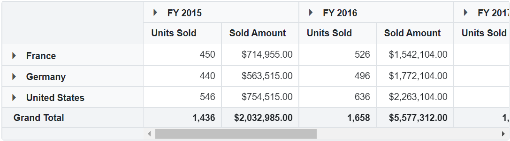
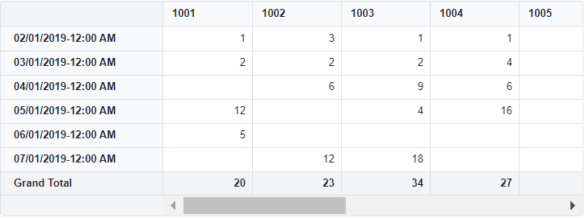

# Customize number and date format in Blazor Pivot Table Component

User can format the number, date, and time values for each field using [PivotViewFormatSettings](https://help.syncfusion.com/cr/blazor/Syncfusion.Blazor.PivotView.PivotViewFilterSettings.html) option under [PivotViewDataSource](https://help.syncfusion.com/cr/blazor/Syncfusion.Blazor.PivotView.PivotViewDataSourceSettings-1.html). It can be configured through code behind, during initial rendering.

## Number formatting

For numbers, the formatting settings required to apply through code behind are:

* [Name](https://help.syncfusion.com/cr/blazor/Syncfusion.Blazor.PivotView.PivotViewFormatSetting.html#Syncfusion_Blazor_PivotView_PivotViewFormatSetting_Name): It allows to set the field name.
* [Format](https://help.syncfusion.com/cr/blazor/Syncfusion.Blazor.PivotView.PivotViewFormatSetting.html#Syncfusion_Blazor_PivotView_PivotViewFormatSetting_Format): It allows to set the format of the respective field.

```cshtml
@using Syncfusion.Blazor.PivotView

<SfPivotView TValue="ProductDetails">
    <PivotViewDataSourceSettings DataSource="@data">
        <PivotViewColumns>
            <PivotViewColumn Name="Year"></PivotViewColumn>
            <PivotViewColumn Name="Quarter"></PivotViewColumn>
        </PivotViewColumns>
        <PivotViewRows>
            <PivotViewRow Name="Country"></PivotViewRow>
            <PivotViewRow Name="Products"></PivotViewRow>
        </PivotViewRows>
        <PivotViewValues>
            <PivotViewValue Name="Sold" Caption="Units Sold"></PivotViewValue>
            <PivotViewValue Name="Amount" Caption="Sold Amount"></PivotViewValue>
        </PivotViewValues>
        <PivotViewFormatSettings>
            <PivotViewFormatSetting Name="Sold" Format="N"></PivotViewFormatSetting>
            <PivotViewFormatSetting Name="Amount" Format="C"></PivotViewFormatSetting>
        </PivotViewFormatSettings>
    </PivotViewDataSourceSettings>
</SfPivotView>

@code{
    public List<ProductDetails> data { get; set; }
    protected override void OnInitialized()
    {
        this.data = ProductDetails.GetProductData().ToList();
        //Bind the data source collection here. Refer "Assigning sample data to the pivot table" section in getting started for more details.
    }
}

```



## Date and time formatting

N> This property is applicable only for relational data source.

For date and time, the formatting settings required to apply through code behind are:

* [Name](https://help.syncfusion.com/cr/blazor/Syncfusion.Blazor.PivotView.PivotViewFormatSetting.html#Syncfusion_Blazor_PivotView_PivotViewFormatSetting_Name): It allows to set the field name.
* [Format](https://help.syncfusion.com/cr/blazor/Syncfusion.Blazor.PivotView.PivotViewFormatSetting.html#Syncfusion_Blazor_PivotView_PivotViewFormatSetting_Format): It allows to set the format of the respective field.
* [Type](https://help.syncfusion.com/cr/blazor/Syncfusion.Blazor.PivotView.PivotViewFormatSetting.html#Syncfusion_Blazor_PivotView_PivotViewFormatSetting_Type): It allows to set the type of format to be used for the respective field.

```cshtml
@using Syncfusion.Blazor.PivotView

<SfPivotView TValue="ProductDetails" Width="800" Height="300">
    <PivotViewDataSourceSettings DataSource="@data">
        <PivotViewColumns>
            <PivotViewColumn Name="Id" Caption="ID"></PivotViewColumn>
        </PivotViewColumns>
        <PivotViewRows>
            <PivotViewRow Name="Date" Caption="Date"></PivotViewRow>
        </PivotViewRows>
        <PivotViewValues>
            <PivotViewValue Name="ProCost" Caption="Amount"></PivotViewValue>
        </PivotViewValues>
        <PivotViewFormatSettings>
            <PivotViewFormatSetting Name="Date" Type="FormatType.DateTime" Format="dd/MM/yyyy-hh:mm"></PivotViewFormatSetting>
        </PivotViewFormatSettings>
    </PivotViewDataSourceSettings>
</SfPivotView>
@code{
    public List<ProductDetails> data { get; set; }
    protected override void OnInitialized()
    {
        this.data = ProductDetails.GetProductData().ToList();
    }
}

```



## Limitations of date formatting

As per Firefox and Edge browsers standards, most of the date and time formats used in data source aren’t supported. For example: Apr-2000, Apr-01-2000, 01-03-2000, 2000-Apr-01 etc. are not supported. Meanwhile [ISO formats](https://262.ecma-international.org/5.1/#sec-15.9.1.15) will be supported across all browsers.

N> You can refer to our [Blazor Pivot Table](https://www.syncfusion.com/blazor-components/blazor-pivot-table) feature tour page for its groundbreaking feature representations. You can also explore our [Blazor Pivot Table example](https://blazor.syncfusion.com/demos/pivot-table/default-functionalities?theme=bootstrap5) to know how to render and configure the pivot table.