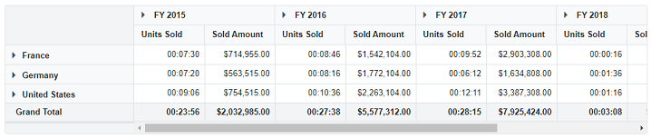

# Display string value to pivot table values in Blazor Pivot Table

End user can display string value to the pivot table's value cell by using the [CellTemplate](https://help.syncfusion.com/cr/blazor/Syncfusion.Blazor.PivotView.PivotViewTemplates.html#Syncfusion_Blazor_PivotView_PivotViewTemplates_CellTemplate) property in [PivotViewTemplates](https://help.syncfusion.com/cr/blazor/Syncfusion.Blazor.PivotView.PivotViewTemplates.html) class.

In the following example, each cell value of the **Sold** field's actual value has been converted to **{hours:D2}:{minutes:D2}:{seconds:D2}** format and string values have been assigned to `data.FormattedText`.

```cshtml
@using Syncfusion.Blazor.PivotView

<SfPivotView TValue="ProductDetails">
    <PivotViewTemplates>
        <CellTemplate>
            @{
                var data = context as AxisSet;
                if (data != null)
                {
                    if (data.Axis == "value" && data.ActualText.ToString() == "Sold")
                    {
                        data.FormattedText = SecondsToHms(data.Value);
                        @data.FormattedText
                    }
                    else
                    {
                        @data.FormattedText
                    }
                }
            }
        </CellTemplate>
    </PivotViewTemplates>
    <PivotViewDataSourceSettings DataSource="@dataSource">
        <PivotViewColumns>
            <PivotViewColumn Name="Year"></PivotViewColumn>
            <PivotViewColumn Name="Quarter"></PivotViewColumn>
        </PivotViewColumns>
        <PivotViewRows>
            <PivotViewRow Name="Country"></PivotViewRow>
            <PivotViewRow Name="Products"></PivotViewRow>
        </PivotViewRows>
        <PivotViewValues>
            <PivotViewValue Name="Sold" Caption="Units Sold"></PivotViewValue>
            <PivotViewValue Name="Amount" Caption="Sold Amount"></PivotViewValue>
        </PivotViewValues>
        <PivotViewFormatSettings>
            <PivotViewFormatSetting Name="Amount" Format="C"></PivotViewFormatSetting>
        </PivotViewFormatSettings>
    </PivotViewDataSourceSettings>
</SfPivotView>

@code {
    public List<ProductDetails> dataSource { get; set; }
    protected override void OnInitialized()
    {
        this.dataSource = ProductDetails.GetProductData().ToList();
    }
    private string SecondsToHms(Nullable<double> value)
    {
        int hours = (int)Math.Floor((decimal)value / 3600) ;
        int minutes = (int)Math.Floor(((decimal)value % 3600) / 60);
        int seconds = (int)Math.Floor(((decimal)value % 3600) % 60);
        string formattedTime = $"{hours:D2}:{minutes:D2}:{seconds:D2}";
        return formattedTime;
    }
}

```

