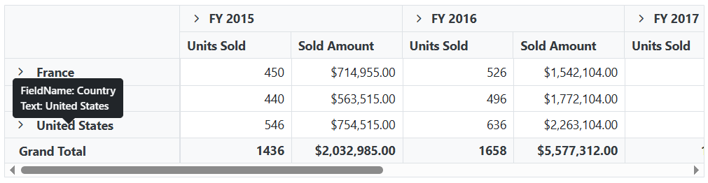

# How to add custom tooltips to Pivot Table headers

You can display custom tooltips for row and column headers to provide additional context and information. This approach enhances the user experience by showing detailed field information when hovering over header cells in the pivot table.

## Implementation

To display tooltips for row and column headers, initialize an external [`SfTooltip`](https://blazor.syncfusion.com/documentation/tooltip/getting-started) component. The [OnRender](https://help.syncfusion.com/cr/blazor/Syncfusion.Blazor.Popups.SfTooltip.html#Syncfusion_Blazor_Popups_SfTooltip_OnRender) event retrieves header cell information, which is displayed within the [ContentTemplate](https://help.syncfusion.com/cr/blazor/Syncfusion.Blazor.Popups.SfTooltip.html#Syncfusion_Blazor_Popups_SfTooltip_ContentTemplate) of the tooltip. The tooltip targets both row and column header elements using specific CSS selectors: `td.e-rowsheader` for row headers and `th.e-columnsheader` for column headers.

For row header tooltips, the formatted text and field name of the current row header are retrieved from the [`PivotValues`](https://help.syncfusion.com/cr/blazor/Syncfusion.Blazor.PivotView.SfPivotView-1.html#Syncfusion_Blazor_PivotView_SfPivotView_1_PivotValues) and displayed in the tooltip. For column header tooltips, the text content of the respective column header element is extracted and displayed directly in the tooltip.

```cshtml
@using Syncfusion.Blazor.PivotView
@using Syncfusion.Blazor.Popups
@inject IJSRuntime JSRuntime
@using System.Text.Json;

<SfPivotView @ref="pivot" ID="PivotView" TValue="ProductDetails">
	<PivotViewDataSourceSettings DataSource="@dataSource">
		<PivotViewColumns>
			<PivotViewColumn Name="Year"></PivotViewColumn>
			<PivotViewColumn Name="Quarter"></PivotViewColumn>
		</PivotViewColumns>
		<PivotViewRows>
			<PivotViewRow Name="Country"></PivotViewRow>
			<PivotViewRow Name="Products"></PivotViewRow>
		</PivotViewRows>
		<PivotViewValues>
			<PivotViewValue Name="Sold" Caption="Units Sold"></PivotViewValue>
			<PivotViewValue Name="Amount" Caption="Sold Amount"></PivotViewValue>
		</PivotViewValues>
		<PivotViewFormatSettings>
			<PivotViewFormatSetting Name="Amount" Format="C"></PivotViewFormatSetting>
		</PivotViewFormatSettings>
	</PivotViewDataSourceSettings>
	<PivotViewEvents TValue="ProductDetails" DataBound="DataBound"></PivotViewEvents>
</SfPivotView>

<SfTooltip @ref="tooltipRef" MouseTrail="true" WindowCollision="true" OpenDelay="500" ID="pivot-tooltip" Target="@("td.e-rowsheader" + "," + "th.e-columnsheader" + "," + "th.e-valuesheader")" OnRender="OnTooltipRender">
	<ContentTemplate>
		@{
			if (cellData != null)
			{
				if (cellData.FormattedText != "Grand Total")
				{
					if (cellData.Axis == "row")
					{
						<div>
							<div>
								<p class="inline-p">FieldName:</p>
								<p class="inline-p">@cellData.ValueSort["axis"]</p>
							</div>
							<div>
								<p class="inline-p">Text:</p>
								<p class="inline-p">@cellData.FormattedText</p>
							</div>
						</div>
					}
					else
					{
						<div>
							<div>
								<p class="inline-p">Text:</p>
								<p class="inline-p">@cellData.FormattedText</p>
							</div>
						</div>
					}
				}
				else
				{
					<div>
						<div>
							<p class="inline-p">Text:</p>
							<p class="inline-p">@cellData.FormattedText</p>
						</div>
					</div>
				}
			}
		}
	</ContentTemplate>
</SfTooltip>

<style>
	.inline-p {
		display: inline;
	}
</style>

<script>
	function getTableCellNode(ID, left, top) {
		var targetElement = document.getElementById(ID);
		var pointElement = document.elementFromPoint(left, top);
		var headerCell = closest(pointElement, "td.e-rowsheader");
		var columnIndex, rowIndex;
		if (headerCell) {
			columnIndex = Number(headerCell.getAttribute('aria-colindex')) - 1;
			rowIndex = Number(headerCell.getAttribute('index'));
		} else {
			var columnHeaderCell = closest(pointElement, "th.e-columnsheader");
			columnIndex = Number(columnHeaderCell.getAttribute('aria-colindex')) - 1;
			rowIndex = Number(columnHeaderCell.getAttribute('index'));
		}
		var cellDetails = {
			index: rowIndex,
			'aria-colindex': columnIndex
		};

		return JSON.stringify(cellDetails);
	}

	function closest(element, selector) {
		var el = element;
		if (typeof el.closest === 'function') {
			return el.closest(selector);
		}
		while (el && el.nodeType === 1) {
			if (matches(el, selector)) {
				return el;
			}
			el = el.parentNode;
		}
		return null;
	}
</script>

@code {
	private SfPivotView<ProductDetails> pivot;
	private List<ProductDetails> dataSource { get; set; }
	private SfTooltip tooltipRef;
	private AxisSet cellData;

	protected override void OnInitialized()
	{
		this.dataSource = ProductDetails.GetProductData().ToList();
	}

	public void DataBound()
	{
		if (tooltipRef != null)
		{
			tooltipRef.RefreshAsync();
		}
	}

	// Event function used to update the tooltip content while hovering each row and column headers in the pivot table.
	public async void OnTooltipRender(TooltipEventArgs args)
	{
		Dictionary<string, int> cellInfo;

		string returnValue = await JSRuntime.InvokeAsync<string>("getTableCellNode", new object[] { "PivotView", args.Left, args.Top });
		if (returnValue != null)
		{
			// You can get the cell information for the row and column headers here to display in the tooltip.
			cellInfo = JsonSerializer.Deserialize<Dictionary<string, int>>(returnValue);
			cellData = pivot.PivotValues[cellInfo["index"]]?[cellInfo["aria-colindex"]];
		}
	}
}

```


