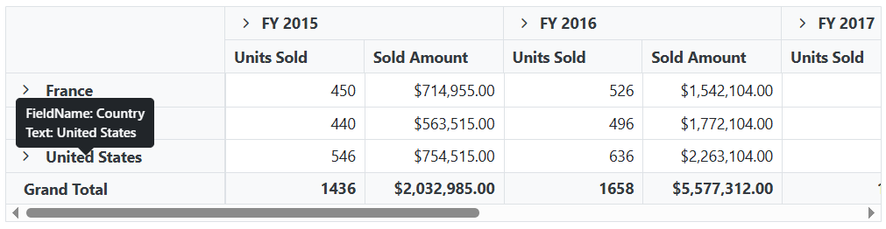

# Show tooltip for row and column headers in Blazor Pivot Table

You can create and display the tooltip for each row and column header(s) in the pivot table by using an external tooltip component.

In the following example, the [OnRender](https://help.syncfusion.com/cr/blazor/Syncfusion.Blazor.Popups.SfTooltip.html#Syncfusion_Blazor_Popups_SfTooltip_OnRender) event is used for obtaining the header cell information, which is then used within the [ContentTemplate](https://blazor.syncfusion.com/documentation/tooltip/template) property of the [SfTooltip](https://blazor.syncfusion.com/documentation/tooltip/getting-started) component.

```cshtml
@using Syncfusion.Blazor.PivotView
@using Syncfusion.Blazor.Popups
@inject IJSRuntime JSRuntime
@using System.Text.Json;

<SfPivotView @ref="pivot" ID="PivotView" TValue="ProductDetails">
    <PivotViewDataSourceSettings DataSource="@dataSource">
        <PivotViewColumns>
            <PivotViewColumn Name="Year"></PivotViewColumn>
            <PivotViewColumn Name="Quarter"></PivotViewColumn>
        </PivotViewColumns>
        <PivotViewRows>
            <PivotViewRow Name="Country"></PivotViewRow>
            <PivotViewRow Name="Products"></PivotViewRow>
        </PivotViewRows>
        <PivotViewValues>
            <PivotViewValue Name="Sold" Caption="Units Sold"></PivotViewValue>
            <PivotViewValue Name="Amount" Caption="Sold Amount"></PivotViewValue>
        </PivotViewValues>
        <PivotViewFormatSettings>
            <PivotViewFormatSetting Name="Amount" Format="C"></PivotViewFormatSetting>
        </PivotViewFormatSettings>
    </PivotViewDataSourceSettings>
    <PivotViewEvents TValue="ProductDetails" Created="Created"></PivotViewEvents>
</SfPivotView>

<SfTooltip @ref="tooltipRef" MouseTrail="true" WindowCollision="true" OpenDelay="500" ID="pivot-tooltip" Target="@("td.e-rowsheader" + "," + "th.e-columnsheader")" OnRender="OnTooltipRender">
    <ContentTemplate>
        @{
            if (cellData != null)
            {
                if (cellData.FormattedText != "Grand Total")
                {
                    if (cellData.Axis == "row")
                    {
                        <div>
                            <div>
                                <p class="inline-p">FieldName:</p>
                                <p class="inline-p">@cellData.ValueSort["axis"]</p>
                            </div>
                            <div>
                                <p class="inline-p">Text:</p>
                                <p class="inline-p">@cellData.FormattedText</p>
                            </div>
                        </div>
                    }
                    else
                    {
                        <div>
                            <div>
                                <p class="inline-p">Text:</p>
                                <p class="inline-p">@cellData.FormattedText</p>
                            </div>
                        </div>
                    }
                }
                else
                {
                    <div>
                        <div>
                            <p class="inline-p">Text:</p>
                            <p class="inline-p">@cellData.FormattedText</p>
                        </div>
                    </div>
                }
            }
        }
    </ContentTemplate>
</SfTooltip>

<style>
    .inline-p {
        display: inline;
    }
</style>

<script>
    function getTableCellNode(ID, left, top) {
        var element = document.getElementById(ID);
        var cellElement = document.elementFromPoint(left, top);
        if (cellElement) {
            var colIndex = Number(cellElement.getAttribute('aria-colindex')) - 1;
            var rowIndex = Number(cellElement.getAttribute('index'));
        }
        var cellInfo = {};
        cellInfo['index'] = rowIndex;
        cellInfo['aria-colindex'] = colIndex;
        return JSON.stringify(cellInfo);
    }
</script>

@code {
    private SfPivotView<ProductDetails> pivot;
    private List<ProductDetails> dataSource { get; set; }
    private SfTooltip tooltipRef;
    private AxisSet cellData;

    protected override void OnInitialized()
    {
        this.dataSource = ProductDetails.GetProductData().ToList();
    }

    public void Created()
    {
        if (tooltipRef != null)
        {
            tooltipRef.RefreshAsync();
        }
    }

    // Event function used to update the tooltip content while hovering each row and column headers in the pivot table.
    public async void OnTooltipRender(TooltipEventArgs args)
    {
        Dictionary<string, int> cellInfo;
        string returnValue = await JSRuntime.InvokeAsync<string>("getTableCellNode", new object[] { "PivotView", args.Left, args.Top });
        if (returnValue != null)
        {
            // You can get the cell information for the row and column headers here to display in the tooltip.
            cellInfo = JsonSerializer.Deserialize<Dictionary<string, int>>(returnValue);
            cellData = pivot.PivotValues[cellInfo["index"]]?[cellInfo["aria-colindex"]];
        }
    }
}

```

