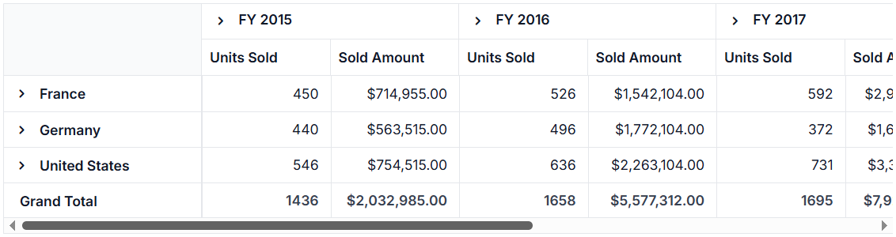

<!-- markdownlint-disable MD012 -->
<!-- markdownlint-disable MD009 -->

# Switching to older themes style in Blazor Pivot Table Component

Since Volume 1, 2020, Syncfusion<sup style="font-size:70%">&reg;</sup> has revised the theming and layout of the Pivot Table. If you prefer the appearance of the earlier theme, you can revert to it by making specific changes. This guide explains how to restore the older theme's style by modifying the CSS to adjust cell background colors and set the row height to match the previous layout.

## CSS Selectors

In the current theme, cells are differentiated by their background colors. To avoid this, you need to override these background colors via simple CSS adjustments within your application. The following CSS selectors allow achieving the same for Material, Fabric, Bootstrap, and Bootstrap v4 themes:

```html      
<!-- Codes here... -->
<style>
    .e-pivotview .e-rowsheader, 
    .e-pivotview .e-columnsheader,
    .e-pivotview .e-gtot,
    .e-pivotview .e-content,
    .e-pivotview .e-gridheader,
    .e-pivotview .e-headercell {
        background-color:#fff !important;
    }
</style>
```

For the High Contrast theme, the following CSS is required:

```html      
<!-- Codes here... -->
<style>
    .e-pivotview .e-rowsheader, 
    .e-pivotview .e-columnsheader,
    .e-pivotview .e-gtot,
    .e-pivotview .e-content,
    .e-pivotview .e-gridheader,
    .e-pivotview .e-headercell {
        background-color:#000 !important;
    }
</style>
```

## Adjusting Row Height

In the current theme, the height of each Pivot Table row has been reduced to make the component more compact. Users can reset the height of the Pivot Table rows using the [RowHeight](https://help.syncfusion.com/cr/blazor/Syncfusion.Blazor.PivotView.PivotViewGridSettings.html#Syncfusion_Blazor_PivotView_PivotViewGridSettings_RowHeight) property within [PivotViewGridSettings](https://help.syncfusion.com/cr/blazor/Syncfusion.Blazor.PivotView.PivotViewGridSettings.html). In the older theme, this property was typically set to 36 pixels for desktop layouts and 48 pixels for mobile layouts. To replicate the older theme style, reset the [RowHeight](https://help.syncfusion.com/cr/blazor/Syncfusion.Blazor.PivotView.PivotViewGridSettings.html#Syncfusion_Blazor_PivotView_PivotViewGridSettings_RowHeight) accordingly.

```cshtml
@using Syncfusion.Blazor.PivotView

<SfPivotView TValue="ProductDetails">
    <PivotViewDataSourceSettings DataSource="@data">
        <PivotViewColumns>
            <PivotViewColumn Name="Year"></PivotViewColumn>
            <PivotViewColumn Name="Quarter"></PivotViewColumn>
        </PivotViewColumns>
        <PivotViewRows>
            <PivotViewRow Name="Country"></PivotViewRow>
            <PivotViewRow Name="Products"></PivotViewRow>
        </PivotViewRows>
        <PivotViewValues>
            <PivotViewValue Name="Sold" Caption="Units Sold"></PivotViewValue>
            <PivotViewValue Name="Amount" Caption="Sold Amount"></PivotViewValue>
        </PivotViewValues>
        <PivotViewFormatSettings>
            <PivotViewFormatSetting Name="Amount" Format="C"></PivotViewFormatSetting>
        </PivotViewFormatSettings>
    </PivotViewDataSourceSettings>
    <PivotViewGridSettings RowHeight=36></PivotViewGridSettings>
</SfPivotView>

@code{
    public List<ProductDetails> data { get; set; }
    protected override void OnInitialized()
    {
        this.data = ProductDetails.GetProductData().ToList();
        //Bind the data source collection here. Refer "Assigning sample data to the pivot table" section in getting started for more details.
    }
}

<style>
    .e-pivotview .e-rowsheader, 
    .e-pivotview .e-columnsheader,
    .e-pivotview .e-gtot,
    .e-pivotview .e-content,
    .e-pivotview .e-gridheader,
    .e-pivotview .e-headercell {
        background-color:#fff !important;
    }
</style>

```



N> You can refer to [Blazor Pivot Table](https://www.syncfusion.com/blazor-components/blazor-pivot-table) feature tour page for its groundbreaking feature representations. You can also explore [Blazor Pivot Table example](https://blazor.syncfusion.com/demos/pivot-table/default-functionalities?theme=bootstrap4) to know how to render and configure the Pivot Table.