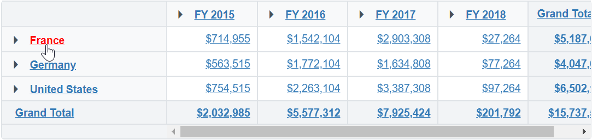
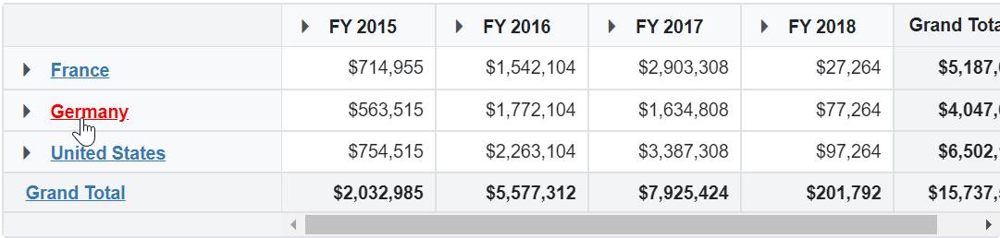
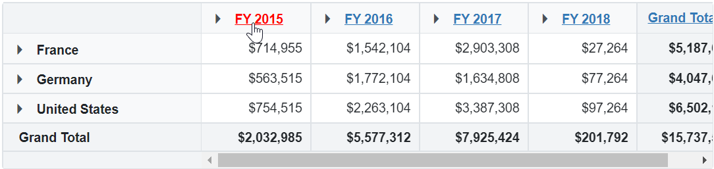
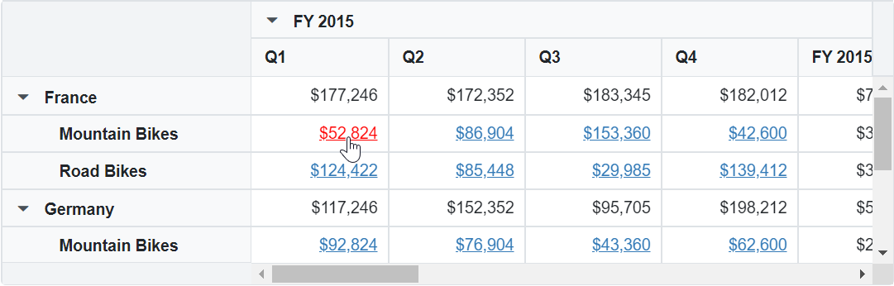
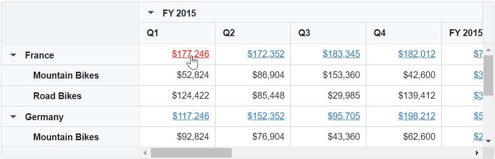
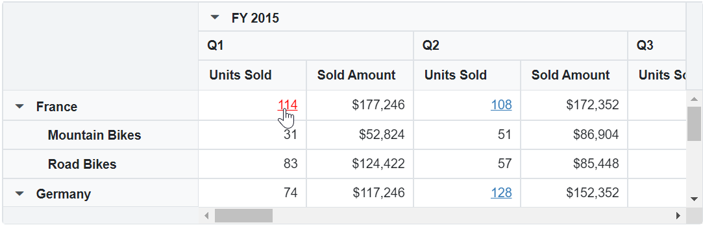
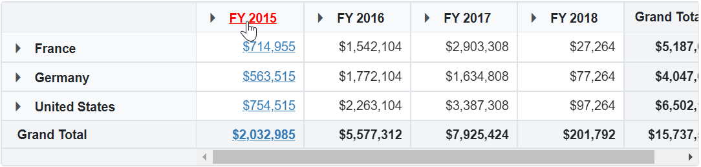

# Hyperlink in Blazor Pivot Table

The Pivot Table component provides built-in support for displaying hyperlinks within individual cells. This feature allows users to link data in specific cells, enhancing interactivity and navigation. Common use cases include linking a value cell to a related detail report, opening an external resource from a row header, or highlighting summary cells that match a business rule.

Hyperlinks can be selectively enabled for various cell types, including:

- Row headers
- Column headers
- Value cells
- Summary cells

You can control hyperlink behavior using the [`PivotViewHyperlinkSettings`](https://help.syncfusion.com/cr/blazor/Syncfusion.Blazor.PivotView.PivotViewHyperlinkSettings.html) class, which can be defined during the initial rendering through the code-behind.

## Available hyperlink settings

The following properties are available in `PivotViewHyperlinkSettings`. Each property is optional; combine them to control which cells display hyperlinks.

| Property | Type | Default | Description |
|----------|------|---------|-------------|
| [`ShowHyperlink`](https://help.syncfusion.com/cr/blazor/Syncfusion.Blazor.PivotView.PivotViewHyperlinkSettings.html#Syncfusion_Blazor_PivotView_PivotViewHyperlinkSettings_ShowHyperlink) | `boolean` | `false` | Shows or hides hyperlinks in all cells. |
| [`ShowRowHeaderHyperlink`](https://help.syncfusion.com/cr/blazor/Syncfusion.Blazor.PivotView.PivotViewHyperlinkSettings.html#Syncfusion_Blazor_PivotView_PivotViewHyperlinkSettings_ShowRowHeaderHyperlink) | `boolean` | `false` | IShows or hides hyperlinks in row headers. |
| [`ShowColumnHeaderHyperlink`](https://help.syncfusion.com/cr/blazor/Syncfusion.Blazor.PivotView.PivotViewHyperlinkSettings.html#Syncfusion_Blazor_PivotView_PivotViewHyperlinkSettings_ShowColumnHeaderHyperlink) | `boolean` | `false | Shows or hides hyperlinks in column headers. |
| [`ShowValueCellHyperlink`](https://help.syncfusion.com/cr/blazor/Syncfusion.Blazor.PivotView.PivotViewHyperlinkSettings.html#Syncfusion_Blazor_PivotView_PivotViewHyperlinkSettings_ShowValueCellHyperlink) | `boolean` | `false` | Shows or hides hyperlinks in value cells. |
| [`ShowSummaryCellHyperlink`](https://help.syncfusion.com/cr/blazor/Syncfusion.Blazor.PivotView.PivotViewHyperlinkSettings.html#Syncfusion_Blazor_PivotView_PivotViewHyperlinkSettings_ShowSummaryCellHyperlink) | `boolean` | `false` | Shows or hides hyperlinks in summary cells. |
| [`HeaderText`](https://help.syncfusion.com/cr/blazor/Syncfusion.Blazor.PivotView.PivotViewHyperlinkSettings.html#Syncfusion_Blazor_PivotView_PivotViewHyperlinkSettings_HeaderText) | `string` | `''` | Shows hyperlinks for cells whose header text matches the specified value. |
| [`ConditionalSettings`](https://help.syncfusion.com/cr/blazor/Syncfusion.Blazor.PivotView.PivotViewConditionalSetting.html) | `List<PivotViewConditionalSettings>` | `null` | Shows hyperlinks for cells whose values match the specified conditions. |
| [`CssClass`](https://help.syncfusion.com/cr/blazor/Syncfusion.Blazor.PivotView.PivotViewHyperlinkSettings.html#Syncfusion_Blazor_PivotView_PivotViewHyperlinkSettings_CssClass) | `string` | `''` | Applies a custom CSS class to hyperlink elements for user-defined styling. |

<!-- markdownlint-disable MD028 -->
N> By default, the hyperlink options are disabled for all cells in the Pivot Table.

N> User defined style can be applied to hyperlink using [`CssClass`](https://help.syncfusion.com/cr/blazor/Syncfusion.Blazor.PivotView.PivotViewHyperlinkSettings.html#Syncfusion_Blazor_PivotView_PivotViewHyperlinkSettings_CssClass) property in [`PivotViewHyperlinkSettings`](https://help.syncfusion.com/cr/blazor/Syncfusion.Blazor.PivotView.PivotViewHyperlinkSettings.html) class.

## Hyperlink for all cells

The pivot table provides an option to display hyperlinks for **all cells** in the table. To enable this functionality, set the [`ShowHyperlink`](https://help.syncfusion.com/cr/blazor/Syncfusion.Blazor.PivotView.PivotViewHyperlinkSettings.html#Syncfusion_Blazor_PivotView_PivotViewHyperlinkSettings_ShowHyperlink) property to **true** within the [`PivotViewHyperlinkSettings`](https://help.syncfusion.com/cr/blazor/Syncfusion.Blazor.PivotView.PivotViewHyperlinkSettings.html) class.

N> **Prerequisite:** The Pivot Table must have at least one row, column, and value field configured so that all cell types render with content.

Once enabled, hyperlinks are shown consistently in row headers, column headers, value cells, and summary cells.

```cshtml
@using Syncfusion.Blazor.PivotView

<SfPivotView TValue="ProductDetails" ShowFieldList="true">
    <PivotViewDataSourceSettings DataSource="@data">
        <PivotViewColumns>
            <PivotViewColumn Name="Year"></PivotViewColumn>
            <PivotViewColumn Name="Quarter"></PivotViewColumn>
        </PivotViewColumns>
        <PivotViewRows>
            <PivotViewRow Name="Country"></PivotViewRow>
            <PivotViewRow Name="Products"></PivotViewRow>
        </PivotViewRows>
        <PivotViewValues>
            <PivotViewValue Name="Amount" Caption="Sold Amount"></PivotViewValue>
        </PivotViewValues>
        <PivotViewFormatSettings>
            <PivotViewFormatSetting Name="Amount" Format="C0"></PivotViewFormatSetting>
        </PivotViewFormatSettings>
    </PivotViewDataSourceSettings>
    <PivotViewHyperlinkSettings ShowHyperlink="true" CssClass="e-custom-class">
    </PivotViewHyperlinkSettings>
</SfPivotView>

<style>
.e-custom-class,.e-custom-class:hover {
    text-decoration: underline !important;
    color: blue !important;
}
.e-custom-class:hover {
    color: red !important;
}
</style>
@code{
    public List<ProductDetails> data { get; set; }
    protected override void OnInitialized()
    {
        this.data = ProductDetails.GetProductData().ToList();
        //Bind the data source collection here. Refer "Assigning sample data to the pivot table" section in getting started for more details.
    }
}
```



## Hyperlink for row headers

The pivot table provides a way to display hyperlinks specifically in **row header cells** that are currently visible. To enable this functionality, set the [`ShowRowHeaderHyperlink`](https://help.syncfusion.com/cr/blazor/Syncfusion.Blazor.PivotView.PivotViewHyperlinkSettings.html#Syncfusion_Blazor_PivotView_PivotViewHyperlinkSettings_ShowRowHeaderHyperlink) property to **true** within the [`PivotViewHyperlinkSettings`](https://help.syncfusion.com/cr/blazor/Syncfusion.Blazor.PivotView.PivotViewHyperlinkSettings.html). This ensures that only the row headers will display hyperlinks, while other cell types remain unaffected.

```cshtml
@using Syncfusion.Blazor.PivotView

<SfPivotView TValue="ProductDetails">
    <PivotViewDataSourceSettings DataSource="@data">
        <PivotViewColumns>
            <PivotViewColumn Name="Year"></PivotViewColumn>
            <PivotViewColumn Name="Quarter"></PivotViewColumn>
        </PivotViewColumns>
        <PivotViewRows>
            <PivotViewRow Name="Country"></PivotViewRow>
            <PivotViewRow Name="Products"></PivotViewRow>
        </PivotViewRows>
        <PivotViewValues>
            <PivotViewValue Name="Amount" Caption="Sold Amount"></PivotViewValue>
        </PivotViewValues>
        <PivotViewFormatSettings>
            <PivotViewFormatSetting Name="Amount" Format="C0"></PivotViewFormatSetting>
        </PivotViewFormatSettings>
    </PivotViewDataSourceSettings>
    <PivotViewHyperlinkSettings ShowRowHeaderHyperlink="true" CssClass="e-custom-class">
    </PivotViewHyperlinkSettings>
</SfPivotView>

<style>
.e-custom-class,.e-custom-class:hover {
    text-decoration: underline !important;
    color: blue !important;
}
.e-custom-class:hover {
    color: red !important;
}
</style>
@code{
    public List<ProductDetails> data { get; set; }
    protected override void OnInitialized()
    {
        this.data = ProductDetails.GetProductData().ToList();
        //Bind the data source collection here. Refer "Assigning sample data to the pivot table" section in getting started for more details.
    }
}
```



## Hyperlink for column headers

The pivot table provides an option to display hyperlinks specifically in column header cells that are currently visible. To enable this functionality, set the [`ShowColumnHeaderHyperlink`](https://help.syncfusion.com/cr/blazor/Syncfusion.Blazor.PivotView.PivotViewHyperlinkSettings.html#Syncfusion_Blazor_PivotView_PivotViewHyperlinkSettings_ShowColumnHeaderHyperlink) property to **true** within the [`PivotViewHyperlinkSettings`](https://help.syncfusion.com/cr/blazor/Syncfusion.Blazor.PivotView.PivotViewHyperlinkSettings.html) class. This ensures that only the column headers will display hyperlinks, while other cell types remain unaffected.

```cshtml
@using Syncfusion.Blazor.PivotView

<SfPivotView TValue="ProductDetails">
    <PivotViewDataSourceSettings DataSource="@data">
        <PivotViewColumns>
            <PivotViewColumn Name="Year"></PivotViewColumn>
            <PivotViewColumn Name="Quarter"></PivotViewColumn>
        </PivotViewColumns>
        <PivotViewRows>
            <PivotViewRow Name="Country"></PivotViewRow>
            <PivotViewRow Name="Products"></PivotViewRow>
        </PivotViewRows>
        <PivotViewValues>
            <PivotViewValue Name="Amount" Caption="Sold Amount"></PivotViewValue>
        </PivotViewValues>
        <PivotViewFormatSettings>
            <PivotViewFormatSetting Name="Amount" Format="C0"></PivotViewFormatSetting>
        </PivotViewFormatSettings>
    </PivotViewDataSourceSettings>
    <PivotViewHyperlinkSettings ShowColumnHeaderHyperlink="true" CssClass="e-custom-class">
    </PivotViewHyperlinkSettings>
</SfPivotView>

<style>
.e-custom-class,.e-custom-class:hover {
    text-decoration: underline !important;
    color: blue !important;
}
.e-custom-class:hover {
    color: red !important;
}
</style>
@code{
    public List<ProductDetails> data { get; set; }
    protected override void OnInitialized()
    {
        this.data = ProductDetails.GetProductData().ToList();
        //Bind the data source collection here. Refer "Assigning sample data to the pivot table" section in getting started for more details.
    }
}
```



## Hyperlink for value cells

The pivot table provides support for displaying hyperlinks specifically in value cells that are currently visible. To enable this option, set the [`ShowValueCellHyperlink`](https://help.syncfusion.com/cr/blazor/Syncfusion.Blazor.PivotView.PivotViewHyperlinkSettings.html#Syncfusion_Blazor_PivotView_PivotViewHyperlinkSettings_ShowValueCellHyperlink) property to **true** within the [`PivotViewHyperlinkSettings`](https://help.syncfusion.com/cr/blazor/Syncfusion.Blazor.PivotView.PivotViewHyperlinkSettings.html) class. This ensures that only the value cells will display hyperlinks, while other cell types remain unaffected.

```cshtml
@using Syncfusion.Blazor.PivotView

<SfPivotView TValue="ProductDetails">
    <PivotViewDataSourceSettings DataSource="@data" ExpandAll="true">
        <PivotViewColumns>
            <PivotViewColumn Name="Year"></PivotViewColumn>
            <PivotViewColumn Name="Quarter"></PivotViewColumn>
        </PivotViewColumns>
        <PivotViewRows>
            <PivotViewRow Name="Country"></PivotViewRow>
            <PivotViewRow Name="Products"></PivotViewRow>
        </PivotViewRows>
        <PivotViewValues>
            <PivotViewValue Name="Amount" Caption="Sold Amount"></PivotViewValue>
        </PivotViewValues>
        <PivotViewFormatSettings>
            <PivotViewFormatSetting Name="Amount" Format="C0"></PivotViewFormatSetting>
        </PivotViewFormatSettings>
    </PivotViewDataSourceSettings>
    <PivotViewHyperlinkSettings ShowValueCellHyperlink="true" CssClass="e-custom-class">
    </PivotViewHyperlinkSettings>
</SfPivotView>

<style>
.e-custom-class,.e-custom-class:hover {
    text-decoration: underline !important;
    color: blue !important;
}
.e-custom-class:hover {
    color: red !important;
}
</style>
@code{
    public List<ProductDetails> data { get; set; }
    protected override void OnInitialized()
    {
        this.data = ProductDetails.GetProductData().ToList();
        //Bind the data source collection here. Refer "Assigning sample data to the pivot table" section in getting started for more details.
    }
}
```



## Hyperlink for summary cells

The pivot table provides support for displaying hyperlinks specifically in summary cells that are currently visible. To enable this option, set the [`ShowSummaryCellHyperlink`](https://help.syncfusion.com/cr/blazor/Syncfusion.Blazor.PivotView.PivotViewHyperlinkSettings.html#Syncfusion_Blazor_PivotView_PivotViewHyperlinkSettings_ShowSummaryCellHyperlink) property to **true** within the [`PivotViewHyperlinkSettings`](https://help.syncfusion.com/cr/blazor/Syncfusion.Blazor.PivotView.PivotViewHyperlinkSettings.html) class. This ensures that only the summary cells will display hyperlinks, while other cell types remain unaffected.

```cshtml
@using Syncfusion.Blazor.PivotView

<SfPivotView TValue="ProductDetails">
    <PivotViewDataSourceSettings DataSource="@data" ExpandAll="true">
        <PivotViewColumns>
            <PivotViewColumn Name="Year"></PivotViewColumn>
            <PivotViewColumn Name="Quarter"></PivotViewColumn>
        </PivotViewColumns>
        <PivotViewRows>
            <PivotViewRow Name="Country"></PivotViewRow>
            <PivotViewRow Name="Products"></PivotViewRow>
        </PivotViewRows>
        <PivotViewValues>
            <PivotViewValue Name="Amount" Caption="Sold Amount"></PivotViewValue>
        </PivotViewValues>
        <PivotViewFormatSettings>
            <PivotViewFormatSetting Name="Amount" Format="C0"></PivotViewFormatSetting>
        </PivotViewFormatSettings>
    </PivotViewDataSourceSettings>
    <PivotViewHyperlinkSettings ShowSummaryCellHyperlink="true" CssClass="e-custom-class">
    </PivotViewHyperlinkSettings>
</SfPivotView>

<style>
.e-custom-class,.e-custom-class:hover {
    text-decoration: underline !important;
    color: blue !important;
}
.e-custom-class:hover {
    color: red !important;
}
</style>
@code{
    public List<ProductDetails> data { get; set; }
    protected override void OnInitialized()
    {
        this.data = ProductDetails.GetProductData().ToList();
        //Bind the data source collection here. Refer "Assigning sample data to the pivot table" section in getting started for more details.
    }
}
```



## Condition-based hyperlink

The pivot table supports displaying hyperlinks in specific cells based on defined conditions. This functionality can be configured through code-behind during initial rendering using the [`PivotViewConditionalSettings`](https://help.syncfusion.com/cr/blazor/Syncfusion.Blazor.PivotView.PivotViewConditionalSetting.html) class.

* [Measure](https://help.syncfusion.com/cr/blazor/Syncfusion.Blazor.PivotView.PivotViewConditionalSetting.html#Syncfusion_Blazor_PivotView_PivotViewConditionalSetting_Measure) (`string`): Specifies the value field name for which the hyperlink should be shown when the condition is met.
* [Conditions](https://help.syncfusion.com/cr/blazor/Syncfusion.Blazor.PivotView.PivotViewConditionalSetting.html#Syncfusion_Blazor_PivotView_PivotViewConditionalSetting_Conditions) (`Condition`): Specifies the operator type. The supported operators include:
    * `Condition.Equals`
    * `Condition.NotEquals`
    * `Condition.GreaterThan`
    * `Condition.GreaterThanOrEqualTo`
    * `Condition.LessThan`
    * `Condition.LessThanOrEqualTo`
    * `Condition.Between` (uses both `Value1` and `Value2`)
    * `Condition.NotBetween` (uses both `Value1` and `Value2`)
* [Value1](https://help.syncfusion.com/cr/blazor/Syncfusion.Blazor.PivotView.PivotViewConditionalSetting.html#Syncfusion_Blazor_PivotView_PivotViewConditionalSetting_Value1) (`double`): Sets the starting (or only) value for the condition.
* [Value2](https://help.syncfusion.com/cr/blazor/Syncfusion.Blazor.PivotView.PivotViewConditionalSetting.html#Syncfusion_Blazor_PivotView_PivotViewConditionalSetting_Value2) (`double`): Sets the ending value for range-based comparisons (`Condition.Between`, `Condition.NotBetween`). Ignored for other operators.

> **URL source:** The hyperlink target for condition-based cells is taken from a column on the data source whose name matches the value field defined in `Measure`. If your data source does not contain such a column, the cell is rendered as plain text.

In the example below, the pivot table is configured to display hyperlinks only in cells where the "Units Sold" field value is between **100** and **200**. This highlights specific aggregated values that meet the given condition.

```cshtml
@using Syncfusion.Blazor.PivotView

<SfPivotView TValue="ProductDetails">
    <PivotViewDataSourceSettings DataSource="@data" ExpandAll="true">
        <PivotViewColumns>
            <PivotViewColumn Name="Year"></PivotViewColumn>
            <PivotViewColumn Name="Quarter"></PivotViewColumn>
        </PivotViewColumns>
        <PivotViewRows>
            <PivotViewRow Name="Country"></PivotViewRow>
            <PivotViewRow Name="Products"></PivotViewRow>
        </PivotViewRows>
        <PivotViewValues>
            <PivotViewValue Name="Sold" Caption="Units Sold"></PivotViewValue>
            <PivotViewValue Name="Amount" Caption="Sold Amount"></PivotViewValue>
        </PivotViewValues>
        <PivotViewFormatSettings>
            <PivotViewFormatSetting Name="Amount" Format="C0"></PivotViewFormatSetting>
        </PivotViewFormatSettings>
    </PivotViewDataSourceSettings>
    <PivotViewHyperlinkSettings CssClass="e-custom-class">
        <PivotViewConditionalSettings>
            <PivotViewConditionalSetting Measure="Sold" Conditions=Condition.Between Value1="100" Value2="200"></PivotViewConditionalSetting>
        </PivotViewConditionalSettings>
    </PivotViewHyperlinkSettings>
</SfPivotView>

<style>
.e-custom-class,.e-custom-class:hover {
    text-decoration: underline !important;
    color: blue !important;
}
.e-custom-class:hover {
    color: red !important;
}
</style>
@code{
    public List<ProductDetails> data { get; set; }
    protected override void OnInitialized()
    {
        this.data = ProductDetails.GetProductData().ToList();
        //Bind the data source collection here. Refer "Assigning sample data to the pivot table" section in getting started for more details.
    }
}
```



## Header based hyperlink

The Pivot Table supports displaying hyperlinks in cells based on specific row or column headers. This functionality can be enabled using the [`HeaderText`](https://help.syncfusion.com/cr/blazor/Syncfusion.Blazor.PivotView.PivotViewHyperlinkSettings.html#Syncfusion_Blazor_PivotView_PivotViewHyperlinkSettings_HeaderText) property, which is configured through code-behind during initial rendering.

In the below code example, the value **FY 2015** is assigned to [`HeaderText`](https://help.syncfusion.com/cr/blazor/Syncfusion.Blazor.PivotView.PivotViewHyperlinkSettings.html#Syncfusion_Blazor_PivotView_PivotViewHyperlinkSettings_HeaderText), which means the Pivot Table will show hyperlinks only in cells that match this specific header combination.

```cshtml
@using Syncfusion.Blazor.PivotView

<SfPivotView TValue="ProductDetails">
    <PivotViewDataSourceSettings DataSource="@data">
        <PivotViewColumns>
            <PivotViewColumn Name="Year"></PivotViewColumn>
            <PivotViewColumn Name="Quarter"></PivotViewColumn>
        </PivotViewColumns>
        <PivotViewRows>
            <PivotViewRow Name="Country"></PivotViewRow>
            <PivotViewRow Name="Products"></PivotViewRow>
        </PivotViewRows>
        <PivotViewValues>
            <PivotViewValue Name="Amount" Caption="Sold Amount"></PivotViewValue>
        </PivotViewValues>
        <PivotViewFormatSettings>
            <PivotViewFormatSetting Name="Amount" Format="C0"></PivotViewFormatSetting>
        </PivotViewFormatSettings>
    </PivotViewDataSourceSettings>
    <PivotViewHyperlinkSettings HeaderText="FY 2015" CssClass="e-custom-class"></PivotViewHyperlinkSettings>
</SfPivotView>

<style>
.e-custom-class,.e-custom-class:hover {
    text-decoration: underline !important;
    color: blue !important;
}
.e-custom-class:hover {
    color: red !important;
}
</style>

@code{
    public List<ProductDetails> data { get; set; }
    protected override void OnInitialized()
    {
        this.data = ProductDetails.GetProductData().ToList();
        //Bind the data source collection here. Refer "Assigning sample data to the pivot table" section in getting started for more details.
    }
}
```



## Event

The pivot table triggers the [`HyperlinkCellClicked`](https://help.syncfusion.com/cr/blazor/Syncfusion.Blazor.PivotView.PivotViewEvents-1.html#Syncfusion_Blazor_PivotView_PivotViewEvents_1_HyperlinkCellClicked) event whenever a hyperlink cell is clicked. This event allows you to either customize the clicked cell or retrieve information about it.

It provides the following parameters:

** [`CurrentCell`](https://help.syncfusion.com/cr/blazor/Syncfusion.Blazor.PivotView.HyperCellClickEventArgs.html#Syncfusion_Blazor_PivotView_HyperCellClickEventArgs_CurrentCell) (`DOM`): Refers to the clicked cell element, which can be modified as needed.
* [`Cancel`](https://help.syncfusion.com/cr/blazor/Syncfusion.Blazor.PivotView.HyperCellClickEventArgs.html#Syncfusion_Blazor_PivotView_HyperCellClickEventArgs_Cancel) (`boolean`): If set to **true**, prevents athe default click behavior from running (for example, navigation). Set to **false** to let the click proceed normally and your custom code run in addition.
* [`Data`](https://help.syncfusion.com/cr/blazor/Syncfusion.Blazor.PivotView.HyperCellClickEventArgs.html#Syncfusion_Blazor_PivotView_HyperCellClickEventArgs_Data) (`object`): Contains detailed information about the clicked cell, including its value, row and column headers, position, and whether it is a summary cell.
* [`NativeEvent`](https://help.syncfusion.com/cr/blazor/Syncfusion.Blazor.PivotView.HyperCellClickEventArgs.html#Syncfusion_Blazor_PivotView_HyperCellClickEventArgs_NativeEvent) (`object`): Represents the original browser event triggered by the click, useful for advanced event handling.

In the example below, when a hyperlink cell is clicked, the cell is checked to determine if it is a row header. If it is a row header (e.g., 'France'), the user is redirected to the corresponding Wikipedia page (e.g., 'https://en.wikipedia.org/wiki/France'). If the clicked cell is a column header, value cell, or summary cell, the user is redirected to 'https://syncfusion.com/'. The [`Cancel`](https://help.syncfusion.com/cr/blazor/Syncfusion.Blazor.PivotView.HyperCellClickEventArgs.html#Syncfusion_Blazor_PivotView_HyperCellClickEventArgs_Cancel) property is set to **false** to allow this interaction.

```cshtml
@using Syncfusion.Blazor.PivotView
@inject IJSRuntime JSRuntime

<SfPivotView TValue="ProductDetails" ShowFieldList="true">
	<PivotViewDataSourceSettings DataSource="@data">
		<PivotViewColumns>
			<PivotViewColumn Name="Year"></PivotViewColumn>
			<PivotViewColumn Name="Quarter"></PivotViewColumn>
		</PivotViewColumns>
		<PivotViewRows>
			<PivotViewRow Name="Country"></PivotViewRow>
			<PivotViewRow Name="Products"></PivotViewRow>
		</PivotViewRows>
		<PivotViewValues>
			<PivotViewValue Name="Amount" Caption="Sold Amount"></PivotViewValue>
		</PivotViewValues>
	</PivotViewDataSourceSettings>
	<PivotViewHyperlinkSettings ShowHyperlink="true" CssClass="e-custom-class">
	</PivotViewHyperlinkSettings>
	<PivotViewEvents TValue="ProductDetails" HyperlinkCellClicked="OnHyperLinkClick"></PivotViewEvents>
</SfPivotView>

<script type="text/javascript">
	function navigateFromPivotCellCoordinates(rowIndex, colIndex, baseUrl) {
		const element = document.querySelector('[index="' + rowIndex + '"][aria-colindex="' + (colIndex + 1) + '"]');
		const cellcontent =  element.innerText;
		if (element && element.classList.contains('e-rowsheader') && cellcontent != "Grand Total")
		{
			const finalUrl = `${baseUrl}${encodeURIComponent(cellcontent)}`;
			console.log(`Navigating from DOM element at [${rowIndex}, ${colIndex}] to: ${finalUrl}`);
			window.location.href = finalUrl;
		}
		else
		{
			const finalUrl = "https://syncfusion.com/";
			console.log(`Navigating from DOM element at [${rowIndex}, ${colIndex}] to: ${finalUrl}`);
			window.location.href = finalUrl;
		}
	}
</script>

<style>
	.e-custom-class, .e-custom-class:hover {
		text-decoration: underline !important;
		color: blue !important;
	}

	.e-custom-class:hover {
		color: red !important;
	}
</style>
@code {
	public List<ProductDetails> data { get; set; }
	protected override void OnInitialized()
	{
		this.data = ProductDetails.GetProductData().ToList();
		//Bind the data source collection here. Refer "Assigning sample data to the pivot table" section in getting started for more details.
	}
	public async Task OnHyperLinkClick(HyperCellClickEventArgs args)
	{
		int row = (args.Data as AxisSet).RowIndex;
		int col = (args.Data as AxisSet).ColIndex;
		string baseUrl = "https://en.wikipedia.org/wiki/";
		await JSRuntime.InvokeVoidAsync("navigateFromPivotCellCoordinates", row, col, baseUrl);
	}
}
```

N> Refer to the [Blazor Pivot Table](https://www.syncfusion.com/blazor-components/blazor-pivot-table) feature tour page for its groundbreaking feature representations. You can also explore the [Blazor Pivot Table example](https://blazor.syncfusion.com/demos/pivot-table/default-functionalities?theme=fluent2) to know how to render and configure the pivot table.
