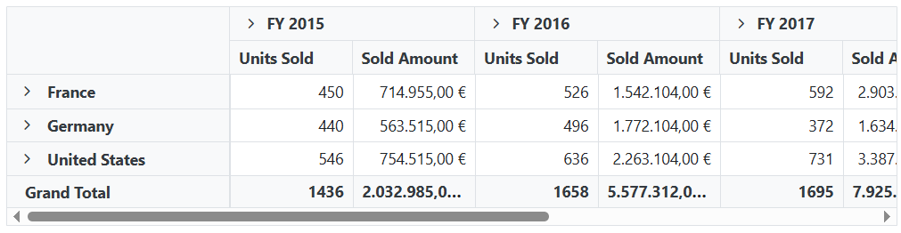
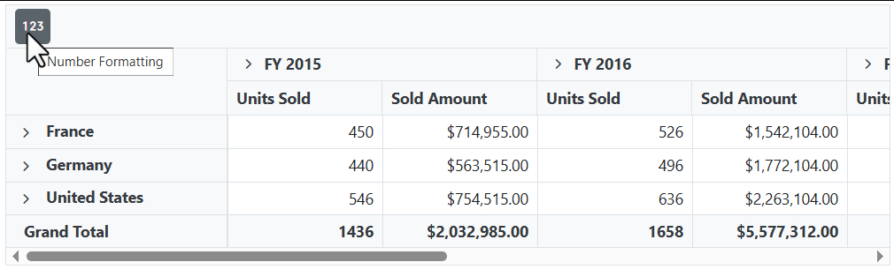

# Number Formatting in Blazor Pivot Table Component

The Pivot Table component provides comprehensive number formatting capabilities, allowing you to display numeric values in various formats. This enhances data readability and ensures values are displayed accurately to meet your specific needs.

## Supported format types

The Pivot Table component supports the following display formats for numeric values:

* **Number** - Standard numeric formatting with optional grouping separators and configurable decimal places.
* **Currency** - Formats currency values with appropriate symbols, optional grouping separators, and customizable decimal places.
* **Percentage** - Values displayed as percentages with the % symbol.
* **Custom** - User-defined formatting patterns for specific display requirements.

## Defining number format settings

To configure number formats for numeric values, use the [FormatSettings](https://help.syncfusion.com/cr/blazor/Syncfusion.Blazor.PivotView.PivotViewDataSourceSettings-1.html#Syncfusion_Blazor_PivotView_PivotViewDataSourceSettings_1_FormatSettings) property in the [PivotViewDataSourceSettings](https://help.syncfusion.com/cr/blazor/Syncfusion.Blazor.PivotView.PivotViewDataSourceSettings-1.html). Use the following main properties within the [FormatSettings](https://help.syncfusion.com/cr/blazor/Syncfusion.Blazor.PivotView.PivotViewDataSourceSettings-1.html#Syncfusion_Blazor_PivotView_PivotViewDataSourceSettings_1_FormatSettings) option to define how values are formatted:

### Essential formatting properties

* [Name](https://help.syncfusion.com/cr/blazor/Syncfusion.Blazor.PivotView.PivotViewFormatSetting.html#Syncfusion_Blazor_PivotView_PivotViewFormatSetting_Name): Specifies the field name to which the formatting should be applied.
* [Format](https://help.syncfusion.com/cr/blazor/Syncfusion.Blazor.PivotView.PivotViewFormatSetting.html#Syncfusion_Blazor_PivotView_PivotViewFormatSetting_Format): Defines the format pattern for the respective field.

### Format type codes

Use these standard format codes to specify the formatting type:

1. **N** - Numeric formatting (e.g., 1,234.56)
2. **C** - Currency formatting (e.g., $1,234.56)
3. **P** - Percentage formatting (e.g., 12.34%)

N> When no format is specified, the component applies numeric formatting as the default.

### Additional formatting options

* [UseGrouping](https://help.syncfusion.com/cr/blazor/Syncfusion.Blazor.PivotView.PivotViewFormatSetting.html#Syncfusion_Blazor_PivotView_PivotViewFormatSetting_UseGrouping): Controls the display of grouping separators. When set to **true** (default), displays values like $100,000,000; when **false**, displays as $100000000.
* [Currency](https://help.syncfusion.com/cr/blazor/Syncfusion.Blazor.PivotView.PivotViewFormatSetting.html#Syncfusion_Blazor_PivotView_PivotViewFormatSetting_Currency): Specifies the currency code to be considered for currency formatting (e.g., USD, EUR, GBP).

```cshtml
@using Syncfusion.Blazor.PivotView

<SfPivotView TValue="ProductDetails">
    <PivotViewDataSourceSettings DataSource="@data">
        <PivotViewColumns>
            <PivotViewColumn Name="Year"></PivotViewColumn>
            <PivotViewColumn Name="Quarter"></PivotViewColumn>
        </PivotViewColumns>
        <PivotViewRows>
            <PivotViewRow Name="Country"></PivotViewRow>
            <PivotViewRow Name="Products"></PivotViewRow>
        </PivotViewRows>
        <PivotViewValues>
            <PivotViewValue Name="Sold" Caption="Units Sold"></PivotViewValue>
            <PivotViewValue Name="Amount" Caption="Sold Amount"></PivotViewValue>
        </PivotViewValues>
        <PivotViewFormatSettings>
            <PivotViewFormatSetting Name="Amount" Format="C2" UseGrouping="false" Currency='EUR'></PivotViewFormatSetting>
        </PivotViewFormatSettings>
    </PivotViewDataSourceSettings>
</SfPivotView>

@code{
    public List<ProductDetails> data { get; set; }
    protected override void OnInitialized()
    {
        this.data = ProductDetails.GetProductData().ToList();
        //Bind the data source collection here. Refer "Assigning sample data to the pivot table" section in getting started for more details.
    }
}

```



You can also format the values at runtime using the formatting dialog. This option can be enabled by setting the [AllowNumberFormatting](https://help.syncfusion.com/cr/blazor/Syncfusion.Blazor.PivotView.SfPivotView-1.html#Syncfusion_Blazor_PivotView_SfPivotView_1_AllowNumberFormatting) property to **true**. The same has been discussed in some of the upcoming topics.

## Custom format

Custom format lets you display numbers in your preferred pattern by setting the [Format](https://help.syncfusion.com/cr/blazor/Syncfusion.Blazor.PivotView.PivotViewFormatSetting.html#Syncfusion_Blazor_PivotView_PivotViewFormatSetting_Format) property within the [FormatSettings](https://help.syncfusion.com/cr/blazor/Syncfusion.Blazor.PivotView.PivotViewDataSourceSettings-1.html#Syncfusion_Blazor_PivotView_PivotViewDataSourceSettings_1_FormatSettings). You can use one or more format specifiers (shown in the table below) to control how values appear in the Pivot Table.

| Specifier | Description | Input | Format Output |
| ------- |--------------- | ---------------- | --------------- |
| 0 | Replaces the zero with the corresponding digit if it is present. Otherwise, zero will appear in the result string. | { format: '0000' } | '0123' |
| # | Replaces the ' # ' symbol with the corresponding digit if it is present. Otherwise, no digits will appear in the result string.| { format: '####' } | '1234' |
| . | Denotes the number of digits permitted after the decimal point. | { format: '###0.##0#' } | '546321.000' |
| % | Percent specifier denotes the percentage type format. | { format: '0000 %' } | '0100 %' |
| $ | Denotes the currency type format that is based on the global currency code specified. | { format: '$ ###.00' } | '$ 13.00' |
| ; | Denotes separate formats for positive, negative and zero values. | { format: '###.##;(###.00);-0' } | '(120.00)'    |
| 'String' (single Quotes) | Denotes the characters that are enclosed in the single quote (') to be replaced in the resulting string. | { format: "####.00 '@'" } | "123.00 @"    |

N> When you define a custom format, certain properties such as [UseGrouping](https://help.syncfusion.com/cr/blazor/Syncfusion.Blazor.PivotView.PivotViewFormatSetting.html#Syncfusion_Blazor_PivotView_PivotViewFormatSetting_UseGrouping) and [Currency](https://help.syncfusion.com/cr/blazor/Syncfusion.Blazor.PivotView.PivotViewFormatSetting.html#Syncfusion_Blazor_PivotView_PivotViewFormatSetting_Currency) in the format settings will be ignored.

```cshtml
@using Syncfusion.Blazor.PivotView

<SfPivotView TValue="ProductDetails">
    <PivotViewDataSourceSettings DataSource="@data">
        <PivotViewColumns>
            <PivotViewColumn Name="Year"></PivotViewColumn>
            <PivotViewColumn Name="Quarter"></PivotViewColumn>
        </PivotViewColumns>
        <PivotViewRows>
            <PivotViewRow Name="Country"></PivotViewRow>
            <PivotViewRow Name="Products"></PivotViewRow>
        </PivotViewRows>
        <PivotViewValues>
            <PivotViewValue Name="Sold" Caption="Units Sold"></PivotViewValue>
            <PivotViewValue Name="Amount" Caption="Sold Amount"></PivotViewValue>
        </PivotViewValues>
        <PivotViewFormatSettings>
            <PivotViewFormatSetting Name="Amount" Format="C"></PivotViewFormatSetting>
            <PivotViewFormatSetting Name="Sold" Format="####.00 'Nos'"></PivotViewFormatSetting>
        </PivotViewFormatSettings>
    </PivotViewDataSourceSettings>
</SfPivotView>

@code{
    public List<ProductDetails> data { get; set; }
    protected override void OnInitialized()
    {
        this.data = ProductDetails.GetProductData().ToList();
        //Bind the data source collection here. Refer "Assigning sample data to the pivot table" section in getting started for more details.
    }
}

```


## Toolbar

Number formatting can be applied instantly at runtime through the built-in dialog, accessible from the toolbar. To enable this, set both the [AllowNumberFormatting](https://help.syncfusion.com/cr/blazor/Syncfusion.Blazor.PivotView.SfPivotView-1.html#Syncfusion_Blazor_PivotView_SfPivotView_1_AllowNumberFormatting) and [ShowToolbar](https://help.syncfusion.com/cr/blazor/Syncfusion.Blazor.PivotView.SfPivotView-1.html#Syncfusion_Blazor_PivotView_SfPivotView_1_ShowToolbar) properties to **true**, and include the **NumberFormatting** option in the [Toolbar](https://help.syncfusion.com/cr/blazor/Syncfusion.Blazor.PivotView.SfPivotView-1.html#Syncfusion_Blazor_PivotView_SfPivotView_1_Toolbar) property. The toolbar will then automatically display the "Number Formatting" icon. Clicking this icon opens the dialog, allowing you to specify number formats for value fields directly within the Pivot Table.

```cshtml
@using Syncfusion.Blazor.PivotView

<SfPivotView @ref="pivot" TValue="ProductDetails" ShowToolbar="true" Toolbar="@toolbar" AllowNumberFormatting="true" Height="300" Width="800">
    <PivotViewDisplayOption Primary=Primary.Table View=View.Both></PivotViewDisplayOption>
    <PivotViewDataSourceSettings DataSource="@data">
        <PivotViewColumns>
            <PivotViewColumn Name="Year"></PivotViewColumn>
            <PivotViewColumn Name="Quarter"></PivotViewColumn>
        </PivotViewColumns>
        <PivotViewRows>
            <PivotViewRow Name="Country"></PivotViewRow>
            <PivotViewRow Name="Products"></PivotViewRow>
        </PivotViewRows>
        <PivotViewValues>
            <PivotViewValue Name="Sold" Caption="Units Sold"></PivotViewValue>
            <PivotViewValue Name="Amount" Caption="Sold Amount"></PivotViewValue>
        </PivotViewValues>
        <PivotViewFormatSettings>
            <PivotViewFormatSetting Name="Amount" Format="C"></PivotViewFormatSetting>
        </PivotViewFormatSettings>
    </PivotViewDataSourceSettings>
    <PivotViewEvents TValue="ProductDetails"></PivotViewEvents>
    <PivotViewGridSettings ColumnWidth="140"></PivotViewGridSettings>
</SfPivotView>
<style>
    .e-pivotview {
        min-height: 300px;
        width: 722px;
    }
</style>

@code{
    SfPivotView<ProductDetails> pivot;

    public List<ToolbarItems> toolbar = new List<ToolbarItems> {
        ToolbarItems.NumberFormatting
    };

    public List<ProductDetails> data { get; set; }
    protected override void OnInitialized()
    {
        this.data = ProductDetails.GetProductData().ToList();
        //Bind the data source collection here. Refer "Assigning sample data to the pivot table" section in getting started for more details.
    }
}

```



N> You can refer to the [Blazor Pivot Table](https://www.syncfusion.com/blazor-components/blazor-pivot-table) feature tour page for its groundbreaking feature representations. You can also explore the [Blazor Pivot Table example](https://blazor.syncfusion.com/demos/pivot-table/default-functionalities?theme=bootstrap5) to know how to render and configure the pivot table.