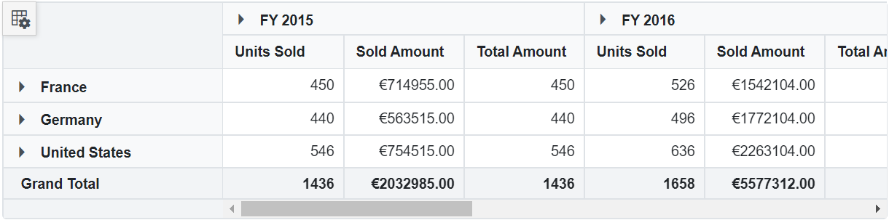
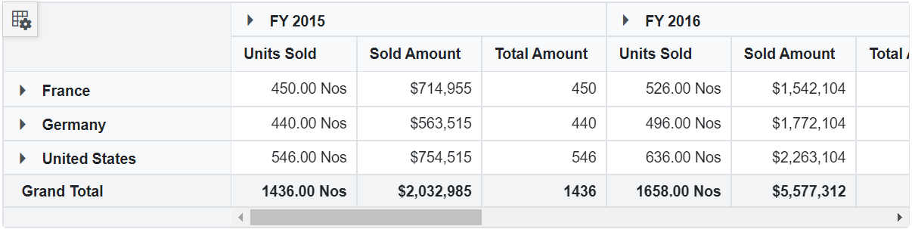
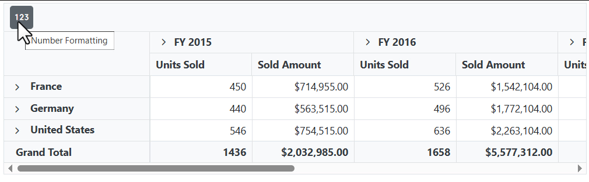

# Number Formatting in Blazor Pivot Table

The Pivot Table component lets you display numeric values in standard number, currency, percentage, or custom formats to match the reporting needs of your application.

## Supported format types

The Pivot Table component supports the following display formats for numeric values:

* **Number** - Standard numeric formatting with optional grouping separators and configurable decimal places.
* **Currency** - Formats currency values with appropriate symbols, optional grouping separators, and customizable decimal places.
* **Percentage** - Values displayed as percentages with the % symbol.
* **Custom** - User-defined formatting patterns for specific display requirements.

## Defining number format settings

To configure number formats for numeric values, use the [FormatSettings](https://help.syncfusion.com/cr/blazor/Syncfusion.Blazor.PivotView.PivotViewDataSourceSettings-1.html#Syncfusion_Blazor_PivotView_PivotViewDataSourceSettings_1_FormatSettings) property inside [PivotViewDataSourceSettings](https://help.syncfusion.com/cr/blazor/Syncfusion.Blazor.PivotView.PivotViewDataSourceSettings-1.html).

The following properties are available inside each `FormatSettings` entry:

### Essential formatting properties

| Property | Type | Description |
|----------|------|-------------|
| [Name](https://help.syncfusion.com/cr/blazor/Syncfusion.Blazor.PivotView.PivotViewFormatSetting.html#Syncfusion_Blazor_PivotView_PivotViewFormatSetting_Name) | `String` | The field name to which the formatting should be applied. |
| [Format](https://help.syncfusion.com/cr/blazor/Syncfusion.Blazor.PivotView.PivotViewFormatSetting.html#Syncfusion_Blazor_PivotView_PivotViewFormatSetting_Format) | `String` | The format pattern for the field. |

### Format type codes

Use these standard format codes as the value of the `Format` property. You can also append a digit to set the number of decimal places (e.g., `N2` for two decimal places).

1. **N** - Numeric formatting (e.g., `N` produces `1,234.56`; `N2` produces `1,234.56`).
2. **C** - Currency formatting (e.g., `C0` produces `$1,234`; the symbol is taken from the `currency` property).
3. **P** - Percentage formatting (e.g., `P1` produces `12.3%` for the value `0.1234`).

N> When no format is specified, the component applies numeric formatting by default.

### Additional formatting options

* [UseGrouping](https://help.syncfusion.com/cr/blazor/Syncfusion.Blazor.PivotView.PivotViewFormatSetting.html#Syncfusion_Blazor_PivotView_PivotViewFormatSetting_UseGrouping) (`boolean`, default `true`): Controls the display of grouping separators. When **true** (default), values display with separators (for example `$100,000,000`); when **false**, they display without separators (for example, `$100000000`).
* [Currency](https://help.syncfusion.com/cr/blazor/Syncfusion.Blazor.PivotView.PivotViewFormatSetting.html#Syncfusion_Blazor_PivotView_PivotViewFormatSetting_Currency) (`String`): The currency code to be considered for currency formatting (for example, `USD`, `EUR`, `GBP`).

```cshtml
@using Syncfusion.Blazor.PivotView

<SfPivotView TValue="ProductDetails">
    <PivotViewDataSourceSettings DataSource="@data">
        <PivotViewColumns>
            <PivotViewColumn Name="Year"></PivotViewColumn>
            <PivotViewColumn Name="Quarter"></PivotViewColumn>
        </PivotViewColumns>
        <PivotViewRows>
            <PivotViewRow Name="Country"></PivotViewRow>
            <PivotViewRow Name="Products"></PivotViewRow>
        </PivotViewRows>
        <PivotViewValues>
            <PivotViewValue Name="Sold" Caption="Units Sold"></PivotViewValue>
            <PivotViewValue Name="Amount" Caption="Sold Amount"></PivotViewValue>
        </PivotViewValues>
        <PivotViewFormatSettings>
            <PivotViewFormatSetting Name="Amount" Format="C2" UseGrouping="false" Currency='EUR'></PivotViewFormatSetting>
        </PivotViewFormatSettings>
    </PivotViewDataSourceSettings>
</SfPivotView>

@code{
    public List<ProductDetails> data { get; set; }
    protected override void OnInitialized()
    {
        this.data = ProductDetails.GetProductData().ToList();
        //Bind the data source collection here. Refer "Assigning sample data to the pivot table" section in getting started for more details.
    }
}

```



You can also format the values at runtime using the formatting dialog. This option can be enabled by setting the [AllowNumberFormatting](https://help.syncfusion.com/cr/blazor/Syncfusion.Blazor.PivotView.SfPivotView-1.html#Syncfusion_Blazor_PivotView_SfPivotView_1_AllowNumberFormatting) property to **true**. The same has been discussed in some of the upcoming topics.

N> **Important:** To use the runtime formatting dialog (and the toolbar option), include the `NumberFormatting` module in the Pivot Table:

## Custom format

Custom format lets you display numbers in your preferred pattern by setting the [Format](https://help.syncfusion.com/cr/blazor/Syncfusion.Blazor.PivotView.PivotViewFormatSetting.html#Syncfusion_Blazor_PivotView_PivotViewFormatSetting_Format) property within the [FormatSettings](https://help.syncfusion.com/cr/blazor/Syncfusion.Blazor.PivotView.PivotViewDataSourceSettings-1.html#Syncfusion_Blazor_PivotView_PivotViewDataSourceSettings_1_FormatSettings). You can use one or more format specifiers (shown in the table below) to control how values appear in the Pivot Table. The Input column shows the `format` value applied to the value `123` (except where noted).

| Specifier | Description | Input | Format Output |
| ------- |--------------- | ---------------- | --------------- |
| 0 | Replaces the zero with the corresponding digit if one is present. Otherwise, zero appears in the result string. | `{ format: '0000' }` | `'0123'` |
| # | Replaces the `#` symbol with the corresponding digit if one is present. Otherwise, no digit appears in the result string. | `{ format: '####' }` | `'1234'` |
| . | Denotes the number of digits permitted after the decimal point. | `{ format: '###0.##0#' }` | `'546321.000'` (value `546321`) |
| % | Percent specifier; multiplies the value by 100 and appends the `%` symbol. | `{ format: '0000 %' }` | `'0100 %'` (value `1`) |
| $ | Denotes currency formatting based on the global currency code specified in `currency`. | `{ format: '$ ###.00' }` | `'$ 13.00'` (value `13`) |
| ; | Denotes separate formats for positive, negative, and zero values. | `{ format: '###.##;(###.00);-0' }` | `'(120.00)'` (value `-120`) |
| `'String'` | Characters enclosed in single quotes are included literally in the result string. | `{ format: "####.00 '@'" }` | `'123.00 @'` (value `123`) |

N> When you define a custom format, certain properties such as [UseGrouping](https://help.syncfusion.com/cr/blazor/Syncfusion.Blazor.PivotView.PivotViewFormatSetting.html#Syncfusion_Blazor_PivotView_PivotViewFormatSetting_UseGrouping) and [Currency](https://help.syncfusion.com/cr/blazor/Syncfusion.Blazor.PivotView.PivotViewFormatSetting.html#Syncfusion_Blazor_PivotView_PivotViewFormatSetting_Currency) in the format settings will be ignored.

```cshtml
@using Syncfusion.Blazor.PivotView

<SfPivotView TValue="ProductDetails">
    <PivotViewDataSourceSettings DataSource="@data">
        <PivotViewColumns>
            <PivotViewColumn Name="Year"></PivotViewColumn>
            <PivotViewColumn Name="Quarter"></PivotViewColumn>
        </PivotViewColumns>
        <PivotViewRows>
            <PivotViewRow Name="Country"></PivotViewRow>
            <PivotViewRow Name="Products"></PivotViewRow>
        </PivotViewRows>
        <PivotViewValues>
            <PivotViewValue Name="Sold" Caption="Units Sold"></PivotViewValue>
            <PivotViewValue Name="Amount" Caption="Sold Amount"></PivotViewValue>
        </PivotViewValues>
        <PivotViewFormatSettings>
            <PivotViewFormatSetting Name="Amount" Format="C"></PivotViewFormatSetting>
            <PivotViewFormatSetting Name="Sold" Format="####.00 'Nos'"></PivotViewFormatSetting>
        </PivotViewFormatSettings>
    </PivotViewDataSourceSettings>
</SfPivotView>

@code{
    public List<ProductDetails> data { get; set; }
    protected override void OnInitialized()
    {
        this.data = ProductDetails.GetProductData().ToList();
        //Bind the data source collection here. Refer "Assigning sample data to the pivot table" section in getting started for more details.
    }
}

```



## Toolbar

Number formatting can be applied at runtime through the built-in dialog, accessible from the toolbar. To enable this, set both the [AllowNumberFormatting](https://help.syncfusion.com/cr/blazor/Syncfusion.Blazor.PivotView.SfPivotView-1.html#Syncfusion_Blazor_PivotView_SfPivotView_1_AllowNumberFormatting) and [ShowToolbar](https://help.syncfusion.com/cr/blazor/Syncfusion.Blazor.PivotView.SfPivotView-1.html#Syncfusion_Blazor_PivotView_SfPivotView_1_ShowToolbar) properties to **true**, include the `NumberFormatting` module, and add the `'NumberFormatting'` option to the [Toolbar](https://help.syncfusion.com/cr/blazor/Syncfusion.Blazor.PivotView.SfPivotView-1.html#Syncfusion_Blazor_PivotView_SfPivotView_1_Toolbar) property. The toolbar then displays the **Number Formatting** icon. Clicking this icon opens the dialog, where you can specify number formats for value fields directly within the Pivot Table.

```cshtml
@using Syncfusion.Blazor.PivotView

<SfPivotView @ref="pivot" TValue="ProductDetails" ShowToolbar="true" Toolbar="@toolbar" AllowNumberFormatting="true" Height="300" Width="800">
    <PivotViewDisplayOption Primary=Primary.Table View=View.Both></PivotViewDisplayOption>
    <PivotViewDataSourceSettings DataSource="@data">
        <PivotViewColumns>
            <PivotViewColumn Name="Year"></PivotViewColumn>
            <PivotViewColumn Name="Quarter"></PivotViewColumn>
        </PivotViewColumns>
        <PivotViewRows>
            <PivotViewRow Name="Country"></PivotViewRow>
            <PivotViewRow Name="Products"></PivotViewRow>
        </PivotViewRows>
        <PivotViewValues>
            <PivotViewValue Name="Sold" Caption="Units Sold"></PivotViewValue>
            <PivotViewValue Name="Amount" Caption="Sold Amount"></PivotViewValue>
        </PivotViewValues>
        <PivotViewFormatSettings>
            <PivotViewFormatSetting Name="Amount" Format="C"></PivotViewFormatSetting>
        </PivotViewFormatSettings>
    </PivotViewDataSourceSettings>
    <PivotViewEvents TValue="ProductDetails"></PivotViewEvents>
    <PivotViewGridSettings ColumnWidth="140"></PivotViewGridSettings>
</SfPivotView>
<style>
    .e-pivotview {
        min-height: 300px;
        width: 722px;
    }
</style>

@code{
    SfPivotView<ProductDetails> pivot;

    public List<ToolbarItems> toolbar = new List<ToolbarItems> {
        ToolbarItems.NumberFormatting
    };

    public List<ProductDetails> data { get; set; }
    protected override void OnInitialized()
    {
        this.data = ProductDetails.GetProductData().ToList();
        //Bind the data source collection here. Refer "Assigning sample data to the pivot table" section in getting started for more details.
    }
}

```



N> You can refer to the [Blazor Pivot Table](https://www.syncfusion.com/blazor-components/blazor-pivot-table) feature tour page for its groundbreaking feature representations. You can also explore the [Blazor Pivot Table example](https://blazor.syncfusion.com/demos/pivot-table/default-functionalities?theme=fluent2) to know how to render and configure the pivot table.