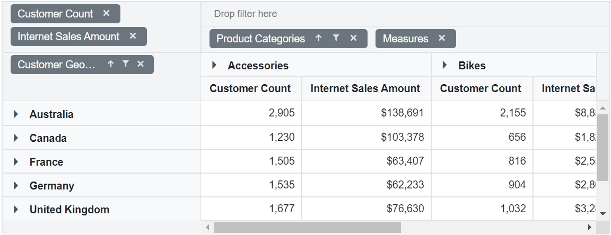
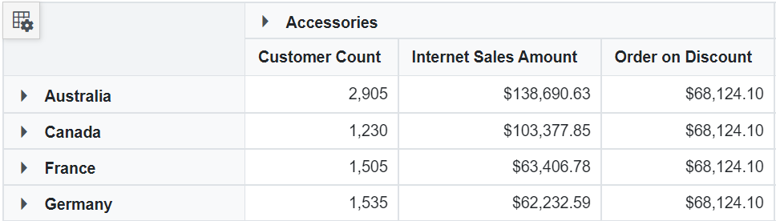
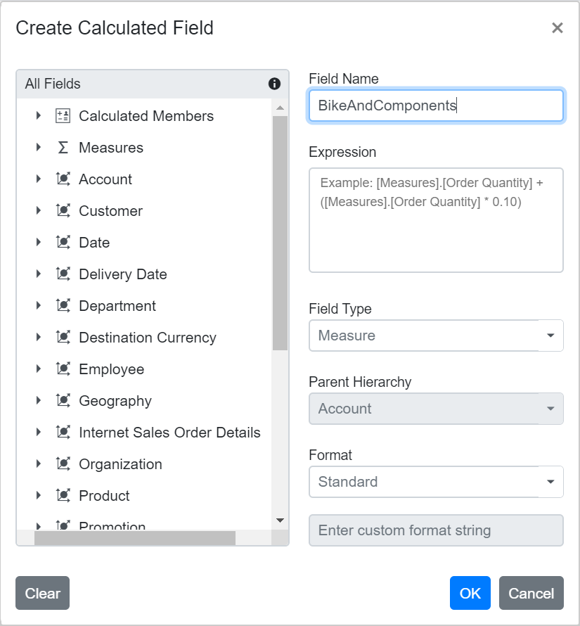
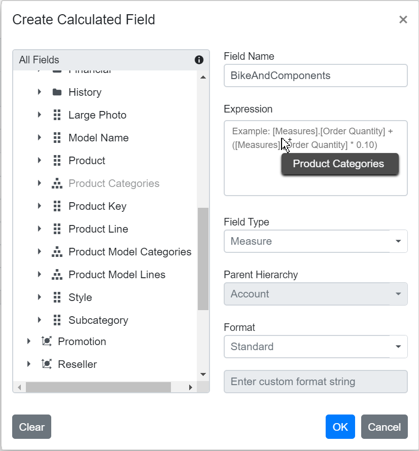
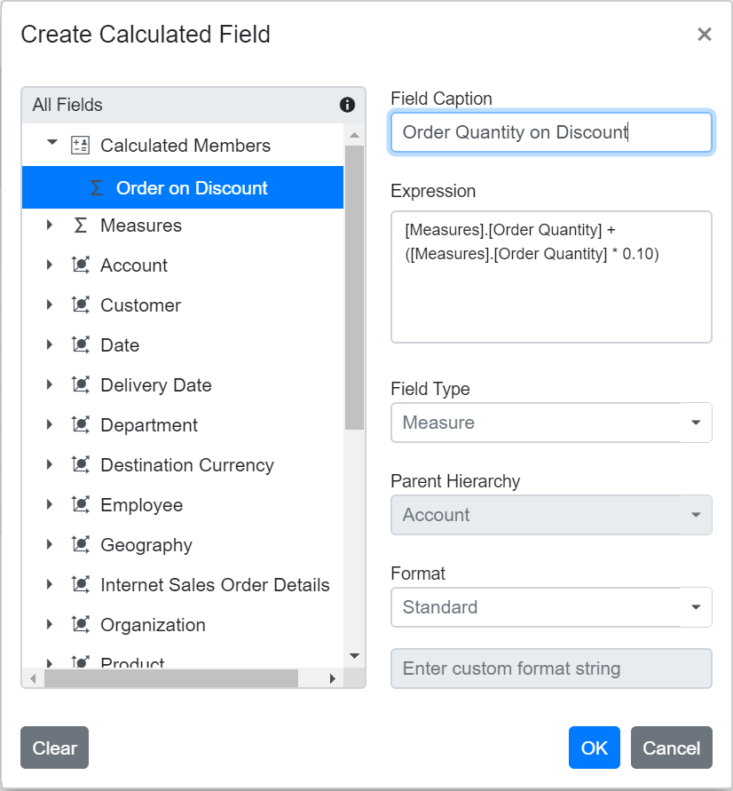
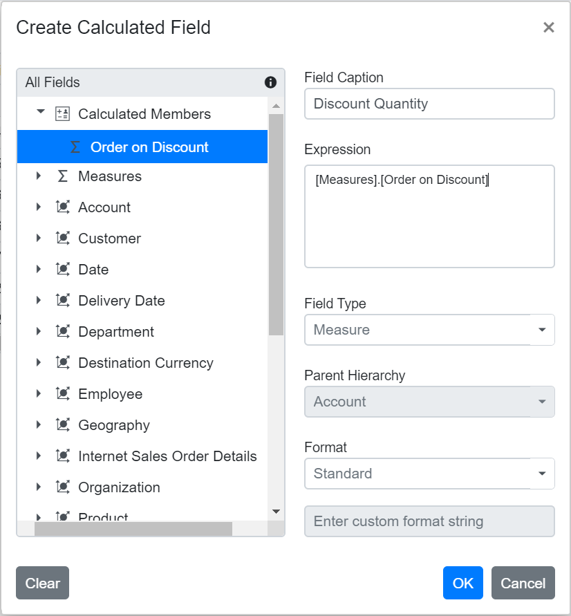
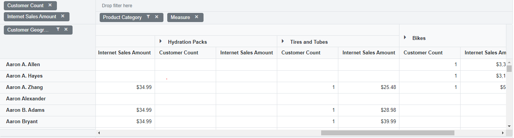
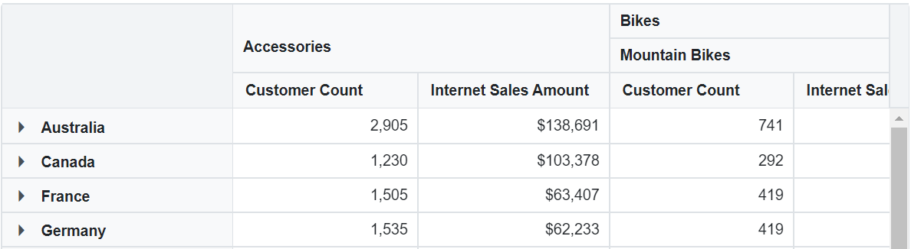
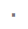

<!-- markdownlint-disable MD024 -->
<!-- markdownlint-disable MD012 -->

# OLAP in Blazor Pivot Table component

## Getting Started


This section briefly explains about how to create a simple [Blazor Pivot Table](https://www.syncfusion.com/blazor-components/blazor-pivot-table) with OLAP data source. You can refer [Getting Started with Syncfusion<sup style="font-size:70%">&reg;</sup> Blazor for Client-Side in Visual Studio 2022](https://blazor.syncfusion.com/documentation/getting-started/blazor-web-app) page for the introduction and for configuring the common specifications.

### Importing Syncfusion<sup style="font-size:70%">&reg;</sup> Blazor component package in the application

Install **Syncfusion.Blazor** NuGet package to the application by using the `NuGet Package Manager`. Ensure to check the Include **prerelease** option.

### Initializing pivot table component in an application

The Syncfusion<sup style="font-size:70%">&reg;</sup> Pivot Table component can be initialized in any razor page inside `~/Pages` folder. Here, the pivot table component is initialized inside `~/Pages/Index.razor` page. In a new application, if `Index.razor` page has any default content template, then those content can be completely removed and the following code can be added.

```cshtml
@using Syncfusion.Blazor.PivotView

<SfPivotView TValue="ProductDetails"></SfPivotView>

```

### Assigning olap data to the pivot table

The [Blazor Pivot Table](https://www.syncfusion.com/blazor-components/blazor-pivot-table) component further needs to be populated with an appropriate data source. For illustration purpose, a collection of objects mentioning the sales details of certain products over a period and region has been prepared. This sample data is assigned to the pivot table component through [PivotViewDataSourceSettings](https://help.syncfusion.com/cr/blazor/Syncfusion.Blazor.PivotView.PivotViewDataSourceSettings-1.html) class.
Refer [here](#data-binding) to know the more details about OLAP data binding.

```cshtml

@using Syncfusion.Blazor.PivotView

<SfPivotView TValue="ProductDetails">
    <PivotViewDataSourceSettings TValue="ProductDetails" ProviderType="ProviderType.SSAS" Catalog="Adventure Works DW 2008 SE"Cube="Adventure Works" Url="https:/bi.syncfusion.com/olap/msmdpump.dll" LocaleIdentifier="1033"EnableSorting="true"></PivotViewDataSourceSettings>
</SfPivotView>

```

### Adding OLAP cube elements to row, column, value and filter axes

Now that the pivot table is initialized and assigned with sample OLAP data source, it will further move to showcase the component by organizing appropriate [OLAP cube elements](#olap-cube-elements) in [PivotViewRows](https://help.syncfusion.com/cr/blazor/Syncfusion.Blazor.PivotView.PivotViewRow.html), [PivotViewColumns](https://help.syncfusion.com/cr/blazor/Syncfusion.Blazor.PivotView.PivotViewColumn.html), [PivotViewValues](https://help.syncfusion.com/cr/blazor/Syncfusion.Blazor.PivotView.PivotViewValue.html) and [PivotViewFilters](https://help.syncfusion.com/cr/blazor/Syncfusion.Blazor.PivotView.PivotViewFilter.html) axes.


In [PivotViewDataSourceSettings](https://help.syncfusion.com/cr/blazor/Syncfusion.Blazor.PivotView.PivotViewDataSourceSettings-1.html) class, four major axes -  [PivotViewRows](https://help.syncfusion.com/cr/blazor/Syncfusion.Blazor.PivotView.PivotViewRow.html), [PivotViewColumns](https://help.syncfusion.com/cr/blazor/Syncfusion.Blazor.PivotView.PivotViewColumn.html), [PivotViewValues](https://help.syncfusion.com/cr/blazor/Syncfusion.Blazor.PivotView.PivotViewValue.html) and [PivotViewFilters](https://help.syncfusion.com/cr/blazor/Syncfusion.Blazor.PivotView.PivotViewFilter.html) plays a vital role in defining and organizing  [OLAP cube elements](#olap-cube-elements) from the bound data source, to render the entire pivot table component in a desired format.

[PivotViewRows](https://help.syncfusion.com/cr/blazor/Syncfusion.Blazor.PivotView.PivotViewRow.html) – – Collection of [OLAP cube elements](#olap-cube-elements) (such as Hierarchies, NamedSet, Calculated Members etc.,) that needs to be displayed in row axis of the pivot table.

[PivotViewColumns](https://help.syncfusion.com/cr/blazor/Syncfusion.Blazor.PivotView.PivotViewColumn.html) – – Collection of [OLAP cube elements](#olap-cube-elements) (such as Hierarchies, NamedSet, Calculated Members etc.,) that needs to be displayed in column axis of the pivot table.

[PivotViewValues](https://help.syncfusion.com/cr/blazor/Syncfusion.Blazor.PivotView.PivotViewValue.html) – – Collection of [OLAP cube elements](#olap-cube-elements) (such as Measures, Calculated Measures) that needs to be displayed as aggregated numeric values in the pivot table.

[PivotViewFilters](https://help.syncfusion.com/cr/blazor/Syncfusion.Blazor.PivotView.PivotViewFilter.html) – – Collection of [OLAP cube elements](#olap-cube-elements) (such as Hierarchies and Calculated Members) that would act as master filter over the data bound in row, column and value axes of the pivot table.

In-order to define each [OLAP cube element](#olap-cube-elements) in the respective axis, the following basic properties should be set.

* [Name](https://help.syncfusion.com/cr/blazor/Syncfusion.Blazor.PivotView.PivotViewRow.html#Syncfusion_Blazor_PivotView_PivotViewRow_Name): It allows to set the unique name of the hierarchies, named set, measures, calculated members etc., from the bound OLAP data source. It’s casing should match exactly like in the data source and if not set properly, the pivot table will be rendered as empty.
* [Caption](https://help.syncfusion.com/cr/blazor/Syncfusion.Blazor.PivotView.PivotViewRow.html#Syncfusion_Blazor_PivotView_PivotViewRow_Caption): It allows to set the caption, which is the alias name of the unique name that needs to be displayed in the pivot table. If not provided, unique name will be displayed.

In this sample, "Product Categories" is added in column, "Customer Geography" in row, and "Customer Count" and "Internet Sales Amount" in value axes respectively.


```cshtml

@using Syncfusion.Blazor.PivotView

<SfPivotView TValue="ProductDetails"  Width="800" Height="350" >
    <PivotViewDataSourceSettings TValue="ProductDetails" ProviderType="ProviderType.SSAS" Catalog="Adventure Works DW 2008 SE" Cube="Adventure Works" Url="https://bi.syncfusion.com/olap/msmdpump.dll" LocaleIdentifier="1033" EnableSorting="true">
        <PivotViewColumns>
            <PivotViewColumn Name="[Product].[Product Categories]" Caption="Product Category"></PivotViewColumn>
            <PivotViewColumn Name="[Measures]" Caption="Measure"></PivotViewColumn>
        </PivotViewColumns>
        <PivotViewRows>
            <PivotViewRow Name="[Customer].[Customer Geography]" Caption="Customer Geography"></PivotViewRow>
        </PivotViewRows>
        <PivotViewValues>
            <PivotViewValue Name="[Measures].[Customer Count]" Caption="Customer Count"></PivotViewValue>
            <PivotViewValue Name="[Measures].[Internet Sales Amount]" Caption="Internet Sales Amount"></PivotViewValue>
        </PivotViewValues>
    </PivotViewDataSourceSettings>
    <PivotViewGridSettings ColumnWidth="160"></PivotViewGridSettings>
</SfPivotView>
<style>
    .e-pivotview {
        min-height: 200px;
    }
</style>

@code{
    public class ProductDetails
    {
        public int Sold { get; set; }
        public double Amount { get; set; }
        public string Country { get; set; }
        public string Products { get; set; }
        public string Year { get; set; }
        public string Quarter { get; set; }
    }
}

```

### Applying formatting to measures

Formatting defines a way in which values should be displayed in pivot table. For example, format **"C0"** denotes the values should be displayed in currency pattern without decimal points. To do so, define the [PivotViewFormatSetting](https://help.syncfusion.com/cr/blazor/Syncfusion.Blazor.PivotView.PivotViewFormatSetting.html) with its [Name](https://help.syncfusion.com/cr/blazor/Syncfusion.Blazor.PivotView.PivotViewFormatSetting.html#Syncfusion_Blazor_PivotView_PivotViewFormatSetting_Name) and [Format](https://help.syncfusion.com/cr/blazor/Syncfusion.Blazor.PivotView.PivotViewFormatSetting.html#Syncfusion_Blazor_PivotView_PivotViewFormatSetting_Format) properties. In this sample, the [Name](https://help.syncfusion.com/cr/blazor/Syncfusion.Blazor.PivotView.PivotViewFormatSetting.html#Syncfusion_Blazor_PivotView_PivotViewFormatSetting_Name) property is set as "[Measures].[Internet Sales Amount]", a measure from the value axis and its [Format](https://help.syncfusion.com/cr/blazor/Syncfusion.Blazor.PivotView.PivotViewFormatSetting.html#Syncfusion_Blazor_PivotView_PivotViewFormatSetting_Format) is set as "C0". Likewise, it can be formatted for the other measures as well.

N> Only measures from [PivotViewValues](https://help.syncfusion.com/cr/blazor/Syncfusion.Blazor.PivotView.PivotViewValue.html) axis, which is in the form of numeric data values are applicable for formatting.


```cshtml

@using Syncfusion.Blazor.PivotView

<SfPivotView TValue="ProductDetails"  Width="800" Height="350" >
    <PivotViewDataSourceSettings TValue="ProductDetails" ProviderType="ProviderType.SSAS" Catalog="Adventure Works DW 2008 SE" Cube="Adventure Works" Url="https://bi.syncfusion.com/olap/msmdpump.dll" LocaleIdentifier="1033" EnableSorting="true">
        <PivotViewColumns>
            <PivotViewColumn Name="[Product].[Product Categories]" Caption="Product Category"></PivotViewColumn>
            <PivotViewColumn Name="[Measures]" Caption="Measure"></PivotViewColumn>
        </PivotViewColumns>
        <PivotViewRows>
            <PivotViewRow Name="[Customer].[Customer Geography]" Caption="Customer Geography"></PivotViewRow>
        </PivotViewRows>
        <PivotViewValues>
            <PivotViewValue Name="[Measures].[Customer Count]" Caption="Customer Count"></PivotViewValue>
            <PivotViewValue Name="[Measures].[Internet Sales Amount]" Caption="Internet Sales Amount"></PivotViewValue>
        </PivotViewValues>
        <PivotViewFormatSettings>
            <PivotViewFormatSetting Name="[Measures].[Internet Sales Amount]" Format="C"></PivotViewFormatSetting>
        </PivotViewFormatSettings>
    </PivotViewDataSourceSettings>
    <PivotViewGridSettings ColumnWidth="160"></PivotViewGridSettings>
</SfPivotView>
<style>
    .e-pivotview {
        min-height: 200px;
    }
</style>

@code{
    public class ProductDetails
    {
        public int Sold { get; set; }
        public double Amount { get; set; }
        public string Country { get; set; }
        public string Products { get; set; }
        public string Year { get; set; }
        public string Quarter { get; set; }
    }
}

```

After successful compilation of the application, simply press F5 to run the same. The pivot table component will render in the default web browser.


### Enable pivot field list

The component provides a built-in Field List similar to Microsoft Excel. It allows to add or remove [OLAP cube elements](#olap-cube-elements) and also rearranges the [OLAP cube elements](#olap-cube-elements) between different axes, including [PivotViewRows](https://help.syncfusion.com/cr/blazor/Syncfusion.Blazor.PivotView.PivotViewRow.html), [PivotViewColumns](https://help.syncfusion.com/cr/blazor/Syncfusion.Blazor.PivotView.PivotViewColumn.html), [PivotViewValues](https://help.syncfusion.com/cr/blazor/Syncfusion.Blazor.PivotView.PivotViewValue.html) and [PivotViewFilters](https://help.syncfusion.com/cr/blazor/Syncfusion.Blazor.PivotView.PivotViewFilter.html) along with the filter and sort options dynamically at runtime. It can be enabled by setting the [ShowFieldList](https://help.syncfusion.com/cr/blazor/Syncfusion.Blazor.PivotView.SfPivotView-1.html#Syncfusion_Blazor_PivotView_SfPivotView_1_ShowFieldList) property to **true** as follows. To know more about the field list, [refer](./field-list) here.


```cshtml

@using Syncfusion.Blazor.PivotView

<SfPivotView TValue="ProductDetails" ShowFieldList="true" Width="800" Height="350" >
    <PivotViewDataSourceSettings TValue="ProductDetails" ProviderType="ProviderType.SSAS" Catalog="Adventure Works DW 2008 SE" Cube="Adventure Works" Url="https://bi.syncfusion.com/olap/msmdpump.dll" LocaleIdentifier="1033" EnableSorting="true">
        <PivotViewColumns>
            <PivotViewColumn Name="[Product].[Product Categories]" Caption="Product Category"></PivotViewColumn>
            <PivotViewColumn Name="[Measures]" Caption="Measure"></PivotViewColumn>
        </PivotViewColumns>
        <PivotViewRows>
            <PivotViewRow Name="[Customer].[Customer Geography]" Caption="Customer Geography"></PivotViewRow>
        </PivotViewRows>
        <PivotViewValues>
            <PivotViewValue Name="[Measures].[Customer Count]" Caption="Customer Count"></PivotViewValue>
            <PivotViewValue Name="[Measures].[Internet Sales Amount]" Caption="Internet Sales Amount"></PivotViewValue>
        </PivotViewValues>
        <PivotViewFormatSettings>
            <PivotViewFormatSetting Name="[Measures].[Internet Sales Amount]" Format="C0"></PivotViewFormatSetting>
        </PivotViewFormatSettings>
    </PivotViewDataSourceSettings>
    <PivotViewGridSettings ColumnWidth="160"></PivotViewGridSettings>
</SfPivotView>
<style>
    .e-pivotview {
        min-height: 200px;
    }
</style>

@code{
    public class ProductDetails
    {
        public int Sold { get; set; }
        public double Amount { get; set; }
        public string Country { get; set; }
        public string Products { get; set; }
        public string Year { get; set; }
        public string Quarter { get; set; }
    }
}

```


<br/>


### Enable grouping bar

The Grouping Bar feature automatically populates [OLAP cube elements](#olap-cube-elements) from the bound data source and allows end users to drag [OLAP cube elements](#olap-cube-elements) between different axes such as [PivotViewRows](https://help.syncfusion.com/cr/blazor/Syncfusion.Blazor.PivotView.PivotViewRow.html), [PivotViewColumns](https://help.syncfusion.com/cr/blazor/Syncfusion.Blazor.PivotView.PivotViewColumn.html), [PivotViewValues](https://help.syncfusion.com/cr/blazor/Syncfusion.Blazor.PivotView.PivotViewValue.html) and [PivotViewFilters](https://help.syncfusion.com/cr/blazor/Syncfusion.Blazor.PivotView.PivotViewFilter.html) along with the filter and sort options dynamically at runtime. It can be enabled by setting the [ShowGroupingBar](https://help.syncfusion.com/cr/blazor/Syncfusion.Blazor.PivotView.SfPivotView-1.html#Syncfusion_Blazor_PivotView_SfPivotView_1_ShowGroupingBar) property to **true** as follows. To know more about grouping bar, [refer](./grouping-bar) here.

```cshtml

@using Syncfusion.Blazor.PivotView

<SfPivotView TValue="ProductDetails" ShowGroupingBar="true" Width="800" Height="350" >
    <PivotViewDataSourceSettings TValue="ProductDetails" ProviderType="ProviderType.SSAS" Catalog="Adventure Works DW 2008 SE" Cube="Adventure Works" Url="https://bi.syncfusion.com/olap/msmdpump.dll" LocaleIdentifier="1033" EnableSorting="true">
        <PivotViewColumns>
            <PivotViewColumn Name="[Product].[Product Categories]" Caption="Product Category"></PivotViewColumn>
            <PivotViewColumn Name="[Measures]" Caption="Measure"></PivotViewColumn>
        </PivotViewColumns>
        <PivotViewRows>
            <PivotViewRow Name="[Customer].[Customer Geography]" Caption="Customer Geography"></PivotViewRow>
        </PivotViewRows>
        <PivotViewValues>
            <PivotViewValue Name="[Measures].[Customer Count]" Caption="Customer Count"></PivotViewValue>
            <PivotViewValue Name="[Measures].[Internet Sales Amount]" Caption="Internet Sales Amount"></PivotViewValue>
        </PivotViewValues>
        <PivotViewFormatSettings>
            <PivotViewFormatSetting Name="[Measures].[Internet Sales Amount]" Format="C0"></PivotViewFormatSetting>
        </PivotViewFormatSettings>
    </PivotViewDataSourceSettings>
    <PivotViewGridSettings ColumnWidth="160"></PivotViewGridSettings>
</SfPivotView>
<style>
    .e-pivotview {
        min-height: 200px;
    }
</style>

@code{
    public class ProductDetails
    {
        public int Sold { get; set; }
        public double Amount { get; set; }
        public string Country { get; set; }
        public string Products { get; set; }
        public string Year { get; set; }
        public string Quarter { get; set; }
    }
}

```



### Exploring filter axis

The filter axis contains collection of [OLAP cube elements](#olap-cube-elements) such as hierarchies and calculated members that would act as master filter over the data bound in [PivotViewRows](https://help.syncfusion.com/cr/blazor/Syncfusion.Blazor.PivotView.PivotViewRow.html), [PivotViewColumns](https://help.syncfusion.com/cr/blazor/Syncfusion.Blazor.PivotView.PivotViewColumn.html),  and [PivotViewValues](https://help.syncfusion.com/cr/blazor/Syncfusion.Blazor.PivotView.PivotViewValue.html) axes of the pivot table. The [OLAP cube elements](#olap-cube-elements) along with the filter members could be set to filter axis either through report via code behind or by dragging and dropping [OLAP cube elements](#olap-cube-elements) from other axes to filter axis via grouping bar or field list at runtime.


 ```cshtml

@using Syncfusion.Blazor.PivotView

<SfPivotView TValue="ProductDetails" ShowGroupingBar="true" ShowFieldList="true">
      <PivotViewDataSourceSettings TValue="ProductDetails"  Catalog="Adventure Works DW 2008 SE" Cube="Adventure Works" url="https://bi.syncfusion.com/olap/msmdpump.dll" ProviderType="ProviderType.SSAS" EnableSorting=true>
        <PivotViewColumns>
            <PivotViewColumn Name="[Product].[Product Categories]" Caption="Product Categories"></PivotViewColumn>
            <PivotViewColumn Name="[Measures]" Caption="Measures"></PivotViewColumn>
        </PivotViewColumns>
        <PivotViewRows>
            <PivotViewRow Name="[Customer].[Customer Geography]" Caption="Customer Geography"></PivotViewRow>
        </PivotViewRows>
        <PivotViewValues>
            <PivotViewValue Name="[Measures].[Customer Count]" Caption="Customer Count"></PivotViewValue>
            <PivotViewValue Name="[Measures].[Internet Sales Amount]" Caption="Internet Sales Amount"></PivotViewValue>
        </PivotViewValues>
        <PivotViewFilters>
            <PivotViewFilter Name="[Date].[Fiscal]" Caption="Date Fiscal"></PivotViewFilter>
        </PivotViewFilters>
    </PivotViewDataSourceSettings>
</SfPivotView>

@code{
    public class ProductDetails
    {
        public int Sold { get; set; }
        public double Amount { get; set; }
        public string Country { get; set; }
        public string Products { get; set; }
        public string Year { get; set; }
        public string Quarter { get; set; }
    }
}

```


<br/>
<br/>
<br/>


### Calculated Field

The calculated field allows user to insert or add a new calculated field based on the available [OLAP cube elements](#olap-cube-elements) from the bound data source. Calculated fields are nothing but customized dimensions or measures that are newly created based on the user-defined expression.

The two types of calculated fields are as follows:

* **Calculated Measure** – Creates a new measure through user-defined expression.
* **Calculated Dimension** – Creates a new dimension through user-defined expression.

It can be customized using the [PivotViewCalculatedFieldSetting](https://help.syncfusion.com/cr/blazor/Syncfusion.Blazor.PivotView.PivotViewCalculatedFieldSetting.html) property through the code behind. The setting required to calculate field feature at code behind are:
* [Name](https://help.syncfusion.com/cr/blazor/Syncfusion.Blazor.PivotView.PivotViewCalculatedFieldSetting.html#Syncfusion_Blazor_PivotView_PivotViewCalculatedFieldSetting_Name): It allows to set the unique name for new calculated field.
* [Formula](https://help.syncfusion.com/cr/blazor/Syncfusion.Blazor.PivotView.PivotViewCalculatedFieldSetting.html#Syncfusion_Blazor_PivotView_PivotViewCalculatedFieldSetting_Formula): It allows to set the user-defined expression.
* [HierarchyUniqueName](https://help.syncfusion.com/cr/blazor/Syncfusion.Blazor.PivotView.PivotViewCalculatedFieldSetting.html#Syncfusion_Blazor_PivotView_PivotViewCalculatedFieldSetting_HierarchyUniqueName) : It allows to specify dimension unique name whose hierarchies alone should be used in the expression. This will be applicable only for calculated dimension.
* [FormatString](https://help.syncfusion.com/cr/blazor/Syncfusion.Blazor.PivotView.PivotViewCalculatedFieldSetting.html#Syncfusion_Blazor_PivotView_PivotViewCalculatedFieldSetting_FormatString) : It allows to set the format string for the resultant calculated field.

You need to set [IsCalculatedField](https://help.syncfusion.com/cr/blazor/Syncfusion.Blazor.PivotView.PivotViewRow.html#Syncfusion_Blazor_PivotView_PivotViewRow_IsCalculatedField) property to true, while adding calculated fields to respective axis through code behind.

Also calculated fields can be added at run time through the built-in dialog. The dialog can be enabled by setting the [AllowCalculatedField](https://help.syncfusion.com/cr/blazor/Syncfusion.Blazor.PivotView.SfPivotView-1.html#Syncfusion_Blazor_PivotView_SfPivotView_1_AllowCalculatedField) property to **true** as follows. You will see a button enabled in the Field List UI automatically to invoke the calculated field dialog and perform necessary operation.

N> Calculated measure can be added only in value axis.

```cshtml

@using Syncfusion.Blazor.PivotView

<SfPivotView TValue="ProductDetails" ShowFieldList="true" AllowCalculatedField="true" Width="800" Height="350" >
<PivotViewDataSourceSettings TValue="ProductDetails" ProviderType="ProviderType.SSAS" Catalog="Adventure Works DW 2008 SE" Cube="Adventure Works" Url="https://bi.syncfusion.com/olap/msmdpump.dll" LocaleIdentifier="1033" EnableSorting="true">
    <PivotViewColumns>
        <PivotViewColumn Name="[Product].[Product Categories]" Caption="Product Categories"></PivotViewColumn>
        <PivotViewColumn Name="[Measures]" Caption="Measures"></PivotViewColumn>
    </PivotViewColumns>
    <PivotViewRows>
        <PivotViewRow Name="[Customer].[Customer Geography]" Caption="Customer Geography"></PivotViewRow>
    </PivotViewRows>
    <PivotViewValues>
        <PivotViewValue Name="[Measures].[Customer Count]" Caption="Customer Count"></PivotViewValue>
        <PivotViewValue Name="[Measures].[Internet Sales Amount]" Caption="Internet Sales Amount"></PivotViewValue>
        <PivotViewValue Name="Order on Discount" IsCalculatedField="true"></PivotViewValue>
    </PivotViewValues>
    <PivotViewFilters>
        <PivotViewFilter Name="[Date].[Fiscal]" Caption="Date Fiscal"></PivotViewFilter>
    </PivotViewFilters>
    <PivotViewCalculatedFieldSettings>
        <PivotViewCalculatedFieldSetting Name="BikeAndComponents" Formula="([Product].[Product Categories].[Category].[Bikes] + [Product].[Product Categories].[Category].[Components])" HierarchyUniqueName="[Product].[Product Categories]" FormatString="Standard"></PivotViewCalculatedFieldSetting>
        <PivotViewCalculatedFieldSetting Name="Order on Discount" Formula="[Measures].[Order Quantity] + ([Measures].[Order Quantity] * 0.10)" FormatString="Currency"></PivotViewCalculatedFieldSetting>
    </PivotViewCalculatedFieldSettings>
</PivotViewDataSourceSettings>
<PivotViewGridSettings ColumnWidth="160"></PivotViewGridSettings>
</SfPivotView>
@code{
    public class ProductDetails
    {
        public int Sold { get; set; }
        public double Amount { get; set; }
        public string Country { get; set; }
        public string Products { get; set; }
        public string Year { get; set; }
        public string Quarter { get; set; }
    }
}

```


<br/>

Users can add a calculated field at runtime through the built-in dialog by using the following steps.

**Step 1:** Click the "Calculated Field" button in the field list dialog positioned at the top right corner. The calculated field dialog will be opened now. Enter the name of the calculated field to be created.
<br/>
<br/>

<br/>
<br/>

<br/>
<br/>
**Step 2:** Frame the expression by dragging and dropping the fields from the tree view on the left side of the dialog using simple arithmetic operators. **Example:** "IIF([Measures].[Internet Sales Amount]^0.5 > 100, [Measures].[Internet Sales Amount]*100, [Measures].[Internet Sales Amount]/100)". Refer here to learn more about the supported [operators](https://learn.microsoft.com/en-us/sql/mdx/operators-mdx-syntax?view=sql-server-ver15) and [functions](https://learn.microsoft.com/en-us/sql/mdx/functions-mdx-syntax?view=sql-server-ver15) to frame the expression.
<br/>
<br/>

<br/>
<br/>
**Step 3:** Confirm the type of the field to be created - calculated measure or calculated dimension.
<br/>
<br/>

<br/>
<br/>
**Step 4:** Choose the parent hierarchy of the calculated field. NOTE: It is only applicable to the calculated dimension.
<br/>
<br/>

<br/>
<br/>
**Step 5:** Then select the format string from the drop-down list and finally click "OK".
<br/>
<br/>

<br/>
<br/>

#### Format String

Allows you to specify the required format string while creating new calculated field. Supported format strings are:

* **Standard** - Denotes the numeric type.
* **Currency** - Denotes the currency type.
* **Percent** - Denotes the percentage type.
* **Custom** - Denotes the custom format. For example: "###0.##0#". This shows the value "9584.3" as "9584.300."

By default, **Standard** will be selected from the drop down list.


#### Renaming the existing calculated field

Existing calculated field can be renamed only through the UI at runtime. To do so, open the calculated field dialog, click the target field. User can now see the existing name getting displayed in the text box at the top of the dialog. Now, change the name based on the user requirement and click "OK".

<!-- markdownlint-disable MD012 -->

<br/>
<br/>


#### Editing the existing calculated field formula

Existing calculated field formula can be edited only through the UI at runtime. To do so, open the calculated field dialog, click the target field. User can now see the existing expression getting displayed in a "Expression" section. Now, change the expression based on the user requirement and click "OK".


<br/>
<br/>


#### Reusing the existing formula in a new calculated field

While creating a new calculated field, if user wants to the add the formula of an existing calculated field, it can be done easily. To do so, simply drag-and-drop the existing calculated field to the "Expression" section.


<br/>
<br/>

<br/>
<br/>


#### Modifying the existing format string

Existing calculated field's format string can be modified only through the UI at runtime. To do so, open the calculated field dialog and click the target calculated field. User can now see the format string for the existing calculated field getting displayed in a drop-down list. Change the format string based on the requirement and finally click "OK".


<br/>
<br/>


#### Clearing the changes while editing the calculated field

Previous changes can be cleared by using the "Clear" option while performing operations such as creating and editing the calculated field. To do so, click the "Clear" button in the bottom left corner of the dialog.


### Virtual Scrolling

Allows large amounts of data to be loaded without any performance degradation by rendering rows and columns in relation to the current viewport. Rest of the data will be brought into the viewport dynamically based on the vertical or horizontal scroll position. This feature can be enabled by setting the [EnableVirtualization](https://help.syncfusion.com/cr/blazor/Syncfusion.Blazor.PivotView.SfPivotView-1.html#Syncfusion_Blazor_PivotView_SfPivotView_1_EnableVirtualization) property in the [SfPivotView](https://help.syncfusion.com/cr/blazor/Syncfusion.Blazor.PivotView.SfPivotView-1.html) class to **true**.

To use the virtual scrolling feature, inject the `VirtualScroll` module into the pivot table.


```cshtml

@using Syncfusion.Blazor.PivotView

<SfPivotView TValue="ProductDetails"  Width="800" Height="350" EnableVirtualization="true" ShowGroupingBar="true">
    <PivotViewDataSourceSettings TValue="ProductDetails" ProviderType="ProviderType.SSAS" Catalog="Adventure Works DW 2008 SE" Cube="Adventure Works" Url="https://bi.syncfusion.com/olap/msmdpump.dll" LocaleIdentifier="1033" EnableSorting="true">
        <PivotViewColumns>
            <PivotViewColumn Name="[Product].[Product Categories]" Caption="Product Category"></PivotViewColumn>
            <PivotViewColumn Name="[Measures]" Caption="Measure"></PivotViewColumn>
        </PivotViewColumns>
        <PivotViewRows>
            <PivotViewRow Name="[Customer].[Customer]" Caption="Customer"></PivotViewRow>
        </PivotViewRows>
        <PivotViewValues>
            <PivotViewValue Name="[Measures].[Customer Count]" Caption="Customer Count"></PivotViewValue>
            <PivotViewValue Name="[Measures].[Internet Sales Amount]" Caption="Internet Sales Amount"></PivotViewValue>
        </PivotViewValues>
        <PivotViewFormatSettings>
            <PivotViewFormatSetting Name="[Measures].[Internet Sales Amount]" Format="C0"></PivotViewFormatSetting>
        </PivotViewFormatSettings>
    </PivotViewDataSourceSettings>
    <PivotViewGridSettings ColumnWidth="160"></PivotViewGridSettings>
</SfPivotView>
<style>
    .e-pivotview {
        min-height: 200px;
    }
</style>

@code{
    public class ProductDetails
    {
        public int Sold { get; set; }
        public double Amount { get; set; }
        public string Country { get; set; }
        public string Products { get; set; }
        public string Year { get; set; }
        public string Quarter { get; set; }
    }
}

```



#### Limitations for virtual scrolling

* In virtual scrolling, the [ColumnWidth](https://help.syncfusion.com/cr/blazor/Syncfusion.Blazor.PivotView.PivotViewGridSettings.html#Syncfusion_Blazor_PivotView_PivotViewGridSettings_ColumnWidth) property in [GridSettings](https://help.syncfusion.com/cr/blazor/Syncfusion.Blazor.PivotView.PivotViewGridSettings.html) should be in pixels, and percentage values are not accepted.
* Resizing columns or setting width to individual columns affects the calculation used to pick the correct page on scrolling.
* When using OLAP data, subtotals and grand totals are only displayed when measures are bound at the last position in the [rows](https://help.syncfusion.com/cr/blazor/Syncfusion.Blazor.PivotView.PivotViewDataSourceSettings-1.html#Syncfusion_Blazor_PivotView_PivotViewDataSourceSettings_1_Rows) or [columns](https://help.syncfusion.com/cr/blazor/Syncfusion.Blazor.PivotView.PivotViewDataSourceSettings-1.html#Syncfusion_Blazor_PivotView_PivotViewDataSourceSettings_1_Columns) axis. Otherwise, the data from the pivot table will be shown without summary totals.
* When the pivot table's width and height are large, the loading data count in the current, previous, and next viewports (pages) will also increase, affecting performance.
## Data Binding

To bind OLAP datasource to the pivot table, you need to specify the following properties under the [PivotViewDataSourceSettings](https://help.syncfusion.com/cr/blazor/Syncfusion.Blazor.PivotView.PivotViewDataSourceSettings-1.html) option.

| Properties|Description |
|-----|-----|
| [Cube](https://help.syncfusion.com/cr/blazor/Syncfusion.Blazor.PivotView.PivotViewDataSourceSettings-1.html#Syncfusion_Blazor_PivotView_PivotViewDataSourceSettings_1_Cube)| Points the respective cube name from OLAP database.|
| [ProviderType](https://help.syncfusion.com/cr/blazor/Syncfusion.Blazor.PivotView.PivotViewDataSourceSettings-1.html#Syncfusion_Blazor_PivotView_PivotViewDataSourceSettings_1_ProviderType)| Points the provider type for pivot table to identify the type of data source.|
| [Url](https://help.syncfusion.com/cr/blazor/Syncfusion.Blazor.PivotView.PivotViewDataSourceSettings-1.html#Syncfusion_Blazor_PivotView_PivotViewDataSourceSettings_1_Url)| Contains the cube URL for establishing the connection (online).|
| [Catalog](https://help.syncfusion.com/cr/blazor/Syncfusion.Blazor.PivotView.PivotViewDataSourceSettings-1.html#Syncfusion_Blazor_PivotView_PivotViewDataSourceSettings_1_Catalog)| Contains the database name (catalog name) to fetch the data.|


```cshtml

@using Syncfusion.Blazor.PivotView

<SfPivotView TValue="ProductDetails"  Width="800" Height="350" >
    <PivotViewDataSourceSettings TValue="ProductDetails" ProviderType="ProviderType.SSAS" Catalog="Adventure Works DW 2008 SE" Cube="Adventure Works" Url="https://bi.syncfusion.com/olap/msmdpump.dll" LocaleIdentifier="1033" EnableSorting="true">
        <PivotViewColumns>
            <PivotViewColumn Name="[Product].[Product Categories]" Caption="Product Category"></PivotViewColumn>
            <PivotViewColumn Name="[Measures]" Caption="Measure"></PivotViewColumn>
        </PivotViewColumns>
        <PivotViewRows>
            <PivotViewRow Name="[Customer].[Customer Geography]" Caption="Customer Geography"></PivotViewRow>
        </PivotViewRows>
        <PivotViewValues>
            <PivotViewValue Name="[Measures].[Customer Count]" Caption="Customer Count"></PivotViewValue>
            <PivotViewValue Name="[Measures].[Internet Sales Amount]" Caption="Internet Sales Amount"></PivotViewValue>
        </PivotViewValues>
        <PivotViewFormatSettings>
            <PivotViewFormatSetting Name="[Measures].[Internet Sales Amount]" Format="C"></PivotViewFormatSetting>
        </PivotViewFormatSettings>
    </PivotViewDataSourceSettings>
    <PivotViewGridSettings ColumnWidth="160"></PivotViewGridSettings>
</SfPivotView>
<style>
    .e-pivotview {
        min-height: 200px;
    }
</style>

@code{
    public class ProductDetails
    {
        public int Sold { get; set; }
        public double Amount { get; set; }
        public string Country { get; set; }
        public string Products { get; set; }
        public string Year { get; set; }
        public string Quarter { get; set; }
    }
}

```


### Fields

#### Measures in row axis

By default, the measures are plotted in column axis. You can place measures in row axis either through code behind or UI. To plot those measures in row axis, place the **Measures** field in the row axis as follows.

```cshtml

@using Syncfusion.Blazor.PivotView

<SfPivotView TValue="ProductDetails"  Width="800" Height="350" >
    <PivotViewDataSourceSettings TValue="ProductDetails" ProviderType="ProviderType.SSAS" Catalog="Adventure Works DW 2008 SE" Cube="Adventure Works" Url="https://bi.syncfusion.com/olap/msmdpump.dll" LocaleIdentifier="1033" EnableSorting="true">
        <PivotViewColumns>
            <PivotViewColumn Name="[Product].[Product Categories]" Caption="Product Category"></PivotViewColumn>
        </PivotViewColumns>
        <PivotViewRows>
            <PivotViewRow Name="[Customer].[Customer Geography]" Caption="Customer Geography"></PivotViewRow>
            <PivotViewRow Name="[Measures]" Caption="Measures"></PivotViewRow>
        </PivotViewRows>
        <PivotViewValues>
            <PivotViewValue Name="[Measures].[Customer Count]" Caption="Customer Count"></PivotViewValue>
            <PivotViewValue Name="[Measures].[Internet Sales Amount]" Caption="Internet Sales Amount"></PivotViewValue>
        </PivotViewValues>
        <PivotViewFormatSettings>
            <PivotViewFormatSetting Name="[Measures].[Internet Sales Amount]" Format="C0"></PivotViewFormatSetting>
        </PivotViewFormatSettings>
    </PivotViewDataSourceSettings>
    <PivotViewGridSettings ColumnWidth="160"></PivotViewGridSettings>
</SfPivotView>
<style>
    .e-pivotview {
        min-height: 200px;
    }
</style>

@code{
    public class ProductDetails
    {
        public int Sold { get; set; }
        public double Amount { get; set; }
        public string Country { get; set; }
        public string Products { get; set; }
        public string Year { get; set; }
        public string Quarter { get; set; }
    }
}

```


### Named set

Named set is a multidimensional expression (MDX) that returns a set of dimension members, which can be created by combining the cube data, arithmetic operators, numbers, and functions.

You can bind the named sets in the pivot table by setting it's unique name in the [Name](https://help.syncfusion.com/cr/blazor/Syncfusion.Blazor.PivotView.PivotViewRow.html#Syncfusion_Blazor_PivotView_PivotViewRow_Name) property either in row or column axis and [IsNamedSet](https://help.syncfusion.com/cr/blazor/Syncfusion.Blazor.PivotView.PivotViewRow.html#Syncfusion_Blazor_PivotView_PivotViewRow_IsNamedSet) boolean property to **true**. In this sample, the "Core Product Group" has been named set in the column axis.


```cshtml

@using Syncfusion.Blazor.PivotView

<SfPivotView TValue="ProductDetails"  Width="800" Height="350" >
    <PivotViewDataSourceSettings TValue="ProductDetails" ProviderType="ProviderType.SSAS" Catalog="Adventure Works DW 2008 SE" Cube="Adventure Works" Url="https://bi.syncfusion.com/olap/msmdpump.dll" LocaleIdentifier="1033" EnableSorting="true">
        <PivotViewColumns>
            <PivotViewColumn Name="[Core Product Group]" Caption="Core Product Group" IsNamedSet="true"></PivotViewColumn>
            <PivotViewColumn Name="[Measures]" Caption="Measures"></PivotViewColumn>
        </PivotViewColumns>
        <PivotViewRows>
            <PivotViewRow Name="[Customer].[Customer Geography]" Caption="Customer Geography"></PivotViewRow>
        </PivotViewRows>
        <PivotViewValues>
            <PivotViewValue Name="[Measures].[Customer Count]" Caption="Customer Count"></PivotViewValue>
            <PivotViewValue Name="[Measures].[Internet Sales Amount]" Caption="Internet Sales Amount"></PivotViewValue>
        </PivotViewValues>
    </PivotViewDataSourceSettings>
    <PivotViewGridSettings ColumnWidth="160"></PivotViewGridSettings>
</SfPivotView>
<style>
    .e-pivotview {
        min-height: 200px;
    }
</style>

@code{
    public class ProductDetails
    {
        public int Sold { get; set; }
        public double Amount { get; set; }
        public string Country { get; set; }
        public string Products { get; set; }
        public string Year { get; set; }
        public string Quarter { get; set; }
    }
}

```



### Configuring authentication

Users can configure basic authentication information to access the OLAP cube using the [PivotViewAuthentication](https://help.syncfusion.com/cr/blazor/Syncfusion.Blazor.PivotView.DataSourceSettingsModel-1.html#Syncfusion_Blazor_PivotView_DataSourceSettingsModel_1_Authentication) property. The settings required to configure are as follows:

* [UserName](https://help.syncfusion.com/cr/blazor/Syncfusion.Blazor.PivotView.AuthenticationModel.html#Syncfusion_Blazor_PivotView_AuthenticationModel_UserName): It allows the user to set a username that recognizes the basic authentication of the IIS.
* [Password](https://help.syncfusion.com/cr/blazor/Syncfusion.Blazor.PivotView.AuthenticationModel.html#Syncfusion_Blazor_PivotView_AuthenticationModel_Password): It allows to set the appropriate password.

N> If the user does not configure the authentication, a default popup will appear in the browser to get the authentication information.

```cshtml

@using Syncfusion.Blazor.PivotView

<SfPivotView TValue="ProductDetails"  Width="800" Height="350" >
    <PivotViewDataSourceSettings TValue="ProductDetails" ProviderType="ProviderType.SSAS" Catalog="Adventure Works DW 2008 SE" Cube="Adventure Works" Url="https://bi.syncfusion.com/olap/msmdpump.dll" LocaleIdentifier="1033" EnableSorting="true">
        <PivotViewColumns>
            <PivotViewColumn Name="[Product].[Product Categories]" Caption="Product Category"></PivotViewColumn>
            <PivotViewColumn Name="[Measures]" Caption="Measure"></PivotViewColumn>
        </PivotViewColumns>
        <PivotViewRows>
            <PivotViewRow Name="[Customer].[Customer Geography]" Caption="Customer Geography"></PivotViewRow>
        </PivotViewRows>
        <PivotViewValues>
            <PivotViewValue Name="[Measures].[Customer Count]" Caption="Customer Count"></PivotViewValue>
            <PivotViewValue Name="[Measures].[Internet Sales Amount]" Caption="Internet Sales Amount"></PivotViewValue>
        </PivotViewValues>
        <PivotViewFormatSettings>
            <PivotViewFormatSetting Name="[Measures].[Internet Sales Amount]" Format="C0"></PivotViewFormatSetting>
        </PivotViewFormatSettings>
        <PivotViewAuthentication UserName="UserName" Password="Password"></PivotViewAuthentication>
    </PivotViewDataSourceSettings>
    <PivotViewGridSettings ColumnWidth="160"></PivotViewGridSettings>
</SfPivotView>
<style>
    .e-pivotview {
        min-height: 200px;
    }
</style>

@code{
    public class ProductDetails
    {
        public int Sold { get; set; }
        public double Amount { get; set; }
        public string Country { get; set; }
        public string Products { get; set; }
        public string Year { get; set; }
        public string Quarter { get; set; }
    }
}

```

### Roles

SQL Server Analysis Services uses [Roles](https://learn.microsoft.com/en-us/analysis-services/multidimensional-models/roles-and-permissions-analysis-services?view=asallproducts-allversions) to limit data access within a cube. Each role defines a set of permissions that can be granted to a single user or groups of users. It is used to manage security by limiting access to sensitive data and determining who has access to and can change the cube. It can be configured using the [Roles](https://help.syncfusion.com/cr/blazor/Syncfusion.Blazor.PivotView.PivotViewDataSourceSettings-1.html#Syncfusion_Blazor_PivotView_PivotViewDataSourceSettings_1_Roles) property in [PivotViewDataSourceSettings](https://help.syncfusion.com/cr/blazor/Syncfusion.Blazor.PivotView.PivotViewDataSourceSettings-1.html).

N> The [Roles](https://help.syncfusion.com/cr/blazor/Syncfusion.Blazor.PivotView.PivotViewDataSourceSettings-1.html#Syncfusion_Blazor_PivotView_PivotViewDataSourceSettings_1_Roles) property can be used to specify one or more roles to the OLAP cube, separated by commas.

```cshtml

@using Syncfusion.Blazor.PivotView

<SfPivotView TValue="ExpandoObject"  Width="800" Height="350" >
    <PivotViewDataSourceSettings TValue="ExpandoObject" ProviderType="ProviderType.SSAS" Catalog="Adventure Works DW 2008 SE" Cube="Adventure Works" Url="https://bi.syncfusion.com/olap/msmdpump.dll" Roles="Role1" LocaleIdentifier="1033" EnableSorting="true">
        <PivotViewColumns>
            <PivotViewColumn Name="[Product].[Product Categories]" Caption="Product Category"></PivotViewColumn>
            <PivotViewColumn Name="[Measures]" Caption="Measure"></PivotViewColumn>
        </PivotViewColumns>
        <PivotViewRows>
            <PivotViewRow Name="[Customer].[Customer Geography]" Caption="Customer Geography"></PivotViewRow>
        </PivotViewRows>
        <PivotViewValues>
            <PivotViewValue Name="[Measures].[Customer Count]" Caption="Customer Count"></PivotViewValue>
            <PivotViewValue Name="[Measures].[Internet Sales Amount]" Caption="Internet Sales Amount"></PivotViewValue>
        </PivotViewValues>
        <PivotViewFormatSettings>
            <PivotViewFormatSetting Name="[Measures].[Internet Sales Amount]" Format="C0"></PivotViewFormatSetting>
        </PivotViewFormatSettings>
        <PivotViewAuthentication UserName="UserName" Password="Password"></PivotViewAuthentication>
    </PivotViewDataSourceSettings>
    <PivotViewGridSettings ColumnWidth="120"></PivotViewGridSettings>
</SfPivotView>

```

## OLAP Cube: Elements

### Field list

The field list, aka cube dimension browser, is a tree view like structure that organizes the cube elements such as dimensions, hierarchies, measures, etc., from the selected cube into independent logical groups.

#### Types of node in field list

* **Display folder**: A folder that contains a set of similar elements.
* **Measure**: Quantity available for analysis.
* **Dimension**: A name given to the parts of the cube that categorizes data.
* **Attribute Hierarchy**: Level of attributes down the hierarchy.
* **User-defined Hierarchy**: Members of a dimension in a hierarchical structure.
* **Level**: Denotes a specific level in the category.
* **Named Set**: A collection of tuples and members, that can be defined and saved as a part of cube definition for later use.

#### Measure

In a cube, a measure is a set of values that are based on a column in the cube’s fact table and are usually numeric. The measures are the central values of a cube that are analyzed. That is, measures are the numeric data of primary interest for users browsing a cube. You can select measures depending on the types of users request. Some common measures are sales, costs, expenditures, and production count.

#### Dimension

A simple dimension object is composed of basic information such as name, hierarchy, level, and members. You can create a dimension element by specifying its name and providing the hierarchy and level name. The dimension element contains the hierarchical details and information about each included level elements in that hierarchy. A hierarchy can have any number of level elements and the level elements can have any number of members and the member elements can have any number of child members.

#### Hierarchy

Each element of a dimension can be summarized using a hierarchy. The hierarchy is a series of parent-child relationship, where a parent member represents the consolidation of members which are its children. Parent members can be further aggregated as the children of another parent. For example, May 2005 can be summarized into Second Quarter 2005 which in turn would be summarized in the year 2005.

#### Level

Level element is the child of hierarchy element which contains a set of members, each of which has the same rank within a hierarchy.

#### Attribute hierarchy

Attribute hierarchy contains the following levels:

* A leaf level contains distinct attribute member, and each member of the leaf level is known as a leaf member.
* Intermediate levels if the attribute hierarchy is a parent-child hierarchy.
* An optional (all) level contains the aggregated value of the attribute hierarchy's leaf members, with the member of the (all) level also known as the (all) member.

#### User-defined hierarchy

User-defined hierarchy organizes the members of a dimension into hierarchical structure and provides navigation paths in a cube. For example, take a dimension table that supports three attributes such as year, quarter, and month. The year, quarter, and month attributes are used to construct a user-defined hierarchy, named Calendar, in the time dimension that relates to all levels.

#### Differentiating user-defined hierarchy and attribute hierarchy

* User-defined hierarchy contains more than one level whereas attribute hierarchy contains only one level.
* User-defined hierarchy provides the navigation path between the levels taken from attribute hierarchies of the same dimension.
* The attribute hierarchy and the user-defined hierarchy are represented in different ways as shown in the following table.

#### Named set

A named set is a collection of tuples and members, which can be defined and saved as a part of the cube definition. Named set records reside inside the sets folder, which is under a dimension element. These elements can be dragged to [PivotViewRows](https://help.syncfusion.com/cr/blazor/Syncfusion.Blazor.PivotView.PivotViewRow.html) or [PivotViewColumns](https://help.syncfusion.com/cr/blazor/Syncfusion.Blazor.PivotView.PivotViewColumn.html) axis via grouping bar or field list at runtime. To work with a lengthy, complex, or commonly used expression easier, Multidimensional Expressions (MDX) allows to define a named set.

#### Calculated field

The calculated field allows user to insert or add a new calculated field based on the available OLAP cube elements from the bound data source. Calculated fields are nothing but customized dimensions or measures that are newly created based on the user-defined expression.

The two types of calculated fields are as follows:

* **Calculated Measure** – Creates a new measure through user-defined expression.
* **Calculated Dimension** – Creates a new dimension through user-defined expression.

#### Symbolic representation of the nodes inside field list

| Icon|Name | Node type | Is Draggable |
|-----|-----|-----------|--------------|
| | Display Folder| Display Folder| False|
| |Measure| Measure| False|
| | Dimension| Dimension| False|
| | User Defined Hierarchy| Hierarchy| True|
| | Attribute Hierarchy| Hierarchy| True|
| <br><br>| Levels (in order)| Level Element| True|
| | Named Set| Named Set| True|

N> You can also explore the [Blazor Pivot Table example](https://blazor.syncfusion.com/demos/pivot-table/default-functionalities?theme=bootstrap5) to know how to render and configure the pivot table.