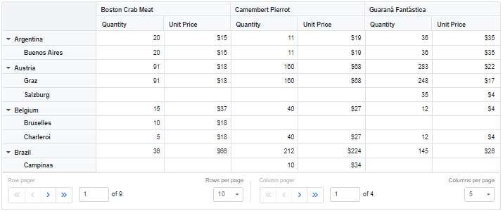
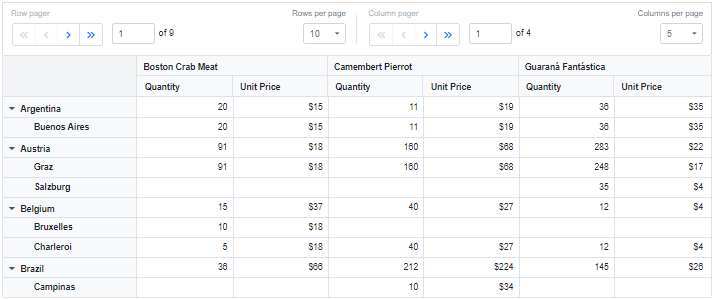
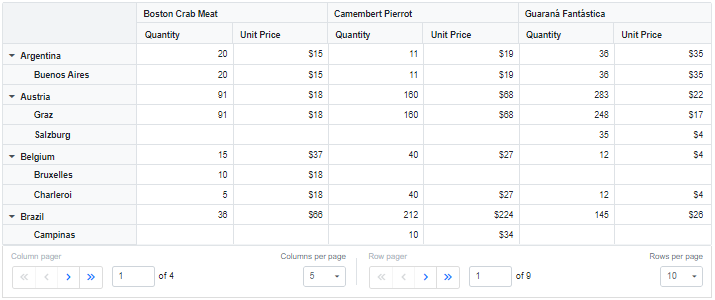
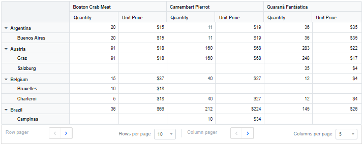
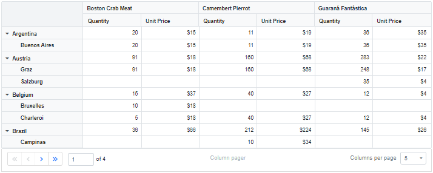
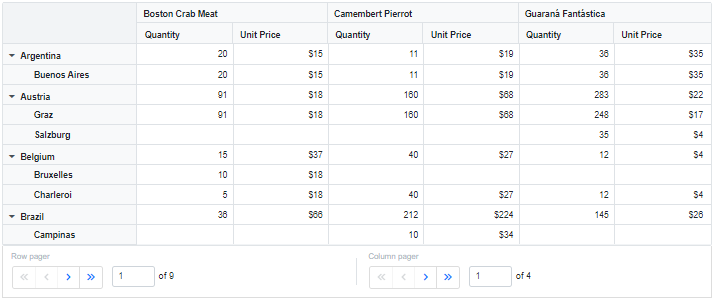
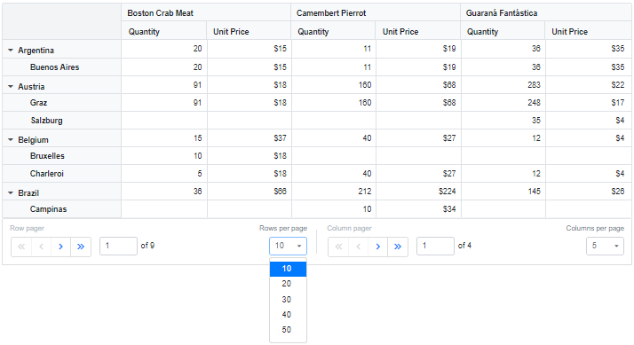
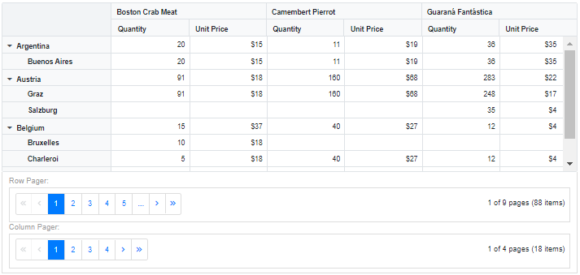

# Paging in Blazor Pivot Table Component

N> This feature is applicable only for relational data source.

Paging allows you to load large amounts of data that can be divided and displayed page by page in the pivot table. It can be enabled by setting the [EnablePaging](https://help.syncfusion.com/cr/blazor/Syncfusion.Blazor.PivotView.SfPivotView-1.html#Syncfusion_Blazor_PivotView_SfPivotView_1_EnablePaging) property in [SfPivotView](https://help.syncfusion.com/cr/blazor/Syncfusion.Blazor.PivotView.SfPivotView-1.html) class to **true**. It can be configured at code-behind by using the [PivotViewPageSettings](https://help.syncfusion.com/cr/blazor/Syncfusion.Blazor.PivotView.PivotViewPageSettings.html) property, during initial rendering of the component. The properties required are:

* [CurrentRowPage](https://help.syncfusion.com/cr/blazor/Syncfusion.Blazor.PivotView.PivotViewPageSettings.html#Syncfusion_Blazor_PivotView_PivotViewPageSettings_CurrentRowPage): Allows user to set the current row page number to be displayed in the pivot table.
* [CurrentColumnPage](https://help.syncfusion.com/cr/blazor/Syncfusion.Blazor.PivotView.PivotViewPageSettings.html#Syncfusion_Blazor_PivotView_PivotViewPageSettings_CurrentColumnPage): Allows user to set the current column page number to be displayed in the pivot table.
* [RowPageSize](https://help.syncfusion.com/cr/blazor/Syncfusion.Blazor.PivotView.PivotViewPageSettings.html#Syncfusion_Blazor_PivotView_PivotViewPageSettings_RowPageSize): Allows user to set the total number of records to be displayed on each page of the pivot table's row axis.
* [ColumnPageSize](https://help.syncfusion.com/cr/blazor/Syncfusion.Blazor.PivotView.PivotViewPageSettings.html#Syncfusion_Blazor_PivotView_PivotViewPageSettings_ColumnPageSize): Allows user to set the total number of records to be displayed on each page of the pivot table's column axis.

## Pager UI

When paging is enabled, a built-in pager UI appears at the bottom of the pivot table, allowing you to change the current page in the row and column axes by navigating to a desired page using the navigation buttons or an input text box, as well as change the page size via dropdown at runtime.

You can also change the position, visibility, compact view, and template of the row and column pagers by using the [PivotViewPagerSettings](https://help.syncfusion.com/cr/blazor/Syncfusion.Blazor.PivotView.PivotViewPagerSettings.html).

```cshtml
@using Syncfusion.Blazor.PivotView
@using Syncfusion.Blazor.Data

    <SfPivotView TValue="PivotProductDetails" Height="500" Width="100%" EnablePaging=true>
        <PivotViewPageSettings CurrentColumnPage="1" CurrentRowPage="1" ColumnPageSize="5" RowPageSize="10"></PivotViewPageSettings>
        <PivotViewPagerSettings Position=PagerPosition.Bottom EnableCompactView=false ShowColumnPager=true ShowRowPager=true ColumnPageSizes="@(new List<int>{5, 10, 20, 50, 100})" RowPageSizes="@(new List<int>{10, 50, 100, 200})" IsInversed=false ShowColumnPageSize=true ShowRowPageSize=true></PivotViewPagerSettings>
        <PivotViewDataSourceSettings TValue="PivotProductDetails" ExpandAll=true>
            <SfDataManager Url="https://bi.syncfusion.com/northwindservice/api/orders" CrossDomain="true" Adaptor="Syncfusion.Blazor.Adaptors.WebApiAdaptor"></SfDataManager>
            <PivotViewColumns>
            <PivotViewColumn Name="ProductName" Caption="ProductName"></PivotViewColumn>
            </PivotViewColumns>
            <PivotViewRows>
            <PivotViewRow Name="ShipCountry" Caption="ShipCountry"></PivotViewRow>
            <PivotViewRow Name="ShipCity" Caption="ShipCity"></PivotViewRow>
            </PivotViewRows>
            <PivotViewValues>
                <PivotViewValue Name="Quantity" Caption="Quantity"></PivotViewValue>
                <PivotViewValue Name="UnitPrice" Caption="Unit Price"></PivotViewValue>
            </PivotViewValues>
            <PivotViewFormatSettings>
            <PivotViewFormatSetting Name="UnitPrice" Format="C0"></PivotViewFormatSetting>
            </PivotViewFormatSettings>
        </PivotViewDataSourceSettings>
        <PivotViewGridSettings ColumnWidth="120"></PivotViewGridSettings>
    </SfPivotView>
@code {
    public class PivotProductDetails
    {
        public int Quantity { get; set; }
        public double UnitPrice { get; set; }
        public string ProductName { get; set; }
        public string ShipCountry { get; set; }
        public string ShipCity { get; set; }
    }
}

```



### Show pager UI at top or bottom

You can display the pager UI at top or bottom of the pivot table by using the [Position](https://help.syncfusion.com/cr/blazor/Syncfusion.Blazor.PivotView.PivotViewPagerSettings.html#Syncfusion_Blazor_PivotView_PivotViewPagerSettings_Position) property. To show the pager UI at top of the pivot table, set the [Position](https://help.syncfusion.com/cr/blazor/Syncfusion.Blazor.PivotView.PivotViewPagerSettings.html#Syncfusion_Blazor_PivotView_PivotViewPagerSettings_Position) property in [PivotViewPagerSettings](https://help.syncfusion.com/cr/blazor/Syncfusion.Blazor.PivotView.PivotViewPagerSettings.html) to [PagerPosition.Top](https://help.syncfusion.com/cr/blazor/Syncfusion.Blazor.PivotView.PagerPosition.html#Syncfusion_Blazor_PivotView_PagerPosition_Top).

N> By default, the pager UI appears at the bottom of the pivot table.

```cshtml
@using Syncfusion.Blazor.PivotView
@using Syncfusion.Blazor.Data

<SfPivotView TValue="PivotProductDetails" Height="500" Width="100%" EnablePaging=true>
    <PivotViewPageSettings CurrentColumnPage="1" CurrentRowPage="1" ColumnPageSize="5" RowPageSize="10"></PivotViewPageSettings>
    <PivotViewPagerSettings Position=PagerPosition.Top></PivotViewPagerSettings>
    <PivotViewDataSourceSettings TValue="PivotProductDetails" ExpandAll=true>
        <SfDataManager Url="https://bi.syncfusion.com/northwindservice/api/orders" CrossDomain="true" Adaptor="Syncfusion.Blazor.Adaptors.WebApiAdaptor"></SfDataManager>
        <PivotViewColumns>
            <PivotViewColumn Name="ProductName" Caption="ProductName"></PivotViewColumn>
        </PivotViewColumns>
        <PivotViewRows>
            <PivotViewRow Name="ShipCountry" Caption="ShipCountry"></PivotViewRow>
            <PivotViewRow Name="ShipCity" Caption="ShipCity"></PivotViewRow>
        </PivotViewRows>
        <PivotViewValues>
            <PivotViewValue Name="Quantity" Caption="Quantity"></PivotViewValue>
            <PivotViewValue Name="UnitPrice" Caption="Unit Price"></PivotViewValue>
        </PivotViewValues>
        <PivotViewFormatSettings>
            <PivotViewFormatSetting Name="UnitPrice" Format="C0"></PivotViewFormatSetting>
        </PivotViewFormatSettings>
    </PivotViewDataSourceSettings>
    <PivotViewGridSettings ColumnWidth="120"></PivotViewGridSettings>
</SfPivotView>
@code {
    public class PivotProductDetails
    {
        public int Quantity { get; set; }
        public double UnitPrice { get; set; }
        public string ProductName { get; set; }
        public string ShipCountry { get; set; }
        public string ShipCity { get; set; }
    }
}

```



### Inverse pager

Toggles and displays row and column pager. To show the column pager on the left side of the pager UI, set the [IsInversed](https://help.syncfusion.com/cr/blazor/Syncfusion.Blazor.PivotView.PivotViewPagerSettings.html#Syncfusion_Blazor_PivotView_PivotViewPagerSettings_IsInversed) property in [PivotViewPagerSettings](https://help.syncfusion.com/cr/blazor/Syncfusion.Blazor.PivotView.PivotViewPagerSettings.html) to **true**.

N> By default, the row pager is displayed on the left side of the pager UI, while the column pager is displayed on the right side.

```cshtml
@using Syncfusion.Blazor.PivotView
@using Syncfusion.Blazor.Data

<SfPivotView TValue="PivotProductDetails" Height="500" Width="100%" EnablePaging=true>
    <PivotViewPageSettings CurrentColumnPage="1" CurrentRowPage="1" ColumnPageSize="5" RowPageSize="10"></PivotViewPageSettings>
    <PivotViewPagerSettings IsInversed=true></PivotViewPagerSettings>
    <PivotViewDataSourceSettings TValue="PivotProductDetails" ExpandAll=true>
        <SfDataManager Url="https://bi.syncfusion.com/northwindservice/api/orders" CrossDomain="true" Adaptor="Syncfusion.Blazor.Adaptors.WebApiAdaptor"></SfDataManager>
        <PivotViewColumns>
            <PivotViewColumn Name="ProductName" Caption="ProductName"></PivotViewColumn>
        </PivotViewColumns>
        <PivotViewRows>
            <PivotViewRow Name="ShipCountry" Caption="ShipCountry"></PivotViewRow>
            <PivotViewRow Name="ShipCity" Caption="ShipCity"></PivotViewRow>
        </PivotViewRows>
        <PivotViewValues>
            <PivotViewValue Name="Quantity" Caption="Quantity"></PivotViewValue>
            <PivotViewValue Name="UnitPrice" Caption="Unit Price"></PivotViewValue>
        </PivotViewValues>
        <PivotViewFormatSettings>
            <PivotViewFormatSetting Name="UnitPrice" Format="C0"></PivotViewFormatSetting>
        </PivotViewFormatSettings>
    </PivotViewDataSourceSettings>
    <PivotViewGridSettings ColumnWidth="120"></PivotViewGridSettings>
</SfPivotView>
@code {
    public class PivotProductDetails
    {
        public int Quantity { get; set; }
        public double UnitPrice { get; set; }
        public string ProductName { get; set; }
        public string ShipCountry { get; set; }
        public string ShipCity { get; set; }
    }
}

```



### Compact view

By hiding all except the previous and next navigation buttons, the pager UI can be displayed with the absolute minimum of paging options. The compact view can be enabled by setting the [EnableCompactView](https://help.syncfusion.com/cr/blazor/Syncfusion.Blazor.PivotView.PivotViewPagerSettings.html#Syncfusion_Blazor_PivotView_PivotViewPagerSettings_EnableCompactView) property in [PivotViewPagerSettings](https://help.syncfusion.com/cr/blazor/Syncfusion.Blazor.PivotView.PivotViewPagerSettings.html) to **true**.

```cshtml
@using Syncfusion.Blazor.PivotView
@using Syncfusion.Blazor.Data

<SfPivotView TValue="PivotProductDetails" Height="500" Width="100%" EnablePaging=true>
    <PivotViewPageSettings CurrentColumnPage="1" CurrentRowPage="1" ColumnPageSize="5" RowPageSize="10"></PivotViewPageSettings>
    <PivotViewPagerSettings EnableCompactView=true></PivotViewPagerSettings>
    <PivotViewDataSourceSettings TValue="PivotProductDetails" ExpandAll=true>
        <SfDataManager Url="https://bi.syncfusion.com/northwindservice/api/orders" CrossDomain="true" Adaptor="Syncfusion.Blazor.Adaptors.WebApiAdaptor"></SfDataManager>
        <PivotViewColumns>
            <PivotViewColumn Name="ProductName" Caption="ProductName"></PivotViewColumn>
        </PivotViewColumns>
        <PivotViewRows>
            <PivotViewRow Name="ShipCountry" Caption="ShipCountry"></PivotViewRow>
            <PivotViewRow Name="ShipCity" Caption="ShipCity"></PivotViewRow>
        </PivotViewRows>
        <PivotViewValues>
            <PivotViewValue Name="Quantity" Caption="Quantity"></PivotViewValue>
            <PivotViewValue Name="UnitPrice" Caption="Unit Price"></PivotViewValue>
        </PivotViewValues>
        <PivotViewFormatSettings>
            <PivotViewFormatSetting Name="UnitPrice" Format="C0"></PivotViewFormatSetting>
        </PivotViewFormatSettings>
    </PivotViewDataSourceSettings>
    <PivotViewGridSettings ColumnWidth="120"></PivotViewGridSettings>
</SfPivotView>
@code {
    public class PivotProductDetails
    {
        public int Quantity { get; set; }
        public double UnitPrice { get; set; }
        public string ProductName { get; set; }
        public string ShipCountry { get; set; }
        public string ShipCity { get; set; }
    }
}

```



### Show or hide paging option

By using the [ShowRowPager](https://help.syncfusion.com/cr/blazor/Syncfusion.Blazor.PivotView.PivotViewPagerSettings.html#Syncfusion_Blazor_PivotView_PivotViewPagerSettings_ShowRowPager) and [ShowColumnPager](https://help.syncfusion.com/cr/blazor/Syncfusion.Blazor.PivotView.PivotViewPagerSettings.html#Syncfusion_Blazor_PivotView_PivotViewPagerSettings_ShowColumnPager) properties in [PivotViewPagerSettings](https://help.syncfusion.com/cr/blazor/Syncfusion.Blazor.PivotView.PivotViewPagerSettings.html), you can show or hide row and column pager separately in the pager UI.

In the following example, row pager has been disabled by setting the [ShowRowPager](https://help.syncfusion.com/cr/blazor/Syncfusion.Blazor.PivotView.PivotViewPagerSettings.html#Syncfusion_Blazor_PivotView_PivotViewPagerSettings_ShowRowPager) property in [PivotViewPagerSettings](https://help.syncfusion.com/cr/blazor/Syncfusion.Blazor.PivotView.PivotViewPagerSettings.html) to **false**.

```cshtml
@using Syncfusion.Blazor.PivotView
@using Syncfusion.Blazor.Data

<SfPivotView TValue="PivotProductDetails" Height="500" Width="100%" EnablePaging=true>
    <PivotViewPageSettings CurrentColumnPage="1" CurrentRowPage="1" ColumnPageSize="5" RowPageSize="10"></PivotViewPageSettings>
    <PivotViewPagerSettings ShowRowPager=false></PivotViewPagerSettings>
    <PivotViewDataSourceSettings TValue="PivotProductDetails" ExpandAll=true>
        <SfDataManager Url="https://bi.syncfusion.com/northwindservice/api/orders" CrossDomain="true" Adaptor="Syncfusion.Blazor.Adaptors.WebApiAdaptor"></SfDataManager>
        <PivotViewColumns>
            <PivotViewColumn Name="ProductName" Caption="ProductName"></PivotViewColumn>
        </PivotViewColumns>
        <PivotViewRows>
            <PivotViewRow Name="ShipCountry" Caption="ShipCountry"></PivotViewRow>
            <PivotViewRow Name="ShipCity" Caption="ShipCity"></PivotViewRow>
        </PivotViewRows>
        <PivotViewValues>
            <PivotViewValue Name="Quantity" Caption="Quantity"></PivotViewValue>
            <PivotViewValue Name="UnitPrice" Caption="Unit Price"></PivotViewValue>
        </PivotViewValues>
        <PivotViewFormatSettings>
            <PivotViewFormatSetting Name="UnitPrice" Format="C0"></PivotViewFormatSetting>
        </PivotViewFormatSettings>
    </PivotViewDataSourceSettings>
    <PivotViewGridSettings ColumnWidth="120"></PivotViewGridSettings>
</SfPivotView>
@code {
    public class PivotProductDetails
    {
        public int Quantity { get; set; }
        public double UnitPrice { get; set; }
        public string ProductName { get; set; }
        public string ShipCountry { get; set; }
        public string ShipCity { get; set; }
    }
}

```



### Show or hide page size

By using the [ShowRowPageSize](https://help.syncfusion.com/cr/blazor/Syncfusion.Blazor.PivotView.PivotViewPagerSettings.html#Syncfusion_Blazor_PivotView_PivotViewPagerSettings_ShowRowPageSize) and [ShowColumnPageSize](https://help.syncfusion.com/cr/blazor/Syncfusion.Blazor.PivotView.PivotViewPagerSettings.html#Syncfusion_Blazor_PivotView_PivotViewPagerSettings_ShowColumnPageSize) properties in [PivotViewPagerSettings](https://help.syncfusion.com/cr/blazor/Syncfusion.Blazor.PivotView.PivotViewPagerSettings.html), you can show or hide "Rows per page" and "Columns per page" dropdown menu. The dropdown menu contains a list of pre-defined or user-defined page sizes, which will be displayed in the "Rows per page" and "Columns per page" dropdowns, allowing you to change the page size for the row and column axes at runtime.

```cshtml
@using Syncfusion.Blazor.PivotView
@using Syncfusion.Blazor.Data

<SfPivotView TValue="PivotProductDetails" Height="500" Width="100%" EnablePaging=true>
    <PivotViewPageSettings CurrentColumnPage="1" CurrentRowPage="1" ColumnPageSize="5" RowPageSize="10"></PivotViewPageSettings>
    <PivotViewPagerSettings ShowColumnPageSize=false ShowRowPageSize=false></PivotViewPagerSettings>
    <PivotViewDataSourceSettings TValue="PivotProductDetails" ExpandAll=true>
        <SfDataManager Url="https://bi.syncfusion.com/northwindservice/api/orders" CrossDomain="true" Adaptor="Syncfusion.Blazor.Adaptors.WebApiAdaptor"></SfDataManager>
        <PivotViewColumns>
            <PivotViewColumn Name="ProductName" Caption="ProductName"></PivotViewColumn>
        </PivotViewColumns>
        <PivotViewRows>
            <PivotViewRow Name="ShipCountry" Caption="ShipCountry"></PivotViewRow>
            <PivotViewRow Name="ShipCity" Caption="ShipCity"></PivotViewRow>
        </PivotViewRows>
        <PivotViewValues>
            <PivotViewValue Name="Quantity" Caption="Quantity"></PivotViewValue>
            <PivotViewValue Name="UnitPrice" Caption="Unit Price"></PivotViewValue>
        </PivotViewValues>
        <PivotViewFormatSettings>
            <PivotViewFormatSetting Name="UnitPrice" Format="C0"></PivotViewFormatSetting>
        </PivotViewFormatSettings>
    </PivotViewDataSourceSettings>
    <PivotViewGridSettings ColumnWidth="120"></PivotViewGridSettings>
</SfPivotView>
@code {
    public class PivotProductDetails
    {
        public int Quantity { get; set; }
        public double UnitPrice { get; set; }
        public string ProductName { get; set; }
        public string ShipCountry { get; set; }
        public string ShipCity { get; set; }
    }
}

```



### Customize page size

By using the [RowPageSizes](https://help.syncfusion.com/cr/blazor/Syncfusion.Blazor.PivotView.PivotViewPagerSettings.html#Syncfusion_Blazor_PivotView_PivotViewPagerSettings_RowPageSizes) and [ColumnPageSizes](https://help.syncfusion.com/cr/blazor/Syncfusion.Blazor.PivotView.PivotViewPagerSettings.html#Syncfusion_Blazor_PivotView_PivotViewPagerSettings_ColumnPageSizes) properties in [PivotViewPagerSettings](https://help.syncfusion.com/cr/blazor/Syncfusion.Blazor.PivotView.PivotViewPagerSettings.html), you can specify a set of desired page sizes, which will be displayed in the "Rows per page" and "Columns per page" dropdowns, allowing you to change the page size for the row and column axes at runtime.

N> By default, the "Rows per page" dropdown have pre-defined page sizes of **10, 50, 100, and 200**, while the "Columns per page" dropdown have pre-defined page sizes of **5, 10, 20, 50, and 100**.

In the following example, the "Rows per page" dropdown is set with user-defined page sizes of **10, 20, 30, 40, and 50** and the "Columns per page" dropdown is set with user-defined page sizes of **5, 10, 15, 20, and 30**.

```cshtml
@using Syncfusion.Blazor.PivotView
@using Syncfusion.Blazor.Data

<SfPivotView TValue="PivotProductDetails" Height="500" Width="100%" EnablePaging=true>
    <PivotViewPageSettings CurrentColumnPage="1" CurrentRowPage="1" ColumnPageSize="5" RowPageSize="10"></PivotViewPageSettings>
    <PivotViewPagerSettings ColumnPageSizes="@(new List<int>{5, 10, 15, 20, 30})" RowPageSizes="@(new List<int>{10, 20, 30, 40, 50})"></PivotViewPagerSettings>
    <PivotViewDataSourceSettings TValue="PivotProductDetails" ExpandAll=true>
        <SfDataManager Url="https://bi.syncfusion.com/northwindservice/api/orders" CrossDomain="true" Adaptor="Syncfusion.Blazor.Adaptors.WebApiAdaptor"></SfDataManager>
        <PivotViewColumns>
            <PivotViewColumn Name="ProductName" Caption="ProductName"></PivotViewColumn>
        </PivotViewColumns>
        <PivotViewRows>
            <PivotViewRow Name="ShipCountry" Caption="ShipCountry"></PivotViewRow>
            <PivotViewRow Name="ShipCity" Caption="ShipCity"></PivotViewRow>
        </PivotViewRows>
        <PivotViewValues>
            <PivotViewValue Name="Quantity" Caption="Quantity"></PivotViewValue>
            <PivotViewValue Name="UnitPrice" Caption="Unit Price"></PivotViewValue>
        </PivotViewValues>
        <PivotViewFormatSettings>
            <PivotViewFormatSetting Name="UnitPrice" Format="C0"></PivotViewFormatSetting>
        </PivotViewFormatSettings>
    </PivotViewDataSourceSettings>
    <PivotViewGridSettings ColumnWidth="120"></PivotViewGridSettings>
</SfPivotView>
@code {
    public class PivotProductDetails
    {
        public int Quantity { get; set; }
        public double UnitPrice { get; set; }
        public string ProductName { get; set; }
        public string ShipCountry { get; set; }
        public string ShipCity { get; set; }
    }
}

```



### Template

The [Template](https://help.syncfusion.com/cr/blazor/Syncfusion.Blazor.PivotView.PivotViewPagerSettings.html#Syncfusion_Blazor_PivotView_PivotViewPagerSettings_Template) property allows to change the appearance of the pager UI by displaying user-defined HTML elements instead of built-in HTML elements.

```cshtml
@using Syncfusion.Blazor.PivotView
@using Syncfusion.Blazor.Data
@using Syncfusion.Blazor.Navigations

<SfPivotView TValue="PivotProductDetails" @ref="Parent" Height="500" Width="100%" EnablePaging=true>
    <PivotViewPageSettings CurrentColumnPage="@currentColumnPage" CurrentRowPage="@currentRowPage" ColumnPageSize="5" RowPageSize="10"></PivotViewPageSettings>
    <PivotViewPagerSettings>
        <Template>
            <div style="display: grid">
                <div class="pager-label">Row Pager: </div>
                <SfPager PageSize="@Parent.PageSettings.RowPageSize" ItemClick="@RowPageClick" TotalItemsCount="@context.RowCount" CurrentPage="@currentRowPage" NumericItemsCount="5">
                </SfPager>
                <div class="pager-label">Column Pager: </div>
                <SfPager PageSize="@Parent.PageSettings.ColumnPageSize" ItemClick="@ColumnPageClick" TotalItemsCount="@context.ColumnCount" CurrentPage="@currentColumnPage" NumericItemsCount="5">
                </SfPager>
            </div>
        </Template>
    </PivotViewPagerSettings>
    <PivotViewDataSourceSettings TValue="PivotProductDetails" ExpandAll=true>
        <SfDataManager Url="https://bi.syncfusion.com/northwindservice/api/orders" CrossDomain="true" Adaptor="Syncfusion.Blazor.Adaptors.WebApiAdaptor"></SfDataManager>
        <PivotViewColumns>
            <PivotViewColumn Name="ProductName" Caption="ProductName"></PivotViewColumn>
        </PivotViewColumns>
        <PivotViewRows>
            <PivotViewRow Name="ShipCountry" Caption="ShipCountry"></PivotViewRow>
            <PivotViewRow Name="ShipCity" Caption="ShipCity"></PivotViewRow>
        </PivotViewRows>
        <PivotViewValues>
            <PivotViewValue Name="Quantity" Caption="Quantity"></PivotViewValue>
            <PivotViewValue Name="UnitPrice" Caption="Unit Price"></PivotViewValue>
        </PivotViewValues>
        <PivotViewFormatSettings>
            <PivotViewFormatSetting Name="UnitPrice" Format="C0"></PivotViewFormatSetting>
        </PivotViewFormatSettings>
    </PivotViewDataSourceSettings>
    <PivotViewGridSettings ColumnWidth="120"></PivotViewGridSettings>
</SfPivotView>
<style>
    .pager-label {
        color: #9e9e9e;
        margin-right: 10px;
    }
</style>
@code {
    private SfPivotView<PivotProductDetails> Parent;
    private int currentRowPage = 1;
    private int currentColumnPage = 1;
    public class PivotProductDetails
    {
        public int Quantity { get; set; }
        public double UnitPrice { get; set; }
        public string ProductName { get; set; }
        public string ShipCountry { get; set; }
        public string ShipCity { get; set; }
    }
    public void RowPageClick(PagerItemClickEventArgs args)
    {
        currentRowPage = args.CurrentPage;
    }
    public void ColumnPageClick(PagerItemClickEventArgs args)
    {
        currentColumnPage = args.CurrentPage;
    }
}

```

