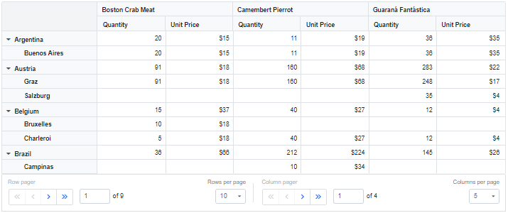
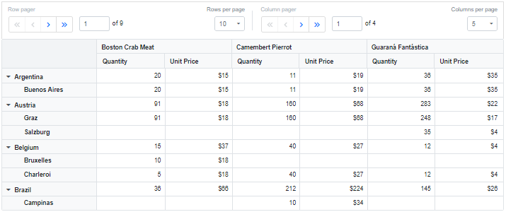
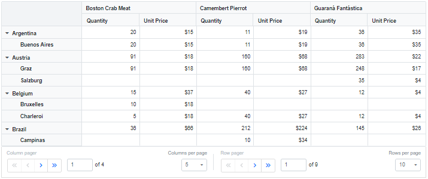
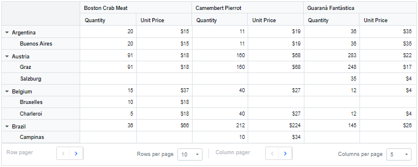
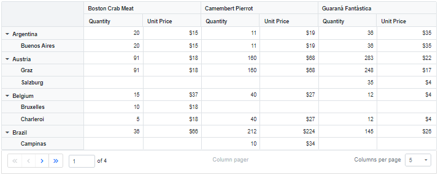
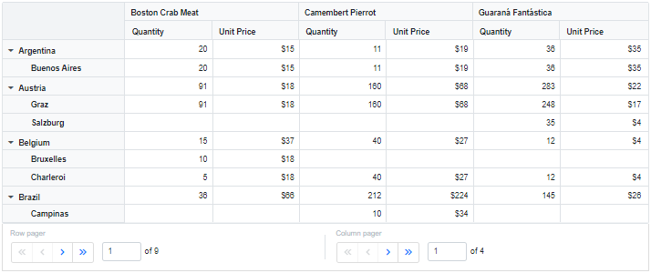
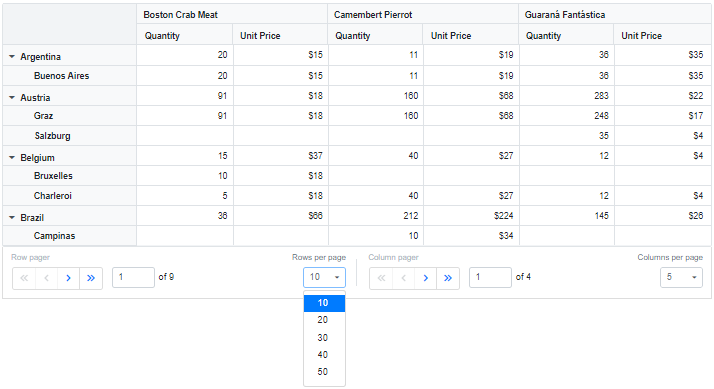
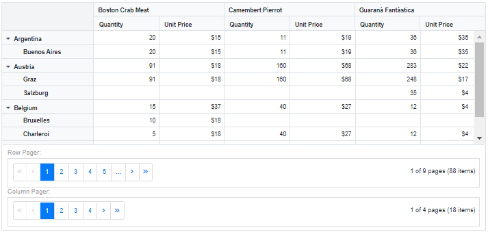

# Paging in Blazor Pivot Table

N> This feature is applicable only for relational data source.

Paging divides the Pivot Table data into manageable pages so the component can render large datasets efficiently. The row axis (members of the row fields) and the column axis (members of the column and value fields) are paginated independently. Users navigate rows and columns page by page using the built-in pager UI or custom controls.

To enable paging, set the [EnablePaging](https://help.syncfusion.com/cr/blazor/Syncfusion.Blazor.PivotView.SfPivotView-1.html#Syncfusion_Blazor_PivotView_SfPivotView_1_EnablePaging) property to **true** (type `boolean`, default `false`).

Paging can be configured at initial render using the [PivotViewPageSettings](https://help.syncfusion.com/cr/blazor/Syncfusion.Blazor.PivotView.PivotViewPageSettings.html) property, which accepts the following options:

| Property | Type | Default | Description |
|----------|------|---------|-------------|
| [CurrentRowPage](https://help.syncfusion.com/cr/blazor/Syncfusion.Blazor.PivotView.PivotViewPageSettings.html#Syncfusion_Blazor_PivotView_PivotViewPageSettings_CurrentRowPage) | `Number` | `1` | The current row page number to display. |
| [CurrentColumnPage](https://help.syncfusion.com/cr/blazor/Syncfusion.Blazor.PivotView.PivotViewPageSettings.html#Syncfusion_Blazor_PivotView_PivotViewPageSettings_CurrentColumnPage) | `Number` | `1` | The current column page number to display. |
| [RowPageSize](https://help.syncfusion.com/cr/blazor/Syncfusion.Blazor.PivotView.PivotViewPageSettings.html#Syncfusion_Blazor_PivotView_PivotViewPageSettings_RowPageSize) | `Number` | `10` | The number of records displayed on each page of the row axis. |
| [ColumnPageSize](https://help.syncfusion.com/cr/blazor/Syncfusion.Blazor.PivotView.PivotViewPageSettings.html#Syncfusion_Blazor_PivotView_PivotViewPageSettings_ColumnPageSize) | `Number` | `5` | The number of records displayed on each page of the column axis. |

N> The [Virtualization](./virtual-scrolling.md) and Paging features in the Pivot Table should not be enabled simultaneously. You can use either feature at a time, but not both together, as they are designed to handle data rendering differently and may conflict when used together.

## Pager UI

When paging is enabled, a built-in pager UI appears at the bottom of the Pivot Table by default. The UI provides navigation buttons, a page-input box, and dropdowns for changing the page size on each axis.

You can change the position, visibility, compact view, and template of the row and column pagers using the [PivotViewPagerSettings](https://help.syncfusion.com/cr/blazor/Syncfusion.Blazor.PivotView.PivotViewPagerSettings.html) class. The available sub-properties are summarized below:

| Property | Type | Default | Description |
|----------|------|---------|-------------|
| `Position` | [`PagerPosition`](https://help.syncfusion.com/cr/blazor/Syncfusion.Blazor.PivotView.PivotViewPagerSettings.html#Syncfusion_Blazor_PivotView_PivotViewPagerSettings_Position) | `Bottom` | Places the pager UI at the `Top` or `Bottom` of the Pivot Table. |
| `IsInversed` | `boolean` | `false` | When `true`, swaps the column pager to the left and the row pager to the right. |
| `EnableCompactView` | `boolean` | `false` | When `true`, shows only the previous and next navigation buttons. |
| `ShowRowPager` | `boolean` | `true` | Shows or hides the row pager. |
| `ShowColumnPager` | `boolean` | `true` | Shows or hides the column pager. |
| `ShowRowPageSize` | `boolean` | `true` | Shows or hides the "Rows per page" dropdown. |
| `ShowColumnPageSize` | `boolean` | `true` | Shows or hides the "Columns per page" dropdown. |
| `rowPageSizes` | `List<int>` | `{ 10, 50, 100, 200 }` | The list of page sizes offered in the "Rows per page" dropdown. |
| `columnPageSizes` | `List<int>` | `{ 5, 10, 20, 50, 100 }` | The list of page sizes offered in the "Columns per page" dropdown. |
| `Template` | `RenderFragment<PivotPagerTemplateContext>` | `null` | The ID of an HTML element that replaces the built-in pager UI. |

```cshtml
@using Syncfusion.Blazor.PivotView
@using Syncfusion.Blazor.Data

    <SfPivotView TValue="PivotProductDetails" Height="500" Width="100%" EnablePaging=true>
        <PivotViewPageSettings CurrentColumnPage="1" CurrentRowPage="1" ColumnPageSize="5" RowPageSize="10"></PivotViewPageSettings>
        <PivotViewPagerSettings Position=PagerPosition.Bottom EnableCompactView=false ShowColumnPager=true ShowRowPager=true ColumnPageSizes="@(new List<int>{5, 10, 20, 50, 100})" RowPageSizes="@(new List<int>{10, 50, 100, 200})" IsInversed=false ShowColumnPageSize=true ShowRowPageSize=true></PivotViewPagerSettings>
        <PivotViewDataSourceSettings TValue="PivotProductDetails" ExpandAll=true>
            <SfDataManager Url="https://bi.syncfusion.com/northwindservice/api/orders" CrossDomain="true" Adaptor="Syncfusion.Blazor.Adaptors.WebApiAdaptor"></SfDataManager>
            <PivotViewColumns>
            <PivotViewColumn Name="ProductName" Caption="ProductName"></PivotViewColumn>
            </PivotViewColumns>
            <PivotViewRows>
            <PivotViewRow Name="ShipCountry" Caption="ShipCountry"></PivotViewRow>
            <PivotViewRow Name="ShipCity" Caption="ShipCity"></PivotViewRow>
            </PivotViewRows>
            <PivotViewValues>
                <PivotViewValue Name="Quantity" Caption="Quantity"></PivotViewValue>
                <PivotViewValue Name="UnitPrice" Caption="Unit Price"></PivotViewValue>
            </PivotViewValues>
            <PivotViewFormatSettings>
            <PivotViewFormatSetting Name="UnitPrice" Format="C0"></PivotViewFormatSetting>
            </PivotViewFormatSettings>
        </PivotViewDataSourceSettings>
        <PivotViewGridSettings ColumnWidth="120"></PivotViewGridSettings>
    </SfPivotView>
@code {
    public class PivotProductDetails
    {
        public int Quantity { get; set; }
        public double UnitPrice { get; set; }
        public string ProductName { get; set; }
        public string ShipCountry { get; set; }
        public string ShipCity { get; set; }
    }
}

```



### Show pager UI at top or bottom

The Pivot Table component lets you place the pager UI at the top or bottom of the Pivot Table by setting the [Position](https://help.syncfusion.com/cr/blazor/Syncfusion.Blazor.PivotView.PivotViewPagerSettings.html#Syncfusion_Blazor_PivotView_PivotViewPagerSettings_Position) property within the [PivotViewPagerSettings](https://help.syncfusion.com/cr/blazor/Syncfusion.Blazor.PivotView.PivotViewPagerSettings.html) configuration. By default the pager UI appears at the bottom; set **Position** to **Top** to place it above the Pivot Table.

The following example demonstrates how to configure the pager UI to appear at the top of the Pivot Table:

```cshtml
@using Syncfusion.Blazor.PivotView
@using Syncfusion.Blazor.Data

<SfPivotView TValue="PivotProductDetails" Height="500" Width="100%" EnablePaging=true>
    <PivotViewPageSettings CurrentColumnPage="1" CurrentRowPage="1" ColumnPageSize="5" RowPageSize="10"></PivotViewPageSettings>
    <PivotViewPagerSettings Position=PagerPosition.Top></PivotViewPagerSettings>
    <PivotViewDataSourceSettings TValue="PivotProductDetails" ExpandAll=true>
        <SfDataManager Url="https://bi.syncfusion.com/northwindservice/api/orders" CrossDomain="true" Adaptor="Syncfusion.Blazor.Adaptors.WebApiAdaptor"></SfDataManager>
        <PivotViewColumns>
            <PivotViewColumn Name="ProductName" Caption="ProductName"></PivotViewColumn>
        </PivotViewColumns>
        <PivotViewRows>
            <PivotViewRow Name="ShipCountry" Caption="ShipCountry"></PivotViewRow>
            <PivotViewRow Name="ShipCity" Caption="ShipCity"></PivotViewRow>
        </PivotViewRows>
        <PivotViewValues>
            <PivotViewValue Name="Quantity" Caption="Quantity"></PivotViewValue>
            <PivotViewValue Name="UnitPrice" Caption="Unit Price"></PivotViewValue>
        </PivotViewValues>
        <PivotViewFormatSettings>
            <PivotViewFormatSetting Name="UnitPrice" Format="C0"></PivotViewFormatSetting>
        </PivotViewFormatSettings>
    </PivotViewDataSourceSettings>
    <PivotViewGridSettings ColumnWidth="120"></PivotViewGridSettings>
</SfPivotView>
@code {
    public class PivotProductDetails
    {
        public int Quantity { get; set; }
        public double UnitPrice { get; set; }
        public string ProductName { get; set; }
        public string ShipCountry { get; set; }
        public string ShipCity { get; set; }
    }
}

```



### Inverse pager

By default, the row pager appears on the left side of the pager UI and the column pager on the right. To swap these positions, set the  [IsInversed](https://help.syncfusion.com/cr/blazor/Syncfusion.Blazor.PivotView.PivotViewPagerSettings.html#Syncfusion_Blazor_PivotView_PivotViewPagerSettings_IsInversed) property to **true** within the [PivotViewPagerSettings](https://help.syncfusion.com/cr/blazor/Syncfusion.Blazor.PivotView.PivotViewPagerSettings.html) configuration.

```cshtml
@using Syncfusion.Blazor.PivotView
@using Syncfusion.Blazor.Data

<SfPivotView TValue="PivotProductDetails" Height="500" Width="100%" EnablePaging=true>
    <PivotViewPageSettings CurrentColumnPage="1" CurrentRowPage="1" ColumnPageSize="5" RowPageSize="10"></PivotViewPageSettings>
    <PivotViewPagerSettings IsInversed=true></PivotViewPagerSettings>
    <PivotViewDataSourceSettings TValue="PivotProductDetails" ExpandAll=true>
        <SfDataManager Url="https://bi.syncfusion.com/northwindservice/api/orders" CrossDomain="true" Adaptor="Syncfusion.Blazor.Adaptors.WebApiAdaptor"></SfDataManager>
        <PivotViewColumns>
            <PivotViewColumn Name="ProductName" Caption="ProductName"></PivotViewColumn>
        </PivotViewColumns>
        <PivotViewRows>
            <PivotViewRow Name="ShipCountry" Caption="ShipCountry"></PivotViewRow>
            <PivotViewRow Name="ShipCity" Caption="ShipCity"></PivotViewRow>
        </PivotViewRows>
        <PivotViewValues>
            <PivotViewValue Name="Quantity" Caption="Quantity"></PivotViewValue>
            <PivotViewValue Name="UnitPrice" Caption="Unit Price"></PivotViewValue>
        </PivotViewValues>
        <PivotViewFormatSettings>
            <PivotViewFormatSetting Name="UnitPrice" Format="C0"></PivotViewFormatSetting>
        </PivotViewFormatSettings>
    </PivotViewDataSourceSettings>
    <PivotViewGridSettings ColumnWidth="120"></PivotViewGridSettings>
</SfPivotView>
@code {
    public class PivotProductDetails
    {
        public int Quantity { get; set; }
        public double UnitPrice { get; set; }
        public string ProductName { get; set; }
        public string ShipCountry { get; set; }
        public string ShipCity { get; set; }
    }
}

```



### Compact view

The Pivot Table provides a compact view for the pager UI, displaying only the previous and next navigation buttons to minimize the interface. To enable the compact view, set the [EnableCompactView](https://help.syncfusion.com/cr/blazor/Syncfusion.Blazor.PivotView.PivotViewPagerSettings.html#Syncfusion_Blazor_PivotView_PivotViewPagerSettings_EnableCompactView) property to **true** within the [PivotViewPagerSettings](https://help.syncfusion.com/cr/blazor/Syncfusion.Blazor.PivotView.PivotViewPagerSettings.html) configuration. This streamlined layout focuses on essential navigation controls,which is ideal for layouts requiring a simplified paging experience.

```cshtml
@using Syncfusion.Blazor.PivotView
@using Syncfusion.Blazor.Data

<SfPivotView TValue="PivotProductDetails" Height="500" Width="100%" EnablePaging=true>
    <PivotViewPageSettings CurrentColumnPage="1" CurrentRowPage="1" ColumnPageSize="5" RowPageSize="10"></PivotViewPageSettings>
    <PivotViewPagerSettings EnableCompactView=true></PivotViewPagerSettings>
    <PivotViewDataSourceSettings TValue="PivotProductDetails" ExpandAll=true>
        <SfDataManager Url="https://bi.syncfusion.com/northwindservice/api/orders" CrossDomain="true" Adaptor="Syncfusion.Blazor.Adaptors.WebApiAdaptor"></SfDataManager>
        <PivotViewColumns>
            <PivotViewColumn Name="ProductName" Caption="ProductName"></PivotViewColumn>
        </PivotViewColumns>
        <PivotViewRows>
            <PivotViewRow Name="ShipCountry" Caption="ShipCountry"></PivotViewRow>
            <PivotViewRow Name="ShipCity" Caption="ShipCity"></PivotViewRow>
        </PivotViewRows>
        <PivotViewValues>
            <PivotViewValue Name="Quantity" Caption="Quantity"></PivotViewValue>
            <PivotViewValue Name="UnitPrice" Caption="Unit Price"></PivotViewValue>
        </PivotViewValues>
        <PivotViewFormatSettings>
            <PivotViewFormatSetting Name="UnitPrice" Format="C0"></PivotViewFormatSetting>
        </PivotViewFormatSettings>
    </PivotViewDataSourceSettings>
    <PivotViewGridSettings ColumnWidth="120"></PivotViewGridSettings>
</SfPivotView>
@code {
    public class PivotProductDetails
    {
        public int Quantity { get; set; }
        public double UnitPrice { get; set; }
        public string ProductName { get; set; }
        public string ShipCountry { get; set; }
        public string ShipCity { get; set; }
    }
}

```



### Show or hide paging option

The Pivot Table allows you to control the visibility of the row and column pagers in the pager UI using the [ShowRowPager](https://help.syncfusion.com/cr/blazor/Syncfusion.Blazor.PivotView.PivotViewPagerSettings.html#Syncfusion_Blazor_PivotView_PivotViewPagerSettings_ShowRowPager) and [ShowColumnPager](https://help.syncfusion.com/cr/blazor/Syncfusion.Blazor.PivotView.PivotViewPagerSettings.html#Syncfusion_Blazor_PivotView_PivotViewPagerSettings_ShowColumnPager) properties within the [PivotViewPagerSettings](https://help.syncfusion.com/cr/blazor/Syncfusion.Blazor.PivotView.PivotViewPagerSettings.html) configuration. By default, both row and column pagers are visible in the pager UI. To hide either the row pager or the column pager, set the corresponding property to **false**. This allows you to display only the necessary navigation controls based on your layout requirements.

The following code demonstrates how to hide the row pager by setting the [ShowRowPager](https://help.syncfusion.com/cr/blazor/Syncfusion.Blazor.PivotView.PivotViewPagerSettings.html#Syncfusion_Blazor_PivotView_PivotViewPagerSettings_ShowRowPager) property to **false**:

```cshtml
@using Syncfusion.Blazor.PivotView
@using Syncfusion.Blazor.Data

<SfPivotView TValue="PivotProductDetails" Height="500" Width="100%" EnablePaging=true>
    <PivotViewPageSettings CurrentColumnPage="1" CurrentRowPage="1" ColumnPageSize="5" RowPageSize="10"></PivotViewPageSettings>
    <PivotViewPagerSettings ShowRowPager=false></PivotViewPagerSettings>
    <PivotViewDataSourceSettings TValue="PivotProductDetails" ExpandAll=true>
        <SfDataManager Url="https://bi.syncfusion.com/northwindservice/api/orders" CrossDomain="true" Adaptor="Syncfusion.Blazor.Adaptors.WebApiAdaptor"></SfDataManager>
        <PivotViewColumns>
            <PivotViewColumn Name="ProductName" Caption="ProductName"></PivotViewColumn>
        </PivotViewColumns>
        <PivotViewRows>
            <PivotViewRow Name="ShipCountry" Caption="ShipCountry"></PivotViewRow>
            <PivotViewRow Name="ShipCity" Caption="ShipCity"></PivotViewRow>
        </PivotViewRows>
        <PivotViewValues>
            <PivotViewValue Name="Quantity" Caption="Quantity"></PivotViewValue>
            <PivotViewValue Name="UnitPrice" Caption="Unit Price"></PivotViewValue>
        </PivotViewValues>
        <PivotViewFormatSettings>
            <PivotViewFormatSetting Name="UnitPrice" Format="C0"></PivotViewFormatSetting>
        </PivotViewFormatSettings>
    </PivotViewDataSourceSettings>
    <PivotViewGridSettings ColumnWidth="120"></PivotViewGridSettings>
</SfPivotView>
@code {
    public class PivotProductDetails
    {
        public int Quantity { get; set; }
        public double UnitPrice { get; set; }
        public string ProductName { get; set; }
        public string ShipCountry { get; set; }
        public string ShipCity { get; set; }
    }
}

```



### Show or hide page size

The Pivot Table allows you to control the visibility of the "Rows per page" and "Columns per page" dropdowns in the pager UI using the [ShowRowPageSize](https://help.syncfusion.com/cr/blazor/Syncfusion.Blazor.PivotView.PivotViewPagerSettings.html#Syncfusion_Blazor_PivotView_PivotViewPagerSettings_ShowRowPageSize) and [ShowColumnPageSize](https://help.syncfusion.com/cr/blazor/Syncfusion.Blazor.PivotView.PivotViewPagerSettings.html#Syncfusion_Blazor_PivotView_PivotViewPagerSettings_ShowColumnPageSize) properties within the [PivotViewPagerSettings](https://help.syncfusion.com/cr/blazor/Syncfusion.Blazor.PivotView.PivotViewPagerSettings.html) configuration. These dropdowns display a list of predefined or user-defined page sizes, enabling you to adjust the number of rows or columns displayed per page at runtime. By default, both dropdowns are visible in the pager UI. To hide either the "Rows per page" or "Columns per page" dropdown, set the corresponding property to **false**.

```cshtml
@using Syncfusion.Blazor.PivotView
@using Syncfusion.Blazor.Data

<SfPivotView TValue="PivotProductDetails" Height="500" Width="100%" EnablePaging=true>
    <PivotViewPageSettings CurrentColumnPage="1" CurrentRowPage="1" ColumnPageSize="5" RowPageSize="10"></PivotViewPageSettings>
    <PivotViewPagerSettings ShowColumnPageSize=false ShowRowPageSize=false></PivotViewPagerSettings>
    <PivotViewDataSourceSettings TValue="PivotProductDetails" ExpandAll=true>
        <SfDataManager Url="https://bi.syncfusion.com/northwindservice/api/orders" CrossDomain="true" Adaptor="Syncfusion.Blazor.Adaptors.WebApiAdaptor"></SfDataManager>
        <PivotViewColumns>
            <PivotViewColumn Name="ProductName" Caption="ProductName"></PivotViewColumn>
        </PivotViewColumns>
        <PivotViewRows>
            <PivotViewRow Name="ShipCountry" Caption="ShipCountry"></PivotViewRow>
            <PivotViewRow Name="ShipCity" Caption="ShipCity"></PivotViewRow>
        </PivotViewRows>
        <PivotViewValues>
            <PivotViewValue Name="Quantity" Caption="Quantity"></PivotViewValue>
            <PivotViewValue Name="UnitPrice" Caption="Unit Price"></PivotViewValue>
        </PivotViewValues>
        <PivotViewFormatSettings>
            <PivotViewFormatSetting Name="UnitPrice" Format="C0"></PivotViewFormatSetting>
        </PivotViewFormatSettings>
    </PivotViewDataSourceSettings>
    <PivotViewGridSettings ColumnWidth="120"></PivotViewGridSettings>
</SfPivotView>
@code {
    public class PivotProductDetails
    {
        public int Quantity { get; set; }
        public double UnitPrice { get; set; }
        public string ProductName { get; set; }
        public string ShipCountry { get; set; }
        public string ShipCity { get; set; }
    }
}

```



### Customize page size

The Pivot Table allows you to specify a list of page sizes for the "Rows per page" and "Columns per page" dropdowns in the pager UI using the [RowPageSizes](https://help.syncfusion.com/cr/blazor/Syncfusion.Blazor.PivotView.PivotViewPagerSettings.html#Syncfusion_Blazor_PivotView_PivotViewPagerSettings_RowPageSizes) and [ColumnPageSizes](https://help.syncfusion.com/cr/blazor/Syncfusion.Blazor.PivotView.PivotViewPagerSettings.html#Syncfusion_Blazor_PivotView_PivotViewPagerSettings_ColumnPageSizes) properties within the [PivotViewPagerSettings](https://help.syncfusion.com/cr/blazor/Syncfusion.Blazor.PivotView.PivotViewPagerSettings.html) configuration. By default, the "Rows per page" dropdown includes page sizes of 10, 50, 100, and 200, while the "Columns per page" dropdown includes page sizes of 5, 10, 20, 50, and 100. To define a different set of page sizes, assign an array of numbers to the [RowPageSizes](https://help.syncfusion.com/cr/blazor/Syncfusion.Blazor.PivotView.PivotViewPagerSettings.html#Syncfusion_Blazor_PivotView_PivotViewPagerSettings_RowPageSizes) or [ColumnPageSizes](https://help.syncfusion.com/cr/blazor/Syncfusion.Blazor.PivotView.PivotViewPagerSettings.html#Syncfusion_Blazor_PivotView_PivotViewPagerSettings_ColumnPageSizes) properties.

The following example sets the "Rows per page" dropdown with page sizes of 10, 20, 30, 40, and 50, and the "Columns per page" dropdown with page sizes of 5, 10, 15, 20, and 30:

```cshtml
@using Syncfusion.Blazor.PivotView
@using Syncfusion.Blazor.Data

<SfPivotView TValue="PivotProductDetails" Height="500" Width="100%" EnablePaging=true>
    <PivotViewPageSettings CurrentColumnPage="1" CurrentRowPage="1" ColumnPageSize="5" RowPageSize="10"></PivotViewPageSettings>
    <PivotViewPagerSettings ColumnPageSizes="@(new List<int>{5, 10, 15, 20, 30})" RowPageSizes="@(new List<int>{10, 20, 30, 40, 50})"></PivotViewPagerSettings>
    <PivotViewDataSourceSettings TValue="PivotProductDetails" ExpandAll=true>
        <SfDataManager Url="https://bi.syncfusion.com/northwindservice/api/orders" CrossDomain="true" Adaptor="Syncfusion.Blazor.Adaptors.WebApiAdaptor"></SfDataManager>
        <PivotViewColumns>
            <PivotViewColumn Name="ProductName" Caption="ProductName"></PivotViewColumn>
        </PivotViewColumns>
        <PivotViewRows>
            <PivotViewRow Name="ShipCountry" Caption="ShipCountry"></PivotViewRow>
            <PivotViewRow Name="ShipCity" Caption="ShipCity"></PivotViewRow>
        </PivotViewRows>
        <PivotViewValues>
            <PivotViewValue Name="Quantity" Caption="Quantity"></PivotViewValue>
            <PivotViewValue Name="UnitPrice" Caption="Unit Price"></PivotViewValue>
        </PivotViewValues>
        <PivotViewFormatSettings>
            <PivotViewFormatSetting Name="UnitPrice" Format="C0"></PivotViewFormatSetting>
        </PivotViewFormatSettings>
    </PivotViewDataSourceSettings>
    <PivotViewGridSettings ColumnWidth="120"></PivotViewGridSettings>
</SfPivotView>
@code {
    public class PivotProductDetails
    {
        public int Quantity { get; set; }
        public double UnitPrice { get; set; }
        public string ProductName { get; set; }
        public string ShipCountry { get; set; }
        public string ShipCity { get; set; }
    }
}

```



### Template

The Pivot Table allows you to define a custom layout for the pager UI using the [Template](https://help.syncfusion.com/cr/blazor/Syncfusion.Blazor.PivotView.PivotViewPagerSettings.html#Syncfusion_Blazor_PivotView_PivotViewPagerSettings_Template) property within the [PivotViewPagerSettings](https://help.syncfusion.com/cr/blazor/Syncfusion.Blazor.PivotView.PivotViewPagerSettings.html) configuration. By default, the pager UI displays built-in navigation controls. To replace these with custom HTML elements, assign the ID of the custom elements to the [Template](https://help.syncfusion.com/cr/blazor/Syncfusion.Blazor.PivotView.PivotViewPagerSettings.html#Syncfusion_Blazor_PivotView_PivotViewPagerSettings_Template) property. This enables you to create a unique pager interface that aligns with your application’s design requirements.

The following example shows how to create a custom template for both row and column pagers directly within the Razor page. The [Pager](https://help.syncfusion.com/cr/blazor/Syncfusion.Blazor.Navigations.SfPager.html) control is used within the [Template](https://help.syncfusion.com/cr/blazor/Syncfusion.Blazor.PivotView.PivotViewPagerSettings.html#Syncfusion_Blazor_PivotView_PivotViewPagerSettings_Template) property to define the custom layout. You can configure the pager by setting properties like [PageSize](https://help.syncfusion.com/cr/blazor/Syncfusion.Blazor.Navigations.SfPager.html#Syncfusion_Blazor_Navigations_SfPager_PageSize), [TotalItemsCount](https://help.syncfusion.com/cr/blazor/Syncfusion.Blazor.Navigations.SfPager.html#Syncfusion_Blazor_Navigations_SfPager_TotalItemsCount), and [CurrentPage](https://help.syncfusion.com/cr/blazor/Syncfusion.Blazor.Navigations.SfPager.html#Syncfusion_Blazor_Navigations_SfPager_CurrentPage). When you click on a custom row or column pager, the [CurrentRowPage](https://help.syncfusion.com/cr/blazor/Syncfusion.Blazor.PivotView.PivotViewPageSettings.html#Syncfusion_Blazor_PivotView_PivotViewPageSettings_CurrentRowPage) and [CurrentColumnPage](https://help.syncfusion.com/cr/blazor/Syncfusion.Blazor.PivotView.PivotViewPageSettings.html#Syncfusion_Blazor_PivotView_PivotViewPageSettings_CurrentColumnPage) properties in [PivotViewPageSettings](https://help.syncfusion.com/cr/blazor/Syncfusion.Blazor.PivotView.PivotViewPageSettings.html) are updated, enabling navigation with the custom pager.

```cshtml
@using Syncfusion.Blazor.PivotView
@using Syncfusion.Blazor.Data
@using Syncfusion.Blazor.Navigations

<SfPivotView TValue="PivotProductDetails" @ref="Parent" Height="500" Width="100%" EnablePaging=true>
    <PivotViewPageSettings CurrentColumnPage="@currentColumnPage" CurrentRowPage="@currentRowPage" ColumnPageSize="5" RowPageSize="10"></PivotViewPageSettings>
    <PivotViewPagerSettings>
        <Template>
            <div style="display: grid">
                <div class="pager-label">Row Pager: </div>
                <SfPager PageSize="@Parent.PageSettings.RowPageSize" ItemClick="@RowPageClick" TotalItemsCount="@context.RowCount" CurrentPage="@currentRowPage" NumericItemsCount="5">
                </SfPager>
                <div class="pager-label">Column Pager: </div>
                <SfPager PageSize="@Parent.PageSettings.ColumnPageSize" ItemClick="@ColumnPageClick" TotalItemsCount="@context.ColumnCount" CurrentPage="@currentColumnPage" NumericItemsCount="5">
                </SfPager>
            </div>
        </Template>
    </PivotViewPagerSettings>
    <PivotViewDataSourceSettings TValue="PivotProductDetails" ExpandAll=true>
        <SfDataManager Url="https://bi.syncfusion.com/northwindservice/api/orders" CrossDomain="true" Adaptor="Syncfusion.Blazor.Adaptors.WebApiAdaptor"></SfDataManager>
        <PivotViewColumns>
            <PivotViewColumn Name="ProductName" Caption="ProductName"></PivotViewColumn>
        </PivotViewColumns>
        <PivotViewRows>
            <PivotViewRow Name="ShipCountry" Caption="ShipCountry"></PivotViewRow>
            <PivotViewRow Name="ShipCity" Caption="ShipCity"></PivotViewRow>
        </PivotViewRows>
        <PivotViewValues>
            <PivotViewValue Name="Quantity" Caption="Quantity"></PivotViewValue>
            <PivotViewValue Name="UnitPrice" Caption="Unit Price"></PivotViewValue>
        </PivotViewValues>
        <PivotViewFormatSettings>
            <PivotViewFormatSetting Name="UnitPrice" Format="C0"></PivotViewFormatSetting>
        </PivotViewFormatSettings>
    </PivotViewDataSourceSettings>
    <PivotViewGridSettings ColumnWidth="120"></PivotViewGridSettings>
</SfPivotView>
<style>
    .pager-label {
        color: #9e9e9e;
        margin-right: 10px;
    }
</style>
@code {
    private SfPivotView<PivotProductDetails> Parent;
    private int currentRowPage = 1;
    private int currentColumnPage = 1;
    public class PivotProductDetails
    {
        public int Quantity { get; set; }
        public double UnitPrice { get; set; }
        public string ProductName { get; set; }
        public string ShipCountry { get; set; }
        public string ShipCity { get; set; }
    }
    public void RowPageClick(PagerItemClickEventArgs args)
    {
        currentRowPage = args.CurrentPage;
    }
    public void ColumnPageClick(PagerItemClickEventArgs args)
    {
        currentColumnPage = args.CurrentPage;
    }
}

```


