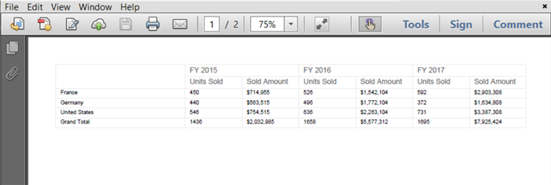

# PDF Export in Blazor Pivot Table Component

The PDF export allows users to easily export their Pivot Table data as a PDF document. To enable PDF export in the Pivot Table, set the [AllowPdfExport](https://help.syncfusion.com/cr/blazor/Syncfusion.Blazor.PivotView.SfPivotView-1.html#Syncfusion_Blazor_PivotView_SfPivotView_1_AllowPdfExport) property to **true** in the [SfPivotView](https://help.syncfusion.com/cr/blazor/Syncfusion.Blazor.PivotView.SfPivotView-1.html) configuration. Once enabled, you can use the [ExportToPdfAsync](https://help.syncfusion.com/cr/blazor/Syncfusion.Blazor.PivotView.SfPivotView-1.html#Syncfusion_Blazor_PivotView_SfPivotView_1_ExportToPdfAsync_Syncfusion_Blazor_Grids_PdfExportProperties_) method to generate and download the PDF file.

In the following example, an external button is used to start the PDF export process. When the user clicks the button, the [ExportToPdfAsync](https://help.syncfusion.com/cr/blazor/Syncfusion.Blazor.PivotView.SfPivotView-1.html#Syncfusion_Blazor_PivotView_SfPivotView_1_ExportToPdfAsync_Syncfusion_Blazor_Grids_PdfExportProperties_) method is called so that the Pivot Table data can be saved as a PDF file.

N> The Pivot Table component can be exported to PDF format using options available in the toolbar. For more details [refer](./tool-bar) here.

```cshtml
@using Syncfusion.Blazor.PivotView
@using Syncfusion.Blazor.Buttons

<SfButton OnClick="OnPdfExport" Content="Pdf Export"></SfButton>
<SfPivotView TValue="ProductDetails" @ref="@pivot" AllowPdfExport="true" >
    <PivotViewDataSourceSettings DataSource="@data" EnableSorting=true>
        <PivotViewColumns>
            <PivotViewColumn Name="Year"></PivotViewColumn>
            <PivotViewColumn Name="Quarter"></PivotViewColumn>
        </PivotViewColumns>
        <PivotViewRows>
            <PivotViewRow Name="Country"></PivotViewRow>
            <PivotViewRow Name="Products"></PivotViewRow>
        </PivotViewRows>
        <PivotViewValues>
            <PivotViewValue Name="Sold" Caption="Units Sold"></PivotViewValue>
            <PivotViewValue Name="Amount" Caption="Sold Amount"></PivotViewValue>
        </PivotViewValues>
        <PivotViewFormatSettings>
            <PivotViewFormatSetting Name="Amount" Format="C0" UseGrouping=true></PivotViewFormatSetting>
        </PivotViewFormatSettings>
    </PivotViewDataSourceSettings>
</SfPivotView>

@code{
    SfPivotView<ProductDetails> pivot;
    public List<ProductDetails> data { get; set; }
    protected override void OnInitialized()
    {
        this.data = ProductDetails.GetProductData().ToList();
       //Bind the data source collection here. Refer "Assigning sample data to the pivot table" section in getting started for more details.
    }
    public void OnPdfExport(Microsoft.AspNetCore.Components.Web.MouseEventArgs args)
    {
        this.pivot.ExportToPdfAsync();
    }
}
```


## Export table and chart into the same document

If you want to export both the table and the chart from the Pivot Table into a single PDF file, set the [View](https://help.syncfusion.com/cr/blazor/Syncfusion.Blazor.PivotView.PivotViewDisplayOption.html#Syncfusion_Blazor_PivotView_PivotViewDisplayOption_View) property to [View.Both](https://help.syncfusion.com/cr/blazor/Syncfusion.Blazor.PivotView.View.html#Syncfusion_Blazor_PivotView_View_Both) within the [PivotViewDisplayOption](https://help.syncfusion.com/cr/blazor/Syncfusion.Blazor.PivotView.PivotViewDisplayOption.html) tag. Then, when you use the [ExportToPdfAsync](https://help.syncfusion.com/cr/blazor/Syncfusion.Blazor.PivotView.SfPivotView-1.html#Syncfusion_Blazor_PivotView_SfPivotView_1_ExportToPdfAsync_Syncfusion_Blazor_Grids_PdfExportProperties_System_Nullable_System_Boolean__) method, make sure to set the **exportTableAndChart** parameter to **true**. This will include both the data table and its chart in one PDF document when you export.

N> This support is applicable only when the virtual scrolling is enabled.

```cshtml
@using Syncfusion.Blazor.PivotView
@using Syncfusion.Blazor.Buttons

<SfButton OnClick="OnPdfExport" Content="Pdf Export"></SfButton>
<SfPivotView @ref="@pivot" TValue="ProductDetails" ShowToolbar=false AllowPdfExport=true EnableVirtualization="true">
    <PivotViewDisplayOption Primary="Primary.Table" View="View.Both"></PivotViewDisplayOption>
    <PivotViewDataSourceSettings DataSource="@dataSource" EnableSorting=true>
        <PivotViewColumns>
            <PivotViewColumn Name="Year"></PivotViewColumn>
            <PivotViewColumn Name="Quarter"></PivotViewColumn>
        </PivotViewColumns>
        <PivotViewRows>
            <PivotViewRow Name="Country"></PivotViewRow>
            <PivotViewRow Name="Products"></PivotViewRow>
        </PivotViewRows>
        <PivotViewValues>
            <PivotViewValue Name="Sold" Caption="Units Sold"></PivotViewValue>
            <PivotViewValue Name="Amount" Caption="Sold Amount"></PivotViewValue>
        </PivotViewValues>
        <PivotViewDrilledMembers>
            <PivotViewDrilledMember Name="Country" Items="@(new string[]{"France"})"></PivotViewDrilledMember>
        </PivotViewDrilledMembers>
        <PivotViewFormatSettings>
            <PivotViewFormatSetting Name="Amount" Format="C0" UseGrouping=true></PivotViewFormatSetting>
        </PivotViewFormatSettings>
    </PivotViewDataSourceSettings>
    <PivotChartSettings>
        <PivotChartSeries Type=ChartSeriesType.Column></PivotChartSeries>
        <PivotChartPrimaryYAxis>
            <PivotChartPrimaryYAxisBorder Width="0"></PivotChartPrimaryYAxisBorder>
        </PivotChartPrimaryYAxis>
    </PivotChartSettings>
</SfPivotView>

@code {
    private SfPivotView<ProductDetails> pivot;
    private List<ProductDetails> dataSource { get; set; }
    protected override void OnInitialized()
    {
        this.dataSource = ProductDetails.GetProductData().ToList();
        //Bind the data source collection here. Refer "Assigning sample data to the pivot table" section in getting started for more details.
    }
    private async Task OnPdfExport(Microsoft.AspNetCore.Components.Web.MouseEventArgs args)
    {
        await this.pivot.ExportToPdfAsync(null, true);
    }
}
```

Additionally, we recommend configuring the maximum incoming SignalR message size in your **Program.cs** file, as shown in the code snippet below. This configuration helps ensure smooth handling of large data operations, especially when exporting data from the Pivot Table component.

```csharp
builder.Services.AddServerSideBlazor().AddHubOptions(options => { options.MaximumReceiveMessageSize = 1024 * 128; });
```

## To add header and footer while exporting

When exporting data from the Pivot Table to a PDF document, you can include additional information in the header or footer. You can add text, lines, page numbers, or images to ensure your exported document includes important details, such as your organization's name or branding, and to improve readability.

To do this, you can use the [Header](https://help.syncfusion.com/cr/blazor/Syncfusion.Blazor.Grids.PdfHeader.html) or [Footer](https://help.syncfusion.com/cr/blazor/Syncfusion.Blazor.Grids.PdfFooter.html) options in the [PdfExportProperties](https://help.syncfusion.com/cr/blazor/Syncfusion.Blazor.Grids.PdfExportProperties.html). These options allow you to specify what content to display at the top or bottom of each PDF page when exporting.

### To add a text in header/footer

You can include custom text in the header or footer of the exported PDF document. Set the [Type](https://help.syncfusion.com/cr/blazor/Syncfusion.Blazor.Grids.PdfHeaderFooterElement.html#Syncfusion_Blazor_Grids_PdfHeaderFooterElement_Type) property to **Text** in the contents array to add text. The following example shows how to add the text "Northwind Traders" to the header:

```cshtml
@code {
    private List<PdfHeaderFooterContent> headerContent = new List<PdfHeaderFooterContent>
    {
        new PdfHeaderFooterContent() {
            Type = ContentType.Text,
            Value = "Northwind Traders",
            Position = new PdfPosition() { X = 0, Y = 50 },
            Style = new PdfContentStyle() { TextBrushColor = "#000000", FontSize = 13 }
        }
    };
    private async Task OnPdfExport(Microsoft.AspNetCore.Components.Web.MouseEventArgs args)
    {
        PdfExportProperties pdfExportProperties = new PdfExportProperties();
        PdfHeader header = new PdfHeader()
        {
            FromTop = 0,
            Height = 130,
            Contents = headerContent
        };
        pdfExportProperties.Header = header;
        await this.pivot.ExportToPdfAsync(pdfExportProperties);
    }
}
```

### To draw a line in header/footer

You can draw lines in the header or footer to create visual separators or decorative elements. Set the [Type](https://help.syncfusion.com/cr/blazor/Syncfusion.Blazor.Grids.PdfHeaderFooterElement.html#Syncfusion_Blazor_Grids_PdfHeaderFooterElement_Type) property to **Line** in the contents array to add line elements. The line can be styled with different dash patterns and colors.

**Supported line styles:**
* Dash
* Dot
* DashDot
* DashDotDot
* Solid

```cshtml
@code {
    private List<PdfHeaderFooterContent> headerContent = new List<PdfHeaderFooterContent>
    {
        new PdfHeaderFooterContent() { 
            // Here you can set the content type, points, and other properties for customizing the footer of the exported PDF document.
            Type = ContentType.Line, 
            Points = new PdfPoints() { X1 = 0, Y1 = 4, X2 = 685, Y2 = 4 }, 
            Style = new PdfContentStyle() { PenColor = "#000080", DashStyle = PdfDashStyle.Solid } 
        }
    };
    private async Task OnPdfExport(Microsoft.AspNetCore.Components.Web.MouseEventArgs args)
    {
        PdfExportProperties pdfExportProperties = new PdfExportProperties();
        PdfHeader header = new PdfHeader()
        {
            FromTop = 0,
            Height = 130,
            Contents = headerContent
        };
        pdfExportProperties.Header = header;
        await this.pivot.ExportToPdfAsync(pdfExportProperties);
    }
}
```

### Add page number in header/footer

You can display page numbers in the header or footer using various numbering formats. Set the [Type](https://help.syncfusion.com/cr/blazor/Syncfusion.Blazor.Grids.PdfHeaderFooterElement.html#Syncfusion_Blazor_Grids_PdfHeaderFooterElement_Type) property to **PageNumber** in the contents array to add page number elements. This helps users navigate through multi-page PDF documents easily.

**Supported page number types:**
* LowerLatin - a, b, c
* UpperLatin - A, B, C
* LowerRoman - i, ii, iii
* UpperRoman - I, II, III
* Arabic - 1, 2, 3

```cshtml
@code {
    private List<PdfHeaderFooterContent> headerContent = new List<PdfHeaderFooterContent>
    {
        new PdfHeaderFooterContent() { 
            // Here you can set the content type, page number type, and other properties for customizing the footer of the exported PDF document.
            Type = ContentType.PageNumber, 
            PageNumberType = PdfPageNumberType.Arabic, 
            Position = new PdfPosition() { X = 0, Y = 25 }, 
            Style = new PdfContentStyle() { TextBrushColor = "#0000ff", FontSize = 12, HAlign = PdfHorizontalAlign.Center } 
        }
    };
    private async Task OnPdfExport(Microsoft.AspNetCore.Components.Web.MouseEventArgs args)
    {
        PdfExportProperties pdfExportProperties = new PdfExportProperties();
        PdfHeader header = new PdfHeader()
        {
            FromTop = 0,
            Height = 130,
            Contents = headerContent
        };
        pdfExportProperties.Header = header;
        await this.pivot.ExportToPdfAsync(pdfExportProperties);
    }
}
```

### Add an image in header/footer

You can include images in the header or footer by providing a Base64 encoded string. Set the [Type](https://help.syncfusion.com/cr/blazor/Syncfusion.Blazor.Grids.PdfHeaderFooterElement.html#Syncfusion_Blazor_Grids_PdfHeaderFooterElement_Type) property to **Image** in the contents array to add image elements. This allows you to add logos, watermarks, or other visual elements to your PDF documents.

```cshtml
@code {
    private List<PdfHeaderFooterContent> headerContent = new List<PdfHeaderFooterContent>
    {
        new PdfHeaderFooterContent() { 
            // Here you can set the content type, source, and other properties for customizing the footer of the exported PDF document.
            Type = ContentType.Image, 
            Src = "/9j/4AAQSkZJRgABAQAAAQABAAD/2wBDAAUDBAQEAwUEBAQFBQUGBwwIBwcHBw8LCwkMEQ8SEhEPERETFhwXExQaFRERGCEYGh0dHx8fExciJCIeJBweHx7/2wBDAQUFBQcGBw4ICA4eFBEUHh4eHh4eHh4eHh4eHh4eHh4eHh4eHh4eHh4eHh4eHh4eHh4eHh4eHh4eHh4eHh4eHh7/wAARCADfAOIDASIAAhEBAxEB/8QAHQABAAIDAQEBAQAAAAAAAAAAAAcIBQYJBAMBAv/EAE8QAAECBAEECwoKCAYDAAAAAAABAgMEBQYHCBFWsxIYITY3QXR1lLLSFhcxNVFVYZWj0xMUFSIjMlRikbEzQlNxc5O00UNSgaHB8GNy4f/EABsBAQACAwEBAAAAAAAAAAAAAAAEBgEDBQIH/8QAOREAAQMBAwgJAwIHAQAAAAAAAAECAwQFEVESEyExMkFxkQYUFTM0UmGBsaHB0SLwFjVTVHLh8SP/2gAMAwEAAhEDEQA/ALlgAAAAAAAAAAAAAAAAAAAAAAAAAAAAAAHgr9WlKLS4s/OPzMZuNan1nu4mp6V/+8R4kkZExXvW5E1qemMdI5GtS9VPeDS7KvyXrEf4jUmQ5Occ5fgdivzIiZ9xqKvgdxeni8huhHoq6CtizsLr0+OJuqqSWlkzcqXKAASyOAAAAAAAAAAAAAAAAAAAAAAAAAAAAAAAAAAD8e5rGK97ka1qZ1VVzIiAHynpqXkZOLNzcVsKBCbsnvd4EQg687imLiqixnbKHKws7ZeCq/VT/Mv3l4/w/fkcRLrdXZz4nJvVKbAd83/zOT9ZfR5E/wBf3akfMuklu9cf1eBf/NNa+Zfwm7HXgXywrI6s3PSp+tfon5/5iCRrDv1YWwptejKrPqwpty7rfIj/AEfe/Hykcg4Vn2jPQS5yFeKbl4nXrKKKsjzcqe+9OBZJqo5qOaqKipnRU4z9IcsW9ZiiKyRn9nMU5VzJxvgf+vlb938PIsvSczLzkrDmpWMyNAiN2THsXOiofVLKtiC0o8pmhya03p+U9T57aNmS0L7n6UXUuP8Av0PqADrHOAAABrmJF5UuxLVjXHWIM5GlIMSHDcyVY10TO9yNTMjnNTwr5TYyIMsLgMqPLJTXNN1MxJJWsdqVUPLluaqmJ20uH3mm5uiwffDbS4feabm6LB98U5BY+yafBeZFz7i422lw+803N0WD74baXD7zTc3RYPvinIHZNPgvMZ9xcbbS4feabm6LB98fSWyoLAmJmFLspVyo6LEaxqrLQc2dVzJn+l9JTU9VG8cSPKYXXQwtk092peYSZx0xIcujKNsi3rkqNBnqbcL5qnzD5eK6DLwlYrmrmVWqsVFzfvRCYznnjZww3dztH6ynIs2mjqHuR+5DfK9WpoLL7aXD7zTc3RYPvhtpcPvNNzdFg++Kcg7HZNPgvM0Z9xcbbS4feabm6LB98NtLh95pubosH3xTkDsmnwXmM+4uNtpcPvNNzdFg++JDwpxGoeI9KnalQpaoS8GTmPi8RJyGxjldsWuzpsXO3MzkOexbbIW3i3FzumohkOus+GGFXs1nuOVznXKWFABwiSCLsULt+MuiUKmxPoGrsZqK1frqn6iehOPy+Dy58tibdvyfCfRqbFzTsRv00Rq7sFq8SfeVPwTd40InTcTMhROk9u3X0cC/5L9vzyxLdYFkX3VMyf4p9/xzwAAKEXAAAAGes+6J63Zn6JVjSb1zxZdy7i/eb5Hfnx8WbAg3U9RLTSJLEtzk3muaGOdixyJeilhaHVpGsyDZ2QjJEhruOTwOY7ja5OJT3EG4fOrSXJBZRH7GI79Pskzw/g0XdV6eTd3OPOu54Scj6xYVqutKnzj23KmhcF4fvQfOrXs9tDNkNdei6fVOIAB2jlAiDLC4DKjyyU1zSXyIMsLgMqPLJTXNJNF4hnFPk8P2VKRgAuRAAAAB6qN44keUwuuh5T1UbxxI8phddDC6jKHTE5542cMN3c7R+sp0MOeeNnDDd3O0frKV6xe8dwJU+pDUAAWIiAAAAttkLbxbi53TUQypJbbIW3i3FzumohnOtXwy+3ybYdssKACqk0ifEGypmTjR6vTfhZmWiOWJHhqquiQlVc6uz+Fzf909KbqaIWTI7vywmxvhKnQoTWxfrRZVNxH+VWeRfR4F4sy+Gg290YVL6ikT1Vv3T8csC42PbyLdDUrwX8/nniRgD9c1zXK1zVa5q5lRUzKipxKfhRS2gAAA+8hKTM/OwpOUhLFjxnbFjE41/wCE41XiQ+LGue9rGNc97lRGtamdVVfAiJxqTNh3ajaFJ/G5trXVKO35/H8E3w7BP+V8v7jr2NZMlpT5CaGprXBPyu7mc607RZQxZS6XLqT97jI2bbsvbtLSXYqRJmJmdMRs313eRPupxJ/yqmbAPrdPBHTxpFGlzU1HzaaZ8z1ket6qAAbjWCIMsLgMqPLJTXNJfIgywuAyo8slNc0k0XiGcU+Tw/ZUpGAC5EAAAAHqo3jiR5TC66HlPVRvHEjymF10MLqModMTnnjZww3dztH6ynQw5542cMN3c7R+spXrF7x3AlT6kNQABYiIAAAC22QtvFuLndNRDKkltshbeLcXO6aiGc61fDL7fJth2ywoAKqTQAADUL6suXrbXTsjsJepIm67wNjZuJ3p+9+OfiiGclZiTmokrNwXwI8Ncz2PTMqL/wB4+MsaYK77YkbilUbG+hm4aZoMw1N1voXyt9H4ZipW70aZV3z0+h+9Nzvwvrv34ljsi3XU10U+lmO9P9ftMCCR4EznvrtIn6LPukqhB+DiJutcm62I3/M1eNP+qbbhhafx+M2tVKFnlIa55eG5P0rk/WX7qf7r6E3aHSWbUVVT1Zrbnb792KqW+proYIM+q3t3Xb+BlsL7S+KsZXKnCzTD0zy0Jyfo2r+uv3l4vInpXckEA+uWfQRUECQxak1riuKnzetrJKyVZZP+JgAATSKAAACKMrCQn6lgvPylMkJufmXTcqrYMrAdFiKiRmqqo1qKuZE3SVwbIZM1I1+C3mFS9LjnB3GXlodcvqiY7A7jLy0OuX1RMdg6Pg6/bTvJ9TR1dMTnB3GXlodcvqiY7A7jLy0OuX1RMdg6PgdtO8n1HV0xOcHcZeWh1y+qJjsHqpFnXi2rSTnWfcjWpMw1VVpMwiImzTdX5h0VAW2neT6jq6YgoZjHal1zWLF1TMratfmIEWqRnw4sGmR3se1XLmVrkaqKnpQvmDn0dWtK5XIl95tezLS45wdxl5aHXL6omOwO4y8tDrl9UTHYOj4Oh207yfU1dXTE5wdxl5aHXL6omOwO4y8tDrl9UTHYOj4HbTvJ9R1dMTnB3GXlodcvqiY7BabIrpVVpNl1+DVqVUKbFiVRHsZOSr4LnN+BhpnRHoiqmdFTOnkJ5BHqbTdPGsatuPTIclb7wADmG4AAAAAA8NbpFPrMokrUZZseGjtk3OqorV8qKm6h7IUNkKE2FCY1kNjUa1rUzI1E8CIh/QPCRMR6vREvXWu/Qe1kcrUYq6E3AAHs8AAAAAAAijKynp6nYLT81Tp6bkZhs3KokaWjuhPRFjNRURzVRcyoSuRBlhcBlR5ZKa5pJo0vqGcU+Ty/ZUp73X3dpdcfrWP2x3X3dpdcfrWP2zCguGQ3AgXma7r7u0uuP1rH7Y7r7u0uuP1rH7ZhQMhuAvM13X3dpdcfrWP2z00i7btdVpJrrsuJzVmYaKi1WOqKmzTcX55rh6qN44keUwuuhhWNu1BFOmJQrGS6LolsWbql5a567LwIVUjthwoVSjMYxqOXMjWo7MiehC+pzzxs4Ybu52j9ZSv2MiLI6/AlT6kMV3X3dpdcfrWP2x3X3dpdcfrWP2zCgsOQ3Ai3ma7r7u0uuP1rH7Y7r7u0uuP1rH7ZhQMhuAvM13X3dpdcfrWP2y0+RVVKpVLKr8Wq1SfqERlVRrHzcy+M5rfgYa5kV6qqJnVVzekp8W2yFt4txc7pqIZz7Ua1KZbkw+TbCv6yUsX5iYlralny0xGgPWcaiuhRFYqpsH7mdP3EV/K1W861DpT/AO5J+NG9eV5czVxCJD4N0qle20FRFXUh9K6OxsdRIqpvU9nytVvOtQ6U/wDuPlaredah0p/9zxgrmfk8y8zu5qPypyPZ8rVbzrUOlP8A7j5Wq3nWodKf/c8YGfk8y8xmo/KnIzNv1SqPr9NY+pzzmunIKOa6YeqKivTOipnJ6K9W7vipnLYOsaWFL/0Me50UuUt+lCm9KGNbJHcl2hQAC6FWAAAAAABEGWFwGVHlkprmkvkQZYXAZUeWSmuaSaLxDOKfJ4fsqUjABciAAAAD1UbxxI8phddDynqo3jiR5TC66GF1GUOmJzzxs4Ybu52j9ZToYc88bOGG7udo/WUr1i947gSp9SGoAAsREAAABbbIW3i3FzumohlSS22QtvFuLndNRDOdavhl9vk2w7ZJuNG9eV5czVxCJCW8aN68ry5mriESHwLpZ/MV4IfTujngk4qAAVo7oAAB7rd3xUzlsHWNLClerd3xUzlsHWNLCn0HoT3UvFCmdKu8j4KAAXcqgAAAAAAIgywuAyo8slNc0l8iDLC4DKjyyU1zSTReIZxT5PD9lSkYALkQAAAAeqjeOJHlMLroeU9VG8cSPKYXXQwuoyh0xOeeNnDDd3O0frKdDDnnjZww3dztH6ylesXvHcCVPqQ1AAFiIgAAALbZC28W4ud01EMqSW2yFt4txc7pqIZzrV8Mvt8m2HbJNxo3ryvLmauIRIS3jRvXleXM1cQiQ+BdLP5ivBD6d0c8EnFQACtHdAAAPdbu+Kmctg6xpYUr1bu+Kmctg6xpYU+g9Ce6l4oUzpV3kfBQAC7lUAAAAAABruItnUq+rWjW7WYk1Dk40SHEc6WejH52ORyZlVFTwp5DYjVcV71l7AsuYuaakI09CgRYUNYMJ6NcqvejEXOu5uZ85siR6vTI17jC3XaSONq7h19uuLpcP3Y2ruHX264ulw/dmC22FE0OqnSoY22FE0OqnSoZ1Mi0fXmhpviM7tXcOvt1xdLh+7G1dw6+3XF0uH7swW2womh1U6VDG2womh1U6VDGRaPrzQXxGd2ruHX264ulw/dn0lsmPD2XmYUdk9cKvhPa9uebh5s6LnT/AA/Qa9tsKJodVOlQz+5fKsokWPDhJZ9URXvRuf4zD3M65jGRaPrzQXxFiyH7nydrFuG46hXZ6crrZqfmHzEZIUzDRiOcudcyLDXMn+pMBBF6ZSlJtm7apb0a1qjMRKdMul3RWTDEa9W8aIu6hCpUnVy5jWbH5N36j7bV3Dr7dcXS4fuxtXcOvt1xdLh+7MFtsKJodVOlQxtsKJodVOlQydkWj680Nd8Rndq7h19uuLpcP3Y2ruHX264ulw/dmC22FE0OqnSoY22FE0OqnSoYyLR9eaC+Izu1dw6+3XF0uH7skHCzDqhYc0qcp1BjT8WDNzHxiIs3Fa9yO2KN3FRrdzM1CIdthRNDqp0qGSjgtiZJ4mUioVGTpUzTmyUyku5kaI16uVWI7Ombi3TRUNrEjXO35J6asd/6TabmoUnX5BknOvjNhsipFRYTkRc6IqcaLufOU17vZ2/+3qP81vZP3GPEGVw3taBXpumx6hDjTjJVIUGIjHIrmPdss68XzP8AciXbYUTQ6qdKhnIf0firlzzoUcuJOitOembkMkVEJZ72dv8A7eo/zW9kd7O3/wBvUf5reyRNtsKJodVOlQxtsKJodVOlQzz/AAjT/wBun0NnblX/AFVJZ72dv/t6j/Nb2R3s7f8A29R/mt7JE22womh1U6VDG2womh1U6VDH8I0/9un0HblX/VUl6Sw6oUpOQJqHGn1fAitiNR0VqpnaqKmf5voNwK/UDKgo1Wr9NpLLTqUJ8/OQZVsR0zDVGLEejEcvoRXZywJsjsplnfpZGjL8DRNWy1Sosjsq4AA2GkAAAAAAEQ5YHAXU+VymvaS8RDlgcBdT5XKa9pJovEM4p8niTYUpEAC5EAAAAH3p3jCW/jM6yHwPvTvGEt/GZ1kMLqModNDnvjpwyXbzpF/M6EHPfHThku3nSL+ZXrF713D7kqfZNMABYiIAAAC2eQrvLuTnVupYVMLZ5Cu8u5OdW6lhzrV8Mvt8m2HbMplucEtP57g6mMU4Lj5bnBLT+e4OpjFODFk+H91MzbQAB0jSAAAZzDvhEtfnuS/qGHR85wYd8Ilr89yX9Qw6PlftraZ7kqn1KAAcQkAAAAAAAiHLA4C6nyuU17SXiIcsDgLqfK5TXtJNF4hnFPk8SbClIgAXIgAAAA+9O8YS38ZnWQ+B96d4wlv4zOshhdRlDpoc98dOGS7edIv5nQg5746cMl286RfzK9Yveu4fclT7JpgALERAAAAWzyFd5dyc6t1LCphbPIV3l3Jzq3UsOdavhl9vk2w7ZlMtzglp/PcHUxinBcfLc4Jafz3B1MYpwYsnw/upmbaAAOkaQAADOYd8Ilr89yX9Qw6PnODDvhEtfnuS/qGHR8r9tbTPclU+pQADiEgAAAAAAEQ5YHAXU+VymvaS8RnlOUGsXJhDP0qg0+NUJ6JMyz2QIWbZORsZquXdVE3ERVJFIqJOxVxT5PD9lSiAN77zmKOhFU9n2h3nMUdCKp7PtFu6xF505oQsl2BogN77zmKOhFU9n2h3nMUdCKp7PtDrEXnTmgyXYGiH3p3jCW/jM6yG6d5zFHQiqez7R9ZHB/E9k7Ae+yqojWxWqq/R7iIqfeMLURXbac0CNdgX7Oe+OnDJdvOkX8zoQUoxewsxEquKNy1Om2jUZqTmahEiQIzNhsXtVdxUzuznAsd7WSOVy3aPuSZ0VU0ENg3vvOYo6EVT2faHecxR0Iqns+0WDrEXnTmhGyXYGiA3vvOYo6EVT2faHecxR0Iqns+0OsRedOaDJdgaIWzyFd5dyc6t1LCB+85ijoRVPZ9osjkg2pcdqWrXZa5KPM0uNMVFsSEyNsc72fBNTOmZV40VDn2nNG6nVGuRdW/1NsLVR2o+WW5wS0/nuDqYxTgu5lZ23Xrow2kqdbtLj1KbZVoUZ0KDm2SMSFFRXbqpuZ3J+JV7vOYo6EVT2faMWXLG2nuc5E0rvEzVV2hDRAb33nMUdCKp7PtDvOYo6EVT2faOj1iLzpzQ1ZLsDRAb33nMUdCKp7PtDvOYo6EVT2faHWIvOnNBkuwMBh3wiWvz3Jf1DDo+UWsjCXEqSve352as2pwpeXqspGjRHLDzMY2MxznL87wIiKpek4VsSMe5uSqKSYEVEW8AA4xvAAAAAAAAAAAAAAAAAAAAAAAAAAAAAAAAAAAAAAAAAAAAAAAAAAAP/9k=", 
            Position = new PdfPosition() { X = 40, Y = 10 }, 
            Size = new PdfSize() { Height = 100, Width = 250 }
        }
    };
    private async Task OnPdfExport(Microsoft.AspNetCore.Components.Web.MouseEventArgs args)
    {
        PdfExportProperties pdfExportProperties = new PdfExportProperties();
        PdfHeader header = new PdfHeader()
        {
            FromTop = 0,
            Height = 130,
            Contents = headerContent
        };
        pdfExportProperties.Header = header;
        await this.pivot.ExportToPdfAsync(pdfExportProperties);
    }
}
```

The below code illustrates the PDF export customization options.

```cshtml
@using Syncfusion.Blazor.PivotView
@using Syncfusion.Blazor.Buttons
@using Syncfusion.Blazor.Grids

<SfButton OnClick="OnPdfExport" Content="Pdf Export"></SfButton>
<SfPivotView @ref="@pivot" TValue="ProductDetails" AllowPdfExport=true EnableVirtualization="true">
    <PivotViewDataSourceSettings DataSource="@dataSource" EnableSorting=true>
        <PivotViewColumns>
            <PivotViewColumn Name="Year"></PivotViewColumn>
            <PivotViewColumn Name="Quarter"></PivotViewColumn>
        </PivotViewColumns>
        <PivotViewRows>
            <PivotViewRow Name="Country"></PivotViewRow>
            <PivotViewRow Name="Products"></PivotViewRow>
        </PivotViewRows>
        <PivotViewValues>
            <PivotViewValue Name="Sold" Caption="Units Sold"></PivotViewValue>
            <PivotViewValue Name="Amount" Caption="Sold Amount"></PivotViewValue>
        </PivotViewValues>
        <PivotViewDrilledMembers>
            <PivotViewDrilledMember Name="Country" Items="@(new string[]{"France"})"></PivotViewDrilledMember>
        </PivotViewDrilledMembers>
        <PivotViewFormatSettings>
            <PivotViewFormatSetting Name="Amount" Format="C0" UseGrouping=true></PivotViewFormatSetting>
        </PivotViewFormatSettings>
    </PivotViewDataSourceSettings>
</SfPivotView>

@code {
    private SfPivotView<ProductDetails> pivot;
    private List<ProductDetails> dataSource { get; set; }
    protected override void OnInitialized()
    {
        this.dataSource = ProductDetails.GetProductData().ToList();
        // Bind the data source collection here. Refer "Assigning sample data to the pivot table" section in getting started for more details.
    }
    private List<PdfHeaderFooterContent> headerContent = new List<PdfHeaderFooterContent>
    {
        new PdfHeaderFooterContent() { 
            Type = ContentType.Text, 
            Value = "Northwind Traders", 
            Position = new PdfPosition() { X = 0, Y = 50 }, 
            Style = new PdfContentStyle() { TextBrushColor = "#000000", FontSize = 13 } 
        }
    };
    private List<PdfHeaderFooterContent> footerContent = new List<PdfHeaderFooterContent>
    {
        new PdfHeaderFooterContent() { 
            Type = ContentType.PageNumber,
            PageNumberType = PdfPageNumberType.Arabic, 
            Position = new PdfPosition() { X = 0, Y = 25 }, 
            Style = new PdfContentStyle() { TextBrushColor = "#0000ff", FontSize = 12, HAlign = PdfHorizontalAlign.Center } 
        }
    };
    private async Task OnPdfExport(Microsoft.AspNetCore.Components.Web.MouseEventArgs args)
    {
        PdfExportProperties pdfExportProperties = new PdfExportProperties();
        PdfHeader header = new PdfHeader()
        {
            FromTop = 0,
            Height = 130,
            Contents = headerContent
        };
        PdfFooter footer = new PdfFooter()
        {
            FromBottom = 0,
            Height = 130,
            Contents = footerContent
        };
        pdfExportProperties.Header = header;
        pdfExportProperties.Footer = footer;
        await this.pivot.ExportToPdfAsync(pdfExportProperties);
    }
}
```

## Changing the pivot table style while exporting

When you export the Pivot Table as a PDF document, you can change the colors used for headers, captions, and records. To do this, use the [Theme](https://help.syncfusion.com/cr/blazor/Syncfusion.Blazor.Grids.PdfTheme.html) property inside the [PdfExportProperties](https://help.syncfusion.com/cr/blazor/Syncfusion.Blazor.Grids.PdfExportProperties.html) class. Pass this object to the [ExportToPdfAsync](https://help.syncfusion.com/cr/blazor/Syncfusion.Blazor.PivotView.SfPivotView-1.html#Syncfusion_Blazor_PivotView_SfPivotView_1_ExportToPdfAsync_Syncfusion_Blazor_Grids_PdfExportProperties_) method. This allows you to adjust how the Pivot Table looks in the exported PDF.

N> By default, the Material theme is applied to the exported PDF document.

```cshtml
@using Syncfusion.Blazor.PivotView
@using Syncfusion.Blazor.Buttons

<SfButton OnClick="OnPdfExport" Content="Pdf Export"></SfButton>
<SfPivotView TValue="ProductDetails" @ref="@pivot" AllowPdfExport="true" >
    <PivotViewDataSourceSettings DataSource="@data" EnableSorting=true>
        <PivotViewColumns>
            <PivotViewColumn Name="Year"></PivotViewColumn>
            <PivotViewColumn Name="Quarter"></PivotViewColumn>
        </PivotViewColumns>
        <PivotViewRows>
            <PivotViewRow Name="Country"></PivotViewRow>
            <PivotViewRow Name="Products"></PivotViewRow>
        </PivotViewRows>
        <PivotViewValues>
            <PivotViewValue Name="Sold" Caption="Units Sold"></PivotViewValue>
            <PivotViewValue Name="Amount" Caption="Sold Amount"></PivotViewValue>
        </PivotViewValues>
        <PivotViewFormatSettings>
            <PivotViewFormatSetting Name="Amount" Format="C0" UseGrouping=true></PivotViewFormatSetting>
        </PivotViewFormatSettings>
    </PivotViewDataSourceSettings>
</SfPivotView>

@code{
    SfPivotView<ProductDetails> pivot;
    public List<ProductDetails> data { get; set; }
    protected override void OnInitialized()
    {
        this.data = ProductDetails.GetProductData().ToList();
       //Bind the data source collection here. Refer "Assigning sample data to the pivot table" section in getting started for more details.
    }
    public void OnPdfExport(Microsoft.AspNetCore.Components.Web.MouseEventArgs args)
    {
        Syncfusion.Blazor.Grids.PdfExportProperties pdfExportProperties = new Syncfusion.Blazor.Grids.PdfExportProperties()
        {
            Theme = new Syncfusion.Blazor.Grids.PdfTheme()
            {
                Header = new Syncfusion.Blazor.Grids.PdfThemeStyle()
                {
                    FontColor = "#0fb5fc",
                    FontName = "Calibri",
                    FontSize = 15,
                    Bold = true,
                    Border = new Syncfusion.Blazor.Grids.PdfBorder() { Color = "#000000" }
                },
                Record = new Syncfusion.Blazor.Grids.PdfThemeStyle()
                {
                    FontColor = "#000000",
                    FontName = "Segoe UI",
                    FontSize = 12
                },
                Caption = new Syncfusion.Blazor.Grids.PdfThemeStyle()
                {
                    FontColor = "#000000",
                    FontName = "Segoe UI",
                    FontSize = 12,
                }
            }
        };
        this.pivot.ExportToPdfAsync(pdfExportProperties);
    }
}
```


## Changing the file name while exporting

The PDF export provides an option to change the file name of the document before exporting. To change the file name, define the [FileName](https://help.syncfusion.com/cr/blazor/Syncfusion.Blazor.Grids.PdfExportPropertiesBase.html#Syncfusion_Blazor_Grids_PdfExportPropertiesBase_FileName) property in the [PdfExportProperties](https://help.syncfusion.com/cr/blazor/Syncfusion.Blazor.Grids.PdfExportProperties.html) class and pass it as a parameter to the [ExportToPdfAsync](https://help.syncfusion.com/cr/blazor/Syncfusion.Blazor.PivotView.SfPivotView-1.html#Syncfusion_Blazor_PivotView_SfPivotView_1_ExportToPdfAsync_Syncfusion_Blazor_Grids_PdfExportProperties_) method.

```cshtml
@using Syncfusion.Blazor.PivotView
@using Syncfusion.Blazor.Buttons

<SfButton OnClick="OnPdfExport" Content="Pdf Export"></SfButton>
<SfPivotView TValue="ProductDetails" @ref="@pivot" AllowPdfExport="true">
    <PivotViewDataSourceSettings DataSource="@data" EnableSorting=true>
        <PivotViewColumns>
            <PivotViewColumn Name="Year"></PivotViewColumn>
            <PivotViewColumn Name="Quarter"></PivotViewColumn>
        </PivotViewColumns>
        <PivotViewRows>
            <PivotViewRow Name="Country"></PivotViewRow>
            <PivotViewRow Name="Products"></PivotViewRow>
        </PivotViewRows>
        <PivotViewValues>
            <PivotViewValue Name="Sold" Caption="Units Sold"></PivotViewValue>
            <PivotViewValue Name="Amount" Caption="Sold Amount"></PivotViewValue>
        </PivotViewValues>
        <PivotViewFormatSettings>
            <PivotViewFormatSetting Name="Amount" Format="C0" UseGrouping=true></PivotViewFormatSetting>
        </PivotViewFormatSettings>
    </PivotViewDataSourceSettings>
</SfPivotView>

@code {
    SfPivotView<ProductDetails> pivot;
    public List<ProductDetails> data { get; set; }
    protected override void OnInitialized()
    {
        this.data = ProductDetails.GetProductData().ToList();
        //Bind your dataSource collection here, refer the getting started section for more information.
    }
    public void OnPdfExport(Microsoft.AspNetCore.Components.Web.MouseEventArgs args)
    {
        Syncfusion.Blazor.Grids.PdfExportProperties pdfExportProperties = new Syncfusion.Blazor.Grids.PdfExportProperties() { FileName = "sample.pdf" };
        this.pivot.ExportToPdfAsync(pdfExportProperties);
    }
}
```


## Changing page size while exporting

When exporting Pivot Table data to PDF, users can select a specific page size for the PDF document. To set the page size, define the [PageSize](https://help.syncfusion.com/cr/blazor/Syncfusion.Blazor.Grids.PdfExportPropertiesBase.html#Syncfusion_Blazor_Grids_PdfExportPropertiesBase_PageSize) property within the [PdfExportProperties](https://help.syncfusion.com/cr/blazor/Syncfusion.Blazor.Grids.PdfExportProperties.html) class, and pass this object as a parameter to the [ExportToPdfAsync](https://help.syncfusion.com/cr/blazor/Syncfusion.Blazor.PivotView.SfPivotView-1.html#Syncfusion_Blazor_PivotView_SfPivotView_1_ExportToPdfAsync_Syncfusion_Blazor_Grids_PdfExportProperties_) method.

You can choose from various page sizes, such as Letter, Note, Legal, A0, A1, A2, A3, A5, A6, A7, A8, A9, B0, B1, B2, B3, B4, B5, Archa, Archb, Archc, Archd, Arche, Flsa, HalfLetter, Letter11x17, and Ledger.

This option lets users easily adjust the PDF layout to fit their specific needs before exporting the data from the Pivot Table.

```cshtml
@using Syncfusion.Blazor.PivotView
@using Syncfusion.Blazor.Buttons

<SfButton OnClick="OnPdfExport" Content="Pdf Export"></SfButton>
<SfPivotView TValue="ProductDetails" @ref="@pivot" AllowPdfExport="true" >
    <PivotViewDataSourceSettings DataSource="@data" EnableSorting=true>
        <PivotViewColumns>
            <PivotViewColumn Name="Year"></PivotViewColumn>
            <PivotViewColumn Name="Quarter"></PivotViewColumn>
        </PivotViewColumns>
        <PivotViewRows>
            <PivotViewRow Name="Country"></PivotViewRow>
            <PivotViewRow Name="Products"></PivotViewRow>
        </PivotViewRows>
        <PivotViewValues>
            <PivotViewValue Name="Sold" Caption="Units Sold"></PivotViewValue>
            <PivotViewValue Name="Amount" Caption="Sold Amount"></PivotViewValue>
        </PivotViewValues>
        <PivotViewFormatSettings>
            <PivotViewFormatSetting Name="Amount" Format="C0" UseGrouping=true></PivotViewFormatSetting>
        </PivotViewFormatSettings>
    </PivotViewDataSourceSettings>
</SfPivotView>

@code{
    SfPivotView<ProductDetails> pivot;
    public List<ProductDetails> data { get; set; }
    protected override void OnInitialized()
    {
        this.data = ProductDetails.GetProductData().ToList();
       //Bind the data source collection here. Refer "Assigning sample data to the pivot table" section in getting started for more details.
    }
    public void OnPdfExport(Microsoft.AspNetCore.Components.Web.MouseEventArgs args)
    {
        Syncfusion.Blazor.Grids.PdfExportProperties pdfExportProperties = new Syncfusion.Blazor.Grids.PdfExportProperties() {  PageSize = Syncfusion.Blazor.Grids.PdfPageSize.A3 };
        this.pivot.ExportToPdfAsync(pdfExportProperties);
    }
}
```



## Changing page orientation while exporting

When exporting the Pivot Table as a PDF, users can choose the page orientation of the document. By default, the PDF is exported in **Portrait** orientation. If you want to change the orientation to **Landscape**, set the [PageOrientation](https://help.syncfusion.com/cr/blazor/Syncfusion.Blazor.Grids.PdfExportPropertiesBase.html#Syncfusion_Blazor_Grids_PdfExportPropertiesBase_PageOrientation) property in the [PdfExportProperties](https://help.syncfusion.com/cr/blazor/Syncfusion.Blazor.Grids.PdfExportProperties.html) class. Then, pass this object as a parameter to the [ExportToPdfAsync](https://help.syncfusion.com/cr/blazor/Syncfusion.Blazor.PivotView.SfPivotView-1.html#Syncfusion_Blazor_PivotView_SfPivotView_1_ExportToPdfAsync_Syncfusion_Blazor_Grids_PdfExportProperties_) method. This lets you select either Portrait or Landscape orientation based on your needs before saving the exported PDF.

```cshtml
@using Syncfusion.Blazor.PivotView
@using Syncfusion.Blazor.Buttons

<SfButton OnClick="OnPdfExport" Content="Pdf Export"></SfButton>
<SfPivotView TValue="ProductDetails" @ref="@pivot" AllowPdfExport="true">
    <PivotViewDataSourceSettings DataSource="@data" EnableSorting=true>
        <PivotViewColumns>
            <PivotViewColumn Name="Year"></PivotViewColumn>
            <PivotViewColumn Name="Quarter"></PivotViewColumn>
        </PivotViewColumns>
        <PivotViewRows>
            <PivotViewRow Name="Country"></PivotViewRow>
            <PivotViewRow Name="Products"></PivotViewRow>
        </PivotViewRows>
        <PivotViewValues>
            <PivotViewValue Name="Sold" Caption="Units Sold"></PivotViewValue>
            <PivotViewValue Name="Amount" Caption="Sold Amount"></PivotViewValue>
        </PivotViewValues>
        <PivotViewFormatSettings>
            <PivotViewFormatSetting Name="Amount" Format="C0" UseGrouping=true></PivotViewFormatSetting>
        </PivotViewFormatSettings>
    </PivotViewDataSourceSettings>
</SfPivotView>

@code {
    SfPivotView<ProductDetails> pivot;
    public List<ProductDetails> data { get; set; }
    protected override void OnInitialized()
    {
        this.data = ProductDetails.GetProductData().ToList();
        //Bind the data source collection here. Refer "Assigning sample data to the pivot table" section in getting started for more details.
    }
    public void OnPdfExport(Microsoft.AspNetCore.Components.Web.MouseEventArgs args)
    {
        Syncfusion.Blazor.Grids.PdfExportProperties pdfExportProperties = new Syncfusion.Blazor.Grids.PdfExportProperties() { PageOrientation = Syncfusion.Blazor.Grids.PageOrientation.Landscape };
        this.pivot.ExportToPdfAsync(pdfExportProperties);
    }
}
```


## Saving PDF document to stream

Rather than exporting the Pivot Table as a downloadable file, users can save the PDF document as a memory stream. This is achieved by setting the **asBlob** option to **true** in the [ExportToPdfAsync](https://help.syncfusion.com/cr/blazor/Syncfusion.Blazor.PivotView.SfPivotView-1.html#Syncfusion_Blazor_PivotView_SfPivotView_1_ExportToPdfAsync_Syncfusion_Blazor_Grids_PdfExportProperties_System_Nullable_System_Boolean__System_Nullable_System_Boolean__) method. The resulting memory stream can then be further processed and customized by the user before being exported as a document.

N> This option is only available if virtualization is enabled in the Pivot Table.

```cshtml
@using Syncfusion.Blazor.PivotView
@using Syncfusion.Blazor.Buttons
@using Syncfusion.Blazor.Grids
@inject IJSRuntime JSRuntime

<SfButton OnClick="OnPdfExport" Content="Pdf Export"></SfButton>
<SfPivotView @ref="@pivot" TValue="ProductDetails" AllowPdfExport=true EnableVirtualization="true">
    <PivotViewDataSourceSettings DataSource="@dataSource" EnableSorting=true>
        <PivotViewColumns>
            <PivotViewColumn Name="Year"></PivotViewColumn>
            <PivotViewColumn Name="Quarter"></PivotViewColumn>
        </PivotViewColumns>
        <PivotViewRows>
            <PivotViewRow Name="Country"></PivotViewRow>
            <PivotViewRow Name="Products"></PivotViewRow>
        </PivotViewRows>
        <PivotViewValues>
            <PivotViewValue Name="Sold" Caption="Units Sold"></PivotViewValue>
            <PivotViewValue Name="Amount" Caption="Sold Amount"></PivotViewValue>
        </PivotViewValues>
        <PivotViewDrilledMembers>
            <PivotViewDrilledMember Name="Country" Items="@(new string[]{"France"})"></PivotViewDrilledMember>
        </PivotViewDrilledMembers>
        <PivotViewFormatSettings>
            <PivotViewFormatSetting Name="Amount" Format="C0" UseGrouping=true></PivotViewFormatSetting>
        </PivotViewFormatSettings>
    </PivotViewDataSourceSettings>
</SfPivotView>

<script type="text/javascript">
    function saveAsFile(filename, bytesBase64) {
        var link = document.createElement("a");
        link.download = filename;
        link.href = "data:application/octet-stream;base64," + bytesBase64;
        document.body.appendChild(link);
        link.click();
        document.body.removeChild(link);
    }
</script>

@code {
    private SfPivotView<ProductDetails> pivot;
    private List<ProductDetails> dataSource { get; set; }
    protected override void OnInitialized()
    {
        this.dataSource = ProductDetails.GetProductData().ToList();
        //Bind the data source collection here. Refer "Assigning sample data to the pivot table" section in getting started for more details.
    }
    private async Task OnPdfExport(Microsoft.AspNetCore.Components.Web.MouseEventArgs args)
    {
        System.IO.MemoryStream memoryStream = new System.IO.MemoryStream();
        // Here you can obtain the PDF document as a memory stream by setting the last parameter as "true" in the "ExportToPdfAsync" method.
        memoryStream = await this.pivot.ExportToPdfAsync(null, false, true);
        // You can then process the memory stream based on your needs and save it as mentioned in the last statement.
        await JSRuntime.InvokeVoidAsync("saveAsFile", new object[] { "default.pdf", Convert.ToBase64String(memoryStream.ToArray()) });
    }
}
```

## Events

### PdfQueryCellInfo

The [PdfQueryCellInfo](https://help.syncfusion.com/cr/blazor/Syncfusion.Blazor.PivotView.PivotViewEvents-1.html#Syncfusion_Blazor_PivotView_PivotViewEvents_1_PdfQueryCellInfo) event occurs for each row and value cell while exporting the Pivot Table to a PDF. This event allows users to change the value, appearance, or other details of the current cell in the PDF file. The following parameters are available in this event:

- [Value](https://help.syncfusion.com/cr/blazor/Syncfusion.Blazor.Grids.PdfQueryCellInfoEventArgs-1.html#Syncfusion_Blazor_Grids_PdfQueryCellInfoEventArgs_1_Value): The content displayed in the cell.
- [Column](https://help.syncfusion.com/cr/blazor/Syncfusion.Blazor.Grids.PdfQueryCellInfoEventArgs-1.html#Syncfusion_Blazor_Grids_PdfQueryCellInfoEventArgs_1_Column): The column information for the current cell. **Note:** This option is applicable only when virtualization is disabled.
- [Cell](https://help.syncfusion.com/cr/blazor/Syncfusion.Blazor.Grids.PdfQueryCellInfoEventArgs-1.html#Syncfusion_Blazor_Grids_PdfQueryCellInfoEventArgs_1_Cell): The complete cell information for the cell.
- [Style](https://help.syncfusion.com/cr/blazor/Syncfusion.Blazor.Grids.PdfQueryCellInfoEventArgs-1.html#Syncfusion_Blazor_Grids_PdfQueryCellInfoEventArgs_1_Style): The style properties that control how the cell looks in the PDF.
- [RowIndex](https://help.syncfusion.com/cr/blazor/Syncfusion.Blazor.Grids.PdfQueryCellInfoEventArgs-1.html#Syncfusion_Blazor_Grids_PdfQueryCellInfoEventArgs_1_RowIndex): It holds the row index required to get the current cell information. **Note:** When virtualization is enabled, this option is applicable.
- [ColumnIndex](https://help.syncfusion.com/cr/blazor/Syncfusion.Blazor.Grids.PdfQueryCellInfoEventArgs-1.html#Syncfusion_Blazor_Grids_PdfQueryCellInfoEventArgs_1_ColumnIndex): It holds the column index required to get the current cell information. **Note:** When virtualization is enabled, this option is applicable.

By using this event, users can easily update the cell text, apply different styles such as font or background color, or adjust other settings as needed during PDF export.

```cshtml
@using Syncfusion.Blazor.PivotView
@using Syncfusion.Blazor.Buttons
@using Syncfusion.Blazor.Grids

<SfButton OnClick="OnPdfExport" Content="Pdf Export"></SfButton>
<SfPivotView TValue="ProductDetails" @ref="@pivot" EnableVirtualization="true" AllowPdfExport="true">
    <PivotViewDataSourceSettings DataSource="@data" EnableSorting=true>
        <PivotViewColumns>
            <PivotViewColumn Name="Year"></PivotViewColumn>
            <PivotViewColumn Name="Quarter"></PivotViewColumn>
        </PivotViewColumns>
        <PivotViewRows>
            <PivotViewRow Name="Country"></PivotViewRow>
            <PivotViewRow Name="Products"></PivotViewRow>
        </PivotViewRows>
        <PivotViewValues>
            <PivotViewValue Name="Sold" Caption="Units Sold"></PivotViewValue>
            <PivotViewValue Name="Amount" Caption="Sold Amount"></PivotViewValue>
        </PivotViewValues>
        <PivotViewFormatSettings>
            <PivotViewFormatSetting Name="Amount" Format="C0" UseGrouping=true></PivotViewFormatSetting>
        </PivotViewFormatSettings>
    </PivotViewDataSourceSettings>
    <PivotViewEvents TValue="ProductDetails" PdfQueryCellInfo="PdfQueryCellEvent"></PivotViewEvents>
</SfPivotView>

@code {
    private SfPivotView<ProductDetails> pivot;
    public List<ProductDetails> data { get; set; }

    protected override void OnInitialized()
    {
        this.data = ProductDetails.GetProductData().ToList();
        // Bind the data source collection here. Refer "Assigning sample data to the pivot table" section in getting started for more details.
    }

    public void OnPdfExport(Microsoft.AspNetCore.Components.Web.MouseEventArgs args)
    {
        this.pivot.ExportToPdfAsync();
    }

    // Triggers every time for row header and value cells during exporting.
    public void PdfQueryCellEvent(PdfQueryCellInfoEventArgs<ProductDetails> args)
    {
        Matrix<Matrix<AxisSet>> pivotValues = pivot?.PivotValues;
        AxisSet cellInfo = null;
        if (pivot?.EnableVirtualization == true)
        {
            if (pivotValues != null)
            {
                cellInfo = pivotValues[args.RowIndex]?[args.ColumnIndex];
            }
        }
        else
        {
            IDictionary<string, object> cellCoordinates = args.Column?.CustomAttributes;
            if (pivotValues != null && cellCoordinates != null && cellCoordinates.ContainsKey("aria-colindex") && cellCoordinates.ContainsKey("aria-rowindex"))
            {
                // You will get the row index required to find the current cell information from the pivot value collection here.
                int rowIndex = int.Parse(cellCoordinates["aria-rowindex"].ToString(), System.Globalization.NumberStyles.None);
                // You will get the column index required to find the current cell information from the pivot value collection here.
                int colIndex = int.Parse(cellCoordinates["aria-colindex"].ToString(), System.Globalization.NumberStyles.None);
                cellInfo = pivotValues[rowIndex]?[colIndex];
            }
        }
        if (cellInfo?.IsGrandSum == true || cellInfo?.Axis == "row")
        {
            args.Style.BackgroundBrush = new Syncfusion.PdfExport.PdfSolidBrush(cellInfo?.Axis == "row" ? new Syncfusion.PdfExport.PdfColor(System.Drawing.Color.LightGoldenrodYellow) : new Syncfusion.PdfExport.PdfColor(System.Drawing.Color.LightYellow));
            args.Style.TextPen = new Syncfusion.PdfExport.PdfPen(System.Drawing.Color.IndianRed);
        }
    }
}
```

### PdfHeaderQueryCellInfo

N> The row header cell can be obtained by using the `PdfQueryCellInfo` event. It can be identified using `AxisSet.Axis == "row"` and for reference, see the code snippet in the previous topic.

The [PdfHeaderQueryCellInfo](https://help.syncfusion.com/cr/blazor/Syncfusion.Blazor.PivotView.PivotViewEvents-1.html#Syncfusion_Blazor_PivotView_PivotViewEvents_1_PdfHeaderQueryCellInfo) event is triggered for each column header cell when exporting the Pivot Table to a PDF document. This event allows users to easily change values or apply styles to the column header cells in the exported PDF file.

The event provides the following parameters:

- [Column](https://help.syncfusion.com/cr/blazor/Syncfusion.Blazor.Grids.PdfHeaderQueryCellInfoEventArgs.html#Syncfusion_Blazor_Grids_PdfHeaderQueryCellInfoEventArgs_Column): Gives information about the current header cell being exported. **Note:** This option is applicable only when virtualization is disabled.
- [Cell](https://help.syncfusion.com/cr/blazor/Syncfusion.Blazor.Grids.PdfHeaderQueryCellInfoEventArgs.html#Syncfusion_Blazor_Grids_PdfHeaderQueryCellInfoEventArgs_Cell): Contains the current cell information.
- [Style](https://help.syncfusion.com/cr/blazor/Syncfusion.Blazor.Grids.PdfHeaderQueryCellInfoEventArgs.html#Syncfusion_Blazor_Grids_PdfHeaderQueryCellInfoEventArgs_Style): Contains style properties that can be used to format the cell.
- [RowIndex](https://help.syncfusion.com/cr/blazor/Syncfusion.Blazor.Grids.PdfHeaderQueryCellInfoEventArgs.html#Syncfusion_Blazor_Grids_PdfHeaderQueryCellInfoEventArgs_RowIndex): It holds the row index required to get the current cell information. **Note:** When virtualization is enabled, this option is applicable.
- [ColumnIndex](https://help.syncfusion.com/cr/blazor/Syncfusion.Blazor.Grids.PdfHeaderQueryCellInfoEventArgs.html#Syncfusion_Blazor_Grids_PdfHeaderQueryCellInfoEventArgs_ColumnIndex): It holds the column index required to get the current cell information. **Note:** When virtualization is enabled, this option is applicable.

```cshtml
@using Syncfusion.Blazor.PivotView
@using Syncfusion.Blazor.Buttons
@using Syncfusion.Blazor.Grids

<SfButton OnClick="OnPdfExport" Content="Pdf Export"></SfButton>
<SfPivotView TValue="ProductDetails" @ref="@pivot" EnableVirtualization="true" AllowPdfExport="true" >
    <PivotViewDataSourceSettings DataSource="@data" EnableSorting=true>
        <PivotViewColumns>
            <PivotViewColumn Name="Year"></PivotViewColumn>
            <PivotViewColumn Name="Quarter"></PivotViewColumn>
        </PivotViewColumns>
        <PivotViewRows>
            <PivotViewRow Name="Country"></PivotViewRow>
            <PivotViewRow Name="Products"></PivotViewRow>
        </PivotViewRows>
        <PivotViewValues>
            <PivotViewValue Name="Sold" Caption="Units Sold"></PivotViewValue>
            <PivotViewValue Name="Amount" Caption="Sold Amount"></PivotViewValue>
        </PivotViewValues>
        <PivotViewFormatSettings>
            <PivotViewFormatSetting Name="Amount" Format="C0" UseGrouping=true></PivotViewFormatSetting>
        </PivotViewFormatSettings>
    </PivotViewDataSourceSettings>
     <PivotViewEvents TValue="ProductDetails" PdfHeaderQueryCellInfo="PdfHeaderEvent"></PivotViewEvents>
</SfPivotView>

@code{
    private SfPivotView<ProductDetails> pivot;
    public List<ProductDetails> data { get; set; }

    protected override void OnInitialized()
    {
        this.data = ProductDetails.GetProductData().ToList();
        // Bind the data source collection here. Refer "Assigning sample data to the pivot table" section in getting started for more details.
    }

    public void OnPdfExport(Microsoft.AspNetCore.Components.Web.MouseEventArgs args)
    {
        this.pivot.ExportToPdfAsync();
    }

    // Triggers every time for column header cell during exporting.
    public void PdfHeaderEvent(PdfHeaderQueryCellInfoEventArgs args)
    {
        Matrix<Matrix<AxisSet>> pivotValues = pivot?.PivotValues;
        AxisSet cellInfo = null;

        if (pivot?.EnableVirtualization == true)
        {
            if (pivotValues != null)
            {
                cellInfo = pivotValues[args.RowIndex]?[args.ColumnIndex];
            }
        }
        else
        {
            IDictionary<string, object> cellCoordinates = args.Column?.CustomAttributes;
            if (pivotValues != null && cellCoordinates != null && cellCoordinates.ContainsKey("aria-colindex") && cellCoordinates.ContainsKey("index"))
            {
                // You will get the row index required to find the current cell information from the pivot value collection here.
                int rowIndex = int.Parse(cellCoordinates["index"].ToString(), System.Globalization.NumberStyles.None);
                // You will get the column index required to find the current cell information from the pivot value collection here.
                int colIndex = int.Parse(cellCoordinates["aria-colindex"].ToString(), System.Globalization.NumberStyles.None);
                cellInfo = pivotValues[rowIndex]?[colIndex];
            }
        }
        if (cellInfo != null)
        {
            args.Style.BackgroundBrush = new Syncfusion.PdfExport.PdfSolidBrush(new Syncfusion.PdfExport.PdfColor(System.Drawing.Color.LightGoldenrodYellow));
            args.Style.TextPen = new Syncfusion.PdfExport.PdfPen(System.Drawing.Color.IndianRed);
        }
    }
}
```


N> You can refer to the [Blazor Pivot Table](https://www.syncfusion.com/blazor-components/blazor-pivot-table) feature tour page for its groundbreaking feature representations. You can also explore the [Blazor Pivot Table example](https://blazor.syncfusion.com/demos/pivot-table/default-functionalities?theme=bootstrap5) to know how to render and configure the Pivot Table.