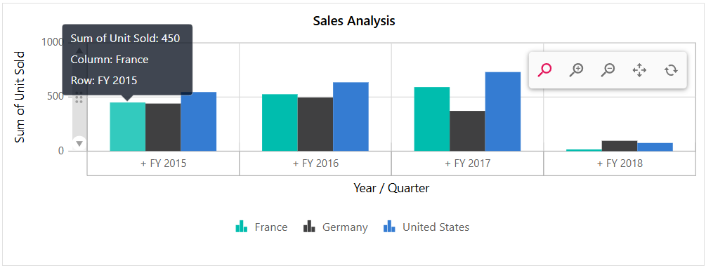
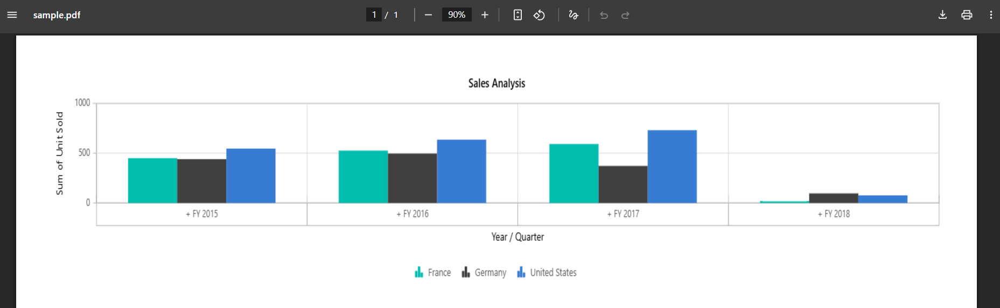

# Pivot Chart in Blazor Pivot Table Component

The Pivot Chart in the [Blazor Pivot Table](https://www.syncfusion.com/blazor-components/blazor-pivot-table) component helps users visualize aggregated values in a clear and graphical format. It provides essential options like drill down and drill up operations, over 15 chart types, and various display settings for series, axes, legends, export, print, and tooltips. The main purpose of the Pivot Chart is to present Pivot Table data in a way that is easy to understand and interact with.

To have a quick glance about Pivot Chart in the [Blazor Pivot Table](https://www.syncfusion.com/blazor-components/blazor-pivot-table), watch this video:

.

Users can display the pivot chart component individually with pivot values and modify the report dynamically using the field list and grouping bar. The [PivotViewDisplayOption](https://help.syncfusion.com/cr/blazor/Syncfusion.Blazor.PivotView.PivotViewDisplayOption.html) property in [SfPivotView](https://help.syncfusion.com/cr/blazor/Syncfusion.Blazor.PivotView.SfPivotView-1.html) class allows users to control the visibility of both the grid and chart components. This property includes the following options:

* [View](https://help.syncfusion.com/cr/blazor/Syncfusion.Blazor.PivotView.PivotViewDisplayOption.html#Syncfusion_Blazor_PivotView_PivotViewDisplayOption_View): Determines whether the Pivot Table component displays only the grid, only the chart, or both components.
* [Primary](https://help.syncfusion.com/cr/blazor/Syncfusion.Blazor.PivotView.PivotViewDisplayOption.html#Syncfusion_Blazor_PivotView_PivotViewDisplayOption_Primary): Specifies which component (grid or chart) appears as the primary view during initial loading. This option applies only when the [View](https://help.syncfusion.com/cr/blazor/Syncfusion.Blazor.PivotView.PivotViewDisplayOption.html#Syncfusion_Blazor_PivotView_PivotViewDisplayOption_View) property is set to [View.Both](https://help.syncfusion.com/cr/blazor/Syncfusion.Blazor.PivotView.View.html#Syncfusion_Blazor_PivotView_View_Both).

The following sample displays the pivot chart component based on the pivot report bound on it.

```cshtml
@using Syncfusion.Blazor.PivotView

<SfPivotView TValue="ProductDetails" Width="800" Height="500">
     <PivotViewDataSourceSettings DataSource="@data">
        <PivotViewColumns>
            <PivotViewColumn Name="Country"></PivotViewColumn>
            <PivotViewColumn Name="Products"></PivotViewColumn>
        </PivotViewColumns>
        <PivotViewRows>
            <PivotViewRow Name="Year"></PivotViewRow>
            <PivotViewRow Name="Quarter"></PivotViewRow>
        </PivotViewRows>
        <PivotViewValues>
            <PivotViewValue Name="Sold" Caption="Unit Sold"></PivotViewValue>
            <PivotViewValue Name="Amount" Caption="Sold Amount"></PivotViewValue>
        </PivotViewValues>
        <PivotViewFormatSettings>
            <PivotViewFormatSetting Name="Amount" Format="C"></PivotViewFormatSetting>
        </PivotViewFormatSettings>
    </PivotViewDataSourceSettings>
    <PivotViewDisplayOption View=View.Chart></PivotViewDisplayOption>
    <PivotChartSettings Title="Sales Analysis">
        <PivotChartSeries Type=ChartSeriesType.Column></PivotChartSeries>
    </PivotChartSettings>
</SfPivotView>

@code{
    public List<ProductDetails> data { get; set; }
    protected override void OnInitialized()
    {
        this.data = ProductDetails.GetProductData().ToList();
        //Bind the data source collection here. Refer "Assigning sample data to the pivot table" section in getting started for more details.
    }
}
```


## Data Binding

The Pivot Table component supports both local and remote data binding options to populate data in the pivot chart. Users can bind data to the component using the [DataSource](https://help.syncfusion.com/cr/blazor/Syncfusion.Blazor.PivotView.PivotViewDataSourceSettings-1.html#Syncfusion_Blazor_PivotView_PivotViewDataSourceSettings_1_DataSource) property, which accepts either an instance of [SfDataManager](https://help.syncfusion.com/cr/blazor/Syncfusion.Blazor.DataManager.html) for remote data sources or a list of objects for local data. For further details, [refer](./data-binding) here.

## Chart Types

The Pivot Chart offers 19 different chart types, allowing users to visualize and analyze data in various ways. You can choose any of these chart types based on your needs:

* Line
* Column
* Area
* Bar
* StepArea
* StackingColumn
* StackingArea
* StackingBar
* StepLine
* Pareto
* Bubble
* Scatter
* Spline
* SplineArea
* StackingColumn100
* StackingBar100
* StackingArea100
* Polar
* Radar

By default, the **Line** chart type is displayed in the Pivot Chart. Users can change the chart type at any time using the [Type](https://help.syncfusion.com/cr/blazor/Syncfusion.Blazor.PivotView.PivotChartSeries.html#Syncfusion_Blazor_PivotView_PivotChartSeries_Type) property in [PivotChartSeries](https://help.syncfusion.com/cr/blazor/Syncfusion.Blazor.PivotView.PivotChartSettings.html#Syncfusion_Blazor_PivotView_PivotChartSettings_ChartSeries) class.

In the following code sample, the pivot chart type is set as [ChartSeriesType.Bar](https://help.syncfusion.com/cr/blazor/Syncfusion.Blazor.PivotView.ChartSeriesType.html#Syncfusion_Blazor_PivotView_ChartSeriesType_Bar).

```cshtml
    @using Syncfusion.Blazor.PivotView

    <SfPivotView TValue="ProductDetails">
        <PivotViewDataSourceSettings DataSource="@data">
            <PivotViewColumns>
                <PivotViewColumn Name="Country"></PivotViewColumn>
                <PivotViewColumn Name="Products"></PivotViewColumn>
            </PivotViewColumns>
            <PivotViewRows>
                <PivotViewRow Name="Year"></PivotViewRow>
                <PivotViewRow Name="Quarter"></PivotViewRow>
            </PivotViewRows>
            <PivotViewValues>
                <PivotViewValue Name="Sold" Caption="Unit Sold"></PivotViewValue>
            </PivotViewValues>
        </PivotViewDataSourceSettings>
        <PivotViewDisplayOption View=View.Chart></PivotViewDisplayOption>
        <PivotChartSettings>
            <PivotChartSeries Type=ChartSeriesType.Bar></PivotChartSeries>
        </PivotChartSettings>
    </SfPivotView>

    @code{
        public List<ProductDetails> data { get; set; }
        protected override void OnInitialized()
        {
            this.data = ProductDetails.GetProductData().ToList();
           //Bind the data source collection here. Refer "Assigning sample data to the pivot table" section in getting started for more details.
        }
    }
```


## Accumulation Charts

Pivot Chart supports four types of accumulation charts:

- Pie
- Doughnut
- Funnel
- Pyramid

You can use any of these chart types to visualize your aggregated data clearly. To select a specific accumulation chart, set the [Type](https://help.syncfusion.com/cr/blazor/Syncfusion.Blazor.PivotView.PivotChartSeries.html#Syncfusion_Blazor_PivotView_PivotChartSeries_Type) property in the [PivotChartSeries](https://help.syncfusion.com/cr/blazor/Syncfusion.Blazor.PivotView.PivotChartSettings.html#Syncfusion_Blazor_PivotView_PivotChartSettings_ChartSeries) class.

In the code example below, the **Pie** chart is displayed by default. You can switch to other accumulation chart types, such as Doughnut, Funnel, or Pyramid, using the dropdown list.

```cshtml
@using Syncfusion.Blazor.PivotView
@using Syncfusion.Blazor.DropDowns

<div class="control-section">
    <div id="dropdown-control" style="margin-bottom:5px;">
        <table style="width: 350px;">
            <tbody>
                <tr style="height: 50px">
                    <td>
                        <div>
                            <b>Chart Type:</b>
                        </div>
                    </td>
                    <td>
                        <div>
                            <SfDropDownList TValue="ChartSeriesType" TItem="DropDownData" DataSource="@ChartTypes" @bind-Value="@ChartType">
                                <DropDownListFieldSettings Text="Name" Value="Value"></DropDownListFieldSettings>
                            </SfDropDownList>
                        </div>
                    </td>
                </tr>
            </tbody>
        </table>
    </div>
    <div class="content-wrapper">
        <SfPivotView TValue="ProductDetails" ShowFieldList=true>
            <PivotViewDataSourceSettings DataSource="@Data" ExpandAll=false EnableSorting=true>
                <PivotViewColumns>
                    <PivotViewColumn Name="Country"></PivotViewColumn>
                    <PivotViewColumn Name="Products"></PivotViewColumn>
                </PivotViewColumns>
                <PivotViewRows>
                    <PivotViewRow Name="Year"></PivotViewRow>
                    <PivotViewRow Name="Order_Source" Caption="Order Source"></PivotViewRow>
                </PivotViewRows>
                <PivotViewValues>
                    <PivotViewValue Name="Amount" Caption="Sales Amount"></PivotViewValue>
                </PivotViewValues>
                <PivotViewDrilledMembers>
                    <PivotViewDrilledMember Name="Year" Items="@DrilledMembers"></PivotViewDrilledMember>
                </PivotViewDrilledMembers>
                <PivotViewFormatSettings>
                    <PivotViewFormatSetting Name="Amount" Format="C" UseGrouping=true></PivotViewFormatSetting>
                </PivotViewFormatSettings>
            </PivotViewDataSourceSettings>
            <PivotViewDisplayOption View=View.Chart></PivotViewDisplayOption>
            <PivotChartSettings Title="Sales Analysis">
                <PivotChartSeries Type="@ChartType"></PivotChartSeries>
                <PivotChartPrimaryYAxis>
                    <PivotChartPrimaryYAxisBorder Width="0"></PivotChartPrimaryYAxisBorder>
                </PivotChartPrimaryYAxis>
            </PivotChartSettings>
        </SfPivotView>
    </div>
</div>

@code{
    public ChartSeriesType ChartType = ChartSeriesType.Pie;
    public string[] DrilledMembers = new string[] { "FY 2015" };
    public List<ProductDetails> Data { get; set; }
    protected override void OnInitialized()
    {
        this.Data = ProductDetails.GetProductData();
        //Bind the data source collection here. Refer "Assigning sample data to the pivot table" section in getting started for more details.
    }
    List<DropDownData> ChartTypes = new List<DropDownData>() {
        new DropDownData { Name = "Pie", Value = ChartSeriesType.Pie },
        new DropDownData { Name = "Doughnut", Value = ChartSeriesType.Doughnut },
        new DropDownData { Name = "Funnel", Value = ChartSeriesType.Funnel },
        new DropDownData { Name = "Pyramid", Value = ChartSeriesType.Pyramid }
    };
    public class DropDownData
    {
        public string Name { get; set; }
        public ChartSeriesType Value { get; set; }
    }
}
```


### Drill down and up

In accumulation charts, you can use the drill down and drill up options to explore data at different levels. When you click on a chart series, a built-in context menu appears with the following options:

- **Expand**: Drill down to view more detailed data for the selected series, continuing until the lowest level is reached.
- **Collapse**: Drill up to view higher-level, summarized information for that series, returning to the top level as needed.
- **Exit**: Close the context menu without making any changes.

N> You can use the drill operation for row headers only in accumulation charts.

```cshtml
@using Syncfusion.Blazor.PivotView

<SfPivotView TValue="ProductDetails">
    <PivotViewDataSourceSettings DataSource="@data" ExpandAll=false EnableSorting=true>
        <PivotViewColumns>
            <PivotViewColumn Name="Products"></PivotViewColumn>
        </PivotViewColumns>
        <PivotViewRows>
            <PivotViewRow Name="Country"></PivotViewRow>
            <PivotViewRow Name="Quarter"></PivotViewRow>
            <PivotViewRow Name="Year"></PivotViewRow>
        </PivotViewRows>
        <PivotViewValues>
            <PivotViewValue Name="Amount" Caption="Sales Amount"></PivotViewValue>
        </PivotViewValues>
        <PivotViewFormatSettings>
            <PivotViewFormatSetting Name="Amount" Format="C" UseGrouping=true></PivotViewFormatSetting>
        </PivotViewFormatSettings>
    </PivotViewDataSourceSettings>
    <PivotViewDisplayOption View=View.Chart></PivotViewDisplayOption>
    <PivotChartSettings Title="Sales Analysis">
        <PivotChartSeries Type="@ChartType">
        </PivotChartSeries>
    </PivotChartSettings>
</SfPivotView>

@code{
    public ChartSeriesType ChartType = ChartSeriesType.Pie;
    public List<ProductDetails> data { get; set; }
    protected override void OnInitialized()
    {
        this.data = ProductDetails.GetProductData().ToList();
        //Bind the data source collection here. Refer "Assigning sample data to the pivot table" section in getting started for more details.
    }
}
```


### Column Headers and Delimiters

In accumulation charts, only the values from a single column in the pivot chart are displayed. By default, the first column is used. If you want to show values from a different column, you can specify the column headers with the [ColumnHeader](https://help.syncfusion.com/cr/blazor/Syncfusion.Blazor.PivotView.PivotChartSettings.html#Syncfusion_Blazor_PivotView_PivotChartSettings_ColumnHeader) property in [PivotChartSettings](https://help.syncfusion.com/cr/blazor/Syncfusion.Blazor.PivotView.PivotChartSettings.html) class.

If the column has more than one header, enter all the headers separated by a delimiter, such as **Germany-Road Bikes**. You can set your preferred delimiter using the [ColumnDelimiter](https://help.syncfusion.com/cr/blazor/Syncfusion.Blazor.PivotView.PivotChartSettings.html#Syncfusion_Blazor_PivotView_PivotChartSettings_ColumnDelimiter) property in [PivotChartSettings](https://help.syncfusion.com/cr/blazor/Syncfusion.Blazor.PivotView.PivotChartSettings.html) class. This allows you to display the correct values in your accumulation chart according to how your columns are grouped in the Pivot Table.

```cshtml
@using Syncfusion.Blazor.PivotView

<SfPivotView TValue="ProductDetails">
    <PivotViewDataSourceSettings DataSource="@data" ExpandAll=false EnableSorting=true>
        <PivotViewColumns>
            <PivotViewColumn Name="Country"></PivotViewColumn>
            <PivotViewColumn Name="Products"></PivotViewColumn>
        </PivotViewColumns>
        <PivotViewRows>
            <PivotViewRow Name="Year"></PivotViewRow>
            <PivotViewRow Name="Quarter"></PivotViewRow>
        </PivotViewRows>
        <PivotViewValues>
            <PivotViewValue Name="Amount" Caption="Sales Amount"></PivotViewValue>
        </PivotViewValues>
        <PivotViewFormatSettings>
            <PivotViewFormatSetting Name="Amount" Format="C" UseGrouping=true></PivotViewFormatSetting>
        </PivotViewFormatSettings>
        <PivotViewDrilledMembers>
            <PivotViewDrilledMember Name="Country" Items="@(new string[] { "Germany" })"></PivotViewDrilledMember>
        </PivotViewDrilledMembers>
    </PivotViewDataSourceSettings>
    <PivotViewDisplayOption View=View.Chart></PivotViewDisplayOption>
    <PivotChartSettings Title="Sales Analysis" ColumnHeader="Germany-Road Bikes" ColumnDelimiter="-">
        <PivotChartSeries Type="@ChartType"></PivotChartSeries>
    </PivotChartSettings>
</SfPivotView>

@code{
    public ChartSeriesType ChartType = ChartSeriesType.Doughnut;
    public List<ProductDetails> data { get; set; }
    protected override void OnInitialized()
    {
        this.data = ProductDetails.GetProductData().ToList();
        //Bind the data source collection here. Refer "Assigning sample data to the pivot table" section in getting started for more details.
    }
}
```


### Data Label Customization

By default, the data labels in accumulation charts display the header name. You can control their visibility using the [Visible](https://help.syncfusion.com/cr/blazor/Syncfusion.Blazor.PivotView.PivotChartDataLabel.html#Syncfusion_Blazor_PivotView_PivotChartDataLabel_Visible) property in the [PivotChartDataLabel](https://help.syncfusion.com/cr/blazor/Syncfusion.Blazor.PivotView.PivotChartDataLabel.html) settings.

To improve label arrangement and prevent overlapping, the **Smart Labels** option arranges labels efficiently. You can disable this option by setting the [EnableSmartLabels](https://help.syncfusion.com/cr/blazor/Syncfusion.Blazor.PivotView.PivotChartSettings.html#Syncfusion_Blazor_PivotView_PivotChartSettings_EnableSmartLabels) property to **false** in the [PivotChartSettings](https://help.syncfusion.com/cr/blazor/Syncfusion.Blazor.PivotView.PivotChartSettings.html) class.

The [Position](https://help.syncfusion.com/cr/blazor/Syncfusion.Blazor.PivotView.PivotChartDataLabel.html#Syncfusion_Blazor_PivotView_PivotChartDataLabel_Position) property in [PivotChartDataLabel](https://help.syncfusion.com/cr/blazor/Syncfusion.Blazor.PivotView.PivotChartDataLabel.html) allows you to specify where the data label appears. The available options are:

* `Outside`: Places the label outside the chart point. This is the default option.
* `Inside`: Places the label inside the chart point.

In the following code sample, the data labels are placed inside the chart points.

```cshtml
@using Syncfusion.Blazor.PivotView

<SfPivotView TValue="ProductDetails">
    <PivotViewDataSourceSettings DataSource="@data" ExpandAll=false EnableSorting=true>
        <PivotViewColumns>
            <PivotViewColumn Name="Year"></PivotViewColumn>
            <PivotViewColumn Name="Products"></PivotViewColumn>
        </PivotViewColumns>
        <PivotViewRows>
            <PivotViewRow Name="Country"></PivotViewRow>
            <PivotViewRow Name="Quarter"></PivotViewRow>
        </PivotViewRows>
        <PivotViewValues>
            <PivotViewValue Name="Amount" Caption="Sales Amount"></PivotViewValue>
        </PivotViewValues>
        <PivotViewFormatSettings>
            <PivotViewFormatSetting Name="Amount" Format="C" UseGrouping=true></PivotViewFormatSetting>
        </PivotViewFormatSettings>
    </PivotViewDataSourceSettings>
    <PivotViewDisplayOption View=View.Chart></PivotViewDisplayOption>
    <PivotChartSettings Title="Sales Analysis" EnableSmartLabels="false">
        <PivotChartSeries Type="@ChartType">
            <PivotChartDataLabel Position="@Position"></PivotChartDataLabel>
        </PivotChartSeries>
    </PivotChartSettings>
</SfPivotView>

@code{
    public ChartSeriesType ChartType = ChartSeriesType.Pyramid;
    public PivotChartLabelPosition Position = PivotChartLabelPosition.Inside;
    public List<ProductDetails> data { get; set; }
    protected override void OnInitialized()
    {
        this.data = ProductDetails.GetProductData().ToList();
        //Bind the data source collection here. Refer "Assigning sample data to the pivot table" section in getting started for more details.
    }
}
```


The **Connector Line** appears when data labels are positioned outside the chart. You can style this connector line using the [ConnectorStyle](https://help.syncfusion.com/cr/blazor/Syncfusion.Blazor.PivotView.PivotChartDataLabel.html#Syncfusion_Blazor_PivotView_PivotChartDataLabel_ConnectorStyle) property in [PivotChartDataLabel](https://help.syncfusion.com/cr/blazor/Syncfusion.Blazor.PivotView.PivotChartDataLabel.html) class to modify its color, length, width, and other properties. In the example below, the connector line appearance is changed to show a different style.

```cshtml
@using Syncfusion.Blazor.PivotView

<SfPivotView TValue="ProductDetails">
    <PivotViewDataSourceSettings DataSource="@data" ExpandAll=false EnableSorting=true>
        <PivotViewColumns>
            <PivotViewColumn Name="Year"></PivotViewColumn>
            <PivotViewColumn Name="Products"></PivotViewColumn>
        </PivotViewColumns>
        <PivotViewRows>
            <PivotViewRow Name="Country"></PivotViewRow>
            <PivotViewRow Name="Quarter"></PivotViewRow>
        </PivotViewRows>
        <PivotViewValues>
            <PivotViewValue Name="Amount" Caption="Sales Amount"></PivotViewValue>
        </PivotViewValues>
        <PivotViewFormatSettings>
            <PivotViewFormatSetting Name="Amount" Format="C" UseGrouping=true></PivotViewFormatSetting>
        </PivotViewFormatSettings>
    </PivotViewDataSourceSettings>
    <PivotViewDisplayOption View=View.Chart></PivotViewDisplayOption>
    <PivotChartSettings Title="Sales Analysis" EnableSmartLabels="true">
        <PivotChartSeries Type="@ChartType">
            <PivotChartDataLabel Position="@Position">
                <PivotChartConnectorStyle Color="#f4429e" Length="50px" Width="2" DashArray="5,3">
                </PivotChartConnectorStyle>
            </PivotChartDataLabel>
        </PivotChartSeries>
    </PivotChartSettings>
</SfPivotView>

@code{
    public ChartSeriesType ChartType = ChartSeriesType.Funnel;
    public PivotChartLabelPosition Position = PivotChartLabelPosition.Outside;
    public List<ProductDetails> data { get; set; }
    protected override void OnInitialized()
    {
        this.data = ProductDetails.GetProductData().ToList();
        //Bind the data source collection here. Refer "Assigning sample data to the pivot table" section in getting started for more details.
    }
}
```


### Data Label Template

The [Template](https://help.syncfusion.com/cr/blazor/Syncfusion.Blazor.PivotView.PivotChartMarkerDataLabel.html#Syncfusion_Blazor_PivotView_PivotChartMarkerDataLabel_Template) property in the [PivotChartDataLabel](https://help.syncfusion.com/cr/blazor/Syncfusion.Blazor.PivotView.PivotChartDataLabel.html) class lets users change the look of data labels in the pivot chart series using custom HTML elements. The [AccumulationChartDataPointInfo](https://help.syncfusion.com/cr/blazor/Syncfusion.Blazor.Charts.AccumulationChartDataPointInfo.html) parameter is passed as context to the template, enabling access to data points like x and y for displaying them in a custom design, as shown below.

```cshtml
@using Syncfusion.Blazor.PivotView
@using Syncfusion.Blazor.Charts

<SfPivotView TValue="ProductDetails">
    <PivotViewDisplayOption View=View.Chart></PivotViewDisplayOption>
    <PivotViewDataSourceSettings DataSource="@data">
        <PivotViewColumns>
            <PivotViewColumn Name="Year"></PivotViewColumn>
            <PivotViewColumn Name="Quarter"></PivotViewColumn>
        </PivotViewColumns>
        <PivotViewRows>
            <PivotViewRow Name="Country"></PivotViewRow>
            <PivotViewRow Name="Products"></PivotViewRow>
        </PivotViewRows>
        <PivotViewValues>
            <PivotViewValue Name="Amount" Caption="Sold Amount"></PivotViewValue>
        </PivotViewValues>
        <PivotViewFormatSettings>
            <PivotViewFormatSetting Name="Amount" Format="C"></PivotViewFormatSetting>
        </PivotViewFormatSettings>
    </PivotViewDataSourceSettings>
    <PivotChartSettings Title="Sales Analysis">
        <PivotChartSeries Type="Syncfusion.Blazor.PivotView.ChartSeriesType.Pie">
            <PivotChartPrimaryYAxis>
                <PivotChartPrimaryYAxisBorder Width="0"></PivotChartPrimaryYAxisBorder>
            </PivotChartPrimaryYAxis>
            <PivotChartDataLabel Visible=true Position="PivotChartLabelPosition.Outside">
                <Template>
                    @{
                        var data = context as AccumulationChartDataPointInfo;
                    }
                    <table>
                        <tr>
                            <td align="center" style="background-color: #C1272D; font-size: 14px; color: whitesmoke; font-weight: bold; padding: 5px">@data.X : @data.Y</td>
                        </tr>
                    </table>
                </Template>
            </PivotChartDataLabel>
        </PivotChartSeries>
    </PivotChartSettings>
</SfPivotView>

@code
{
    public List<ProductDetails> data { get; set; }
    protected override void OnInitialized()
    {
        this.data = ProductDetails.GetProductData().ToList();
        //Bind the data source collection here. Refer "Assigning sample data to the pivot table" section in getting started for more details.
    }
}
```


### Pie and Doughnut Customization

You can draw pie and doughnut charts within a specific range by using the [StartAngle](https://help.syncfusion.com/cr/blazor/Syncfusion.Blazor.PivotView.PivotChartSeries.html#Syncfusion_Blazor_PivotView_PivotChartSeries_StartAngle) and [EndAngle](https://help.syncfusion.com/cr/blazor/Syncfusion.Blazor.PivotView.PivotChartSeries.html#Syncfusion_Blazor_PivotView_PivotChartSeries_EndAngle) properties in the [PivotChartSeries](https://help.syncfusion.com/cr/blazor/Syncfusion.Blazor.PivotView.PivotChartSeries.html) class. The default value for the [StartAngle](https://help.syncfusion.com/cr/blazor/Syncfusion.Blazor.PivotView.PivotChartSeries.html#Syncfusion_Blazor_PivotView_PivotChartSeries_StartAngle) property is **0**, and the [EndAngle](https://help.syncfusion.com/cr/blazor/Syncfusion.Blazor.PivotView.PivotChartSeries.html#Syncfusion_Blazor_PivotView_PivotChartSeries_EndAngle) property is **360**. By modifying these properties, you can create semi-pie and semi-doughnut charts.

```cshtml
@using Syncfusion.Blazor.PivotView

<SfPivotView TValue="ProductDetails">
    <PivotViewDataSourceSettings DataSource="@data" ExpandAll=false EnableSorting=true>
        <PivotViewColumns>
            <PivotViewColumn Name="Year"></PivotViewColumn>
            <PivotViewColumn Name="Products"></PivotViewColumn>
        </PivotViewColumns>
        <PivotViewRows>
            <PivotViewRow Name="Country"></PivotViewRow>
            <PivotViewRow Name="Quarter"></PivotViewRow>
        </PivotViewRows>
        <PivotViewValues>
            <PivotViewValue Name="Amount" Caption="Sales Amount"></PivotViewValue>
        </PivotViewValues>
        <PivotViewFormatSettings>
            <PivotViewFormatSetting Name="Amount" Format="C" UseGrouping=true></PivotViewFormatSetting>
        </PivotViewFormatSettings>
    </PivotViewDataSourceSettings>
    <PivotViewDisplayOption View=View.Chart></PivotViewDisplayOption>
    <PivotChartSettings Title="Sales Analysis">
        <PivotChartSeries Type="@ChartType" StartAngle="270" EndAngle="90"></PivotChartSeries>
    </PivotChartSettings>
</SfPivotView>

@code{
    public ChartSeriesType ChartType = ChartSeriesType.Doughnut;
    public List<ProductDetails> data { get; set; }
    protected override void OnInitialized()
    {
        this.data = ProductDetails.GetProductData().ToList();
        //Bind the data source collection here. Refer "Assigning sample data to the pivot table" section in getting started for more details.
    }
}
```


You can convert a pie chart to a doughnut chart and vice-versa using the [InnerRadius](https://help.syncfusion.com/cr/blazor/Syncfusion.Blazor.PivotView.PivotChartSeries.html#Syncfusion_Blazor_PivotView_PivotChartSeries_InnerRadius) property in the [PivotChartSeries](https://help.syncfusion.com/cr/blazor/Syncfusion.Blazor.PivotView.PivotChartSeries.html) class. When this property is set to a value greater than **0** percent, the chart appears as a doughnut instead of a pie chart.

N> This property accepts values only in percentage format.

```cshtml
@using Syncfusion.Blazor.PivotView

<SfPivotView TValue="ProductDetails">
    <PivotViewDataSourceSettings DataSource="@data" ExpandAll=false EnableSorting=true>
        <PivotViewColumns>
            <PivotViewColumn Name="Year"></PivotViewColumn>
            <PivotViewColumn Name="Products"></PivotViewColumn>
        </PivotViewColumns>
        <PivotViewRows>
            <PivotViewRow Name="Country"></PivotViewRow>
            <PivotViewRow Name="Quarter"></PivotViewRow>
        </PivotViewRows>
        <PivotViewValues>
            <PivotViewValue Name="Amount" Caption="Sales Amount"></PivotViewValue>
        </PivotViewValues>
        <PivotViewFormatSettings>
            <PivotViewFormatSetting Name="Amount" Format="C" UseGrouping=true></PivotViewFormatSetting>
        </PivotViewFormatSettings>
    </PivotViewDataSourceSettings>
    <PivotViewDisplayOption View=View.Chart></PivotViewDisplayOption>
    <PivotChartSettings Title="Sales Analysis">
        <PivotChartSeries Type="@ChartType" InnerRadius="140">
        </PivotChartSeries>
    </PivotChartSettings>
</SfPivotView>

@code{
    public ChartSeriesType ChartType = ChartSeriesType.Pie;
    public List<ProductDetails> data { get; set; }
    protected override void OnInitialized()
    {
        this.data = ProductDetails.GetProductData().ToList();
        //Bind the data source collection here. Refer "Assigning sample data to the pivot table" section in getting started for more details.
    }
}
```


#### Radius customization

Users can adjust the radius of a pie chart series using the [Radius](https://help.syncfusion.com/cr/blazor/Syncfusion.Blazor.PivotView.PivotChartSeries.html#Syncfusion_Blazor_PivotView_PivotChartSeries_Radius) property in the [PivotChartSeries](https://help.syncfusion.com/cr/blazor/Syncfusion.Blazor.PivotView.PivotChartSeries.html) class. By default, the pie chart series has a radius of 80% of its total size. For example, the following code sets the radius to 70%.

```cshtml
@using Syncfusion.Blazor.PivotView

<SfPivotView TValue="ProductDetails">
    <PivotViewDisplayOption View=View.Chart></PivotViewDisplayOption>
    <PivotViewDataSourceSettings DataSource="@data">
        <PivotViewColumns>
            <PivotViewColumn Name="Year"></PivotViewColumn>
            <PivotViewColumn Name="Quarter"></PivotViewColumn>
        </PivotViewColumns>
        <PivotViewRows>
            <PivotViewRow Name="Country"></PivotViewRow>
            <PivotViewRow Name="Products"></PivotViewRow>
        </PivotViewRows>
        <PivotViewValues>
            <PivotViewValue Name="Amount" Caption="Sold Amount"></PivotViewValue>
        </PivotViewValues>
        <PivotViewFormatSettings>
            <PivotViewFormatSetting Name="Amount" Format="C"></PivotViewFormatSetting>
        </PivotViewFormatSettings>
    </PivotViewDataSourceSettings>
    <PivotChartSettings Title="Sales Analysis">
        <PivotChartSeries Type="ChartSeriesType.Pie" Radius="70%"></PivotChartSeries>
    </PivotChartSettings>
</SfPivotView>

@code{
    public List<ProductDetails> data { get; set; }
    protected override void OnInitialized()
    {
        this.data = ProductDetails.GetProductData().ToList();
        //Bind the data source collection here. Refer "Assigning sample data to the pivot table" section in getting started for more details.
    }
}
```


You can adjust the radius of each slice (i.e., data point) in the chart series using the [ChartSeriesCreated](https://help.syncfusion.com/cr/blazor/Syncfusion.Blazor.PivotView.PivotViewEvents-1.html#Syncfusion_Blazor_PivotView_PivotViewEvents_1_ChartSeriesCreated) event, which triggers when a series is rendered in the chart area. In this event, you can set the [Radius](https://help.syncfusion.com/cr/blazor/Syncfusion.Blazor.PivotView.PivotChartData.html#Syncfusion_Blazor_PivotView_PivotChartData_Radius) property for each data object in the data source, enabling the display of pie chart slices with varying radii to suit your needs.

In the [ChartSeriesCreated](https://help.syncfusion.com/cr/blazor/Syncfusion.Blazor.PivotView.PivotViewEvents-1.html#Syncfusion_Blazor_PivotView_PivotViewEvents_1_ChartSeriesCreated) event, the radius of each slice in the pie chart series is set to different values: **80%**, **85%**, and **90%**, as shown in the following code sample. To apply these radius values effectively, you must set the `args.Series[0].Radius` property to **Radius**.

```cshtml
@using Syncfusion.Blazor.PivotView

<SfPivotView TValue="ProductDetails">
    <PivotViewDisplayOption View=View.Chart></PivotViewDisplayOption>
    <PivotViewDataSourceSettings DataSource="@data">
        <PivotViewColumns>
            <PivotViewColumn Name="Year"></PivotViewColumn>
            <PivotViewColumn Name="Quarter"></PivotViewColumn>
        </PivotViewColumns>
        <PivotViewRows>
            <PivotViewRow Name="Country"></PivotViewRow>
            <PivotViewRow Name="Products"></PivotViewRow>
        </PivotViewRows>
        <PivotViewValues>
            <PivotViewValue Name="Amount" Caption="Sold Amount"></PivotViewValue>
        </PivotViewValues>
        <PivotViewFormatSettings>
            <PivotViewFormatSetting Name="Amount" Format="C"></PivotViewFormatSetting>
        </PivotViewFormatSettings>
    </PivotViewDataSourceSettings>
    <PivotChartSettings Title="Sales Analysis">
        <PivotChartSeries Type="ChartSeriesType.Pie"></PivotChartSeries>
    </PivotChartSettings>
    <PivotViewEvents TValue="ProductDetails" ChartSeriesCreated="ChartSeriesCreated"></PivotViewEvents>
</SfPivotView>

@code{
    public List<ProductDetails> data { get; set; }
    protected override void OnInitialized()
    {
        this.data = ProductDetails.GetProductData().ToList();
        //Bind the data source collection here. Refer "Assigning sample data to the pivot table" section in getting started for more details.
    }

    private void ChartSeriesCreated(ChartSeriesCreatedEventArgs args)
    {
        var Data = args.Series[0].DataSource;
        Data[0].Radius = "80%";
        Data[1].Radius = "85%";
        Data[2].Radius = "90%";
        args.Series[0].Radius = "Radius";
    }
}
```


### Exploding Series Points

You can make an individual point in a pivot chart stand out by enabling the exploding option. To do this, set the [Explode](https://help.syncfusion.com/cr/blazor/Syncfusion.Blazor.PivotView.PivotChartSeries.html#Syncfusion_Blazor_PivotView_PivotChartSeries_Explode) property in the [PivotChartSeries](https://help.syncfusion.com/cr/blazor/Syncfusion.Blazor.PivotView.PivotChartSeries.html) class to **true**. When this option is turned on, a chart point will separate from the rest of the series when a user clicks it with a mouse or taps it on a touch device. This makes it easier for users to highlight and identify specific data points in accumulation charts like Pie, Doughnut, Funnel, or Pyramid.

```cshtml
@using Syncfusion.Blazor.PivotView

<SfPivotView TValue="ProductDetails">
    <PivotViewDataSourceSettings DataSource="@data" ExpandAll=false EnableSorting=true>
        <PivotViewColumns>
            <PivotViewColumn Name="Year"></PivotViewColumn>
            <PivotViewColumn Name="Products"></PivotViewColumn>
        </PivotViewColumns>
        <PivotViewRows>
            <PivotViewRow Name="Country"></PivotViewRow>
            <PivotViewRow Name="Quarter"></PivotViewRow>
        </PivotViewRows>
        <PivotViewValues>
            <PivotViewValue Name="Amount" Caption="Sales Amount"></PivotViewValue>
        </PivotViewValues>
        <PivotViewFormatSettings>
            <PivotViewFormatSetting Name="Amount" Format="C" UseGrouping=true></PivotViewFormatSetting>
        </PivotViewFormatSettings>
    </PivotViewDataSourceSettings>
    <PivotViewDisplayOption View=View.Chart></PivotViewDisplayOption>
    <PivotChartSettings Title="Sales Analysis">
        <PivotChartSeries Type="@ChartType" Explode="true">
        </PivotChartSeries>
    </PivotChartSettings>
</SfPivotView>

@code{
    public ChartSeriesType ChartType = ChartSeriesType.Pie;
    public List<ProductDetails> data { get; set; }
    protected override void OnInitialized()
    {
        this.data = ProductDetails.GetProductData().ToList();
        //Bind the data source collection here. Refer "Assigning sample data to the pivot table" section in getting started for more details.
    }
}
```


## Field List

The field list makes it easy to add, remove, or rearrange fields in the pivot chart, so you can display exactly the data you need. To show the field list in the Pivot Chart, set the [ShowFieldList](https://help.syncfusion.com/cr/blazor/Syncfusion.Blazor.PivotView.SfPivotView-1.html#Syncfusion_Blazor_PivotView_SfPivotView_1_ShowFieldList) property in [SfPivotView](https://help.syncfusion.com/cr/blazor/Syncfusion.Blazor.PivotView.SfPivotView-1.html) class to **true**. When you make changes with the field list, the pivot chart updates right away to show the new results. To learn more about the field list and how it works, see the [field list](./field-list) topic in the documentation.

```cshtml
@using Syncfusion.Blazor.PivotView

<SfPivotView TValue="ProductDetails" ShowFieldList="true">
     <PivotViewDataSourceSettings DataSource="@data">
        <PivotViewColumns>
            <PivotViewColumn Name="Country"></PivotViewColumn>
            <PivotViewColumn Name="Products"></PivotViewColumn>
        </PivotViewColumns>
        <PivotViewRows>
            <PivotViewRow Name="Year"></PivotViewRow>
            <PivotViewRow Name="Quarter"></PivotViewRow>
        </PivotViewRows>
        <PivotViewValues>
            <PivotViewValue Name="Sold" Caption="Unit Sold"></PivotViewValue>
            <PivotViewValue Name="Amount" Caption="Sold Amount"></PivotViewValue>
        </PivotViewValues>
        <PivotViewFormatSettings>
            <PivotViewFormatSetting Name="Amount" Format="C"></PivotViewFormatSetting>
        </PivotViewFormatSettings>
    </PivotViewDataSourceSettings>
    <PivotViewDisplayOption View=View.Chart></PivotViewDisplayOption>
    <PivotChartSettings Title="Sales Analysis">
        <PivotChartSeries Type=ChartSeriesType.Column></PivotChartSeries>
    </PivotChartSettings>
</SfPivotView>

@code{
    public List<ProductDetails> data { get; set; }
    protected override void OnInitialized()
    {
        this.data = ProductDetails.GetProductData().ToList();
        //Bind the data source collection here. Refer "Assigning sample data to the pivot table" section in getting started for more details.
    }
}
```


## Grouping Bar

You can display the grouping bar in the Pivot Chart by setting the [ShowGroupingBar](https://help.syncfusion.com/cr/blazor/Syncfusion.Blazor.PivotView.SfPivotView-1.html#Syncfusion_Blazor_PivotView_SfPivotView_1_ShowGroupingBar) property in [SfPivotView](https://help.syncfusion.com/cr/blazor/Syncfusion.Blazor.PivotView.SfPivotView-1.html) class to **true**. When enabled, the grouping bar in the pivot chart shows a drop-down list on the value axis. This drop-down lets users select from the value fields defined in [PivotViewDataSourceSettings](https://help.syncfusion.com/cr/blazor/Syncfusion.Blazor.PivotView.PivotViewDataSourceSettings-1.html). Users can switch between these fields to update the chart based on the selected value field. This method of selection is the default behavior in the Pivot Chart component. For more details about how the grouping bar works, refer to the [grouping bar](./grouping-bar) documentation.

N> When there are multiple axes, buttons appear on the value axis instead of the drop-down list.

```cshtml
@using Syncfusion.Blazor.PivotView

<SfPivotView TValue="ProductDetails" Width="100%" Height="300" ShowGroupingBar="true">
     <PivotViewDataSourceSettings DataSource="@data">
        <PivotViewColumns>
            <PivotViewColumn Name="Country"></PivotViewColumn>
            <PivotViewColumn Name="Products"></PivotViewColumn>
        </PivotViewColumns>
        <PivotViewRows>
            <PivotViewRow Name="Year"></PivotViewRow>
            <PivotViewRow Name="Quarter"></PivotViewRow>
        </PivotViewRows>
        <PivotViewValues>
            <PivotViewValue Name="Sold" Caption="Unit Sold"></PivotViewValue>
            <PivotViewValue Name="Amount" Caption="Sold Amount"></PivotViewValue>
        </PivotViewValues>
        <PivotViewFormatSettings>
            <PivotViewFormatSetting Name="Amount" Format="C"></PivotViewFormatSetting>
        </PivotViewFormatSettings>
    </PivotViewDataSourceSettings>
    <PivotViewDisplayOption View=View.Chart></PivotViewDisplayOption>
    <PivotChartSettings Title="Sales Analysis">
        <PivotChartSeries Type=ChartSeriesType.Column></PivotChartSeries>
    </PivotChartSettings>
</SfPivotView>

@code{
    public List<ProductDetails> data { get; set; }
    protected override void OnInitialized()
    {
        this.data = ProductDetails.GetProductData().ToList();
        //Bind the data source collection here. Refer "Assigning sample data to the pivot table" section in getting started for more details.
    }
}
```


When using accumulation charts, the drop-down list appears on the column axis. This list contains the column headers available in the Pivot Chart. Users can switch column headers using this drop-down, and the accumulation chart will update with the selected header.

```cshtml
@using Syncfusion.Blazor.PivotView

<SfPivotView TValue="ProductDetails" ShowGroupingBar="true">
    <PivotViewDataSourceSettings DataSource="@data" ExpandAll=false EnableSorting=true>
        <PivotViewColumns>
            <PivotViewColumn Name="Year"></PivotViewColumn>
            <PivotViewColumn Name="Products"></PivotViewColumn>
        </PivotViewColumns>
        <PivotViewRows>
            <PivotViewRow Name="Country"></PivotViewRow>
            <PivotViewRow Name="Quarter"></PivotViewRow>
        </PivotViewRows>
        <PivotViewValues>
            <PivotViewValue Name="Amount" Caption="Sales Amount"></PivotViewValue>
        </PivotViewValues>
        <PivotViewFormatSettings>
            <PivotViewFormatSetting Name="Amount" Format="C" UseGrouping=true></PivotViewFormatSetting>
        </PivotViewFormatSettings>
    </PivotViewDataSourceSettings>
    <PivotViewDisplayOption View=View.Chart></PivotViewDisplayOption>
    <PivotChartSettings Title="Sales Analysis">
        <PivotChartSeries Type="@ChartType">
        </PivotChartSeries>
    </PivotChartSettings>
</SfPivotView>

@code{
    public ChartSeriesType ChartType = ChartSeriesType.Pie;
    public List<ProductDetails> data { get; set; }
    protected override void OnInitialized()
    {
        this.data = ProductDetails.GetProductData().ToList();
        //Bind the data source collection here. Refer "Assigning sample data to the pivot table" section in getting started for more details.
    }
}
```


## Single Axis

By default, the pivot chart uses the first value field (measure) from your report as the value axis. If you want to display data using a different value field, you can do this easily. Use the [Value](https://help.syncfusion.com/cr/blazor/Syncfusion.Blazor.PivotView.PivotChartSettings.html#Syncfusion_Blazor_PivotView_PivotChartSettings_Value) property inside [PivotChartSettings](https://help.syncfusion.com/cr/blazor/Syncfusion.Blazor.PivotView.PivotChartSettings.html) class. This option lets you show a specific value field in the pivot chart, allowing you to focus on the data you need.

```cshtml
@using Syncfusion.Blazor.PivotView

<SfPivotView TValue="ProductDetails">
<PivotViewDataSourceSettings DataSource="@data">
        <PivotViewColumns>
            <PivotViewColumn Name="Country"></PivotViewColumn>
            <PivotViewColumn Name="Products"></PivotViewColumn>
        </PivotViewColumns>
        <PivotViewRows>
            <PivotViewRow Name="Year"></PivotViewRow>
            <PivotViewRow Name="Quarter"></PivotViewRow>
        </PivotViewRows>
        <PivotViewValues>
            <PivotViewValue Name="Sold" Caption="Unit Sold"></PivotViewValue>
            <PivotViewValue Name="Amount" Caption="Sold Amount"></PivotViewValue>
        </PivotViewValues>
        <PivotViewFormatSettings>
            <PivotViewFormatSetting Name="Amount" Format="C"></PivotViewFormatSetting>
        </PivotViewFormatSettings>
    </PivotViewDataSourceSettings>
    <PivotViewDisplayOption View=View.Chart></PivotViewDisplayOption>
    <PivotChartSettings Value="Amount" Title="Sales Analysis">
        <PivotChartSeries Type=ChartSeriesType.Column></PivotChartSeries>
    </PivotChartSettings>
</SfPivotView>

@code{
    public List<ProductDetails> data { get; set; }
    protected override void OnInitialized()
    {
        this.data = ProductDetails.GetProductData().ToList();
        //Bind the data source collection here. Refer "Assigning sample data to the pivot table" section in getting started for more details.
    }
}
```


## Multiple Axis

The pivot chart can be drawn with multiple value fields by setting the [EnableMultipleAxis](https://help.syncfusion.com/cr/blazor/Syncfusion.Blazor.PivotView.PivotChartSettings.html#Syncfusion_Blazor_PivotView_PivotChartSettings_EnableMultipleAxis) property to **true** in the [PivotChartSettings](https://help.syncfusion.com/cr/blazor/Syncfusion.Blazor.PivotView.PivotChartSettings.html) class. In the following code sample, the pivot chart displays both value fields **Sold** and **Amount** from the [PivotViewDataSourceSettings](https://help.syncfusion.com/cr/blazor/Syncfusion.Blazor.PivotView.PivotViewDataSourceSettings-1.html).

N> Multiple axis support is not applicable for accumulation chart types like pie, doughnut, pyramid, and funnel.

```cshtml
@using Syncfusion.Blazor.PivotView

<SfPivotView TValue="ProductDetails" Width="800">
    <PivotViewDataSourceSettings DataSource="@data">
        <PivotViewColumns>
            <PivotViewColumn Name="Country"></PivotViewColumn>
            <PivotViewColumn Name="Products"></PivotViewColumn>
        </PivotViewColumns>
        <PivotViewRows>
            <PivotViewRow Name="Year"></PivotViewRow>
            <PivotViewRow Name="Quarter"></PivotViewRow>
        </PivotViewRows>
        <PivotViewValues>
            <PivotViewValue Name="Sold" Caption="Unit Sold"></PivotViewValue>
            <PivotViewValue Name="Amount" Caption="Sold Amount"></PivotViewValue>
        </PivotViewValues>
    </PivotViewDataSourceSettings>
    <PivotViewDisplayOption View=View.Chart></PivotViewDisplayOption>
    <PivotChartSettings EnableMultipleAxis="true">
        <PivotChartSeries Type=ChartSeriesType.Column></PivotChartSeries>
    </PivotChartSettings>
</SfPivotView>

@code{
    public List<ProductDetails> data { get; set; }
    protected override void OnInitialized()
    {
        this.data = ProductDetails.GetProductData().ToList();
        //Bind the data source collection here. Refer "Assigning sample data to the pivot table" section in getting started for more details.
    }
}
```


When binding more value fields, the result displays multiple pivot charts, with each chart shrinking within the parent container height. To prevent this behavior, set the [EnableScrollOnMultiAxis](https://help.syncfusion.com/cr/blazor/Syncfusion.Blazor.PivotView.PivotChartSettings.html#Syncfusion_Blazor_PivotView_PivotChartSettings_EnableScrollOnMultiAxis) property to **true** in the [PivotChartSettings](https://help.syncfusion.com/cr/blazor/Syncfusion.Blazor.PivotView.PivotChartSettings.html) class. This ensures each pivot chart maintains a minimum height of "160px" to "180px" and displays a vertical scroll bar for better visibility.

```cshtml
@using Syncfusion.Blazor.PivotView

<SfPivotView TValue="ProductDetails" Width="800">
    <PivotViewDataSourceSettings DataSource="@data">
        <PivotViewColumns>
            <PivotViewColumn Name="Country"></PivotViewColumn>
            <PivotViewColumn Name="Products"></PivotViewColumn>
        </PivotViewColumns>
        <PivotViewRows>
            <PivotViewRow Name="Year"></PivotViewRow>
            <PivotViewRow Name="Quarter"></PivotViewRow>
        </PivotViewRows>
        <PivotViewValues>
            <PivotViewValue Name="Sold" Caption="Unit Sold"></PivotViewValue>
            <PivotViewValue Name="Amount" Caption="Sold Amount"></PivotViewValue>
        </PivotViewValues>
    </PivotViewDataSourceSettings>
    <PivotViewDisplayOption View=View.Chart></PivotViewDisplayOption>
    <PivotChartSettings EnableMultipleAxis="true" EnableScrollOnMultiAxis="true">
        <PivotChartSeries Type=ChartSeriesType.Column></PivotChartSeries>
    </PivotChartSettings>
</SfPivotView>

@code{
    public List<ProductDetails> data { get; set; }
    protected override void OnInitialized()
    {
        this.data = ProductDetails.GetProductData().ToList();
        //Bind the data source collection here. Refer "Assigning sample data to the pivot table" section in getting started for more details.
    }
}
```


Alternatively, you can display multiple values in a single chart. In this approach, the series from multiple values are grouped and displayed together. Based on the values, multiple Y-axis scales are created with different ranges. This can be achieved by setting [EnableMultipleAxis](https://help.syncfusion.com/cr/blazor/Syncfusion.Blazor.PivotView.PivotChartSettings.html#Syncfusion_Blazor_PivotView_PivotChartSettings_EnableMultipleAxis) to **true** and [MultipleAxisMode](https://help.syncfusion.com/cr/blazor/Syncfusion.Blazor.PivotView.PivotChartSettings.html#Syncfusion_Blazor_PivotView_PivotChartSettings_MultipleAxisMode) to **Single** in the [PivotChartSettings](https://help.syncfusion.com/cr/blazor/Syncfusion.Blazor.PivotView.PivotChartSettings.html) class.

In the following code sample, the pivot chart appears as a single chart with multiple value fields such as **Sold** and **Amount**, each represented with its own Y-axis.

```cshtml
@using Syncfusion.Blazor.PivotView

<SfPivotView ID="PivotView" TValue="ProductDetails" Height="400" Width="1400">
<PivotViewDisplayOption View="View.Chart" Primary="Primary.Chart"></PivotViewDisplayOption>
    <PivotViewDataSourceSettings DataSource="@pivotData" ExpandAll="false" AllowLabelFilter="true" AllowMemberFilter="true" AllowValueFilter="true" EnableSorting=true>
        <PivotViewColumns>
            <PivotViewColumn Name="Year"></PivotViewColumn>
            <PivotViewColumn Name="Quarter"></PivotViewColumn>
        </PivotViewColumns>
        <PivotViewRows>
            <PivotViewRow Name="Country"></PivotViewRow>
            <PivotViewRow Name="Products"></PivotViewRow>
        </PivotViewRows>
        <PivotViewValues>
            <PivotViewValue Name="Sold" Caption="Units Sold"></PivotViewValue>
            <PivotViewValue Name="Amount" Caption="Sold Amount"></PivotViewValue>
        </PivotViewValues>
    </PivotViewDataSourceSettings>
    <PivotChartSettings Title="Sales Analysis" EnableMultipleAxis="true" MultipleAxisMode="MultipleAxisMode.Single">
        <PivotChartSeries Type=Syncfusion.Blazor.PivotView.ChartSeriesType.Column></PivotChartSeries>
    </PivotChartSettings>
</SfPivotView>

@code{
    public List<ProductDetails> pivotData { get; set; }
    protected override void OnInitialized()
    {
        this.pivotData = ProductDetails.GetProductData().ToList();
        //Bind the data source collection here. Refer "Assigning sample data to the pivot table" section in getting started for more details.
    }
}
```


To display multiple value fields on a single y-axis in the pivot chart, set the [EnableMultipleAxis](https://help.syncfusion.com/cr/blazor/Syncfusion.Blazor.PivotView.PivotChartSettings.html#Syncfusion_Blazor_PivotView_PivotChartSettings_EnableMultipleAxis) property to **true** and the [MultipleAxisMode](https://help.syncfusion.com/cr/blazor/Syncfusion.Blazor.PivotView.MultipleAxisMode.html) property to **Combined** in the [PivotChartSettings](https://help.syncfusion.com/cr/blazor/Syncfusion.Blazor.PivotView.PivotChartSettings.html) class.

> The y-axis range values are formatted based on the first value field in the value axis. For example, if the first value field uses currency format and other value fields use different number formats or no format, the y-axis range values will appear in the currency format of the first value field.

The following code sample shows a pivot chart with multiple value fields, such as **Sold** and **Amount**, displayed on a single y-axis.

```cshtml
@using Syncfusion.Blazor.PivotView

<SfPivotView ID="PivotView" TValue="ProductDetails" Height="400" Width="1400">
<PivotViewDisplayOption View="View.Chart" Primary="Primary.Chart"></PivotViewDisplayOption>
    <PivotViewDataSourceSettings DataSource="@pivotData" ExpandAll="false" AllowLabelFilter="true" AllowMemberFilter="true" AllowValueFilter="true" EnableSorting=true>
        <PivotViewColumns>
            <PivotViewColumn Name="Year"></PivotViewColumn>
            <PivotViewColumn Name="Quarter"></PivotViewColumn>
        </PivotViewColumns>
        <PivotViewRows>
            <PivotViewRow Name="Country"></PivotViewRow>
            <PivotViewRow Name="Products"></PivotViewRow>
        </PivotViewRows>
        <PivotViewValues>
            <PivotViewValue Name="Sold" Caption="Units Sold"></PivotViewValue>
            <PivotViewValue Name="Amount" Caption="Sold Amount"></PivotViewValue>
        </PivotViewValues>
    </PivotViewDataSourceSettings>
    <PivotChartSettings Title="Sales Analysis"  EnableMultipleAxis="true" MultipleAxisMode=MultipleAxisMode.Combined>
        <PivotChartSeries Type=Syncfusion.Blazor.PivotView.ChartSeriesType.Column></PivotChartSeries>
    </PivotChartSettings>
</SfPivotView>

@code{
    public List<ProductDetails> pivotData { get; set; }
    protected override void OnInitialized()
    {
        this.pivotData = ProductDetails.GetProductData().ToList();
        //Bind the data source collection here. Refer "Assigning sample data to the pivot table" section in getting started for more details.
    }
}
```


### Show point color based on members

When you enable multiple axes in the pivot chart, you can use the [ShowPointColorByMembers](https://help.syncfusion.com/cr/blazor/Syncfusion.Blazor.PivotView.PivotChartSettings.html#Syncfusion_Blazor_PivotView_PivotChartSettings_ShowPointColorByMembers) property in the [PivotChartSettings](https://help.syncfusion.com/cr/blazor/Syncfusion.Blazor.PivotView.PivotChartSettings.html) class to display the same color for each member on the column axis across all measures. Setting this property to **true** makes it easy for users to spot and compare each member throughout the entire chart.

In addition, users can show or hide specific members from all measures in the chart by clicking the corresponding legend item. This interaction allows users to focus on the members they want to analyze without distraction.

```cshtml
@using Syncfusion.Blazor.PivotView
<SfPivotView ID="PivotView" TValue="ProductDetails">
    <PivotViewDisplayOption View="View.Chart" Primary="Primary.Chart"></PivotViewDisplayOption>
    <PivotViewDataSourceSettings DataSource="@pivotData" ExpandAll="false" EnableSorting=true>
        <PivotViewColumns>
            <PivotViewColumn Name="Year"></PivotViewColumn>
            <PivotViewColumn Name="Quarter"></PivotViewColumn>
        </PivotViewColumns>
        <PivotViewRows>
            <PivotViewRow Name="Country"></PivotViewRow>
            <PivotViewRow Name="Products"></PivotViewRow>
        </PivotViewRows>
        <PivotViewValues>
            <PivotViewValue Name="Sold" Caption="Units Sold"></PivotViewValue>
            <PivotViewValue Name="Amount" Caption="Sold Amount"></PivotViewValue>
        </PivotViewValues>
        <PivotViewFormatSettings>
            <PivotViewFormatSetting Name="Amount" Format="C0"></PivotViewFormatSetting>
        </PivotViewFormatSettings>
    </PivotViewDataSourceSettings>
    <PivotChartSettings Title="Sales Analysis" ShowPointColorByMembers="true" EnableMultipleAxis="true" MultipleAxisMode="MultipleAxisMode.Stacked">
        <PivotChartSeries Type=Syncfusion.Blazor.PivotView.ChartSeriesType.Column></PivotChartSeries>
        <PivotChartPrimaryYAxis>
            <PivotChartPrimaryYAxisBorder Width="0"></PivotChartPrimaryYAxisBorder>
        </PivotChartPrimaryYAxis>
    </PivotChartSettings>
</SfPivotView>
@code{
    public List<ProductDetails> pivotData { get; set; }
    protected override void OnInitialized()
    {
        this.pivotData = ProductDetails.GetProductData().ToList();
        //Bind the data source collection here. Refer "Assigning sample data to the pivot table" section in getting started for more details.
    }
}
```


## Series Customization

You can customize the series in the pivot chart by using the [PivotChartSeries](https://help.syncfusion.com/cr/blazor/Syncfusion.Blazor.PivotView.PivotChartSettings.html#Syncfusion_Blazor_PivotView_PivotChartSettings_ChartSeries) property inside [PivotChartSettings](https://help.syncfusion.com/cr/blazor/Syncfusion.Blazor.PivotView.PivotChartSettings.html) class. Any changes you make to the [PivotChartSeries](https://help.syncfusion.com/cr/blazor/Syncfusion.Blazor.PivotView.PivotChartSettings.html#Syncfusion_Blazor_PivotView_PivotChartSettings_ChartSeries) property will apply to all series in the chart.

```cshtml
@using Syncfusion.Blazor.PivotView

<SfPivotView TValue="ProductDetails" Width="800" Height="500">
     <PivotViewDataSourceSettings DataSource="@data">
        <PivotViewColumns>
            <PivotViewColumn Name="Country"></PivotViewColumn>
            <PivotViewColumn Name="Products"></PivotViewColumn>
        </PivotViewColumns>
        <PivotViewRows>
            <PivotViewRow Name="Year"></PivotViewRow>
            <PivotViewRow Name="Quarter"></PivotViewRow>
        </PivotViewRows>
        <PivotViewValues>
            <PivotViewValue Name="Sold" Caption="Unit Sold"></PivotViewValue>
            <PivotViewValue Name="Amount" Caption="Sold Amount"></PivotViewValue>
        </PivotViewValues>
        <PivotViewFormatSettings>
            <PivotViewFormatSetting Name="Amount" Format="C"></PivotViewFormatSetting>
        </PivotViewFormatSettings>
    </PivotViewDataSourceSettings>
    <PivotViewDisplayOption View=View.Chart></PivotViewDisplayOption>
    <PivotChartSettings Title="Sales Analysis">
        <PivotChartSeries Type=ChartSeriesType.Column></PivotChartSeries>
    </PivotChartSettings>
</SfPivotView>

@code{
    public List<ProductDetails> data { get; set; }
    protected override void OnInitialized()
    {
        this.data = ProductDetails.GetProductData().ToList();
        //Bind the data source collection here. Refer "Assigning sample data to the pivot table" section in getting started for more details.
    }
}
```


## Data Label Customization

Users can adjust data labels in the pivot chart using the [PivotChartMarkerDataLabel](https://help.syncfusion.com/cr/blazor/Syncfusion.Blazor.PivotView.PivotChartMarkerSettings.html#Syncfusion_Blazor_PivotView_PivotChartMarkerSettings_DataLabel) class in [PivotChartMarkerSettings](https://help.syncfusion.com/cr/blazor/Syncfusion.Blazor.PivotView.PivotChartSeries.html#Syncfusion_Blazor_PivotView_PivotChartSeries_Marker). Options include changing the angle, alignment, border, color, margin, position, and visibility. These settings apply to all chart series, as shown in the example below.

```cshtml
@using Syncfusion.Blazor.PivotView

<SfPivotView TValue="ProductDetails" Width="800px" Height="450px">
    <PivotViewDisplayOption View=View.Chart></PivotViewDisplayOption>
    <PivotViewDataSourceSettings DataSource="@data">
        <PivotViewColumns>
            <PivotViewColumn Name="Country"></PivotViewColumn>
            <PivotViewColumn Name="Products"></PivotViewColumn>
        </PivotViewColumns>
        <PivotViewRows>
            <PivotViewRow Name="Year"></PivotViewRow>
            <PivotViewRow Name="Quarter"></PivotViewRow>
        </PivotViewRows>
        <PivotViewValues>
            <PivotViewValue Name="Sold" Caption="Unit Sold"></PivotViewValue>
            <PivotViewValue Name="Amount" Caption="Sold Amount"></PivotViewValue>
        </PivotViewValues>
        <PivotViewFormatSettings>
            <PivotViewFormatSetting Name="Amount" Format="C"></PivotViewFormatSetting>
        </PivotViewFormatSettings>
    </PivotViewDataSourceSettings>
    <PivotChartSettings Title="Sales Analysis">
        <PivotChartSeries Type="ChartSeriesType.Column">
            <PivotChartMarkerSettings>
                <PivotChartMarkerDataLabel Visible="true" Fill="white" Position="Syncfusion.Blazor.PivotView.LabelPosition.Auto" Rx="5" Ry="5">
                    <PivotChartMarkerDataLabelBorder Width="2" Color="red"></PivotChartMarkerDataLabelBorder>
                    <PivotChartMarkerDataLabelFont Size="12px"></PivotChartMarkerDataLabelFont>
                    <PivotChartMarkerDataLabelMargin Top="5" Bottom="5" Right="5" Left="5"></PivotChartMarkerDataLabelMargin>
                </PivotChartMarkerDataLabel>
            </PivotChartMarkerSettings>
        </PivotChartSeries>
        <PivotChartPrimaryYAxis>
            <PivotChartPrimaryYAxisBorder Width="0"></PivotChartPrimaryYAxisBorder>
        </PivotChartPrimaryYAxis>
    </PivotChartSettings>
</SfPivotView>

@code{
    public List<ProductDetails> data { get; set; }
    protected override void OnInitialized()
    {
        this.data = ProductDetails.GetProductData().ToList();
        //Bind the data source collection here. Refer "Assigning sample data to the pivot table" section in getting started for more details.
    }
}
```


## Data Label Template

The [Template](https://help.syncfusion.com/cr/blazor/Syncfusion.Blazor.PivotView.PivotChartMarkerDataLabel.html#Syncfusion_Blazor_PivotView_PivotChartMarkerDataLabel_Template) property in the [PivotChartMarkerDataLabel](https://help.syncfusion.com/cr/blazor/Syncfusion.Blazor.PivotView.PivotChartMarkerDataLabel.html) class allows users to change the appearance of data labels in the pivot chart series using custom HTML elements. The [ChartDataPointInfo](https://help.syncfusion.com/cr/blazor/Syncfusion.Blazor.Charts.ChartDataPointInfo.html) parameter provides access to data points like x and y, enabling a custom display, as shown below.

```cshtml
@using Syncfusion.Blazor.PivotView
@using Syncfusion.Blazor.Charts

<SfPivotView TValue="ProductDetails" Width="100%">
    <PivotViewDisplayOption View=View.Chart></PivotViewDisplayOption>
    <PivotViewDataSourceSettings DataSource="@data">
        <PivotViewColumns>
            <PivotViewColumn Name="Year"></PivotViewColumn>
            <PivotViewColumn Name="Quarter"></PivotViewColumn>
        </PivotViewColumns>
        <PivotViewRows>
            <PivotViewRow Name="Country"></PivotViewRow>
            <PivotViewRow Name="Products"></PivotViewRow>
        </PivotViewRows>
        <PivotViewValues>
            <PivotViewValue Name="Amount" Caption="Sold Amount"></PivotViewValue>
        </PivotViewValues>
        <PivotViewFormatSettings>
            <PivotViewFormatSetting Name="Amount" Format="C"></PivotViewFormatSetting>
        </PivotViewFormatSettings>
    </PivotViewDataSourceSettings>
    <PivotChartSettings Title="Sales Analysis">
        <PivotChartSeries Type="Syncfusion.Blazor.PivotView.ChartSeriesType.Column">
            <PivotChartPrimaryYAxis>
                <PivotChartPrimaryYAxisBorder Width="0"></PivotChartPrimaryYAxisBorder>
            </PivotChartPrimaryYAxis>
            <PivotChartMarkerSettings>
                <PivotChartMarkerDataLabel Visible="true" Fill="white" Position="Syncfusion.Blazor.PivotView.LabelPosition.Auto" Rx="5" Ry="5">
                    <Template>
                        @{
                            var data = context as ChartDataPointInfo;
                        }
                        <table>
                            <tr>
                                <td align="center" style="background-color: #C1272D; font-size: 12px; color: whitesmoke; font-weight: bold; padding: 5px"> @data.X :</td>
                                <td align="center" style="background-color: #C1272D; font-size: 12px; color: whitesmoke; font-weight: bold; padding: 5px"> @data.Y</td>
                            </tr>
                        </table>
                    </Template>
                </PivotChartMarkerDataLabel>
            </PivotChartMarkerSettings>
        </PivotChartSeries>
    </PivotChartSettings>
</SfPivotView>

@code
{
    public List<ProductDetails> data { get; set; }
    protected override void OnInitialized()
    {
        this.data = ProductDetails.GetProductData().ToList();
        //Bind the data source collection here. Refer "Assigning sample data to the pivot table" section in getting started for more details.
    }
}
```


## Axis Customization

Users can customize the x-axis and y-axis of the pivot chart using the [PivotChartPrimaryXAxis](https://help.syncfusion.com/cr/blazor/Syncfusion.Blazor.PivotView.PivotChartPrimaryXAxis.html) and [PivotChartPrimaryYAxis](https://help.syncfusion.com/cr/blazor/Syncfusion.Blazor.PivotView.PivotChartPrimaryYAxis.html) options in the [PivotChartSettings](https://help.syncfusion.com/cr/blazor/Syncfusion.Blazor.PivotView.PivotChartSettings.html) class.

N> Please note that axis customization is not supported for accumulation chart types, such as pie, doughnut, pyramid, and funnel.

For example, in the sample below, the titles for the y-axis and x-axis are set to custom values.

```cshtml
@using Syncfusion.Blazor.PivotView

<SfPivotView TValue="ProductDetails">
    <PivotViewDataSourceSettings DataSource="@data">
        <PivotViewColumns>
            <PivotViewColumn Name="Country"></PivotViewColumn>
            <PivotViewColumn Name="Products"></PivotViewColumn>
        </PivotViewColumns>
        <PivotViewRows>
            <PivotViewRow Name="Year"></PivotViewRow>
            <PivotViewRow Name="Quarter"></PivotViewRow>
        </PivotViewRows>
        <PivotViewValues>
            <PivotViewValue Name="Sold" Caption="Unit Sold"></PivotViewValue>
        </PivotViewValues>
    </PivotViewDataSourceSettings>
    <PivotViewDisplayOption View=View.Chart></PivotViewDisplayOption>
    <PivotChartSettings Title="Sales Analysis">
        <PivotChartSeries Type=ChartSeriesType.Column></PivotChartSeries>
        <PivotChartPrimaryYAxis Title="Y Axis Title" LabelFormat="P" LabelPosition="PivotChartAxisPosition.Outside">
        </PivotChartPrimaryYAxis>
        <PivotChartPrimaryXAxis Title="X Axis Title" IsInversed="true" LabelPosition="PivotChartAxisPosition.Outside">
        </PivotChartPrimaryXAxis>
    </PivotChartSettings>
</SfPivotView>

@code{
    public List<ProductDetails> data { get; set; }
    protected override void OnInitialized()
    {
        this.data = ProductDetails.GetProductData().ToList();
        //Bind the data source collection here. Refer "Assigning sample data to the pivot table" section in getting started for more details.
    }
}
```


## Legend Customization

Users can easily change the legend in the pivot chart by using the [PivotChartLegendSettings](https://help.syncfusion.com/cr/blazor/Syncfusion.Blazor.PivotView.PivotChartLegendSettings.html) option inside the [PivotChartSettings](https://help.syncfusion.com/cr/blazor/Syncfusion.Blazor.PivotView.PivotChartSettings.html) class. By default, the legend is shown. If you want to hide it, set the [Visible](https://help.syncfusion.com/cr/blazor/Syncfusion.Blazor.PivotView.PivotChartLegendSettings.html#Syncfusion_Blazor_PivotView_PivotChartLegendSettings_Visible) property in [PivotChartLegendSettings](https://help.syncfusion.com/cr/blazor/Syncfusion.Blazor.PivotView.PivotChartLegendSettings.html) to **false**.

The pivot chart allows users to select from various legend shapes, including:

- Circle
- Rectangle
- VerticalLine
- Pentagon
- InvertedTriangle
- SeriesType (default)
- Triangle
- Diamond
- Cross
- HorizontalLine

The default shape for the legend is **SeriesType**, but you can change it by setting the [LegendShape](https://help.syncfusion.com/cr/blazor/Syncfusion.Blazor.PivotView.PivotChartSeries.html#Syncfusion_Blazor_PivotView_PivotChartSeries_LegendShape) property in [PivotChartSeries](https://help.syncfusion.com/cr/blazor/Syncfusion.Blazor.PivotView.PivotChartSeries.html).

Users can also choose where the legend appears in the pivot chart by setting the [Position](https://help.syncfusion.com/cr/blazor/Syncfusion.Blazor.PivotView.PivotChartLegendSettings.html#Syncfusion_Blazor_PivotView_PivotChartLegendSettings_Position) property in [PivotChartLegendSettings](https://help.syncfusion.com/cr/blazor/Syncfusion.Blazor.PivotView.PivotChartLegendSettings.html). The available positions include:

- **Auto**: Places the legend based on the chart area (default).
- **Top**: Shows the legend above the pivot chart.
- **Left**: Displays the legend to the left of the chart.
- **Bottom**: Places the legend below the chart.
- **Right**: Shows the legend on the right side.
- **Custom**: Positions the legend using specific x and y values you provide.

N> Legends are not shown by default for accumulation charts such as pie, doughnut, pyramid, and funnel.

```cshtml
@using Syncfusion.Blazor.PivotView

<SfPivotView TValue="ProductDetails">
    <PivotViewDataSourceSettings DataSource="@data">
        <PivotViewColumns>
            <PivotViewColumn Name="Country"></PivotViewColumn>
            <PivotViewColumn Name="Products"></PivotViewColumn>
        </PivotViewColumns>
        <PivotViewRows>
            <PivotViewRow Name="Year"></PivotViewRow>
            <PivotViewRow Name="Quarter"></PivotViewRow>
        </PivotViewRows>
        <PivotViewValues>
            <PivotViewValue Name="Sold" Caption="Unit Sold"></PivotViewValue>
        </PivotViewValues>
    </PivotViewDataSourceSettings>
    <PivotViewDisplayOption View=View.Chart></PivotViewDisplayOption>
    <PivotChartSettings Title="Sales Analysis">
        <PivotChartLegendSettings Position=PivotChartLegendPosition.Right Background="rgb(230, 236, 239)" Padding=20 Alignment="PivotChartAlignment.Center">
        </PivotChartLegendSettings>
        <PivotChartSeries Type=ChartSeriesType.Column LegendShape=PivotChartLegendShape.Pentagon></PivotChartSeries>
    </PivotChartSettings>
</SfPivotView>

@code{
    public List<ProductDetails> data { get; set; }
    protected override void OnInitialized()
    {
        this.data = ProductDetails.GetProductData().ToList();
        //Bind the data source collection here. Refer "Assigning sample data to the pivot table" section in getting started for more details.
    }
}
```


## User Interaction

### Marker and CrossHair

You can show and customize markers and crosshair's on the pivot chart. To do this, use the [PivotChartMarkerSettings](https://help.syncfusion.com/cr/blazor/Syncfusion.Blazor.PivotView.PivotChartMarkerSettings.html) and [PivotChartCrosshairSettings](https://help.syncfusion.com/cr/blazor/Syncfusion.Blazor.PivotView.PivotChartCrosshairSettings.html) options within the [PivotChartSettings](https://help.syncfusion.com/cr/blazor/Syncfusion.Blazor.PivotView.PivotChartSettings.html) class.

If you want to display a tooltip when hovering over an axis crosshair, use the [PivotChartPrimaryXAxisCrosshairTooltip](https://help.syncfusion.com/cr/blazor/Syncfusion.Blazor.PivotView.PivotChartPrimaryXAxisCrosshairTooltip.html) and [PivotChartPrimaryYAxisCrosshairTooltip](https://help.syncfusion.com/cr/blazor/Syncfusion.Blazor.PivotView.PivotChartPrimaryYAxisCrosshairTooltip.html) options.

N> Please note, marker and crosshair options do not work with accumulation chart types, such as pie, doughnut, pyramid, or funnel.

```cshtml
@using Syncfusion.Blazor.PivotView

<SfPivotView TValue="ProductDetails">
    <PivotViewDataSourceSettings DataSource="@data">
        <PivotViewColumns>
            <PivotViewColumn Name="Country"></PivotViewColumn>
            <PivotViewColumn Name="Products"></PivotViewColumn>
        </PivotViewColumns>
        <PivotViewRows>
            <PivotViewRow Name="Year"></PivotViewRow>
            <PivotViewRow Name="Quarter"></PivotViewRow>
        </PivotViewRows>
        <PivotViewValues>
            <PivotViewValue Name="Sold" Caption="Unit Sold"></PivotViewValue>
        </PivotViewValues>
    </PivotViewDataSourceSettings>
    <PivotViewDisplayOption View=View.Chart></PivotViewDisplayOption>
    <PivotChartSettings Title="Sales Analysis">
        <PivotChartSeries Type=ChartSeriesType.Column></PivotChartSeries>
    </PivotChartSettings>
</SfPivotView>

@code{
    public List<ProductDetails> data { get; set; }
    protected override void OnInitialized()
    {
        this.data = ProductDetails.GetProductData().ToList();
        //Bind the data source collection here. Refer "Assigning sample data to the pivot table" section in getting started for more details.
    }
}
```


### Zooming and Panning

Users can customize the zooming and panning options in the pivot chart by using the [PivotChartZoomSettings](https://help.syncfusion.com/cr/blazor/Syncfusion.Blazor.PivotView.PivotChartZoomSettings.html) property within [PivotChartSettings](https://help.syncfusion.com/cr/blazor/Syncfusion.Blazor.PivotView.PivotChartSettings.html) class. The pivot chart supports four zooming options:

- [EnablePinchZooming](https://help.syncfusion.com/cr/blazor/Syncfusion.Blazor.PivotView.PivotChartZoomSettings.html#Syncfusion_Blazor_PivotView_PivotChartZoomSettings_EnablePinchZooming) – Zooms by pinching on touch devices.
- [EnableSelectionZooming](https://help.syncfusion.com/cr/blazor/Syncfusion.Blazor.PivotView.PivotChartZoomSettings.html#Syncfusion_Blazor_PivotView_PivotChartZoomSettings_EnableSelectionZooming) – Zooms into a selected region on the chart.
- [EnableDeferredZooming](https://help.syncfusion.com/cr/blazor/Syncfusion.Blazor.PivotView.PivotChartZoomSettings.html#Syncfusion_Blazor_PivotView_PivotChartZoomSettings_EnableDeferredZooming) – Applies zooming only after the selection is complete, which helps improve performance for large data.
- [EnableMouseWheelZooming](https://help.syncfusion.com/cr/blazor/Syncfusion.Blazor.PivotView.PivotChartZoomSettings.html#Syncfusion_Blazor_PivotView_PivotChartZoomSettings_EnableMouseWheelZooming) – Zooms using the mouse wheel.

The direction of zooming can be controlled using the [Mode](https://help.syncfusion.com/cr/blazor/Syncfusion.Blazor.PivotView.PivotChartZoomSettings.html#Syncfusion_Blazor_PivotView_PivotChartZoomSettings_Mode) property in [PivotChartZoomSettings](https://help.syncfusion.com/cr/blazor/Syncfusion.Blazor.PivotView.PivotChartZoomSettings.html). The available options are:

- `x`: zooms horizontally,
- `y`: zooms vertically,
- `x,y`: zooms both horizontally and vertically.

When the pivot chart is zoomed, a toolbar appears at the top of the chart with tools for Zoom, Zoom In, Zoom Out, Pan, and Reset actions. This toolbar can be customized using the [ToolbarItems](https://help.syncfusion.com/cr/blazor/Syncfusion.Blazor.PivotView.PivotChartZoomSettings.html#Syncfusion_Blazor_PivotView_PivotChartZoomSettings_ToolbarItems) property in [PivotChartZoomSettings](https://help.syncfusion.com/cr/blazor/Syncfusion.Blazor.PivotView.PivotChartZoomSettings.html).

N> Zooming and panning are not available for accumulation chart types, such as pie, doughnut, pyramid, and funnel.

```cshtml
@using Syncfusion.Blazor.PivotView

<SfPivotView TValue="ProductDetails">
    <PivotViewDataSourceSettings DataSource="@data">
        <PivotViewColumns>
            <PivotViewColumn Name="Country"></PivotViewColumn>
            <PivotViewColumn Name="Products"></PivotViewColumn>
        </PivotViewColumns>
        <PivotViewRows>
            <PivotViewRow Name="Year"></PivotViewRow>
            <PivotViewRow Name="Quarter"></PivotViewRow>
        </PivotViewRows>
        <PivotViewValues>
            <PivotViewValue Name="Sold" Caption="Unit Sold"></PivotViewValue>
        </PivotViewValues>
    </PivotViewDataSourceSettings>
    <PivotViewDisplayOption View=View.Chart></PivotViewDisplayOption>
    <PivotChartSettings Title="Sales Analysis">
        <PivotChartSeries Type=ChartSeriesType.Column></PivotChartSeries>
        <PivotChartZoomSettings ToolbarItems=@toolbar EnableDeferredZooming="true" EnableMouseWheelZooming="true" EnablePinchZooming="true" EnableSelectionZooming="true">
        </PivotChartZoomSettings>
    </PivotChartSettings>
</SfPivotView>

@code{
    public List<PivotChartToolbarItems> toolbar = new List<PivotChartToolbarItems> {
        PivotChartToolbarItems.Zoom,
        PivotChartToolbarItems.ZoomIn,
        PivotChartToolbarItems.ZoomOut,
        PivotChartToolbarItems.Pan,
        PivotChartToolbarItems.Reset
    };
    public List<ProductDetails> data { get; set; }
    protected override void OnInitialized()
    {
        this.data = ProductDetails.GetProductData().ToList();
        //Bind the data source collection here. Refer "Assigning sample data to the pivot table" section in getting started for more details.
    }
}

```



### Tooltip

The tooltip in the Pivot Chart is enabled by default, showing detailed information about each data point when users move the pointer over the chart. Users can change how the tooltip looks and functions by using the [PivotChartTooltipSettings](https://help.syncfusion.com/cr/blazor/Syncfusion.Blazor.PivotView.PivotChartTooltipSettings.html) option inside the [PivotChartSettings](https://help.syncfusion.com/cr/blazor/Syncfusion.Blazor.PivotView.PivotChartSettings.html) class.

If users do not want to show the tooltip, they can disable it by setting the [Enable](https://help.syncfusion.com/cr/blazor/Syncfusion.Blazor.PivotView.PivotChartTooltipSettings.html#Syncfusion_Blazor_PivotView_PivotChartTooltipSettings_Enable) property in [PivotChartTooltipSettings](https://help.syncfusion.com/cr/blazor/Syncfusion.Blazor.PivotView.PivotChartTooltipSettings.html) to **false**.

```cshtml
@using Syncfusion.Blazor.PivotView

<SfPivotView TValue="ProductDetails">
    <PivotViewDataSourceSettings DataSource="@data">
       <PivotViewColumns>
            <PivotViewColumn Name="Country"></PivotViewColumn>
            <PivotViewColumn Name="Products"></PivotViewColumn>
        </PivotViewColumns>
        <PivotViewRows>
            <PivotViewRow Name="Year"></PivotViewRow>
            <PivotViewRow Name="Quarter"></PivotViewRow>
        </PivotViewRows>
        <PivotViewValues>
            <PivotViewValue Name="Sold" Caption="Unit Sold"></PivotViewValue>
        </PivotViewValues>
    </PivotViewDataSourceSettings>
    <PivotViewDisplayOption View=View.Chart></PivotViewDisplayOption>
    <PivotChartSettings Title="Sales Analysis">
        <PivotChartSeries Type=ChartSeriesType.Column></PivotChartSeries>
        <PivotChartTooltipSettings header="Tooltip Header" EnableAnimation="true" EnableMarker="true" Fill="black" Opacity=1>
            <PivotChartTooltipTextStyle Color="#FFF" FontStyle="Italic" FontWeight=600></PivotChartTooltipTextStyle>
        </PivotChartTooltipSettings>
    </PivotChartSettings>
</SfPivotView>

@code{
    public List<ProductDetails> data { get; set; }
    protected override void OnInitialized()
    {
        this.data = ProductDetails.GetProductData().ToList();
        //Bind the data source collection here. Refer "Assigning sample data to the pivot table" section in getting started for more details.
    }
}

```


## Export

You can export the pivot chart to various file formats by using the [ExportToChartAsync](https://help.syncfusion.com/cr/blazor/Syncfusion.Blazor.PivotView.SfPivotView-1.html#Syncfusion_Blazor_PivotView_SfPivotView_1_ExportToChartAsync_Syncfusion_Blazor_Charts_ExportType_System_String_System_Nullable_Syncfusion_PdfExport_PdfPageOrientation__System_Nullable_System_Boolean__) method. This method requires the `type` parameter, which specifies the file format. The supported export formats are:

- PNG
- JPEG
- SVG
- PDF

Other parameters for the [ExportToChartAsync](https://help.syncfusion.com/cr/blazor/Syncfusion.Blazor.PivotView.SfPivotView-1.html#Syncfusion_Blazor_PivotView_SfPivotView_1_ExportToChartAsync_Syncfusion_Blazor_Charts_ExportType_System_String_System_Nullable_Syncfusion_PdfExport_PdfPageOrientation__System_Nullable_System_Boolean__) method include:

- `fileName`: Specifies the file name for the exported file. The default export file name is "PivotChart".
- `orientation`: Specifies the portrait or landscape orientation of the page.
- `asBase64`: Specify whether to obtain the chart image as a base64 string or not.

The example below shows how to export the pivot chart using an external button labeled "Chart Export":

```cshtml
@using Syncfusion.Blazor.PivotView
@using Syncfusion.Blazor.Buttons

<SfButton OnClick="OnChartExport" Content="Chart Export"></SfButton>
<SfPivotView TValue="ProductDetails" @ref="@pivot" ShowFieldList="true" AllowPdfExport=true>
     <PivotViewDataSourceSettings DataSource="@data">
        <PivotViewColumns>
            <PivotViewColumn Name="Country"></PivotViewColumn>
            <PivotViewColumn Name="Products"></PivotViewColumn>
        </PivotViewColumns>
        <PivotViewRows>
            <PivotViewRow Name="Year"></PivotViewRow>
            <PivotViewRow Name="Quarter"></PivotViewRow>
        </PivotViewRows>
        <PivotViewValues>
            <PivotViewValue Name="Sold" Caption="Unit Sold"></PivotViewValue>
            <PivotViewValue Name="Amount" Caption="Sold Amount"></PivotViewValue>
        </PivotViewValues>
        <PivotViewFormatSettings>
            <PivotViewFormatSetting Name="Amount" Format="C"></PivotViewFormatSetting>
        </PivotViewFormatSettings>
    </PivotViewDataSourceSettings>
    <PivotViewDisplayOption View=View.Chart></PivotViewDisplayOption>
    <PivotChartSettings Title="Sales Analysis">
        <PivotChartSeries Type=ChartSeriesType.Column></PivotChartSeries>
    </PivotChartSettings>
</SfPivotView>

@code{
    SfPivotView<ProductDetails> pivot;
    public List<ProductDetails> data { get; set; }
    protected override void OnInitialized()
    {
        this.data = ProductDetails.GetProductData().ToList();
        //Bind the data source collection here. Refer "Assigning sample data to the pivot table" section in getting started for more details.
    }
    public void OnChartExport()
    {
        this.pivot.ExportToChartAsync(Syncfusion.Blazor.Charts.ExportType.PDF, "sample", Syncfusion.PdfExport.PdfPageOrientation.Landscape);
        //To export pivot chart to JPEG, SVG or PNG image formats, change the export type from "PDF" to JPEG, SVG or PNG.
        //this.pivot.ExportToChartAsync(Syncfusion.Blazor.Charts.ExportType.JPEG, "sample");
    }
}
```



## Print

You can print the current view of the pivot chart directly from the browser by using the [PrintChart](https://help.syncfusion.com/cr/blazor/Syncfusion.Blazor.PivotView.SfPivotView-1.html#Syncfusion_Blazor_PivotView_SfPivotView_1_PrintChart) method. This allows you to create a physical or digital copy of your pivot chart as displayed on the screen.

In the example below, clicking an external button labeled "Print Chart" calls the [PrintChart](https://help.syncfusion.com/cr/blazor/Syncfusion.Blazor.PivotView.SfPivotView-1.html#Syncfusion_Blazor_PivotView_SfPivotView_1_PrintChart) method and prints the rendered pivot chart.

```cshtml
@using Syncfusion.Blazor.PivotView
@using Syncfusion.Blazor.Buttons

<SfButton OnClick="OnPrintChart" Content="Print Chart"></SfButton>
<SfPivotView TValue="ProductDetails" @ref="@pivot" ShowFieldList="true">
     <PivotViewDataSourceSettings DataSource="@data">
        <PivotViewColumns>
            <PivotViewColumn Name="Country"></PivotViewColumn>
            <PivotViewColumn Name="Products"></PivotViewColumn>
        </PivotViewColumns>
        <PivotViewRows>
            <PivotViewRow Name="Year"></PivotViewRow>
            <PivotViewRow Name="Quarter"></PivotViewRow>
        </PivotViewRows>
        <PivotViewValues>
            <PivotViewValue Name="Sold" Caption="Unit Sold"></PivotViewValue>
            <PivotViewValue Name="Amount" Caption="Sold Amount"></PivotViewValue>
        </PivotViewValues>
        <PivotViewFormatSettings>
            <PivotViewFormatSetting Name="Amount" Format="C"></PivotViewFormatSetting>
        </PivotViewFormatSettings>
    </PivotViewDataSourceSettings>
    <PivotViewDisplayOption View=View.Chart></PivotViewDisplayOption>
    <PivotChartSettings Title="Sales Analysis">
        <PivotChartSeries Type=ChartSeriesType.Column></PivotChartSeries>
    </PivotChartSettings>
</SfPivotView>

@code{
    SfPivotView<ProductDetails> pivot;
    public List<ProductDetails> data { get; set; }
    protected override void OnInitialized()
    {
        this.data = ProductDetails.GetProductData().ToList();
        //Bind the data source collection here. Refer "Assigning sample data to the pivot table" section in getting started for more details.
    }
    public void OnPrintChart()
    {
        this.pivot.PrintChart();
    }
}
```


N> You can also explore the [Blazor Pivot Table example](https://blazor.syncfusion.com/demos/pivot-table/default-functionalities?theme=bootstrap5) to know how to render and configure the pivot table.