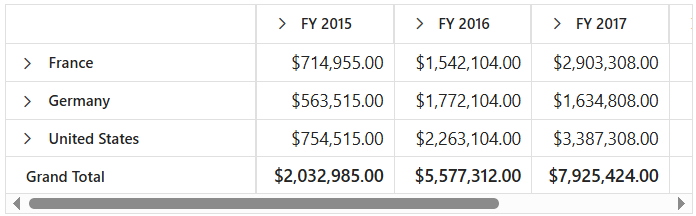
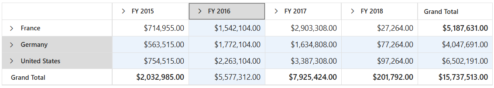
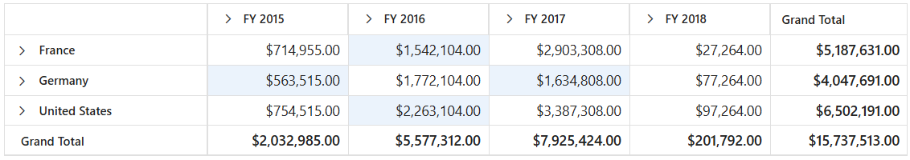

<!-- markdownlint-disable MD012 -->

# Row and Column in Blazor Pivot Table Component

To learn about how to use the row and column options effectively in the Blazor Pivot Table, watch this video:



## Width and Height

Setting appropriate dimensions for the Pivot Table ensures optimal display and better user experience across different screen sizes and layouts. You can define the Pivot Table's dimensions using the [Height](https://help.syncfusion.com/cr/blazor/Syncfusion.Blazor.PivotView.SfPivotView-1.html#Syncfusion_Blazor_PivotView_SfPivotView_1_Height) and [Width](https://help.syncfusion.com/cr/blazor/Syncfusion.Blazor.PivotView.SfPivotView-1.html#Syncfusion_Blazor_PivotView_SfPivotView_1_Width) properties in [SfPivotView](https://help.syncfusion.com/cr/blazor/Syncfusion.Blazor.PivotView.SfPivotView-1.html) class to meet your specific requirements.

These dimension properties support multiple formats to accommodate various layout scenarios and provide flexibility in how you define the component's size:

**Supported formats:**

* **Pixel**: Specify exact dimensions using numeric values or pixel units. For example: `100`, `200`, `"100px"`, or `"200px"`.
* **Percentage**: Set dimensions relative to the parent container. For example: `"100%"` or `"200%"`.
* **Auto**: This option is available only for the [Height](https://help.syncfusion.com/cr/blazor/Syncfusion.Blazor.PivotView.SfPivotView-1.html#Syncfusion_Blazor_PivotView_SfPivotView_1_Height) property. When set to **auto**, the Pivot Table expands beyond its parent container height without showing a vertical scrollbar within the component. Instead, the parent container displays its vertical scrollbar once the component exceeds its boundaries.

N> The Pivot Table maintains a minimum width of **400px** to ensure proper display and functionality, even if a smaller width is specified.

```cshtml
@using Syncfusion.Blazor.PivotView

<SfPivotView TValue="ProductDetails" Width="550" Height="315px">
    <PivotViewDataSourceSettings DataSource="@data">
        <PivotViewColumns>
            <PivotViewColumn Name="Year"></PivotViewColumn>
            <PivotViewColumn Name="Quarter"></PivotViewColumn>
        </PivotViewColumns>
        <PivotViewRows>
            <PivotViewRow Name="Country"></PivotViewRow>
            <PivotViewRow Name="Products"></PivotViewRow>
        </PivotViewRows>
        <PivotViewValues>
            <PivotViewValue Name="Amount" Caption="Sold Amount"></PivotViewValue>
        </PivotViewValues>
        <PivotViewFormatSettings>
            <PivotViewFormatSetting Name="Amount" Format="C"></PivotViewFormatSetting>
        </PivotViewFormatSettings>
    </PivotViewDataSourceSettings>
</SfPivotView>

@code{
    public List<ProductDetails> data { get; set; }
    protected override void OnInitialized()
    {
        this.data = ProductDetails.GetProductData().ToList();
        //Bind the data source collection here. Refer "Assigning sample data to the pivot table" section in getting started for more details.
    }
}
```



## Row Height

Adjusting the row height in the Pivot Table helps make your data easier to view and interact with, especially when there are many rows or large amounts of content. To make these adjustments, you can use the [RowHeight](https://help.syncfusion.com/cr/blazor/Syncfusion.Blazor.PivotView.PivotViewGridSettings.html#Syncfusion_Blazor_PivotView_PivotViewGridSettings_RowHeight) property within the [PivotViewGridSettings](https://help.syncfusion.com/cr/blazor/Syncfusion.Blazor.PivotView.PivotViewGridSettings.html) class. This property allows you to control how much space each row occupies, so the Pivot Table remains clear and readable according to your needs.

N> By default, the [RowHeight](https://help.syncfusion.com/cr/blazor/Syncfusion.Blazor.PivotView.PivotViewGridSettings.html#Syncfusion_Blazor_PivotView_PivotViewGridSettings_RowHeight) is set to **36** pixels for desktop layouts and **48** pixels for mobile layouts. However, if you enable the grouping bar option, note that only the column header height may change, while the rest of the rows maintain the specified height.

In the following code sample, the [RowHeight](https://help.syncfusion.com/cr/blazor/Syncfusion.Blazor.PivotView.PivotViewGridSettings.html#Syncfusion_Blazor_PivotView_PivotViewGridSettings_RowHeight) property is set as **60** pixels.

```cshtml
@using Syncfusion.Blazor.PivotView

<SfPivotView TValue="ProductDetails">
    <PivotViewDataSourceSettings DataSource="@data">
        <PivotViewColumns>
            <PivotViewColumn Name="Year"></PivotViewColumn>
            <PivotViewColumn Name="Quarter"></PivotViewColumn>
        </PivotViewColumns>
        <PivotViewRows>
            <PivotViewRow Name="Country"></PivotViewRow>
            <PivotViewRow Name="Products"></PivotViewRow>
        </PivotViewRows>
        <PivotViewValues>
            <PivotViewValue Name="Amount" Caption="Sold Amount"></PivotViewValue>
        </PivotViewValues>
        <PivotViewFormatSettings>
            <PivotViewFormatSetting Name="Amount" Format="C"></PivotViewFormatSetting>
        </PivotViewFormatSettings>
    </PivotViewDataSourceSettings>
    <PivotViewGridSettings RowHeight=60></PivotViewGridSettings>
</SfPivotView>

@code{
    public List<ProductDetails> data { get; set; }
    protected override void OnInitialized()
    {
        this.data = ProductDetails.GetProductData().ToList();
        //Bind the data source collection here. Refer "Assigning sample data to the pivot table" section in getting started for more details.
    }
}
```


## Column Width

Controlling the width of columns allows users to view their data in the Pivot Table more clearly, making each column easy to read and ensuring that information is not cut off. To achieve this, you can use the [ColumnWidth](https://help.syncfusion.com/cr/blazor/Syncfusion.Blazor.PivotView.PivotViewGridSettings.html#Syncfusion_Blazor_PivotView_PivotViewGridSettings_ColumnWidth) property, which is available under the [PivotViewGridSettings](https://help.syncfusion.com/cr/blazor/Syncfusion.Blazor.PivotView.PivotViewGridSettings.html) class.

N> By default, the [ColumnWidth](https://help.syncfusion.com/cr/blazor/Syncfusion.Blazor.PivotView.PivotViewGridSettings.html#Syncfusion_Blazor_PivotView_PivotViewGridSettings_ColumnWidth) is set to **110** pixels for all columns except the first one. The first column is assigned a width of **250** pixels if the grouping bar is enabled, or **200** pixels when it is not. This ensures that the data in the row header is always easily visible.

In the following example, the [ColumnWidth](https://help.syncfusion.com/cr/blazor/Syncfusion.Blazor.PivotView.PivotViewGridSettings.html#Syncfusion_Blazor_PivotView_PivotViewGridSettings_ColumnWidth) property is set as **200** pixels.

```cshtml
@using Syncfusion.Blazor.PivotView

<SfPivotView TValue="ProductDetails">
    <PivotViewDataSourceSettings DataSource="@data">
        <PivotViewColumns>
            <PivotViewColumn Name="Year"></PivotViewColumn>
            <PivotViewColumn Name="Quarter"></PivotViewColumn>
        </PivotViewColumns>
        <PivotViewRows>
            <PivotViewRow Name="Country"></PivotViewRow>
            <PivotViewRow Name="Products"></PivotViewRow>
        </PivotViewRows>
        <PivotViewValues>
            <PivotViewValue Name="Amount" Caption="Sold Amount"></PivotViewValue>
        </PivotViewValues>
        <PivotViewFormatSettings>
            <PivotViewFormatSetting Name="Amount" Format="C"></PivotViewFormatSetting>
        </PivotViewFormatSettings>
    </PivotViewDataSourceSettings>
    <PivotViewGridSettings ColumnWidth=200></PivotViewGridSettings>
</SfPivotView>

@code{
    public List<ProductDetails> data { get; set; }
    protected override void OnInitialized()
    {
        this.data = ProductDetails.GetProductData().ToList();
        //Bind the data source collection here. Refer "Assigning sample data to the pivot table" section in getting started for more details.
    }
}
```


### Adjust width based on columns

By default, when the component width exceeds the total width of all columns, the columns are automatically stretched to fill the available space. To prevent this stretching behavior, set the [AutoFit](https://help.syncfusion.com/cr/blazor/Syncfusion.Blazor.PivotView.PivotViewGridSettings.html#Syncfusion_Blazor_PivotView_PivotViewGridSettings_AutoFit) property in the [PivotViewGridSettings](https://help.syncfusion.com/cr/blazor/Syncfusion.Blazor.PivotView.PivotViewGridSettings.html) class to **false**. This ensures that the Pivot Table adjusts its overall width to match the combined width of all columns, maintaining their original proportions and improving data readability.

```cshtml
@using Syncfusion.Blazor.PivotView

<SfPivotView TValue="ProductDetails" Height="500" Width="1000" ShowGroupingBar="true">
    <PivotViewDataSourceSettings DataSource="@data">
        <PivotViewColumns>
            <PivotViewColumn Name="Year"></PivotViewColumn>
        </PivotViewColumns>
        <PivotViewRows>
            <PivotViewRow Name="Country"></PivotViewRow>
        </PivotViewRows>
        <PivotViewValues>
            <PivotViewValue Name="Sold" Caption="Units Sold"></PivotViewValue>
        </PivotViewValues>
        <PivotViewFilterSettings>
            <PivotViewFilterSetting Name="Year" Type=FilterType.Exclude Items="@(new string[] { "FY 2017" })">
            </PivotViewFilterSetting>
        </PivotViewFilterSettings>
    </PivotViewDataSourceSettings>
    <PivotViewGridSettings AutoFit="false"></PivotViewGridSettings>
</SfPivotView>

@code{
    public List<ProductDetails> data { get; set; }
    protected override void OnInitialized()
    {
        this.data = ProductDetails.GetProductData().ToList();
        //Bind the data source collection here. Refer "Assigning sample data to the pivot table" section in getting started for more details.
    }
}
```


## Reorder

The reorder option provides users with the flexibility to reorganize column headers within the Pivot Table by dragging and dropping them to different positions. This allows users to customize the layout of their data for better analysis and presentation.

To enable this option, set the [AllowReordering](https://help.syncfusion.com/cr/blazor/Syncfusion.Blazor.PivotView.PivotViewGridSettings.html#Syncfusion_Blazor_PivotView_PivotViewGridSettings_AllowReordering) property in [PivotViewGridSettings](https://help.syncfusion.com/cr/blazor/Syncfusion.Blazor.PivotView.PivotViewGridSettings.html) class to **true**. Once enabled, users can simply click and drag any column header to move it to their desired position within the table.

```cshtml
@using Syncfusion.Blazor.PivotView

<SfPivotView TValue="ProductDetails">
    <PivotViewDataSourceSettings DataSource="@data">
        <PivotViewColumns>
            <PivotViewColumn Name="Year"></PivotViewColumn>
            <PivotViewColumn Name="Quarter"></PivotViewColumn>
        </PivotViewColumns>
        <PivotViewRows>
            <PivotViewRow Name="Country"></PivotViewRow>
            <PivotViewRow Name="Products"></PivotViewRow>
        </PivotViewRows>
        <PivotViewValues>
            <PivotViewValue Name="Amount" Caption="Sold Amount"></PivotViewValue>
        </PivotViewValues>
        <PivotViewFormatSettings>
            <PivotViewFormatSetting Name="Amount" Format="C"></PivotViewFormatSetting>
        </PivotViewFormatSettings>
    </PivotViewDataSourceSettings>
    <PivotViewGridSettings AllowReordering="true"></PivotViewGridSettings>
</SfPivotView>

@code{
    public List<ProductDetails> data { get; set; }
    protected override void OnInitialized()
    {
        this.data = ProductDetails.GetProductData().ToList();
        //Bind the data source collection here. Refer "Assigning sample data to the pivot table" section in getting started for more details.
    }
}
```


## Column Resizing

Column resizing in the Pivot Table helps users adjust the column widths to better view and compare data. Users can easily resize columns by clicking and dragging the right edge of any column header. As the user drags, the column’s width is updated immediately, offering a responsive and comfortable viewing experience.

This option is enabled by default. To control column resizing, set the [AllowResizing](https://help.syncfusion.com/cr/blazor/Syncfusion.Blazor.PivotView.PivotViewGridSettings.html#Syncfusion_Blazor_PivotView_PivotViewGridSettings_AllowResizing) property in [PivotViewGridSettings](https://help.syncfusion.com/cr/blazor/Syncfusion.Blazor.PivotView.PivotViewGridSettings.html) class to **true** or **false** as needed.

N> In right-to-left (RTL) mode, users should click and drag the left edge of the header cell to resize the column.

```cshtml
@using Syncfusion.Blazor.PivotView

<SfPivotView TValue="ProductDetails">
    <PivotViewDataSourceSettings DataSource="@data">
        <PivotViewColumns>
            <PivotViewColumn Name="Year"></PivotViewColumn>
            <PivotViewColumn Name="Quarter"></PivotViewColumn>
        </PivotViewColumns>
        <PivotViewRows>
            <PivotViewRow Name="Country"></PivotViewRow>
            <PivotViewRow Name="Products"></PivotViewRow>
        </PivotViewRows>
        <PivotViewValues>
            <PivotViewValue Name="Amount" Caption="Sold Amount"></PivotViewValue>
        </PivotViewValues>
    </PivotViewDataSourceSettings>
    <PivotViewGridSettings AllowResizing="true"></PivotViewGridSettings>
</SfPivotView>

@code{
    public List<ProductDetails> data { get; set; }
    protected override void OnInitialized()
    {
        this.data = ProductDetails.GetProductData().ToList();
        //Bind the data source collection here. Refer "Assigning sample data to the pivot table" section in getting started for more details.
    }
}
```


## Text Wrap

The Pivot Table allows users to wrap cell content to the next line when the content exceeds the boundary of the cell width. To enable text wrap, set the [AllowTextWrap](https://help.syncfusion.com/cr/blazor/Syncfusion.Blazor.PivotView.PivotViewGridSettings.html#Syncfusion_Blazor_PivotView_PivotViewGridSettings_AllowTextWrap) property in [PivotViewGridSettings](https://help.syncfusion.com/cr/blazor/Syncfusion.Blazor.PivotView.PivotViewGridSettings.html) class to **true**.

```cshtml
@using Syncfusion.Blazor.PivotView

<SfPivotView TValue="ProductDetails">
    <PivotViewDataSourceSettings DataSource="@data">
        <PivotViewColumns>
            <PivotViewColumn Name="Year"></PivotViewColumn>
            <PivotViewColumn Name="Quarter"></PivotViewColumn>
        </PivotViewColumns>
        <PivotViewRows>
            <PivotViewRow Name="Country"></PivotViewRow>
            <PivotViewRow Name="Products"></PivotViewRow>
        </PivotViewRows>
        <PivotViewValues>
            <PivotViewValue Name="Amount" Caption="Sold Amount"></PivotViewValue>
        </PivotViewValues>
        <PivotViewFormatSettings>
            <PivotViewFormatSetting Name="Amount" Format="C"></PivotViewFormatSetting>
        </PivotViewFormatSettings>
    </PivotViewDataSourceSettings>
    <PivotViewGridSettings AllowTextWrap="true"></PivotViewGridSettings>
</SfPivotView>

@code{
    public List<ProductDetails> data { get; set; }
    protected override void OnInitialized()
    {
        this.data = ProductDetails.GetProductData().ToList();
        //Bind the data source collection here. Refer "Assigning sample data to the pivot table" section in getting started for more details.
    }
}
```


## Text Align

Text alignment provides flexibility in positioning content within cells, making the data presentation more organized and visually appealing. You can align the content of the Pivot Table's row headers, column headers, and value cells using the [TextAlign](https://help.syncfusion.com/cr/blazor/Syncfusion.Blazor.Grids.GridColumn.html#Syncfusion_Blazor_Grids_GridColumn_TextAlign) and [HeaderTextAlign](https://help.syncfusion.com/cr/blazor/Syncfusion.Blazor.Grids.GridColumn.html#Syncfusion_Blazor_Grids_GridColumn_HeaderTextAlign) properties in the [BeforeColumnsRender](https://help.syncfusion.com/cr/blazor/Syncfusion.Blazor.PivotView.PivotViewEvents-1.html#Syncfusion_Blazor_PivotView_PivotViewEvents_1_BeforeColumnsRender) event. The available alignment options are:

* [Left](https://help.syncfusion.com/cr/blazor/Syncfusion.Blazor.Grids.TextAlign.html#Syncfusion_Blazor_Grids_TextAlign_Left) - Positions the content on the left side of the cell.
* [Right](https://help.syncfusion.com/cr/blazor/Syncfusion.Blazor.Grids.TextAlign.html#Syncfusion_Blazor_Grids_TextAlign_Right) - Positions the content on the right side of the cell.
* [Center](https://help.syncfusion.com/cr/blazor/Syncfusion.Blazor.Grids.TextAlign.html#Syncfusion_Blazor_Grids_TextAlign_Center) - Positions the content in the center of the cell.
* [Justify](https://help.syncfusion.com/cr/blazor/Syncfusion.Blazor.Grids.TextAlign.html#Syncfusion_Blazor_Grids_TextAlign_Justify) - Distributes the content evenly across the cell width for optimal space utilization.

```cshtml
@using Syncfusion.Blazor.PivotView

<SfPivotView TValue="ProductDetails">
    <PivotViewDataSourceSettings DataSource="@data" ExpandAll="true">
        <PivotViewColumns>
            <PivotViewColumn Name="Year"></PivotViewColumn>
            <PivotViewColumn Name="Quarter"></PivotViewColumn>
        </PivotViewColumns>
        <PivotViewRows>
            <PivotViewRow Name="Country"></PivotViewRow>
            <PivotViewRow Name="Products"></PivotViewRow>
        </PivotViewRows>
        <PivotViewValues>
            <PivotViewValue Name="Sold" Caption="Units Sold"></PivotViewValue>
            <PivotViewValue Name="In_Stock" Caption="In Stock"></PivotViewValue>
            <PivotViewValue Name="Amount" Caption="Sold Amount"></PivotViewValue>
        </PivotViewValues>
        <PivotViewFormatSettings>
            <PivotViewFormatSetting Name="Amount" Format="C"></PivotViewFormatSetting>
        </PivotViewFormatSettings>
    </PivotViewDataSourceSettings>        
    <PivotViewEvents TValue="ProductDetails" BeforeColumnsRender="ColumnRender"></PivotViewEvents>   
</SfPivotView>

@code{
    private List<ProductDetails> data { get; set; }
    protected override void OnInitialized()
    {
        data = ProductDetails.GetProductData().ToList();
        // Bind the data source collection here. Refer "Assigning sample data to the pivot table" section in getting started for more details.
    }
    private void ColumnRender(ColumnRenderEventArgs args)
    {
        if (args.StackedColumns[0] != null)
        {
            // Content for the row headers is right-aligned here.
            args.StackedColumns[0].TextAlign = Syncfusion.Blazor.Grids.TextAlign.Right;
        }        
        if (args.StackedColumns[1] != null && args.StackedColumns[1].Columns[0] != null && args.StackedColumns[1].Columns[0].Columns[0] != null)
        {
            // Content for the value header "FY 2015 -> Q1 -> Units Sold" is right-aligned here.
            args.StackedColumns[1].Columns[0].Columns[0].HeaderTextAlign = Syncfusion.Blazor.Grids.TextAlign.Right;
        }
        if (args.StackedColumns[1] != null && args.StackedColumns[1].Columns[0] != null && args.StackedColumns[1].Columns[0].Columns[0] != null)
        {
            // Content for the values under "FY 2015 -> Q1 -> Units Sold" are center-aligned here.
            args.StackedColumns[1].Columns[0].Columns[0].TextAlign = Syncfusion.Blazor.Grids.TextAlign.Center;
        }
    }
}
```


## Grid Lines

The grid lines option provides visual structure to the Pivot Table by displaying cell borders, making it easier for users to read and analyze data. You can control the display of grid lines using the [GridLines](https://help.syncfusion.com/cr/blazor/Syncfusion.Blazor.PivotView.PivotViewGridSettings.html#Syncfusion_Blazor_PivotView_PivotViewGridSettings_GridLines) property within the [PivotViewGridSettings](https://help.syncfusion.com/cr/blazor/Syncfusion.Blazor.PivotView.PivotViewGridSettings.html) class.

The following grid line modes are available:

| Mode | Description |
|------|-------------|
| Both | Shows both horizontal and vertical grid lines around each cell |
| None | Hides all grid lines for a clean appearance |
| Horizontal | Shows only horizontal grid lines between rows |
| Vertical | Shows only vertical grid lines between columns |
| Default | Shows grid lines based on the applied theme settings |

N> The Pivot Table displays grid lines in [PivotGridLine.Both](https://help.syncfusion.com/cr/blazor/Syncfusion.Blazor.PivotView.PivotTableGridLine.html#Syncfusion_Blazor_PivotView_PivotTableGridLine_None) mode by default.

```cshtml
@using Syncfusion.Blazor.PivotView

<SfPivotView TValue="ProductDetails">
<PivotViewDataSourceSettings DataSource="@data">
        <PivotViewColumns>
            <PivotViewColumn Name="Year"></PivotViewColumn>
            <PivotViewColumn Name="Quarter"></PivotViewColumn>
        </PivotViewColumns>
        <PivotViewRows>
            <PivotViewRow Name="Country"></PivotViewRow>
            <PivotViewRow Name="Products"></PivotViewRow>
        </PivotViewRows>
        <PivotViewValues>
            <PivotViewValue Name="Amount" Caption="Sold Amount"></PivotViewValue>
        </PivotViewValues>
        <PivotViewFormatSettings>
            <PivotViewFormatSetting Name="Amount" Format="C0"></PivotViewFormatSetting>
        </PivotViewFormatSettings>
    </PivotViewDataSourceSettings>
    <PivotViewGridSettings GridLines=PivotTableGridLine.Vertical></PivotViewGridSettings>
</SfPivotView>

@code{
    public List<ProductDetails> data { get; set; }
    protected override void OnInitialized()
    {
        this.data = ProductDetails.GetProductData().ToList();
        //Bind the data source collection here. Refer "Assigning sample data to the pivot table" section in getting started for more details.
    }
}
```


## Selection

Selection in the Pivot Table allows users to easily highlight rows, columns, or individual cells for better data focus and visualization. This makes it simple to compare and analyze specific data points within your table.

To enable selection, set the [AllowSelection](https://help.syncfusion.com/cr/blazor/Syncfusion.Blazor.PivotView.PivotViewGridSettings.html#Syncfusion_Blazor_PivotView_PivotViewGridSettings_AllowSelection) property in [PivotViewGridSettings](https://help.syncfusion.com/cr/blazor/Syncfusion.Blazor.PivotView.PivotViewGridSettings.html) class to **true**. This allows users to select table elements using a mouse click or arrow keys.

The Pivot Table provides two selection modes, controlled by the [Type](https://help.syncfusion.com/cr/blazor/Syncfusion.Blazor.PivotView.PivotViewSelectionSettings.html#Syncfusion_Blazor_PivotView_PivotViewSelectionSettings_Type) property in [PivotViewSelectionSettings](https://help.syncfusion.com/cr/blazor/Syncfusion.Blazor.PivotView.PivotViewSelectionSettings.html) class:

* [PivotSelectionType.Single](https://help.syncfusion.com/cr/blazor/Syncfusion.Blazor.PivotView.PivotTableSelectionType.html#Syncfusion_Blazor_PivotView_PivotTableSelectionType_Single): Allows you to select only one row, column, or cell at a time. This is the default mode.
* [PivotSelectionType.Multiple](https://help.syncfusion.com/cr/blazor/Syncfusion.Blazor.PivotView.PivotTableSelectionType.html#Syncfusion_Blazor_PivotView_PivotTableSelectionType_Multiple): Lets you select several rows, columns, or cells. To select multiple items, hold down the "CTRL" key and click the rows or cells you wish to select. To select a range, hold the "SHIFT" key and click the first and last item in the range.

```cshtml
@using Syncfusion.Blazor.PivotView

<SfPivotView TValue="ProductDetails">
<PivotViewDataSourceSettings DataSource="@data">
        <PivotViewColumns>
            <PivotViewColumn Name="Year"></PivotViewColumn>
            <PivotViewColumn Name="Quarter"></PivotViewColumn>
        </PivotViewColumns>
        <PivotViewRows>
            <PivotViewRow Name="Country"></PivotViewRow>
            <PivotViewRow Name="Products"></PivotViewRow>
        </PivotViewRows>
        <PivotViewValues>
            <PivotViewValue Name="Amount" Caption="Sold Amount"></PivotViewValue>
        </PivotViewValues>
        <PivotViewFormatSettings>
            <PivotViewFormatSetting Name="Amount" Format="C"></PivotViewFormatSetting>
        </PivotViewFormatSettings>
    </PivotViewDataSourceSettings>
    <PivotViewGridSettings AllowSelection="true">
        <PivotViewSelectionSettings Type=PivotTableSelectionType.Multiple></PivotViewSelectionSettings>
    </PivotViewGridSettings>
</SfPivotView>

@code{
    public List<ProductDetails> data { get; set; }
    protected override void OnInitialized()
    {
        this.data = ProductDetails.GetProductData().ToList();
        //Bind the data source collection here. Refer "Assigning sample data to the pivot table" section in getting started for more details.
    }
}
```


### Selection Mode

You can choose how selection works by setting the [Mode](https://help.syncfusion.com/cr/blazor/Syncfusion.Blazor.PivotView.PivotViewSelectionSettings.html#Syncfusion_Blazor_PivotView_PivotViewSelectionSettings_Mode) property within the [PivotViewSelectionSettings](https://help.syncfusion.com/cr/blazor/Syncfusion.Blazor.PivotView.PivotViewSelectionSettings.html) class. The Pivot Table offers four simple options for selection mode:

* [SelectionMode.Row](https://help.syncfusion.com/cr/blazor/Syncfusion.Blazor.PivotView.SelectionMode.html#Syncfusion_Blazor_PivotView_SelectionMode_Row): This is the default mode. It lets the user select an entire row with a single click.
* [SelectionMode.Column](https://help.syncfusion.com/cr/blazor/Syncfusion.Blazor.PivotView.SelectionMode.html#Syncfusion_Blazor_PivotView_SelectionMode_Column): In this mode, only entire columns can be selected.
* [SelectionMode.Cell](https://help.syncfusion.com/cr/blazor/Syncfusion.Blazor.PivotView.SelectionMode.html#Syncfusion_Blazor_PivotView_SelectionMode_Cell): This mode allows the user to select one or more individual cells.
* [SelectionMode.Both](https://help.syncfusion.com/cr/blazor/Syncfusion.Blazor.PivotView.SelectionMode.html#Syncfusion_Blazor_PivotView_SelectionMode_Both): This option lets users select both rows and columns at the same time, providing more flexibility.

By choosing the right selection mode, users can quickly highlight and review the data that matters most to them.

```cshtml
@using Syncfusion.Blazor.PivotView

<SfPivotView TValue="ProductDetails">
<PivotViewDataSourceSettings DataSource="@data">
        <PivotViewColumns>
            <PivotViewColumn Name="Year"></PivotViewColumn>
            <PivotViewColumn Name="Quarter"></PivotViewColumn>
        </PivotViewColumns>
        <PivotViewRows>
            <PivotViewRow Name="Country"></PivotViewRow>
            <PivotViewRow Name="Products"></PivotViewRow>
        </PivotViewRows>
        <PivotViewValues>
            <PivotViewValue Name="Amount" Caption="Sold Amount"></PivotViewValue>
        </PivotViewValues>
        <PivotViewFormatSettings>
            <PivotViewFormatSetting Name="Amount" Format="C"></PivotViewFormatSetting>
        </PivotViewFormatSettings>
    </PivotViewDataSourceSettings>
    <PivotViewGridSettings AllowSelection="true">
        <PivotViewSelectionSettings Mode=SelectionMode.Both Type=PivotTableSelectionType.Multiple></PivotViewSelectionSettings>
    </PivotViewGridSettings>
</SfPivotView>

@code{
    public List<ProductDetails> data { get; set; }
    protected override void OnInitialized()
    {
        this.data = ProductDetails.GetProductData().ToList();
        //Bind the data source collection here. Refer "Assigning sample data to the pivot table" section in getting started for more details.
    }
}
```



### Cell Selection Mode

To set the cell selection mode, use the [PivotCellSelectionMode](https://help.syncfusion.com/cr/blazor/Syncfusion.Blazor.PivotView.PivotViewSelectionSettings.html#Syncfusion_Blazor_PivotView_PivotViewSelectionSettings_CellSelectionMode) option within the [PivotViewSelectionSettings](https://help.syncfusion.com/cr/blazor/Syncfusion.Blazor.PivotView.PivotViewSelectionSettings.html) class. The available modes are:

* [PivotCellSelectionMode.Flow](https://help.syncfusion.com/cr/blazor/Syncfusion.Blazor.PivotView.PivotCellSelectionMode.html#Syncfusion_Blazor_PivotView_PivotCellSelectionMode_Flow): Selects a continuous range of cells from the starting cell to the ending cell, including all rows in between.
* [PivotCellSelectionMode.Box](https://help.syncfusion.com/cr/blazor/Syncfusion.Blazor.PivotView.PivotCellSelectionMode.html#Syncfusion_Blazor_PivotView_PivotCellSelectionMode_Box): Selects a rectangular block of cells that spans from the starting cell to the ending cell, covering all intermediate rows and columns within the range.

* [PivotCellSelectionMode.BoxWithBorder](https://help.syncfusion.com/cr/blazor/Syncfusion.Blazor.PivotView.PivotCellSelectionMode.html#Syncfusion_Blazor_PivotView_PivotCellSelectionMode_BoxWithBorder): This mode works like Box mode but also highlights the selected cells with borders for better visibility.

N> Cell selection requires [Mode](https://help.syncfusion.com/cr/blazor/Syncfusion.Blazor.PivotView.PivotViewSelectionSettings.html#Syncfusion_Blazor_PivotView_PivotViewSelectionSettings_Mode) property in [PivotViewSelectionSettings](https://help.syncfusion.com/cr/blazor/Syncfusion.Blazor.PivotView.PivotViewSelectionSettings.html) class to be [SelectionMode.Cell](https://help.syncfusion.com/cr/blazor/Syncfusion.Blazor.PivotView.SelectionMode.html#Syncfusion_Blazor_PivotView_SelectionMode_Cell) or [SelectionMode.Both](https://help.syncfusion.com/cr/blazor/Syncfusion.Blazor.PivotView.SelectionMode.html#Syncfusion_Blazor_PivotView_SelectionMode_Both), and [Type](https://help.syncfusion.com/cr/blazor/Syncfusion.Blazor.PivotView.PivotViewSelectionSettings.html#Syncfusion_Blazor_PivotView_PivotViewSelectionSettings_Type) property should be [PivotSelectionType.Multiple](https://help.syncfusion.com/cr/blazor/Syncfusion.Blazor.PivotView.PivotTableSelectionType.html#Syncfusion_Blazor_PivotView_PivotTableSelectionType_Multiple).

```cshtml
@using Syncfusion.Blazor.PivotView

<SfPivotView TValue="ProductDetails">
<PivotViewDataSourceSettings DataSource="@data">
        <PivotViewColumns>
            <PivotViewColumn Name="Year"></PivotViewColumn>
            <PivotViewColumn Name="Quarter"></PivotViewColumn>
        </PivotViewColumns>
        <PivotViewRows>
            <PivotViewRow Name="Country"></PivotViewRow>
            <PivotViewRow Name="Products"></PivotViewRow>
        </PivotViewRows>
        <PivotViewValues>
            <PivotViewValue Name="Amount" Caption="Sold Amount"></PivotViewValue>
        </PivotViewValues>
        <PivotViewFormatSettings>
            <PivotViewFormatSetting Name="Amount" Format="C"></PivotViewFormatSetting>
        </PivotViewFormatSettings>
    </PivotViewDataSourceSettings>
    <PivotViewGridSettings AllowSelection="true">
        <PivotViewSelectionSettings CellSelectionMode=PivotCellSelectionMode.Box Type=PivotTableSelectionType.Multiple Mode=SelectionMode.Cell></PivotViewSelectionSettings>
    </PivotViewGridSettings>
</SfPivotView>

@code{
    public List<ProductDetails> data { get; set; }
    protected override void OnInitialized()
    {
        this.data = ProductDetails.GetProductData().ToList();
        //Bind the data source collection here. Refer "Assigning sample data to the pivot table" section in getting started for more details.
    }
}
```



### Changing background color of the selected cell

Highlighting selected cells in the Pivot Table with a different background color helps users quickly identify and focus on important data. To achieve this effect seamlessly, you can apply built-in CSS classes that customize the appearance of selected cells.

In the example below, selected cells appear with a **green-yellow** background. Simply add the custom styles to your stylesheet, and they will be applied when you select a cell using the mouse or arrow keys.

```cshtml
@using Syncfusion.Blazor.PivotView

<SfPivotView TValue="ProductDetails">
<PivotViewDataSourceSettings DataSource="@data">
        <PivotViewColumns>
            <PivotViewColumn Name="Year"></PivotViewColumn>
            <PivotViewColumn Name="Quarter"></PivotViewColumn>
        </PivotViewColumns>
        <PivotViewRows>
            <PivotViewRow Name="Country"></PivotViewRow>
            <PivotViewRow Name="Products"></PivotViewRow>
        </PivotViewRows>
        <PivotViewValues>
            <PivotViewValue Name="Sold" Caption="Units Sold"></PivotViewValue>
            <PivotViewValue Name="Amount" Caption="Sold Amount"></PivotViewValue>
        </PivotViewValues>
    </PivotViewDataSourceSettings>
    <PivotViewGridSettings AllowSelection="true">
        <PivotViewSelectionSettings CellSelectionMode=PivotCellSelectionMode.Box Type=PivotTableSelectionType.Multiple Mode=SelectionMode.Cell></PivotViewSelectionSettings>
    </PivotViewGridSettings>
</SfPivotView>
<style>
.e-pivotview .e-cellselectionbackground,
.e-pivotview .e-selectionbackground,
.e-pivotview .e-grid .e-rowsheader.e-selectionbackground,
.e-pivotview .e-grid .e-columnsheader.e-selectionbackground {
    background-color: greenYellow !important;
}
</style>
@code{
    public List<ProductDetails> data { get; set; }
    protected override void OnInitialized()
    {
        this.data = ProductDetails.GetProductData().ToList();
        //Bind the data source collection here. Refer "Assigning sample data to the pivot table" section in getting started for more details.
    }
}
```


### Event

#### CellSelected

When a user finishes selecting cells, the [CellSelected](https://help.syncfusion.com/cr/blazor/Syncfusion.Blazor.PivotView.PivotViewEvents-1.html#Syncfusion_Blazor_PivotView_PivotViewEvents_1_CellSelected) event is triggered. This event provides details about the selected cells, including the related row and column headers. The event holds important parameters, including [SelectedCellsInfo](https://help.syncfusion.com/cr/blazor/Syncfusion.Blazor.PivotView.PivotCellSelectedEventArgs.html#Syncfusion_Blazor_PivotView_PivotCellSelectedEventArgs_SelectedCellsInfo). Users can use this information to easily identify the selected data and share it with other parts of their application, such as for data binding or additional processing.

```cshtml
@using Syncfusion.Blazor.PivotView

<div>
    <div class="column-8">
        <SfPivotView TValue="ProductDetails" Width="800" Height="340">
            <PivotViewDataSourceSettings TValue="ProductDetails" DataSource="@data" ExpandAll="false" EnableSorting=true>
                <PivotViewColumns>
                    <PivotViewColumn Name="Year"></PivotViewColumn>
                    <PivotViewColumn Name="Quarter"></PivotViewColumn>
                </PivotViewColumns>
                <PivotViewRows>
                    <PivotViewRow Name="Country"></PivotViewRow>
                    <PivotViewRow Name="Products"></PivotViewRow>
                </PivotViewRows>
                <PivotViewValues>
                    <PivotViewValue Name="Sold" Caption="Units Sold"></PivotViewValue>
                    <PivotViewValue Name="Amount"></PivotViewValue>
                </PivotViewValues>
            </PivotViewDataSourceSettings>
            <PivotViewEvents TValue="ProductDetails" CellSelected="cellSelected"></PivotViewEvents>
            <PivotViewGridSettings AllowSelection="true">
                <PivotViewSelectionSettings Mode="SelectionMode.Cell" Type="PivotTableSelectionType.Multiple" CellSelectionMode="PivotCellSelectionMode.Box"></PivotViewSelectionSettings>
            </PivotViewGridSettings>
        </SfPivotView>
    </div>
    <div class="column-4">
        <h5>Event Trace:</h5> <br>
        <div style="height:300px; overflow:auto;">
            @if (SelectedCells != null)
            {
                @if (SelectedCells.SelectedCellsInfo != null)
                {
                    @foreach (var cell in SelectedCells.SelectedCellsInfo)
                    {
                        <p>
                            <b>ColumnHeader:</b> @cell.ColumnHeaders<br>
                            <b>RowHeader:</b> @cell.RowHeaders<br>
                            <b>Value:</b> @cell.Value<br>
                            <b>Measure:</b> @cell.Measure
                        </p>
                        <br>
                    }
                }
            }
        </div>
    </div>
</div>

@code{
    public List<ProductDetails> data { get; set; }
    public PivotCellSelectedEventArgs SelectedCells;
    protected override void OnInitialized()
    {
        this.data = ProductDetails.GetProductData();
    }
    public void cellSelected(PivotCellSelectedEventArgs args)
    {
        SelectedCells = args;
        //args.SelectedCellsInfo -> get selected cells information
    }
}
```


## Clip Mode

The clip mode option in the Pivot Table determines how cell content is displayed when it exceeds the cell’s boundaries. You can set this option using the [ClipMode](https://help.syncfusion.com/cr/blazor/Syncfusion.Blazor.PivotView.PivotViewGridSettings.html#Syncfusion_Blazor_PivotView_PivotViewGridSettings_ClipMode) property within the [PivotViewGridSettings](https://help.syncfusion.com/cr/blazor/Syncfusion.Blazor.PivotView.PivotViewGridSettings.html) class. The Pivot Table provides the following clip mode options:

* [PivotClipMode.Clip](https://help.syncfusion.com/cr/blazor/Syncfusion.Blazor.PivotView.PivotTableClipMode.html#Syncfusion_Blazor_PivotView_PivotTableClipMode_Clip): Cuts off any part of the cell content that does not fit within the cell.
* [PivotClipMode.Ellipsis](https://help.syncfusion.com/cr/blazor/Syncfusion.Blazor.PivotView.PivotTableClipMode.html#Syncfusion_Blazor_PivotView_PivotTableClipMode_Ellipsis): Shows an ellipsis (`...`) at the end of the cell if the content is too long to fit.
* [PivotClipMode.EllipsisWithTooltip](https://help.syncfusion.com/cr/blazor/Syncfusion.Blazor.PivotView.PivotTableClipMode.html#Syncfusion_Blazor_PivotView_PivotTableClipMode_EllipsisWithTooltip): Shows an ellipsis (`...`) for overflowing content, and also displays the full content in a tooltip when the user hovers over the ellipsis.

N> By default, the [ClipMode](https://help.syncfusion.com/cr/blazor/Syncfusion.Blazor.PivotView.PivotViewGridSettings.html#Syncfusion_Blazor_PivotView_PivotViewGridSettings_ClipMode) property is set to [PivotClipMode.Ellipsis](https://help.syncfusion.com/cr/blazor/Syncfusion.Blazor.PivotView.PivotTableClipMode.html#Syncfusion_Blazor_PivotView_PivotTableClipMode_Ellipsis). This helps users quickly identify when there is more content hidden and easily view the complete information by hovering over the cell.

```cshtml
@using Syncfusion.Blazor.PivotView

<SfPivotView TValue="ProductDetails">
    <PivotViewDataSourceSettings DataSource="@data">
        <PivotViewColumns>
            <PivotViewColumn Name="Year"></PivotViewColumn>
            <PivotViewColumn Name="Quarter"></PivotViewColumn>
        </PivotViewColumns>
        <PivotViewRows>
            <PivotViewRow Name="Country"></PivotViewRow>
            <PivotViewRow Name="Products"></PivotViewRow>
        </PivotViewRows>
        <PivotViewValues>
            <PivotViewValue Name="Amount" Caption="Sold Amount"></PivotViewValue>
        </PivotViewValues>
        <PivotViewFormatSettings>
            <PivotViewFormatSetting Name="Amount" Format="C0"></PivotViewFormatSetting>
        </PivotViewFormatSettings>
    </PivotViewDataSourceSettings>
    <PivotViewGridSettings ClipMode=Syncfusion.Blazor.PivotView.PivotTableClipMode.Clip></PivotViewGridSettings>
</SfPivotView>

@code{
    public List<ProductDetails> data { get; set; }
    protected override void OnInitialized()
    {
        this.data = ProductDetails.GetProductData().ToList();
        //Bind the data source collection here. Refer "Assigning sample data to the pivot table" section in getting started for more details.
    }
}
```


## Cell Template

You can change how each cell in the Pivot Table looks by using the [CellTemplate](https://help.syncfusion.com/cr/blazor/Syncfusion.Blazor.PivotView.PivotViewTemplates.html#Syncfusion_Blazor_PivotView_PivotViewTemplates_CellTemplate) property in [PivotViewTemplates](https://help.syncfusion.com/cr/blazor/Syncfusion.Blazor.PivotView.PivotViewTemplates.html) class. With [CellTemplate](https://help.syncfusion.com/cr/blazor/Syncfusion.Blazor.PivotView.PivotViewTemplates.html#Syncfusion_Blazor_PivotView_PivotViewTemplates_CellTemplate), you can use either an HTML string or the ID of an HTML element to add custom content to every cell. This helps you display cell values in any format you prefer, such as adding icons, colors, or other elements for better understanding.

To know about **Cell Template** in Blazor Pivot Table Component, you can check this video.



In this demo, each year’s revenue cost is displayed along with trend icons, giving users a clear and quick way to view changes in the data at a glance.

N> Specify the model type for the data source, as it determines the context that will be generated and accessed within the [CellTemplate](https://help.syncfusion.com/cr/blazor/Syncfusion.Blazor.PivotView.PivotViewTemplates.html#Syncfusion_Blazor_PivotView_PivotViewTemplates_CellTemplate). Using this context, define the conditions based on the templates that will be appended to the cell element

```cshtml
@using Syncfusion.Blazor.PivotView

<SfPivotView TValue="TemplateData" Height="300" Width="800">
    <PivotViewTemplates>
        <CellTemplate>
            @{
                var data = (context as AxisSet);
                if (data.Value > 175)
                {
                    <span class="tempwrap sb-icon-profit pv-icons"></span>
                }
                else if (data.Value > 100)
                {
                    <span class="tempwrap sb-icon-neutral pv-icons"></span>
                }
                else if (data.Value > 0)
                {
                    <span class="tempwrap sb-icon-loss pv-icons"></span>
                }
            }
        </CellTemplate>
    </PivotViewTemplates>
    <PivotViewDataSourceSettings DataSource="@dataSource" ExpandAll=true EnableSorting=true>
        <PivotViewColumns>
            <PivotViewColumn Name="EnerType" Caption="Energy Type"></PivotViewColumn>
            <PivotViewColumn Name="EneSource" Caption="Energy Source"></PivotViewColumn>
        </PivotViewColumns>
        <PivotViewRows>
            <PivotViewRow Name="Year" Caption="Year"></PivotViewRow>
            <PivotViewRow Name="HalfYear" Caption="Half Year"></PivotViewRow>
        </PivotViewRows>
        <PivotViewValues>
            <PivotViewValue Name="ProCost" Caption="Revenue Growth"></PivotViewValue>
        </PivotViewValues>
        <PivotViewFormatSettings>
            <PivotViewFormatSetting Name="ProCost" Format="C0" UseGrouping=true></PivotViewFormatSetting>
        </PivotViewFormatSettings>
    </PivotViewDataSourceSettings>
    <PivotViewGridSettings ColumnWidth="140"></PivotViewGridSettings>
</SfPivotView>

@code{
    public List<TemplateData> dataSource { get; set; }
    protected override void OnInitialized()
    {
        this.dataSource = TemplateData.GetTemplateData();
    }
}
```


N> You can refer to the [Blazor Pivot Table](https://www.syncfusion.com/blazor-components/blazor-pivot-table) feature tour page for its groundbreaking feature representations. You can also explore the [Blazor Pivot Table example](https://blazor.syncfusion.com/demos/pivot-table/default-functionalities?theme=bootstrap5) to know how to render and configure the pivot table.