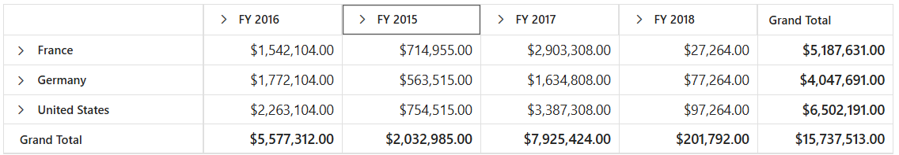

<!-- markdownlint-disable MD012 -->

# Row and Column in Blazor Pivot Table Component

To learn about how to use the row and column options effectively in the Blazor Pivot Table, watch this video:



## Width and Height

Allows end user to set the pivot table's height and width by using [Height](https://help.syncfusion.com/cr/blazor/Syncfusion.Blazor.PivotView.PivotViewGridSettings.html#Syncfusion_Blazor_PivotView_PivotViewGridSettings_Height) and [Width](https://help.syncfusion.com/cr/blazor/Syncfusion.Blazor.PivotView.PivotViewGridSettings.html#Syncfusion_Blazor_PivotView_PivotViewGridSettings_Width) properties in [SfPivotView](https://help.syncfusion.com/cr/blazor/Syncfusion.Blazor.PivotView.SfPivotView-1.html) class respectively. The supported formats to set [Height](https://help.syncfusion.com/cr/blazor/Syncfusion.Blazor.PivotView.PivotViewGridSettings.html#Syncfusion_Blazor_PivotView_PivotViewGridSettings_Height) and [Width](https://help.syncfusion.com/cr/blazor/Syncfusion.Blazor.PivotView.PivotViewGridSettings.html#Syncfusion_Blazor_PivotView_PivotViewGridSettings_Width) properties are,

* Pixel: For example - 100, 200, "100px", "200px".
* Percentage: For example - "100%", "200%".
* Auto: For example - "auto". This is the default value. It takes 100% of parent container's size to fit the pivot table component inside it.

N> The pivot table will not be displayed less than **400px**, since it's the minimum width of the component.

```cshtml
@using Syncfusion.Blazor.PivotView

<SfPivotView TValue="ProductDetails" Width="550" Height="315px">
    <PivotViewDataSourceSettings DataSource="@data">
        <PivotViewColumns>
            <PivotViewColumn Name="Year"></PivotViewColumn>
            <PivotViewColumn Name="Quarter"></PivotViewColumn>
        </PivotViewColumns>
        <PivotViewRows>
            <PivotViewRow Name="Country"></PivotViewRow>
            <PivotViewRow Name="Products"></PivotViewRow>
        </PivotViewRows>
        <PivotViewValues>
            <PivotViewValue Name="Amount" Caption="Sold Amount"></PivotViewValue>
        </PivotViewValues>
            <PivotViewFormatSettings>
            <PivotViewFormatSetting Name="Amount" Format="C"></PivotViewFormatSetting>
        </PivotViewFormatSettings>
    </PivotViewDataSourceSettings>
</SfPivotView>

@code{
    public List<ProductDetails> data { get; set; }
    protected override void OnInitialized()
    {
        this.data = ProductDetails.GetProductData().ToList();
        //Bind the data source collection here. Refer "Assigning sample data to the pivot table" section in getting started for more details.
    }
}

```


## Row Height

Allows end user to set the height of each pivot table rows commonly using the [RowHeight](https://help.syncfusion.com/cr/blazor/Syncfusion.Blazor.PivotView.PivotViewGridSettings.html#Syncfusion_Blazor_PivotView_PivotViewGridSettings_RowHeight) property in [PivotViewGridSettings](https://help.syncfusion.com/cr/blazor/Syncfusion.Blazor.PivotView.PivotViewGridSettings.html) class.

N> By default, the [RowHeight](https://help.syncfusion.com/cr/blazor/Syncfusion.Blazor.PivotView.PivotViewGridSettings.html#Syncfusion_Blazor_PivotView_PivotViewGridSettings_RowHeight) property is set as **30** pixels for desktop layout and **36** pixels for mobile layout.
<br/> The height of the column headers alone may vary when grouping bar feature is enabled.

In the following code sample, the [RowHeight](https://help.syncfusion.com/cr/blazor/Syncfusion.Blazor.PivotView.PivotViewGridSettings.html#Syncfusion_Blazor_PivotView_PivotViewGridSettings_RowHeight) property is set as **60** pixels.

```cshtml
@using Syncfusion.Blazor.PivotView

<SfPivotView TValue="ProductDetails">
    <PivotViewDataSourceSettings DataSource="@data">
        <PivotViewColumns>
            <PivotViewColumn Name="Year"></PivotViewColumn>
            <PivotViewColumn Name="Quarter"></PivotViewColumn>
        </PivotViewColumns>
        <PivotViewRows>
            <PivotViewRow Name="Country"></PivotViewRow>
            <PivotViewRow Name="Products"></PivotViewRow>
        </PivotViewRows>
        <PivotViewValues>
            <PivotViewValue Name="Amount" Caption="Sold Amount"></PivotViewValue>
        </PivotViewValues>
        <PivotViewFormatSettings>
            <PivotViewFormatSetting Name="Amount" Format="C"></PivotViewFormatSetting>
        </PivotViewFormatSettings>
    </PivotViewDataSourceSettings>
    <PivotViewGridSettings RowHeight=60></PivotViewGridSettings>
</SfPivotView>

@code{
    public List<ProductDetails> data { get; set; }
    protected override void OnInitialized()
    {
        this.data = ProductDetails.GetProductData().ToList();
        //Bind the data source collection here. Refer "Assigning sample data to the pivot table" section in getting started for more details.
    }
}

```


## Column Width

Allows end user to set the width of each pivot table columns commonly using the [ColumnWidth](https://help.syncfusion.com/cr/blazor/Syncfusion.Blazor.PivotView.PivotViewGridSettings.html#Syncfusion_Blazor_PivotView_PivotViewGridSettings_ColumnWidth) property in [PivotViewGridSettings](https://help.syncfusion.com/cr/blazor/Syncfusion.Blazor.PivotView.PivotViewGridSettings.html) class.

N> By default, the [ColumnWidth](https://help.syncfusion.com/cr/blazor/Syncfusion.Blazor.PivotView.PivotViewGridSettings.html#Syncfusion_Blazor_PivotView_PivotViewGridSettings_ColumnWidth) property is set as **110** pixels to each columns except the first column. For first column, **250** pixels and **200** pixels are set respectively with and without grouping bar.

In the following example, the [ColumnWidth](https://help.syncfusion.com/cr/blazor/Syncfusion.Blazor.PivotView.PivotViewGridSettings.html#Syncfusion_Blazor_PivotView_PivotViewGridSettings_ColumnWidth) property is set as **200** pixels.

```cshtml
@using Syncfusion.Blazor.PivotView

<SfPivotView TValue="ProductDetails">
    <PivotViewDataSourceSettings DataSource="@data">
        <PivotViewColumns>
            <PivotViewColumn Name="Year"></PivotViewColumn>
            <PivotViewColumn Name="Quarter"></PivotViewColumn>
        </PivotViewColumns>
        <PivotViewRows>
            <PivotViewRow Name="Country"></PivotViewRow>
            <PivotViewRow Name="Products"></PivotViewRow>
        </PivotViewRows>
        <PivotViewValues>
            <PivotViewValue Name="Amount" Caption="Sold Amount"></PivotViewValue>
        </PivotViewValues>
            <PivotViewFormatSettings>
            <PivotViewFormatSetting Name="Amount" Format="C"></PivotViewFormatSetting>
        </PivotViewFormatSettings>
    </PivotViewDataSourceSettings>
    <PivotViewGridSettings ColumnWidth=200></PivotViewGridSettings>
</SfPivotView>

@code{
    public List<ProductDetails> data { get; set; }
    protected override void OnInitialized()
    {
        this.data = ProductDetails.GetProductData().ToList();
        //Bind the data source collection here. Refer "Assigning sample data to the pivot table" section in getting started for more details.
    }
}

```


### Adjust width based on columns

By default, if the component width set in code-behind is more than the width of the total columns, then the columns will be stretched to make it fit. To avoid the stretching, set the [AutoFit](https://help.syncfusion.com/cr/blazor/Syncfusion.Blazor.PivotView.PivotViewGridSettings.html#Syncfusion_Blazor_PivotView_PivotViewGridSettings_AutoFit) property in the [PivotViewGridSettings](https://help.syncfusion.com/cr/blazor/Syncfusion.Blazor.PivotView.PivotViewGridSettings.html) to **false**. By doing so, the component will be adjusted based on the width of total columns.

```cshtml
@using Syncfusion.Blazor.PivotView

<SfPivotView TValue="ProductDetails" Height="500" Width="1000" ShowGroupingBar="true">
    <PivotViewDataSourceSettings DataSource="@data">
        <PivotViewColumns>
            <PivotViewColumn Name="Year"></PivotViewColumn>
        </PivotViewColumns>
        <PivotViewRows>
            <PivotViewRow Name="Country"></PivotViewRow>
        </PivotViewRows>
        <PivotViewValues>
            <PivotViewValue Name="Sold" Caption="Units Sold"></PivotViewValue>
        </PivotViewValues>
        <PivotViewFilterSettings>
            <PivotViewFilterSetting Name="Year" Type=FilterType.Exclude Items="@(new string[] { "FY 2017" })">
            </PivotViewFilterSetting>
        </PivotViewFilterSettings>
    </PivotViewDataSourceSettings>
    <PivotViewGridSettings AutoFit="false"></PivotViewGridSettings>
</SfPivotView>

@code{
    public List<ProductDetails> data { get; set; }
    protected override void OnInitialized()
    {
        this.data = ProductDetails.GetProductData().ToList();
        //Bind the data source collection here. Refer "Assigning sample data to the pivot table" section in getting started for more details.
    }
}

```


## Reorder

Allows end user to reorder a particular column header from one index to another index within the pivot table through drag-and-drop option. It can be enabled by setting the [AllowReordering](https://help.syncfusion.com/cr/blazor/Syncfusion.Blazor.PivotView.PivotViewGridSettings.html#Syncfusion_Blazor_PivotView_PivotViewGridSettings_AllowReordering) property in [PivotViewGridSettings](https://help.syncfusion.com/cr/blazor/Syncfusion.Blazor.PivotView.PivotViewGridSettings.html) class to **true**.

```cshtml
@using Syncfusion.Blazor.PivotView

<SfPivotView TValue="ProductDetails">
    <PivotViewDataSourceSettings DataSource="@data">
        <PivotViewColumns>
            <PivotViewColumn Name="Year"></PivotViewColumn>
            <PivotViewColumn Name="Quarter"></PivotViewColumn>
        </PivotViewColumns>
        <PivotViewRows>
            <PivotViewRow Name="Country"></PivotViewRow>
            <PivotViewRow Name="Products"></PivotViewRow>
        </PivotViewRows>
        <PivotViewValues>
            <PivotViewValue Name="Amount" Caption="Sold Amount"></PivotViewValue>
        </PivotViewValues>
    <PivotViewFormatSettings>
            <PivotViewFormatSetting Name="Amount" Format="C"></PivotViewFormatSetting>
        </PivotViewFormatSettings>
    </PivotViewDataSourceSettings>
        <PivotViewGridSettings AllowReordering="true"></PivotViewGridSettings>
</SfPivotView>

@code{
    public List<ProductDetails> data { get; set; }
    protected override void OnInitialized()
    {
        this.data = ProductDetails.GetProductData().ToList();
        //Bind the data source collection here. Refer "Assigning sample data to the pivot table" section in getting started for more details.
    }
}

```



## Column Resizing

Allows end user to resize the columns by clicking and dragging the right edge of the column header. While dragging, the width of the respective column will be resized immediately. To enable column resizing option, set the [AllowResizing](https://help.syncfusion.com/cr/blazor/Syncfusion.Blazor.PivotView.PivotViewGridSettings.html#Syncfusion_Blazor_PivotView_PivotViewGridSettings_AllowResizing) property in [PivotViewGridSettings](https://help.syncfusion.com/cr/blazor/Syncfusion.Blazor.PivotView.PivotViewGridSettings.html) class to **true**.

N> By default, the column resizing option is enabled.
<br/> In RTL mode, user can click and drag the left edge of the header cell to resize the column.

```cshtml
@using Syncfusion.Blazor.PivotView

<SfPivotView TValue="ProductDetails" Width="800">
    <PivotViewDataSourceSettings DataSource="@data">
        <PivotViewColumns>
            <PivotViewColumn Name="Year"></PivotViewColumn>
            <PivotViewColumn Name="Quarter"></PivotViewColumn>
        </PivotViewColumns>
        <PivotViewRows>
            <PivotViewRow Name="Country"></PivotViewRow>
            <PivotViewRow Name="Products"></PivotViewRow>
        </PivotViewRows>
        <PivotViewValues>
            <PivotViewValue Name="Amount" Caption="Sold Amount"></PivotViewValue>
        </PivotViewValues>
        <PivotViewFormatSettings>
            <PivotViewFormatSetting Name="Amount" Format="C0"></PivotViewFormatSetting>
        </PivotViewFormatSettings>
    </PivotViewDataSourceSettings>
    <PivotViewGridSettings AllowResizing="true"></PivotViewGridSettings>
</SfPivotView>

@code{
    public List<ProductDetails> data { get; set; }
    protected override void OnInitialized()
    {
        this.data = ProductDetails.GetProductData().ToList();
        //Bind the data source collection here. Refer "Assigning sample data to the pivot table" section in getting started for more details.
    }
}

```


## Text Wrap

Allows end user to wrap the cell content to the next line when it exceeds the boundary of the cell width. To enable text wrap, set the [AllowTextWrap](https://help.syncfusion.com/cr/blazor/Syncfusion.Blazor.PivotView.PivotViewGridSettings.html#Syncfusion_Blazor_PivotView_PivotViewGridSettings_AllowTextWrap) property in [PivotViewGridSettings](https://help.syncfusion.com/cr/blazor/Syncfusion.Blazor.PivotView.PivotViewGridSettings.html) class to **true**.

```cshtml
@using Syncfusion.Blazor.PivotView

<SfPivotView TValue="ProductDetails">
    <PivotViewDataSourceSettings DataSource="@data">
        <PivotViewColumns>
            <PivotViewColumn Name="Year"></PivotViewColumn>
            <PivotViewColumn Name="Quarter"></PivotViewColumn>
        </PivotViewColumns>
        <PivotViewRows>
            <PivotViewRow Name="Country"></PivotViewRow>
            <PivotViewRow Name="Products"></PivotViewRow>
        </PivotViewRows>
        <PivotViewValues>
            <PivotViewValue Name="Amount" Caption="Sold Amount"></PivotViewValue>
        </PivotViewValues>
            <PivotViewFormatSettings>
            <PivotViewFormatSetting Name="Amount" Format="C"></PivotViewFormatSetting>
        </PivotViewFormatSettings>
    </PivotViewDataSourceSettings>
        <PivotViewGridSettings AllowTextWrap="true"></PivotViewGridSettings>
</SfPivotView>

@code{
    public List<ProductDetails> data { get; set; }
    protected override void OnInitialized()
    {
        this.data = ProductDetails.GetProductData().ToList();
        //Bind the data source collection here. Refer "Assigning sample data to the pivot table" section in getting started for more details.
    }
}

```


## Text Align

Allows end user to align the content of the pivot table's row headers, column headers and value cells by using both [TextAlign](https://help.syncfusion.com/cr/blazor/Syncfusion.Blazor.Grids.GridColumn.html#Syncfusion_Blazor_Grids_GridColumn_TextAlign) and [HeaderTextAlign](https://help.syncfusion.com/cr/blazor/Syncfusion.Blazor.Grids.GridColumn.html#Syncfusion_Blazor_Grids_GridColumn_HeaderTextAlign) properties in the [BeforeColumnsRender](https://help.syncfusion.com/cr/blazor/Syncfusion.Blazor.PivotView.PivotViewEvents-1.html#Syncfusion_Blazor_PivotView_PivotViewEvents_1_BeforeColumnsRender) event. The following alignments are:

* [Left](https://help.syncfusion.com/cr/blazor/Syncfusion.Blazor.Grids.TextAlign.html#Syncfusion_Blazor_Grids_TextAlign_Left) - It allows the content to be positioned on the left.
* [Right](https://help.syncfusion.com/cr/blazor/Syncfusion.Blazor.Grids.TextAlign.html#Syncfusion_Blazor_Grids_TextAlign_Right) - It allows the content to be positioned on the right.
* [Center](https://help.syncfusion.com/cr/blazor/Syncfusion.Blazor.Grids.TextAlign.html#Syncfusion_Blazor_Grids_TextAlign_Center) - It allows the content to be positioned in the middle.
* [Justify](https://help.syncfusion.com/cr/blazor/Syncfusion.Blazor.Grids.TextAlign.html#Syncfusion_Blazor_Grids_TextAlign_Justify) - It allows the content to be as flexible as possible, when the cell does not occupy the entire available area.

```cshtml
@using Syncfusion.Blazor.PivotView

<SfPivotView TValue="ProductDetails">
    <PivotViewDataSourceSettings DataSource="@data" ExpandAll="true">
        <PivotViewColumns>
            <PivotViewColumn Name="Year"></PivotViewColumn>
            <PivotViewColumn Name="Quarter"></PivotViewColumn>
        </PivotViewColumns>
        <PivotViewRows>
            <PivotViewRow Name="Country"></PivotViewRow>
            <PivotViewRow Name="Products"></PivotViewRow>
        </PivotViewRows>
        <PivotViewValues>
            <PivotViewValue Name="Sold" Caption="Units Sold"></PivotViewValue>
            <PivotViewValue Name="In_Stock" Caption="In Stock"></PivotViewValue>
            <PivotViewValue Name="Amount" Caption="Sold Amount"></PivotViewValue>
        </PivotViewValues>
            <PivotViewFormatSettings>
            <PivotViewFormatSetting Name="Amount" Format="C"></PivotViewFormatSetting>
        </PivotViewFormatSettings>
    </PivotViewDataSourceSettings>        
     <PivotViewEvents TValue="ProductDetails" BeforeColumnsRender="ColumnRender"></PivotViewEvents>   
</SfPivotView>

@code{
    private List<ProductDetails> data { get; set; }
    protected override void OnInitialized()
    {
        data = ProductDetails.GetProductData().ToList();
        // Bind the data source collection here. Refer "Assigning sample data to the pivot table" section in getting started for more details.
    }
    private void ColumnRender(ColumnRenderEventArgs args)
    {
        if (args.StackedColumns[0] != null)
        {
            // Content for the row headers is right-aligned here.
            args.StackedColumns[0].TextAlign = Syncfusion.Blazor.Grids.TextAlign.Right;
        }        
        if (args.StackedColumns[1] != null && args.StackedColumns[1].Columns[0] != null && args.StackedColumns[1].Columns[0].Columns[0] != null)
        {
            // Content for the value header "FY 2015 -> Q1 -> Units Sold" is right-aligned here.
            args.StackedColumns[1].Columns[0].Columns[0].HeaderTextAlign = Syncfusion.Blazor.Grids.TextAlign.Right;
        }
        if (args.StackedColumns[1] != null && args.StackedColumns[1].Columns[0] != null && args.StackedColumns[1].Columns[0].Columns[0] != null)
        {
            // Content for the values under "FY 2015 -> Q1 -> Units Sold" are center-aligned here.
            args.StackedColumns[1].Columns[0].Columns[0].TextAlign = Syncfusion.Blazor.Grids.TextAlign.Center;
        }
    }
}

```


## Grid Lines

Allows end user to display cell border for each cells using [GridLines](https://help.syncfusion.com/cr/blazor/Syncfusion.Blazor.PivotView.PivotViewGridSettings.html#Syncfusion_Blazor_PivotView_PivotViewGridSettings_GridLines) property in [PivotViewGridSettings](https://help.syncfusion.com/cr/blazor/Syncfusion.Blazor.PivotView.PivotViewGridSettings.html) class.

Available mode of grid lines are:

| Modes | Actions |
|-------|---------|
| Both | Displays both the horizontal and vertical grid lines.|
| None | No grid lines are displayed.|
| Horizontal | Displays the horizontal grid lines only.|
| Vertical | Displays the vertical grid lines only.|
| Default | Displays grid lines based on the theme.|

N> By default, pivot table renders grid lines in [PivotGridLine.Both](https://help.syncfusion.com/cr/blazor/Syncfusion.Blazor.PivotView.PivotViewGridSettings.html#Syncfusion_Blazor_PivotView_PivotViewGridSettings_GridLines) mode.

```cshtml
@using Syncfusion.Blazor.PivotView

<SfPivotView TValue="ProductDetails">
<PivotViewDataSourceSettings DataSource="@data">
        <PivotViewColumns>
            <PivotViewColumn Name="Year"></PivotViewColumn>
            <PivotViewColumn Name="Quarter"></PivotViewColumn>
        </PivotViewColumns>
        <PivotViewRows>
            <PivotViewRow Name="Country"></PivotViewRow>
            <PivotViewRow Name="Products"></PivotViewRow>
        </PivotViewRows>
        <PivotViewValues>
            <PivotViewValue Name="Amount" Caption="Sold Amount"></PivotViewValue>
        </PivotViewValues>
            <PivotViewFormatSettings>
            <PivotViewFormatSetting Name="Amount" Format="C0"></PivotViewFormatSetting>
        </PivotViewFormatSettings>
    </PivotViewDataSourceSettings>
        <PivotViewGridSettings GridLines=PivotTableGridLine.Vertical></PivotViewGridSettings>
</SfPivotView>

@code{
    public List<ProductDetails> data { get; set; }
    protected override void OnInitialized()
    {
        this.data = ProductDetails.GetProductData().ToList();
        //Bind the data source collection here. Refer "Assigning sample data to the pivot table" section in getting started for more details.
    }
}

```


## Selection

Selection provides an option to highlight a row or a column or a cell. It can be done through simple mouse down or arrow keys. To enable selection in the pivot table, set the [AllowSelection](https://help.syncfusion.com/cr/blazor/Syncfusion.Blazor.PivotView.PivotViewGridSettings.html#Syncfusion_Blazor_PivotView_PivotViewGridSettings_AllowSelection) property in [PivotViewGridSettings](https://help.syncfusion.com/cr/blazor/Syncfusion.Blazor.PivotView.PivotViewGridSettings.html) class to **true**.

The pivot table supports two types of selection that can be set using [Type](https://help.syncfusion.com/cr/blazor/Syncfusion.Blazor.PivotView.PivotViewSelectionSettings.html#Syncfusion_Blazor_PivotView_PivotViewSelectionSettings_Type) property in [PivotViewSelectionSettings](https://help.syncfusion.com/cr/blazor/Syncfusion.Blazor.PivotView.PivotViewSelectionSettings.html) class. The selection types are:

* [PivotSelectionType.Single](https://help.syncfusion.com/cr/blazor/Syncfusion.Blazor.PivotView.PivotTableSelectionType.html): It is set by default, and it only allows selection of a single row or a column or a cell.
* [PivotSelectionType.Multiple](https://help.syncfusion.com/cr/blazor/Syncfusion.Blazor.PivotView.PivotTableSelectionType.html): Allows you to select multiple rows or columns or cells.
To perform multi-selection, press and hold "CTRL" key and click the desired rows or cells. To select range of rows or cells, press and hold the "SHIFT" key and click the rows or columns or cells.

```cshtml
@using Syncfusion.Blazor.PivotView

<SfPivotView TValue="ProductDetails">
<PivotViewDataSourceSettings DataSource="@data">
        <PivotViewColumns>
            <PivotViewColumn Name="Year"></PivotViewColumn>
            <PivotViewColumn Name="Quarter"></PivotViewColumn>
        </PivotViewColumns>
        <PivotViewRows>
            <PivotViewRow Name="Country"></PivotViewRow>
            <PivotViewRow Name="Products"></PivotViewRow>
        </PivotViewRows>
        <PivotViewValues>
            <PivotViewValue Name="Amount" Caption="Sold Amount"></PivotViewValue>
        </PivotViewValues>
            <PivotViewFormatSettings>
            <PivotViewFormatSetting Name="Amount" Format="C"></PivotViewFormatSetting>
        </PivotViewFormatSettings>
    </PivotViewDataSourceSettings>
        <PivotViewGridSettings AllowSelection="true">
            <PivotViewSelectionSettings Type=PivotTableSelectionType.Multiple></PivotViewSelectionSettings>
        </PivotViewGridSettings>
</SfPivotView>

@code{
    public List<ProductDetails> data { get; set; }
    protected override void OnInitialized()
    {
        this.data = ProductDetails.GetProductData().ToList();
        //Bind the data source collection here. Refer "Assigning sample data to the pivot table" section in getting started for more details.
    }
}

```


### Selection Mode

The pivot table supports four types of selection mode that can be set using [Mode](https://help.syncfusion.com/cr/blazor/Syncfusion.Blazor.PivotView.PivotViewSelectionSettings.html#Syncfusion_Blazor_PivotView_PivotViewSelectionSettings_Mode) in [PivotViewSelectionSettings](https://help.syncfusion.com/cr/blazor/Syncfusion.Blazor.PivotView.PivotViewSelectionSettings.html) class. The selection modes are:

* [SelectionMode.Row](https://help.syncfusion.com/cr/blazor/Syncfusion.Blazor.PivotView.SelectionMode.html): It is set by default, and allows user to select only rows.
* [SelectionMode.Column](https://help.syncfusion.com/cr/blazor/Syncfusion.Blazor.PivotView.SelectionMode.html): Allows user to select only columns.
* [SelectionMode.Cell](https://help.syncfusion.com/cr/blazor/Syncfusion.Blazor.PivotView.SelectionMode.html): Allows user to select only cells.
* [SelectionMode.Both](https://help.syncfusion.com/cr/blazor/Syncfusion.Blazor.PivotView.SelectionMode.html): Allows user to select rows and columns at the same time.

```cshtml
@using Syncfusion.Blazor.PivotView

<SfPivotView TValue="ProductDetails">
<PivotViewDataSourceSettings DataSource="@data">
        <PivotViewColumns>
            <PivotViewColumn Name="Year"></PivotViewColumn>
            <PivotViewColumn Name="Quarter"></PivotViewColumn>
        </PivotViewColumns>
        <PivotViewRows>
            <PivotViewRow Name="Country"></PivotViewRow>
            <PivotViewRow Name="Products"></PivotViewRow>
        </PivotViewRows>
        <PivotViewValues>
            <PivotViewValue Name="Amount" Caption="Sold Amount"></PivotViewValue>
        </PivotViewValues>
            <PivotViewFormatSettings>
            <PivotViewFormatSetting Name="Amount" Format="C"></PivotViewFormatSetting>
        </PivotViewFormatSettings>
    </PivotViewDataSourceSettings>
        <PivotViewGridSettings AllowSelection="true">
            <PivotViewSelectionSettings Mode=SelectionMode.Both Type=PivotTableSelectionType.Multiple></PivotViewSelectionSettings>
        </PivotViewGridSettings>
</SfPivotView>

@code{
    public List<ProductDetails> data { get; set; }
    protected override void OnInitialized()
    {
        this.data = ProductDetails.GetProductData().ToList();
        //Bind the data source collection here. Refer "Assigning sample data to the pivot table" section in getting started for more details.
    }
}

```


### Cell Selection Mode

The pivot table supports two types of cell selection mode that can be set using [PivotCellSelectionMode](https://help.syncfusion.com/cr/blazor/Syncfusion.Blazor.PivotView.PivotViewSelectionSettings.html#Syncfusion_Blazor_PivotView_PivotViewSelectionSettings_CellSelectionMode) in [PivotViewSelectionSettings](https://help.syncfusion.com/cr/blazor/Syncfusion.Blazor.PivotView.PivotViewSelectionSettings.html) class. The cell selection modes are:

* [PivotCellSelectionMode.Flow](https://help.syncfusion.com/cr/blazor/Syncfusion.Blazor.PivotView.PivotCellSelectionMode.html): It is set by default. The range of cells are selected between the start index and end index that includes in-between cells of rows.
* [PivotCellSelectionMode.Box](https://help.syncfusion.com/cr/blazor/Syncfusion.Blazor.PivotView.PivotCellSelectionMode.html): Range of cells are selected from the start and end column indexes that includes in-between cells of rows within the range.

```cshtml
@using Syncfusion.Blazor.PivotView

<SfPivotView TValue="ProductDetails">
<PivotViewDataSourceSettings DataSource="@data">
        <PivotViewColumns>
            <PivotViewColumn Name="Year"></PivotViewColumn>
            <PivotViewColumn Name="Quarter"></PivotViewColumn>
        </PivotViewColumns>
        <PivotViewRows>
            <PivotViewRow Name="Country"></PivotViewRow>
            <PivotViewRow Name="Products"></PivotViewRow>
        </PivotViewRows>
        <PivotViewValues>
            <PivotViewValue Name="Amount" Caption="Sold Amount"></PivotViewValue>
        </PivotViewValues>
        <PivotViewFormatSettings>
            <PivotViewFormatSetting Name="Amount" Format="C"></PivotViewFormatSetting>
        </PivotViewFormatSettings>
    </PivotViewDataSourceSettings>
        <PivotViewGridSettings AllowSelection="true">
            <PivotViewSelectionSettings CellSelectionMode=PivotCellSelectionMode.Box Type=PivotTableSelectionType.Multiple Mode=SelectionMode.Cell></PivotViewSelectionSettings>
        </PivotViewGridSettings>
</SfPivotView>

@code{
    public List<ProductDetails> data { get; set; }
    protected override void OnInitialized()
    {
        this.data = ProductDetails.GetProductData().ToList();
        //Bind the data source collection here. Refer "Assigning sample data to the pivot table" section in getting started for more details.
    }
}

```

N> Cell selection requires [Mode](https://help.syncfusion.com/cr/blazor/Syncfusion.Blazor.PivotView.PivotViewSelectionSettings.html#Syncfusion_Blazor_PivotView_PivotViewSelectionSettings_Mode) property in [PivotViewSelectionSettings](https://help.syncfusion.com/cr/blazor/Syncfusion.Blazor.PivotView.PivotViewSelectionSettings.html) class to be [SelectionMode.Cell](https://help.syncfusion.com/cr/blazor/Syncfusion.Blazor.PivotView.SelectionMode.html) or [SelectionMode.Both](https://help.syncfusion.com/cr/blazor/Syncfusion.Blazor.PivotView.SelectionMode.html), and [Type](https://help.syncfusion.com/cr/blazor/Syncfusion.Blazor.PivotView.PivotViewSelectionSettings.html#Syncfusion_Blazor_PivotView_PivotViewSelectionSettings_Type) property should be [PivotSelectionType.Multiple](https://help.syncfusion.com/cr/blazor/Syncfusion.Blazor.PivotView.PivotTableSelectionType.html).


### Changing background color of the selected cell

The background-color of the selected cell can be changed using built-in CSS names. To do so, refer to the code sample below, which shows that the selected cells are changed to a **green yellow** color.

```cshtml
@using Syncfusion.Blazor.PivotView

<SfPivotView TValue="ProductDetails">
<PivotViewDataSourceSettings DataSource="@data">
        <PivotViewColumns>
            <PivotViewColumn Name="Year"></PivotViewColumn>
            <PivotViewColumn Name="Quarter"></PivotViewColumn>
        </PivotViewColumns>
        <PivotViewRows>
            <PivotViewRow Name="Country"></PivotViewRow>
            <PivotViewRow Name="Products"></PivotViewRow>
        </PivotViewRows>
        <PivotViewValues>
            <PivotViewValue Name="Sold" Caption="Units Sold"></PivotViewValue>
            <PivotViewValue Name="Amount" Caption="Sold Amount"></PivotViewValue>
        </PivotViewValues>
    </PivotViewDataSourceSettings>
        <PivotViewGridSettings AllowSelection="true">
            <PivotViewSelectionSettings CellSelectionMode=PivotCellSelectionMode.Box Type=PivotTableSelectionType.Multiple Mode=SelectionMode.Cell></PivotViewSelectionSettings>
        </PivotViewGridSettings>
</SfPivotView>
<style>

.e-pivotview .e-cellselectionbackground,
.e-pivotview .e-selectionbackground,
.e-pivotview .e-grid .e-rowsheader.e-selectionbackground,
.e-pivotview .e-grid .e-columnsheader.e-selectionbackground {
background-color: greenYellow !important;
}

</style>
@code{
    public List<ProductDetails> data { get; set; }
    protected override void OnInitialized()
    {
        this.data = ProductDetails.GetProductData().ToList();
        //Bind the data source collection here. Refer "Assigning sample data to the pivot table" section in getting started for more details.
    }
}

```


### Event

The event `CellSelected` is triggered when cell selection gets completed. It provides selected cells information with its corresponding column and row headers. This event includes a parameter named [SelectedCellsInfo](https://help.syncfusion.com/cr/blazor/Syncfusion.Blazor.PivotView.PivotCellSelectedEventArgs.html#Syncfusion_Blazor_PivotView_PivotCellSelectedEventArgs_SelectedCellsInfo). This event allows user to view selected cells information and user can pass those selected cells information to any external component for data binding.

```cshtml

@using Syncfusion.Blazor.PivotView

<div>
	<div class="column-8">
		<SfPivotView TValue="ProductDetails" Width="800" Height="340">
			<PivotViewDataSourceSettings TValue="ProductDetails" DataSource="@data" ExpandAll="false" EnableSorting=true>
				<PivotViewColumns>
					<PivotViewColumn Name="Year"></PivotViewColumn>
					<PivotViewColumn Name="Quarter"></PivotViewColumn>
				</PivotViewColumns>
				<PivotViewRows>
					<PivotViewRow Name="Country"></PivotViewRow>
					<PivotViewRow Name="Products"></PivotViewRow>
				</PivotViewRows>
				<PivotViewValues>
					<PivotViewValue Name="Sold" Caption="Units Sold"></PivotViewValue>
					<PivotViewValue Name="Amount"></PivotViewValue>
				</PivotViewValues>
			</PivotViewDataSourceSettings>
			<PivotViewEvents TValue="ProductDetails" CellSelected="cellSelected"></PivotViewEvents>
			<PivotViewGridSettings AllowSelection="true">
				<PivotViewSelectionSettings Mode="SelectionMode.Cell" Type="PivotTableSelectionType.Multiple" CellSelectionMode="PivotCellSelectionMode.Box"></PivotViewSelectionSettings>
			</PivotViewGridSettings>
		</SfPivotView>
	</div>
	<div class="column-4">
		<h5>Event Trace:</h5> <br>
		<div style="height:300px; overflow:auto;">
			@if (SelectedCells != null)
			{
				@if (SelectedCells.SelectedCellsInfo != null)
				{
					@foreach (var cell in SelectedCells.SelectedCellsInfo)
					{
						<p>
							<b>ColumnHeader:</b> @cell.ColumnHeaders<br>
							<b>RowHeader:</b> @cell.RowHeaders<br>
							<b>Value:</b> @cell.Value<br>
							<b>Measure:</b> @cell.Measure
						</p>
						<br>
					}
				}
			}
		</div>
	</div>
</div>

@code{
    public List<ProductDetails> data { get; set; }
    public PivotCellSelectedEventArgs SelectedCells;
    protected override void OnInitialized()
    {
        this.data = ProductDetails.GetProductData();
    }
    public void cellSelected(PivotCellSelectedEventArgs args)
    {
        SelectedCells = args;
        //args.SelectedCellsInfo -> get selected cells information
    }
}

```


## Clip Mode

The clip mode provides options to display its overflow cell content in the pivot table. It can be configured using the [ClipMode](https://help.syncfusion.com/cr/blazor/Syncfusion.Blazor.PivotView.PivotViewGridSettings.html#Syncfusion_Blazor_PivotView_PivotViewGridSettings_ClipMode) property in [PivotViewGridSettings](https://help.syncfusion.com/cr/blazor/Syncfusion.Blazor.PivotView.PivotViewGridSettings.html) class. The pivot table supports three types of clip modes,

* [PivotClipMode.Clip](https://help.syncfusion.com/cr/blazor/Syncfusion.Blazor.PivotView.PivotTableSelectionType.html): Truncates the cell content when it overflows its area.
* [PivotClipMode.Ellipsis](https://help.syncfusion.com/cr/blazor/Syncfusion.Blazor.PivotView.PivotTableSelectionType.html): Displays ellipsis when the cell content overflows its area.
* [PivotClipMode.EllipsisWithTooltip](https://help.syncfusion.com/cr/blazor/Syncfusion.Blazor.PivotView.PivotTableSelectionType.html): Displays ellipsis when the cell content overflows its area, also it will display the tooltip while hovering over the ellipsis.

N>By default, [ClipMode](https://help.syncfusion.com/cr/blazor/Syncfusion.Blazor.PivotView.PivotViewGridSettings.html#Syncfusion_Blazor_PivotView_PivotViewGridSettings_ClipMode) value is set to [PivotClipMode.Ellipsis](https://help.syncfusion.com/cr/blazor/Syncfusion.Blazor.PivotView.PivotTableSelectionType.html).

```cshtml
@using Syncfusion.Blazor.PivotView

<SfPivotView TValue="ProductDetails">
    <PivotViewDataSourceSettings DataSource="@data">
        <PivotViewColumns>
            <PivotViewColumn Name="Year"></PivotViewColumn>
            <PivotViewColumn Name="Quarter"></PivotViewColumn>
        </PivotViewColumns>
        <PivotViewRows>
            <PivotViewRow Name="Country"></PivotViewRow>
            <PivotViewRow Name="Products"></PivotViewRow>
        </PivotViewRows>
        <PivotViewValues>
            <PivotViewValue Name="Amount" Caption="Sold Amount"></PivotViewValue>
        </PivotViewValues>
            <PivotViewFormatSettings>
            <PivotViewFormatSetting Name="Amount" Format="C0"></PivotViewFormatSetting>
        </PivotViewFormatSettings>
    </PivotViewDataSourceSettings>
    <PivotViewGridSettings ClipMode=Syncfusion.Blazor.PivotView.PivotTableClipMode.Clip></PivotViewGridSettings>
</SfPivotView>

@code{
    public List<ProductDetails> data { get; set; }
    protected override void OnInitialized()
    {
        this.data = ProductDetails.GetProductData().ToList();
        //Bind the data source collection here. Refer "Assigning sample data to the pivot table" section in getting started for more details.
    }
}
```


## Cell Template

You can customize the pivot table cell element by using the `CellTemplate` property in `PivotViewTemplates` class. The `CellTemplate` property accepts either an HTML string or the element's ID, which can be used to append additional HTML elements to showcase each cell with custom format.

To know about **Cell Template** in Blazor Pivot Table Component, you can check this video.



In this demo, the revenue cost for each year is represented with trend icons.

N>The model type for datasource needs to be specified from which the context will be generated and accessed in the CellTemplate. Using the context, define the conditions based on the templates that will be appended to the cell element.


```cshtml
@using Syncfusion.Blazor.PivotView

<SfPivotView TValue="TemplateData" Height="300" Width="800">
    <PivotViewTemplates>
        <CellTemplate>
            @{
                var data = (context as AxisSet);
                if (data.Value > 175)
                {
                    <span class="tempwrap sb-icon-profit pv-icons"></span>
                }
                else if (data.Value > 100)
                {
                    <span class="tempwrap sb-icon-neutral pv-icons"></span>
                }
                else if (data.Value > 0)
                {
                    <span class="tempwrap sb-icon-loss pv-icons"></span>
                }

            }
        </CellTemplate>
    </PivotViewTemplates>
    <PivotViewDataSourceSettings DataSource="@dataSource" ExpandAll=true EnableSorting=true>
        <PivotViewColumns>
            <PivotViewColumn Name="EnerType" Caption="Energy Type"></PivotViewColumn>
            <PivotViewColumn Name="EneSource" Caption="Energy Source"></PivotViewColumn>
        </PivotViewColumns>
        <PivotViewRows>
            <PivotViewRow Name="Year" Caption="Year"></PivotViewRow>
            <PivotViewRow Name="HalfYear" Caption="Half Year"></PivotViewRow>
        </PivotViewRows>
        <PivotViewValues>
            <PivotViewValue Name="ProCost" Caption="Revenue Growth"></PivotViewValue>
        </PivotViewValues>
        <PivotViewFormatSettings>
            <PivotViewFormatSetting Name="ProCost" Format="C0" UseGrouping=true></PivotViewFormatSetting>
        </PivotViewFormatSettings>
    </PivotViewDataSourceSettings>
    <PivotViewGridSettings ColumnWidth="140"></PivotViewGridSettings>
</SfPivotView>

@code{

    public List<TemplateData> dataSource { get; set; }

    protected override void OnInitialized()
    {
        this.dataSource = TemplateData.GetTemplateData();
    }
}

```


N> You can refer to the [Blazor Pivot Table](https://www.syncfusion.com/blazor-components/blazor-pivot-table) feature tour page for its groundbreaking feature representations. You can also explore the [Blazor Pivot Table example](https://blazor.syncfusion.com/demos/pivot-table/default-functionalities?theme=bootstrap5) to know how to render and configure the pivot table.