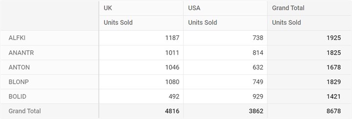
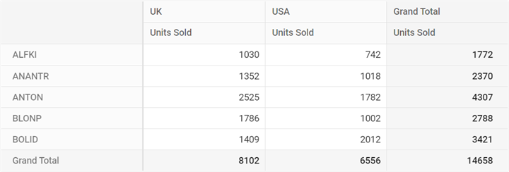
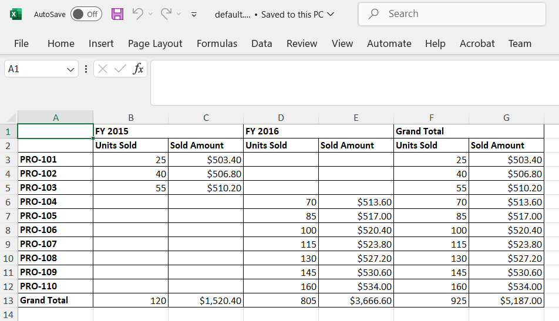
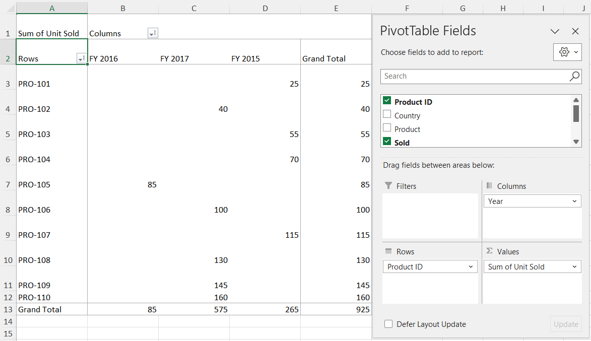

> By default, the Pivot Table processes and displays data using its built‑in engine with the given data source. Alternatively, you can use a server‑side pivot engine to connect external data to the Pivot Table, which is especially useful when working with large datasets. This option is applicable only for relational data sources. The server‑side pivot engine improves rendering performance, particularly in Blazor WebAssembly applications.

# Getting Started with Syncfusion<sup style="font-size:70%">&reg;</sup> Server-side Pivot Engine

This section explains how to use the Syncfusion<sup style="font-size:70%">&reg;</sup> assembly [Syncfusion.Pivot.Engine](https://www.nuget.org/packages/Syncfusion.Pivot.Engine) in a server-side application. The server-side engine performs operations such as aggregation, filtering, sorting, and grouping on the server. Only the information required for the Pivot Table viewport is sent to the client through a web service (Web API), instead of transferring the entire data source. This approach helps reduce network traffic and improves Pivot Table rendering performance when working with large data sets. It works efficiently with the virtual scrolling option and supports all existing features in the Pivot Table.

## Quick steps to render the Blazor Pivot Table by using the server-side Pivot Engine

### Download and installing Server-side Pivot Engine

1. Download the ASP.NET Core-based standalone [application](https://github.com/SyncfusionExamples/server-side-pivot-engine-for-blazor-pivot-table.git) from the GitHub repository. This application includes all necessary files to set up and use the server-side Pivot Engine.

2. The downloaded **PivotController** application contains the following files to support data communication and processing:
   - **PivotController.cs** in the **Controllers** folder: Handles data communication between the server and the Pivot Table.
   - **DataSource.cs** in the **DataSource** folder: Defines the structure of the data sources using model classes.
   - Sample data source files, **sales.csv** and **sales-analysis.json**, in the **DataSource** folder: Provide example data for testing the Pivot Table.

3. Open the **PivotController** application in Visual Studio. The Syncfusion [Syncfusion.Pivot.Engine](https://www.nuget.org/packages/Syncfusion.Pivot.Engine) library will automatically download from nuget.org, enabling server-side calculations such as aggregation, filtering, and sorting for the Pivot Table.


### Connecting Blazor Pivot Table to Server-side Pivot Engine

This section explains how to connect the Pivot Table to the server-side Pivot Engine to display data efficiently. Follow these steps to set up the connection and configure the Pivot Table using the server-side application created in the previous section.

1. **Start the server-side application**  
Run the **PivotController** application (downloaded and installed in the previous section) in Visual Studio. This hosts the server-side Pivot Engine on a local server, typically at a URL like `http://localhost:61379/api/pivot/post`. Ensure the application is running before proceeding.

2. **Configure the Pivot Table for server-side mode**  
In your Blazor application, update the Pivot Table’s settings to connect to the server-side Pivot Engine. Set the [EnableServerSideAggregation](https://help.syncfusion.com/cr/blazor/Syncfusion.Blazor.PivotView.PivotViewDataSourceSettings-1.html#Syncfusion_Blazor_PivotView_PivotViewDataSourceSettings_1_EnableServerSideAggregation) property under [PivotViewDataSourceSettings](https://help.syncfusion.com/cr/blazor/Syncfusion.Blazor.PivotView.PivotViewDataSourceSettings-1.html) to **true** and map the URL of the hosted Server-side application in [Url](https://help.syncfusion.com/cr/blazor/Syncfusion.Blazor.PivotView.PivotViewDataSourceSettings-1.html#Syncfusion_Blazor_PivotView_PivotViewDataSourceSettings_1_Url) property of [PivotViewDataSourceSettings](https://help.syncfusion.com/cr/blazor/Syncfusion.Blazor.PivotView.PivotViewDataSourceSettings-1.html).

```cshtml
@using Syncfusion.Blazor.PivotView

<SfPivotView TValue="PivotViewData" Height="300">
    <PivotViewDataSourceSettings TValue="PivotViewData" Url="http://localhost:61379/api/pivot/post" EnableServerSideAggregation="true">
        //Bind your report here...
    </PivotViewDataSourceSettings>
</SfPivotView>

@code{
    public class PivotViewData
    {
        public string ProductID { get; set; }
        public string Country { get; set; }
        public string Product { get; set; }
        public double Sold { get; set; }
        public double Price { get; set; }
        public string Year { get; set; }
    }
}
```

3. **Set up the Pivot Table report**  
Define the report to organize and display data from the server-side Pivot Engine. Use the [PivotViewDataSourceSettings](https://help.syncfusion.com/cr/blazor/Syncfusion.Blazor.PivotView.PivotViewDataSourceSettings-1.html) properties to specify rows, columns, values, and formatting based on the data source in the **PivotController** application (e.g., `sales.csv` or `sales-analysis.json`). For example, you can configure the report to show product details, sales amounts, and production years.

```cshtml
@using Syncfusion.Blazor.PivotView

<SfPivotView TValue="PivotViewData" Height="300">
    <PivotViewDataSourceSettings TValue="PivotViewData" Url="http://localhost:61379/api/pivot/post" EnableServerSideAggregation="true">
        <PivotViewRows>
            <PivotViewRow Name="ProductID" Caption="Product ID"></PivotViewRow>
        </PivotViewRows>
        <PivotViewColumns>
            <PivotViewColumn Name="Year" Caption="Production Year"></PivotViewColumn>
        </PivotViewColumns>
        <PivotViewValues>
            <PivotViewValue Name="Sold" Caption="Units Sold"></PivotViewValue>
            <PivotViewValue Name="Price" Caption="Sold Amount"></PivotViewValue>
        </PivotViewValues>
        <PivotViewFormatSettings>
            <PivotViewFormatSetting Name="Price" Format="C"></PivotViewFormatSetting>
        </PivotViewFormatSettings>
    </PivotViewDataSourceSettings>
</SfPivotView>

@code{
    public class PivotViewData
    {
        public string ProductID { get; set; }
        public string Country { get; set; }
        public string Product { get; set; }
        public double Sold { get; set; }
        public double Price { get; set; }
        public string Year { get; set; }
    }
}
```

4. **Run the Blazor application**  
Launch your Blazor application to view the Pivot Table. The Pivot Table will connect to the server-side Pivot Engine, retrieve the processed data, and display the results based on the configured report.


## Available configurations in Server-side application

This section explains how to set up and use different data sources with the server-side Pivot Engine in the Blazor [Pivot Table](https://help.syncfusion.com/cr/blazor/Syncfusion.Blazor.PivotView.html).

### Supportive Data Sources

The server-side Pivot Engine supports the following data sources:
- Collection
- JSON
- CSV
- DataTable
- Dynamic

#### Collection

The server-side pivot engine supports collection-based data sources, such as List or IEnumerable. You can bind these data sources using the `GetData` method in the server-side controller. In the Pivot Table, set the [Type](https://help.syncfusion.com/cr/blazor/Syncfusion.Blazor.PivotView.PivotViewDataSourceSettings-1.html#Syncfusion_Blazor_PivotView_PivotViewDataSourceSettings_1_Type) property in the [PivotViewDataSourceSettings](https://help.syncfusion.com/cr/blazor/Syncfusion.Blazor.PivotView.PivotViewDataSourceSettings-1.html) to `JSON`, which is the default value.

In the server-side application, define the collection data source in the **DataSource.cs** file, as shown below:

```csharp
public class PivotViewData
{
    public string ProductID { get; set; }
    public string Country { get; set; }
    public string Product { get; set; }
    public double Sold { get; set; }
    public double Price { get; set; }
    public string Year { get; set; }

    public List<PivotViewData> GetVirtualData()
    {
        List<PivotViewData> VirtualData = new List<PivotViewData>();

        for (int i = 1; i <= 10000; i++)
        {
            PivotViewData p = new PivotViewData
            {
                ProductID = "PRO-" + ((100 + i)%20),
                Year = (new string[] { "FY 2015", "FY 2016", "FY 2017", "FY 2018", "FY 2019" })[new Random().Next(5)],
                Country = (new string[] { "Canada", "France", "Australia", "Germany", "France" })[new Random().Next(5)],
                Product = (new string[] { "Car", "Van", "Bike", "Flight", "Bus" })[new Random().Next(5)],
                Price = (3.4 * i) + 500,
                Sold = (i * 15) + 10
            };
            VirtualData.Add(p);
        }
        return VirtualData;
    }
}
```

To bind this data source, set the model type **PivotViewData** to the **TValue** parameter of the **PivotEngine** class, as shown below:

```csharp
private PivotEngine<DataSource.PivotViewData> PivotEngine = new PivotEngine<DataSource.PivotViewData>();
```

Next, call the data source in the **GetData** method within the **PivotController.cs** file:

```csharp
public async Task<object> GetData(FetchData param)
{
    return await _cache.GetOrCreateAsync("dataSource" + param.Hash,
        async (cacheEntry) =>
        {
            cacheEntry.SetSize(1);
            cacheEntry.AbsoluteExpiration = DateTimeOffset.UtcNow.AddMinutes(60);

            // Bind the collection-based data source here.
            return new DataSource.PivotViewData().GetVirtualData();
        });
}
```

Finally, configure the Pivot Table by setting the appropriate report in the [PivotViewDataSourceSettings](https://help.syncfusion.com/cr/blazor/Syncfusion.Blazor.PivotView.PivotViewDataSourceSettings-1.html) to match the data source, as shown below:

```cshtml
@using Syncfusion.Blazor.PivotView

<SfPivotView TValue="PivotViewData" Height="300">
    <PivotViewDataSourceSettings TValue="PivotViewData" Url="http://localhost:61379/api/pivot/post" EnableServerSideAggregation="true">
        <PivotViewRows>
            <PivotViewRow Name="ProductID" Caption="Product ID"></PivotViewRow>
        </PivotViewRows>
        <PivotViewColumns>
            <PivotViewColumn Name="Year" Caption="Production Year"></PivotViewColumn>
        </PivotViewColumns>
        <PivotViewValues>
            <PivotViewValue Name="Sold" Caption="Units Sold"></PivotViewValue>
            <PivotViewValue Name="Price" Caption="Sold Amount"></PivotViewValue>
        </PivotViewValues>
        <PivotViewFormatSettings>
            <PivotViewFormatSetting Name="Price" Format="C"></PivotViewFormatSetting>
        </PivotViewFormatSettings>
    </PivotViewDataSourceSettings>
</SfPivotView>

@code{
    public class PivotViewData
    {
        public string ProductID { get; set; }
        public string Country { get; set; }
        public string Product { get; set; }
        public double Sold { get; set; }
        public double Price { get; set; }
        public string Year { get; set; }
    }
}
```


#### JSON

You can use JSON data from a local *.json file to connect to the Pivot Table. The file can be read using the **StreamReader**, which returns the content as a string. This string should then be converted into a collection that can be used with the server-side pivot engine.

In your server-side application, the **sales-analysis.json** file is located in the **DataSource** folder, and its model type is defined in the **DataSource.cs** file:

```csharp
public class PivotJSONData
{
    public string Date { get; set; }
    public string Sector { get; set; }
    public string EnerType { get; set; }
    public string EneSource { get; set; }
    public int PowUnits { get; set; }
    public int ProCost { get; set; }

    public List<PivotJSONData> ReadJSONData(string url)
    {
        WebClient myWebClient = new WebClient();
        Stream myStream = myWebClient.OpenRead(url);
        StreamReader stream = new StreamReader(myStream);
        string result = stream.ReadToEnd();
        stream.Close();
        return Newtonsoft.Json.JsonConvert.DeserializeObject<List<PivotJSONData>>(result);
    }
}
```

To use this data with the Pivot Table, assign the model type **PivotJSONData** to the **TValue** parameter of the **PivotEngine** class.

```csharp
private PivotEngine<DataSource.PivotJSONData> PivotEngine = new PivotEngine<DataSource.PivotJSONData>();
```

Next, retrieve the JSON data in the **GetData** method of the **PivotController.cs** file. This example shows how to load the **sales-analysis.json** file from the local server:

```csharp
public async Task<object> GetData(FetchData param)
{
    return await _cache.GetOrCreateAsync("dataSource" + param.Hash,
        async (cacheEntry) =>
        {
            cacheEntry.SetSize(1);
            cacheEntry.AbsoluteExpiration = DateTimeOffset.UtcNow.AddMinutes(60);

            // Bind JSON data source from the sales-analysis.json file.
            return new DataSource.PivotJSONData().ReadJSONData(_hostingEnvironment.ContentRootPath + "\\DataSource\\sales-analysis.json");
        });
}
```

Then, configure the [PivotViewDataSourceSettings](https://help.syncfusion.com/cr/blazor/Syncfusion.Blazor.PivotView.PivotViewDataSourceSettings-1.html) property in the Pivot Table to use the JSON data source:

```cshtml
@using Syncfusion.Blazor.PivotView

<SfPivotView TValue="PivotJSONData" Height="300">
    <PivotViewDataSourceSettings TValue="PivotJSONData" Url="http://localhost:61379/api/pivot/post" EnableServerSideAggregation="true">
        <PivotViewRows>
            <PivotViewRow Name="EneSource" Caption="Energy Source"></PivotViewRow>
        </PivotViewRows>
        <PivotViewColumns>
            <PivotViewColumn Name="EnerType" Caption="Energy Type"></PivotViewColumn>
        </PivotViewColumns>
        <PivotViewValues>
            <PivotViewValue Name="PowUnits" Caption="Units Sold"></PivotViewValue>
            <PivotViewValue Name="ProCost" Caption="Sold Amount"></PivotViewValue>
        </PivotViewValues>
        <PivotViewFormatSettings>
            <PivotViewFormatSetting Name="ProCost" Format="C"></PivotViewFormatSetting>
        </PivotViewFormatSettings>
    </PivotViewDataSourceSettings>
</SfPivotView>

@code{
    public class PivotJSONData
    {
        public string Date { get; set; }
        public string Sector { get; set; }
        public string EnerType { get; set; }
        public string EneSource { get; set; }
        public int PowUnits { get; set; }
        public int ProCost { get; set; }
    }
}
```


You can also use JSON data from a remote server in the same way as a local JSON file. Both directly downloadable *.json files and web service URLs are supported. To do this, specify the URL of the remote *.json file in the **GetData** method. The remaining configurations stay the same.

In the server-side application, the CDN link is used to connect the same **sales-analysis.json** file which is already hosted in the Syncfusion<sup style="font-size:70%">&reg;</sup> server.

```csharp
public async Task<object> GetData(FetchData param)
{
    return await _cache.GetOrCreateAsync("dataSource" + param.Hash,
    async (cacheEntry) =>
    {
        cacheEntry.SetSize(1);
        cacheEntry.AbsoluteExpiration = DateTimeOffset.UtcNow.AddMinutes(60);

        // Bind JSON data source from a remote server.
        return new DataSource.PivotJSONData().ReadJSONData("http://cdn.syncfusion.com/data/sales-analysis.json");
    });
}
```

#### CSV

The server-side Pivot Engine supports CSV data from a local *.csv file or a remote server. To use a local CSV file, read the file using the **StreamReader** class, which converts the file content into a string. This string is then split into a collection that can be bound to the server-side Pivot Engine. In the Pivot Table, set the [Type](https://help.syncfusion.com/cr/blazor/Syncfusion.Blazor.PivotView.PivotViewDataSourceSettings-1.html#Syncfusion_Blazor_PivotView_PivotViewDataSourceSettings_1_Type) property in the [PivotViewDataSourceSettings](https://help.syncfusion.com/cr/blazor/Syncfusion.Blazor.PivotView.PivotViewDataSourceSettings-1.html) to **CSV**.

In the server application, the **sales.csv** file is located in the **DataSource** folder, and its data model is defined in the **DataSource.cs** file as shown below:

```csharp
public class PivotCSVData
{
    public string Region { get; set; }
    public string Country { get; set; }
    public string ItemType { get; set; }
    public string SalesChannel { get; set; }
    public string OrderPriority { get; set; }
    public string OrderDate { get; set; }
    public int OrderID { get; set; }
    public string ShipDate { get; set; }
    public int UnitsSold { get; set; }
    public double UnitPrice { get; set; }
    public double UnitCost { get; set; }
    public double TotalRevenue { get; set; }
    public double TotalCost { get; set; }
    public double TotalProfit { get; set; }

    public List<string[]> ReadCSVData(string url)
    {
        List<string[]> data = new List<string[]>();
        using (StreamReader reader = new StreamReader(new WebClient().OpenRead(url)))
        {
            string line;
            while ((line = reader.ReadLine()) != null)
            {
                line = line.Trim();
                if (!string.IsNullOrWhiteSpace(line))
                {
                    data.Add(line.Split(','));
                }
            }
            return data;
        }
    }
}
```

To bind the CSV data, set the **PivotCSVData** model as the **TValue** type for the **PivotEngine** class:

```csharp
private PivotEngine<DataSource.PivotCSVData> PivotEngine = new PivotEngine<DataSource.PivotCSVData>();
```

Next, retrieve the CSV data in the **GetData** method of the **PivotController.cs** file:

```csharp
public async Task<object> GetData(FetchData param)
{
    return await _cache.GetOrCreateAsync("dataSource" + param.Hash,
        async (cacheEntry) =>
        {
            cacheEntry.SetSize(1);
            cacheEntry.AbsoluteExpiration = DateTimeOffset.UtcNow.AddMinutes(60);

            // Bind CSV data from the local sales.csv file.
            return new DataSource.PivotCSVData().ReadCSVData(_hostingEnvironment.ContentRootPath + "\\DataSource\\sales.csv");
        });
}
```

Finally, configure the Pivot Table with the appropriate report settings based on the CSV data source:

```cshtml
@using Syncfusion.Blazor.PivotView

<SfPivotView TValue="PivotCSVData" Height="300">
    <PivotViewDataSourceSettings TValue="PivotCSVData" Url="http://localhost:61379/api/pivot/post" EnableServerSideAggregation="true">
        <PivotViewRows>
            <PivotViewRow Name="ItemType" Caption="Item Type"></PivotViewRow>
        </PivotViewRows>
        <PivotViewColumns>
            <PivotViewColumn Name="Region"></PivotViewColumn>
        </PivotViewColumns>
        <PivotViewValues>
            <PivotViewValue Name="UnitsSold" Caption="Units Sold"></PivotViewValue>
            <PivotViewValue Name="UnitPrice" Caption="Sold Amount"></PivotViewValue>
        </PivotViewValues>
        <PivotViewFormatSettings>
            <PivotViewFormatSetting Name="UnitPrice" Format="C"></PivotViewFormatSetting>
        </PivotViewFormatSettings>
    </PivotViewDataSourceSettings>
</SfPivotView>

@code {
    public class PivotCSVData
    {
        public string Region { get; set; }
        public string Country { get; set; }
        public string ItemType { get; set; }
        public string SalesChannel { get; set; }
        public string OrderPriority { get; set; }
        public string OrderDate { get; set; }
        public int OrderID { get; set; }
        public string ShipDate { get; set; }
        public int UnitsSold { get; set; }
        public double UnitPrice { get; set; }
        public double UnitCost { get; set; }
        public double TotalRevenue { get; set; }
        public double TotalCost { get; set; }
        public double TotalProfit { get; set; }
    }
}
```


You can also use CSV data from a remote server, such as a downloadable file or a web service URL. To do this, provide the CSV file URL in the **GetData** method. The process for setting up the Pivot Table remains the same as described above.

Here is an example of using a remote CSV file hosted on the Syncfusion server:

```csharp
public async Task<object> GetData(FetchData param)
{
    return await _cache.GetOrCreateAsync("dataSource" + param.Hash,
        async (cacheEntry) =>
        {
            cacheEntry.SetSize(1);
            cacheEntry.AbsoluteExpiration = DateTimeOffset.UtcNow.AddMinutes(60);

            // Bind the CSV-type data source from remote server.
            return new DataSource.PivotCSVData().ReadCSVData("http://cdn.syncfusion.com/data/sales-analysis.csv");
        });
}
```

#### DataTable

In a server-side application, you can create a DataTable named **BusinessObjectsDataView** by mapping it to the **PivotViewData** model type defined in the **DataSource.cs** file. The following code demonstrates how to generate this DataTable from a collection of `PivotViewData` objects:

```csharp
public class BusinessObjectsDataView
{
    public DataTable GetDataTable()
    {
        DataTable dt = new DataTable("BusinessObjectsDataTable");
        PropertyDescriptorCollection pdc = TypeDescriptor.GetProperties(typeof(PivotViewData));
        foreach (PropertyDescriptor pd in pdc)
        {
            dt.Columns.Add(new DataColumn(pd.Name, pd.PropertyType));
        }
        List<PivotViewData> list = new PivotViewData().GetVirtualData();
        foreach (PivotViewData bo in list)
        {
            DataRow dr = dt.NewRow();
            foreach (PropertyDescriptor pd in pdc)
            {
                dr[pd.Name] = pd.GetValue(bo);
            }
            dt.Rows.Add(dr);
        }
        return dt;
    }
}
```

To bind the data source, set the model type **PivotViewData** to the **TValue** property of the **PivotEngine** class, as shown below:

```csharp
private PivotEngine<DataSource.PivotViewData> PivotEngine = new PivotEngine<DataSource.PivotViewData>();
```

Next, retrieve the data source by calling the **GetData** method in the **PivotController.cs** file. This method uses caching to improve performance:

```csharp
public async Task<object> GetData(FetchData param)
{
    return await _cache.GetOrCreateAsync("dataSource" + param.Hash,
        async (cacheEntry) =>
        {
            cacheEntry.SetSize(1);
            cacheEntry.AbsoluteExpiration = DateTimeOffset.UtcNow.AddMinutes(60);

            // Bind the DataTable here.
            return new DataSource.BusinessObjectsDataView().GetDataTable();
        });
}
```

Finally, configure the Pivot Table by setting the appropriate report using the [PivotViewDataSourceSettings](https://help.syncfusion.com/cr/blazor/Syncfusion.Blazor.PivotView.PivotViewDataSourceSettings-1.html) property. Below is an example configuration that connects to the server-side data source:

```cshtml
@using Syncfusion.Blazor.PivotView

<SfPivotView TValue="PivotViewData" Height="300">
    <PivotViewDataSourceSettings TValue="PivotViewData" Url="http://localhost:61379/api/pivot/post" EnableServerSideAggregation="true">
        <PivotViewRows>
            <PivotViewRow Name="ProductID" Caption="Product ID"></PivotViewRow>
        </PivotViewRows>
        <PivotViewColumns>
            <PivotViewColumn Name="Year" Caption="Production Year"></PivotViewColumn>
        </PivotViewColumns>
        <PivotViewValues>
            <PivotViewValue Name="Sold" Caption="Units Sold"></PivotViewValue>
            <PivotViewValue Name="Price" Caption="Sold Amount"></PivotViewValue>
        </PivotViewValues>
        <PivotViewFormatSettings>
            <PivotViewFormatSetting Name="Price" Format="C"></PivotViewFormatSetting>
        </PivotViewFormatSettings>
    </PivotViewDataSourceSettings>
</SfPivotView>

@code{
    public class PivotViewData
    {
        public string ProductID { get; set; }
        public string Country { get; set; }
        public string Product { get; set; }
        public double Sold { get; set; }
        public double Price { get; set; }
        public string Year { get; set; }
    }
}
```


#### Dynamic

Usually, the model type must be defined for most data sources in the server-side pivot engine. However, when using certain data sources, such as dynamic types, it is not necessary to define a model type. The server-side pivot engine supports these data sources as well.

##### ExpandoObject

In a server-side application, users can use an **ExpandoObject** as a data source. This type of data source is managed by the `PivotExpandoData` class found in the **DataSource.cs** file. The following code shows how to create a list of **ExpandoObject** items:

```csharp
public class PivotExpandoData
{
    public List<ExpandoObject> Orders { get; set; } = new List<ExpandoObject>();
    public List<ExpandoObject> GetExpandoData()
    {
        Orders = Enumerable.Range(1, 75).Select((x) =>
        {
            dynamic d = new ExpandoObject();
            d.OrderID = 1000 + (x % 100);
            d.CustomerID = (new string[] { "ALFKI", "ANANTR", "ANTON", "BLONP", "BOLID" })[new Random().Next(5)];
            d.Freight = (new double[] { 2, 1, 4, 5, 3 })[new Random().Next(5)] * x;
            d.OrderDate = (new DateTime[] { new DateTime(2010, 11, 5), new DateTime(2018, 10, 3), new DateTime(1995, 9, 9), new DateTime(2012, 8, 2), new DateTime(2015, 4, 11) })[new Random().Next(5)];
            d.ShipCountry = (new string[] { "USA", "UK" })[new Random().Next(2)];
            d.Verified = (new bool[] { true, false })[new Random().Next(2)];

            return d;
        }).Cast<ExpandoObject>().ToList<ExpandoObject>();
        return Orders;
    }
}
```

To use this data source with the server-side pivot engine, specify **ExpandoObject** as the model type for `TValue` in the `PivotEngine` class:

```csharp
private PivotEngine<ExpandoObject> PivotEngine = new PivotEngine<ExpandoObject>();
```

Next, in the **GetData** method of the **PivotController.cs** file, return the ExpandoObject data source:

```csharp
public async Task<object> GetData(FetchData param)
{
    return await _cache.GetOrCreateAsync("dataSource" + param.Hash,
        async (cacheEntry) =>
        {
            cacheEntry.SetSize(1);
            cacheEntry.AbsoluteExpiration = DateTimeOffset.UtcNow.AddMinutes(60);

            // Returns ExpandoObject type data source.
            return new DataSource.PivotExpandoData().GetExpandoData();
        });
}
```

Finally, configure the [PivotViewDataSourceSettings](https://help.syncfusion.com/cr/blazor/Syncfusion.Blazor.PivotView.PivotViewDataSourceSettings-1.html) property for the Pivot Table on the client side. Set the appropriate fields for rows, columns, and values to match the ExpandoObject properties:

```cshtml
@using Syncfusion.Blazor.PivotView
@using System.Dynamic

<SfPivotView TValue="ExpandoObject" Height="300">
    <PivotViewDataSourceSettings TValue="ExpandoObject" Url="http://localhost:61379/api/pivot/post" EnableServerSideAggregation="true">
        <PivotViewRows>
            <PivotViewRow Name="CustomerID" Caption="Customer ID"></PivotViewRow>
        </PivotViewRows>
        <PivotViewColumns>
            <PivotViewColumn Name="ShipCountry" Caption="Ship Country"></PivotViewColumn>
        </PivotViewColumns>
        <PivotViewValues>
            <PivotViewValue Name="Freight" Caption="Units Sold"></PivotViewValue>
        </PivotViewValues>
    </PivotViewDataSourceSettings>
</SfPivotView>

@code {
    //other codes here...
}
```



##### Dynamic Objects

A dynamic object allows users to bind data to the [Pivot Table](https://help.syncfusion.com/cr/blazor/Syncfusion.Blazor.PivotView.html) without having to define a fixed model type. In a server-side application, a data source is created using dynamic objects which are available under the **PivotDynamicData** class in the **DataSource.cs** file.

```csharp
public class PivotDynamicData
{
    public List<DynamicDictionary> Orders = new List<DynamicDictionary>() { };
    public List<DynamicDictionary> GetDynamicData()
    {
        Orders = Enumerable.Range(1, 100).Select((x) =>
        {
            dynamic d = new DynamicDictionary();
            d.OrderID = 100 + x;
            d.CustomerID = (new string[] { "ALFKI", "ANANTR", "ANTON", "BLONP", "BOLID" })[new Random().Next(5)];
            d.Freight = (new double[] { 2, 1, 4, 5, 3 })[new Random().Next(5)] * x;
            d.OrderDate = (new DateTime[] { new DateTime(2010, 11, 5), new DateTime(2018, 10, 3), new DateTime(1995, 9, 9), new DateTime(2012, 8, 2), new DateTime(2015, 4, 11) })[new Random().Next(5)];
            d.ShipCountry = (new string[] { "USA", "UK" })[new Random().Next(2)];
            d.Verified = (new bool[] { true, false })[new Random().Next(2)];
            return d;
        }).Cast<DynamicDictionary>().ToList<DynamicDictionary>();
        return Orders;
    }

    public class DynamicDictionary : System.Dynamic.DynamicObject
    {
        Dictionary<string, object> dictionary = new Dictionary<string, object>();
        public override bool TryGetMember(GetMemberBinder binder, out object result)
        {
            string name = binder.Name;
            return dictionary.TryGetValue(name, out result);
        }
        public override bool TrySetMember(SetMemberBinder binder, object value)
        {
            dictionary[binder.Name] = value;
            return true;
        }
        //The "GetDynamicMemberNames" method of the "DynamicDictionary" class must be overridden and return the property names to perform data operation and editing while using dynamic objects.
        public override System.Collections.Generic.IEnumerable<string> GetDynamicMemberNames()
        {
            return this.dictionary?.Keys;
        }
    }
}
```

To use this data source in the server-side code, assign the **PivotDynamicData** class to the **TValue** of the `PivotEngine` class:

```csharp
private PivotEngine<DataSource.PivotDynamicData> PivotEngine = new PivotEngine<DataSource.PivotDynamicData>();
```

When loading data in the **GetData** method of the **PivotController.cs** file, return the dynamic data source as shown below:

```csharp
public async Task<object> GetData(FetchData param)
{
    return await _cache.GetOrCreateAsync("dataSource" + param.Hash,
        async (cacheEntry) =>
        {
            cacheEntry.SetSize(1);
            cacheEntry.AbsoluteExpiration = DateTimeOffset.UtcNow.AddMinutes(60);

            // Here bind data source with dynamic objects.
            return new DataSource.PivotDynamicData().GetDynamicData();
        });
}
```

Finally, configure the [PivotViewDataSourceSettings](https://help.syncfusion.com/cr/blazor/Syncfusion.Blazor.PivotView.PivotViewDataSourceSettings-1.html) property for the Pivot Table on the client side.

```cshtml
@using Syncfusion.Blazor.PivotView
@using System.Dynamic

<SfPivotView TValue="DynamicObject" Height="300">
    <PivotViewDataSourceSettings TValue="DynamicObject" Url="http://localhost:61379/api/pivot/post" EnableServerSideAggregation="true">
        <PivotViewRows>
            <PivotViewRow Name="CustomerID" Caption="Customer ID"></PivotViewRow>
        </PivotViewRows>
        <PivotViewColumns>
            <PivotViewColumn Name="ShipCountry" Caption="Ship Country"></PivotViewColumn>
        </PivotViewColumns>
        <PivotViewValues>
            <PivotViewValue Name="Freight" Caption="Units Sold"></PivotViewValue>
        </PivotViewValues>
    </PivotViewDataSourceSettings>
</SfPivotView>

@code {
    //other codes here...
}
```



### Controller Configuration

#### Memory Cache

In a server-side application, the [`Memory Cache`](https://learn.microsoft.com/en-us/dotnet/api/system.runtime.caching.memorycache?view=net-9.0) option helps store the data source and engine properties in RAM for use during UI actions in the Pivot Table. This approach improves performance by preventing the need to recalculate aggregated values every time the user interacts with the Pivot Table. The following example shows how the memory cache is used in the **GetEngine** method to store engine properties:

```csharp
public async Task<EngineProperties> GetEngine(FetchData param)
{
    isRendered = false;
    // Engine properties are stored in memory cache with GUID "parem.Hash".
    return await _cache.GetOrCreateAsync("engine" + param.Hash,
        async (cacheEntry) =>
        {
            isRendered = true;
            cacheEntry.SetSize(1);
            // Memory cache expiration time can be set here.
            cacheEntry.AbsoluteExpiration = DateTimeOffset.UtcNow.AddMinutes(60);
            PivotEngine.Data = await GetData(param);
            return await PivotEngine.GetEngine(param);
        });
}
```

Engine properties are saved in RAM using a unique ID (GUID) that is received from the client-side source code. This GUID is randomly generated and changes if the user refreshes the page or opens the Pivot Table in a new browser tab or window. Because of this, each GUID in the memory cache holds information unique to that session, allowing each Pivot Table instance to work independently.

The memory cache is configured to expire after 60 minutes to help free up RAM. If the user is still working with the Pivot Table after this period, the required data will be generated and cached for another 60 minutes.

#### Methods and its needs

- **Post:** This method receives requests from the client side of the Pivot Table and forwards them to the appropriate server-side method for processing.
- **GetEngine:** Stores engine properties in RAM as a cache. This method is triggered during the initial rendering of the Pivot Table or when the memory cache expires.
- **GetData:** This method stores the Pivot Table’s data source in a cache on the server. Like **GetEngine**, it is triggered on the first load or after the memory cache is cleared. This enables faster retrieval of the Pivot Table’s data and allows the table to respond quickly to changes.
- **GetMembers:** Allows retrieval of the members of a field. This method is triggered when the member editor is opened for a filtering operation.
- **GetRawData:** Fetches the raw, unaggregated data behind a value cell. This method is used when the user opens the drill-through dialog or starts editing a value in the Pivot Table.
- **GetPivotValues:** Updates the stored engine properties in the in-memory cache and returns the aggregated values to the browser to render the Pivot Table. The return value can be modified, and the Pivot Table will be rendered in the browser based on this.

## Excel Export

The server-side engine seamlessly supports Excel export functionality, enabling users to efficiently generate and download pivot table reports in Excel format directly from the server. To enable Excel export in the pivot table, set the [AllowExcelExport](https://help.syncfusion.com/cr/blazor/Syncfusion.Blazor.PivotView.SfPivotView-1.html#Syncfusion_Blazor_PivotView_SfPivotView_1_AllowExcelExport) property in [SfPivotView](https://help.syncfusion.com/cr/blazor/Syncfusion.Blazor.PivotView.SfPivotView-1.html) class to **true**. Once the API is set, the user needs to call the [ExportToExcelAsync](https://help.syncfusion.com/cr/blazor/Syncfusion.Blazor.PivotView.SfPivotView-1.html#Syncfusion_Blazor_PivotView_SfPivotView_1_ExcelExport_System_Object_System_Nullable_System_Boolean__System_Object_System_Nullable_System_Boolean__) method to export the pivot table to Excel by clicking an external button.

N> The pivot table component can be exported to Excel format using options available in the toolbar. For more details [refer](./tool-bar) here.

```cshtml
@using Syncfusion.Blazor.PivotView
@using Syncfusion.Blazor.Buttons

<SfButton OnClick="OnExcelExport" Content="Excel Export"></SfButton>
<SfPivotView TValue="ProductDetails" @ref="@pivot" AllowExcelExport="true" >
    <PivotViewDataSourceSettings TValue="PivotViewData" Url="http://localhost:61379/api/pivot/post" EnableServerSideAggregation="true">
        <PivotViewRows>
            <PivotViewRow Name="ProductID" Caption="Product ID"></PivotViewRow>
        </PivotViewRows>
        <PivotViewColumns>
            <PivotViewColumn Name="Year" Caption="Production Year"></PivotViewColumn>
        </PivotViewColumns>
        <PivotViewValues>
            <PivotViewValue Name="Sold" Caption="Units Sold"></PivotViewValue>
            <PivotViewValue Name="Price" Caption="Sold Amount"></PivotViewValue>
        </PivotViewValues>
        <PivotViewFormatSettings>
            <PivotViewFormatSetting Name="Price" Format="C"></PivotViewFormatSetting>
        </PivotViewFormatSettings>
    </PivotViewDataSourceSettings>
</SfPivotView>

@code{
    SfPivotView<ProductDetails> pivot;
    public List<ProductDetails> Data { get; set; }
    protected override void OnInitialized()
    {
        this.Data = ProductDetails.GetProductData().ToList();
       //Bind the data source collection here. Refer "Assigning sample data to the pivot table" section in getting started for more details.
    }

    public void OnExcelExport() {
        this.pivot.ExportToExcelAsync(false);
    }
}

```

To enable export functionality in a server-side controller, initialize the **ExcelExport** class to handle export file generation.

```csharp
 private ExcelExport excelExport = new ExcelExport();
```

Then, based on the **Action** parameter (**onExcelExport** or **onCsvExport**), invoke the **ExportToExcel** method in the **Post** method of the **PivotController.cs** file.

```csharp
        public async Task<object> Post([FromBody]object args)
        {
            FetchData param = JsonConvert.DeserializeObject<FetchData>(args.ToString());
            if (param.Action == "fetchFieldMembers")
            {
                return await GetMembers(param);
            }
            else if (param.Action == "fetchRawData")
            {
                return await GetRawData(param);
            }
             else if (param.Action == "onExcelExport" || param.Action == "onCsvExport" ||
                     param.Action == "onPivotExcelExport" || param.Action == "onPivotCsvExport")
            {
                EngineProperties engine = await GetEngine(param);
                if (param.InternalProperties.EnableVirtualization && param.ExportAllPages)
                {
                    engine = await PivotEngine.PerformAction(engine, param);
                }
                if (param.Action == "onExcelExport")
                {
                    return excelExport.ExportToExcel("Excel", engine, null, param.ExcelExportProperties);
                }
                else if (param.Action == "onPivotExcelExport" || param.Action == "onPivotCsvExport")
                {
                    return pivotExport.ExportAsPivot(param.Action == "onPivotExcelExport" ? ExportType.Excel : ExportType.CSV, engine, param);
                }
                else
                {
                    return excelExport.ExportToExcel("CSV", engine, null, param.ExcelExportProperties);
                }
            }
            else
            {
                return await GetPivotValues(param);
            }
        }

```



### Add header and footer while exporting

The Excel export provides an option to include header and footer content for the excel document before exporting. In-order to add header and footer, define [Header](https://help.syncfusion.com/cr/blazor/Syncfusion.Blazor.Grids.ExcelExportProperties.html#Syncfusion_Blazor_Grids_ExcelExportProperties_Header) and [Footer](https://help.syncfusion.com/cr/blazor/Syncfusion.Blazor.Grids.ExcelExportProperties.html#Syncfusion_Blazor_Grids_ExcelExportProperties_Footer) properties in [ExcelExportProperties](https://help.syncfusion.com/cr/blazor/Syncfusion.Blazor.Grids.ExcelExportProperties.html) and pass it as a parameter to the [ExportToExcelAsync](https://help.syncfusion.com/cr/blazor/Syncfusion.Blazor.PivotView.SfPivotView-1.html#Syncfusion_Blazor_PivotView_SfPivotView_1_ExportToExcelAsync_Syncfusion_Blazor_Grids_ExcelExportProperties_System_Nullable_System_Boolean__System_Object_System_Nullable_System_Boolean__System_Boolean_) method.

```cshtml
@using Syncfusion.Blazor.PivotView
@using Syncfusion.Blazor.Buttons

<SfButton OnClick="OnExcelExport" Content="Excel Export"></SfButton>
<SfPivotView TValue="PivotViewData" Height="300" @ref="pivotView" AllowExcelExport="true" EnableVirtualization="true">
    <PivotViewDataSourceSettings TValue="PivotViewData" Url="http://localhost:61379/api/pivot/post" EnableServerSideAggregation="true">
        <PivotViewRows>
            <PivotViewRow Name="ProductID" Caption="Product ID"></PivotViewRow>
        </PivotViewRows>
        <PivotViewColumns>
            <PivotViewColumn Name="Year" Caption="Production Year"></PivotViewColumn>
        </PivotViewColumns>
        <PivotViewValues>
            <PivotViewValue Name="Sold" Caption="Units Sold"></PivotViewValue>
            <PivotViewValue Name="Price" Caption="Sold Amount"></PivotViewValue>
        </PivotViewValues>
        <PivotViewFormatSettings>
            <PivotViewFormatSetting Name="Price" Format="C"></PivotViewFormatSetting>
        </PivotViewFormatSettings>
    </PivotViewDataSourceSettings>
</SfPivotView>

@code {
    private SfPivotView<PivotViewData> pivotView;
    public class PivotViewData
    {
        public string ProductID { get; set; }
        public string Country { get; set; }
        public string Product { get; set; }
        public double Sold { get; set; }
        public double Price { get; set; }
        public string Year { get; set; }
    }

     public async Task OnExcelExport(Microsoft.AspNetCore.Components.Web.MouseEventArgs args)
    {
        Syncfusion.Blazor.Grids.ExcelExportProperties ExportProperties = new Syncfusion.Blazor.Grids.ExcelExportProperties();
        Syncfusion.Blazor.Grids.ExcelHeader header = new Syncfusion.Blazor.Grids.ExcelHeader();
        Syncfusion.Blazor.Grids.ExcelFooter footer = new Syncfusion.Blazor.Grids.ExcelFooter();
        header.HeaderRows = 1;
        footer.FooterRows = 1;
        List<Syncfusion.Blazor.Grids.ExcelRow> headerContent = new List<Syncfusion.Blazor.Grids.ExcelRow>
        {
            new Syncfusion.Blazor.Grids.ExcelRow() { Index = 1, Cells = new List<Syncfusion.Blazor.Grids.ExcelCell>
            {
                new Syncfusion.Blazor.Grids.ExcelCell() { Index=1, RowSpan= 1,ColSpan=11 , Value= "Pivot Table", Style = new Syncfusion.Blazor.Grids.ExcelStyle() { FontColor = "#C67878" ,Bold = true, FontSize = 20, Italic= true, HAlign = Syncfusion.Blazor.Grids.ExcelHorizontalAlign.Center }  },
            } },
        };
        List<Syncfusion.Blazor.Grids.ExcelRow> footerContent = new List<Syncfusion.Blazor.Grids.ExcelRow>
        {
            new Syncfusion.Blazor.Grids.ExcelRow() { Index = 1, Cells = new List<Syncfusion.Blazor.Grids.ExcelCell>
            {
                new Syncfusion.Blazor.Grids.ExcelCell() { Index=1, RowSpan= 1,ColSpan=11 , Value= "Thank you for your business! Visit Again!", Style = new Syncfusion.Blazor.Grids.ExcelStyle() { Bold = true, FontSize = 13, Italic= true,  HAlign = Syncfusion.Blazor.Grids.ExcelHorizontalAlign.Center }  },
            } },
        };
        header.Rows = headerContent;
        footer.Rows = footerContent;
        Syncfusion.Blazor.Grids.ExcelExportProperties excelExportProperties = new Syncfusion.Blazor.Grids.ExcelExportProperties()
        {
            FileName = "sample.xlsx",
            Header = header,
            Footer = footer,
        };
        await this.pivotView.ExportToExcelAsync(excelExportProperties);
    } 
}

```


## CSV Export

The Excel export allows pivot table data to be exported in **CSV** file format as well. To enable CSV export in the pivot table, set the [AllowExcelExport](https://help.syncfusion.com/cr/blazor/Syncfusion.Blazor.PivotView.SfPivotView-1.html#Syncfusion_Blazor_PivotView_SfPivotView_1_AllowExcelExport) property in [SfPivotView](https://help.syncfusion.com/cr/blazor/Syncfusion.Blazor.PivotView.SfPivotView-1.html) class as **true**. Once the API is set, the user needs to call the [ExportToCsvAsync](https://help.syncfusion.com/cr/blazor/Syncfusion.Blazor.PivotView.SfPivotView-1.html#Syncfusion_Blazor_PivotView_SfPivotView_1_CsvExport_System_Object_System_Nullable_System_Boolean__System_Object_System_Nullable_System_Boolean__) method to export the pivot table to CSV by clicking an external button.

N> The pivot table component can be exported to CSV format using options available in the toolbar. For more details [refer](./tool-bar) here.

```cshtml
@using Syncfusion.Blazor.PivotView
@using Syncfusion.Blazor.Buttons

<SfButton OnClick="OnCsvExport" Content="Csv Export"></SfButton>
<SfPivotView TValue="ProductDetails" @ref="@pivot" AllowExcelExport="true" >
    <PivotViewDataSourceSettings TValue="PivotViewData" Url="http://localhost:61379/api/pivot/post" EnableServerSideAggregation="true">
        <PivotViewRows>
            <PivotViewRow Name="ProductID" Caption="Product ID"></PivotViewRow>
        </PivotViewRows>
        <PivotViewColumns>
            <PivotViewColumn Name="Year" Caption="Production Year"></PivotViewColumn>
        </PivotViewColumns>
        <PivotViewValues>
            <PivotViewValue Name="Sold" Caption="Units Sold"></PivotViewValue>
            <PivotViewValue Name="Price" Caption="Sold Amount"></PivotViewValue>
        </PivotViewValues>
        <PivotViewFormatSettings>
            <PivotViewFormatSetting Name="Price" Format="C"></PivotViewFormatSetting>
        </PivotViewFormatSettings>
    </PivotViewDataSourceSettings>
</SfPivotView>

@code{
    SfPivotView<ProductDetails> pivot;
    public List<ProductDetails> Data { get; set; }
    protected override void OnInitialized()
    {
        this.Data = ProductDetails.GetProductData().ToList();
       //Bind the data source collection here. Refer "Assigning sample data to the pivot table" section in getting started for more details.
    }

    public void OnCsvExport() {
        this.pivot.ExportToCsvAsync(false);
    }
}

```

To enable export functionality in a server-side controller, initialize the **ExcelExport** class to handle export file generation.

```csharp
 private ExcelExport excelExport = new ExcelExport();
```

Then, based on the **Action** parameter (**onExcelExport** or **onCsvExport**), invoke the **ExportToExcel** method in the **Post** method of the **PivotController.cs** file.

```csharp
        public async Task<object> Post([FromBody]object args)
        {
            FetchData param = JsonConvert.DeserializeObject<FetchData>(args.ToString());
            if (param.Action == "fetchFieldMembers")
            {
                return await GetMembers(param);
            }
            else if (param.Action == "fetchRawData")
            {
                return await GetRawData(param);
            }
             else if (param.Action == "onExcelExport" || param.Action == "onCsvExport" ||
                     param.Action == "onPivotExcelExport" || param.Action == "onPivotCsvExport")
            {
                EngineProperties engine = await GetEngine(param);
                if (param.InternalProperties.EnableVirtualization && param.ExportAllPages)
                {
                    engine = await PivotEngine.PerformAction(engine, param);
                }
                if (param.Action == "onExcelExport")
                {
                    return excelExport.ExportToExcel("Excel", engine, null, param.ExcelExportProperties);
                }
                else if (param.Action == "onPivotExcelExport" || param.Action == "onPivotCsvExport")
                {
                    return pivotExport.ExportAsPivot(param.Action == "onPivotExcelExport" ? ExportType.Excel : ExportType.CSV, engine, param);
                }
                else
                {
                    return excelExport.ExportToExcel("CSV", engine, null, param.ExcelExportProperties);
                }
            }
            else
            {
                return await GetPivotValues(param);
            }
        }

```


## Export as Pivot

You can export a Syncfusion<sup style="font-size:70%">&reg;</sup> PivotTable to an Excel file while preserving its native pivot structure using the server-side engine. The exported Excel document contains a fully interactive PivotTable, allowing users to dynamically modify configurations such as filtering, sorting, grouping, and aggregation directly in Microsoft Excel.

To enable native Excel pivot export in the PivotTable, the user must call the [ExportAsPivotAsync](https://help.syncfusion.com/cr/blazor/Syncfusion.Blazor.PivotView.SfPivotView-1.html#Syncfusion_Blazor_PivotView_SfPivotView_1_ExcelExport_System_Object_System_Nullable_System_Boolean__System_Object_System_Nullable_System_Boolean__) method to export the PivotTable to Excel by clicking an external button, specifying the export type (**Excel** or **CSV**) as a parameter.

```cshtml
@using Syncfusion.Blazor.PivotView
@using Syncfusion.Blazor.Buttons

<SfButton OnClick="OnExcelExport" Content="Excel Export"></SfButton>
<SfPivotView TValue="PivotViewData" Height="300"@ref="pivotView" >
    <PivotViewDataSourceSettings TValue="PivotViewData" Url="http://localhost:61379/api/pivot/post" EnableServerSideAggregation="true">
        <PivotViewRows>
            <PivotViewRow Name="ProductID" Caption="Product ID"></PivotViewRow>
        </PivotViewRows>
        <PivotViewColumns>
            <PivotViewColumn Name="Year" Caption="Production Year"></PivotViewColumn>
        </PivotViewColumns>
        <PivotViewValues>
            <PivotViewValue Name="Sold" Caption="Units Sold"></PivotViewValue>
        </PivotViewValues>
        <PivotViewFormatSettings>
            <PivotViewFormatSetting Name="Price" Format="C"></PivotViewFormatSetting>
        </PivotViewFormatSettings>
    </PivotViewDataSourceSettings>
</SfPivotView>

@code{
    private SfPivotView<PivotViewData> pivotView;
    public class PivotViewData
    {
        public string ProductID { get; set; }
        public string Country { get; set; }
        public string Product { get; set; }
        public double Sold { get; set; }
        public double Price { get; set; }
        public string Year { get; set; }
    }

      public async Task OnExcelExport(Microsoft.AspNetCore.Components.Web.MouseEventArgs args)
    {
        await this.pivotView.ExportAsPivotAsync(ExportType.Excel);
    }
}

```

To enable native Excel pivot export functionality in a server-side controller, initialize the **PivotExportEngine** class to handle export file generation.

```csharp
    private PivotExportEngine<PivotData> pivotExport = new PivotExportEngine<PivotData>();
```

Then, based on the **Action** parameter (**onPivotExcelExport** or **onPivotCsvExport**), invoke the **ExportAsPivot** method in the **Post** method of the **PivotController.cs** file.

```csharp
        public async Task<object> Post([FromBody]object args)
        {
            FetchData param = JsonConvert.DeserializeObject<FetchData>(args.ToString());
            if (param.Action == "fetchFieldMembers")
            {
                return await GetMembers(param);
            }
            else if (param.Action == "fetchRawData")
            {
                return await GetRawData(param);
            }
             else if (param.Action == "onExcelExport" || param.Action == "onCsvExport" ||
                     param.Action == "onPivotExcelExport" || param.Action == "onPivotCsvExport")
            {
                EngineProperties engine = await GetEngine(param);
                if (param.InternalProperties.EnableVirtualization && param.ExportAllPages)
                {
                    engine = await PivotEngine.PerformAction(engine, param);
                }
                if (param.Action == "onExcelExport")
                {
                    return excelExport.ExportToExcel("Excel", engine, null, param.ExcelExportProperties);
                }
                else if (param.Action == "onPivotExcelExport" || param.Action == "onPivotCsvExport")
                {
                    return pivotExport.ExportAsPivot(param.Action == "onPivotExcelExport" ? ExportType.Excel : ExportType.CSV, engine, param);
                }
                else
                {
                    return excelExport.ExportToExcel("CSV", engine, null, param.ExcelExportProperties);
                }
            }
            else
            {
                return await GetPivotValues(param);
            }
        }

```


