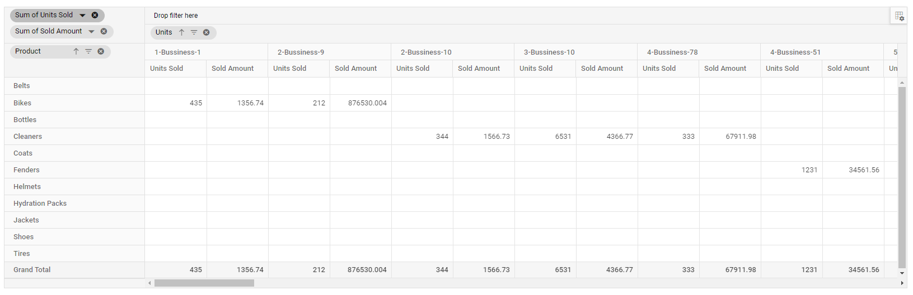

<!-- markdownlint-disable MD012 -->

# Sorting in Blazor Pivot Table Component

## Member Sorting

Allows to order field members in rows and columns either in ascending or descending order. By default, field members in rows and columns are in ascending order.

Member sorting can be enabled by setting the [`EnableSorting`](https://help.syncfusion.com/cr/blazor/Syncfusion.Blazor.PivotView.DataSourceSettingsModel-1.html#Syncfusion_Blazor_PivotView_DataSourceSettingsModel_1_EnableSorting) property in [`PivotViewDataSourceSettings`](https://help.syncfusion.com/cr/blazor/Syncfusion.Blazor.PivotView.PivotViewDataSourceSettings-1.html) class to **true**. After enabling this API, click the sort icon besides each field in row or column axis, available in field list or grouping bar UI for re-arranging members either in ascending or descending order.

> By default the [`EnableSorting`](https://help.syncfusion.com/cr/blazor/Syncfusion.Blazor.PivotView.DataSourceSettingsModel-1.html#Syncfusion_Blazor_PivotView_DataSourceSettingsModel_1_EnableSorting) property in [`PivotViewDataSourceSettings`](https://help.syncfusion.com/cr/blazor/Syncfusion.Blazor.PivotView.PivotViewDataSourceSettings-1.html) class set as **true**. If we set it as **false**, then the field members arrange in pivot table as its data source order. And, the sort icons in grouping bar and field list buttons will be removed.


<br/>

<br/>


Member sorting can also be configured using the [`PivotViewSortSettings`](https://help.syncfusion.com/cr/blazor/Syncfusion.Blazor.PivotView.PivotViewSortSetting.html) class through code behind, during initial rendering. The settings required to sort are:

* [`Name`](https://help.syncfusion.com/cr/blazor/Syncfusion.Blazor.PivotView.PivotViewSortSetting.html#Syncfusion_Blazor_PivotView_PivotViewSortSetting_Name): It allows to set the field name.
* [`Order`](https://help.syncfusion.com/cr/blazor/Syncfusion.Blazor.PivotView.PivotViewSortSetting.html#Syncfusion_Blazor_PivotView_PivotViewSortSetting_Order): It allows to set the sort direction either to ascending or descending of the respective field.

> By default the [`Order`](https://help.syncfusion.com/cr/blazor/Syncfusion.Blazor.PivotView.PivotViewSortSetting.html#Syncfusion_Blazor_PivotView_PivotViewSortSetting_Order) property in the [`PivotViewSortSettings`](https://help.syncfusion.com/cr/blazor/Syncfusion.Blazor.PivotView.PivotViewSortSetting.html) class set as [**Sorting.Ascending**](https://help.syncfusion.com/cr/blazor/Syncfusion.Blazor.PivotView.Sorting.html). Meanwhile, we can arrange the field members as its order in data source by setting it as [**Sorting.None**](https://help.syncfusion.com/cr/blazor/Syncfusion.Blazor.PivotView.Sorting.html) where the sort icons in grouping bar and field list buttons for the corresponding field will be removed.

```cshtml
@using Syncfusion.Blazor.PivotView

<SfPivotView TValue="ProductDetails" ShowGroupingBar="true">
     <PivotViewDataSourceSettings DataSource="@data" EnableSorting=true>
        <PivotViewColumns>
            <PivotViewColumn Name="Year"></PivotViewColumn>
            <PivotViewColumn Name="Quarter"></PivotViewColumn>
        </PivotViewColumns>
        <PivotViewRows>
            <PivotViewRow Name="Country"></PivotViewRow>
            <PivotViewRow Name="Products"></PivotViewRow>
        </PivotViewRows>
        <PivotViewValues>
            <PivotViewValue Name="Sold" Caption="Unit Sold"></PivotViewValue>
            <PivotViewValue Name="Amount" Caption="Sold Amount"></PivotViewValue>
        </PivotViewValues>
        <PivotViewFormatSettings>
            <PivotViewFormatSetting Name="Amount" Format="C"></PivotViewFormatSetting>
        </PivotViewFormatSettings>
        <PivotViewSortSettings>
            <PivotViewSortSetting Name="Country" Order=Sorting.Descending></PivotViewSortSetting>
        </PivotViewSortSettings>
    </PivotViewDataSourceSettings>
</SfPivotView>

@code{
    public List<ProductDetails> data { get; set; }
    protected override void OnInitialized()
    {
        this.data = ProductDetails.GetProductData().ToList();
        //Bind the data source collection here. Refer "Assigning sample data to the pivot table" section in getting started for more details.
    }
}

```


### Alphanumeric Sorting

Usually string sorting is applied to field members even if it starts with numbers. But this kind of field members can also be sorted on the basis of numbers that are placed at the beginning of the member name. This can be achieved by setting the [`DataType`](https://help.syncfusion.com/cr/blazor/Syncfusion.Blazor.PivotView.FieldOptionsModel.html#Syncfusion_Blazor_PivotView_FieldOptionsModel_DataType) property as number to the desired field.

```cshtml
@using Syncfusion.Blazor.PivotView

<SfPivotView ID="PivotView" TValue="AlphaNumericData" Width="100%" Height="600" ShowGroupingBar="true" ShowFieldList="true" ShowTooltip="false">
    <PivotViewDataSourceSettings DataSource="@pivotData" ExpandAll="false" AllowMemberFilter="true" EnableSorting=true>
        <PivotViewColumns>
            <PivotViewColumn Name="Units"></PivotViewColumn>
        </PivotViewColumns>
        <PivotViewRows>
            <PivotViewRow Name="Product"></PivotViewRow>
        </PivotViewRows>
        <PivotViewValues>
            <PivotViewValue Name="Sold" Caption="Units Sold"></PivotViewValue>
            <PivotViewValue Name="Amount" Caption="Sold Amount"></PivotViewValue>
        </PivotViewValues>
        <PivotViewFieldMapping>
            <PivotViewField Name="Units" DataType="number"></PivotViewField>
        </PivotViewFieldMapping>
    </PivotViewDataSourceSettings>
</SfPivotView>

@code{
    public List<AlphaNumericData> data { get; set; }
    protected override void OnInitialized()
    {
        this.data = AlphaNumericData.GetProductData().ToList();
        //Bind the data source collection here. Refer "Assigning sample data to the pivot table" section in getting started for more details.
    }
}

```



## Value sorting

> This property is applicable only for relational data source.

Allows to sort individual value field and its aggregated values either in row or column axis in both ascending and descending order. It can been enabled by setting the [`EnableValueSorting`](https://help.syncfusion.com/cr/blazor/Syncfusion.Blazor.PivotView.SfPivotView-1.html#Syncfusion_Blazor_PivotView_SfPivotView_1_EnableValueSorting) property in [`SfPivotView`](https://help.syncfusion.com/cr/blazor/Syncfusion.Blazor.PivotView.SfPivotView-1.html) class to **true**. On enabling, end user can sort the values by directly clicking the value field header positioned either in row or column axis of the pivot table component.

The value sorting can also be configured using the [`PivotViewValueSortSettings`](https://help.syncfusion.com/cr/blazor/Syncfusion.Blazor.PivotView.PivotViewValueSortSettings.html) option through code behind. The settings required to sort value fields are:

* [`HeaderText`](https://help.syncfusion.com/cr/blazor/Syncfusion.Blazor.PivotView.PivotViewValueSortSettings.html#Syncfusion_Blazor_PivotView_PivotViewValueSortSettings_HeaderText): It allows to set the header names with delimiters, that is used for value sorting. The header names are arranged from Level 1 to Level N, down the hierarchy with a delimiter for better specification.
* [`HeaderDelimiter`](https://help.syncfusion.com/cr/blazor/Syncfusion.Blazor.PivotView.PivotViewValueSortSettings.html#Syncfusion_Blazor_PivotView_PivotViewValueSortSettings_HeaderDelimiter): It allows to set the delimiters string to separate the header text between levels.
* [`SortOrder`](https://help.syncfusion.com/cr/blazor/Syncfusion.Blazor.PivotView.PivotViewValueSortSettings.html#Syncfusion_Blazor_PivotView_PivotViewValueSortSettings_SortOrder): It allows to set the sort direction of the value field.

> Value fields are set to the column axis by default. In such cases, the value sorting applied will have an effect on the column alone. You need to place the value fields in the row axis to do so in row wise. For more information, please [`refer here`](https://blazor.syncfusion.com/documentation/pivot-table/data-binding/#values-in-row-axis).

```cshtml
@using Syncfusion.Blazor.PivotView

<SfPivotView TValue="ProductDetails" EnableValueSorting="true">
     <PivotViewDataSourceSettings DataSource="@data">
        <PivotViewColumns>
            <PivotViewColumn Name="Year"></PivotViewColumn>
            <PivotViewColumn Name="Quarter"></PivotViewColumn>
        </PivotViewColumns>
        <PivotViewRows>
            <PivotViewRow Name="Country"></PivotViewRow>
            <PivotViewRow Name="Products"></PivotViewRow>
        </PivotViewRows>
        <PivotViewValues>
            <PivotViewValue Name="Sold" Caption="Unit Sold"></PivotViewValue>
            <PivotViewValue Name="Amount" Caption="Sold Amount"></PivotViewValue>
        </PivotViewValues>
        <PivotViewFormatSettings>
            <PivotViewFormatSetting Name="Amount" Format="C"></PivotViewFormatSetting>
        </PivotViewFormatSettings>
        <PivotViewValueSortSettings HeaderText="FY 2015##Sold Amount" HeaderDelimiter="##" SortOrder=Sorting.Descending></PivotViewValueSortSettings>
    </PivotViewDataSourceSettings>
</SfPivotView>

@code{
    public List<ProductDetails> data { get; set; }
    protected override void OnInitialized()
    {
        this.data = ProductDetails.GetProductData().ToList();
        //Bind the data source collection here. Refer "Assigning sample data to the pivot table" section in getting started for more details.
    }
}

```


> You can refer to our [Blazor Pivot Table](https://www.syncfusion.com/blazor-components/blazor-pivot-table) feature tour page for its groundbreaking feature representations. You can also explore our [Blazor Pivot Table example](https://blazor.syncfusion.com/demos/pivot-table/default-functionalities?theme=bootstrap4) to knows how to render and configure the pivot table.