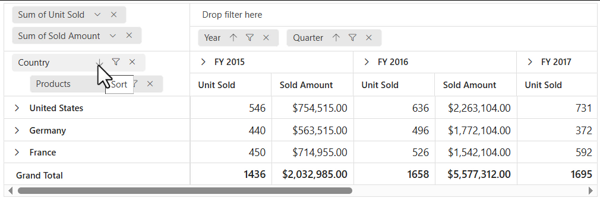
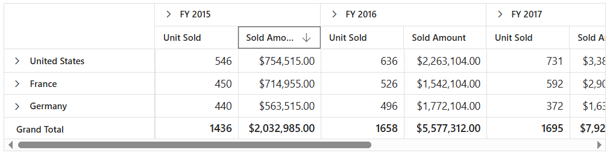

<!-- markdownlint-disable MD012 -->

# Sorting in Blazor Pivot Table Component

To have a quick glance on how to sort data in the Blazor Pivot Table, watch this video:



## Member Sorting

Allows to order field members in rows and columns either in ascending or descending order. By default, field members in rows and columns are in ascending order.

Member sorting can be enabled by setting the [EnableSorting](https://help.syncfusion.com/cr/blazor#Syncfusion_Blazor_PivotView_DataSourceSettingsModel_1_EnableSorting/Syncfusion.Blazor.html) property in [PivotViewDataSourceSettings](https://help.syncfusion.com/cr/blazor/Syncfusion.Blazor.PivotView.PivotViewDataSourceSettings-1.html) class to **true**. After enabling this API, click the sort icon besides each field in row or column axis, available in the field list or grouping bar UI for re-arranging members either in ascending or descending order.

N> By default the [EnableSorting](https://help.syncfusion.com/cr/blazor#Syncfusion_Blazor_PivotView_DataSourceSettingsModel_1_EnableSorting/Syncfusion.Blazor.html) property in [PivotViewDataSourceSettings](https://help.syncfusion.com/cr/blazor/Syncfusion.Blazor.PivotView.PivotViewDataSourceSettings-1.html) class set as **true**. If it is set as **false**, then the field members arrange in pivot table as its data source order. And, the sort icons in grouping bar and field list buttons will be removed.


<br/>

<br/>


Member sorting can also be configured using the [PivotViewSortSettings](https://help.syncfusion.com/cr/blazor/Syncfusion.Blazor.PivotView.PivotViewSortSetting.html) class through the code behind, during the initial rendering. The settings required to sort are:

* [Name](https://help.syncfusion.com/cr/blazor/Syncfusion.Blazor.PivotView.PivotViewSortSetting.html#Syncfusion_Blazor_PivotView_PivotViewSortSetting_Name): It allows to set the field name.
* [Order](https://help.syncfusion.com/cr/blazor/Syncfusion.Blazor.PivotView.PivotViewSortSetting.html#Syncfusion_Blazor_PivotView_PivotViewSortSetting_Order): It allows to set the sort direction either to ascending or descending of the respective field.

N> By default the [Order](https://help.syncfusion.com/cr/blazor/Syncfusion.Blazor.PivotView.PivotViewSortSetting.html#Syncfusion_Blazor_PivotView_PivotViewSortSetting_Order) property in the [PivotViewSortSettings](https://help.syncfusion.com/cr/blazor/Syncfusion.Blazor.PivotView.PivotViewSortSetting.html) class set as [Sorting.Ascending](https://help.syncfusion.com/cr/blazor/Syncfusion.Blazor.PivotView.Sorting.html). Meanwhile, the field members can arrange its order in data source by setting it as [Sorting.None](https://help.syncfusion.com/cr/blazor/Syncfusion.Blazor.PivotView.Sorting.html) where the sort icons in grouping bar and field list buttons for the corresponding field will be removed.

```cshtml
@using Syncfusion.Blazor.PivotView

<SfPivotView TValue="ProductDetails" ShowGroupingBar="true">
     <PivotViewDataSourceSettings DataSource="@data" EnableSorting=true>
        <PivotViewColumns>
            <PivotViewColumn Name="Year"></PivotViewColumn>
            <PivotViewColumn Name="Quarter"></PivotViewColumn>
        </PivotViewColumns>
        <PivotViewRows>
            <PivotViewRow Name="Country"></PivotViewRow>
            <PivotViewRow Name="Products"></PivotViewRow>
        </PivotViewRows>
        <PivotViewValues>
            <PivotViewValue Name="Sold" Caption="Unit Sold"></PivotViewValue>
            <PivotViewValue Name="Amount" Caption="Sold Amount"></PivotViewValue>
        </PivotViewValues>
        <PivotViewFormatSettings>
            <PivotViewFormatSetting Name="Amount" Format="C"></PivotViewFormatSetting>
        </PivotViewFormatSettings>
        <PivotViewSortSettings>
            <PivotViewSortSetting Name="Country" Order=Sorting.Descending></PivotViewSortSetting>
        </PivotViewSortSettings>
    </PivotViewDataSourceSettings>
</SfPivotView>

@code{
    public List<ProductDetails> data { get; set; }
    protected override void OnInitialized()
    {
        this.data = ProductDetails.GetProductData().ToList();
        //Bind the data source collection here. Refer "Assigning sample data to the pivot table" section in getting started for more details.
    }
}

```


### Alphanumeric Sorting

Usually string sorting is applied to field members even if it starts with numbers. But this kind of field members can also be sorted on the basis of the numbers that are placed at the beginning of the member name. This can be achieved by setting the [DataType](https://help.syncfusion.com/cr/blazor/Syncfusion.Blazor.PivotView.FieldOptionsModel.html#Syncfusion_Blazor_PivotView_FieldOptionsModel_DataType) property as number to the desired field.

```cshtml
@using Syncfusion.Blazor.PivotView

<SfPivotView ID="PivotView" TValue="AlphaNumericData" Width="100%" Height="600" ShowGroupingBar="true" ShowFieldList="true" ShowTooltip="false">
    <PivotViewDataSourceSettings DataSource="@pivotData" ExpandAll="false" AllowMemberFilter="true" EnableSorting=true>
        <PivotViewColumns>
            <PivotViewColumn Name="Units"></PivotViewColumn>
        </PivotViewColumns>
        <PivotViewRows>
            <PivotViewRow Name="Product"></PivotViewRow>
        </PivotViewRows>
        <PivotViewValues>
            <PivotViewValue Name="Sold" Caption="Units Sold"></PivotViewValue>
            <PivotViewValue Name="Amount" Caption="Sold Amount"></PivotViewValue>
        </PivotViewValues>
        <PivotViewFieldMapping>
            <PivotViewField Name="Units" DataType="number"></PivotViewField>
        </PivotViewFieldMapping>
    </PivotViewDataSourceSettings>
</SfPivotView>

@code{
    public List<AlphaNumericData> data { get; set; }
    protected override void OnInitialized()
    {
        this.data = AlphaNumericData.GetProductData().ToList();
        //Bind the data source collection here. Refer "Assigning sample data to the pivot table" section in getting started for more details.
    }
}

```


## Value sorting

N> This property is applicable only for relational data source.

Allows to sort individual value field and its aggregated values either in row or column axis in both ascending and descending order. It can be enabled by setting the [EnableValueSorting](https://help.syncfusion.com/cr/blazor/Syncfusion.Blazor.PivotView.SfPivotView-1.html#Syncfusion_Blazor_PivotView_SfPivotView_1_EnableValueSorting) property in [SfPivotView](https://help.syncfusion.com/cr/blazor/Syncfusion.Blazor.PivotView.SfPivotView-1.html) class to **true**. On enabling, the end user can sort the values by directly clicking the value field header positioned either in row or column axis of the pivot table component.

The value sorting can also be configured using the [PivotViewValueSortSettings](https://help.syncfusion.com/cr/blazor/Syncfusion.Blazor.PivotView.PivotViewValueSortSettings.html) option through the code behind. The settings required to sort value fields are:

* [HeaderText](https://help.syncfusion.com/cr/blazor/Syncfusion.Blazor.PivotView.PivotViewValueSortSettings.html#Syncfusion_Blazor_PivotView_PivotViewValueSortSettings_HeaderText): It allows to set the header names with delimiters, that is used for value sorting. The header names are arranged from Level 1 to Level N, down the hierarchy with a delimiter for better specification.
* [HeaderDelimiter](https://help.syncfusion.com/cr/blazor/Syncfusion.Blazor.PivotView.PivotViewValueSortSettings.html#Syncfusion_Blazor_PivotView_PivotViewValueSortSettings_HeaderDelimiter): It allows to set the delimiters string to separate the header text between levels.
* [SortOrder](https://help.syncfusion.com/cr/blazor/Syncfusion.Blazor.PivotView.PivotViewValueSortSettings.html#Syncfusion_Blazor_PivotView_PivotViewValueSortSettings_SortOrder): It allows to set the sort direction of the value field.

N> Value fields are set to the column axis by default. In such cases, the value sorting applied will have an effect on the column alone. You need to place the value fields in the row axis to do so in row wise. For more information, [refer here](https://blazor.syncfusion.com/documentation/pivot-table/data-binding/#values-in-row-axis).

```cshtml
@using Syncfusion.Blazor.PivotView

<SfPivotView TValue="ProductDetails" EnableValueSorting="true">
     <PivotViewDataSourceSettings DataSource="@data">
        <PivotViewColumns>
            <PivotViewColumn Name="Year"></PivotViewColumn>
            <PivotViewColumn Name="Quarter"></PivotViewColumn>
        </PivotViewColumns>
        <PivotViewRows>
            <PivotViewRow Name="Country"></PivotViewRow>
            <PivotViewRow Name="Products"></PivotViewRow>
        </PivotViewRows>
        <PivotViewValues>
            <PivotViewValue Name="Sold" Caption="Unit Sold"></PivotViewValue>
            <PivotViewValue Name="Amount" Caption="Sold Amount"></PivotViewValue>
        </PivotViewValues>
        <PivotViewFormatSettings>
            <PivotViewFormatSetting Name="Amount" Format="C"></PivotViewFormatSetting>
        </PivotViewFormatSettings>
        <PivotViewValueSortSettings HeaderText="FY 2015##Sold Amount" HeaderDelimiter="##" SortOrder=Sorting.Descending></PivotViewValueSortSettings>
    </PivotViewDataSourceSettings>
</SfPivotView>

@code{
    public List<ProductDetails> data { get; set; }
    protected override void OnInitialized()
    {
        this.data = ProductDetails.GetProductData().ToList();
        //Bind the data source collection here. Refer "Assigning sample data to the pivot table" section in getting started for more details.
    }
}

```



## Events
### OnActionBegin

The event [OnActionBegin](https://help.syncfusion.com/cr/blazor/Syncfusion.Blazor.PivotView.PivotViewEvents-1.html#Syncfusion_Blazor_PivotView_PivotViewEvents_1_OnActionBegin) triggers when clicking the value sort icon or the sort icon in the field button, which is present in both grouping bar and field list UI. This allows user to identify the current action being performed at runtime. It has the following parameters:

* [DataSourceSettings](https://help.syncfusion.com/cr/blazor/Syncfusion.Blazor.PivotView.PivotActionBeginEventArgs.html#Syncfusion_Blazor_PivotView_PivotActionBeginEventArgs_DataSourceSettings) : It holds the current data source settings such as input data source, rows, columns, values, filters, format settings and so on.

* [ActionName](https://help.syncfusion.com/cr/blazor/Syncfusion.Blazor.PivotView.PivotActionBeginEventArgs.html#Syncfusion_Blazor_PivotView_PivotActionBeginEventArgs_ActionName): It holds the name of the current action began. The following are the UI actions and their names:

| Action | Action Name|
|----------------|-------------|
| [Sort field](./sorting/#member-sorting)| Sort field |
| [Value sort icon](./sorting/#value-sorting)| Sort value|

* [FieldInfo](https://help.syncfusion.com/cr/blazor/Syncfusion.Blazor.PivotView.PivotActionBeginEventArgs.html#Syncfusion_Blazor_PivotView_PivotActionBeginEventArgs_FieldInfo): It holds the selected field information.

N> This option is applicable only when the field based UI actions are performed such as filtering, sorting, removing field from grouping bar, editing and aggregation type change.

* [Cancel](https://help.syncfusion.com/cr/blazor/Syncfusion.Blazor.PivotView.PivotActionBeginEventArgs.html#Syncfusion_Blazor_PivotView_PivotActionBeginEventArgs_Cancel): It allows user to restrict the current action.

In the following example, sort action can be restricted by setting the **args.Cancel** option to **true** in the `OnActionBegin` event.

```cshtml
@using Syncfusion.Blazor.PivotView

<SfPivotView TValue="ProductDetails" ShowFieldList="true" ShowGroupingBar="true">
     <PivotViewDataSourceSettings DataSource="@data">
        <PivotViewColumns>
            <PivotViewColumn Name="Year"></PivotViewColumn>
            <PivotViewColumn Name="Quarter"></PivotViewColumn>
        </PivotViewColumns>
        <PivotViewRows>
            <PivotViewRow Name="Country"></PivotViewRow>
            <PivotViewRow Name="Products"></PivotViewRow>
        </PivotViewRows>
        <PivotViewValues>
            <PivotViewValue Name="Sold" Caption="Unit Sold"></PivotViewValue>
            <PivotViewValue Name="Amount" Caption="Sold Amount"></PivotViewValue>
        </PivotViewValues>
        <PivotViewFormatSettings>
            <PivotViewFormatSetting Name="Amount" Format="C"></PivotViewFormatSetting>
        </PivotViewFormatSettings>
    </PivotViewDataSourceSettings>    
   <PivotViewEvents TValue="PivotProductDetails" OnActionBegin="ActionBegin"></PivotViewEvents>
</SfPivotView>

@code{
    private List<ProductDetails> data { get; set; }
    protected override void OnInitialized()
    {
        data = ProductDetails.GetProductData().ToList();
        //Bind the data source collection here. Refer "Assigning sample data to the pivot table" section in getting started for more details.
    }

    // Triggers when the UI action begins.
    public void ActionBegin(PivotActionBeginEventArgs args)
    {
        if(args.ActionName == "Sort field" || args.ActionName == "Sort value")
        {
          args.Cancel = true;
        }       
    }

}
```
### OnActionComplete

The event [OnActionComplete](https://help.syncfusion.com/cr/blazor/Syncfusion.Blazor.PivotView.PivotViewEvents-1.html#Syncfusion_Blazor_PivotView_PivotViewEvents_1_OnActionComplete) triggers when the UI actions such as value sorting or sorting via the field button, which is present in both grouping bar and field list UI, is completed. This allows user to identify the current UI action being completed at runtime. It has the following parameters:

* [DataSourceSettings](https://help.syncfusion.com/cr/blazor/Syncfusion.Blazor.PivotView.PivotActionCompleteEventArgs-1.html#Syncfusion_Blazor_PivotView_PivotActionCompleteEventArgs_1_DataSourceSettings): It holds the current data source settings such as input data source, rows, columns, values, filters, format settings and so on.

* [ActionName](https://help.syncfusion.com/cr/blazor/Syncfusion.Blazor.PivotView.PivotActionCompleteEventArgs-1.html#Syncfusion_Blazor_PivotView_PivotActionCompleteEventArgs_1_ActionName): It holds the name of the current action completed. The following are the UI actions and their names:

| Action | Action Name|
|----------------|-------------|
| [`Sort field`](./sorting/#member-sorting)| Field sorted|
| [`Value sort icon`](./sorting/#value-sorting)| Value sorted|

* [FieldInfo](https://help.syncfusion.com/cr/blazor/Syncfusion.Blazor.PivotView.PivotActionCompleteEventArgs-1.html#Syncfusion_Blazor_PivotView_PivotActionCompleteEventArgs_1_FieldInfo): It holds the selected field information.

N> This option is applicable only when the field based UI actions are performed such as filtering, sorting, removing field from grouping bar, editing and aggregation type change.

* [ActionInfo](https://help.syncfusion.com/cr/blazor/Syncfusion.Blazor.PivotView.PivotActionCompleteEventArgs-1.html#Syncfusion_Blazor_PivotView_PivotActionCompleteEventArgs_1_ActionInfo):  It holds the unique information about the current UI action. For example, if sorting is completed, the event argument contains information such as sort order and the field name.

```cshtml
@using Syncfusion.Blazor.PivotView

<SfPivotView TValue="ProductDetails" ShowFieldList="true" ShowGroupingBar="true">
     <PivotViewDataSourceSettings DataSource="@data">
        <PivotViewColumns>
            <PivotViewColumn Name="Year"></PivotViewColumn>
            <PivotViewColumn Name="Quarter"></PivotViewColumn>
        </PivotViewColumns>
        <PivotViewRows>
            <PivotViewRow Name="Country"></PivotViewRow>
            <PivotViewRow Name="Products"></PivotViewRow>
        </PivotViewRows>
        <PivotViewValues>
            <PivotViewValue Name="Sold" Caption="Unit Sold"></PivotViewValue>
            <PivotViewValue Name="Amount" Caption="Sold Amount"></PivotViewValue>
        </PivotViewValues>
        <PivotViewFormatSettings>
            <PivotViewFormatSetting Name="Amount" Format="C"></PivotViewFormatSetting>
        </PivotViewFormatSettings>
    </PivotViewDataSourceSettings>    
   <PivotViewEvents TValue="PivotProductDetails" OnActionComplete="ActionComplete"></PivotViewEvents>
</SfPivotView>

@code{
    private List<ProductDetails> data { get; set; }
    protected override void OnInitialized()
    {
        data = ProductDetails.GetProductData().ToList();
        //Bind the data source collection here. Refer "Assigning sample data to the pivot table" section in getting started for more details.
    }

    // Triggers when the UI action is completed.
    public void ActionComplete(PivotActionCompleteEventArgs<ProductDetails> args)
    {
        if(args.ActionName == "Field sorted" || args.ActionName == "Value sorted")
        {
          // Triggers when the sort action is completed.
        }       
    }

}
```
### OnActionFailure

The event [OnActionFailure](https://help.syncfusion.com/cr/blazor/Syncfusion.Blazor.PivotView.PivotViewEvents-1.html#Syncfusion_Blazor_PivotView_PivotViewEvents_1_OnActionFailure) triggers when the current UI action fails to achieve the desired result. It has the following parameters:

* [ActionName](https://help.syncfusion.com/cr/blazor/Syncfusion.Blazor.PivotView.PivotActionFailureEventArgs.html#Syncfusion_Blazor_PivotView_PivotActionFailureEventArgs_ActionName): It holds the name of the current action failed. The following are the UI actions and their names:

| Action | Action Name|
|----------------|-------------|
| [`Sort field`](./sorting/#member-sorting)| Sort field |
| [`Value sort icon`](./sorting/#value-sorting)| Sort value|

* [ErrorInfo](https://help.syncfusion.com/cr/blazor/Syncfusion.Blazor.PivotView.PivotActionFailureEventArgs.html#Syncfusion_Blazor_PivotView_PivotActionFailureEventArgs_ErrorInfo): It holds the error information of the current UI action.

```cshtml
@using Syncfusion.Blazor.PivotView

<SfPivotView TValue="ProductDetails" AllowExcelExport="true" AllowPdfExport="true" Width="100%"  ShowToolbar="true" Toolbar="@toolbar" ShowGroupingBar="true" AllowCalculatedField="true"  AllowDrillThrough="true" AllowConditionalFormatting="true" AllowNumberFormatting="true" ShowFieldList="true" Height="350">
     <PivotViewDataSourceSettings DataSource="@data">
        <PivotViewColumns>
            <PivotViewColumn Name="Year"></PivotViewColumn>
            <PivotViewColumn Name="Quarter"></PivotViewColumn>
        </PivotViewColumns>
        <PivotViewRows>
            <PivotViewRow Name="Country"></PivotViewRow>
            <PivotViewRow Name="Products"></PivotViewRow>
        </PivotViewRows>
        <PivotViewValues>
            <PivotViewValue Name="Sold" Caption="Unit Sold"></PivotViewValue>
            <PivotViewValue Name="Amount" Caption="Sold Amount"></PivotViewValue>
        </PivotViewValues>
        <PivotViewFormatSettings>
            <PivotViewFormatSetting Name="Amount" Format="C"></PivotViewFormatSetting>
        </PivotViewFormatSettings>
    </PivotViewDataSourceSettings>    
   <PivotViewEvents TValue="ProductDetails" OnActionFailure="ActionFailure"></PivotViewEvents>
</SfPivotView>

@code{
    private List<ProductDetails> data { get; set; }
    private List<Syncfusion.Blazor.PivotView.ToolbarItems> toolbar = new List<Syncfusion.Blazor.PivotView.ToolbarItems> {
        ToolbarItems.New,
        ToolbarItems.Save,
        ToolbarItems.Grid,
        ToolbarItems.Chart,
        ToolbarItems.Export,
        ToolbarItems.SubTotal,
        ToolbarItems.GrandTotal,
        ToolbarItems.ConditionalFormatting,
        ToolbarItems.NumberFormatting,
        ToolbarItems.FieldList            
    };
    protected override void OnInitialized()
    {
        data = ProductDetails.GetProductData().ToList();
        //Bind the data source collection here. Refer "Assigning sample data to the pivot table" section in getting started for more details.
    }
    public void ActionFailure(PivotActionFailureEventArgs args)
    {
        if(args.ActionName == "Sort field" || args.ActionName == "Sort value")
        {
          // Triggers when the current UI action fails to achieve the desired result.
        }       
    }
}
```

N> You can refer to the [Blazor Pivot Table](https://www.syncfusion.com/blazor-components/blazor-pivot-table) feature tour page for its groundbreaking feature representations. You can also explore the [Blazor Pivot Table example](https://blazor.syncfusion.com/demos/pivot-table/default-functionalities?theme=bootstrap5) to know how to render and configure the pivot table.