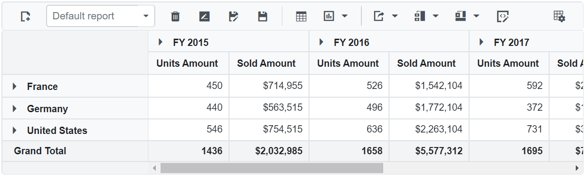
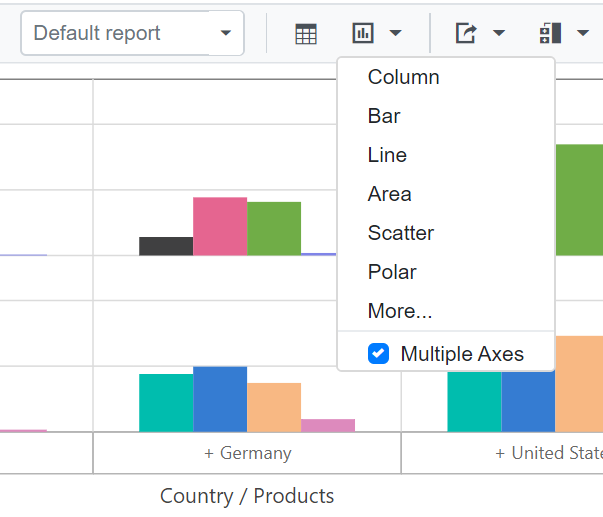
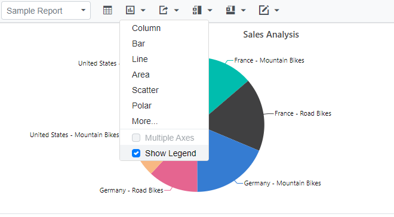
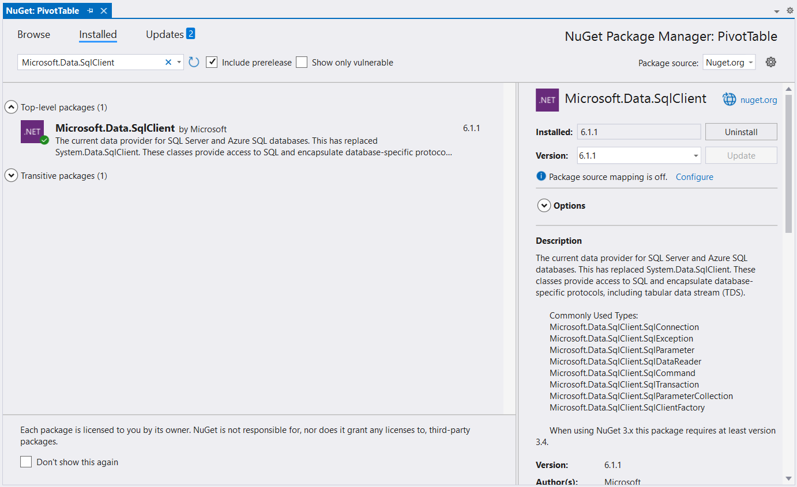
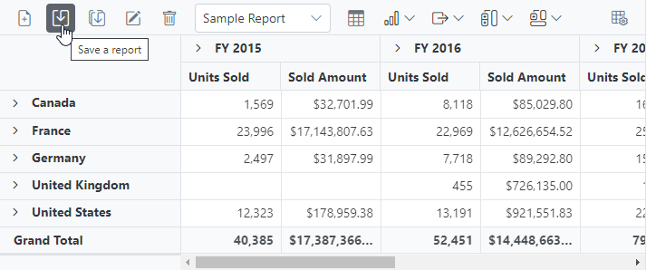
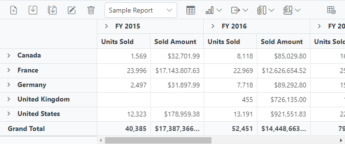
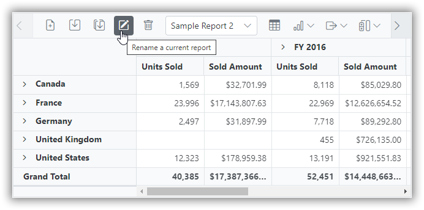
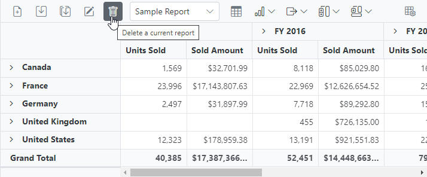
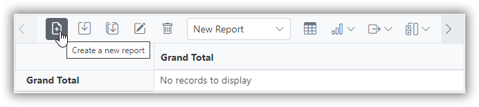
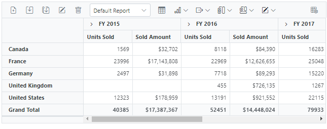

# Toolbar in Blazor Pivot Table Component

Toolbar option allows to access the frequently used features like switching between pivot table and pivot chart, changing chart types, conditional formatting, exporting, etc. with ease at runtime. This option can be enabled by setting the [ShowToolbar](https://help.syncfusion.com/cr/blazor/Syncfusion.Blazor.PivotView.SfPivotView-1.html#Syncfusion_Blazor_PivotView_SfPivotView_1_ShowToolbar) property in [SfPivotView](https://help.syncfusion.com/cr/blazor/Syncfusion.Blazor.PivotView.SfPivotView-1.html) class to **true**. The [Toolbar](https://help.syncfusion.com/cr/blazor/Syncfusion.Blazor.PivotView.SfPivotView-1.html#Syncfusion_Blazor_PivotView_SfPivotView_1_Toolbar) property in [SfPivotView](https://help.syncfusion.com/cr/blazor/Syncfusion.Blazor.PivotView.SfPivotView-1.html) class accepts the collection of built-in toolbar options.

To have a quick glance on how to add and customize toolbar in the Blazor Pivot Table, watch this video:



## Built-in Toolbar Options

The following table shows built-in toolbar options and its actions.

| Built-in Toolbar Options | Actions |
|------------------------|---------|
| New | Creates a new report |
| Save | Saves the current report |
| Save As | Save as current report |
| Rename | Renames the current report |
| Delete | Deletes the current report |
| Load | Loads any report from the report list |
| Grid | Shows pivot table |
| Chart | Shows a chart in any type from the built-in list and option to enable/disable multiple axes |
| Exporting | Exports the pivot table as PDF/Excel/CSV and the pivot chart as PDF and image |
| Sub-total | Shows or hides sub totals |
| Grand Total | Shows or hides grand totals |
| Conditional Formatting | Shows the conditional formatting pop-up to apply formatting |
| Number Formatting | Shows the number formatting pop-up to apply number formatting |
| Field List | Shows the fieldlist pop-up |
| MDX | Shows the MDX query that was run to retrieve data from the OLAP data source. **NOTE: This applies only to the OLAP data source.** |

N> The order of toolbar options can be changed by simply moving the position of items in the [ToolbarItems](https://help.syncfusion.com/cr/blazor/Syncfusion.Blazor.PivotView.ToolbarItems.html) collection. Also if end user wants to remove any toolbar option from getting displayed, it can be simply ignored from adding into the [ToolbarItems](https://help.syncfusion.com/cr/blazor/Syncfusion.Blazor.PivotView.ToolbarItems.html) collection.

```cshtml
@using Syncfusion.Blazor.PivotView

<SfPivotView TValue="ProductDetails" @ref="pivot" ShowFieldList="true" ShowToolbar="true" Toolbar="@toolbar" AllowConditionalFormatting="true" AllowPdfExport="true" AllowExcelExport="true">
    <PivotViewDisplayOption Primary=Primary.Table View=View.Both></PivotViewDisplayOption>
        <PivotViewDataSourceSettings DataSource="@data" ShowGrandTotals="true" ShowSubTotals="true">
            <PivotViewColumns>
                <PivotViewColumn Name="Year"></PivotViewColumn>
                <PivotViewColumn Name="Quarter"></PivotViewColumn>
            </PivotViewColumns>
            <PivotViewRows>
                <PivotViewRow Name="Country"></PivotViewRow>
                <PivotViewRow Name="Products"></PivotViewRow>
            </PivotViewRows>
            <PivotViewValues>
                <PivotViewValue Name="Sold" Caption="Units Sold"></PivotViewValue>
                <PivotViewValue Name="Amount" Caption="Sold Amount"></PivotViewValue>
            </PivotViewValues>
            <PivotViewFormatSettings>
                <PivotViewFormatSetting Name="Amount" Format="C"></PivotViewFormatSetting>
            </PivotViewFormatSettings>
        </PivotViewDataSourceSettings>
        <PivotViewEvents TValue="ProductDetails" RenameReport="renamereport" RemoveReport="removereport" SaveReport="savereport" LoadReport="loadreport" FetchReport="fetchreport" ></PivotViewEvents>
        <PivotViewGridSettings ColumnWidth="140"></PivotViewGridSettings>
</SfPivotView>

@code{
    SfPivotView<ProductDetails> pivot;
    public List<ToolbarItems> toolbar = new List<ToolbarItems> {
        ToolbarItems.New,
        ToolbarItems.Load,
        ToolbarItems.Remove,
        ToolbarItems.Rename,
        ToolbarItems.SaveAs,
        ToolbarItems.Save,
        ToolbarItems.Grid,
        ToolbarItems.Chart,
        ToolbarItems.Export,
        ToolbarItems.SubTotal,
        ToolbarItems.GrandTotal,
        ToolbarItems.ConditionalFormatting,
        ToolbarItems.FieldList
    };
    public List<ProductDetails> data { get; set; }
    protected override void OnInitialized()
    {
        this.data = ProductDetails.GetProductData().ToList();
        //Bind the data source collection here. Refer "Assigning sample data to the pivot table" section in getting started for more details.
    }
    public List<string> report = new List<string>();
    public List<string> reportName = new List<string>();
    //to save report
    public void savereport(SaveReportArgs args)
    {
        var i = 0;
        bool isSaved = false;
        for (i = 0; i < this.reportName.Count; i++)
        {
            if (this.reportName[i] == args.ReportName)
            {
                this.report[i] = args.Report;
                isSaved = true;
            }
        }
        if (args.Report != null && !(isSaved))
        {
            this.report.Add(args.Report);
            this.reportName.Add(args.ReportName);
        }

    }
    //fetch reports
    public void fetchreport(FetchReportArgs args)
    {
        args.ReportName = this.reportName.ToArray();

    }
    //to load the selected report
    public void loadreport(LoadReportArgs args)
    {
        var i = 0;
        var j = 0;
        for (i = 0; i < this.reportName.Count; i++)
        {
            if (this.reportName[i] == args.ReportName)
            {
                j = i;
            }
        }
        this.pivot.LoadPersistDataAsync(this.report[j]);
    }
    //to delete a report
    public void removereport(RemoveReportArgs args)
    {
        var i = 0;
        for( i=0;i<this.reportName.Count; i++)
        {
            if(this.reportName[i] == args.ReportName)
            {
                this.reportName.RemoveAt(i);
                this.report.RemoveAt(i);
            }
        }
    }
    // to rename a report
    public void renamereport(RenameReportArgs args)
    {
        var i = 0;
        for( i=0;i<=(this.reportName.Count - 1); i++)
        {
            if(this.reportName[i] == args.ReportName)
            {
                this.reportName.RemoveAt(i);
                this.reportName.Add(args.Rename);
            }
        }
    }
}

```



## Show desired chart types in the dropdown menu

By default, all the chart types are displayed in the dropdown menu included in the toolbar. However, based on the request for an application, it is required to show selective chart types on own. This can be achieved using the [ChartTypes](https://help.syncfusion.com/cr/blazor/Syncfusion.Blazor.PivotView.SfPivotView-1.html#Syncfusion_Blazor_PivotView_SfPivotView_1_ChartTypes) property. To know more about supporting chart types, [click here](https://blazor.syncfusion.com/documentation/pivot-table/pivot-chart#chart-types).

```cshtml
@using Syncfusion.Blazor.PivotView

<SfPivotView TValue="ProductDetails" ShowToolbar="true" Toolbar="@toolbar" ChartTypes="@chartTypes">
    <PivotViewDisplayOption Primary=Primary.Table View=View.Both></PivotViewDisplayOption>
        <PivotViewDataSourceSettings DataSource="@data">
            <PivotViewColumns>
                <PivotViewColumn Name="Year"></PivotViewColumn>
                <PivotViewColumn Name="Quarter"></PivotViewColumn>
            </PivotViewColumns>
            <PivotViewRows>
                <PivotViewRow Name="Country"></PivotViewRow>
                <PivotViewRow Name="Products"></PivotViewRow>
            </PivotViewRows>
            <PivotViewValues>
                <PivotViewValue Name="Sold" Caption="Units Sold"></PivotViewValue>
                <PivotViewValue Name="Amount" Caption="Sold Amount"></PivotViewValue>
            </PivotViewValues>
            <PivotViewFormatSettings>
                <PivotViewFormatSetting Name="Amount" Format="C"></PivotViewFormatSetting>
            </PivotViewFormatSettings>
        </PivotViewDataSourceSettings>
        <PivotViewGridSettings ColumnWidth="140"></PivotViewGridSettings>
</SfPivotView>

@code{
    public List<ToolbarItems> toolbar = new List<ToolbarItems> {
        ToolbarItems.Grid,
        ToolbarItems.Chart,
    };
    public List<ChartSeriesType> chartTypes = new List <ChartSeriesType> {
        ChartSeriesType.Column,
        ChartSeriesType.Bar,
        ChartSeriesType.Line,
        ChartSeriesType.Area,
    };
    public List<ProductDetails> data { get; set; }
    protected override void OnInitialized()
    {
        this.data = ProductDetails.GetProductData().ToList();
        //Bind the data source collection here. Refer "Assigning sample data to the pivot table" section in getting started for more details.
    }
}

```


## Switch the chart to multiple axes

In the chart, the user can switch from single axis to multiple axes with the help of the built-in checkbox available inside the chart type dropdown menu in the toolbar. For more information [refer here](https://blazor.syncfusion.com/documentation/pivot-table/pivot-chart#multi-axis).



## Show or hide legend

In the chart, legend can be shown or hidden dynamically with the help of the built-in option available in the chart type drop-down menu.
N> By default, the legend will not be visible for the accumulation chart types like pie, doughnut, pyramid, and funnel. Users can enable or disable using the built-in checkbox option.



## Save and load reports to a SQL database

SQL Server is a relational database management system (RDBMS) that can be used to store and manage large amounts of data. In this topic, we will see how to save, save as, rename, load, delete, and add reports between a SQL Server database and a Blazor Pivot Table at runtime.

### Connecting a SQL Server database in a Blazor application

**1.** Create a simple Blazor Pivot Table by following the **"Getting Started"** documentation [link](./getting-started).

**2.** To connect a SQL Server database using the Microsoft SqlClient in our application, we need to install the [Microsoft.Data.SqlClient](https://www.nuget.org/packages/Microsoft.Data.SqlClient) NuGet package. To do so, open the NuGet package manager of the project solution, search for the package **Microsoft.Data.SqlClient** and install it.



**3.** Next, in the **Index.razor** page, the **OpenConnection** method is used to connect to the SQL database. The **GetDataTable** method then processes the specified SQL query string, retrieves data from the database, and converts it into a **DataTable** using **SqlCommand** and **SqlDataAdapter**. This **DataTable** can be used to retrieve saved reports and modify them further as shown in the code block below.

```cshtml
@using System.Data
@using Microsoft.Data.SqlClient;
@using EFPivotTable.Data;

<SfPivotView @ref=PivotRef TValue="ProductDetails" ID="pivot-table" Height="450" Width="700" ShowToolbar="true" ShowFieldList=true AllowExcelExport=true AllowPdfExport=true Toolbar="@PivotToolbar">
    //Bind the report here...
    <PivotViewEvents TValue="ProductDetails" SaveReport="SaveReport" LoadReport="LoadReport" RenameReport="RenameReport" RemoveReport="RemoveReport" FetchReport="FetchReport"></PivotViewEvents>
</SfPivotView>

@code {
    SfPivotView<ProductDetails> PivotRef { get; set; }

    public List<ProductDetails> DataSource { get; set; }
    public List<ToolbarItems> PivotToolbar = new List<ToolbarItems> {
        ToolbarItems.New,
        ToolbarItems.Save,
        ToolbarItems.SaveAs,
        ToolbarItems.Rename,
        ToolbarItems.Remove,
        ToolbarItems.Load,
        ToolbarItems.Grid,
        ToolbarItems.Chart,
        ToolbarItems.Export,
        ToolbarItems.SubTotal,
        ToolbarItems.GrandTotal,
        ToolbarItems.FieldList
    };
    protected override void OnInitialized()
    {
        this.DataSource = ProductDetails.GetProductData().ToList();
    }

    public void SaveReport(SaveReportArgs args)
    {
        SaveReportToDB(args.ReportName, args.Report);
    }

    public void FetchReport(FetchReportArgs args)
    {
        args.ReportName = FetchReportListFromDB().ToArray();
    }

    public async Task LoadReport(LoadReportArgs args)
    {
        await this.PivotRef.LoadPersistDataAsync(LoadReportFromDB(args.ReportName).ToString());
    }

    public void RemoveReport(RemoveReportArgs args)
    {
        RemoveReportFromDB(args.ReportName);
    }
    
    public void RenameReport(RenameReportArgs args)
    {
        RenameReportInDB(args.ReportName, args.Rename, args.IsReportExists);
    }

    public void SaveReportToDB(string reportName, string report)
    {
        SqlConnection sqlConn = OpenConnection();
        bool isDuplicate = true;
        SqlCommand cmd1 = null;
        foreach (DataRow row in GetDataTable(sqlConn).Rows)
        {
            if ((row["ReportName"] as string).Equals(reportName))
            {
                isDuplicate = false;
                cmd1 = new SqlCommand("UPDATE ReportTable set Report=@Report where ReportName like @ReportName", sqlConn);
            }
        }
        if (isDuplicate)
        {
            cmd1 = new SqlCommand("INSERT into ReportTable (ReportName,Report) Values(@ReportName,@Report)", sqlConn);
        }
        cmd1.Parameters.AddWithValue("@ReportName", reportName);
        cmd1.Parameters.AddWithValue("@Report", report.ToString());
        cmd1.ExecuteNonQuery();
        sqlConn.Close();
    }
    public object LoadReportFromDB(string reportName)
    {
        SqlConnection sqlConn = OpenConnection();
        string report = string.Empty;
        foreach (DataRow row in GetDataTable(sqlConn).Rows)
        {
            if ((row["ReportName"] as string).Equals(reportName))
            {
                report = (string)row["Report"];
                break;
            }
        }
        sqlConn.Close();
        return report;
    }
    public List<string> FetchReportListFromDB()
    {
        SqlConnection sqlConn = OpenConnection();
        List<string> reportNames = new List<string>();
        foreach (DataRow row in GetDataTable(sqlConn).Rows)
        {
            if (!string.IsNullOrEmpty(row["ReportName"] as string))
            {
                reportNames.Add(row["ReportName"].ToString());
            }
        }
        sqlConn.Close();
        return reportNames;
    }
    public void RenameReportInDB(string reportName, string renameReport, bool isReportExists)
    {
        SqlConnection sqlConn = OpenConnection();
        SqlCommand cmd1 = null;
        if (isReportExists)
        {
            foreach (DataRow row in GetDataTable(sqlConn).Rows)
            {
                if ((row["ReportName"] as string).Equals(renameReport))
                {
                    cmd1 = new SqlCommand("DELETE FROM ReportTable WHERE ReportName LIKE '%" + renameReport + "%'", sqlConn);
                    break;
                }
            }
            cmd1.ExecuteNonQuery();
        }
        foreach (DataRow row in GetDataTable(sqlConn).Rows)
        {
            if ((row["ReportName"] as string).Equals(reportName))
            {
                cmd1 = new SqlCommand("UPDATE ReportTable set ReportName=@RenameReport where ReportName like '%" + reportName + "%'", sqlConn);
                break;
            }
        }
        cmd1.Parameters.AddWithValue("@RenameReport", renameReport);
        cmd1.ExecuteNonQuery();
        sqlConn.Close();
    }
    public void RemoveReportFromDB(string reportName)
    {
        SqlConnection sqlConn = OpenConnection();
        SqlCommand cmd1 = null;
        foreach (DataRow row in GetDataTable(sqlConn).Rows)
        {
            if ((row["ReportName"] as string).Equals(reportName))
            {
                cmd1 = new SqlCommand("DELETE FROM ReportTable WHERE ReportName LIKE '%" + reportName + "%'", sqlConn);
                break;
            }
        }
        cmd1.ExecuteNonQuery();
        sqlConn.Close();
    }
    private SqlConnection OpenConnection()
    {
        // Replace with your own connection string.
        string connectionString = @"<Enter your valid connection string here>";
        SqlConnection sqlConn = new SqlConnection(connectionString);
        sqlConn.Open();
        return sqlConn;
    }

    private DataTable GetDataTable(SqlConnection sqlConn)
    {
        string xquery = "SELECT * FROM ReportTable";
        SqlCommand cmd = new SqlCommand(xquery, sqlConn);
        SqlDataAdapter da = new SqlDataAdapter(cmd);
        DataTable dt = new DataTable();
        da.Fill(dt);
        return dt;
    }
}

```

Further, let us explore more on how to save, load, rename, delete, and add reports in the SQL database using **SqlConnection**.

#### Saving a report

When you select the **"Save a report"** option from the toolbar, the [SaveReport](#savereport) event is triggered. In this event, **SaveReportToDB** method is called passing the name of the current report and the current report, which you can use to check and save in the SQL database.

For example, the report shown in the following code snippet will be passed to the **SaveReportToDB** method along with the report name **"Sample Report"** and saved in the SQL database.

```cshtml
@using System.Data
@using Microsoft.Data.SqlClient;
@using EFPivotTable.Data;

<SfPivotView @ref=PivotRef TValue="ProductDetails" ID="pivot-table" Height="450" Width="700" ShowToolbar="true" ShowFieldList=true AllowExcelExport=true AllowPdfExport=true Toolbar="@PivotToolbar">
    <PivotViewDisplayOption View="View.Both"></PivotViewDisplayOption>
    <PivotViewDataSourceSettings DataSource="@DataSource" EnableSorting="true">
        <PivotViewColumns>
            <PivotViewColumn Name="Year"></PivotViewColumn>
            <PivotViewColumn Name="Quarter"></PivotViewColumn>
        </PivotViewColumns>
        <PivotViewRows>
            <PivotViewRow Name="Country"></PivotViewRow>
            <PivotViewRow Name="Products"></PivotViewRow>
        </PivotViewRows>
        <PivotViewValues>
            <PivotViewValue Name="Sold" Caption="Units Sold"></PivotViewValue>
            <PivotViewValue Name="Amount" Caption="Sold Amount"></PivotViewValue>
        </PivotViewValues>
        <PivotViewFormatSettings>
            <PivotViewFormatSetting Name="Amount" Format="C"></PivotViewFormatSetting>
            <PivotViewFormatSetting Name="Sold" Format="N0"></PivotViewFormatSetting>
        </PivotViewFormatSettings>
    </PivotViewDataSourceSettings>
    <PivotViewEvents TValue="ProductDetails" SaveReport="SaveReport"></PivotViewEvents>
</SfPivotView>

@code {
    SfPivotView<ProductDetails> PivotRef { get; set; }

    public List<ProductDetails> DataSource { get; set; }
    public List<ToolbarItems> PivotToolbar = new List<ToolbarItems> {
        ToolbarItems.New,
        ToolbarItems.Save,
        ToolbarItems.SaveAs,
        ToolbarItems.Rename,
        ToolbarItems.Remove,
        ToolbarItems.Load,
        ToolbarItems.Grid,
        ToolbarItems.Chart,
        ToolbarItems.Export,
        ToolbarItems.SubTotal,
        ToolbarItems.GrandTotal,
        ToolbarItems.FieldList
    };
    protected override void OnInitialized()
    {
        this.DataSource = ProductDetails.GetProductData().ToList();
    }

    public void SaveReport(SaveReportArgs args)
    {
        SaveReportToDB(args.ReportName, args.Report);
    }

    public void SaveReportToDB(string reportName, string report)
    {
        SqlConnection sqlConn = OpenConnection();
        bool isDuplicate = true;
        SqlCommand cmd1 = null;
        foreach (DataRow row in GetDataTable(sqlConn).Rows)
        {
            if ((row["ReportName"] as string).Equals(reportName))
            {
                isDuplicate = false;
                cmd1 = new SqlCommand("UPDATE ReportTable set Report=@Report where ReportName like @ReportName", sqlConn);
            }
        }
        if (isDuplicate)
        {
            cmd1 = new SqlCommand("INSERT into ReportTable (ReportName,Report) Values(@ReportName,@Report)", sqlConn);
        }
        cmd1.Parameters.AddWithValue("@ReportName", reportName);
        cmd1.Parameters.AddWithValue("@Report", report.ToString());
        cmd1.ExecuteNonQuery();
        sqlConn.Close();
    }

    private SqlConnection OpenConnection()
    {
        // Replace with your own connection string.
        string connectionString = @"<Enter your valid connection string here>";
        SqlConnection sqlConn = new SqlConnection(connectionString);
        sqlConn.Open();
        return sqlConn;
    }

    private DataTable GetDataTable(SqlConnection sqlConn)
    {
        string xquery = "SELECT * FROM ReportTable";
        SqlCommand cmd = new SqlCommand(xquery, sqlConn);
        SqlDataAdapter da = new SqlDataAdapter(cmd);
        DataTable dt = new DataTable();
        da.Fill(dt);
        return dt;
    }
}

```



In the meantime, you can save a duplicate of the current report to the SQL Server database with a different name by selecting **"Save as current report"** from the toolbar. The [saveReport](#savereport) event will then be triggered with the new report name **"Sample Report 1"** and the current report. You can save them to the SQL Server database after passing them to the **SaveReportToDB** method, as mentioned above.


#### Loading a report

When you select the dropdown menu item from the toolbar, the [LoadReport](#loadreport) event is triggered. In this event, **LoadReportFromDB** method is called passing the name of the selected report. The method uses this information to search for the report in the SQL database, fetch it, and load it into the pivot table.

For example, if the report name **"Sample Report 1"** is selected from a dropdown menu and passed, the **LoadReportFromDB** method will use that name to search for the report in the SQL database, retrieve it, and then load it into the pivot table.

```cshtml
@using System.Data
@using Microsoft.Data.SqlClient;
@using EFPivotTable.Data;

<SfPivotView @ref=PivotRef TValue="ProductDetails" ID="pivot-table" Height="450" Width="700" ShowToolbar="true" ShowFieldList=true AllowExcelExport=true AllowPdfExport=true Toolbar="@PivotToolbar">
    <PivotViewDisplayOption View="View.Both"></PivotViewDisplayOption>
    <PivotViewDataSourceSettings DataSource="@DataSource" EnableSorting="true">
        <PivotViewColumns>
            <PivotViewColumn Name="Year"></PivotViewColumn>
            <PivotViewColumn Name="Quarter"></PivotViewColumn>
        </PivotViewColumns>
        <PivotViewRows>
            <PivotViewRow Name="Country"></PivotViewRow>
            <PivotViewRow Name="Products"></PivotViewRow>
        </PivotViewRows>
        <PivotViewValues>
            <PivotViewValue Name="Sold" Caption="Units Sold"></PivotViewValue>
            <PivotViewValue Name="Amount" Caption="Sold Amount"></PivotViewValue>
        </PivotViewValues>
        <PivotViewFormatSettings>
            <PivotViewFormatSetting Name="Amount" Format="C"></PivotViewFormatSetting>
            <PivotViewFormatSetting Name="Sold" Format="N0"></PivotViewFormatSetting>
        </PivotViewFormatSettings>
    </PivotViewDataSourceSettings>
    <PivotViewEvents TValue="ProductDetails" LoadReport="LoadReport"></PivotViewEvents>
</SfPivotView>

@code {
    SfPivotView<ProductDetails> PivotRef { get; set; }

    public List<ProductDetails> DataSource { get; set; }
    public List<ToolbarItems> PivotToolbar = new List<ToolbarItems> {
        ToolbarItems.New,
        ToolbarItems.Save,
        ToolbarItems.SaveAs,
        ToolbarItems.Rename,
        ToolbarItems.Remove,
        ToolbarItems.Load,
        ToolbarItems.Grid,
        ToolbarItems.Chart,
        ToolbarItems.Export,
        ToolbarItems.SubTotal,
        ToolbarItems.GrandTotal,
        ToolbarItems.FieldList
    };
    protected override void OnInitialized()
    {
        this.DataSource = ProductDetails.GetProductData().ToList();
    }

    public async Task LoadReport(LoadReportArgs args)
    {
        await this.PivotRef.LoadPersistDataAsync(LoadReportFromDB(args.ReportName).ToString());
    }

    public object LoadReportFromDB(string reportName)
    {
        SqlConnection sqlConn = OpenConnection();
        string report = string.Empty;
        foreach (DataRow row in GetDataTable(sqlConn).Rows)
        {
            if ((row["ReportName"] as string).Equals(reportName))
            {
                report = (string)row["Report"];
                break;
            }
        }
        sqlConn.Close();
        return report;
    }
    
    private SqlConnection OpenConnection()
    {
        // Replace with your own connection string.
        string connectionString = @"<Enter your valid connection string here>";
        SqlConnection sqlConn = new SqlConnection(connectionString);
        sqlConn.Open();
        return sqlConn;
    }

    private DataTable GetDataTable(SqlConnection sqlConn)
    {
        string xquery = "SELECT * FROM ReportTable";
        SqlCommand cmd = new SqlCommand(xquery, sqlConn);
        SqlDataAdapter da = new SqlDataAdapter(cmd);
        DataTable dt = new DataTable();
        da.Fill(dt);
        return dt;
    }
}

```



#### Renaming a report

When you select the **"Rename a current report"** option from the toolbar, the [RenameReport](#renamereport) event is triggered. In this event, **RenameReportInDB** method is called passing the current and new report names, where you can use the current report name to identify the report and resave it with the new report name in the SQL database.

For example, if we rename the current report from **"Sample Report 1"** to **"Sample Report 2"**, both **"Sample Report 1"** and **"Sample Report 2"** will be passed to the **RenameReportInDB** method, which will rename the current report with the new report name **"Sample Report 2"** in the SQL database.

```cshtml
@using System.Data
@using Microsoft.Data.SqlClient;
@using EFPivotTable.Data;

<SfPivotView @ref=PivotRef TValue="ProductDetails" ID="pivot-table" Height="450" Width="700" ShowToolbar="true" ShowFieldList=true AllowExcelExport=true AllowPdfExport=true Toolbar="@PivotToolbar">
    <PivotViewDisplayOption View="View.Both"></PivotViewDisplayOption>
    <PivotViewDataSourceSettings DataSource="@DataSource" EnableSorting="true">
        <PivotViewColumns>
            <PivotViewColumn Name="Year"></PivotViewColumn>
            <PivotViewColumn Name="Quarter"></PivotViewColumn>
        </PivotViewColumns>
        <PivotViewRows>
            <PivotViewRow Name="Country"></PivotViewRow>
            <PivotViewRow Name="Products"></PivotViewRow>
        </PivotViewRows>
        <PivotViewValues>
            <PivotViewValue Name="Sold" Caption="Units Sold"></PivotViewValue>
            <PivotViewValue Name="Amount" Caption="Sold Amount"></PivotViewValue>
        </PivotViewValues>
        <PivotViewFormatSettings>
            <PivotViewFormatSetting Name="Amount" Format="C"></PivotViewFormatSetting>
            <PivotViewFormatSetting Name="Sold" Format="N0"></PivotViewFormatSetting>
        </PivotViewFormatSettings>
    </PivotViewDataSourceSettings>
    <PivotViewEvents TValue="ProductDetails" RenameReport="RenameReport"></PivotViewEvents>
</SfPivotView>

@code {
    SfPivotView<ProductDetails> PivotRef { get; set; }

    public List<ProductDetails> DataSource { get; set; }
    public List<ToolbarItems> PivotToolbar = new List<ToolbarItems> {
        ToolbarItems.New,
        ToolbarItems.Save,
        ToolbarItems.SaveAs,
        ToolbarItems.Rename,
        ToolbarItems.Remove,
        ToolbarItems.Load,
        ToolbarItems.Grid,
        ToolbarItems.Chart,
        ToolbarItems.Export,
        ToolbarItems.SubTotal,
        ToolbarItems.GrandTotal,
        ToolbarItems.FieldList
    };
    protected override void OnInitialized()
    {
        this.DataSource = ProductDetails.GetProductData().ToList();
    }

    // To rename a report
    public void RenameReport(RenameReportArgs args)
    {
        RenameReportInDB(args.ReportName, args.Rename, args.IsReportExists);
    }

    public void RenameReportInDB(string reportName, string renameReport, bool isReportExists)
    {
        SqlConnection sqlConn = OpenConnection();
        SqlCommand cmd1 = null;
        if (isReportExists)
        {
            foreach (DataRow row in GetDataTable(sqlConn).Rows)
            {
                if ((row["ReportName"] as string).Equals(renameReport))
                {
                    cmd1 = new SqlCommand("DELETE FROM ReportTable WHERE ReportName LIKE '%" + renameReport + "%'", sqlConn);
                    break;
                }
            }
            cmd1.ExecuteNonQuery();
        }
        foreach (DataRow row in GetDataTable(sqlConn).Rows)
        {
            if ((row["ReportName"] as string).Equals(reportName))
            {
                cmd1 = new SqlCommand("UPDATE ReportTable set ReportName=@RenameReport where ReportName like '%" + reportName + "%'", sqlConn);
                break;
            }
        }
        cmd1.Parameters.AddWithValue("@RenameReport", renameReport);
        cmd1.ExecuteNonQuery();
        sqlConn.Close();
    }
    private SqlConnection OpenConnection()
    {
        // Replace with your own connection string.
        string connectionString = @"<Enter your valid connection string here>";
        SqlConnection sqlConn = new SqlConnection(connectionString);
        sqlConn.Open();
        return sqlConn;
    }

    private DataTable GetDataTable(SqlConnection sqlConn)
    {
        string xquery = "SELECT * FROM ReportTable";
        SqlCommand cmd = new SqlCommand(xquery, sqlConn);
        SqlDataAdapter da = new SqlDataAdapter(cmd);
        DataTable dt = new DataTable();
        da.Fill(dt);
        return dt;
    }
}

```



#### Deleting a report

When you select the **"Delete a current report"** option from the toolbar, the [removeReport](#removereport) event is triggered. In this event, **RemoveReportFromDB** method is called passing the current report name to identify and delete the appropriate report from the SQL database.

N> * If the current report **n** from the pivot table is deleted, the pivot table will automatically load the next report from the report list.
N> * When a report is removed from a pivot table with only one report, the SQL database refreshes; however, the pivot table will continue to show the removed report until a new report is added to the pivot table.

For example, if we delete the current report **"Sample Report 2"** from the pivot table, the current report name **"Sample Report 2"** is passed to the **RemoveReportFromDB** method, which allows you to identify and delete the report from the SQL database.

```cshtml
@using System.Data
@using Microsoft.Data.SqlClient;
@using EFPivotTable.Data;

<SfPivotView @ref=PivotRef TValue="ProductDetails" ID="pivot-table" Height="450" Width="700" ShowToolbar="true" ShowFieldList=true AllowExcelExport=true AllowPdfExport=true Toolbar="@PivotToolbar">
    <PivotViewDisplayOption View="View.Both"></PivotViewDisplayOption>
    <PivotViewDataSourceSettings DataSource="@DataSource" EnableSorting="true">
        <PivotViewColumns>
            <PivotViewColumn Name="Year"></PivotViewColumn>
            <PivotViewColumn Name="Quarter"></PivotViewColumn>
        </PivotViewColumns>
        <PivotViewRows>
            <PivotViewRow Name="Country"></PivotViewRow>
            <PivotViewRow Name="Products"></PivotViewRow>
        </PivotViewRows>
        <PivotViewValues>
            <PivotViewValue Name="Sold" Caption="Units Sold"></PivotViewValue>
            <PivotViewValue Name="Amount" Caption="Sold Amount"></PivotViewValue>
        </PivotViewValues>
        <PivotViewFormatSettings>
            <PivotViewFormatSetting Name="Amount" Format="C"></PivotViewFormatSetting>
            <PivotViewFormatSetting Name="Sold" Format="N0"></PivotViewFormatSetting>
        </PivotViewFormatSettings>
    </PivotViewDataSourceSettings>
    <PivotViewEvents TValue="ProductDetails" RemoveReport="RemoveReport"></PivotViewEvents>
</SfPivotView>

@code {
    SfPivotView<ProductDetails> PivotRef { get; set; }

    public List<ProductDetails> DataSource { get; set; }
    public List<ToolbarItems> PivotToolbar = new List<ToolbarItems> {
        ToolbarItems.New,
        ToolbarItems.Save,
        ToolbarItems.SaveAs,
        ToolbarItems.Rename,
        ToolbarItems.Remove,
        ToolbarItems.Load,
        ToolbarItems.Grid,
        ToolbarItems.Chart,
        ToolbarItems.Export,
        ToolbarItems.SubTotal,
        ToolbarItems.GrandTotal,
        ToolbarItems.FieldList
    };
    protected override void OnInitialized()
    {
        this.DataSource = ProductDetails.GetProductData().ToList();
    }

    // To delete a report
    public void RemoveReport(RemoveReportArgs args)
    {
        RemoveReportFromDB(args.ReportName);
    }

    public void RemoveReportFromDB(string reportName)
    {
        SqlConnection sqlConn = OpenConnection();
        SqlCommand cmd1 = null;
        foreach (DataRow row in GetDataTable(sqlConn).Rows)
        {
            if ((row["ReportName"] as string).Equals(reportName))
            {
                cmd1 = new SqlCommand("DELETE FROM ReportTable WHERE ReportName LIKE '%" + reportName + "%'", sqlConn);
                break;
            }
        }
        cmd1.ExecuteNonQuery();
        sqlConn.Close();
    }
    private SqlConnection OpenConnection()
    {
        // Replace with your own connection string.
        string connectionString = @"<Enter your valid connection string here>";
        SqlConnection sqlConn = new SqlConnection(connectionString);
        sqlConn.Open();
        return sqlConn;
    }

    private DataTable GetDataTable(SqlConnection sqlConn)
    {
        string xquery = "SELECT * FROM ReportTable";
        SqlCommand cmd = new SqlCommand(xquery, sqlConn);
        SqlDataAdapter da = new SqlDataAdapter(cmd);
        DataTable dt = new DataTable();
        da.Fill(dt);
        return dt;
    }
}

```



#### Adding a report

When you select the **"Create a new report"** option from the toolbar, the [NewReport](#newreport) event is triggered, followed by the [SaveReport](#savereport) event. To save this new report to the SQL database, the [SaveReport](#savereport) event triggered later, and then follow the save report briefing in the preceding [topic](#saving-a-report).



> In [this](https://github.com/SyncfusionExamples/Save-and-load-report-from-SQL-database-to-blazor-pivot-table) GitHub repository, you can find our Blazor Pivot Table sample to save and load reports from SQL Server database.

### Create a Web API service to connect to a SQL Server database

**1.** Open Visual Studio and create an ASP.NET Core Web App project type, naming it **MyWebService**. To create an ASP.NET Core Web application, follow the document [link](https://learn.microsoft.com/en-us/visualstudio/get-started/csharp/tutorial-aspnet-core?view=vs-2022).


**2.** To connect a SQL Server database using the Microsoft SqlClient in our application, we need to install the [Microsoft.Data.SqlClient](https://www.nuget.org/packages/Microsoft.Data.SqlClient) NuGet package. To do so, open the NuGet package manager of the project solution, search for the package **Microsoft.Data.SqlClient** and install it.


**3.** Under the **Controllers** folder, create a Web API controller (aka, PivotController.cs) file that aids in data communication with the Pivot Table.

**4.** In the Web API Controller (aka, PivotController), the **OpenConnection** method is used to connect to the SQL database. The **GetDataTable** method then processes the specified SQL query string, retrieves data from the database, and converts it into a **DataTable** using **SqlCommand** and **SqlDataAdapter**. This **DataTable** can be used to retrieve saved reports and modify them further as shown in the code block below.

[PivotController.cs]
```csharp
using Microsoft.AspNetCore.Mvc;
using System.Data;
using System.Data.SqlClient;

namespace MyWebService.Controllers
{
    public class PivotController : ControllerBase
    {
        [HttpPost]
        [Route("Pivot/SaveReport")]
        public void SaveReport([FromBody] Dictionary<string, string> reportArgs)
        {
            SaveReportToDB(reportArgs["reportName"], reportArgs["report"]);
        }

        [HttpPost]
        [Route("Pivot/FetchReport")]
        public IActionResult FetchReport()
        {
            return Ok((FetchReportListFromDB()));
        }

        [HttpPost]
        [Route("Pivot/RemoveReport")]
        public void RemoveReport([FromBody] Dictionary<string, string> reportArgs)
        {
            RemoveReportFromDB(reportArgs["reportName"]);
        }

        [HttpPost]
        [Route("Pivot/RenameReport")]
        public void RenameReport([FromBody] RenameReportDB reportArgs)
        {
            RenameReportInDB(reportArgs.ReportName, reportArgs.RenameReport, reportArgs.IsReportExists);
        }

        [HttpPost]
        [Route("Pivot/LoadReport")]
        public IActionResult LoadReport([FromBody] Dictionary<string, string> reportArgs)
        {
            return Ok((LoadReportFromDB(reportArgs["reportName"])));
        }

        public class RenameReportDB
        {
            public string ReportName { get; set; }
            public string RenameReport { get; set; }
            public bool IsReportExists { get; set; }
        }

        private void SaveReportToDB(string reportName, string report)
        {
            SqlConnection sqlConn = OpenConnection();
            bool isDuplicate = true;
            SqlCommand cmd1 = null;
            foreach (DataRow row in GetDataTable(sqlConn).Rows)
            {
                if ((row["ReportName"] as string).Equals(reportName))
                {
                    isDuplicate = false;
                    cmd1 = new SqlCommand("update ReportTable set Report=@Report where ReportName like @ReportName", sqlConn);
                }
            }
            if (isDuplicate)
            {
                cmd1 = new SqlCommand("insert into ReportTable (ReportName,Report) Values(@ReportName,@Report)", sqlConn);
            }
            cmd1.Parameters.AddWithValue("@ReportName", reportName);
            cmd1.Parameters.AddWithValue("@Report", report.ToString());
            cmd1.ExecuteNonQuery();
            sqlConn.Close();
        }

        private void RemoveReportFromDB(string reportName)
        {
            SqlConnection sqlConn = OpenConnection();
            SqlCommand cmd1 = null;
            foreach (DataRow row in GetDataTable(sqlConn).Rows)
            {
                if ((row["ReportName"] as string).Equals(reportName))
                {
                    cmd1 = new SqlCommand("delete from ReportTable where ReportName like '%" + reportName + "%'", sqlConn);
                    break;
                }
            }
            cmd1.ExecuteNonQuery();
            sqlConn.Close();
        }

        private void RenameReportInDB(string reportName, string renameReport, bool isReportExists)
        {
            SqlConnection sqlConn = OpenConnection();
            SqlCommand cmd1 = null;
            if (isReportExists)
            {
                foreach (DataRow row in GetDataTable(sqlConn).Rows)
                {
                    if ((row["ReportName"] as string).Equals(renameReport))
                    {
                        cmd1 = new SqlCommand("delete from ReportTable where ReportName like '%" + renameReport + "%'", sqlConn);
                        break;
                    }
                }
                cmd1.ExecuteNonQuery();
            }
            foreach (DataRow row in GetDataTable(sqlConn).Rows)
            {
                if ((row["ReportName"] as string).Equals(reportName))
                {
                    cmd1 = new SqlCommand("update ReportTable set ReportName=@RenameReport where ReportName like '%" + reportName + "%'", sqlConn);
                    break;
                }
            }
            cmd1.Parameters.AddWithValue("@RenameReport", renameReport);
            cmd1.ExecuteNonQuery();
            sqlConn.Close();
        }

        private List<string> FetchReportListFromDB()
        {
            SqlConnection sqlConn = OpenConnection();
            List<string> reportNames = new List<string>();
            foreach (DataRow row in GetDataTable(sqlConn).Rows)
            {
                if (!string.IsNullOrEmpty(row["ReportName"] as string))
                {
                    reportNames.Add(row["ReportName"].ToString());
                }
            }
            sqlConn.Close();
            return reportNames;
        }

        private string LoadReportFromDB(string reportName)
        {
            SqlConnection sqlConn = OpenConnection();
            string report = string.Empty;
            foreach (DataRow row in GetDataTable(sqlConn).Rows)
            {
                if ((row["ReportName"] as string).Equals(reportName))
                {
                    report = (string)row["Report"];
                    break;
                }
            }
            sqlConn.Close();
            return report;
        }

        private SqlConnection OpenConnection()
        {
            string connectionString = @"<Enter your valid connection string here>";
            SqlConnection sqlConn = new SqlConnection(connectionString);
            sqlConn.Open();
            return sqlConn;
        }

        private DataTable GetDataTable(SqlConnection sqlConn)
        {
            string xquery = "select * from ReportTable";
            SqlCommand cmd = new SqlCommand(xquery, sqlConn);
            SqlDataAdapter da = new SqlDataAdapter(cmd);
            DataTable dt = new DataTable();
            da.Fill(dt);
            return dt;
        }
    }
}

```

**5.** When you run the app, it will be hosted at `https://localhost:44313`. You can use the hosted URL to save and load reports in the SQL database from the Pivot Table.

Further, let us explore more on how to save, load, rename, delete, and add reports using the built-in toolbar options via Web API controller (aka, PivotController) one-by-one.

#### Saving a report

When you select the **"Save a report"** option from the toolbar, the [SaveReport](#savereport) event is triggered. In this event, a HTTP request is made to the Web API controller's **SaveReport** method, passing the name of the current report and the current report, which you can use to check and save in the SQL database.

For example, the report shown in the following code snippet will be passed to the **SaveReport** method along with the report name **"Sample Report"** and saved in the SQL database.

[Index.razor]
```cshtml
@using System.Data
@using MyBlazorServerApp.Data;
@using System.Net.Http;
@using System.Text.Json;
@using System.Threading.Tasks;

<SfPivotView @ref=PivotRef TValue="ProductDetails" ID="pivot-table" Height="450" Width="650" ShowToolbar="true" ShowFieldList=true AllowExcelExport=true AllowPdfExport=true Toolbar="@PivotToolbar">
    <PivotViewDisplayOption View="View.Both"></PivotViewDisplayOption>
    <PivotViewDataSourceSettings DataSource="@DataSource" EnableSorting="true">
        <PivotViewColumns>
            <PivotViewColumn Name="Year"></PivotViewColumn>
            <PivotViewColumn Name="Quarter"></PivotViewColumn>
        </PivotViewColumns>
        <PivotViewRows>
            <PivotViewRow Name="Country"></PivotViewRow>
            <PivotViewRow Name="Products"></PivotViewRow>
        </PivotViewRows>
        <PivotViewValues>
            <PivotViewValue Name="Sold" Caption="Units Sold"></PivotViewValue>
            <PivotViewValue Name="Amount" Caption="Sold Amount"></PivotViewValue>
        </PivotViewValues>
        <PivotViewFormatSettings>
            <PivotViewFormatSetting Name="Amount" Format="C"></PivotViewFormatSetting>
            <PivotViewFormatSetting Name="Sold" Format="N0"></PivotViewFormatSetting>
        </PivotViewFormatSettings>
    </PivotViewDataSourceSettings>
    <PivotViewEvents TValue="ProductDetails" SaveReport="SaveReport"></PivotViewEvents>
</SfPivotView>

@code {
    SfPivotView<ProductDetails> PivotRef { get; set; }

    public List<ProductDetails> DataSource { get; set; }
    public List<ToolbarItems> PivotToolbar = new List<ToolbarItems> {
        ToolbarItems.New,
        ToolbarItems.Save,
        ToolbarItems.SaveAs,
        ToolbarItems.Rename,
        ToolbarItems.Remove,
        ToolbarItems.Load,
        ToolbarItems.Grid,
        ToolbarItems.Chart,
        ToolbarItems.Export,
        ToolbarItems.SubTotal,
        ToolbarItems.GrandTotal,
        ToolbarItems.FieldList
    };
    protected override void OnInitialized()
    {
        this.DataSource = ProductDetails.GetProductData().ToList();
    }
    // To save a report
    public async Task SaveReport(SaveReportArgs args)
    {
        string url = "https://localhost:44313/Pivot/SaveReport";
        var data = new { reportName = args.ReportName, report = args.Report };
        HttpContent content = new StringContent(JsonSerializer.Serialize(data), System.Text.Encoding.UTF8, "application/json");

        using (HttpClient httpClient = new HttpClient())
        {
            HttpResponseMessage response = await httpClient.PostAsync(url, content);
        }
    }
}

```

[PivotController.cs]
```csharp
namespace MyWebService.Controllers
{
    public class PivotController : ControllerBase
    {
        [HttpPost]
        [Route("Pivot/SaveReport")]
        public void SaveReport([FromBody] Dictionary<string, string> reportArgs)
        {
            SaveReportToDB(reportArgs["reportName"], reportArgs["report"]);
        }

        private void SaveReportToDB(string reportName, string report)
        {
            SqlConnection sqlConn = OpenConnection();
            bool isDuplicate = true;
            SqlCommand cmd1 = null;
            foreach (DataRow row in GetDataTable(sqlConn).Rows)
            {
                if ((row["ReportName"] as string).Equals(reportName))
                {
                    isDuplicate = false;
                    cmd1 = new SqlCommand("update ReportTable set Report=@Report where ReportName like @ReportName", sqlConn);
                }
            }
            if (isDuplicate)
            {
                cmd1 = new SqlCommand("insert into ReportTable (ReportName,Report) Values(@ReportName,@Report)", sqlConn);
            }
            cmd1.Parameters.AddWithValue("@ReportName", reportName);
            cmd1.Parameters.AddWithValue("@Report", report.ToString());
            cmd1.ExecuteNonQuery();
            sqlConn.Close();
        }

        private SqlConnection OpenConnection()
        {
            string connectionString = @"<Enter your valid connection string here>";
            SqlConnection sqlConn = new SqlConnection(connectionString);
            sqlConn.Open();
            return sqlConn;
        }

        private DataTable GetDataTable(SqlConnection sqlConn)
        {
            string xquery = "select * from ReportTable";
            SqlCommand cmd = new SqlCommand(xquery, sqlConn);
            SqlDataAdapter da = new SqlDataAdapter(cmd);
            DataTable dt = new DataTable();
            da.Fill(dt);
            return dt;
        }
    }
}

```


In the meantime, you can save a duplicate of the current report to the SQL Server database with a different name by selecting **"Save as current report"** from the toolbar. The [saveReport](#savereport) event will then be triggered with the new report name **"Sample Report 1"** and the current report. You can save them to the SQL Server database after passing them to the Web API service, as mentioned above.


#### Loading a report

When you select the dropdown menu item from the toolbar, the [LoadReport](#loadreport) event is triggered. In this event, an HTTP request is made to the **LoadReport** method of the Web API controller, passing the name of the selected report. The method uses this information to search for the report in the SQL database, fetch it, and load it into the pivot table.

For example, if the report name **"Sample Report 1"** is selected from a dropdown menu and passed, the **LoadReport** method will use that name to search for the report in the SQL database, retrieve it, and then load it into the pivot table.

[Index.razor]
```cshtml
@using System.Data
@using MyBlazorServerApp.Data;
@using System.Net.Http;
@using System.Text.Json;
@using System.Threading.Tasks;

<SfPivotView @ref=PivotRef TValue="ProductDetails" ID="pivot-table" Height="450" Width="650" ShowToolbar="true" ShowFieldList=true AllowExcelExport=true AllowPdfExport=true Toolbar="@PivotToolbar">
    <PivotViewDisplayOption View="View.Both"></PivotViewDisplayOption>
    <PivotViewDataSourceSettings DataSource="@DataSource" EnableSorting="true">
        <PivotViewColumns>
            <PivotViewColumn Name="Year"></PivotViewColumn>
            <PivotViewColumn Name="Quarter"></PivotViewColumn>
        </PivotViewColumns>
        <PivotViewRows>
            <PivotViewRow Name="Country"></PivotViewRow>
            <PivotViewRow Name="Products"></PivotViewRow>
        </PivotViewRows>
        <PivotViewValues>
            <PivotViewValue Name="Sold" Caption="Units Sold"></PivotViewValue>
            <PivotViewValue Name="Amount" Caption="Sold Amount"></PivotViewValue>
        </PivotViewValues>
        <PivotViewFormatSettings>
            <PivotViewFormatSetting Name="Amount" Format="C"></PivotViewFormatSetting>
            <PivotViewFormatSetting Name="Sold" Format="N0"></PivotViewFormatSetting>
        </PivotViewFormatSettings>
    </PivotViewDataSourceSettings>
    <PivotViewEvents TValue="ProductDetails" LoadReport="LoadReport"></PivotViewEvents>
</SfPivotView>

@code {
    SfPivotView<ProductDetails> PivotRef { get; set; }

    public List<ProductDetails> DataSource { get; set; }
    public List<ToolbarItems> PivotToolbar = new List<ToolbarItems> {
        ToolbarItems.New,
        ToolbarItems.Save,
        ToolbarItems.SaveAs,
        ToolbarItems.Rename,
        ToolbarItems.Remove,
        ToolbarItems.Load,
        ToolbarItems.Grid,
        ToolbarItems.Chart,
        ToolbarItems.Export,
        ToolbarItems.SubTotal,
        ToolbarItems.GrandTotal,
        ToolbarItems.FieldList
    };
    protected override void OnInitialized()
    {
        this.DataSource = ProductDetails.GetProductData().ToList();
    }
    // To load a report
    public async Task LoadReport(LoadReportArgs args)
    {
        string url = "https://localhost:44313/Pivot/LoadReport";
        var data = new { reportName = args.ReportName };
        HttpContent content = new StringContent(JsonSerializer.Serialize(data), System.Text.Encoding.UTF8, "application/json");
        string responseText = string.Empty;
        using (HttpClient httpClient = new HttpClient())
        {
            HttpResponseMessage response = await httpClient.PostAsync(url, content);

            if (response.IsSuccessStatusCode)
            {
                var responseJson = await response.Content.ReadAsStringAsync();
                responseText = responseJson.ToString();
            }
        }
        await this.PivotRef.LoadPersistDataAsync(responseText);
    }
}

```

[PivotController.cs]
```csharp
namespace MyWebService.Controllers
{
    public class PivotController : ControllerBase
    {
        [HttpPost]
        [Route("Pivot/LoadReport")]
        public IActionResult LoadReport([FromBody] Dictionary<string, string> reportArgs)
        {
            return Ok((LoadReportFromDB(reportArgs["reportName"])));
        }

        private string LoadReportFromDB(string reportName)
        {
            SqlConnection sqlConn = OpenConnection();
            string report = string.Empty;
            foreach (DataRow row in GetDataTable(sqlConn).Rows)
            {
                if ((row["ReportName"] as string).Equals(reportName))
                {
                    report = (string)row["Report"];
                    break;
                }
            }
            sqlConn.Close();
            return report;
        }

        private SqlConnection OpenConnection()
        {
            string connectionString = @"<Enter your valid connection string here>";
            SqlConnection sqlConn = new SqlConnection(connectionString);
            sqlConn.Open();
            return sqlConn;
        }

        private DataTable GetDataTable(SqlConnection sqlConn)
        {
            string xquery = "select * from ReportTable";
            SqlCommand cmd = new SqlCommand(xquery, sqlConn);
            SqlDataAdapter da = new SqlDataAdapter(cmd);
            DataTable dt = new DataTable();
            da.Fill(dt);
            return dt;
        }
    }
}

```


#### Renaming a report

When you select the **"Rename a current report"** option from the toolbar, the [RenameReport](#renamereport) event is triggered. In this event, an HTTP request is made to the **RenameReport** method of the Web API controller, passing the current and new report names, where you can use the current report name to identify the report and resave it with the new report name in the SQL database.

For example, if we rename the current report from **"Sample Report 1"** to **"Sample Report 2"**, both **"Sample Report 1"** and **"Sample Report 2"** will be passed to the **RenameReport** method, which will rename the current report with the new report name **"Sample Report 2"** in the SQL database.

[Index.razor]
```cshtml
@using System.Data
@using MyBlazorServerApp.Data;
@using System.Net.Http;
@using System.Text.Json;
@using System.Threading.Tasks;

<SfPivotView @ref=PivotRef TValue="ProductDetails" ID="pivot-table" Height="450" Width="650" ShowToolbar="true" ShowFieldList=true AllowExcelExport=true AllowPdfExport=true Toolbar="@PivotToolbar">
    <PivotViewDisplayOption View="View.Both"></PivotViewDisplayOption>
    <PivotViewDataSourceSettings DataSource="@DataSource" EnableSorting="true">
        <PivotViewColumns>
            <PivotViewColumn Name="Year"></PivotViewColumn>
            <PivotViewColumn Name="Quarter"></PivotViewColumn>
        </PivotViewColumns>
        <PivotViewRows>
            <PivotViewRow Name="Country"></PivotViewRow>
            <PivotViewRow Name="Products"></PivotViewRow>
        </PivotViewRows>
        <PivotViewValues>
            <PivotViewValue Name="Sold" Caption="Units Sold"></PivotViewValue>
            <PivotViewValue Name="Amount" Caption="Sold Amount"></PivotViewValue>
        </PivotViewValues>
        <PivotViewFormatSettings>
            <PivotViewFormatSetting Name="Amount" Format="C"></PivotViewFormatSetting>
            <PivotViewFormatSetting Name="Sold" Format="N0"></PivotViewFormatSetting>
        </PivotViewFormatSettings>
    </PivotViewDataSourceSettings>
    <PivotViewEvents TValue="ProductDetails" RenameReport="RenameReport"></PivotViewEvents>
</SfPivotView>

@code {
    SfPivotView<ProductDetails> PivotRef { get; set; }

    public List<ProductDetails> DataSource { get; set; }
    public List<ToolbarItems> PivotToolbar = new List<ToolbarItems> {
        ToolbarItems.New,
        ToolbarItems.Save,
        ToolbarItems.SaveAs,
        ToolbarItems.Rename,
        ToolbarItems.Remove,
        ToolbarItems.Load,
        ToolbarItems.Grid,
        ToolbarItems.Chart,
        ToolbarItems.Export,
        ToolbarItems.SubTotal,
        ToolbarItems.GrandTotal,
        ToolbarItems.FieldList
    };
    protected override void OnInitialized()
    {
        this.DataSource = ProductDetails.GetProductData().ToList();
    }
    // To rename a report
    public async Task RenameReport(RenameReportArgs args)
    {
        var url = "https://localhost:44313/Pivot/RenameReport";
        var data = new { ReportName = args.ReportName, RenameReport = args.Rename, IsReportExists = args.IsReportExists };
        var content = new StringContent(JsonSerializer.Serialize(data), System.Text.Encoding.UTF8, "application/json");

        using (HttpClient httpClient = new HttpClient())
        {
            HttpResponseMessage response = await httpClient.PostAsync(url, content);

            if (response.IsSuccessStatusCode)
            {
                string responseJson = await response.Content.ReadAsStringAsync();
            }
        }
    }
}

```

[PivotController.cs]
```csharp
namespace MyWebService.Controllers
{
    public class PivotController : ControllerBase
    {
        [HttpPost]
        [Route("Pivot/RenameReport")]
        public void RenameReport([FromBody] RenameReportDB reportArgs)
        {
            RenameReportInDB(reportArgs.ReportName, reportArgs.RenameReport, reportArgs.IsReportExists);
        }

        public class RenameReportDB
        {
            public string ReportName { get; set; }
            public string RenameReport { get; set; }
            public bool IsReportExists { get; set; }
        }

        private void RenameReportInDB(string reportName, string renameReport, bool isReportExists)
        {
            SqlConnection sqlConn = OpenConnection();
            SqlCommand cmd1 = null;
            if (isReportExists)
            {
                foreach (DataRow row in GetDataTable(sqlConn).Rows)
                {
                    if ((row["ReportName"] as string).Equals(renameReport))
                    {
                        cmd1 = new SqlCommand("delete from ReportTable where ReportName like '%" + renameReport + "%'", sqlConn);
                        break;
                    }
                }
                cmd1.ExecuteNonQuery();
            }
            foreach (DataRow row in GetDataTable(sqlConn).Rows)
            {
                if ((row["ReportName"] as string).Equals(reportName))
                {
                    cmd1 = new SqlCommand("update ReportTable set ReportName=@RenameReport where ReportName like '%" + reportName + "%'", sqlConn);
                    break;
                }
            }
            cmd1.Parameters.AddWithValue("@RenameReport", renameReport);
            cmd1.ExecuteNonQuery();
            sqlConn.Close();
        }

        private SqlConnection OpenConnection()
        {
            string connectionString = @"<Enter your valid connection string here>";
            SqlConnection sqlConn = new SqlConnection(connectionString);
            sqlConn.Open();
            return sqlConn;
        }

        private DataTable GetDataTable(SqlConnection sqlConn)
        {
            string xquery = "select * from ReportTable";
            SqlCommand cmd = new SqlCommand(xquery, sqlConn);
            SqlDataAdapter da = new SqlDataAdapter(cmd);
            DataTable dt = new DataTable();
            da.Fill(dt);
            return dt;
        }
    }
}

```


#### Deleting a report

When you select the **"Delete a current report"** option from the toolbar, the [RemoveReport](#removereport) event is triggered. In this event, an HTTP request is made to the **RemoveReport** method of the Web API controller, passing the current report name to identify and delete the appropriate report from the SQL database.

> * If the current report **n** from the pivot table is deleted, the pivot table will automatically load the next report from the report list.
> * When a report is removed from a pivot table with only one report, the SQL database refreshes; however, the pivot table will continue to show the removed report until a new report is added to the pivot table.

For example, if we delete the current report **"Sample Report 2"** from the pivot table, the current report name **"Sample Report 2"** is passed to the **RemoveReport** method, which allows you to identify and delete the report from the SQL database.

[Index.razor]
```cshtml
@using System.Data
@using MyBlazorServerApp.Data;
@using System.Net.Http;
@using System.Text.Json;
@using System.Threading.Tasks;

<SfPivotView @ref=PivotRef TValue="ProductDetails" ID="pivot-table" Height="450" Width="650" ShowToolbar="true" ShowFieldList=true AllowExcelExport=true AllowPdfExport=true Toolbar="@PivotToolbar">
    <PivotViewDisplayOption View="View.Both"></PivotViewDisplayOption>
    <PivotViewDataSourceSettings DataSource="@DataSource" EnableSorting="true">
        <PivotViewColumns>
            <PivotViewColumn Name="Year"></PivotViewColumn>
            <PivotViewColumn Name="Quarter"></PivotViewColumn>
        </PivotViewColumns>
        <PivotViewRows>
            <PivotViewRow Name="Country"></PivotViewRow>
            <PivotViewRow Name="Products"></PivotViewRow>
        </PivotViewRows>
        <PivotViewValues>
            <PivotViewValue Name="Sold" Caption="Units Sold"></PivotViewValue>
            <PivotViewValue Name="Amount" Caption="Sold Amount"></PivotViewValue>
        </PivotViewValues>
        <PivotViewFormatSettings>
            <PivotViewFormatSetting Name="Amount" Format="C"></PivotViewFormatSetting>
            <PivotViewFormatSetting Name="Sold" Format="N0"></PivotViewFormatSetting>
        </PivotViewFormatSettings>
    </PivotViewDataSourceSettings>
    <PivotViewEvents TValue="ProductDetails" RemoveReport="RemoveReport"></PivotViewEvents>
</SfPivotView>

@code {
    SfPivotView<ProductDetails> PivotRef { get; set; }

    public List<ProductDetails> DataSource { get; set; }
    public List<ToolbarItems> PivotToolbar = new List<ToolbarItems> {
        ToolbarItems.New,
        ToolbarItems.Save,
        ToolbarItems.SaveAs,
        ToolbarItems.Rename,
        ToolbarItems.Remove,
        ToolbarItems.Load,
        ToolbarItems.Grid,
        ToolbarItems.Chart,
        ToolbarItems.Export,
        ToolbarItems.SubTotal,
        ToolbarItems.GrandTotal,
        ToolbarItems.FieldList
    };
    protected override void OnInitialized()
    {
        this.DataSource = ProductDetails.GetProductData().ToList();
    }
    // To delete a report
    public async Task RemoveReport(RemoveReportArgs args)
    {
        string url = "https://localhost:44313/Pivot/RemoveReport";
        var data = new { reportName = args.ReportName };
        HttpContent content = new StringContent(JsonSerializer.Serialize(data), System.Text.Encoding.UTF8, "application/json");

        using (HttpClient httpClient = new HttpClient())
        {
            HttpResponseMessage response = await httpClient.PostAsync(url, content);
        }
    }
}

```

[PivotController.cs]
```csharp
namespace MyWebService.Controllers
{
    public class PivotController : ControllerBase
    {
        [HttpPost]
        [Route("Pivot/RemoveReport")]
        public void RemoveReport([FromBody] Dictionary<string, string> reportArgs)
        {
            RemoveReportFromDB(reportArgs["reportName"]);
        }

        private void RemoveReportFromDB(string reportName)
        {
            SqlConnection sqlConn = OpenConnection();
            SqlCommand cmd1 = null;
            foreach (DataRow row in GetDataTable(sqlConn).Rows)
            {
                if ((row["ReportName"] as string).Equals(reportName))
                {
                    cmd1 = new SqlCommand("delete from ReportTable where ReportName like '%" + reportName + "%'", sqlConn);
                    break;
                }
            }
            cmd1.ExecuteNonQuery();
            sqlConn.Close();
        }

        private SqlConnection OpenConnection()
        {
            string connectionString = @"<Enter your valid connection string here>";
            SqlConnection sqlConn = new SqlConnection(connectionString);
            sqlConn.Open();
            return sqlConn;
        }

        private DataTable GetDataTable(SqlConnection sqlConn)
        {
            string xquery = "select * from ReportTable";
            SqlCommand cmd = new SqlCommand(xquery, sqlConn);
            SqlDataAdapter da = new SqlDataAdapter(cmd);
            DataTable dt = new DataTable();
            da.Fill(dt);
            return dt;
        }
    }
}

```


#### Adding a report

When you select the **"Create a new report"** option from the toolbar, the [NewReport](#newreport) event is triggered, followed by the [SaveReport](#savereport) event. To save this new report to the SQL database, use the [SaveReport](#savereport) event triggered later, and then follow the save report briefing in the preceding [topic](#saving-a-report).


> In [this](https://github.com/SyncfusionExamples/Save-and-load-report-from-SQL-database-to-pivot-table) GitHub repository, you can find our Blazor Pivot Table sample and ASP.NET Core Web Application to save and load reports from SQL Server database.

### Limitations with respect to report manipulation

Below points need to be considered when saving the report to SQL Server database.

* **Data source**: Both raw data and aggregated data won't be saved and loaded from the database.
* **Hyperlinks**: Option to link external facts via pivot table cells won't be saved and loaded from the database.
* The pivot table should always load reports from the SQL database based on the data source that is currently bound to it.

## Load desired report from the report list as default

By default, the pivot table is displayed with the report bound at the code-behind. To load a desired report from the previously saved report collection during initial rendering, set the [DefaultReportName](https://help.syncfusion.com/cr/blazor/Syncfusion.Blazor.PivotView.FetchReportArgs.html#Syncfusion_Blazor_PivotView_FetchReportArgs_DefaultReportName) option in the [FetchReport](https://help.syncfusion.com/cr/blazor/Syncfusion.Blazor.PivotView.PivotViewEvents-1.html#Syncfusion_Blazor_PivotView_PivotViewEvents_1_FetchReport) event.

```cshtml
@using Syncfusion.Blazor.PivotView
@using Syncfusion.Blazor.Grids

<SfPivotView @ref="pivot" TValue="ProductDetails" ShowFieldList="true" ShowToolbar="true" Toolbar="@toolbar" AllowNumberFormatting="true" AllowConditionalFormatting="true" AllowPdfExport="true" AllowExcelExport="true" Height="300" Width="800">
    <PivotViewDisplayOption Primary=Primary.Table View=View.Both></PivotViewDisplayOption>
        <PivotViewDataSourceSettings DataSource="@data" ShowGrandTotals="true" ShowSubTotals="true">
            <PivotViewColumns>
                <PivotViewColumn Name="Year"></PivotViewColumn>
                <PivotViewColumn Name="Quarter"></PivotViewColumn>
            </PivotViewColumns>
            <PivotViewRows>
                <PivotViewRow Name="Country"></PivotViewRow>
                <PivotViewRow Name="Products"></PivotViewRow>
            </PivotViewRows>
            <PivotViewValues>
                <PivotViewValue Name="Sold" Caption="Units Sold"></PivotViewValue>
                <PivotViewValue Name="Amount" Caption="Sold Amount"></PivotViewValue>
            </PivotViewValues>
            <PivotViewFormatSettings>
                <PivotViewFormatSetting Name="Amount" Format="C"></PivotViewFormatSetting>
            </PivotViewFormatSettings>
        </PivotViewDataSourceSettings>
        <PivotViewEvents TValue="ProductDetails" RenameReport="RenameReport" RemoveReport="RemoveReport" SaveReport="SaveReport" LoadReport="LoadReport" FetchReport="FetchReport" ></PivotViewEvents>
        <PivotViewGridSettings ColumnWidth="140"></PivotViewGridSettings>
</SfPivotView>

@code {
    private SfPivotView<ProductDetails> pivot;
    private bool onInit;
    private List<ProductDetails> data { get; set; }
    public List<string> report = new List<string>();
    public List<string> reportName = new List<string>();
    public List<ToolbarItems> toolbar = new List<ToolbarItems> {
        ToolbarItems.New,
        ToolbarItems.Load,
        ToolbarItems.Remove,
        ToolbarItems.Rename,
        ToolbarItems.SaveAs,
        ToolbarItems.Save,
        ToolbarItems.Grid,
        ToolbarItems.Chart,
        ToolbarItems.Export,
        ToolbarItems.SubTotal,
        ToolbarItems.GrandTotal,
        ToolbarItems.ConditionalFormatting,
        ToolbarItems.NumberFormatting,
        ToolbarItems.FieldList
    };
    
    protected override void OnInitialized()
    {
        onInit = true;
        this.data = ProductDetails.GetProductData().ToList();
        // Bind the data source collection here. Refer "Assigning sample data to the pivot table" section in getting started for more details.               
    }    

    // Method to save current report.
    public void SaveReport(SaveReportArgs args)
    {
        var i = 0;
        bool isSaved = false;
        for (i = 0; i < this.reportName.Count; i++)
        {
            if (this.reportName[i] == args.ReportName)
            {
                this.report[i] = args.Report;
                isSaved = true;
            }
        }
        if (args.Report != null && !(isSaved))
        {
            this.report.Add(args.Report);
            this.reportName.Add(args.ReportName);
        }

    }

    // Method for retrieving previously saved reports.
    public void FetchReport(FetchReportArgs args)
    {
        args.ReportName = this.reportName.ToArray();
        // Set the default report name to load it in the pivot table on initial rendering.
        if(onInit)
        {
            args.DefaultReportName = "Default Report";
        }
        onInit = false;
    }

    // Method to load the selected report.
    public void LoadReport(LoadReportArgs args)
    {
        var i = 0;
        var j = 0;
        for (i = 0; i < this.reportName.Count; i++)
        {
            if (this.reportName[i] == args.ReportName)
            {
                j = i;
            }
        }
        this.pivot.LoadPersistDataAsync(this.report[j]);
    }

    // Method to delete current report.
    public void RemoveReport(RemoveReportArgs args)
    {
        var i = 0;
        for( i=0;i<this.reportName.Count; i++)
        {
            if(this.reportName[i] == args.ReportName)
            {
                this.reportName.RemoveAt(i);
                this.report.RemoveAt(i);
            }
        }
    }

    // Method to rename current report.
    public void RenameReport(RenameReportArgs args)
    {
        var i = 0;
        for( i=0;i<=(this.reportName.Count - 1); i++)
        {
            if(this.reportName[i] == args.ReportName)
            {
                this.reportName.RemoveAt(i);
                this.reportName.Add(args.Rename);
            }
        }
    }
}

```


## Events

### FetchReport

The event [FetchReport](https://help.syncfusion.com/cr/blazor/Syncfusion.Blazor.PivotView.PivotViewEvents-1.html#Syncfusion_Blazor_PivotView_PivotViewEvents_1_FetchReport) is triggered when dropdown list is clicked in the toolbar in-order to retrieve and populate saved reports. It has following parameter - [ReportName](https://help.syncfusion.com/cr/blazor/Syncfusion.Blazor.PivotView.FetchReportArgs.html#Syncfusion_Blazor_PivotView_FetchReportArgs_ReportName). This event allows the user to fetch the report names from the local storage and populate the dropdown list.

### LoadReport

The event [LoadReport](https://help.syncfusion.com/cr/blazor/Syncfusion.Blazor.PivotView.PivotViewEvents-1.html#Syncfusion_Blazor_PivotView_PivotViewEvents_1_FetchReport) is triggered when a report is selected from the dropdown list in the toolbar. It has the following parameters - [Report](https://help.syncfusion.com/cr/blazor/Syncfusion.Blazor.PivotView.LoadReportArgs.html#Syncfusion_Blazor_PivotView_LoadReportArgs_Report) and [ReportName](https://help.syncfusion.com/cr/blazor/Syncfusion.Blazor.PivotView.LoadReportArgs.html#Syncfusion_Blazor_PivotView_LoadReportArgs_ReportName). This event allows the user to load the selected report to the pivot table.

### NewReport

The event [NewReport](https://help.syncfusion.com/cr/blazor/Syncfusion.Blazor.PivotView.PivotViewEvents-1.html#Syncfusion_Blazor_PivotView_PivotViewEvents_1_NewReport) is triggered when the new report icon is clicked in the toolbar. It has following parameter - [Report](https://help.syncfusion.com/cr/blazor/Syncfusion.Blazor.PivotView.NewReportArgs.html#Syncfusion_Blazor_PivotView_NewReportArgs_Report). This event allows user to create new report and add to the report list.

### RenameReport

The event [RenameReport](https://help.syncfusion.com/cr/blazor/Syncfusion.Blazor.PivotView.PivotViewEvents-1.html#Syncfusion_Blazor_PivotView_PivotViewEvents_1_RenameReport) is triggered when rename report icon is clicked in the toolbar. It has following parameters  - [Rename](https://help.syncfusion.com/cr/blazor/Syncfusion.Blazor.PivotView.RenameReportArgs.html#Syncfusion_Blazor_PivotView_RenameReportArgs_Rename), [Report](https://help.syncfusion.com/cr/blazor/Syncfusion.Blazor.PivotView.RenameReportArgs.html#Syncfusion_Blazor_PivotView_RenameReportArgs_Report) and [ReportName](https://help.syncfusion.com/cr/blazor/Syncfusion.Blazor.PivotView.RenameReportArgs.html#Syncfusion_Blazor_PivotView_RenameReportArgs_ReportName). This event allows user to rename the selected report from the report list.

### RemoveReport

The event [RemoveReport](https://help.syncfusion.com/cr/blazor/Syncfusion.Blazor.PivotView.PivotViewEvents-1.html#Syncfusion_Blazor_PivotView_PivotViewEvents_1_RemoveReport) is triggered when remove report icon is clicked in the toolbar. It has following parameters  - [Report](https://help.syncfusion.com/cr/blazor/Syncfusion.Blazor.PivotView.RemoveReportArgs.html#Syncfusion_Blazor_PivotView_RemoveReportArgs_Report) and [ReportName](https://help.syncfusion.com/cr/blazor/Syncfusion.Blazor.PivotView.RemoveReportArgs.html#Syncfusion_Blazor_PivotView_RemoveReportArgs_ReportName). This event allows user to remove the selected report from the report list.

### SaveReport

The event [SaveReport](https://help.syncfusion.com/cr/blazor/Syncfusion.Blazor.PivotView.PivotViewEvents-1.html#Syncfusion_Blazor_PivotView_PivotViewEvents_1_SaveReport) is triggered when save report icon is clicked in the toolbar. It has the following parameters - [Report](https://help.syncfusion.com/cr/blazor/Syncfusion.Blazor.PivotView.SaveReportArgs.html#Syncfusion_Blazor_PivotView_SaveReportArgs_Report) and [ReportName](https://help.syncfusion.com/cr/blazor/Syncfusion.Blazor.PivotView.SaveReportArgs.html#Syncfusion_Blazor_PivotView_SaveReportArgs_ReportName). This event allows user to save the altered report to the report list.

<!-- markdownlint-disable MD028 -->

### BeforeExport

The pivot table (or) pivot chart can be exported as a PDF, Excel, CSV, or other document via the toolbar options. And, you can customize the export settings for exporting document by using the `BeforeExport` event in the toolbar.

For example, you can add the header and footer for the PDF document by setting the `header` and `footer` properties for the `PdfExportProperties` in the `BeforeExport` event.

```cshtml
@using Syncfusion.Blazor.PivotView
@using Syncfusion.Blazor.Grids

<SfPivotView @ref="pivot" TValue="ProductDetails" EnableVirtualization="true" ShowFieldList="true" ShowToolbar="true" Toolbar="@toolbar" AllowNumberFormatting="true" AllowConditionalFormatting="true" AllowPdfExport="true" AllowExcelExport="true" Height="300" Width="800">
    <PivotViewDisplayOption Primary=Primary.Table View=View.Both></PivotViewDisplayOption>
        <PivotViewDataSourceSettings DataSource="@data" ShowGrandTotals="true" ShowSubTotals="true">
            <PivotViewColumns>
                <PivotViewColumn Name="Year"></PivotViewColumn>
                <PivotViewColumn Name="Quarter"></PivotViewColumn>
            </PivotViewColumns>
            <PivotViewRows>
                <PivotViewRow Name="Country"></PivotViewRow>
                <PivotViewRow Name="Products"></PivotViewRow>
            </PivotViewRows>
            <PivotViewValues>
                <PivotViewValue Name="Sold" Caption="Units Sold"></PivotViewValue>
                <PivotViewValue Name="Amount" Caption="Sold Amount"></PivotViewValue>
            </PivotViewValues>
            <PivotViewFormatSettings>
                <PivotViewFormatSetting Name="Amount" Format="C"></PivotViewFormatSetting>
            </PivotViewFormatSettings>
        </PivotViewDataSourceSettings>
        <PivotViewEvents TValue="ProductDetails" BeforeExport="beforeExport" RenameReport="renamereport" RemoveReport="removereport" SaveReport="savereport" LoadReport="loadreport" FetchReport="fetchreport" ></PivotViewEvents>
        <PivotViewGridSettings ColumnWidth="140"></PivotViewGridSettings>
</SfPivotView>

@code{
    SfPivotView<ProductDetails> pivot;

    public List<ToolbarItems> toolbar = new List<ToolbarItems> {
        ToolbarItems.New,
        ToolbarItems.Load,
        ToolbarItems.Remove,
        ToolbarItems.Rename,
        ToolbarItems.SaveAs,
        ToolbarItems.Save,
        ToolbarItems.Grid,
        ToolbarItems.Chart,
        ToolbarItems.Export,
        ToolbarItems.SubTotal,
        ToolbarItems.GrandTotal,
        ToolbarItems.ConditionalFormatting,
        ToolbarItems.NumberFormatting,
        ToolbarItems.FieldList
    };
    public List<ProductDetails> data { get; set; }
    protected override void OnInitialized()
    {
        this.data = ProductDetails.GetProductData().ToList();
        //Bind the data source collection here. Refer "Assigning sample data to the pivot table" section in getting started for more details.
    }
    public List<PdfHeaderFooterContent> HeaderContent = new List<PdfHeaderFooterContent>
    {
        new PdfHeaderFooterContent() { Type = ContentType.Line, Points = new PdfPoints() { X1 = 0, Y1 = 4, X2 = 685, Y2 = 4 }, Style = new PdfContentStyle() { PenColor = "#000080", DashStyle = PdfDashStyle.Solid }}
    };
    public void beforeExport(BeforeExportEventArgs args) {
        PdfExportProperties ExportProperties = new PdfExportProperties();
        PdfHeader Header = new PdfHeader()
        {
            FromTop = 0,
            Height = 130,
            Contents = HeaderContent
        };
        ExportProperties.Header = Header;
        args.PdfExportProperties = ExportProperties;

            ExcelExportProperties ExcelProperties = new ExcelExportProperties();
        ExcelTheme Theme = new ExcelTheme();

        ExcelStyle ThemeStyle = new ExcelStyle()
        {
            FontName = "Segoe UI",
            FontColor = "#666666",
            FontSize = 20
        };

        Theme.Header = ThemeStyle;
        Theme.Record = ThemeStyle;
        Theme.Caption = ThemeStyle;
        ExcelProperties.Theme = Theme;
        args.ExcelExportProperties = ExcelProperties;
    }
    public List<string> report = new List<string>();
    public List<string> reportName = new List<string>();
    //to save report
    public void savereport(SaveReportArgs args)
    {
        var i = 0;
        bool isSaved = false;
        for (i = 0; i < this.reportName.Count; i++)
        {
            if (this.reportName[i] == args.ReportName)
            {
                this.report[i] = args.Report;
                isSaved = true;
            }
        }
        if (args.Report != null && !(isSaved))
        {
            this.report.Add(args.Report);
            this.reportName.Add(args.ReportName);
        }

    }
    //fetch reports
    public void fetchreport(FetchReportArgs args)
    {
        args.ReportName = this.reportName.ToArray();

    }
    //to load the selected report
    public void loadreport(LoadReportArgs args)
    {
        var i = 0;
        var j = 0;
        for (i = 0; i < this.reportName.Count; i++)
        {
            if (this.reportName[i] == args.ReportName)
            {
                j = i;
            }
        }
        this.pivot.LoadPersistDataAsync(this.report[j]);
    }
    //to delete a report
    public void removereport(RemoveReportArgs args)
    {
        var i = 0;
        for( i=0;i<this.reportName.Count; i++)
        {
            if(this.reportName[i] == args.ReportName)
            {
                this.reportName.RemoveAt(i);
                this.report.RemoveAt(i);
            }
        }
    }
    // to rename a report
    public void renamereport(RenameReportArgs args)
    {
        var i = 0;
        for( i=0;i<=(this.reportName.Count - 1); i++)
        {
            if(this.reportName[i] == args.ReportName)
            {
                this.reportName.RemoveAt(i);
                this.reportName.Add(args.Rename);
            }
        }
    }
}

```

### OnActionBegin

The event [OnActionBegin](https://help.syncfusion.com/cr/blazor/Syncfusion.Blazor.PivotView.PivotViewEvents-1.html#Syncfusion_Blazor_PivotView_PivotViewEvents_1_OnActionBegin) triggers when the UI actions such as switching between pivot table and pivot chart, changing chart types, conditional formatting, exporting, etc. that are present in toolbar UI begin. This allows user to identify the current action being performed at runtime. It has the following parameters:

* [DataSourceSettings](https://help.syncfusion.com/cr/blazor/Syncfusion.Blazor.PivotView.PivotActionBeginEventArgs.html#Syncfusion_Blazor_PivotView_PivotActionBeginEventArgs_DataSourceSettings) : It holds the current data source settings such as input data source, rows, columns, values, filters, format settings and so on.
* [ActionName](https://help.syncfusion.com/cr/blazor/Syncfusion.Blazor.PivotView.PivotActionBeginEventArgs.html#Syncfusion_Blazor_PivotView_PivotActionBeginEventArgs_ActionName) : It holds the name of the current action began. The following are the UI actions and their names:

|Action |	Action Name|
| ------ | --------- |
|New report	| Add new report |
|Save report | 	Save current report |
|Save as report	| Save as current report |
|Rename report | Rename current report |
|Remove report | Remove current report |
|Report change | Report change |
|Conditional Formatting | Open conditional formatting dialog |
|Number Formatting|	Open number formatting dialog|
|Export menu | PDF export, Excel export, CSV export, JPG export, PNG export |
|Show field list | Open field list |
|Show Table | Show table view |
|Chart menu | Show chart view |
|MDX query | Open MDX query dialog |
|Sub-totals menu |	Hide sub-totals, Show row sub-totals, Show column sub-totals, Show sub-totals |
|Grand totals menu | Hide grand totals, Show row grand totals, Show column grand totals, Show grand totals |


* [Cancel](https://help.syncfusion.com/cr/blazor/Syncfusion.Blazor.PivotView.PivotActionBeginEventArgs.html#Syncfusion_Blazor_PivotView_PivotActionBeginEventArgs_Cancel) : It allows user to restrict the current action.

In the below sample, toolbar UI actions such as add new report and save current report can be restricted by setting the **args.Cancel** option to **true** in the `OnActionBegin` event.

```cshtml
@using Syncfusion.Blazor.PivotView;

<div class="Pivot">
	<SfPivotView TValue="ProductDetails" ID="PivotView" AllowExcelExport="true" AllowPdfExport="true" @ref="pivot" Width="100%" ShowToolbar="true" ShowTooltip="false" Toolbar="@toolbar" ShowGroupingBar="true" AllowCalculatedField="true" AllowDrillThrough="true" AllowConditionalFormatting="true" AllowNumberFormatting="true" EnableVirtualization="true" ShowFieldList="true" Height="400">
		<PivotViewDisplayOption Primary="Primary.Table" View="View.Both"></PivotViewDisplayOption>
		<PivotViewDataSourceSettings DataSource="@data" ExpandAll="true" EmptyCellsTextContent="nil" EnableSorting=true>
			<PivotViewColumns>
				<PivotViewColumn Name="Year"></PivotViewColumn>
				<PivotViewColumn Name="Quarter"></PivotViewColumn>
			</PivotViewColumns>
			<PivotViewRows>
				<PivotViewRow Name="Country"></PivotViewRow>
				<PivotViewRow Name="Products"></PivotViewRow>
			</PivotViewRows>
			<PivotViewValues>
				<PivotViewValue Name="Sold" Caption="Unit Sold"></PivotViewValue>
				<PivotViewValue Name="Amount" Caption="Sold Amount"></PivotViewValue>
			</PivotViewValues>
			<PivotViewFormatSettings>
				<PivotViewFormatSetting Name="Amount" Format="N" UseGrouping=true></PivotViewFormatSetting>
			</PivotViewFormatSettings>
		</PivotViewDataSourceSettings>
		<PivotViewCellEditSettings AllowAdding="true" AllowDeleting="true" AllowEditing="true" Mode=EditMode.Normal></PivotViewCellEditSettings>
		<PivotChartSettings Title="Sales Analysis">
			<PivotChartPrimaryYAxis>
				<PivotChartPrimaryYAxisBorder Width="0"></PivotChartPrimaryYAxisBorder>
			</PivotChartPrimaryYAxis>
		</PivotChartSettings>
		<PivotViewEvents TValue="ProductDetails" OnActionBegin="ActionBegin"></PivotViewEvents>
	</SfPivotView>
</div>
@code {

	private SfPivotFieldList<ProductDetails> fieldList;
	private SfPivotView<ProductDetails> pivot;
	private List<Syncfusion.Blazor.PivotView.ToolbarItems> toolbar = new List<Syncfusion.Blazor.PivotView.ToolbarItems> {
		ToolbarItems.New,
		ToolbarItems.Save,
		ToolbarItems.Grid,
		ToolbarItems.Chart,
		ToolbarItems.Export,
		ToolbarItems.SubTotal,
		ToolbarItems.GrandTotal,
		ToolbarItems.ConditionalFormatting,
		ToolbarItems.NumberFormatting,
		ToolbarItems.FieldList
	};
	private List<ProductDetails> data { get; set; }

	protected override void OnInitialized()
	{
		data = ProductDetails.GetProductData();
		// Bind the data source collection here. Refer "Assigning sample data to the pivot table" section in getting started for more details.
	}
	// Triggers when the UI action begins.
	public void ActionBegin(PivotActionBeginEventArgs args)
	{
		if (args.ActionName == "Add new report" || args.ActionName == "Save current report")
		{
			args.Cancel = true;
		}
	}
}


```

### OnActionComplete

The event [OnActionComplete](https://help.syncfusion.com/cr/blazor/Syncfusion.Blazor.PivotView.PivotViewEvents-1.html#Syncfusion_Blazor_PivotView_PivotViewEvents_1_OnActionComplete) triggers when the UI actions such as as switching between pivot table and pivot chart, changing chart types, conditional formatting, exporting, etc. that are present in toolbar UI, is completed. This allows user to identify the current UI actions being completed at runtime. It has the following parameters:

* [DataSourceSettings](https://help.syncfusion.com/cr/blazor/Syncfusion.Blazor.PivotView.PivotActionCompleteEventArgs-1.html#Syncfusion_Blazor_PivotView_PivotActionCompleteEventArgs_1_DataSourceSettings) : It holds the current data source settings such as input data source, rows, columns, values, filters, format settings and so on.
* [ActionName](https://help.syncfusion.com/cr/blazor/Syncfusion.Blazor.PivotView.PivotActionCompleteEventArgs-1.html#Syncfusion_Blazor_PivotView_PivotActionCompleteEventArgs_1_ActionName) : It holds the name of the current action completed. The following are the UI actions and their names:

|Action |	Action Name|
| ------ | --------- |
|New report	| New report added |
|Save report | 	Report saved |
|Save as report	| Report re-saved |
|Rename report | Report renamed |
|Remove report | Report removed |
|Report change | Report changed |
|Conditional Formatting | Conditionally formatted |
|Number Formatting|	Number formatted|
|Export menu | PDF exported, Excel exported, CSV exported, JPG exported, PNG exported |
|Show field list | Field list closed |
|Show Table | Table view shown |
|Chart menu | Chart view shown |
|MDX query | MDX query copied |
|Sub-totals menu |	Sub-totals hidden, Row sub-totals shown, Column sub-totals shown, Sub-totals shown |
|Grand-totals menu | Grand totals hidden, Row grand totals shown, Column grand totals shown, Grand totals shown |

* [ActionInfo](https://help.syncfusion.com/cr/blazor/Syncfusion.Blazor.PivotView.PivotActionCompleteEventArgs-1.html#Syncfusion_Blazor_PivotView_PivotActionCompleteEventArgs_1_ActionInfo) : It holds the unique information about the current UI action. For example, while adding new report, the event argument contains information such as report name and the action name.

```cshtml
@using Syncfusion.Blazor.PivotView;

<div class="Pivot">
	<SfPivotView TValue="ProductDetails" ID="PivotView" AllowExcelExport="true" AllowPdfExport="true" @ref="pivot" Width="100%" ShowToolbar="true" ShowTooltip="false" Toolbar="@toolbar" ShowGroupingBar="true" AllowCalculatedField="true" AllowDrillThrough="true" AllowConditionalFormatting="true" AllowNumberFormatting="true" EnableVirtualization="true" ShowFieldList="true" Height="400">
		<PivotViewDisplayOption Primary="Primary.Table" View="View.Both"></PivotViewDisplayOption>
		<PivotViewDataSourceSettings DataSource="@data" ExpandAll="true" EmptyCellsTextContent="nil" EnableSorting=true>
			<PivotViewColumns>
				<PivotViewColumn Name="Year"></PivotViewColumn>
				<PivotViewColumn Name="Quarter"></PivotViewColumn>
			</PivotViewColumns>
			<PivotViewRows>
				<PivotViewRow Name="Country"></PivotViewRow>
				<PivotViewRow Name="Products"></PivotViewRow>
			</PivotViewRows>
			<PivotViewValues>
				<PivotViewValue Name="Sold" Caption="Unit Sold"></PivotViewValue>
				<PivotViewValue Name="Amount" Caption="Sold Amount"></PivotViewValue>
			</PivotViewValues>
			<PivotViewFormatSettings>
				<PivotViewFormatSetting Name="Amount" Format="N" UseGrouping=true></PivotViewFormatSetting>
			</PivotViewFormatSettings>
		</PivotViewDataSourceSettings>
		<PivotViewCellEditSettings AllowAdding="true" AllowDeleting="true" AllowEditing="true" Mode=EditMode.Normal></PivotViewCellEditSettings>
		<PivotChartSettings Title="Sales Analysis">
			<PivotChartPrimaryYAxis>
				<PivotChartPrimaryYAxisBorder Width="0"></PivotChartPrimaryYAxisBorder>
			</PivotChartPrimaryYAxis>
		</PivotChartSettings>
		<PivotViewEvents TValue="ProductDetails" OnActionComplete="ActionComplete"></PivotViewEvents>
	</SfPivotView>
</div>
@code{

    private SfPivotFieldList<ProductDetails> fieldList;
    private SfPivotView<ProductDetails> pivot;
    private List<Syncfusion.Blazor.PivotView.ToolbarItems> toolbar = new List<Syncfusion.Blazor.PivotView.ToolbarItems> {
        ToolbarItems.New,
        ToolbarItems.Save,
        ToolbarItems.Grid,
        ToolbarItems.Chart,
        ToolbarItems.Export,
        ToolbarItems.SubTotal,
        ToolbarItems.GrandTotal,
        ToolbarItems.ConditionalFormatting,
        ToolbarItems.NumberFormatting,
        ToolbarItems.FieldList            
    };
    private List<ProductDetails> data { get; set; }   
    protected override void OnInitialized()
    {
        data = ProductDetails.GetProductData();
        // Bind the data source collection here. Refer "Assigning sample data to the pivot table" section in getting started for more details.
    }
    public void ActionComplete(PivotActionCompleteEventArgs<ProductDetails> args)
    {
        if(args.ActionName == "New report added" || args.ActionName == "Report saved")
        {
            // Triggers when the toolbar UI actions such as add new report and save current report icon are completed.
        }
    }
}

```

### OnActionFailure

The event [OnActionFailure](https://help.syncfusion.com/cr/blazor/Syncfusion.Blazor.PivotView.PivotViewEvents-1.html#Syncfusion_Blazor_PivotView_PivotViewEvents_1_OnActionFailure) triggers when the current UI action fails to achieve the desired result. It has the following parameters:

* [ActionName](https://help.syncfusion.com/cr/blazor/Syncfusion.Blazor.PivotView.PivotActionFailureEventArgs.html#Syncfusion_Blazor_PivotView_PivotActionFailureEventArgs_ActionName) : It holds the name of the current action failed. The following are the UI actions and their names:

|Action |	Action Name|
| ------ | --------- |
|New report	| Add new report |
|Save report | 	Save current report |
|Save as report	| Save as current report |
|Rename report | Rename current report |
|Remove report | Remove current report |
|Report change | Report change |
|Conditional Formatting | Open conditional formatting dialog |
|Number Formatting|	Open number formatting dialog|
|Export menu | PDF export, Excel export, CSV export, JPG export, PNG export |
|Show field list | Open field list |
|Show Table | Show table view |
|Chart menu | Show chart view |
|MDX query | Open MDX query dialog |
|Sub-totals menu |	Hide sub-totals, Show row sub-totals, Show column sub-totals, Show sub-totals |
|Grand totals menu | Hide grand totals, Show row grand totals, Show column grand totals, Show grand totals|

* [ErrorInfo](https://help.syncfusion.com/cr/blazor/Syncfusion.Blazor.PivotView.PivotActionFailureEventArgs.html#Syncfusion_Blazor_PivotView_PivotActionFailureEventArgs_ErrorInfo) : It holds the error information of the current UI action.

 
```cshtml
@using Syncfusion.Blazor.PivotView;

<div class="Pivot">
	<SfPivotView TValue="ProductDetails" ID="PivotView" AllowExcelExport="true" AllowPdfExport="true" @ref="pivot" Width="100%"  ShowToolbar="true" ShowTooltip="false" Toolbar="@toolbar" ShowGroupingBar="true" AllowCalculatedField="true"  AllowDrillThrough="true" AllowConditionalFormatting="true" AllowNumberFormatting="true" EnableVirtualization="true" ShowFieldList="true" Height="400">
		<PivotViewDisplayOption Primary="Primary.Table" View="View.Both"></PivotViewDisplayOption>
		<PivotViewDataSourceSettings DataSource="@data" ExpandAll="true" EmptyCellsTextContent="nil" EnableSorting=true>
			<PivotViewColumns>
				<PivotViewColumn Name="Year"></PivotViewColumn>
				<PivotViewColumn Name="Quarter"></PivotViewColumn>
			</PivotViewColumns>
			<PivotViewRows>
				<PivotViewRow Name="Country"></PivotViewRow>
				<PivotViewRow Name="Products"></PivotViewRow>
			</PivotViewRows>
			<PivotViewValues>
				<PivotViewValue Name="Sold" Caption="Unit Sold" ></PivotViewValue>
				<PivotViewValue Name="Amount" Caption="Sold Amount" ></PivotViewValue>
			</PivotViewValues>
			<PivotViewFormatSettings>
				<PivotViewFormatSetting Name="Amount" Format="N" UseGrouping=true></PivotViewFormatSetting>
			</PivotViewFormatSettings>
		</PivotViewDataSourceSettings>
		<PivotViewCellEditSettings AllowAdding="true" AllowDeleting="true" AllowEditing="true" Mode=EditMode.Normal></PivotViewCellEditSettings>
		<PivotChartSettings Title="Sales Analysis" >       
			<PivotChartPrimaryYAxis>
				<PivotChartPrimaryYAxisBorder Width="0"></PivotChartPrimaryYAxisBorder>
			</PivotChartPrimaryYAxis>
		</PivotChartSettings>
		<PivotViewEvents TValue="ProductDetails" OnActionFailure="ActionFailure"></PivotViewEvents>
	</SfPivotView>
</div>
@code{

    private SfPivotFieldList<ProductDetails> fieldList;
    private SfPivotView<ProductDetails> pivot;
    public List<Syncfusion.Blazor.PivotView.ToolbarItems> toolbar = new List<Syncfusion.Blazor.PivotView.ToolbarItems> {
        ToolbarItems.New,
        ToolbarItems.Save,
        ToolbarItems.Grid,
        ToolbarItems.Chart,
        ToolbarItems.Export,
        ToolbarItems.SubTotal,
        ToolbarItems.GrandTotal,
        ToolbarItems.ConditionalFormatting,
        ToolbarItems.NumberFormatting,
        ToolbarItems.FieldList            
    };
    private List<ProductDetails> data { get; set; }   
    protected override void OnInitialized()
    {
        data = ProductDetails.GetProductData();
        // Bind the data source collection here. Refer "Assigning sample data to the pivot table" section in getting started for more details.  
    }
    public void ActionFailure(PivotActionFailureEventArgs args)
    {
        if(args.ActionName == "Add new report" || args.ActionName == "Save current report")
        {
            // Triggers when the current UI action fails to achieve the desired result. 
        }       
    }
}

```

N> You can refer to the [Blazor Pivot Table](https://www.syncfusion.com/blazor-components/blazor-pivot-table) feature tour page for its groundbreaking feature representations. You can also explore the [Blazor Pivot Table example](https://blazor.syncfusion.com/demos/pivot-table/default-functionalities?theme=bootstrap4) to know how to render and configure the pivot table.