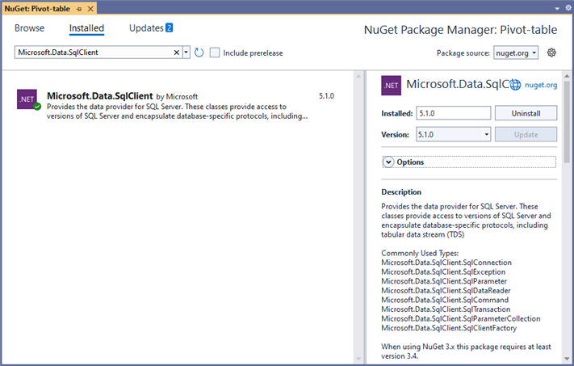
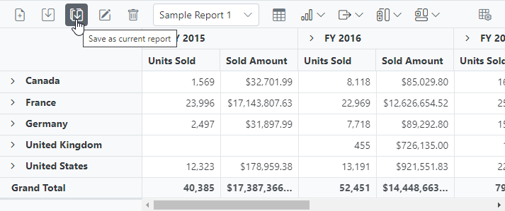
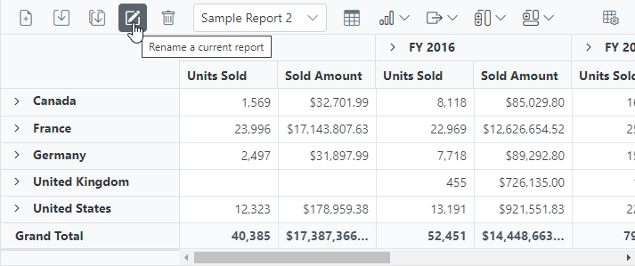

# Toolbar in Blazor Pivot Table Component

## Save and load reports to a SQL database

SQL Server is a relational database management system (RDBMS) that can be used to store and manage large amounts of data. In this topic, we will see how to save, save as, rename, load, delete, and add reports between a SQL Server database and a Blazor Pivot Table at runtime.

### Connecting a SQL Server database in a Blazor application

**1.** Create a simple Blazor Pivot Table by following the **"Getting Started"** documentation [link](./getting-started).

**2.** To connect a SQL Server database using the Microsoft SqlClient in our application, we need to install the [Microsoft.Data.SqlClient](https://www.nuget.org/packages/Microsoft.Data.SqlClient) NuGet package. To do so, open the NuGet package manager of the project solution, search for the package **Microsoft.Data.SqlClient** and install it.



**3.** Next, in the **Index.razor** page, the **OpenConnection** method is used to connect to the SQL database. The **GetDataTable** method then processes the specified SQL query string, retrieves data from the database, and converts it into a **DataTable** using **SqlCommand** and **SqlDataAdapter**. This **DataTable** can be used to retrieve saved reports and modify them further as shown in the code block below.

```cshtml
@using System.Data
@using Microsoft.Data.SqlClient;
@using EFPivotTable.Data;

<SfPivotView @ref=PivotRef TValue="ProductDetails" ID="pivot-table" Height="450" Width="700" ShowToolbar="true" ShowFieldList=true AllowExcelExport=true AllowPdfExport=true Toolbar="@PivotToolbar">
    //Bind the report here...
    <PivotViewEvents TValue="ProductDetails" SaveReport="SaveReport" LoadReport="LoadReport" RenameReport="RenameReport" RemoveReport="RemoveReport" FetchReport="FetchReport"></PivotViewEvents>
</SfPivotView>

@code {
    SfPivotView<ProductDetails> PivotRef { get; set; }

    public List<ProductDetails> DataSource { get; set; }
    public List<ToolbarItems> PivotToolbar = new List<ToolbarItems> {
        ToolbarItems.New,
        ToolbarItems.Save,
        ToolbarItems.SaveAs,
        ToolbarItems.Rename,
        ToolbarItems.Remove,
        ToolbarItems.Load,
        ToolbarItems.Grid,
        ToolbarItems.Chart,
        ToolbarItems.Export,
        ToolbarItems.SubTotal,
        ToolbarItems.GrandTotal,
        ToolbarItems.FieldList
    };
    protected override void OnInitialized()
    {
        this.DataSource = ProductDetails.GetProductData().ToList();
    }

    public void SaveReport(SaveReportArgs args)
    {
        SaveReportToDB(args.ReportName, args.Report);
    }

    public void FetchReport(FetchReportArgs args)
    {
        args.ReportName = FetchReportListFromDB().ToArray();
    }

    public async Task LoadReport(LoadReportArgs args)
    {
        await this.PivotRef.LoadPersistDataAsync(LoadReportFromDB(args.ReportName).ToString());
    }

    // To delete a report
    public void RemoveReport(RemoveReportArgs args)
    {
        RemoveReportFromDB(args.ReportName);
    }
    // To rename a report
    public void RenameReport(RenameReportArgs args)
    {
        RenameReportInDB(args.ReportName, args.Rename, args.IsReportExists);
    }

    public void SaveReportToDB(string reportName, string report)
    {
        SqlConnection sqlConn = OpenConnection();
        bool isDuplicate = true;
        SqlCommand cmd1 = null;
        foreach (DataRow row in GetDataTable(sqlConn).Rows)
        {
            if ((row["ReportName"] as string).Equals(reportName))
            {
                isDuplicate = false;
                cmd1 = new SqlCommand("UPDATE ReportTable set Report=@Report where ReportName like @ReportName", sqlConn);
            }
        }
        if (isDuplicate)
        {
            cmd1 = new SqlCommand("INSERT into ReportTable (ReportName,Report) Values(@ReportName,@Report)", sqlConn);
        }
        cmd1.Parameters.AddWithValue("@ReportName", reportName);
        cmd1.Parameters.AddWithValue("@Report", report.ToString());
        cmd1.ExecuteNonQuery();
        sqlConn.Close();
    }
    public object LoadReportFromDB(string reportName)
    {
        SqlConnection sqlConn = OpenConnection();
        string report = string.Empty;
        foreach (DataRow row in GetDataTable(sqlConn).Rows)
        {
            if ((row["ReportName"] as string).Equals(reportName))
            {
                report = (string)row["Report"];
                break;
            }
        }
        sqlConn.Close();
        return report;
    }
    public List<string> FetchReportListFromDB()
    {
        SqlConnection sqlConn = OpenConnection();
        List<string> reportNames = new List<string>();
        foreach (DataRow row in GetDataTable(sqlConn).Rows)
        {
            if (!string.IsNullOrEmpty(row["ReportName"] as string))
            {
                reportNames.Add(row["ReportName"].ToString());
            }
        }
        sqlConn.Close();
        return reportNames;
    }
    public void RenameReportInDB(string reportName, string renameReport, bool isReportExists)
    {
        SqlConnection sqlConn = OpenConnection();
        SqlCommand cmd1 = null;
        if (isReportExists)
        {
            foreach (DataRow row in GetDataTable(sqlConn).Rows)
            {
                if ((row["ReportName"] as string).Equals(renameReport))
                {
                    cmd1 = new SqlCommand("DELETE FROM ReportTable WHERE ReportName LIKE '%" + renameReport + "%'", sqlConn);
                    break;
                }
            }
            cmd1.ExecuteNonQuery();
        }
        foreach (DataRow row in GetDataTable(sqlConn).Rows)
        {
            if ((row["ReportName"] as string).Equals(reportName))
            {
                cmd1 = new SqlCommand("UPDATE ReportTable set ReportName=@RenameReport where ReportName like '%" + reportName + "%'", sqlConn);
                break;
            }
        }
        cmd1.Parameters.AddWithValue("@RenameReport", renameReport);
        cmd1.ExecuteNonQuery();
        sqlConn.Close();
    }
    public void RemoveReportFromDB(string reportName)
    {
        SqlConnection sqlConn = OpenConnection();
        SqlCommand cmd1 = null;
        foreach (DataRow row in GetDataTable(sqlConn).Rows)
        {
            if ((row["ReportName"] as string).Equals(reportName))
            {
                cmd1 = new SqlCommand("DELETE FROM ReportTable WHERE ReportName LIKE '%" + reportName + "%'", sqlConn);
                break;
            }
        }
        cmd1.ExecuteNonQuery();
        sqlConn.Close();
    }
    private SqlConnection OpenConnection()
    {
        // Replace with your own connection string.
        string connectionString = @"<Enter your valid connection string here>";
        SqlConnection sqlConn = new SqlConnection(connectionString);
        sqlConn.Open();
        return sqlConn;
    }

    private DataTable GetDataTable(SqlConnection sqlConn)
    {
        string xquery = "SELECT * FROM ReportTable";
        SqlCommand cmd = new SqlCommand(xquery, sqlConn);
        SqlDataAdapter da = new SqlDataAdapter(cmd);
        DataTable dt = new DataTable();
        da.Fill(dt);
        return dt;
    }
}

```

Further, let us explore more on how to save, load, rename, delete, and add reports in the SQL database using **SqlConnection**.

### Saving a report

When you select the **"Save a report"** option from the toolbar, the [SaveReport](#savereport) event is triggered. In this event, **SaveReportToDB** method is called passing the name of the current report and the current report, which you can use to check and save in the SQL database.

For example, the report shown in the following code snippet will be passed to the **SaveReportToDB** method along with the report name **"Sample Report"** and saved in the SQL database.

```cshtml
@using System.Data
@using Microsoft.Data.SqlClient;
@using EFPivotTable.Data;

<SfPivotView @ref=PivotRef TValue="ProductDetails" ID="pivot-table" Height="450" Width="700" ShowToolbar="true" ShowFieldList=true AllowExcelExport=true AllowPdfExport=true Toolbar="@PivotToolbar">
    <PivotViewDisplayOption View="View.Both"></PivotViewDisplayOption>
    <PivotViewDataSourceSettings DataSource="@DataSource" EnableSorting="true">
        <PivotViewColumns>
            <PivotViewColumn Name="Year"></PivotViewColumn>
            <PivotViewColumn Name="Quarter"></PivotViewColumn>
        </PivotViewColumns>
        <PivotViewRows>
            <PivotViewRow Name="Country"></PivotViewRow>
            <PivotViewRow Name="Products"></PivotViewRow>
        </PivotViewRows>
        <PivotViewValues>
            <PivotViewValue Name="Sold" Caption="Units Sold"></PivotViewValue>
            <PivotViewValue Name="Amount" Caption="Sold Amount"></PivotViewValue>
        </PivotViewValues>
        <PivotViewFormatSettings>
            <PivotViewFormatSetting Name="Amount" Format="C"></PivotViewFormatSetting>
            <PivotViewFormatSetting Name="Sold" Format="N0"></PivotViewFormatSetting>
        </PivotViewFormatSettings>
    </PivotViewDataSourceSettings>
    <PivotViewEvents TValue="ProductDetails" SaveReport="SaveReport"></PivotViewEvents>
</SfPivotView>

@code {
    SfPivotView<ProductDetails> PivotRef { get; set; }

    public List<ProductDetails> DataSource { get; set; }
    public List<ToolbarItems> PivotToolbar = new List<ToolbarItems> {
        ToolbarItems.New,
        ToolbarItems.Save,
        ToolbarItems.SaveAs,
        ToolbarItems.Rename,
        ToolbarItems.Remove,
        ToolbarItems.Load,
        ToolbarItems.Grid,
        ToolbarItems.Chart,
        ToolbarItems.Export,
        ToolbarItems.SubTotal,
        ToolbarItems.GrandTotal,
        ToolbarItems.FieldList
    };
    protected override void OnInitialized()
    {
        this.DataSource = ProductDetails.GetProductData().ToList();
    }

    public void SaveReport(SaveReportArgs args)
    {
        SaveReportToDB(args.ReportName, args.Report);
    }

    public void SaveReportToDB(string reportName, string report)
    {
        SqlConnection sqlConn = OpenConnection();
        bool isDuplicate = true;
        SqlCommand cmd1 = null;
        foreach (DataRow row in GetDataTable(sqlConn).Rows)
        {
            if ((row["ReportName"] as string).Equals(reportName))
            {
                isDuplicate = false;
                cmd1 = new SqlCommand("UPDATE ReportTable set Report=@Report where ReportName like @ReportName", sqlConn);
            }
        }
        if (isDuplicate)
        {
            cmd1 = new SqlCommand("INSERT into ReportTable (ReportName,Report) Values(@ReportName,@Report)", sqlConn);
        }
        cmd1.Parameters.AddWithValue("@ReportName", reportName);
        cmd1.Parameters.AddWithValue("@Report", report.ToString());
        cmd1.ExecuteNonQuery();
        sqlConn.Close();
    }

    private SqlConnection OpenConnection()
    {
        // Replace with your own connection string.
        string connectionString = @"<Enter your valid connection string here>";
        SqlConnection sqlConn = new SqlConnection(connectionString);
        sqlConn.Open();
        return sqlConn;
    }

    private DataTable GetDataTable(SqlConnection sqlConn)
    {
        string xquery = "SELECT * FROM ReportTable";
        SqlCommand cmd = new SqlCommand(xquery, sqlConn);
        SqlDataAdapter da = new SqlDataAdapter(cmd);
        DataTable dt = new DataTable();
        da.Fill(dt);
        return dt;
    }
}

```


In the meantime, you can save a duplicate of the current report to the SQL Server database with a different name by selecting **"Save as current report"** from the toolbar. The [saveReport](#savereport) event will then be triggered with the new report name **"Sample Report 1"** and the current report. You can save them to the SQL Server database after passing them to the **SaveReportToDB** method, as mentioned above.



### Loading a report

When you select the dropdown menu item from the toolbar, the [LoadReport](#loadreport) event is triggered. In this event, **LoadReportFromDB** method is called passing the name of the selected report. The method uses this information to search for the report in the SQL database, fetch it, and load it into the pivot table.

For example, if the report name **"Sample Report 1"** is selected from a dropdown menu and passed, the **LoadReportFromDB** method will use that name to search for the report in the SQL database, retrieve it, and then load it into the pivot table.

```cshtml
@using System.Data
@using Microsoft.Data.SqlClient;
@using EFPivotTable.Data;

<SfPivotView @ref=PivotRef TValue="ProductDetails" ID="pivot-table" Height="450" Width="700" ShowToolbar="true" ShowFieldList=true AllowExcelExport=true AllowPdfExport=true Toolbar="@PivotToolbar">
    <PivotViewDisplayOption View="View.Both"></PivotViewDisplayOption>
    <PivotViewDataSourceSettings DataSource="@DataSource" EnableSorting="true">
        <PivotViewColumns>
            <PivotViewColumn Name="Year"></PivotViewColumn>
            <PivotViewColumn Name="Quarter"></PivotViewColumn>
        </PivotViewColumns>
        <PivotViewRows>
            <PivotViewRow Name="Country"></PivotViewRow>
            <PivotViewRow Name="Products"></PivotViewRow>
        </PivotViewRows>
        <PivotViewValues>
            <PivotViewValue Name="Sold" Caption="Units Sold"></PivotViewValue>
            <PivotViewValue Name="Amount" Caption="Sold Amount"></PivotViewValue>
        </PivotViewValues>
        <PivotViewFormatSettings>
            <PivotViewFormatSetting Name="Amount" Format="C"></PivotViewFormatSetting>
            <PivotViewFormatSetting Name="Sold" Format="N0"></PivotViewFormatSetting>
        </PivotViewFormatSettings>
    </PivotViewDataSourceSettings>
    <PivotViewEvents TValue="ProductDetails" LoadReport="LoadReport"></PivotViewEvents>
</SfPivotView>

@code {
    SfPivotView<ProductDetails> PivotRef { get; set; }

    public List<ProductDetails> DataSource { get; set; }
    public List<ToolbarItems> PivotToolbar = new List<ToolbarItems> {
        ToolbarItems.New,
        ToolbarItems.Save,
        ToolbarItems.SaveAs,
        ToolbarItems.Rename,
        ToolbarItems.Remove,
        ToolbarItems.Load,
        ToolbarItems.Grid,
        ToolbarItems.Chart,
        ToolbarItems.Export,
        ToolbarItems.SubTotal,
        ToolbarItems.GrandTotal,
        ToolbarItems.FieldList
    };
    protected override void OnInitialized()
    {
        this.DataSource = ProductDetails.GetProductData().ToList();
    }

    public async Task LoadReport(LoadReportArgs args)
    {
        await this.PivotRef.LoadPersistDataAsync(LoadReportFromDB(args.ReportName).ToString());
    }

    public object LoadReportFromDB(string reportName)
    {
        SqlConnection sqlConn = OpenConnection();
        string report = string.Empty;
        foreach (DataRow row in GetDataTable(sqlConn).Rows)
        {
            if ((row["ReportName"] as string).Equals(reportName))
            {
                report = (string)row["Report"];
                break;
            }
        }
        sqlConn.Close();
        return report;
    }
    private SqlConnection OpenConnection()
    {
        // Replace with your own connection string.
        string connectionString = @"<Enter your valid connection string here>";
        SqlConnection sqlConn = new SqlConnection(connectionString);
        sqlConn.Open();
        return sqlConn;
    }

    private DataTable GetDataTable(SqlConnection sqlConn)
    {
        string xquery = "SELECT * FROM ReportTable";
        SqlCommand cmd = new SqlCommand(xquery, sqlConn);
        SqlDataAdapter da = new SqlDataAdapter(cmd);
        DataTable dt = new DataTable();
        da.Fill(dt);
        return dt;
    }
}

```


### Renaming a report

When you select the **"Rename a current report"** option from the toolbar, the [RenameReport](#renamereport) event is triggered. In this event, **RenameReportInDB** method is called passing the current and new report names, where you can use the current report name to identify the report and resave it with the new report name in the SQL database.

For example, if we rename the current report from **"Sample Report 1"** to **"Sample Report 2"**, both **"Sample Report 1"** and **"Sample Report 2"** will be passed to the **RenameReportInDB** method, which will rename the current report with the new report name **"Sample Report 2"** in the SQL database.

```cshtml
@using System.Data
@using Microsoft.Data.SqlClient;
@using EFPivotTable.Data;

<SfPivotView @ref=PivotRef TValue="ProductDetails" ID="pivot-table" Height="450" Width="700" ShowToolbar="true" ShowFieldList=true AllowExcelExport=true AllowPdfExport=true Toolbar="@PivotToolbar">
    <PivotViewDisplayOption View="View.Both"></PivotViewDisplayOption>
    <PivotViewDataSourceSettings DataSource="@DataSource" EnableSorting="true">
        <PivotViewColumns>
            <PivotViewColumn Name="Year"></PivotViewColumn>
            <PivotViewColumn Name="Quarter"></PivotViewColumn>
        </PivotViewColumns>
        <PivotViewRows>
            <PivotViewRow Name="Country"></PivotViewRow>
            <PivotViewRow Name="Products"></PivotViewRow>
        </PivotViewRows>
        <PivotViewValues>
            <PivotViewValue Name="Sold" Caption="Units Sold"></PivotViewValue>
            <PivotViewValue Name="Amount" Caption="Sold Amount"></PivotViewValue>
        </PivotViewValues>
        <PivotViewFormatSettings>
            <PivotViewFormatSetting Name="Amount" Format="C"></PivotViewFormatSetting>
            <PivotViewFormatSetting Name="Sold" Format="N0"></PivotViewFormatSetting>
        </PivotViewFormatSettings>
    </PivotViewDataSourceSettings>
    <PivotViewEvents TValue="ProductDetails" RenameReport="RenameReport"></PivotViewEvents>
</SfPivotView>

@code {
    SfPivotView<ProductDetails> PivotRef { get; set; }

    public List<ProductDetails> DataSource { get; set; }
    public List<ToolbarItems> PivotToolbar = new List<ToolbarItems> {
        ToolbarItems.New,
        ToolbarItems.Save,
        ToolbarItems.SaveAs,
        ToolbarItems.Rename,
        ToolbarItems.Remove,
        ToolbarItems.Load,
        ToolbarItems.Grid,
        ToolbarItems.Chart,
        ToolbarItems.Export,
        ToolbarItems.SubTotal,
        ToolbarItems.GrandTotal,
        ToolbarItems.FieldList
    };
    protected override void OnInitialized()
    {
        this.DataSource = ProductDetails.GetProductData().ToList();
    }

    // To rename a report
    public void RenameReport(RenameReportArgs args)
    {
        RenameReportInDB(args.ReportName, args.Rename, args.IsReportExists);
    }

    public void RenameReportInDB(string reportName, string renameReport, bool isReportExists)
    {
        SqlConnection sqlConn = OpenConnection();
        SqlCommand cmd1 = null;
        if (isReportExists)
        {
            foreach (DataRow row in GetDataTable(sqlConn).Rows)
            {
                if ((row["ReportName"] as string).Equals(renameReport))
                {
                    cmd1 = new SqlCommand("DELETE FROM ReportTable WHERE ReportName LIKE '%" + renameReport + "%'", sqlConn);
                    break;
                }
            }
            cmd1.ExecuteNonQuery();
        }
        foreach (DataRow row in GetDataTable(sqlConn).Rows)
        {
            if ((row["ReportName"] as string).Equals(reportName))
            {
                cmd1 = new SqlCommand("UPDATE ReportTable set ReportName=@RenameReport where ReportName like '%" + reportName + "%'", sqlConn);
                break;
            }
        }
        cmd1.Parameters.AddWithValue("@RenameReport", renameReport);
        cmd1.ExecuteNonQuery();
        sqlConn.Close();
    }
    private SqlConnection OpenConnection()
    {
        // Replace with your own connection string.
        string connectionString = @"<Enter your valid connection string here>";
        SqlConnection sqlConn = new SqlConnection(connectionString);
        sqlConn.Open();
        return sqlConn;
    }

    private DataTable GetDataTable(SqlConnection sqlConn)
    {
        string xquery = "SELECT * FROM ReportTable";
        SqlCommand cmd = new SqlCommand(xquery, sqlConn);
        SqlDataAdapter da = new SqlDataAdapter(cmd);
        DataTable dt = new DataTable();
        da.Fill(dt);
        return dt;
    }
}

```



### Deleting a report

When you select the **"Delete a current report"** option from the toolbar, the [removeReport](#removereport) event is triggered. In this event, **RemoveReportFromDB** method is called passing the current report name to identify and delete the appropriate report from the SQL database.

N> * If the current report **n** from the pivot table is deleted, the pivot table will automatically load the last report from the report list.
N> * When a report is removed from a pivot table with only one report, the SQL database refreshes; however, the pivot table will continue to show the removed report until a new report is added to the pivot table.

For example, if we delete the current report **"Sample Report 2"** from the pivot table, the current report name **"Sample Report 2"** is passed to the **RemoveReportFromDB** method, which allows you to identify and delete the report from the SQL database.

```cshtml
@using System.Data
@using Microsoft.Data.SqlClient;
@using EFPivotTable.Data;

<SfPivotView @ref=PivotRef TValue="ProductDetails" ID="pivot-table" Height="450" Width="700" ShowToolbar="true" ShowFieldList=true AllowExcelExport=true AllowPdfExport=true Toolbar="@PivotToolbar">
    <PivotViewDisplayOption View="View.Both"></PivotViewDisplayOption>
    <PivotViewDataSourceSettings DataSource="@DataSource" EnableSorting="true">
        <PivotViewColumns>
            <PivotViewColumn Name="Year"></PivotViewColumn>
            <PivotViewColumn Name="Quarter"></PivotViewColumn>
        </PivotViewColumns>
        <PivotViewRows>
            <PivotViewRow Name="Country"></PivotViewRow>
            <PivotViewRow Name="Products"></PivotViewRow>
        </PivotViewRows>
        <PivotViewValues>
            <PivotViewValue Name="Sold" Caption="Units Sold"></PivotViewValue>
            <PivotViewValue Name="Amount" Caption="Sold Amount"></PivotViewValue>
        </PivotViewValues>
        <PivotViewFormatSettings>
            <PivotViewFormatSetting Name="Amount" Format="C"></PivotViewFormatSetting>
            <PivotViewFormatSetting Name="Sold" Format="N0"></PivotViewFormatSetting>
        </PivotViewFormatSettings>
    </PivotViewDataSourceSettings>
    <PivotViewEvents TValue="ProductDetails" RemoveReport="RemoveReport"></PivotViewEvents>
</SfPivotView>

@code {
    SfPivotView<ProductDetails> PivotRef { get; set; }

    public List<ProductDetails> DataSource { get; set; }
    public List<ToolbarItems> PivotToolbar = new List<ToolbarItems> {
        ToolbarItems.New,
        ToolbarItems.Save,
        ToolbarItems.SaveAs,
        ToolbarItems.Rename,
        ToolbarItems.Remove,
        ToolbarItems.Load,
        ToolbarItems.Grid,
        ToolbarItems.Chart,
        ToolbarItems.Export,
        ToolbarItems.SubTotal,
        ToolbarItems.GrandTotal,
        ToolbarItems.FieldList
    };
    protected override void OnInitialized()
    {
        this.DataSource = ProductDetails.GetProductData().ToList();
    }

    // To delete a report
    public void RemoveReport(RemoveReportArgs args)
    {
        RemoveReportFromDB(args.ReportName);
    }

    public void RemoveReportFromDB(string reportName)
    {
        SqlConnection sqlConn = OpenConnection();
        SqlCommand cmd1 = null;
        foreach (DataRow row in GetDataTable(sqlConn).Rows)
        {
            if ((row["ReportName"] as string).Equals(reportName))
            {
                cmd1 = new SqlCommand("DELETE FROM ReportTable WHERE ReportName LIKE '%" + reportName + "%'", sqlConn);
                break;
            }
        }
        cmd1.ExecuteNonQuery();
        sqlConn.Close();
    }
    private SqlConnection OpenConnection()
    {
        // Replace with your own connection string.
        string connectionString = @"<Enter your valid connection string here>";
        SqlConnection sqlConn = new SqlConnection(connectionString);
        sqlConn.Open();
        return sqlConn;
    }

    private DataTable GetDataTable(SqlConnection sqlConn)
    {
        string xquery = "SELECT * FROM ReportTable";
        SqlCommand cmd = new SqlCommand(xquery, sqlConn);
        SqlDataAdapter da = new SqlDataAdapter(cmd);
        DataTable dt = new DataTable();
        da.Fill(dt);
        return dt;
    }
}

```


### Adding a report

When you select the **"Create a new report"** option from the toolbar, the [NewReport](#newreport) event is triggered, followed by the [SaveReport](#savereport) event. To save this new report to the SQL database, the [SaveReport](#savereport) event triggered later, and then follow the save report briefing in the preceding [topic](#saving-a-report).


### Limitations with respect to report manipulation

Below points need to be considered when saving the report to SQL Server database.

* **Data source**: Both raw data and aggregated data won't be saved and loaded from the database.
* **Conditional formatting**: The appearance of the pivot table, such as background color, font color, font family, and font size based on the specific conditions won't be saved and loaded from the database.
* **Hyperlinks**: Option to link external facts via pivot table cells won't be saved and loaded from the database.
* The pivot table should always load reports from the SQL database based on the data source that is currently bound to it.

> In [this](https://github.com/SyncfusionExamples/Save-and-load-report-from-SQL-database-to-blazor-pivot-table) GitHub repository, you can find our Blazor Pivot Table sample to save and load reports from SQL Server database.

### Create a Web API service to connect to a SQL Server database

**1.** Open Visual Studio and create an ASP.NET Core Web App project type, naming it **MyWebService**. To create an ASP.NET Core Web application, follow the document [link](https://learn.microsoft.com/en-us/visualstudio/get-started/csharp/tutorial-aspnet-core?view=vs-2022).


**2.** To connect a SQL Server database using the Microsoft SqlClient in our application, we need to install the [Microsoft.Data.SqlClient](https://www.nuget.org/packages/Microsoft.Data.SqlClient) NuGet package. To do so, open the NuGet package manager of the project solution, search for the package **Microsoft.Data.SqlClient** and install it.


**3.** Under the **Controllers** folder, create a Web API controller (aka, PivotController.cs) file that aids in data communication with the Pivot Table.

**4.** In the Web API Controller (aka, PivotController), the **OpenConnection** method is used to connect to the SQL database. The **GetDataTable** method then processes the specified SQL query string, retrieves data from the database, and converts it into a **DataTable** using **SqlCommand** and **SqlDataAdapter**. This **DataTable** can be used to retrieve saved reports and modify them further as shown in the code block below.

[PivotController.cs]
```csharp
using Microsoft.AspNetCore.Mvc;
using System.Data;
using System.Data.SqlClient;

namespace MyWebService.Controllers
{
    public class PivotController : ControllerBase
    {
        [HttpPost]
        [Route("Pivot/SaveReport")]
        public void SaveReport([FromBody] SaveReportDB reportDB)
        {
            SaveReportToDB(reportDB.ReportName, reportDB.Report);
        }

        [HttpPost]
        [Route("Pivot/FetchReport")]
        public IActionResult FetchReport()
        {
            return Ok((FetchReportListFromDB()));
        }

        [HttpPost]
        [Route("Pivot/RemoveReport")]
        public void RemoveReport([FromBody] ReportDB reportDB)
        {
            RemoveReportFromDB(reportDB.ReportName);
        }

        [HttpPost]
        [Route("Pivot/RenameReport")]
        public void RenameReport([FromBody] RenameReportDB reportDB)
        {
            RenameReportInDB(reportDB.ReportName, reportDB.RenameReport, reportDB.isReportExists);
        }

        [HttpPost]
        [Route("Pivot/LoadReport")]
        public IActionResult LoadReport([FromBody] ReportDB reportDB)
        {
            return Ok((LoadReportFromDB(reportDB.ReportName)));
        }

        public class SaveReportDB
        {
            public string ReportName { get; set; }
            public string Report { get; set; }
        }

        public class ReportDB
        {
            public string ReportName { get; set; }
        }

        public class RenameReportDB
        {
            public string ReportName { get; set; }
            public string RenameReport { get; set; }
            public bool isReportExists { get; set; }
        }

        public void SaveReportToDB(string reportName, string report)
        {
            SqlConnection sqlConn = OpenConnection();
            bool isDuplicate = true;
            SqlCommand cmd1 = null;
            foreach (DataRow row in GetDataTable(sqlConn).Rows)
            {
                if ((row["ReportName"] as string).Equals(reportName))
                {
                    isDuplicate = false;
                    cmd1 = new SqlCommand("UPDATE ReportTable set Report=@Report where ReportName like @ReportName", sqlConn);
                }
            }
            if (isDuplicate)
            {
                cmd1 = new SqlCommand("INSERT into ReportTable (ReportName,Report) Values(@ReportName,@Report)", sqlConn);
            }
            cmd1.Parameters.AddWithValue("@ReportName", reportName);
            cmd1.Parameters.AddWithValue("@Report", report.ToString());
            cmd1.ExecuteNonQuery();
            sqlConn.Close();
        }

        public void RemoveReportFromDB(string reportName)
        {
            SqlConnection sqlConn = OpenConnection();
            SqlCommand cmd1 = null;
            foreach (DataRow row in GetDataTable(sqlConn).Rows)
            {
                if ((row["ReportName"] as string).Equals(reportName))
                {
                    cmd1 = new SqlCommand("DELETE FROM ReportTable WHERE ReportName LIKE '%" + reportName + "%'", sqlConn);
                    break;
                }
            }
            cmd1.ExecuteNonQuery();
            sqlConn.Close();
        }

        public void RenameReportInDB(string reportName, string renameReport, bool isReportExists)
        {
            SqlConnection sqlConn = OpenConnection();
            SqlCommand cmd1 = null;
            if (isReportExists)
            {
                foreach (DataRow row in GetDataTable(sqlConn).Rows)
                {
                    if ((row["ReportName"] as string).Equals(renameReport))
                    {
                        cmd1 = new SqlCommand("DELETE FROM ReportTable WHERE ReportName LIKE '%" + renameReport + "%'", sqlConn);
                        break;
                    }
                }
                cmd1.ExecuteNonQuery();
            }
            foreach (DataRow row in GetDataTable(sqlConn).Rows)
            {
                if ((row["ReportName"] as string).Equals(reportName))
                {
                    cmd1 = new SqlCommand("UPDATE ReportTable set ReportName=@RenameReport where ReportName like '%" + reportName + "%'", sqlConn);
                    break;
                }
            }
            cmd1.Parameters.AddWithValue("@RenameReport", renameReport);
            cmd1.ExecuteNonQuery();
            sqlConn.Close();
        }

        public List<string> FetchReportListFromDB()
        {
            SqlConnection sqlConn = OpenConnection();
            List<string> reportNames = new List<string>();
            foreach (DataRow row in GetDataTable(sqlConn).Rows)
            {
                if (!string.IsNullOrEmpty(row["ReportName"] as string))
                {
                    reportNames.Add(row["ReportName"].ToString());
                }
            }
            sqlConn.Close();
            return reportNames;
        }

        public string LoadReportFromDB(string reportName)
        {
            SqlConnection sqlConn = OpenConnection();
            string report = string.Empty;
            foreach (DataRow row in GetDataTable(sqlConn).Rows)
            {
                if ((row["ReportName"] as string).Equals(reportName))
                {
                    report = (string)row["Report"];
                    break;
                }
            }
            sqlConn.Close();
            return report;
        }

        private SqlConnection OpenConnection()
        {
            string connectionString = @"Data Source=(LocalDB)\MSSQLLocalDB;AttachDbFilename=" + Environment.CurrentDirectory
                + @"\App_Data\Database1.mdf;Integrated Security=True";
            SqlConnection sqlConn = new SqlConnection(connectionString);
            sqlConn.Open();
            return sqlConn;
        }

        private DataTable GetDataTable(SqlConnection sqlConn)
        {
            string xquery = "SELECT * FROM ReportTable";
            SqlCommand cmd = new SqlCommand(xquery, sqlConn);
            SqlDataAdapter da = new SqlDataAdapter(cmd);
            DataTable dt = new DataTable();
            da.Fill(dt);
            return dt;
        }
    }
}

```

**5.** When you run the app, it will be hosted at `https://localhost:44313`. You can use the hosted URL to save and load reports in the SQL database from the Pivot Table.

Further, let us explore more on how to save, load, rename, delete, and add reports using the built-in toolbar options via Web API controller (aka, PivotController) one-by-one.

### Saving a report

When you select the **"Save a report"** option from the toolbar, the [SaveReport](#savereport) event is triggered. In this event, a HTTP request is made to the Web API controller's **SaveReport** method, passing the name of the current report and the current report, which you can use to check and save in the SQL database.

For example, the report shown in the following code snippet will be passed to the **SaveReport** method along with the report name **"Sample Report"** and saved in the SQL database.

[Index.razor]

```cshtml
@using System.Data
@using MyBlazorServerApp.Data;
@using System.Net.Http;
@using System.Text.Json;
@using System.Threading.Tasks;

<SfPivotView @ref=PivotRef TValue="ProductDetails" ID="pivot-table" Height="450" Width="650" ShowToolbar="true" ShowFieldList=true AllowExcelExport=true AllowPdfExport=true Toolbar="@PivotToolbar">
    <PivotViewDisplayOption View="View.Both"></PivotViewDisplayOption>
    <PivotViewDataSourceSettings DataSource="@DataSource" EnableSorting="true">
        <PivotViewColumns>
            <PivotViewColumn Name="Year"></PivotViewColumn>
            <PivotViewColumn Name="Quarter"></PivotViewColumn>
        </PivotViewColumns>
        <PivotViewRows>
            <PivotViewRow Name="Country"></PivotViewRow>
            <PivotViewRow Name="Products"></PivotViewRow>
        </PivotViewRows>
        <PivotViewValues>
            <PivotViewValue Name="Sold" Caption="Units Sold"></PivotViewValue>
            <PivotViewValue Name="Amount" Caption="Sold Amount"></PivotViewValue>
        </PivotViewValues>
        <PivotViewFormatSettings>
            <PivotViewFormatSetting Name="Amount" Format="C"></PivotViewFormatSetting>
            <PivotViewFormatSetting Name="Sold" Format="N0"></PivotViewFormatSetting>
        </PivotViewFormatSettings>
    </PivotViewDataSourceSettings>
    <PivotViewEvents TValue="ProductDetails" SaveReport="SaveReport"></PivotViewEvents>
</SfPivotView>

@code {
    SfPivotView<ProductDetails> PivotRef { get; set; }

    public List<ProductDetails> DataSource { get; set; }
    public List<ToolbarItems> PivotToolbar = new List<ToolbarItems> {
        ToolbarItems.New,
        ToolbarItems.Save,
        ToolbarItems.SaveAs,
        ToolbarItems.Rename,
        ToolbarItems.Remove,
        ToolbarItems.Load,
        ToolbarItems.Grid,
        ToolbarItems.Chart,
        ToolbarItems.Export,
        ToolbarItems.SubTotal,
        ToolbarItems.GrandTotal,
        ToolbarItems.FieldList
    };
    protected override void OnInitialized()
    {
        this.DataSource = ProductDetails.GetProductData().ToList();
    }
    // To save a report
    public async Task SaveReport(SaveReportArgs args)
    {
        string url = "https://localhost:44313/Pivot/SaveReport";
        var data = new { ReportName = args.ReportName, Report = args.Report };
        HttpContent content = new StringContent(JsonSerializer.Serialize(data), System.Text.Encoding.UTF8, "application/json");

        using (HttpClient httpClient = new HttpClient())
        {
            HttpResponseMessage response = await httpClient.PostAsync(url, content);
        }
    }
}

```

[PivotController.cs]

```csharp
namespace MyWebService.Controllers
{
    public class PivotController : ControllerBase
    {
        [HttpPost]
        [Route("Pivot/SaveReport")]
        public void SaveReport([FromBody] SaveReportDB reportDB)
        {
            SaveReportToDB(reportDB.ReportName, reportDB.Report);
        }

        public class SaveReportDB
        {
            public string ReportName { get; set; }
            public string Report { get; set; }
        }

        public void SaveReportToDB(string reportName, string report)
        {
            SqlConnection sqlConn = OpenConnection();
            bool isDuplicate = true;
            SqlCommand cmd1 = null;
            foreach (DataRow row in GetDataTable(sqlConn).Rows)
            {
                if ((row["ReportName"] as string).Equals(reportName))
                {
                    isDuplicate = false;
                    cmd1 = new SqlCommand("UPDATE ReportTable set Report=@Report where ReportName like @ReportName", sqlConn);
                }
            }
            if (isDuplicate)
            {
                cmd1 = new SqlCommand("INSERT into ReportTable (ReportName,Report) Values(@ReportName,@Report)", sqlConn);
            }
            cmd1.Parameters.AddWithValue("@ReportName", reportName);
            cmd1.Parameters.AddWithValue("@Report", report.ToString());
            cmd1.ExecuteNonQuery();
            sqlConn.Close();
        }

        private SqlConnection OpenConnection()
        {
            string connectionString = @"Data Source=(LocalDB)\MSSQLLocalDB;AttachDbFilename=" + Environment.CurrentDirectory
                + @"\App_Data\Database1.mdf;Integrated Security=True";
            SqlConnection sqlConn = new SqlConnection(connectionString);
            sqlConn.Open();
            return sqlConn;
        }

        private DataTable GetDataTable(SqlConnection sqlConn)
        {
            string xquery = "SELECT * FROM ReportTable";
            SqlCommand cmd = new SqlCommand(xquery, sqlConn);
            SqlDataAdapter da = new SqlDataAdapter(cmd);
            DataTable dt = new DataTable();
            da.Fill(dt);
            return dt;
        }
    }
}

```


In the meantime, you can save a duplicate of the current report to the SQL Server database with a different name by selecting **"Save as current report"** from the toolbar. The [saveReport](#savereport) event will then be triggered with the new report name **"Sample Report 1"** and the current report. You can save them to the SQL Server database after passing them to the Web API service, as mentioned above.


### Loading a report

When you select the dropdown menu item from the toolbar, the [LoadReport](#loadreport) event is triggered. In this event, an HTTP request is made to the **LoadReport** method of the Web API controller, passing the name of the selected report. The method uses this information to search for the report in the SQL database, fetch it, and load it into the pivot table.

For example, if the report name **"Sample Report 1"** is selected from a dropdown menu and passed, the **LoadReport** method will use that name to search for the report in the SQL database, retrieve it, and then load it into the pivot table.

[Index.razor]

```cshtml
@using System.Data
@using MyBlazorServerApp.Data;
@using System.Net.Http;
@using System.Text.Json;
@using System.Threading.Tasks;

<SfPivotView @ref=PivotRef TValue="ProductDetails" ID="pivot-table" Height="450" Width="650" ShowToolbar="true" ShowFieldList=true AllowExcelExport=true AllowPdfExport=true Toolbar="@PivotToolbar">
    <PivotViewDisplayOption View="View.Both"></PivotViewDisplayOption>
    <PivotViewDataSourceSettings DataSource="@DataSource" EnableSorting="true">
        <PivotViewColumns>
            <PivotViewColumn Name="Year"></PivotViewColumn>
            <PivotViewColumn Name="Quarter"></PivotViewColumn>
        </PivotViewColumns>
        <PivotViewRows>
            <PivotViewRow Name="Country"></PivotViewRow>
            <PivotViewRow Name="Products"></PivotViewRow>
        </PivotViewRows>
        <PivotViewValues>
            <PivotViewValue Name="Sold" Caption="Units Sold"></PivotViewValue>
            <PivotViewValue Name="Amount" Caption="Sold Amount"></PivotViewValue>
        </PivotViewValues>
        <PivotViewFormatSettings>
            <PivotViewFormatSetting Name="Amount" Format="C"></PivotViewFormatSetting>
            <PivotViewFormatSetting Name="Sold" Format="N0"></PivotViewFormatSetting>
        </PivotViewFormatSettings>
    </PivotViewDataSourceSettings>
    <PivotViewEvents TValue="ProductDetails" LoadReport="LoadReport"></PivotViewEvents>
</SfPivotView>

@code {
    SfPivotView<ProductDetails> PivotRef { get; set; }

    public List<ProductDetails> DataSource { get; set; }
    public List<ToolbarItems> PivotToolbar = new List<ToolbarItems> {
        ToolbarItems.New,
        ToolbarItems.Save,
        ToolbarItems.SaveAs,
        ToolbarItems.Rename,
        ToolbarItems.Remove,
        ToolbarItems.Load,
        ToolbarItems.Grid,
        ToolbarItems.Chart,
        ToolbarItems.Export,
        ToolbarItems.SubTotal,
        ToolbarItems.GrandTotal,
        ToolbarItems.FieldList
    };
    protected override void OnInitialized()
    {
        this.DataSource = ProductDetails.GetProductData().ToList();
    }
    // To load a report
    public async Task LoadReport(LoadReportArgs args)
    {
        string url = "https://localhost:44313/Pivot/LoadReport";
        var data = new { ReportName = args.ReportName };
        HttpContent content = new StringContent(JsonSerializer.Serialize(data), System.Text.Encoding.UTF8, "application/json");
        string responseText = string.Empty;
        using (HttpClient httpClient = new HttpClient())
        {
            HttpResponseMessage response = await httpClient.PostAsync(url, content);

            if (response.IsSuccessStatusCode)
            {
                var responseJson = await response.Content.ReadAsStringAsync();
                responseText = responseJson.ToString();
            }
        }
        await this.PivotRef.LoadPersistDataAsync(responseText);
    }
}

```

[PivotController.cs]

```csharp
namespace MyWebService.Controllers
{
    public class PivotController : ControllerBase
    {
        [HttpPost]
        [Route("Pivot/LoadReport")]
        public IActionResult LoadReport([FromBody] ReportDB reportDB)
        {
            return Ok((LoadReportFromDB(reportDB.ReportName)));
        }

        public class ReportDB
        {
            public string ReportName { get; set; }
        }

        public string LoadReportFromDB(string reportName)
        {
            SqlConnection sqlConn = OpenConnection();
            string report = string.Empty;
            foreach (DataRow row in GetDataTable(sqlConn).Rows)
            {
                if ((row["ReportName"] as string).Equals(reportName))
                {
                    report = (string)row["Report"];
                    break;
                }
            }
            sqlConn.Close();
            return report;
        }

        private SqlConnection OpenConnection()
        {
            string connectionString = @"Data Source=(LocalDB)\MSSQLLocalDB;AttachDbFilename=" + Environment.CurrentDirectory
                + @"\App_Data\Database1.mdf;Integrated Security=True";
            SqlConnection sqlConn = new SqlConnection(connectionString);
            sqlConn.Open();
            return sqlConn;
        }

        private DataTable GetDataTable(SqlConnection sqlConn)
        {
            string xquery = "SELECT * FROM ReportTable";
            SqlCommand cmd = new SqlCommand(xquery, sqlConn);
            SqlDataAdapter da = new SqlDataAdapter(cmd);
            DataTable dt = new DataTable();
            da.Fill(dt);
            return dt;
        }
    }
}

```


### Renaming a report

When you select the **"Rename a current report"** option from the toolbar, the [RenameReport](#renamereport) event is triggered. In this event, an HTTP request is made to the **RenameReport** method of the Web API controller, passing the current and new report names, where you can use the current report name to identify the report and resave it with the new report name in the SQL database.

For example, if we rename the current report from **"Sample Report 1"** to **"Sample Report 2"**, both **"Sample Report 1"** and **"Sample Report 2"** will be passed to the **RenameReport** method, which will rename the current report with the new report name **"Sample Report 2"** in the SQL database.

[Index.razor]

```cshtml
@using System.Data
@using MyBlazorServerApp.Data;
@using System.Net.Http;
@using System.Text.Json;
@using System.Threading.Tasks;

<SfPivotView @ref=PivotRef TValue="ProductDetails" ID="pivot-table" Height="450" Width="650" ShowToolbar="true" ShowFieldList=true AllowExcelExport=true AllowPdfExport=true Toolbar="@PivotToolbar">
    <PivotViewDisplayOption View="View.Both"></PivotViewDisplayOption>
    <PivotViewDataSourceSettings DataSource="@DataSource" EnableSorting="true">
        <PivotViewColumns>
            <PivotViewColumn Name="Year"></PivotViewColumn>
            <PivotViewColumn Name="Quarter"></PivotViewColumn>
        </PivotViewColumns>
        <PivotViewRows>
            <PivotViewRow Name="Country"></PivotViewRow>
            <PivotViewRow Name="Products"></PivotViewRow>
        </PivotViewRows>
        <PivotViewValues>
            <PivotViewValue Name="Sold" Caption="Units Sold"></PivotViewValue>
            <PivotViewValue Name="Amount" Caption="Sold Amount"></PivotViewValue>
        </PivotViewValues>
        <PivotViewFormatSettings>
            <PivotViewFormatSetting Name="Amount" Format="C"></PivotViewFormatSetting>
            <PivotViewFormatSetting Name="Sold" Format="N0"></PivotViewFormatSetting>
        </PivotViewFormatSettings>
    </PivotViewDataSourceSettings>
    <PivotViewEvents TValue="ProductDetails" RenameReport="RenameReport"></PivotViewEvents>
</SfPivotView>

@code {
    SfPivotView<ProductDetails> PivotRef { get; set; }

    public List<ProductDetails> DataSource { get; set; }
    public List<ToolbarItems> PivotToolbar = new List<ToolbarItems> {
        ToolbarItems.New,
        ToolbarItems.Save,
        ToolbarItems.SaveAs,
        ToolbarItems.Rename,
        ToolbarItems.Remove,
        ToolbarItems.Load,
        ToolbarItems.Grid,
        ToolbarItems.Chart,
        ToolbarItems.Export,
        ToolbarItems.SubTotal,
        ToolbarItems.GrandTotal,
        ToolbarItems.FieldList
    };
    protected override void OnInitialized()
    {
        this.DataSource = ProductDetails.GetProductData().ToList();
    }
    // To rename a report
    public async Task RenameReport(RenameReportArgs args)
    {
        var url = "https://localhost:44313/Pivot/RenameReport";
        var data = new { ReportName = args.ReportName, RenameReport = args.Rename, IsReportExists = args.IsReportExists };
        var content = new StringContent(JsonSerializer.Serialize(data), System.Text.Encoding.UTF8, "application/json");

        using (HttpClient httpClient = new HttpClient())
        {
            HttpResponseMessage response = await httpClient.PostAsync(url, content);

            if (response.IsSuccessStatusCode)
            {
                string responseJson = await response.Content.ReadAsStringAsync();
            }
        }
    }
}

```

[PivotController.cs]

```csharp
namespace MyWebService.Controllers
{
    public class PivotController : ControllerBase
    {
        [HttpPost]
        [Route("Pivot/RenameReport")]
        public void RenameReport([FromBody] RenameReportDB reportDB)
        {
            RenameReportInDB(reportDB.ReportName, reportDB.RenameReport, reportDB.isReportExists);
        }

       public class RenameReportDB
        {
            public string ReportName { get; set; }
            public string RenameReport { get; set; }
            public bool isReportExists { get; set; }
        }

        public void RenameReportInDB(string reportName, string renameReport, bool isReportExists)
        {
            SqlConnection sqlConn = OpenConnection();
            SqlCommand cmd1 = null;
            if (isReportExists)
            {
                foreach (DataRow row in GetDataTable(sqlConn).Rows)
                {
                    if ((row["ReportName"] as string).Equals(renameReport))
                    {
                        cmd1 = new SqlCommand("DELETE FROM ReportTable WHERE ReportName LIKE '%" + renameReport + "%'", sqlConn);
                        break;
                    }
                }
                cmd1.ExecuteNonQuery();
            }
            foreach (DataRow row in GetDataTable(sqlConn).Rows)
            {
                if ((row["ReportName"] as string).Equals(reportName))
                {
                    cmd1 = new SqlCommand("UPDATE ReportTable set ReportName=@RenameReport where ReportName like '%" + reportName + "%'", sqlConn);
                    break;
                }
            }
            cmd1.Parameters.AddWithValue("@RenameReport", renameReport);
            cmd1.ExecuteNonQuery();
            sqlConn.Close();
        }

        private SqlConnection OpenConnection()
        {
            string connectionString = @"Data Source=(LocalDB)\MSSQLLocalDB;AttachDbFilename=" + Environment.CurrentDirectory
                + @"\App_Data\Database1.mdf;Integrated Security=True";
            SqlConnection sqlConn = new SqlConnection(connectionString);
            sqlConn.Open();
            return sqlConn;
        }

        private DataTable GetDataTable(SqlConnection sqlConn)
        {
            string xquery = "SELECT * FROM ReportTable";
            SqlCommand cmd = new SqlCommand(xquery, sqlConn);
            SqlDataAdapter da = new SqlDataAdapter(cmd);
            DataTable dt = new DataTable();
            da.Fill(dt);
            return dt;
        }
    }
}

```


### Deleting a report

When you select the **"Delete a current report"** option from the toolbar, the [RemoveReport](#removereport) event is triggered. In this event, an HTTP request is made to the **RemoveReport** method of the Web API controller, passing the current report name to identify and delete the appropriate report from the SQL database.

> * If the current report **n** from the pivot table is deleted, the pivot table will automatically load the last report from the report list.
> * When a report is removed from a pivot table with only one report, the SQL database refreshes; however, the pivot table will continue to show the removed report until a new report is added to the pivot table.

For example, if we delete the current report **"Sample Report 2"** from the pivot table, the current report name **"Sample Report 2"** is passed to the **RemoveReport** method, which allows you to identify and delete the report from the SQL database.

[Index.razor]

```cshtml
@using System.Data
@using MyBlazorServerApp.Data;
@using System.Net.Http;
@using System.Text.Json;
@using System.Threading.Tasks;

<SfPivotView @ref=PivotRef TValue="ProductDetails" ID="pivot-table" Height="450" Width="650" ShowToolbar="true" ShowFieldList=true AllowExcelExport=true AllowPdfExport=true Toolbar="@PivotToolbar">
    <PivotViewDisplayOption View="View.Both"></PivotViewDisplayOption>
    <PivotViewDataSourceSettings DataSource="@DataSource" EnableSorting="true">
        <PivotViewColumns>
            <PivotViewColumn Name="Year"></PivotViewColumn>
            <PivotViewColumn Name="Quarter"></PivotViewColumn>
        </PivotViewColumns>
        <PivotViewRows>
            <PivotViewRow Name="Country"></PivotViewRow>
            <PivotViewRow Name="Products"></PivotViewRow>
        </PivotViewRows>
        <PivotViewValues>
            <PivotViewValue Name="Sold" Caption="Units Sold"></PivotViewValue>
            <PivotViewValue Name="Amount" Caption="Sold Amount"></PivotViewValue>
        </PivotViewValues>
        <PivotViewFormatSettings>
            <PivotViewFormatSetting Name="Amount" Format="C"></PivotViewFormatSetting>
            <PivotViewFormatSetting Name="Sold" Format="N0"></PivotViewFormatSetting>
        </PivotViewFormatSettings>
    </PivotViewDataSourceSettings>
    <PivotViewEvents TValue="ProductDetails" RemoveReport="RemoveReport"></PivotViewEvents>
</SfPivotView>

@code {
    SfPivotView<ProductDetails> PivotRef { get; set; }

    public List<ProductDetails> DataSource { get; set; }
    public List<ToolbarItems> PivotToolbar = new List<ToolbarItems> {
        ToolbarItems.New,
        ToolbarItems.Save,
        ToolbarItems.SaveAs,
        ToolbarItems.Rename,
        ToolbarItems.Remove,
        ToolbarItems.Load,
        ToolbarItems.Grid,
        ToolbarItems.Chart,
        ToolbarItems.Export,
        ToolbarItems.SubTotal,
        ToolbarItems.GrandTotal,
        ToolbarItems.FieldList
    };
    protected override void OnInitialized()
    {
        this.DataSource = ProductDetails.GetProductData().ToList();
    }
    // To delete a report
    public async Task RemoveReport(RemoveReportArgs args)
    {
        string url = "https://localhost:44313/Pivot/RemoveReport";
        var data = new { ReportName = args.ReportName };
        HttpContent content = new StringContent(JsonSerializer.Serialize(data), System.Text.Encoding.UTF8, "application/json");

        using (HttpClient httpClient = new HttpClient())
        {
            HttpResponseMessage response = await httpClient.PostAsync(url, content);
        }
    }
}

```

[PivotController.cs]

```csharp
namespace MyWebService.Controllers
{
    public class PivotController : ControllerBase
    {
        [HttpPost]
        [Route("Pivot/RemoveReport")]
        public void RemoveReport([FromBody] ReportDB reportDB)
        {
            RemoveReportFromDB(reportDB.ReportName);
        }

        public class ReportDB
        {
            public string ReportName { get; set; }
        }

        public void RemoveReportFromDB(string reportName)
        {
            SqlConnection sqlConn = OpenConnection();
            SqlCommand cmd1 = null;
            foreach (DataRow row in GetDataTable(sqlConn).Rows)
            {
                if ((row["ReportName"] as string).Equals(reportName))
                {
                    cmd1 = new SqlCommand("DELETE FROM ReportTable WHERE ReportName LIKE '%" + reportName + "%'", sqlConn);
                    break;
                }
            }
            cmd1.ExecuteNonQuery();
            sqlConn.Close();
        }

        private SqlConnection OpenConnection()
        {
            string connectionString = @"Data Source=(LocalDB)\MSSQLLocalDB;AttachDbFilename=" + Environment.CurrentDirectory
                + @"\App_Data\Database1.mdf;Integrated Security=True";
            SqlConnection sqlConn = new SqlConnection(connectionString);
            sqlConn.Open();
            return sqlConn;
        }

        private DataTable GetDataTable(SqlConnection sqlConn)
        {
            string xquery = "SELECT * FROM ReportTable";
            SqlCommand cmd = new SqlCommand(xquery, sqlConn);
            SqlDataAdapter da = new SqlDataAdapter(cmd);
            DataTable dt = new DataTable();
            da.Fill(dt);
            return dt;
        }
    }
}

```


### Adding a report

When you select the **"Create a new report"** option from the toolbar, the [NewReport](#newreport) event is triggered, followed by the [SaveReport](#savereport) event. To save this new report to the SQL database, use the [SaveReport](#savereport) event triggered later, and then follow the save report briefing in the preceding [topic](#saving-a-report).


### Limitations with respect to report manipulation

Below points need to be considered when saving the report to SQL Server database.

* **Data source**: Both raw data and aggregated data won't be saved and loaded from the database.
* **Conditional formatting**: The appearance of the pivot table, such as background color, font color, font family, and font size based on the specific conditions won't be saved and loaded from the database.
* **Hyperlinks**: Option to link external facts via pivot table cells won't be saved and loaded from the database.
* The pivot table should always load reports from the SQL database based on the data source that is currently bound to it.

> In [this](https://github.com/SyncfusionExamples/Save-and-load-report-from-SQL-database-to-pivot-table) GitHub repository, you can find our Blazor Pivot Table sample and ASP.NET Core Web Application to save and load reports from SQL Server database.

## Events

### FetchReport

The event [FetchReport](https://help.syncfusion.com/cr/blazor/Syncfusion.Blazor.PivotView.PivotViewEvents-1.html#Syncfusion_Blazor_PivotView_PivotViewEvents_1_FetchReport) is triggered when dropdown list is clicked in the toolbar in-order to retrieve and populate saved reports. It has following parameter - [ReportName](https://help.syncfusion.com/cr/blazor/Syncfusion.Blazor.PivotView.FetchReportArgs.html#Syncfusion_Blazor_PivotView_FetchReportArgs_ReportName). This event allows the user to fetch the report names from the local storage and populate the dropdown list.

### LoadReport

The event [LoadReport](https://help.syncfusion.com/cr/blazor/Syncfusion.Blazor.PivotView.PivotViewEvents-1.html#Syncfusion_Blazor_PivotView_PivotViewEvents_1_FetchReport) is triggered when a report is selected from the dropdown list in the toolbar. It has the following parameters - [Report](https://help.syncfusion.com/cr/blazor/Syncfusion.Blazor.PivotView.LoadReportArgs.html#Syncfusion_Blazor_PivotView_LoadReportArgs_Report) and [ReportName](https://help.syncfusion.com/cr/blazor/Syncfusion.Blazor.PivotView.LoadReportArgs.html#Syncfusion_Blazor_PivotView_LoadReportArgs_ReportName). This event allows the user to load the selected report to the pivot table.

### NewReport

The event [NewReport](https://help.syncfusion.com/cr/blazor/Syncfusion.Blazor.PivotView.PivotViewEvents-1.html#Syncfusion_Blazor_PivotView_PivotViewEvents_1_NewReport) is triggered when the new report icon is clicked in the toolbar. It has following parameter - [Report](https://help.syncfusion.com/cr/blazor/Syncfusion.Blazor.PivotView.NewReportArgs.html#Syncfusion_Blazor_PivotView_NewReportArgs_Report). This event allows user to create new report and add to the report list.

### RenameReport

The event [RenameReport](https://help.syncfusion.com/cr/blazor/Syncfusion.Blazor.PivotView.PivotViewEvents-1.html#Syncfusion_Blazor_PivotView_PivotViewEvents_1_RenameReport) is triggered when rename report icon is clicked in the toolbar. It has following parameters  - [Rename](https://help.syncfusion.com/cr/blazor/Syncfusion.Blazor.PivotView.RenameReportArgs.html#Syncfusion_Blazor_PivotView_RenameReportArgs_Rename), [Report](https://help.syncfusion.com/cr/blazor/Syncfusion.Blazor.PivotView.RenameReportArgs.html#Syncfusion_Blazor_PivotView_RenameReportArgs_Report) and [ReportName](https://help.syncfusion.com/cr/blazor/Syncfusion.Blazor.PivotView.RenameReportArgs.html#Syncfusion_Blazor_PivotView_RenameReportArgs_ReportName). This event allows user to rename the selected report from the report list.

### RemoveReport

The event [RemoveReport](https://help.syncfusion.com/cr/blazor/Syncfusion.Blazor.PivotView.PivotViewEvents-1.html#Syncfusion_Blazor_PivotView_PivotViewEvents_1_RemoveReport) is triggered when remove report icon is clicked in the toolbar. It has following parameters  - [Report](https://help.syncfusion.com/cr/blazor/Syncfusion.Blazor.PivotView.RemoveReportArgs.html#Syncfusion_Blazor_PivotView_RemoveReportArgs_Report) and [ReportName](https://help.syncfusion.com/cr/blazor/Syncfusion.Blazor.PivotView.RemoveReportArgs.html#Syncfusion_Blazor_PivotView_RemoveReportArgs_ReportName). This event allows user to remove the selected report from the report list.

### SaveReport

The event [SaveReport](https://help.syncfusion.com/cr/blazor/Syncfusion.Blazor.PivotView.PivotViewEvents-1.html#Syncfusion_Blazor_PivotView_PivotViewEvents_1_SaveReport) is triggered when save report icon is clicked in the toolbar. It has the following parameters - [Report](https://help.syncfusion.com/cr/blazor/Syncfusion.Blazor.PivotView.SaveReportArgs.html#Syncfusion_Blazor_PivotView_SaveReportArgs_Report) and [ReportName](https://help.syncfusion.com/cr/blazor/Syncfusion.Blazor.PivotView.SaveReportArgs.html#Syncfusion_Blazor_PivotView_SaveReportArgs_ReportName). This event allows user to save the altered report to the report list.
