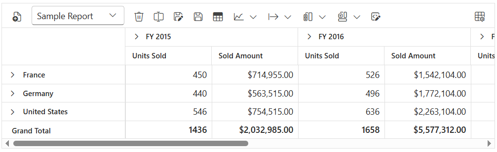
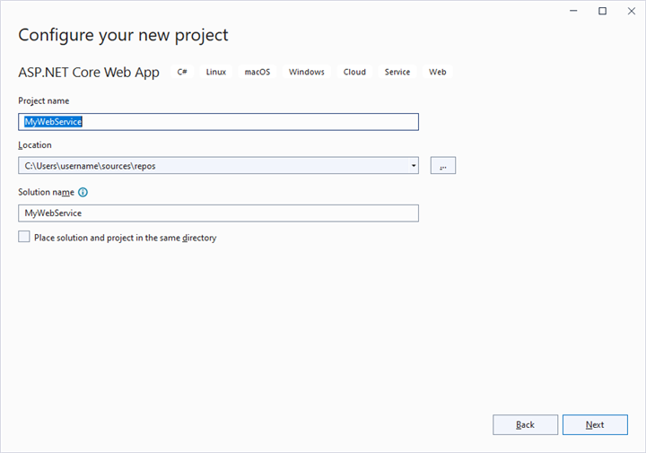
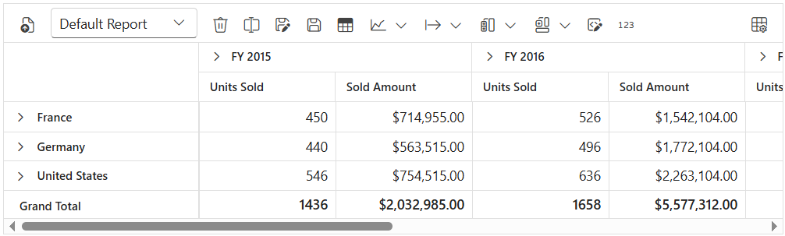

# Toolbar in Blazor Pivot Table Component

The toolbar in the Blazor Pivot Table component provides easy access to commonly used features, such as switching between a pivot table and a pivot chart, changing chart types, applying conditional formatting, exporting data, and more. To enable the toolbar, set the [ShowToolbar](https://help.syncfusion.com/cr/blazor/Syncfusion.Blazor.PivotView.SfPivotView-1.html#Syncfusion_Blazor_PivotView_SfPivotView_1_ShowToolbar) property to **true**. Additionally, the [Toolbar](https://help.syncfusion.com/cr/blazor/Syncfusion.Blazor.PivotView.SfPivotView-1.html#Syncfusion_Blazor_PivotView_SfPivotView_1_Toolbar) property accepts a collection of built-in toolbar options, allowing users to interact with the Pivot Table efficiently at runtime.

To have a quick glance on how to add and customize toolbar in the Blazor Pivot Table, watch this video:



## Built-in Toolbar Options

The following table lists the built-in toolbar options and their actions:

| Built-in Toolbar Options | Actions |
|--------------------------|---------|
| New | Creates a new report |
| Save | Saves the current report |
| Save As | Saves the current report with a new name |
| Rename | Changes the name of the current report |
| Delete | Removes the current report |
| Load | Opens a report from the report list |
| Grid | Displays the pivot table |
| Chart | Shows a pivot chart with options to select different chart types and enable or disable multiple axes |
| Exporting | Exports the pivot table as PDF, Excel, or CSV, or the pivot chart as a PDF or image |
| Sub-total | Shows or hides subtotals in the pivot table |
| Grand Total | Shows or hides grand totals in the pivot table |
| Conditional Formatting | Opens a pop-up to apply formatting to cells based on conditions |
| Number Formatting | Opens a pop-up to apply number formatting to cells |
| Field List | Opens the field list pop-up to configure the report settings |
| MDX | Displays the MDX query used to retrieve data from an OLAP data source. **Note**: This option applies only to OLAP data sources. |

N> The order of toolbar options can be changed by simply moving the position of items in the [ToolbarItems](https://help.syncfusion.com/cr/blazor/Syncfusion.Blazor.PivotView.ToolbarItems.html) collection. Also, if end user wants to remove any toolbar option from getting displayed, it can be simply ignored from adding into the [ToolbarItems](https://help.syncfusion.com/cr/blazor/Syncfusion.Blazor.PivotView.ToolbarItems.html) collection.

```cshtml
@using Syncfusion.Blazor.PivotView

<SfPivotView TValue="ProductDetails" @ref="pivot" ShowFieldList="true" ShowToolbar="true" Toolbar="@toolbar" AllowConditionalFormatting="true" AllowPdfExport="true" AllowExcelExport="true">
    <PivotViewDisplayOption Primary=Primary.Table View=View.Both></PivotViewDisplayOption>
        <PivotViewDataSourceSettings DataSource="@data" ShowGrandTotals="true" ShowSubTotals="true">
            <PivotViewColumns>
                <PivotViewColumn Name="Year"></PivotViewColumn>
                <PivotViewColumn Name="Quarter"></PivotViewColumn>
            </PivotViewColumns>
            <PivotViewRows>
                <PivotViewRow Name="Country"></PivotViewRow>
                <PivotViewRow Name="Products"></PivotViewRow>
            </PivotViewRows>
            <PivotViewValues>
                <PivotViewValue Name="Sold" Caption="Units Sold"></PivotViewValue>
                <PivotViewValue Name="Amount" Caption="Sold Amount"></PivotViewValue>
            </PivotViewValues>
            <PivotViewFormatSettings>
                <PivotViewFormatSetting Name="Amount" Format="C"></PivotViewFormatSetting>
            </PivotViewFormatSettings>
        </PivotViewDataSourceSettings>
        <PivotViewEvents TValue="ProductDetails" RenameReport="renamereport" RemoveReport="removereport" SaveReport="savereport" LoadReport="loadreport" FetchReport="fetchreport" ></PivotViewEvents>
        <PivotViewGridSettings ColumnWidth="140"></PivotViewGridSettings>
</SfPivotView>

@code{
    SfPivotView<ProductDetails> pivot;
    public List<ToolbarItems> toolbar = new List<ToolbarItems> {
        ToolbarItems.New,
        ToolbarItems.Load,
        ToolbarItems.Remove,
        ToolbarItems.Rename,
        ToolbarItems.SaveAs,
        ToolbarItems.Save,
        ToolbarItems.Grid,
        ToolbarItems.Chart,
        ToolbarItems.Export,
        ToolbarItems.SubTotal,
        ToolbarItems.GrandTotal,
        ToolbarItems.ConditionalFormatting,
        ToolbarItems.FieldList
    };
    public List<ProductDetails> data { get; set; }
    protected override void OnInitialized()
    {
        this.data = ProductDetails.GetProductData().ToList();
        //Bind the data source collection here. Refer "Assigning sample data to the pivot table" section in getting started for more details.
    }
    public List<string> report = new List<string>();
    public List<string> reportName = new List<string>();
    //to save report
    public void savereport(SaveReportArgs args)
    {
        var i = 0;
        bool isSaved = false;
        for (i = 0; i < this.reportName.Count; i++)
        {
            if (this.reportName[i] == args.ReportName)
            {
                this.report[i] = args.Report;
                isSaved = true;
            }
        }
        if (args.Report != null && !(isSaved))
        {
            this.report.Add(args.Report);
            this.reportName.Add(args.ReportName);
        }

    }
    //fetch reports
    public void fetchreport(FetchReportArgs args)
    {
        args.ReportName = this.reportName.ToArray();

    }
    //to load the selected report
    public void loadreport(LoadReportArgs args)
    {
        var i = 0;
        var j = 0;
        for (i = 0; i < this.reportName.Count; i++)
        {
            if (this.reportName[i] == args.ReportName)
            {
                j = i;
            }
        }
        this.pivot.LoadPersistDataAsync(this.report[j]);
    }
    //to delete a report
    public void removereport(RemoveReportArgs args)
    {
        var i = 0;
        for( i=0;i<this.reportName.Count; i++)
        {
            if(this.reportName[i] == args.ReportName)
            {
                this.reportName.RemoveAt(i);
                this.report.RemoveAt(i);
            }
        }
    }
    // to rename a report
    public void renamereport(RenameReportArgs args)
    {
        var i = 0;
        for( i=0;i<=(this.reportName.Count - 1); i++)
        {
            if(this.reportName[i] == args.ReportName)
            {
                this.reportName.RemoveAt(i);
                this.reportName.Add(args.Rename);
            }
        }
    }
}

```



## Show desired chart types in the dropdown menu

By default, the dropdown menu in the toolbar displays all available chart types. However, you may want to show only specific chart types in the dropdown menu based on your application’s needs. To do this, use the [ChartTypes](https://help.syncfusion.com/cr/blazor/Syncfusion.Blazor.PivotView.SfPivotView-1.html#Syncfusion_Blazor_PivotView_SfPivotView_1_ChartTypes) property. This property allows you to define a list of chart types that will appear in the dropdown menu, ensuring users see only the options you select.

For example, if you want the dropdown menu to show only the Column, Bar, Line, and Area chart types, you can set the [ChartTypes](https://help.syncfusion.com/cr/blazor/Syncfusion.Blazor.PivotView.SfPivotView-1.html#Syncfusion_Blazor_PivotView_SfPivotView_1_ChartTypes) property to include these specific options. This makes the pivot chart easier to use by limiting the choices to those most relevant for your data.

To learn more about the supported chart types, see the [Pivot Chart documentation](https://blazor.syncfusion.com/documentation/pivot-table/pivot-chart#chart-types).

```cshtml
@using Syncfusion.Blazor.PivotView

<SfPivotView TValue="ProductDetails" ShowToolbar="true" Toolbar="@toolbar" ChartTypes="@chartTypes">
    <PivotViewDisplayOption Primary=Primary.Table View=View.Both></PivotViewDisplayOption>
        <PivotViewDataSourceSettings DataSource="@data">
            <PivotViewColumns>
                <PivotViewColumn Name="Year"></PivotViewColumn>
                <PivotViewColumn Name="Quarter"></PivotViewColumn>
            </PivotViewColumns>
            <PivotViewRows>
                <PivotViewRow Name="Country"></PivotViewRow>
                <PivotViewRow Name="Products"></PivotViewRow>
            </PivotViewRows>
            <PivotViewValues>
                <PivotViewValue Name="Sold" Caption="Units Sold"></PivotViewValue>
                <PivotViewValue Name="Amount" Caption="Sold Amount"></PivotViewValue>
            </PivotViewValues>
            <PivotViewFormatSettings>
                <PivotViewFormatSetting Name="Amount" Format="C"></PivotViewFormatSetting>
            </PivotViewFormatSettings>
        </PivotViewDataSourceSettings>
        <PivotViewGridSettings ColumnWidth="140"></PivotViewGridSettings>
</SfPivotView>

@code{
    public List<ToolbarItems> toolbar = new List<ToolbarItems> {
        ToolbarItems.Grid,
        ToolbarItems.Chart,
    };
    public List<ChartSeriesType> chartTypes = new List <ChartSeriesType> {
        ChartSeriesType.Column,
        ChartSeriesType.Bar,
        ChartSeriesType.Line,
        ChartSeriesType.Area,
    };
    public List<ProductDetails> data { get; set; }
    protected override void OnInitialized()
    {
        this.data = ProductDetails.GetProductData().ToList();
        //Bind the data source collection here. Refer "Assigning sample data to the pivot table" section in getting started for more details.
    }
}

```


## Switch the chart to multiple axes

In the pivot chart, users can switch between a single axis and multiple axes using a built-in checkbox located in the chart type dropdown menu on the toolbar. This option allows users to display data on multiple axes for better visualization. For more details, [refer here](https://blazor.syncfusion.com/documentation/pivot-table/pivot-chart#multi-axis).


## Show or hide legend

In the pivot chart, you can show or hide the legend dynamically using an option in the chart type drop-down menu on the toolbar. This allows you to control whether the legend appears alongside the chart. For accumulation chart types, such as pie, doughnut, pyramid, and funnel, the legend is hidden by default. You can enable or disable the legend using a built-in checkbox available in the drop-down menu.


## Save and load reports to a SQL database

SQL Server is a relational database management system (RDBMS) that can be used to store and manage large amounts of data. In this topic, we will see how to save, save as, rename, load, delete, and add reports between a SQL Server database and a Blazor Pivot Table at runtime.

### Connecting a SQL Server database in a Blazor application

**1.** Create a simple Blazor Pivot Table by following the **"Getting Started"** documentation [link](./getting-started).

**2.** To connect a SQL Server database using the Microsoft SqlClient in our application, we need to install the [Microsoft.Data.SqlClient](https://www.nuget.org/packages/Microsoft.Data.SqlClient) NuGet package. To do so, open the NuGet package manager of the project solution, search for the package **Microsoft.Data.SqlClient** and install it.


**3.** Next, in the **Index.razor** page, the **OpenConnection** method is used to connect to the SQL database. The **GetDataTable** method then processes the specified SQL query string, retrieves data from the database, and converts it into a **DataTable** using **SqlCommand** and **SqlDataAdapter**. This **DataTable** can be used to retrieve saved reports and modify them further as shown in the code block below.

```cshtml
@using System.Data
@using Microsoft.Data.SqlClient;
@using EFPivotTable.Data;

<SfPivotView @ref=PivotRef TValue="ProductDetails" ID="pivot-table" Height="450" Width="700" ShowToolbar="true" ShowFieldList=true AllowExcelExport=true AllowPdfExport=true Toolbar="@PivotToolbar">
    //Bind the report here...
    <PivotViewEvents TValue="ProductDetails" SaveReport="SaveReport" LoadReport="LoadReport" RenameReport="RenameReport" RemoveReport="RemoveReport" FetchReport="FetchReport"></PivotViewEvents>
</SfPivotView>

@code {
    SfPivotView<ProductDetails> PivotRef { get; set; }

    public List<ProductDetails> DataSource { get; set; }
    public List<ToolbarItems> PivotToolbar = new List<ToolbarItems> {
        ToolbarItems.New,
        ToolbarItems.Save,
        ToolbarItems.SaveAs,
        ToolbarItems.Rename,
        ToolbarItems.Remove,
        ToolbarItems.Load,
        ToolbarItems.Grid,
        ToolbarItems.Chart,
        ToolbarItems.Export,
        ToolbarItems.SubTotal,
        ToolbarItems.GrandTotal,
        ToolbarItems.FieldList
    };
    protected override void OnInitialized()
    {
        this.DataSource = ProductDetails.GetProductData().ToList();
    }

    public void SaveReport(SaveReportArgs args)
    {
        SaveReportToDB(args.ReportName, args.Report);
    }

    public void FetchReport(FetchReportArgs args)
    {
        args.ReportName = FetchReportListFromDB().ToArray();
    }

    public async Task LoadReport(LoadReportArgs args)
    {
        await this.PivotRef.LoadPersistDataAsync(LoadReportFromDB(args.ReportName).ToString());
    }

    public void RemoveReport(RemoveReportArgs args)
    {
        RemoveReportFromDB(args.ReportName);
    }
    
    public void RenameReport(RenameReportArgs args)
    {
        RenameReportInDB(args.ReportName, args.Rename, args.IsReportExists);
    }

    public void SaveReportToDB(string reportName, string report)
    {
        SqlConnection sqlConn = OpenConnection();
        bool isDuplicate = true;
        SqlCommand cmd1 = null;
        foreach (DataRow row in GetDataTable(sqlConn).Rows)
        {
            if ((row["ReportName"] as string).Equals(reportName))
            {
                isDuplicate = false;
                cmd1 = new SqlCommand("UPDATE ReportTable set Report=@Report where ReportName like @ReportName", sqlConn);
            }
        }
        if (isDuplicate)
        {
            cmd1 = new SqlCommand("INSERT into ReportTable (ReportName,Report) Values(@ReportName,@Report)", sqlConn);
        }
        cmd1.Parameters.AddWithValue("@ReportName", reportName);
        cmd1.Parameters.AddWithValue("@Report", report.ToString());
        cmd1.ExecuteNonQuery();
        sqlConn.Close();
    }
    public object LoadReportFromDB(string reportName)
    {
        SqlConnection sqlConn = OpenConnection();
        string report = string.Empty;
        foreach (DataRow row in GetDataTable(sqlConn).Rows)
        {
            if ((row["ReportName"] as string).Equals(reportName))
            {
                report = (string)row["Report"];
                break;
            }
        }
        sqlConn.Close();
        return report;
    }
    public List<string> FetchReportListFromDB()
    {
        SqlConnection sqlConn = OpenConnection();
        List<string> reportNames = new List<string>();
        foreach (DataRow row in GetDataTable(sqlConn).Rows)
        {
            if (!string.IsNullOrEmpty(row["ReportName"] as string))
            {
                reportNames.Add(row["ReportName"].ToString());
            }
        }
        sqlConn.Close();
        return reportNames;
    }
    public void RenameReportInDB(string reportName, string renameReport, bool isReportExists)
    {
        SqlConnection sqlConn = OpenConnection();
        SqlCommand cmd1 = null;
        if (isReportExists)
        {
            foreach (DataRow row in GetDataTable(sqlConn).Rows)
            {
                if ((row["ReportName"] as string).Equals(renameReport))
                {
                    cmd1 = new SqlCommand("DELETE FROM ReportTable WHERE ReportName LIKE '%" + renameReport + "%'", sqlConn);
                    break;
                }
            }
            cmd1.ExecuteNonQuery();
        }
        foreach (DataRow row in GetDataTable(sqlConn).Rows)
        {
            if ((row["ReportName"] as string).Equals(reportName))
            {
                cmd1 = new SqlCommand("UPDATE ReportTable set ReportName=@RenameReport where ReportName like '%" + reportName + "%'", sqlConn);
                break;
            }
        }
        cmd1.Parameters.AddWithValue("@RenameReport", renameReport);
        cmd1.ExecuteNonQuery();
        sqlConn.Close();
    }
    public void RemoveReportFromDB(string reportName)
    {
        SqlConnection sqlConn = OpenConnection();
        SqlCommand cmd1 = null;
        foreach (DataRow row in GetDataTable(sqlConn).Rows)
        {
            if ((row["ReportName"] as string).Equals(reportName))
            {
                cmd1 = new SqlCommand("DELETE FROM ReportTable WHERE ReportName LIKE '%" + reportName + "%'", sqlConn);
                break;
            }
        }
        cmd1.ExecuteNonQuery();
        sqlConn.Close();
    }
    private SqlConnection OpenConnection()
    {
        // Replace with your own connection string.
        string connectionString = @"<Enter your valid connection string here>";
        SqlConnection sqlConn = new SqlConnection(connectionString);
        sqlConn.Open();
        return sqlConn;
    }

    private DataTable GetDataTable(SqlConnection sqlConn)
    {
        string xquery = "SELECT * FROM ReportTable";
        SqlCommand cmd = new SqlCommand(xquery, sqlConn);
        SqlDataAdapter da = new SqlDataAdapter(cmd);
        DataTable dt = new DataTable();
        da.Fill(dt);
        return dt;
    }
}

```

Further, let us explore more on how to save, load, rename, delete, and add reports in the SQL database using **SqlConnection**.

#### Saving a report

When you select the **"Save a report"** option from the toolbar, the [SaveReport](#savereport) event is triggered. In this event, **SaveReportToDB** method is called passing the name of the current report and the current report, which you can use to check and save in the SQL database.

For example, the report shown in the following code snippet will be passed to the **SaveReportToDB** method along with the report name **"Sample Report"** and saved in the SQL database.

```cshtml
@using System.Data
@using Microsoft.Data.SqlClient;
@using EFPivotTable.Data;

<SfPivotView @ref=PivotRef TValue="ProductDetails" ID="pivot-table" Height="450" Width="700" ShowToolbar="true" ShowFieldList=true AllowExcelExport=true AllowPdfExport=true Toolbar="@PivotToolbar">
    <PivotViewDisplayOption View="View.Both"></PivotViewDisplayOption>
    <PivotViewDataSourceSettings DataSource="@DataSource" EnableSorting="true">
        <PivotViewColumns>
            <PivotViewColumn Name="Year"></PivotViewColumn>
            <PivotViewColumn Name="Quarter"></PivotViewColumn>
        </PivotViewColumns>
        <PivotViewRows>
            <PivotViewRow Name="Country"></PivotViewRow>
            <PivotViewRow Name="Products"></PivotViewRow>
        </PivotViewRows>
        <PivotViewValues>
            <PivotViewValue Name="Sold" Caption="Units Sold"></PivotViewValue>
            <PivotViewValue Name="Amount" Caption="Sold Amount"></PivotViewValue>
        </PivotViewValues>
        <PivotViewFormatSettings>
            <PivotViewFormatSetting Name="Amount" Format="C"></PivotViewFormatSetting>
            <PivotViewFormatSetting Name="Sold" Format="N0"></PivotViewFormatSetting>
        </PivotViewFormatSettings>
    </PivotViewDataSourceSettings>
    <PivotViewEvents TValue="ProductDetails" SaveReport="SaveReport"></PivotViewEvents>
</SfPivotView>

@code {
    SfPivotView<ProductDetails> PivotRef { get; set; }

    public List<ProductDetails> DataSource { get; set; }
    public List<ToolbarItems> PivotToolbar = new List<ToolbarItems> {
        ToolbarItems.New,
        ToolbarItems.Save,
        ToolbarItems.SaveAs,
        ToolbarItems.Rename,
        ToolbarItems.Remove,
        ToolbarItems.Load,
        ToolbarItems.Grid,
        ToolbarItems.Chart,
        ToolbarItems.Export,
        ToolbarItems.SubTotal,
        ToolbarItems.GrandTotal,
        ToolbarItems.FieldList
    };
    protected override void OnInitialized()
    {
        this.DataSource = ProductDetails.GetProductData().ToList();
    }

    public void SaveReport(SaveReportArgs args)
    {
        SaveReportToDB(args.ReportName, args.Report);
    }

    public void SaveReportToDB(string reportName, string report)
    {
        SqlConnection sqlConn = OpenConnection();
        bool isDuplicate = true;
        SqlCommand cmd1 = null;
        foreach (DataRow row in GetDataTable(sqlConn).Rows)
        {
            if ((row["ReportName"] as string).Equals(reportName))
            {
                isDuplicate = false;
                cmd1 = new SqlCommand("UPDATE ReportTable set Report=@Report where ReportName like @ReportName", sqlConn);
            }
        }
        if (isDuplicate)
        {
            cmd1 = new SqlCommand("INSERT into ReportTable (ReportName,Report) Values(@ReportName,@Report)", sqlConn);
        }
        cmd1.Parameters.AddWithValue("@ReportName", reportName);
        cmd1.Parameters.AddWithValue("@Report", report.ToString());
        cmd1.ExecuteNonQuery();
        sqlConn.Close();
    }

    private SqlConnection OpenConnection()
    {
        // Replace with your own connection string.
        string connectionString = @"<Enter your valid connection string here>";
        SqlConnection sqlConn = new SqlConnection(connectionString);
        sqlConn.Open();
        return sqlConn;
    }

    private DataTable GetDataTable(SqlConnection sqlConn)
    {
        string xquery = "SELECT * FROM ReportTable";
        SqlCommand cmd = new SqlCommand(xquery, sqlConn);
        SqlDataAdapter da = new SqlDataAdapter(cmd);
        DataTable dt = new DataTable();
        da.Fill(dt);
        return dt;
    }
}

```


In the meantime, you can save a duplicate of the current report to the SQL Server database with a different name by selecting **"Save as current report"** from the toolbar. The [SaveReport](#savereport) event will then be triggered with the new report name **"Sample Report 1"** and the current report. You can save them to the SQL Server database after passing them to the **SaveReportToDB** method, as mentioned above.


#### Loading a report

When you select the dropdown menu item from the toolbar, the [LoadReport](#loadreport) event is triggered. In this event, **LoadReportFromDB** method is called passing the name of the selected report. The method uses this information to search for the report in the SQL database, fetch it, and load it into the pivot table.

For example, if the report name **"Sample Report 1"** is selected from a dropdown menu and passed, the **LoadReportFromDB** method will use that name to search for the report in the SQL database, retrieve it, and then load it into the pivot table.

```cshtml
@using System.Data
@using Microsoft.Data.SqlClient;
@using EFPivotTable.Data;

<SfPivotView @ref=PivotRef TValue="ProductDetails" ID="pivot-table" Height="450" Width="700" ShowToolbar="true" ShowFieldList=true AllowExcelExport=true AllowPdfExport=true Toolbar="@PivotToolbar">
    <PivotViewDisplayOption View="View.Both"></PivotViewDisplayOption>
    <PivotViewDataSourceSettings DataSource="@DataSource" EnableSorting="true">
        <PivotViewColumns>
            <PivotViewColumn Name="Year"></PivotViewColumn>
            <PivotViewColumn Name="Quarter"></PivotViewColumn>
        </PivotViewColumns>
        <PivotViewRows>
            <PivotViewRow Name="Country"></PivotViewRow>
            <PivotViewRow Name="Products"></PivotViewRow>
        </PivotViewRows>
        <PivotViewValues>
            <PivotViewValue Name="Sold" Caption="Units Sold"></PivotViewValue>
            <PivotViewValue Name="Amount" Caption="Sold Amount"></PivotViewValue>
        </PivotViewValues>
        <PivotViewFormatSettings>
            <PivotViewFormatSetting Name="Amount" Format="C"></PivotViewFormatSetting>
            <PivotViewFormatSetting Name="Sold" Format="N0"></PivotViewFormatSetting>
        </PivotViewFormatSettings>
    </PivotViewDataSourceSettings>
    <PivotViewEvents TValue="ProductDetails" LoadReport="LoadReport"></PivotViewEvents>
</SfPivotView>

@code {
    SfPivotView<ProductDetails> PivotRef { get; set; }

    public List<ProductDetails> DataSource { get; set; }
    public List<ToolbarItems> PivotToolbar = new List<ToolbarItems> {
        ToolbarItems.New,
        ToolbarItems.Save,
        ToolbarItems.SaveAs,
        ToolbarItems.Rename,
        ToolbarItems.Remove,
        ToolbarItems.Load,
        ToolbarItems.Grid,
        ToolbarItems.Chart,
        ToolbarItems.Export,
        ToolbarItems.SubTotal,
        ToolbarItems.GrandTotal,
        ToolbarItems.FieldList
    };
    protected override void OnInitialized()
    {
        this.DataSource = ProductDetails.GetProductData().ToList();
    }

    public async Task LoadReport(LoadReportArgs args)
    {
        await this.PivotRef.LoadPersistDataAsync(LoadReportFromDB(args.ReportName).ToString());
    }

    public object LoadReportFromDB(string reportName)
    {
        SqlConnection sqlConn = OpenConnection();
        string report = string.Empty;
        foreach (DataRow row in GetDataTable(sqlConn).Rows)
        {
            if ((row["ReportName"] as string).Equals(reportName))
            {
                report = (string)row["Report"];
                break;
            }
        }
        sqlConn.Close();
        return report;
    }
    
    private SqlConnection OpenConnection()
    {
        // Replace with your own connection string.
        string connectionString = @"<Enter your valid connection string here>";
        SqlConnection sqlConn = new SqlConnection(connectionString);
        sqlConn.Open();
        return sqlConn;
    }

    private DataTable GetDataTable(SqlConnection sqlConn)
    {
        string xquery = "SELECT * FROM ReportTable";
        SqlCommand cmd = new SqlCommand(xquery, sqlConn);
        SqlDataAdapter da = new SqlDataAdapter(cmd);
        DataTable dt = new DataTable();
        da.Fill(dt);
        return dt;
    }
}

```


#### Renaming a report

When you select the **"Rename a current report"** option from the toolbar, the [RenameReport](#renamereport) event is triggered. In this event, **RenameReportInDB** method is called passing the current and new report names, where you can use the current report name to identify the report and resave it with the new report name in the SQL database.

For example, if we rename the current report from **"Sample Report 1"** to **"Sample Report 2"**, both **"Sample Report 1"** and **"Sample Report 2"** will be passed to the **RenameReportInDB** method, which will rename the current report with the new report name **"Sample Report 2"** in the SQL database.

```cshtml
@using System.Data
@using Microsoft.Data.SqlClient;
@using EFPivotTable.Data;

<SfPivotView @ref=PivotRef TValue="ProductDetails" ID="pivot-table" Height="450" Width="700" ShowToolbar="true" ShowFieldList=true AllowExcelExport=true AllowPdfExport=true Toolbar="@PivotToolbar">
    <PivotViewDisplayOption View="View.Both"></PivotViewDisplayOption>
    <PivotViewDataSourceSettings DataSource="@DataSource" EnableSorting="true">
        <PivotViewColumns>
            <PivotViewColumn Name="Year"></PivotViewColumn>
            <PivotViewColumn Name="Quarter"></PivotViewColumn>
        </PivotViewColumns>
        <PivotViewRows>
            <PivotViewRow Name="Country"></PivotViewRow>
            <PivotViewRow Name="Products"></PivotViewRow>
        </PivotViewRows>
        <PivotViewValues>
            <PivotViewValue Name="Sold" Caption="Units Sold"></PivotViewValue>
            <PivotViewValue Name="Amount" Caption="Sold Amount"></PivotViewValue>
        </PivotViewValues>
        <PivotViewFormatSettings>
            <PivotViewFormatSetting Name="Amount" Format="C"></PivotViewFormatSetting>
            <PivotViewFormatSetting Name="Sold" Format="N0"></PivotViewFormatSetting>
        </PivotViewFormatSettings>
    </PivotViewDataSourceSettings>
    <PivotViewEvents TValue="ProductDetails" RenameReport="RenameReport"></PivotViewEvents>
</SfPivotView>

@code {
    SfPivotView<ProductDetails> PivotRef { get; set; }

    public List<ProductDetails> DataSource { get; set; }
    public List<ToolbarItems> PivotToolbar = new List<ToolbarItems> {
        ToolbarItems.New,
        ToolbarItems.Save,
        ToolbarItems.SaveAs,
        ToolbarItems.Rename,
        ToolbarItems.Remove,
        ToolbarItems.Load,
        ToolbarItems.Grid,
        ToolbarItems.Chart,
        ToolbarItems.Export,
        ToolbarItems.SubTotal,
        ToolbarItems.GrandTotal,
        ToolbarItems.FieldList
    };
    protected override void OnInitialized()
    {
        this.DataSource = ProductDetails.GetProductData().ToList();
    }

    // To rename a report
    public void RenameReport(RenameReportArgs args)
    {
        RenameReportInDB(args.ReportName, args.Rename, args.IsReportExists);
    }

    public void RenameReportInDB(string reportName, string renameReport, bool isReportExists)
    {
        SqlConnection sqlConn = OpenConnection();
        SqlCommand cmd1 = null;
        if (isReportExists)
        {
            foreach (DataRow row in GetDataTable(sqlConn).Rows)
            {
                if ((row["ReportName"] as string).Equals(renameReport))
                {
                    cmd1 = new SqlCommand("DELETE FROM ReportTable WHERE ReportName LIKE '%" + renameReport + "%'", sqlConn);
                    break;
                }
            }
            cmd1.ExecuteNonQuery();
        }
        foreach (DataRow row in GetDataTable(sqlConn).Rows)
        {
            if ((row["ReportName"] as string).Equals(reportName))
            {
                cmd1 = new SqlCommand("UPDATE ReportTable set ReportName=@RenameReport where ReportName like '%" + reportName + "%'", sqlConn);
                break;
            }
        }
        cmd1.Parameters.AddWithValue("@RenameReport", renameReport);
        cmd1.ExecuteNonQuery();
        sqlConn.Close();
    }
    private SqlConnection OpenConnection()
    {
        // Replace with your own connection string.
        string connectionString = @"<Enter your valid connection string here>";
        SqlConnection sqlConn = new SqlConnection(connectionString);
        sqlConn.Open();
        return sqlConn;
    }

    private DataTable GetDataTable(SqlConnection sqlConn)
    {
        string xquery = "SELECT * FROM ReportTable";
        SqlCommand cmd = new SqlCommand(xquery, sqlConn);
        SqlDataAdapter da = new SqlDataAdapter(cmd);
        DataTable dt = new DataTable();
        da.Fill(dt);
        return dt;
    }
}

```


#### Deleting a report

When you select the **"Delete a current report"** option from the toolbar, the [removeReport](#removereport) event is triggered. In this event, **RemoveReportFromDB** method is called passing the current report name to identify and delete the appropriate report from the SQL database.

N> * If the current report **n** from the pivot table is deleted, the pivot table will automatically load the next report from the report list.
N> * When a report is removed from a pivot table with only one report, the SQL database refreshes; however, the pivot table will continue to show the removed report until a new report is added to the pivot table.

For example, if we delete the current report **"Sample Report 2"** from the pivot table, the current report name **"Sample Report 2"** is passed to the **RemoveReportFromDB** method, which allows you to identify and delete the report from the SQL database.

```cshtml
@using System.Data
@using Microsoft.Data.SqlClient;
@using EFPivotTable.Data;

<SfPivotView @ref=PivotRef TValue="ProductDetails" ID="pivot-table" Height="450" Width="700" ShowToolbar="true" ShowFieldList=true AllowExcelExport=true AllowPdfExport=true Toolbar="@PivotToolbar">
    <PivotViewDisplayOption View="View.Both"></PivotViewDisplayOption>
    <PivotViewDataSourceSettings DataSource="@DataSource" EnableSorting="true">
        <PivotViewColumns>
            <PivotViewColumn Name="Year"></PivotViewColumn>
            <PivotViewColumn Name="Quarter"></PivotViewColumn>
        </PivotViewColumns>
        <PivotViewRows>
            <PivotViewRow Name="Country"></PivotViewRow>
            <PivotViewRow Name="Products"></PivotViewRow>
        </PivotViewRows>
        <PivotViewValues>
            <PivotViewValue Name="Sold" Caption="Units Sold"></PivotViewValue>
            <PivotViewValue Name="Amount" Caption="Sold Amount"></PivotViewValue>
        </PivotViewValues>
        <PivotViewFormatSettings>
            <PivotViewFormatSetting Name="Amount" Format="C"></PivotViewFormatSetting>
            <PivotViewFormatSetting Name="Sold" Format="N0"></PivotViewFormatSetting>
        </PivotViewFormatSettings>
    </PivotViewDataSourceSettings>
    <PivotViewEvents TValue="ProductDetails" RemoveReport="RemoveReport"></PivotViewEvents>
</SfPivotView>

@code {
    SfPivotView<ProductDetails> PivotRef { get; set; }

    public List<ProductDetails> DataSource { get; set; }
    public List<ToolbarItems> PivotToolbar = new List<ToolbarItems> {
        ToolbarItems.New,
        ToolbarItems.Save,
        ToolbarItems.SaveAs,
        ToolbarItems.Rename,
        ToolbarItems.Remove,
        ToolbarItems.Load,
        ToolbarItems.Grid,
        ToolbarItems.Chart,
        ToolbarItems.Export,
        ToolbarItems.SubTotal,
        ToolbarItems.GrandTotal,
        ToolbarItems.FieldList
    };
    protected override void OnInitialized()
    {
        this.DataSource = ProductDetails.GetProductData().ToList();
    }

    // To delete a report
    public void RemoveReport(RemoveReportArgs args)
    {
        RemoveReportFromDB(args.ReportName);
    }

    public void RemoveReportFromDB(string reportName)
    {
        SqlConnection sqlConn = OpenConnection();
        SqlCommand cmd1 = null;
        foreach (DataRow row in GetDataTable(sqlConn).Rows)
        {
            if ((row["ReportName"] as string).Equals(reportName))
            {
                cmd1 = new SqlCommand("DELETE FROM ReportTable WHERE ReportName LIKE '%" + reportName + "%'", sqlConn);
                break;
            }
        }
        cmd1.ExecuteNonQuery();
        sqlConn.Close();
    }
    private SqlConnection OpenConnection()
    {
        // Replace with your own connection string.
        string connectionString = @"<Enter your valid connection string here>";
        SqlConnection sqlConn = new SqlConnection(connectionString);
        sqlConn.Open();
        return sqlConn;
    }

    private DataTable GetDataTable(SqlConnection sqlConn)
    {
        string xquery = "SELECT * FROM ReportTable";
        SqlCommand cmd = new SqlCommand(xquery, sqlConn);
        SqlDataAdapter da = new SqlDataAdapter(cmd);
        DataTable dt = new DataTable();
        da.Fill(dt);
        return dt;
    }
}

```


#### Adding a report

When you select the **"Create a new report"** option from the toolbar, the [NewReport](#newreport) event is triggered, followed by the [SaveReport](#savereport) event. To save this new report to the SQL database, the [SaveReport](#savereport) event triggered later, and then follow the save report briefing in the preceding [topic](#saving-a-report).


> In [this](https://github.com/SyncfusionExamples/Save-and-load-report-from-SQL-database-to-blazor-pivot-table) GitHub repository, you can find our Blazor Pivot Table sample to save and load reports from SQL Server database.

### Create a Web API service to connect to a SQL Server database

**1.** Open Visual Studio and create an ASP.NET Core Web App project type, naming it **MyWebService**. To create an ASP.NET Core Web application, follow the document [link](https://learn.microsoft.com/en-us/visualstudio/get-started/csharp/tutorial-aspnet-core?view=vs-2022).



**2.** To connect a SQL Server database using the Microsoft SqlClient in our application, we need to install the [Microsoft.Data.SqlClient](https://www.nuget.org/packages/Microsoft.Data.SqlClient) NuGet package. To do so, open the NuGet package manager of the project solution, search for the package **Microsoft.Data.SqlClient** and install it.


**3.** Under the **Controllers** folder, create a Web API controller (aka, PivotController.cs) file that aids in data communication with the Pivot Table.

**4.** In the Web API Controller (aka, PivotController), the **OpenConnection** method is used to connect to the SQL database. The **GetDataTable** method then processes the specified SQL query string, retrieves data from the database, and converts it into a **DataTable** using **SqlCommand** and **SqlDataAdapter**. This **DataTable** can be used to retrieve saved reports and modify them further as shown in the code block below.

[PivotController.cs]
```csharp
using Microsoft.AspNetCore.Mvc;
using System.Data;
using System.Data.SqlClient;

namespace MyWebService.Controllers
{
    public class PivotController : ControllerBase
    {
        [HttpPost]
        [Route("Pivot/SaveReport")]
        public void SaveReport([FromBody] Dictionary<string, string> reportArgs)
        {
            SaveReportToDB(reportArgs["reportName"], reportArgs["report"]);
        }

        [HttpPost]
        [Route("Pivot/FetchReport")]
        public IActionResult FetchReport()
        {
            return Ok((FetchReportListFromDB()));
        }

        [HttpPost]
        [Route("Pivot/RemoveReport")]
        public void RemoveReport([FromBody] Dictionary<string, string> reportArgs)
        {
            RemoveReportFromDB(reportArgs["reportName"]);
        }

        [HttpPost]
        [Route("Pivot/RenameReport")]
        public void RenameReport([FromBody] RenameReportDB reportArgs)
        {
            RenameReportInDB(reportArgs.ReportName, reportArgs.RenameReport, reportArgs.IsReportExists);
        }

        [HttpPost]
        [Route("Pivot/LoadReport")]
        public IActionResult LoadReport([FromBody] Dictionary<string, string> reportArgs)
        {
            return Ok((LoadReportFromDB(reportArgs["reportName"])));
        }

        public class RenameReportDB
        {
            public string ReportName { get; set; }
            public string RenameReport { get; set; }
            public bool IsReportExists { get; set; }
        }

        private void SaveReportToDB(string reportName, string report)
        {
            SqlConnection sqlConn = OpenConnection();
            bool isDuplicate = true;
            SqlCommand cmd1 = null;
            foreach (DataRow row in GetDataTable(sqlConn).Rows)
            {
                if ((row["ReportName"] as string).Equals(reportName))
                {
                    isDuplicate = false;
                    cmd1 = new SqlCommand("update ReportTable set Report=@Report where ReportName like @ReportName", sqlConn);
                }
            }
            if (isDuplicate)
            {
                cmd1 = new SqlCommand("insert into ReportTable (ReportName,Report) Values(@ReportName,@Report)", sqlConn);
            }
            cmd1.Parameters.AddWithValue("@ReportName", reportName);
            cmd1.Parameters.AddWithValue("@Report", report.ToString());
            cmd1.ExecuteNonQuery();
            sqlConn.Close();
        }

        private void RemoveReportFromDB(string reportName)
        {
            SqlConnection sqlConn = OpenConnection();
            SqlCommand cmd1 = null;
            foreach (DataRow row in GetDataTable(sqlConn).Rows)
            {
                if ((row["ReportName"] as string).Equals(reportName))
                {
                    cmd1 = new SqlCommand("delete from ReportTable where ReportName like '%" + reportName + "%'", sqlConn);
                    break;
                }
            }
            cmd1.ExecuteNonQuery();
            sqlConn.Close();
        }

        private void RenameReportInDB(string reportName, string renameReport, bool isReportExists)
        {
            SqlConnection sqlConn = OpenConnection();
            SqlCommand cmd1 = null;
            if (isReportExists)
            {
                foreach (DataRow row in GetDataTable(sqlConn).Rows)
                {
                    if ((row["ReportName"] as string).Equals(renameReport))
                    {
                        cmd1 = new SqlCommand("delete from ReportTable where ReportName like '%" + renameReport + "%'", sqlConn);
                        break;
                    }
                }
                cmd1.ExecuteNonQuery();
            }
            foreach (DataRow row in GetDataTable(sqlConn).Rows)
            {
                if ((row["ReportName"] as string).Equals(reportName))
                {
                    cmd1 = new SqlCommand("update ReportTable set ReportName=@RenameReport where ReportName like '%" + reportName + "%'", sqlConn);
                    break;
                }
            }
            cmd1.Parameters.AddWithValue("@RenameReport", renameReport);
            cmd1.ExecuteNonQuery();
            sqlConn.Close();
        }

        private List<string> FetchReportListFromDB()
        {
            SqlConnection sqlConn = OpenConnection();
            List<string> reportNames = new List<string>();
            foreach (DataRow row in GetDataTable(sqlConn).Rows)
            {
                if (!string.IsNullOrEmpty(row["ReportName"] as string))
                {
                    reportNames.Add(row["ReportName"].ToString());
                }
            }
            sqlConn.Close();
            return reportNames;
        }

        private string LoadReportFromDB(string reportName)
        {
            SqlConnection sqlConn = OpenConnection();
            string report = string.Empty;
            foreach (DataRow row in GetDataTable(sqlConn).Rows)
            {
                if ((row["ReportName"] as string).Equals(reportName))
                {
                    report = (string)row["Report"];
                    break;
                }
            }
            sqlConn.Close();
            return report;
        }

        private SqlConnection OpenConnection()
        {
            string connectionString = @"<Enter your valid connection string here>";
            SqlConnection sqlConn = new SqlConnection(connectionString);
            sqlConn.Open();
            return sqlConn;
        }

        private DataTable GetDataTable(SqlConnection sqlConn)
        {
            string xquery = "select * from ReportTable";
            SqlCommand cmd = new SqlCommand(xquery, sqlConn);
            SqlDataAdapter da = new SqlDataAdapter(cmd);
            DataTable dt = new DataTable();
            da.Fill(dt);
            return dt;
        }
    }
}

```

**5.** When you run the app, it will be hosted at `https://localhost:44313`. You can use the hosted URL to save and load reports in the SQL database from the Pivot Table.

Further, let us explore more on how to save, load, rename, delete, and add reports using the built-in toolbar options via Web API controller (aka, PivotController) one-by-one.

#### Saving a report

When you select the **"Save a report"** option from the toolbar, the [SaveReport](#savereport) event is triggered. In this event, a HTTP request is made to the Web API controller's **SaveReport** method, passing the name of the current report and the current report, which you can use to check and save in the SQL database.

For example, the report shown in the following code snippet will be passed to the **SaveReport** method along with the report name **"Sample Report"** and saved in the SQL database.

[Index.razor]
```cshtml
@using System.Data
@using MyBlazorServerApp.Data;
@using System.Net.Http;
@using System.Text.Json;
@using System.Threading.Tasks;

<SfPivotView @ref=PivotRef TValue="ProductDetails" ID="pivot-table" Height="450" Width="650" ShowToolbar="true" ShowFieldList=true AllowExcelExport=true AllowPdfExport=true Toolbar="@PivotToolbar">
    <PivotViewDisplayOption View="View.Both"></PivotViewDisplayOption>
    <PivotViewDataSourceSettings DataSource="@DataSource" EnableSorting="true">
        <PivotViewColumns>
            <PivotViewColumn Name="Year"></PivotViewColumn>
            <PivotViewColumn Name="Quarter"></PivotViewColumn>
        </PivotViewColumns>
        <PivotViewRows>
            <PivotViewRow Name="Country"></PivotViewRow>
            <PivotViewRow Name="Products"></PivotViewRow>
        </PivotViewRows>
        <PivotViewValues>
            <PivotViewValue Name="Sold" Caption="Units Sold"></PivotViewValue>
            <PivotViewValue Name="Amount" Caption="Sold Amount"></PivotViewValue>
        </PivotViewValues>
        <PivotViewFormatSettings>
            <PivotViewFormatSetting Name="Amount" Format="C"></PivotViewFormatSetting>
            <PivotViewFormatSetting Name="Sold" Format="N0"></PivotViewFormatSetting>
        </PivotViewFormatSettings>
    </PivotViewDataSourceSettings>
    <PivotViewEvents TValue="ProductDetails" SaveReport="SaveReport"></PivotViewEvents>
</SfPivotView>

@code {
    SfPivotView<ProductDetails> PivotRef { get; set; }

    public List<ProductDetails> DataSource { get; set; }
    public List<ToolbarItems> PivotToolbar = new List<ToolbarItems> {
        ToolbarItems.New,
        ToolbarItems.Save,
        ToolbarItems.SaveAs,
        ToolbarItems.Rename,
        ToolbarItems.Remove,
        ToolbarItems.Load,
        ToolbarItems.Grid,
        ToolbarItems.Chart,
        ToolbarItems.Export,
        ToolbarItems.SubTotal,
        ToolbarItems.GrandTotal,
        ToolbarItems.FieldList
    };
    protected override void OnInitialized()
    {
        this.DataSource = ProductDetails.GetProductData().ToList();
    }
    // To save a report
    public async Task SaveReport(SaveReportArgs args)
    {
        string url = "https://localhost:44313/Pivot/SaveReport";
        var data = new { reportName = args.ReportName, report = args.Report };
        HttpContent content = new StringContent(JsonSerializer.Serialize(data), System.Text.Encoding.UTF8, "application/json");

        using (HttpClient httpClient = new HttpClient())
        {
            HttpResponseMessage response = await httpClient.PostAsync(url, content);
        }
    }
}

```

[PivotController.cs]
```csharp
namespace MyWebService.Controllers
{
    public class PivotController : ControllerBase
    {
        [HttpPost]
        [Route("Pivot/SaveReport")]
        public void SaveReport([FromBody] Dictionary<string, string> reportArgs)
        {
            SaveReportToDB(reportArgs["reportName"], reportArgs["report"]);
        }

        private void SaveReportToDB(string reportName, string report)
        {
            SqlConnection sqlConn = OpenConnection();
            bool isDuplicate = true;
            SqlCommand cmd1 = null;
            foreach (DataRow row in GetDataTable(sqlConn).Rows)
            {
                if ((row["ReportName"] as string).Equals(reportName))
                {
                    isDuplicate = false;
                    cmd1 = new SqlCommand("update ReportTable set Report=@Report where ReportName like @ReportName", sqlConn);
                }
            }
            if (isDuplicate)
            {
                cmd1 = new SqlCommand("insert into ReportTable (ReportName,Report) Values(@ReportName,@Report)", sqlConn);
            }
            cmd1.Parameters.AddWithValue("@ReportName", reportName);
            cmd1.Parameters.AddWithValue("@Report", report.ToString());
            cmd1.ExecuteNonQuery();
            sqlConn.Close();
        }

        private SqlConnection OpenConnection()
        {
            string connectionString = @"<Enter your valid connection string here>";
            SqlConnection sqlConn = new SqlConnection(connectionString);
            sqlConn.Open();
            return sqlConn;
        }

        private DataTable GetDataTable(SqlConnection sqlConn)
        {
            string xquery = "select * from ReportTable";
            SqlCommand cmd = new SqlCommand(xquery, sqlConn);
            SqlDataAdapter da = new SqlDataAdapter(cmd);
            DataTable dt = new DataTable();
            da.Fill(dt);
            return dt;
        }
    }
}

```


In the meantime, you can save a duplicate of the current report to the SQL Server database with a different name by selecting **"Save as current report"** from the toolbar. The [SaveReport](#savereport) event will then be triggered with the new report name **"Sample Report 1"** and the current report. You can save them to the SQL Server database after passing them to the Web API service, as mentioned above.


#### Loading a report

When you select the dropdown menu item from the toolbar, the [LoadReport](#loadreport) event is triggered. In this event, an HTTP request is made to the **LoadReport** method of the Web API controller, passing the name of the selected report. The method uses this information to search for the report in the SQL database, fetch it, and load it into the pivot table.

For example, if the report name **"Sample Report 1"** is selected from a dropdown menu and passed, the **LoadReport** method will use that name to search for the report in the SQL database, retrieve it, and then load it into the pivot table.

[Index.razor]
```cshtml
@using System.Data
@using MyBlazorServerApp.Data;
@using System.Net.Http;
@using System.Text.Json;
@using System.Threading.Tasks;

<SfPivotView @ref=PivotRef TValue="ProductDetails" ID="pivot-table" Height="450" Width="650" ShowToolbar="true" ShowFieldList=true AllowExcelExport=true AllowPdfExport=true Toolbar="@PivotToolbar">
    <PivotViewDisplayOption View="View.Both"></PivotViewDisplayOption>
    <PivotViewDataSourceSettings DataSource="@DataSource" EnableSorting="true">
        <PivotViewColumns>
            <PivotViewColumn Name="Year"></PivotViewColumn>
            <PivotViewColumn Name="Quarter"></PivotViewColumn>
        </PivotViewColumns>
        <PivotViewRows>
            <PivotViewRow Name="Country"></PivotViewRow>
            <PivotViewRow Name="Products"></PivotViewRow>
        </PivotViewRows>
        <PivotViewValues>
            <PivotViewValue Name="Sold" Caption="Units Sold"></PivotViewValue>
            <PivotViewValue Name="Amount" Caption="Sold Amount"></PivotViewValue>
        </PivotViewValues>
        <PivotViewFormatSettings>
            <PivotViewFormatSetting Name="Amount" Format="C"></PivotViewFormatSetting>
            <PivotViewFormatSetting Name="Sold" Format="N0"></PivotViewFormatSetting>
        </PivotViewFormatSettings>
    </PivotViewDataSourceSettings>
    <PivotViewEvents TValue="ProductDetails" LoadReport="LoadReport"></PivotViewEvents>
</SfPivotView>

@code {
    SfPivotView<ProductDetails> PivotRef { get; set; }

    public List<ProductDetails> DataSource { get; set; }
    public List<ToolbarItems> PivotToolbar = new List<ToolbarItems> {
        ToolbarItems.New,
        ToolbarItems.Save,
        ToolbarItems.SaveAs,
        ToolbarItems.Rename,
        ToolbarItems.Remove,
        ToolbarItems.Load,
        ToolbarItems.Grid,
        ToolbarItems.Chart,
        ToolbarItems.Export,
        ToolbarItems.SubTotal,
        ToolbarItems.GrandTotal,
        ToolbarItems.FieldList
    };
    protected override void OnInitialized()
    {
        this.DataSource = ProductDetails.GetProductData().ToList();
    }
    // To load a report
    public async Task LoadReport(LoadReportArgs args)
    {
        string url = "https://localhost:44313/Pivot/LoadReport";
        var data = new { reportName = args.ReportName };
        HttpContent content = new StringContent(JsonSerializer.Serialize(data), System.Text.Encoding.UTF8, "application/json");
        string responseText = string.Empty;
        using (HttpClient httpClient = new HttpClient())
        {
            HttpResponseMessage response = await httpClient.PostAsync(url, content);

            if (response.IsSuccessStatusCode)
            {
                var responseJson = await response.Content.ReadAsStringAsync();
                responseText = responseJson.ToString();
            }
        }
        await this.PivotRef.LoadPersistDataAsync(responseText);
    }
}

```

[PivotController.cs]
```csharp
namespace MyWebService.Controllers
{
    public class PivotController : ControllerBase
    {
        [HttpPost]
        [Route("Pivot/LoadReport")]
        public IActionResult LoadReport([FromBody] Dictionary<string, string> reportArgs)
        {
            return Ok((LoadReportFromDB(reportArgs["reportName"])));
        }

        private string LoadReportFromDB(string reportName)
        {
            SqlConnection sqlConn = OpenConnection();
            string report = string.Empty;
            foreach (DataRow row in GetDataTable(sqlConn).Rows)
            {
                if ((row["ReportName"] as string).Equals(reportName))
                {
                    report = (string)row["Report"];
                    break;
                }
            }
            sqlConn.Close();
            return report;
        }

        private SqlConnection OpenConnection()
        {
            string connectionString = @"<Enter your valid connection string here>";
            SqlConnection sqlConn = new SqlConnection(connectionString);
            sqlConn.Open();
            return sqlConn;
        }

        private DataTable GetDataTable(SqlConnection sqlConn)
        {
            string xquery = "select * from ReportTable";
            SqlCommand cmd = new SqlCommand(xquery, sqlConn);
            SqlDataAdapter da = new SqlDataAdapter(cmd);
            DataTable dt = new DataTable();
            da.Fill(dt);
            return dt;
        }
    }
}

```


#### Renaming a report

When you select the **"Rename a current report"** option from the toolbar, the [RenameReport](#renamereport) event is triggered. In this event, an HTTP request is made to the **RenameReport** method of the Web API controller, passing the current and new report names, where you can use the current report name to identify the report and resave it with the new report name in the SQL database.

For example, if we rename the current report from **"Sample Report 1"** to **"Sample Report 2"**, both **"Sample Report 1"** and **"Sample Report 2"** will be passed to the **RenameReport** method, which will rename the current report with the new report name **"Sample Report 2"** in the SQL database.

[Index.razor]
```cshtml
@using System.Data
@using MyBlazorServerApp.Data;
@using System.Net.Http;
@using System.Text.Json;
@using System.Threading.Tasks;

<SfPivotView @ref=PivotRef TValue="ProductDetails" ID="pivot-table" Height="450" Width="650" ShowToolbar="true" ShowFieldList=true AllowExcelExport=true AllowPdfExport=true Toolbar="@PivotToolbar">
    <PivotViewDisplayOption View="View.Both"></PivotViewDisplayOption>
    <PivotViewDataSourceSettings DataSource="@DataSource" EnableSorting="true">
        <PivotViewColumns>
            <PivotViewColumn Name="Year"></PivotViewColumn>
            <PivotViewColumn Name="Quarter"></PivotViewColumn>
        </PivotViewColumns>
        <PivotViewRows>
            <PivotViewRow Name="Country"></PivotViewRow>
            <PivotViewRow Name="Products"></PivotViewRow>
        </PivotViewRows>
        <PivotViewValues>
            <PivotViewValue Name="Sold" Caption="Units Sold"></PivotViewValue>
            <PivotViewValue Name="Amount" Caption="Sold Amount"></PivotViewValue>
        </PivotViewValues>
        <PivotViewFormatSettings>
            <PivotViewFormatSetting Name="Amount" Format="C"></PivotViewFormatSetting>
            <PivotViewFormatSetting Name="Sold" Format="N0"></PivotViewFormatSetting>
        </PivotViewFormatSettings>
    </PivotViewDataSourceSettings>
    <PivotViewEvents TValue="ProductDetails" RenameReport="RenameReport"></PivotViewEvents>
</SfPivotView>

@code {
    SfPivotView<ProductDetails> PivotRef { get; set; }

    public List<ProductDetails> DataSource { get; set; }
    public List<ToolbarItems> PivotToolbar = new List<ToolbarItems> {
        ToolbarItems.New,
        ToolbarItems.Save,
        ToolbarItems.SaveAs,
        ToolbarItems.Rename,
        ToolbarItems.Remove,
        ToolbarItems.Load,
        ToolbarItems.Grid,
        ToolbarItems.Chart,
        ToolbarItems.Export,
        ToolbarItems.SubTotal,
        ToolbarItems.GrandTotal,
        ToolbarItems.FieldList
    };
    protected override void OnInitialized()
    {
        this.DataSource = ProductDetails.GetProductData().ToList();
    }
    // To rename a report
    public async Task RenameReport(RenameReportArgs args)
    {
        var url = "https://localhost:44313/Pivot/RenameReport";
        var data = new { ReportName = args.ReportName, RenameReport = args.Rename, IsReportExists = args.IsReportExists };
        var content = new StringContent(JsonSerializer.Serialize(data), System.Text.Encoding.UTF8, "application/json");

        using (HttpClient httpClient = new HttpClient())
        {
            HttpResponseMessage response = await httpClient.PostAsync(url, content);

            if (response.IsSuccessStatusCode)
            {
                string responseJson = await response.Content.ReadAsStringAsync();
            }
        }
    }
}

```

[PivotController.cs]
```csharp
namespace MyWebService.Controllers
{
    public class PivotController : ControllerBase
    {
        [HttpPost]
        [Route("Pivot/RenameReport")]
        public void RenameReport([FromBody] RenameReportDB reportArgs)
        {
            RenameReportInDB(reportArgs.ReportName, reportArgs.RenameReport, reportArgs.IsReportExists);
        }

        public class RenameReportDB
        {
            public string ReportName { get; set; }
            public string RenameReport { get; set; }
            public bool IsReportExists { get; set; }
        }

        private void RenameReportInDB(string reportName, string renameReport, bool isReportExists)
        {
            SqlConnection sqlConn = OpenConnection();
            SqlCommand cmd1 = null;
            if (isReportExists)
            {
                foreach (DataRow row in GetDataTable(sqlConn).Rows)
                {
                    if ((row["ReportName"] as string).Equals(renameReport))
                    {
                        cmd1 = new SqlCommand("delete from ReportTable where ReportName like '%" + renameReport + "%'", sqlConn);
                        break;
                    }
                }
                cmd1.ExecuteNonQuery();
            }
            foreach (DataRow row in GetDataTable(sqlConn).Rows)
            {
                if ((row["ReportName"] as string).Equals(reportName))
                {
                    cmd1 = new SqlCommand("update ReportTable set ReportName=@RenameReport where ReportName like '%" + reportName + "%'", sqlConn);
                    break;
                }
            }
            cmd1.Parameters.AddWithValue("@RenameReport", renameReport);
            cmd1.ExecuteNonQuery();
            sqlConn.Close();
        }

        private SqlConnection OpenConnection()
        {
            string connectionString = @"<Enter your valid connection string here>";
            SqlConnection sqlConn = new SqlConnection(connectionString);
            sqlConn.Open();
            return sqlConn;
        }

        private DataTable GetDataTable(SqlConnection sqlConn)
        {
            string xquery = "select * from ReportTable";
            SqlCommand cmd = new SqlCommand(xquery, sqlConn);
            SqlDataAdapter da = new SqlDataAdapter(cmd);
            DataTable dt = new DataTable();
            da.Fill(dt);
            return dt;
        }
    }
}

```


#### Deleting a report

When you select the **"Delete a current report"** option from the toolbar, the [RemoveReport](#removereport) event is triggered. In this event, an HTTP request is made to the **RemoveReport** method of the Web API controller, passing the current report name to identify and delete the appropriate report from the SQL database.

> * If the current report **n** from the pivot table is deleted, the pivot table will automatically load the next report from the report list.
> * When a report is removed from a pivot table with only one report, the SQL database refreshes; however, the pivot table will continue to show the removed report until a new report is added to the pivot table.

For example, if we delete the current report **"Sample Report 2"** from the pivot table, the current report name **"Sample Report 2"** is passed to the **RemoveReport** method, which allows you to identify and delete the report from the SQL database.

[Index.razor]
```cshtml
@using System.Data
@using MyBlazorServerApp.Data;
@using System.Net.Http;
@using System.Text.Json;
@using System.Threading.Tasks;

<SfPivotView @ref=PivotRef TValue="ProductDetails" ID="pivot-table" Height="450" Width="650" ShowToolbar="true" ShowFieldList=true AllowExcelExport=true AllowPdfExport=true Toolbar="@PivotToolbar">
    <PivotViewDisplayOption View="View.Both"></PivotViewDisplayOption>
    <PivotViewDataSourceSettings DataSource="@DataSource" EnableSorting="true">
        <PivotViewColumns>
            <PivotViewColumn Name="Year"></PivotViewColumn>
            <PivotViewColumn Name="Quarter"></PivotViewColumn>
        </PivotViewColumns>
        <PivotViewRows>
            <PivotViewRow Name="Country"></PivotViewRow>
            <PivotViewRow Name="Products"></PivotViewRow>
        </PivotViewRows>
        <PivotViewValues>
            <PivotViewValue Name="Sold" Caption="Units Sold"></PivotViewValue>
            <PivotViewValue Name="Amount" Caption="Sold Amount"></PivotViewValue>
        </PivotViewValues>
        <PivotViewFormatSettings>
            <PivotViewFormatSetting Name="Amount" Format="C"></PivotViewFormatSetting>
            <PivotViewFormatSetting Name="Sold" Format="N0"></PivotViewFormatSetting>
        </PivotViewFormatSettings>
    </PivotViewDataSourceSettings>
    <PivotViewEvents TValue="ProductDetails" RemoveReport="RemoveReport"></PivotViewEvents>
</SfPivotView>

@code {
    SfPivotView<ProductDetails> PivotRef { get; set; }

    public List<ProductDetails> DataSource { get; set; }
    public List<ToolbarItems> PivotToolbar = new List<ToolbarItems> {
        ToolbarItems.New,
        ToolbarItems.Save,
        ToolbarItems.SaveAs,
        ToolbarItems.Rename,
        ToolbarItems.Remove,
        ToolbarItems.Load,
        ToolbarItems.Grid,
        ToolbarItems.Chart,
        ToolbarItems.Export,
        ToolbarItems.SubTotal,
        ToolbarItems.GrandTotal,
        ToolbarItems.FieldList
    };
    protected override void OnInitialized()
    {
        this.DataSource = ProductDetails.GetProductData().ToList();
    }
    // To delete a report
    public async Task RemoveReport(RemoveReportArgs args)
    {
        string url = "https://localhost:44313/Pivot/RemoveReport";
        var data = new { reportName = args.ReportName };
        HttpContent content = new StringContent(JsonSerializer.Serialize(data), System.Text.Encoding.UTF8, "application/json");

        using (HttpClient httpClient = new HttpClient())
        {
            HttpResponseMessage response = await httpClient.PostAsync(url, content);
        }
    }
}

```

[PivotController.cs]
```csharp
namespace MyWebService.Controllers
{
    public class PivotController : ControllerBase
    {
        [HttpPost]
        [Route("Pivot/RemoveReport")]
        public void RemoveReport([FromBody] Dictionary<string, string> reportArgs)
        {
            RemoveReportFromDB(reportArgs["reportName"]);
        }

        private void RemoveReportFromDB(string reportName)
        {
            SqlConnection sqlConn = OpenConnection();
            SqlCommand cmd1 = null;
            foreach (DataRow row in GetDataTable(sqlConn).Rows)
            {
                if ((row["ReportName"] as string).Equals(reportName))
                {
                    cmd1 = new SqlCommand("delete from ReportTable where ReportName like '%" + reportName + "%'", sqlConn);
                    break;
                }
            }
            cmd1.ExecuteNonQuery();
            sqlConn.Close();
        }

        private SqlConnection OpenConnection()
        {
            string connectionString = @"<Enter your valid connection string here>";
            SqlConnection sqlConn = new SqlConnection(connectionString);
            sqlConn.Open();
            return sqlConn;
        }

        private DataTable GetDataTable(SqlConnection sqlConn)
        {
            string xquery = "select * from ReportTable";
            SqlCommand cmd = new SqlCommand(xquery, sqlConn);
            SqlDataAdapter da = new SqlDataAdapter(cmd);
            DataTable dt = new DataTable();
            da.Fill(dt);
            return dt;
        }
    }
}

```


#### Adding a report

When you select the **"Create a new report"** option from the toolbar, the [NewReport](#newreport) event is triggered, followed by the [SaveReport](#savereport) event. To save this new report to the SQL database, use the [SaveReport](#savereport) event triggered later, and then follow the save report briefing in the preceding [topic](#saving-a-report).


> In [this](https://github.com/SyncfusionExamples/Save-and-load-report-from-SQL-database-to-pivot-table) GitHub repository, you can find our Blazor Pivot Table sample and ASP.NET Core Web Application to save and load reports from SQL Server database.

### Limitations with respect to report manipulation

Below points need to be considered when saving the report to SQL Server database.

* **Data source**: Both raw data and aggregated data won't be saved and loaded from the database.
* **Hyperlinks**: Option to link external facts via pivot table cells won't be saved and loaded from the database.
* The pivot table should always load reports from the SQL database based on the data source that is currently bound to it.

## Load desired report from the report list as default

By default, the Pivot Table displays with the report configuration defined in the component initialization. To load a specific report from a previously saved report collection during the initial rendering process, configure the desired report name within the [FetchReport](https://help.syncfusion.com/cr/blazor/Syncfusion.Blazor.PivotView.PivotViewEvents-1.html#Syncfusion_Blazor_PivotView_PivotViewEvents_1_FetchReport) event by setting the [DefaultReportName](https://help.syncfusion.com/cr/blazor/Syncfusion.Blazor.PivotView.FetchReportArgs.html#Syncfusion_Blazor_PivotView_FetchReportArgs_DefaultReportName) property. This approach allows the Pivot Table to automatically apply the selected report's configuration, including field arrangements, filters, and formatting settings, as soon as the component completes its data binding process.

```cshtml
@using Syncfusion.Blazor.PivotView
@using Syncfusion.Blazor.Grids

<SfPivotView @ref="pivot" TValue="ProductDetails" ShowFieldList="true" ShowToolbar="true" Toolbar="@toolbar" AllowNumberFormatting="true" AllowConditionalFormatting="true" AllowPdfExport="true" AllowExcelExport="true" Height="300" Width="800">
    <PivotViewDisplayOption Primary=Primary.Table View=View.Both></PivotViewDisplayOption>
        <PivotViewDataSourceSettings DataSource="@data" ShowGrandTotals="true" ShowSubTotals="true">
            <PivotViewColumns>
                <PivotViewColumn Name="Year"></PivotViewColumn>
                <PivotViewColumn Name="Quarter"></PivotViewColumn>
            </PivotViewColumns>
            <PivotViewRows>
                <PivotViewRow Name="Country"></PivotViewRow>
                <PivotViewRow Name="Products"></PivotViewRow>
            </PivotViewRows>
            <PivotViewValues>
                <PivotViewValue Name="Sold" Caption="Units Sold"></PivotViewValue>
                <PivotViewValue Name="Amount" Caption="Sold Amount"></PivotViewValue>
            </PivotViewValues>
            <PivotViewFormatSettings>
                <PivotViewFormatSetting Name="Amount" Format="C"></PivotViewFormatSetting>
            </PivotViewFormatSettings>
        </PivotViewDataSourceSettings>
        <PivotViewEvents TValue="ProductDetails" RenameReport="RenameReport" RemoveReport="RemoveReport" SaveReport="SaveReport" LoadReport="LoadReport" FetchReport="FetchReport" ></PivotViewEvents>
        <PivotViewGridSettings ColumnWidth="140"></PivotViewGridSettings>
</SfPivotView>

@code {
    private SfPivotView<ProductDetails> pivot;
    private bool onInit;
    private List<ProductDetails> data { get; set; }
    public List<string> report = new List<string>();
    public List<string> reportName = new List<string>();
    public List<ToolbarItems> toolbar = new List<ToolbarItems> {
        ToolbarItems.New,
        ToolbarItems.Load,
        ToolbarItems.Remove,
        ToolbarItems.Rename,
        ToolbarItems.SaveAs,
        ToolbarItems.Save,
        ToolbarItems.Grid,
        ToolbarItems.Chart,
        ToolbarItems.Export,
        ToolbarItems.SubTotal,
        ToolbarItems.GrandTotal,
        ToolbarItems.ConditionalFormatting,
        ToolbarItems.NumberFormatting,
        ToolbarItems.FieldList
    };
    
    protected override void OnInitialized()
    {
        onInit = true;
        this.data = ProductDetails.GetProductData().ToList();
        // Bind the data source collection here. Refer "Assigning sample data to the pivot table" section in getting started for more details.               
    }    

    // Method to save current report.
    public void SaveReport(SaveReportArgs args)
    {
        var i = 0;
        bool isSaved = false;
        for (i = 0; i < this.reportName.Count; i++)
        {
            if (this.reportName[i] == args.ReportName)
            {
                this.report[i] = args.Report;
                isSaved = true;
            }
        }
        if (args.Report != null && !(isSaved))
        {
            this.report.Add(args.Report);
            this.reportName.Add(args.ReportName);
        }

    }

    // Method for retrieving previously saved reports.
    public void FetchReport(FetchReportArgs args)
    {
        args.ReportName = this.reportName.ToArray();
        // Set the default report name to load it in the pivot table on initial rendering.
        if(onInit)
        {
            args.DefaultReportName = "Default Report";
        }
        onInit = false;
    }

    // Method to load the selected report.
    public void LoadReport(LoadReportArgs args)
    {
        var i = 0;
        var j = 0;
        for (i = 0; i < this.reportName.Count; i++)
        {
            if (this.reportName[i] == args.ReportName)
            {
                j = i;
            }
        }
        this.pivot.LoadPersistDataAsync(this.report[j]);
    }

    // Method to delete current report.
    public void RemoveReport(RemoveReportArgs args)
    {
        var i = 0;
        for( i=0;i<this.reportName.Count; i++)
        {
            if(this.reportName[i] == args.ReportName)
            {
                this.reportName.RemoveAt(i);
                this.report.RemoveAt(i);
            }
        }
    }

    // Method to rename current report.
    public void RenameReport(RenameReportArgs args)
    {
        var i = 0;
        for( i=0;i<=(this.reportName.Count - 1); i++)
        {
            if(this.reportName[i] == args.ReportName)
            {
                this.reportName.RemoveAt(i);
                this.reportName.Add(args.Rename);
            }
        }
    }
}

```


## Events

### FetchReport

The [FetchReport](https://help.syncfusion.com/cr/blazor/Syncfusion.Blazor.PivotView.PivotViewEvents-1.html#Syncfusion_Blazor_PivotView_PivotViewEvents_1_FetchReport) event is triggered when a user clicks the dropdown list in the toolbar to retrieve saved reports. It includes the [ReportName](https://help.syncfusion.com/cr/blazor/Syncfusion.Blazor.PivotView.FetchReportArgs.html#Syncfusion_Blazor_PivotView_FetchReportArgs_ReportName) parameter, which holds the name of the selected report. This event allows users to fetch report names from local storage and populate the dropdown list for easy selection.

### LoadReport

The [LoadReport](https://help.syncfusion.com/cr/blazor/Syncfusion.Blazor.PivotView.PivotViewEvents-1.html#Syncfusion_Blazor_PivotView_PivotViewEvents_1_LoadReport) event occurs when a user selects a report from the dropdown list in the toolbar of the Pivot Table. This event allows the user to load the chosen report into the Pivot Table for viewing or analysis. It includes two parameters: [Report](https://help.syncfusion.com/cr/blazor/Syncfusion.Blazor.PivotView.LoadReportArgs.html#Syncfusion_Blazor_PivotView_LoadReportArgs_Report), which contains the details of the selected report, and [ReportName](https://help.syncfusion.com/cr/blazor/Syncfusion.Blazor.PivotView.LoadReportArgs.html#Syncfusion_Blazor_PivotView_LoadReportArgs_ReportName), which specifies the name of the report. These parameters allow the user to load the selected report into the Pivot Table, updating the displayed data based on the chosen report.

### NewReport

The [NewReport](https://help.syncfusion.com/cr/blazor/Syncfusion.Blazor.PivotView.PivotViewEvents-1.html#Syncfusion_Blazor_PivotView_PivotViewEvents_1_NewReport) event is triggered when a user clicks the **New Report** icon in the toolbar. This event allows the user to create a new report and add it to the report list. The event provides a parameter, [Report](https://help.syncfusion.com/cr/blazor/Syncfusion.Blazor.PivotView.NewReportArgs.html#Syncfusion_Blazor_PivotView_NewReportArgs_Report), which contains details about the new report. By using this event, users can easily start fresh with a new set of data configurations in the Pivot Table, managed through the report settings.

### RenameReport

The [RenameReport](https://help.syncfusion.com/cr/blazor/Syncfusion.Blazor.PivotView.PivotViewEvents-1.html#Syncfusion_Blazor_PivotView_PivotViewEvents_1_RenameReport) event is triggered when a user clicks the rename report icon in the toolbar. This event allows users to change the name of a selected report from the report list. It includes the following parameters: [Rename](https://help.syncfusion.com/cr/blazor/Syncfusion.Blazor.PivotView.RenameReportArgs.html#Syncfusion_Blazor_PivotView_RenameReportArgs_Rename), which holds the new report name entered by the user; [Report](https://help.syncfusion.com/cr/blazor/Syncfusion.Blazor.PivotView.RenameReportArgs.html#Syncfusion_Blazor_PivotView_RenameReportArgs_Report), which contains the details of the current report; and [ReportName](https://help.syncfusion.com/cr/blazor/Syncfusion.Blazor.PivotView.RenameReportArgs.html#Syncfusion_Blazor_PivotView_RenameReportArgs_ReportName), which stores the original name of the report.

### RemoveReport

The [RemoveReport](https://help.syncfusion.com/cr/blazor/Syncfusion.Blazor.PivotView.PivotViewEvents-1.html#Syncfusion_Blazor_PivotView_PivotViewEvents_1_RemoveReport) event is triggered when a user clicks the remove report icon in the toolbar. It includes two parameters: [Report](https://help.syncfusion.com/cr/blazor/Syncfusion.Blazor.PivotView.RemoveReportArgs.html#Syncfusion_Blazor_PivotView_RemoveReportArgs_Report) and [ReportName](https://help.syncfusion.com/cr/blazor/Syncfusion.Blazor.PivotView.RemoveReportArgs.html#Syncfusion_Blazor_PivotView_RemoveReportArgs_ReportName). These parameters allow the user to identify and remove a selected report from the report list in the Pivot Table.

### SaveReport

The [SaveReport](https://help.syncfusion.com/cr/blazor/Syncfusion.Blazor.PivotView.PivotViewEvents-1.html#Syncfusion_Blazor_PivotView_PivotViewEvents_1_SaveReport) event triggers when a user clicks the save report icon in the toolbar. It allows the user to save changes made to the current report. The event includes two parameters: [Report](https://help.syncfusion.com/cr/blazor/Syncfusion.Blazor.PivotView.SaveReportArgs.html#Syncfusion_Blazor_PivotView_SaveReportArgs_Report), which contains the report details, and [ReportName](https://help.syncfusion.com/cr/blazor/Syncfusion.Blazor.PivotView.SaveReportArgs.html#Syncfusion_Blazor_PivotView_SaveReportArgs_ReportName), which specifies the name of the saved report.

### BeforeExport

The Pivot Table component allows users to export data as PDF, Excel, or CSV files using the toolbar options. The [BeforeExport](https://help.syncfusion.com/cr/blazor/Syncfusion.Blazor.PivotView.PivotViewEvents-1.html#Syncfusion_Blazor_PivotView_PivotViewEvents_1_BeforeExport) event lets users customize settings for the exported document before the export process begins. For instance, users can add a header or footer to a PDF document by setting the [Header](https://help.syncfusion.com/cr/blazor/Syncfusion.Blazor.Grids.PdfHeader.html) and [Footer](https://help.syncfusion.com/cr/blazor/Syncfusion.Blazor.Grids.PdfFooter.html) properties in the [PdfExportProperties](https://help.syncfusion.com/cr/blazor/Syncfusion.Blazor.Grids.PdfExportProperties.html) class within this event. Similarly, for Excel exports, users can define headers using the [ExcelExportProperties](https://help.syncfusion.com/cr/blazor/Syncfusion.Blazor.Grids.ExcelExportProperties.html) class.

Here’s an example of how to use the [BeforeExport](https://help.syncfusion.com/cr/blazor/Syncfusion.Blazor.PivotView.PivotViewEvents-1.html#Syncfusion_Blazor_PivotView_PivotViewEvents_1_BeforeExport) event to customize headers and footers for both PDF and Excel exports:

```cshtml
@using Syncfusion.Blazor.PivotView
@using Syncfusion.Blazor.Grids

<SfPivotView @ref="pivot" TValue="ProductDetails" EnableVirtualization="true" ShowFieldList="true" ShowToolbar="true" Toolbar="@toolbar" AllowNumberFormatting="true" AllowConditionalFormatting="true" AllowPdfExport="true" AllowExcelExport="true" Height="300" Width="800">
    <PivotViewDisplayOption Primary=Primary.Table View=View.Both></PivotViewDisplayOption>
        <PivotViewDataSourceSettings DataSource="@data" ShowGrandTotals="true" ShowSubTotals="true">
            <PivotViewColumns>
                <PivotViewColumn Name="Year"></PivotViewColumn>
                <PivotViewColumn Name="Quarter"></PivotViewColumn>
            </PivotViewColumns>
            <PivotViewRows>
                <PivotViewRow Name="Country"></PivotViewRow>
                <PivotViewRow Name="Products"></PivotViewRow>
            </PivotViewRows>
            <PivotViewValues>
                <PivotViewValue Name="Sold" Caption="Units Sold"></PivotViewValue>
                <PivotViewValue Name="Amount" Caption="Sold Amount"></PivotViewValue>
            </PivotViewValues>
            <PivotViewFormatSettings>
                <PivotViewFormatSetting Name="Amount" Format="C"></PivotViewFormatSetting>
            </PivotViewFormatSettings>
        </PivotViewDataSourceSettings>
        <PivotViewEvents TValue="ProductDetails" BeforeExport="beforeExport" RenameReport="renamereport" RemoveReport="removereport" SaveReport="savereport" LoadReport="loadreport" FetchReport="fetchreport" ></PivotViewEvents>
        <PivotViewGridSettings ColumnWidth="140"></PivotViewGridSettings>
</SfPivotView>

@code{
    SfPivotView<ProductDetails> pivot;

    public List<ToolbarItems> toolbar = new List<ToolbarItems> {
        ToolbarItems.New,
        ToolbarItems.Load,
        ToolbarItems.Remove,
        ToolbarItems.Rename,
        ToolbarItems.SaveAs,
        ToolbarItems.Save,
        ToolbarItems.Grid,
        ToolbarItems.Chart,
        ToolbarItems.Export,
        ToolbarItems.SubTotal,
        ToolbarItems.GrandTotal,
        ToolbarItems.ConditionalFormatting,
        ToolbarItems.NumberFormatting,
        ToolbarItems.FieldList
    };
    public List<ProductDetails> data { get; set; }
    protected override void OnInitialized()
    {
        this.data = ProductDetails.GetProductData().ToList();
        //Bind the data source collection here. Refer "Assigning sample data to the pivot table" section in getting started for more details.
    }
    public List<PdfHeaderFooterContent> HeaderContent = new List<PdfHeaderFooterContent>
    {
        new PdfHeaderFooterContent() { Type = ContentType.Line, Points = new PdfPoints() { X1 = 0, Y1 = 4, X2 = 685, Y2 = 4 }, Style = new PdfContentStyle() { PenColor = "#000080", DashStyle = PdfDashStyle.Solid }}
    };
    public void beforeExport(BeforeExportEventArgs args) {
        PdfExportProperties ExportProperties = new PdfExportProperties();
        PdfHeader Header = new PdfHeader()
        {
            FromTop = 0,
            Height = 130,
            Contents = HeaderContent
        };
        ExportProperties.Header = Header;
        args.PdfExportProperties = ExportProperties;

            ExcelExportProperties ExcelProperties = new ExcelExportProperties();
        ExcelTheme Theme = new ExcelTheme();

        ExcelStyle ThemeStyle = new ExcelStyle()
        {
            FontName = "Segoe UI",
            FontColor = "#666666",
            FontSize = 20
        };

        Theme.Header = ThemeStyle;
        Theme.Record = ThemeStyle;
        Theme.Caption = ThemeStyle;
        ExcelProperties.Theme = Theme;
        args.ExcelExportProperties = ExcelProperties;
    }
    public List<string> report = new List<string>();
    public List<string> reportName = new List<string>();
    //to save report
    public void savereport(SaveReportArgs args)
    {
        var i = 0;
        bool isSaved = false;
        for (i = 0; i < this.reportName.Count; i++)
        {
            if (this.reportName[i] == args.ReportName)
            {
                this.report[i] = args.Report;
                isSaved = true;
            }
        }
        if (args.Report != null && !(isSaved))
        {
            this.report.Add(args.Report);
            this.reportName.Add(args.ReportName);
        }

    }
    //fetch reports
    public void fetchreport(FetchReportArgs args)
    {
        args.ReportName = this.reportName.ToArray();

    }
    //to load the selected report
    public void loadreport(LoadReportArgs args)
    {
        var i = 0;
        var j = 0;
        for (i = 0; i < this.reportName.Count; i++)
        {
            if (this.reportName[i] == args.ReportName)
            {
                j = i;
            }
        }
        this.pivot.LoadPersistDataAsync(this.report[j]);
    }
    //to delete a report
    public void removereport(RemoveReportArgs args)
    {
        var i = 0;
        for( i=0;i<this.reportName.Count; i++)
        {
            if(this.reportName[i] == args.ReportName)
            {
                this.reportName.RemoveAt(i);
                this.report.RemoveAt(i);
            }
        }
    }
    // to rename a report
    public void renamereport(RenameReportArgs args)
    {
        var i = 0;
        for( i=0;i<=(this.reportName.Count - 1); i++)
        {
            if(this.reportName[i] == args.ReportName)
            {
                this.reportName.RemoveAt(i);
                this.reportName.Add(args.Rename);
            }
        }
    }
}

```

### OnActionBegin

The [OnActionBegin](https://help.syncfusion.com/cr/blazor/Syncfusion.Blazor.PivotView.PivotViewEvents-1.html#Syncfusion_Blazor_PivotView_PivotViewEvents_1_OnActionBegin) event triggers when a user starts an action in the toolbar, such as switching between the pivot table and pivot chart, changing chart types, applying conditional formatting, or exporting data. This event helps users identify the action being performed and provides options to control it. It includes the following parameters:

* [DataSourceSettings](https://help.syncfusion.com/cr/blazor/Syncfusion.Blazor.PivotView.PivotActionBeginEventArgs.html#Syncfusion_Blazor_PivotView_PivotActionBeginEventArgs_DataSourceSettings): Contains the current report settings of the pivot table, including the data source, rows, columns, values, filters, and format settings.
* [ActionName](https://help.syncfusion.com/cr/blazor/Syncfusion.Blazor.PivotView.PivotActionBeginEventArgs.html#Syncfusion_Blazor_PivotView_PivotActionBeginEventArgs_ActionName): Indicates the name of the action being performed. Below is a list of toolbar actions and their corresponding names:

| Action | Action Name |
| ------ | --------- |
| New report | Add new report |
| Save report | Save current report |
| Save as report | Save as current report |
| Rename report | Rename current report |
| Remove report | Remove current report |
| Report change | Report change |
| Conditional Formatting | Open conditional formatting dialog |
| Number Formatting | Open number formatting dialog |
| Export menu | PDF export, Excel export, CSV export |
| Show Fieldlist | Open field list |
| Show Table | Show table view |
| Chart menu | Show chart view |
| MDX query | Open MDX query dialog |
| Sub-totals menu | Hide sub-totals, Show row sub-totals, Show column sub-totals, Show sub-totals |
| Grand totals menu | Hide grand totals, Show row grand totals, Show column grand totals, Show grand totals |

* [Cancel](https://help.syncfusion.com/cr/blazor/Syncfusion.Blazor.PivotView.PivotActionBeginEventArgs.html#Syncfusion_Blazor_PivotView_PivotActionBeginEventArgs_Cancel): Allows users to stop the current action by setting this option to **true**.

In the example below, the [OnActionBegin](https://help.syncfusion.com/cr/blazor/Syncfusion.Blazor.PivotView.PivotViewEvents-1.html#Syncfusion_Blazor_PivotView_PivotViewEvents_1_OnActionBegin) event is used to prevent the "Add new report" and "Save current report" actions by setting args.Cancel to **true**. This stops these specific toolbar actions from proceeding. The code demonstrates how to control toolbar interactions effectively.

```cshtml
@using Syncfusion.Blazor.PivotView;

<div class="Pivot">
    <SfPivotView TValue="ProductDetails" ID="PivotView" AllowExcelExport="true" AllowPdfExport="true" @ref="pivot" Width="100%" ShowToolbar="true" ShowTooltip="false" Toolbar="@toolbar" ShowGroupingBar="true" AllowCalculatedField="true" AllowDrillThrough="true" AllowConditionalFormatting="true" AllowNumberFormatting="true" EnableVirtualization="true" ShowFieldList="true" Height="400">
        <PivotViewDisplayOption Primary="Primary.Table" View="View.Both"></PivotViewDisplayOption>
        <PivotViewDataSourceSettings DataSource="@data" ExpandAll="true" EmptyCellsTextContent="nil" EnableSorting=true>
            <PivotViewColumns>
                <PivotViewColumn Name="Year"></PivotViewColumn>
                <PivotViewColumn Name="Quarter"></PivotViewColumn>
            </PivotViewColumns>
            <PivotViewRows>
                <PivotViewRow Name="Country"></PivotViewRow>
                <PivotViewRow Name="Products"></PivotViewRow>
            </PivotViewRows>
            <PivotViewValues>
                <PivotViewValue Name="Sold" Caption="Unit Sold"></PivotViewValue>
                <PivotViewValue Name="Amount" Caption="Sold Amount"></PivotViewValue>
            </PivotViewValues>
            <PivotViewFormatSettings>
                <PivotViewFormatSetting Name="Amount" Format="N" UseGrouping=true></PivotViewFormatSetting>
            </PivotViewFormatSettings>
        </PivotViewDataSourceSettings>
        <PivotViewCellEditSettings AllowAdding="true" AllowDeleting="true" AllowEditing="true" Mode=EditMode.Normal></PivotViewCellEditSettings>
        <PivotChartSettings Title="Sales Analysis">
            <PivotChartPrimaryYAxis>
                <PivotChartPrimaryYAxisBorder Width="0"></PivotChartPrimaryYAxisBorder>
            </PivotChartPrimaryYAxis>
        </PivotChartSettings>
        <PivotViewEvents TValue="ProductDetails" OnActionBegin="ActionBegin"></PivotViewEvents>
    </SfPivotView>
</div>
@code {

    private SfPivotFieldList<ProductDetails> fieldList;
    private SfPivotView<ProductDetails> pivot;
    private List<Syncfusion.Blazor.PivotView.ToolbarItems> toolbar = new List<Syncfusion.Blazor.PivotView.ToolbarItems> {
        ToolbarItems.New,
        ToolbarItems.Save,
        ToolbarItems.Grid,
        ToolbarItems.Chart,
        ToolbarItems.Export,
        ToolbarItems.SubTotal,
        ToolbarItems.GrandTotal,
        ToolbarItems.ConditionalFormatting,
        ToolbarItems.NumberFormatting,
        ToolbarItems.FieldList
    };
    private List<ProductDetails> data { get; set; }

    protected override void OnInitialized()
    {
        data = ProductDetails.GetProductData();
        // Bind the data source collection here. Refer "Assigning sample data to the pivot table" section in getting started for more details.
    }
    // Triggers when the UI action begins.
    public void ActionBegin(PivotActionBeginEventArgs args)
    {
        if (args.ActionName == "Add new report" || args.ActionName == "Save current report")
        {
            args.Cancel = true;
        }
    }
}

```

### OnActionComplete

The [OnActionComplete](https://help.syncfusion.com/cr/blazor/Syncfusion.Blazor.PivotView.PivotViewEvents-1.html#Syncfusion_Blazor_PivotView_PivotViewEvents_1_OnActionComplete) event triggers after a toolbar action, such as switching between a pivot table and pivot chart, changing chart types, applying conditional formatting, or exporting data, is completed. This event helps users track the completion of these actions at runtime. It includes the following parameters:

* [DataSourceSettings](https://help.syncfusion.com/cr/blazor/Syncfusion.Blazor.PivotView.PivotActionCompleteEventArgs-1.html#Syncfusion_Blazor_PivotView_PivotActionCompleteEventArgs_1_DataSourceSettings): Contains the current report settings, including the input data, rows, columns, values, filters, and format settings.
* [ActionName](https://help.syncfusion.com/cr/blazor/Syncfusion.Blazor.PivotView.PivotActionCompleteEventArgs-1.html#Syncfusion_Blazor_PivotView_PivotActionCompleteEventArgs_1_ActionName): Indicates the name of the completed action. The table below lists the toolbar actions and their corresponding names:

| Action | Action Name |
| ------ | --------- |
| New report | New report added |
| Save report | Report saved |
| Save as report | Report re-saved |
| Rename report | Report renamed |
| Remove report | Report removed |
| Report change | Report changed |
| Conditional Formatting | Conditionally formatted |
| Number Formatting | Number formatted |
| Export menu | PDF exported, Excel exported, CSV exported |
| Show Fieldlist | Field list closed |
| Show Table | Table view shown |
| Chart menu | Chart view shown |
| MDX query | Open MDX query dialog |
| Sub-totals menu | Sub-totals hidden, Row sub-totals shown, Column sub-totals shown, Sub-totals shown |
| Grand totals menu | Grand totals hidden, Row grand totals shown, Column grand totals shown, Grand totals shown |

* [ActionInfo](https://help.syncfusion.com/cr/blazor/Syncfusion.Blazor.PivotView.PivotActionCompleteEventArgs-1.html#Syncfusion_Blazor_PivotView_PivotActionCompleteEventArgs_1_ActionInfo): Provides specific details about the completed action, such as the report name when adding a new report.

```cshtml
@using Syncfusion.Blazor.PivotView;

<div class="Pivot">
    <SfPivotView TValue="ProductDetails" ID="PivotView" AllowExcelExport="true" AllowPdfExport="true" @ref="pivot" Width="100%" ShowToolbar="true" ShowTooltip="false" Toolbar="@toolbar" ShowGroupingBar="true" AllowCalculatedField="true" AllowDrillThrough="true" AllowConditionalFormatting="true" AllowNumberFormatting="true" EnableVirtualization="true" ShowFieldList="true" Height="400">
        <PivotViewDisplayOption Primary="Primary.Table" View="View.Both"></PivotViewDisplayOption>
        <PivotViewDataSourceSettings DataSource="@data" ExpandAll="true" EmptyCellsTextContent="nil" EnableSorting=true>
            <PivotViewColumns>
                <PivotViewColumn Name="Year"></PivotViewColumn>
                <PivotViewColumn Name="Quarter"></PivotViewColumn>
            </PivotViewColumns>
            <PivotViewRows>
                <PivotViewRow Name="Country"></PivotViewRow>
                <PivotViewRow Name="Products"></PivotViewRow>
            </PivotViewRows>
            <PivotViewValues>
                <PivotViewValue Name="Sold" Caption="Unit Sold"></PivotViewValue>
                <PivotViewValue Name="Amount" Caption="Sold Amount"></PivotViewValue>
            </PivotViewValues>
            <PivotViewFormatSettings>
                <PivotViewFormatSetting Name="Amount" Format="N" UseGrouping=true></PivotViewFormatSetting>
            </PivotViewFormatSettings>
        </PivotViewDataSourceSettings>
        <PivotViewCellEditSettings AllowAdding="true" AllowDeleting="true" AllowEditing="true" Mode=EditMode.Normal></PivotViewCellEditSettings>
        <PivotChartSettings Title="Sales Analysis">
            <PivotChartPrimaryYAxis>
                <PivotChartPrimaryYAxisBorder Width="0"></PivotChartPrimaryYAxisBorder>
            </PivotChartPrimaryYAxis>
        </PivotChartSettings>
        <PivotViewEvents TValue="ProductDetails" OnActionComplete="ActionComplete"></PivotViewEvents>
    </SfPivotView>
</div>
@code{

    private SfPivotFieldList<ProductDetails> fieldList;
    private SfPivotView<ProductDetails> pivot;
    private List<Syncfusion.Blazor.PivotView.ToolbarItems> toolbar = new List<Syncfusion.Blazor.PivotView.ToolbarItems> {
        ToolbarItems.New,
        ToolbarItems.Save,
        ToolbarItems.Grid,
        ToolbarItems.Chart,
        ToolbarItems.Export,
        ToolbarItems.SubTotal,
        ToolbarItems.GrandTotal,
        ToolbarItems.ConditionalFormatting,
        ToolbarItems.NumberFormatting,
        ToolbarItems.FieldList            
    };
    private List<ProductDetails> data { get; set; }   
    protected override void OnInitialized()
    {
        data = ProductDetails.GetProductData();
        // Bind the data source collection here. Refer "Assigning sample data to the pivot table" section in getting started for more details.
    }
    public void ActionComplete(PivotActionCompleteEventArgs<ProductDetails> args)
    {
        if(args.ActionName == "New report added" || args.ActionName == "Report saved")
        {
            // Triggers when the toolbar UI actions such as add new report and save current report icon are completed.
        }
    }
}

```

### OnActionFailure

The [OnActionFailure](https://help.syncfusion.com/cr/blazor/Syncfusion.Blazor.PivotView.PivotViewEvents-1.html#Syncfusion_Blazor_PivotView_PivotViewEvents_1_OnActionFailure) event occurs when a user action in the Pivot Table does not complete as expected. This event helps users understand what went wrong during interactions with the toolbar. It includes the following parameters:

* [ActionName](https://help.syncfusion.com/cr/blazor/Syncfusion.Blazor.PivotView.PivotActionFailureEventArgs.html#Syncfusion_Blazor_PivotView_PivotActionFailureEventArgs_ActionName): Identifies which user action did not succeed. The table below lists the actions and their corresponding names:

| Action | Action Name |
| ------ | --------- |
| New report | Add new report |
| Save report | Save current report |
| Save as report | Save as current report |
| Rename report | Rename current report |
| Remove report | Remove current report |
| Report change | Report change |
| Conditional Formatting | Open conditional formatting dialog |
| Number Formatting | Open number formatting dialog |
| Export menu | PDF export, Excel export, CSV export |
| Show Fieldlist | Open field list |
| Show Table | Show table view |
| Chart menu | Show chart view |
| MDX query | Open MDX query dialog |
| Sub-totals menu | Hide sub-totals, Show row sub-totals, Show column sub-totals, Show sub-totals |
| Grand totals menu | Hide grand totals, Show row grand totals, Show column grand totals, Show grand totals |

* [ErrorInfo](https://help.syncfusion.com/cr/blazor/Syncfusion.Blazor.PivotView.PivotActionFailureEventArgs.html#Syncfusion_Blazor_PivotView_PivotActionFailureEventArgs_ErrorInfo): Provides details about the error that occurred for the specific user action.

```cshtml
@using Syncfusion.Blazor.PivotView;

<div class="Pivot">
    <SfPivotView TValue="ProductDetails" ID="PivotView" AllowExcelExport="true" AllowPdfExport="true" @ref="pivot" Width="100%"  ShowToolbar="true" ShowTooltip="false" Toolbar="@toolbar" ShowGroupingBar="true" AllowCalculatedField="true"  AllowDrillThrough="true" AllowConditionalFormatting="true" AllowNumberFormatting="true" EnableVirtualization="true" ShowFieldList="true" Height="400">
        <PivotViewDisplayOption Primary="Primary.Table" View="View.Both"></PivotViewDisplayOption>
        <PivotViewDataSourceSettings DataSource="@data" ExpandAll="true" EmptyCellsTextContent="nil" EnableSorting=true>
            <PivotViewColumns>
                <PivotViewColumn Name="Year"></PivotViewColumn>
                <PivotViewColumn Name="Quarter"></PivotViewColumn>
            </PivotViewColumns>
            <PivotViewRows>
                <PivotViewRow Name="Country"></PivotViewRow>
                <PivotViewRow Name="Products"></PivotViewRow>
            </PivotViewRows>
            <PivotViewValues>
                <PivotViewValue Name="Sold" Caption="Unit Sold" ></PivotViewValue>
                <PivotViewValue Name="Amount" Caption="Sold Amount" ></PivotViewValue>
            </PivotViewValues>
            <PivotViewFormatSettings>
                <PivotViewFormatSetting Name="Amount" Format="N" UseGrouping=true></PivotViewFormatSetting>
            </PivotViewFormatSettings>
        </PivotViewDataSourceSettings>
        <PivotViewCellEditSettings AllowAdding="true" AllowDeleting="true" AllowEditing="true" Mode=EditMode.Normal></PivotViewCellEditSettings>
        <PivotChartSettings Title="Sales Analysis" >       
            <PivotChartPrimaryYAxis>
                <PivotChartPrimaryYAxisBorder Width="0"></PivotChartPrimaryYAxisBorder>
            </PivotChartPrimaryYAxis>
        </PivotChartSettings>
        <PivotViewEvents TValue="ProductDetails" OnActionFailure="ActionFailure"></PivotViewEvents>
    </SfPivotView>
</div>
@code{

    private SfPivotFieldList<ProductDetails> fieldList;
    private SfPivotView<ProductDetails> pivot;
    public List<Syncfusion.Blazor.PivotView.ToolbarItems> toolbar = new List<Syncfusion.Blazor.PivotView.ToolbarItems> {
        ToolbarItems.New,
        ToolbarItems.Save,
        ToolbarItems.Grid,
        ToolbarItems.Chart,
        ToolbarItems.Export,
        ToolbarItems.SubTotal,
        ToolbarItems.GrandTotal,
        ToolbarItems.ConditionalFormatting,
        ToolbarItems.NumberFormatting,
        ToolbarItems.FieldList            
    };
    private List<ProductDetails> data { get; set; }   
    protected override void OnInitialized()
    {
        data = ProductDetails.GetProductData();
        // Bind the data source collection here. Refer "Assigning sample data to the pivot table" section in getting started for more details.  
    }
    public void ActionFailure(PivotActionFailureEventArgs args)
    {
        if(args.ActionName == "Add new report" || args.ActionName == "Save current report")
        {
            // Triggers when the current UI action fails to achieve the desired result. 
        }       
    }
}

```

N> You can refer to the [Blazor Pivot Table](https://www.syncfusion.com/blazor-components/blazor-pivot-table) feature tour page for its groundbreaking feature representations. You can also explore the [Blazor Pivot Table example](https://blazor.syncfusion.com/demos/pivot-table/default-functionalities?theme=bootstrap4) to know how to render and configure the pivot table.