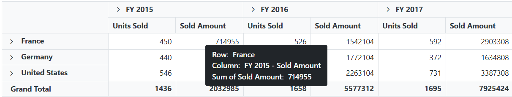
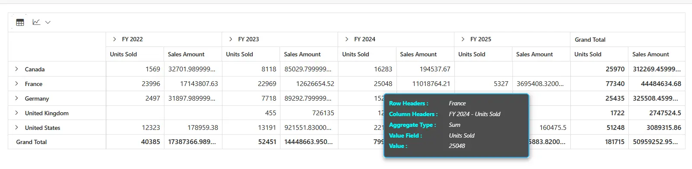

# Tooltip in Blazor Pivot Table Component

The tooltip displays contextual information when users hover over value cells in the pivot table. It can be enabled or disabled by setting the [ShowTooltip](https://help.syncfusion.com/cr/blazor/Syncfusion.Blazor.PivotView.SfPivotView-1.html#Syncfusion_Blazor_PivotView_SfPivotView_1_ShowTooltip) property in [SfPivotView](https://help.syncfusion.com/cr/blazor/Syncfusion.Blazor.PivotView.html) class to **true** or **false**. By default, tooltip is enabled in the pivot table and shows the cell value along with row and column header information.

```cshtml
@using Syncfusion.Blazor.PivotView

<SfPivotView TValue="ProductDetails" ShowTooltip="true">
    <PivotViewDataSourceSettings DataSource="@data">
        <PivotViewColumns>
            <PivotViewColumn Name="Year"></PivotViewColumn>
            <PivotViewColumn Name="Quarter"></PivotViewColumn>
        </PivotViewColumns>
        <PivotViewRows>
            <PivotViewRow Name="Country"></PivotViewRow>
            <PivotViewRow Name="Products"></PivotViewRow>
        </PivotViewRows>
        <PivotViewValues>
            <PivotViewValue Name="Sold" Caption="Units Sold"></PivotViewValue>
            <PivotViewValue Name="Amount" Caption="Sold Amount"></PivotViewValue>
        </PivotViewValues>
    </PivotViewDataSourceSettings>
</SfPivotView>

@code{
    public List<ProductDetails> data { get; set; }
    protected override void OnInitialized()
    {
        this.data = ProductDetails.GetProductData().ToList();
        //Bind the data source collection here. Refer "Assigning sample data to the pivot table" section in getting started for more details.
    }
}

```



## Tooltip Template

By default, the tooltip displays basic information such as cell value and headers. However, you can customize the tooltip's appearance and content by using the [`TooltipTemplate`](https://help.syncfusion.com/cr/blazor/Syncfusion.Blazor.PivotView.PivotViewTemplates.html) property available within the [PivotViewTemplates](https://help.syncfusion.com/cr/blazor/Syncfusion.Blazor.PivotView.PivotViewTemplates.html) class. This allows you to design a custom HTML layout for the tooltip with styling and formatting that matches your application's design.

### Tooltip Template Context

When you create a custom tooltip template, you gain access to the [PivotTooltipTemplateContext](https://help.syncfusion.com/cr/blazor/Syncfusion.Blazor.PivotView.PivotTooltipTemplateContext.html) object, which contains the following properties that you can use to display dynamic information within your custom tooltip:

* **`RowHeaders`**: Displays the header values of the rows that are associated with the currently hovered value cell.

* **`ColumnHeaders`**: Displays the header values of the columns that are associated with the currently hovered value cell.

* **`RowFields`**: Displays the names of all row fields that are configured in the Pivot Table.

* **`ColumnFields`**: Displays the names of all column fields that are configured in the Pivot Table.

* **`ValueField`**: Displays the name of the value field from the currently hovered value cell.

* **`AggregateType`**: Displays the aggregate function (such as Sum, Average, Count) applied to the currently hovered value cell.

* **`Value`**: Displays the formatted and calculated value of the currently hovered value cell.

### Creating a Custom Tooltip Template

You can apply tooltip customization to both the Pivot Table and Pivot Chart components using the **`TooltipTemplate`** property. The following example demonstrates how to create a professional-looking custom tooltip that displays all relevant information in a well-organized format:

```cshtml
@using Syncfusion.Blazor.PivotView

<SfPivotView TValue="PivotProductDetails" Height="600px" ShowTooltip="true" ShowToolbar="true" Toolbar=@toolbarItems>
    <PivotViewTemplates>
        <TooltipTemplate Context="tooltipContext">
            @{
                var data = tooltipContext;
            }
            <div class="tooltip-wrapper">
                <div class="tooltip-row">
                    <span class="tooltip-header">Row Headers :</span>
                    <span class="tooltip-value">@data.RowHeaders</span>
                </div>
                <div class="tooltip-row">
                    <span class="tooltip-header">Column Headers :</span>
                    <span class="tooltip-value">@data.ColumnHeaders</span>
                </div>
                <div class="tooltip-row">
                    <span class="tooltip-header">Aggregate Type :</span>
                    <span class="tooltip-value">@data.AggregateType</span>
                </div>
                <div class="tooltip-row">
                    <span class="tooltip-header">Value Field :</span>
                    <span class="tooltip-value">@data.ValueField</span>
                </div>
                <div class="tooltip-row">
                    <span class="tooltip-header">Value :</span>
                    <span class="tooltip-value">@data.Value</span>
                </div>
            </div>
        </TooltipTemplate>
    </PivotViewTemplates>
    <PivotViewDataSourceSettings DataSource="@Data">
        <PivotViewRows>
            <PivotViewRow Name="Country"></PivotViewRow>
            <PivotViewRow Name="Products"></PivotViewRow>
        </PivotViewRows>
        <PivotViewColumns>
            <PivotViewColumn Name="Year"></PivotViewColumn>
            <PivotViewColumn Name="Quarter"></PivotViewColumn>
        </PivotViewColumns>
        <PivotViewValues>
            <PivotViewValue Name="Sold" Caption="Units Sold"></PivotViewValue>
            <PivotViewValue Name="Amount" Caption="Sales Amount"></PivotViewValue>
        </PivotViewValues>
    </PivotViewDataSourceSettings>
    <PivotViewDisplayOption Primary="Primary.Table" View="View.Both"></PivotViewDisplayOption>
    <PivotChartSettings Title="Sales Analysis">
        <PivotChartSeries Type="ChartSeriesType.Column">
        </PivotChartSeries>
        <PivotChartTooltipSettings Enable=true>
        </PivotChartTooltipSettings>
    </PivotChartSettings>
</SfPivotView>
<style>
    .e-pivotview {
        min-height: 600px;
    }
    .tooltip-wrapper {
        background-color: #4d4d4d;
        color: #ffffff;
        border: 2px solid #27b1f0;
        border-radius: 6px;
        padding: 10px;
        min-width: 300px;
        font-size: 12px;
    }
    .tooltip-row {
        margin-bottom: 6px;
    }
    .tooltip-header {
        color: aqua;
        font-weight: bold;
        display: inline-block;
        min-width: 120px;
    }
    .tooltip-value {
        font-style: italic;
        word-break: break-word;
    }
</style>
@code {
    private List<PivotProductDetails> Data = new();
    protected override void OnInitialized()
    {
        Data = PivotProductDetails.GetProductData().ToList();
    }
    private List<ToolbarItems> toolbarItems = new List<ToolbarItems>()
    {
        ToolbarItems.Grid,
        ToolbarItems.Chart
    };
}
```



### Understanding the Custom Tooltip Example

The `<TooltipTemplate>` component inside `<PivotViewTemplates>` defines the custom HTML structure displayed when hovering over value cells. The `Context="tooltipContext"` attribute exposes the `PivotTooltipTemplateContext` object as the `tooltipContext` variable, providing access to cell properties such as `RowHeaders`, `ColumnHeaders`, `Value`, and `AggregateType`.

The template uses a `div` with class `tooltip-wrapper` as the main container, with nested `tooltip-row` divs to organize related information in a flex-based layout. The accompanying CSS styles define appearance (colors, borders, shadows) and layout properties. Custom styles are applied directly; **no Syncfusion tooltip defaults are inherited**, giving you complete design control.

The `RowHeaders` and `ColumnHeaders` properties return concatenated header values separated by " - " (e.g., "USA - Q1" or "Product A - Year 2023").

You can extend the template by adding conditional rendering, additional HTML elements, or interactive content based on context properties. For example, use `@if` blocks to show/hide information dynamically. Keep in mind that custom templates are re-evaluated on each hover, so avoid expensive computations in the template markup to prevent render lag.

N> You can refer to the [Blazor Pivot Table](https://www.syncfusion.com/blazor-components/blazor-pivot-table) feature tour page for its groundbreaking feature representations. You can also explore the [Blazor Pivot Table example](https://blazor.syncfusion.com/demos/pivot-table/default-functionalities?theme=bootstrap5) to know how to render and configure the pivot table.