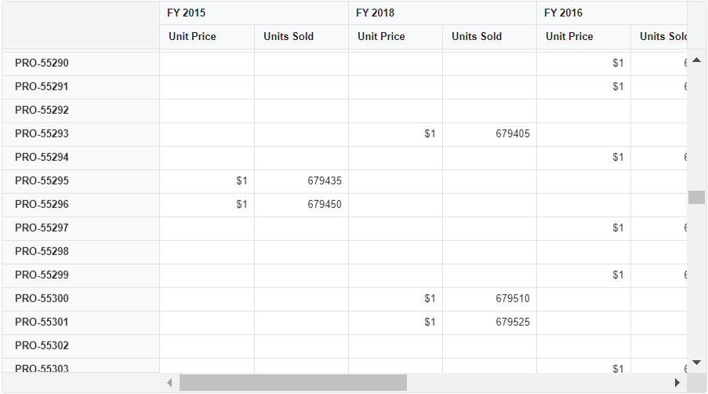

<!-- markdownlint-disable MD036 -->

# Virtual Scrolling in Blazor Pivot Table

## Virtual scrolling

Virtual scrolling enables efficient handling of large datasets by rendering only the rows and columns visible in the current viewport. Content refreshes dynamically as the user scrolls vertically or horizontally. This feature is enabled by setting the [`EnableVirtualization`](https://help.syncfusion.com/cr/blazor/Syncfusion.Blazor.PivotView.SfPivotView-1.html#Syncfusion_Blazor_PivotView_SfPivotView_1_EnableVirtualization) property to **true** (default `false`).

N> Virtualization and [Paging](./paging) cannot be enabled at the same time. Use one or the other; they are designed to handle data rendering differently and may conflict when combined.

```cshtml
@using Syncfusion.Blazor.PivotView

<SfPivotView TValue="PivotVirtualData" Width="100%" Height="500" EnableVirtualization="true" EnableValueSorting="true" ShowTooltip="false">
    <PivotViewDataSourceSettings DataSource="@data" EnableSorting="false" AlwaysShowValueHeader="true">
        <PivotViewColumns>
            <PivotViewColumn Name="Year"></PivotViewColumn>
        </PivotViewColumns>
        <PivotViewRows>
            <PivotViewRow Name="ProductID"></PivotViewRow>
        </PivotViewRows>
        <PivotViewValues>
            <PivotViewValue Name="Price" Caption="Unit Price"></PivotViewValue>
            <PivotViewValue Name="Sold" Caption="Units Sold"></PivotViewValue>
        </PivotViewValues>
        <PivotViewFormatSettings>
            <PivotViewFormatSetting Name="Price" Format="C0"></PivotViewFormatSetting>
        </PivotViewFormatSettings>
    </PivotViewDataSourceSettings>
    <PivotViewGridSettings ColumnWidth="120"></PivotViewGridSettings>
</SfPivotView>

<style>
    .e-pivotview {
        min-height: 200px;
        width:900px;
    }
</style>

@code{
    public List<PivotVirtualData> data { get; set; }

    protected override void OnInitialized()
    {
        this.data = PivotVirtualData.GetVirtualData().ToList();
    }
    
    public class PivotVirtualData
    {
        public string ProductID { get; set; }
        public string Year { get; set; }
        public string Country { get; set; }
        public string City { get; set; }
        public double Price { get; set; }
        public DateTime Date { get; set; }
        public double Sold { get; set; }

        public static List<PivotVirtualData> GetVirtualData()
        {
            List<PivotVirtualData> VirtualData = new List<PivotVirtualData>();

            for (int i = 1; i <= 100000; i++)
            {
                PivotVirtualData p = new PivotVirtualData
                {
                    ProductID = "PRO-" + (10000 + i),
                    Year = (new string[] { "FY 2015", "FY 2016", "FY 2017", "FY 2018", "FY 2019" })[new Random().Next(5)],
                    Country = "USA",
                    City = "New York",
                    Price = (3.4 * i) + 500,
                    Sold = (i * 15) + 10
                    //date = Convert.ToDateTime("2013/01/06")
                };
                VirtualData.Add(p);
            }
            return VirtualData;
        }
    }
}

```



## Virtual Scrolling with Single Page Mode

When virtual scrolling is enabled, the Pivot Table renders not only the current view page but also the adjacent previous and next pages by default. While this approach supports smooth navigation, it can increase computational load and reduce performance when working with extensive datasets, as additional rows and columns from surrounding pages are processed.

To optimize performance, set the [AllowSinglePage](https://help.syncfusion.com/cr/blazor/Syncfusion.Blazor.PivotView.PivotViewVirtualScrollSettings.html#Syncfusion_Blazor_PivotView_PivotViewVirtualScrollSettings_AllowSinglePage) property to **true** within the [PivotViewVirtualScrollSettings](https://help.syncfusion.com/cr/blazor/Syncfusion.Blazor.PivotView.PivotViewVirtualScrollSettings.html). Enabling this property ensures that only the rows and columns for the current view page are rendered during virtual scrolling. This significantly enhances the performance of the Pivot Table, particularly in Blazor WASM applications, especially during initial rendering and user actions such as drilling up, drilling down, sorting, and filtering.

```cshtml
@using Syncfusion.Blazor.PivotView

<SfPivotView TValue="PivotVirtualData" EnableVirtualization="true" EnableValueSorting=true ShowTooltip=false>
    <PivotViewVirtualScrollSettings AllowSinglePage="true"></PivotViewVirtualScrollSettings>
    <PivotViewDataSourceSettings DataSource="@data" EnableSorting="false" AlwaysShowValueHeader="true">
        <PivotViewColumns>
            <PivotViewColumn Name="Year"></PivotViewColumn>
        </PivotViewColumns>
        <PivotViewRows>
            <PivotViewRow Name="ProductID"></PivotViewRow>
        </PivotViewRows>
        <PivotViewValues>
            <PivotViewValue Name="Price" Caption="Unit Price"></PivotViewValue>
            <PivotViewValue Name="Sold" Caption="Unit Sold"></PivotViewValue>
        </PivotViewValues>
        <PivotViewFormatSettings>
            <PivotViewFormatSetting Name="Price" Format="C0"></PivotViewFormatSetting>
        </PivotViewFormatSettings>
    </PivotViewDataSourceSettings>
    <PivotViewGridSettings ColumnWidth="120"></PivotViewGridSettings>
</SfPivotView>

@code{
    private List<PivotVirtualData> data { get; set; }
    protected override void OnInitialized()
    {
        this.data = PivotVirtualData.GetVirtualData().ToList();
    }
    
    public class PivotVirtualData
    {
        public string ProductID { get; set; }
        public string Year { get; set; }
        public string Country { get; set; }
        public string City { get; set; }
        public double Price { get; set; }
        public DateTime Date { get; set; }
        public double Sold { get; set; }

        public static List<PivotVirtualData> GetVirtualData()
        {
            List<PivotVirtualData> VirtualData = new List<PivotVirtualData>();

            for (int i = 1; i <= 100000; i++)
            {
                PivotVirtualData p = new PivotVirtualData
                {
                    ProductID = "PRO-" + (10000 + i),
                    Year = (new string[] { "FY 2015", "FY 2016", "FY 2017", "FY 2018", "FY 2019" })[new Random().Next(5)],
                    Country = "USA",
                    City = "New York",
                    Price = (3.4 * i) + 500,
                    Sold = (i * 15) + 10
                    //date = Convert.ToDateTime("2013/01/06")
                };
                VirtualData.Add(p);
            }
            return VirtualData;
        }
    }
}

```

## Limitations

* In virtual scrolling, the [ColumnWidth](https://help.syncfusion.com/cr/blazor/Syncfusion.Blazor.PivotView.PivotViewGridSettings.html#Syncfusion_Blazor_PivotView_PivotViewGridSettings_ColumnWidth) property in [GridSettings](https://help.syncfusion.com/cr/blazor/Syncfusion.Blazor.PivotView.PivotViewGridSettings.html) must be in pixels; percentage values are not accepted.
* Features such as auto fit, column resizing, text wrapping, and setting column widths through events can dynamically affect the row height and column width at runtime. These changes are not considered in the scroller calculations, particularly with large datasets, which can cause performance issues. It is not recommended to use these features alongside virtualization.
* Grouping, which takes additional time to split raw items into the provided format.
* Date formatting, which takes additional time to convert date format.
* Date formatting with sorting requires the full date-time format to perform sorting along with the provided date format, which lags performance.
* When using OLAP data, subtotals and grand totals are only displayed when measures are bound at the last position in the [rows](https://help.syncfusion.com/cr/blazor/Syncfusion.Blazor.PivotView.PivotViewDataSourceSettings-1.html#Syncfusion_Blazor_PivotView_PivotViewDataSourceSettings_1_Rows) or [columns](https://help.syncfusion.com/cr/blazor/Syncfusion.Blazor.PivotView.PivotViewDataSourceSettings-1.html#Syncfusion_Blazor_PivotView_PivotViewDataSourceSettings_1_Columns) axis. Otherwise, the Pivot Table will show data without summary totals.
* Even with virtual scrolling, the current viewport data plus the immediate previous and next pages are all retrieved. As a result, when the user scrolls slightly ahead or behind, the next or previous page data is shown immediately. **Note:** Large `Width` and `Height` values increase the loading count across the current, previous, and next viewport, which can affect performance.

## Overcoming the browser's height limitation

The Pivot Table supports loading millions of records using virtual scrolling, where rows are loaded and rendered on-demand during vertical scrolling. This approach reduces the browser’s load by minimizing DOM elements, displaying only those visible in the viewport. The total height of the Pivot Table is determined by multiplying the total record count by the [RowHeight](https://help.syncfusion.com/cr/blazor/Syncfusion.Blazor.PivotView.PivotViewGridSettings.html#Syncfusion_Blazor_PivotView_PivotViewGridSettings_RowHeight) property in [PivotViewGridSettings](https://help.syncfusion.com/cr/blazor/Syncfusion.Blazor.PivotView.PivotViewGridSettings.html).

However, browsers impose a maximum pixel height limit on scroll bar elements, which can restrict scrolling if the content exceeds this limit. When the Pivot Table’s height surpasses the browser’s maximum height, users may not be able to scroll further to view additional records. This limitation varies across browsers and depends on their default behavior.

To address this, set the [RowHeight](https://help.syncfusion.com/cr/blazor/Syncfusion.Blazor.PivotView.PivotViewGridSettings.html#Syncfusion_Blazor_PivotView_PivotViewGridSettings_RowHeight) property to a value that keeps the virtual scroll bar’s height within the browser’s maximum limit. This ensures users can scroll through all records without interruption, maintaining smooth performance.