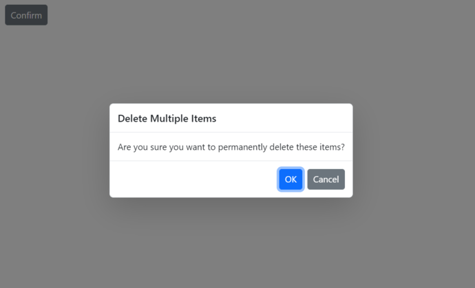

# Predefined dialogs in the Blazor Dialog component

The dialog component is used to render the `Alert`, `Confirm`, and `Prompt` dialogs with minimal code. The alert, confirm, and prompt dialogs are shown using [DialogServices](https://help.syncfusion.com/cr/blazor/Syncfusion.Blazor.Popups.SfDialogService.html).

There are three types of predefined dialogs available:

        * Alert
        * Confirm
        * Prompt

### Show alert dialog

An `Alert` dialog box is used to display errors, warnings, and information that needs user awareness, this can be achieved by using [DialogService.AlertAsync](https://help.syncfusion.com/cr/blazor/Syncfusion.Blazor.Popups.SfDialogService.html#Syncfusion_Blazor_Popups_SfDialogService_AlertAsync_System_String_System_String_Syncfusion_Blazor_Popups_DialogOptions_) method. The `Alert` dialog display along with ‘Ok’ button.But, it does not has any specific return type. When you click on ‘Ok’ button then the `Alert` method will complete.

Use the following code to render a simple alert dialog in an application:









### Show confirm dialog

A `Confirm` dialog displays a specified message along with ‘OK’ and ‘Cancel’ button where it returns a boolean value according to the user's click action, this can be achieved by using [DialogService.ConfirmAsync](https://help.syncfusion.com/cr/blazor/Syncfusion.Blazor.Popups.SfDialogService.html#Syncfusion_Blazor_Popups_SfDialogService_ConfirmAsync_System_String_System_String_Syncfusion_Blazor_Popups_DialogOptions_) method. It is used to get approval from a user and it appears before any critical action.

Use the following code to render a simple confirm dialog in an application:









### Show prompt dialog

A `Prompt`dialog is used to get input from user by using [DialogService.PromptAsync](https://help.syncfusion.com/cr/blazor/Syncfusion.Blazor.Popups.SfDialogService.html#Syncfusion_Blazor_Popups_SfDialogService_PromptAsync_System_String_System_String_Syncfusion_Blazor_Popups_DialogOptions_) method. When the user enters ‘OK’, the input value is returned. When they click ‘Cancel’, the null value is returned.

Use the following code to render a simple prompt dialog in an application:









