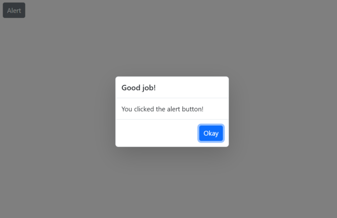
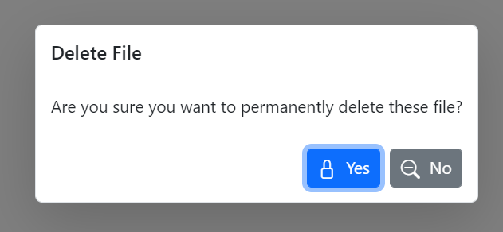
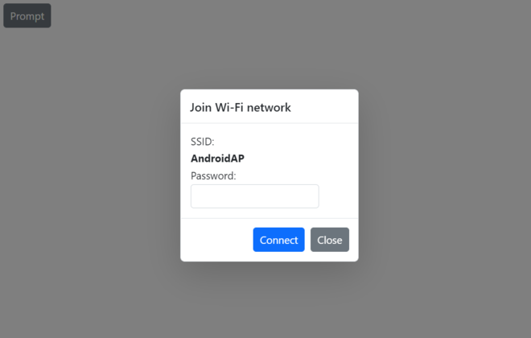
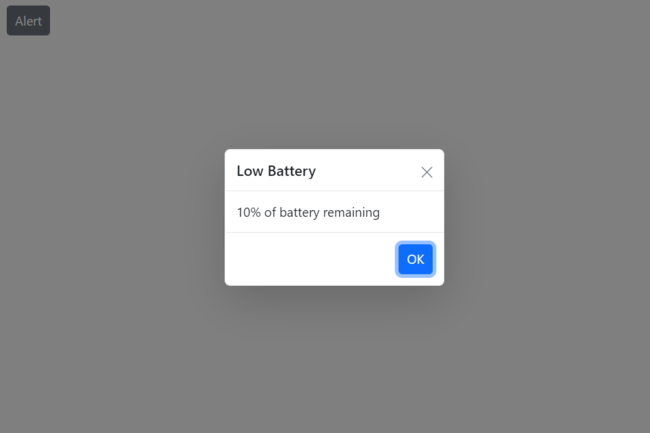
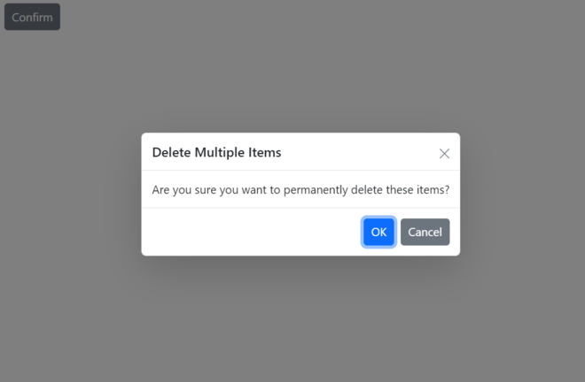
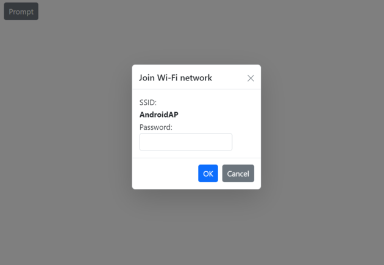
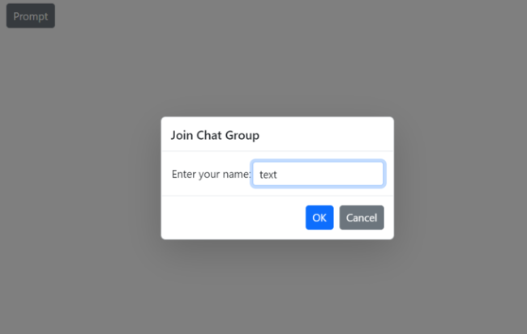

# Customization of Predefined Dialogs in Blazor

## Customize action buttons

Customize predefined dialog buttons using the following properties:
* [DialogOptions.PrimaryButtonOptions](https://help.syncfusion.com/cr/blazor/Syncfusion.Blazor.Popups.DialogOptions.html#Syncfusion_Blazor_Popups_DialogOptions_PrimaryButtonOptions) - Customizes the primary (OK) button text and appearance.
* [DialogOptions.CancelButtonOptions](https://help.syncfusion.com/cr/blazor/Syncfusion.Blazor.Popups.DialogOptions.html#Syncfusion_Blazor_Popups_DialogOptions_CancelButtonOptions) - Customizes the secondary (Cancel) button text and appearance.

Use the following code snippet for **alert.razor**, **confirm.razor**, and **prompt.razor** to customize predefined dialog action buttons.

For the alert dialog, the default button content is customized to `Okay` using the [DialogButtonOptions.Content](https://help.syncfusion.com/cr/blazor/Syncfusion.Blazor.Popups.DialogButtonOptions.html#Syncfusion_Blazor_Popups_DialogButtonOptions_Content) property.

For the confirm dialog, the default button content is customized to `Yes` and `No` using the `DialogButtonOptions.Content` property, and the button icons are customized using the [DialogButtonOptions.IconCss](https://help.syncfusion.com/cr/blazor/Syncfusion.Blazor.Popups.DialogButtonOptions.html#Syncfusion_Blazor_Popups_DialogButtonOptions_IconCss) property (provide CSS class names for icons).

For the prompt dialog, the default button content is customized to `Connect` and `Close` using the [DialogButtonOptions.Content](https://help.syncfusion.com/cr/blazor/Syncfusion.Blazor.Popups.DialogButtonOptions.html#Syncfusion_Blazor_Popups_DialogButtonOptions_Content) property.

















**Results from the code snippet**

**Alert**

**Confirm**

**Prompt**

## Show or hide dialog close button 

Show or hide the close button in predefined dialogs using the [DialogOptions.ShowCloseIcon](https://help.syncfusion.com/cr/blazor/Syncfusion.Blazor.Popups.DialogOptions.html#Syncfusion_Blazor_Popups_DialogOptions_ShowCloseIcon) property. The default value is `false`.

Use the following code snippet for **alert.razor**, **confirm.razor**, and **prompt.razor** to show or hide the dialog close button.

















**Results from the code snippet**

**Alert**

**Confirm**

**Prompt**

### Customize dialog content

Load custom content in predefined dialogs using the [DialogOptions.ChildContent](https://help.syncfusion.com/cr/blazor/Syncfusion.Blazor.Popups.DialogOptions.html#Syncfusion_Blazor_Popups_DialogOptions_ChildContent) property.

Use the following code to customize the dialog content and render a custom TextBox component inside the prompt dialog to obtain a username from the user using the `@bind-Value` property.









