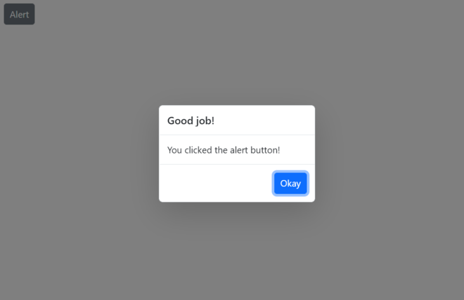
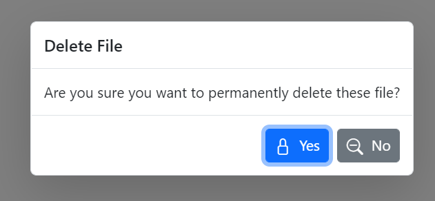
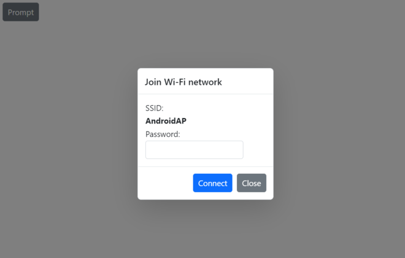
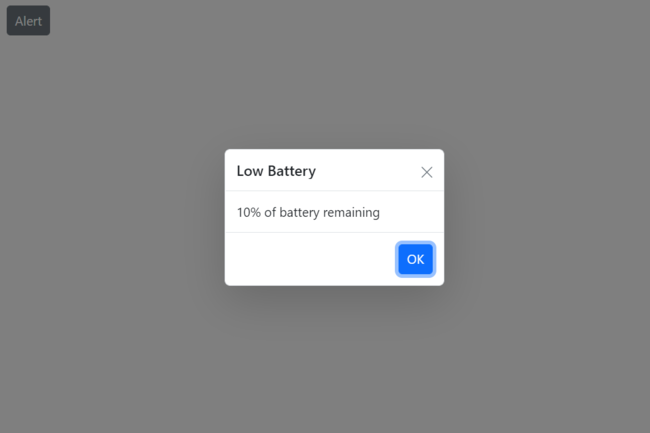
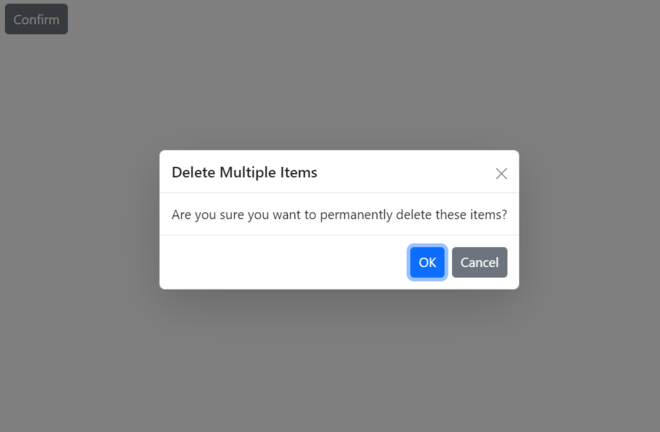
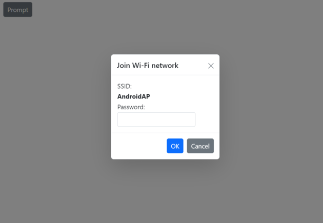
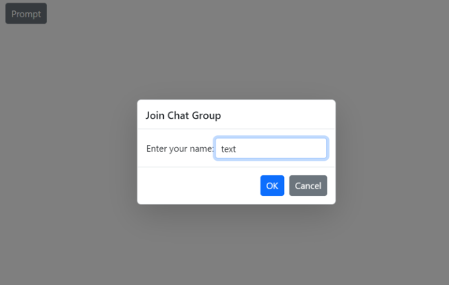

# Customization of Predefined Dialogs in Blazor

## Customize action buttons

The appearance and text of predefined dialog buttons can be customized using the following properties:

* [DialogOptions.PrimaryButtonOptions](https://help.syncfusion.com/cr/blazor/Syncfusion.Blazor.Popups.DialogOptions.html#Syncfusion_Blazor_Popups_DialogOptions_PrimaryButtonOptions) - Customizes the primary (OK) button text and appearance.
* [DialogOptions.CancelButtonOptions](https://help.syncfusion.com/cr/blazor/Syncfusion.Blazor.Popups.DialogOptions.html#Syncfusion_Blazor_Popups_DialogOptions_CancelButtonOptions) - Customizes the secondary (Cancel) button text and appearance.

The following examples demonstrate how to customize action buttons for alert, confirm, and prompt dialogs.

* For the **alert dialog**, the default button content is changed to `Okay` using the [DialogButtonOptions.Content](https://help.syncfusion.com/cr/blazor/Syncfusion.Blazor.Popups.DialogButtonOptions.html#Syncfusion_Blazor_Popups_DialogButtonOptions_Content) property.
* For the **confirm dialog**, the button labels are customized to `Yes` and `No`. Additionally, icons are added to these buttons using the [DialogButtonOptions.IconCss](https://help.syncfusion.com/cr/blazor/Syncfusion.Blazor.Popups.DialogButtonOptions.html#Syncfusion_Blazor_Popups_DialogButtonOptions_IconCss) property.
* For the **prompt dialog**, the button content is customized to `Connect` and `Close`.

















**Results from the code snippet**

**Alert**



**Confirm**



**Prompt**



## Show or hide Dialog with close button 

The visibility of the close button in predefined dialogs is controlled by the [DialogOptions.ShowCloseIcon](https://help.syncfusion.com/cr/blazor/Syncfusion.Blazor.Popups.DialogOptions.html#Syncfusion_Blazor_Popups_DialogOptions_ShowCloseIcon) property. By default, this property is set to `false`.

The following code snippets demonstrate how to enable the close button for alert, confirm, and prompt dialogs.

















**Results from the code snippet**

**Alert**



**Confirm**



**Prompt**



## Customize Dialog content

Custom content can be rendered within predefined dialogs using the [DialogOptions.ChildContent](https://help.syncfusion.com/cr/blazor/Syncfusion.Blazor.Popups.DialogOptions.html#Syncfusion_Blazor_Popups_DialogOptions_ChildContent) property. This allows for the integration of other components or complex layouts.

The following example demonstrates how to render a custom TextBox component inside a prompt dialog to collect user input using the `@bind-Value` property.











## Predefined Dialog Styling and Customization

The Syncfusion Blazor Predefined Dialog component provides extensive customization capabilities through CSS classes and properties. The below guidelines demonstrate how to implement comprehensive styling for different Dialog types including Alert dialogs with predefined styles and fully custom dialogs.

## Alert Predefined Dialog Customization

This section shows how to change the look of an **Info-style alert dialog** using CSS. You can customize its header, content, buttons, and background.

### Header

This CSS styles the top part (header) of the dialog. It adds a beautiful gradient background and makes the title text white and bold.

```css
.info-dialog .e-dlg-header-content {
    background: linear-gradient(135deg, #667eea 0%, #764ba2 100%) !important;
    border-bottom: 3px solid #5a67d8 !important;
    padding: 16px 20px !important;
}

.info-dialog .e-dlg-header-content .e-dlg-header {
    color: white !important;
    font-weight: 700 !important;
    font-size: 16px !important;
    text-shadow: 1px 1px 2px rgba(0,0,0,0.2) !important;
}
```

### Header Close Button

This styles the small **× (close)** button in the header. It makes the button round, semi-transparent, and adds a nice hover effect with rotation.

```css
.info-dialog .e-dlg-header-content .e-btn.e-icon-btn {
    background: rgba(255, 255, 255, 0.2) !important;
    color: white !important;
    border: none !important;
    width: 32px !important;
    height: 32px !important;
    border-radius: 50% !important;
}

.info-dialog .e-dlg-header-content .e-btn.e-icon-btn:hover {
    background: rgba(255, 255, 255, 0.4) !important;
    transform: rotate(90deg) !important;
}
```

### Content

This section controls how the main message or text inside the dialog looks — including background color, text size, and spacing.

```css
.info-dialog .e-dlg-content {
    background: linear-gradient(to bottom, #ebf4ff, #ffffff) !important;
    color: #2d3748 !important;
    font-size: 15px !important;
    font-weight: 500 !important;
    padding: 25px 20px !important;
    line-height: 1.6 !important;
    margin: 0 !important;
}
```

### Footer

This styles the bottom part of the dialog (where buttons usually appear). It adds a light background and proper spacing for the buttons.

```css
.info-dialog .e-footer-content {
    background-color: #f7fafc !important;
    border-top: 2px solid #e2e8f0 !important;
    padding: 15px 20px !important;
    display: flex !important;
    justify-content: flex-end !important;
    gap: 10px !important;
}
```

### Footer Buttons

This CSS makes the buttons at the bottom of the dialog look modern with gradient colors, shadows, and smooth hover animations.

```css
.info-dialog .e-footer-content .e-btn {
    background: linear-gradient(135deg, #667eea 0%, #764ba2 100%) !important;
    color: white !important;
    border: none !important;
    border-radius: 6px !important;
    padding: 10px 24px !important;
    font-weight: 600 !important;
    font-size: 14px !important;
    text-transform: uppercase !important;
    letter-spacing: 0.5px !important;
    box-shadow: 0 4px 6px rgba(102, 126, 234, 0.3) !important;
    transition: all 0.3s ease !important;
}

.info-dialog .e-footer-content .e-btn:hover {
    transform: translateY(-2px) !important;
    box-shadow: 0 6px 12px rgba(102, 126, 234, 0.4) !important;
    background: linear-gradient(135deg, #764ba2 0%, #667eea 100%) !important;
}

.info-dialog .e-footer-content .e-btn:active {
    transform: translateY(0) !important;
    box-shadow: 0 2px 4px rgba(102, 126, 234, 0.2) !important;
}
```

### Overlay

This styles the dark background (overlay) that appears behind the dialog to make it stand out.

```css
.info-dialog + .e-dlg-overlay {
    background-color: rgba(102, 126, 234, 0.5) !important;
    backdrop-filter: blur(4px) !important;
}
```

```csharp
@using Syncfusion.Blazor.Popups
@using Syncfusion.Blazor.Buttons
@inject SfDialogService DialogService

<div style="display: flex; gap: 10px; flex-wrap: wrap;">
    <SfButton @onclick="@ShowInfoPrompt" CssClass="e-info">Info Prompt</SfButton>
</div>

<div class="status" style="padding-top:10px; margin-top: 20px;">
    <strong>Last Action:</strong> @DialogStatus
</div>

@code {
    private string DialogStatus { get; set; } = "No action performed yet";

    private async Task ShowInfoPrompt()
    {
        string result = await DialogService.PromptAsync("Please enter your department name:", "Department Info", new DialogOptions { CssClass = "info-prompt" });
        UpdateStatus(result);
    }

    private void UpdateStatus(string result)
    {
        if (result == null)
        {
            this.DialogStatus = "Prompt was cancelled";
        }
        else
        {
            this.DialogStatus = $"User entered: \"{result}\"";
        }
    }
}
```

## Alert PredefinedDialog - Advanced Complete Styling

This section shows a more advanced and beautiful custom dialog style. It includes gradients, shadows, animations, and extra visual effects for a premium look.

```css
.custom-dialog {
    border-radius: 16px !important;
    box-shadow: 0 20px 60px rgba(0, 0, 0, 0.3) !important;
    border: 1px solid #e2e8f0 !important;
    overflow: hidden !important;
}

.custom-dialog .e-dlg-header-content {
    background: linear-gradient(135deg, #ff6b6b 0%, #556270 100%) !important;
    border-bottom: none !important;
    padding: 24px 24px 20px 24px !important;
    position: relative !important;
}

.custom-dialog .e-dlg-header-content::after {
    content: '' !important;
    position: absolute !important;
    bottom: 0 !important;
    left: 0 !important;
    right: 0 !important;
    height: 3px !important;
    background: repeating-linear-gradient(90deg, #ff6b6b, #ff6b6b 10px, #556270 10px, #556270 20px) !important;
}

.custom-dialog .e-dlg-header-content .e-dlg-header {
    color: white !important;
    font-weight: 800 !important;
    font-size: 20px !important;
    text-transform: uppercase !important;
    letter-spacing: 2px !important;
    text-shadow: 2px 2px 4px rgba(0,0,0,0.3) !important;
}

.custom-dialog .e-dlg-header-content .e-btn.e-icon-btn {
    background: rgba(255, 255, 255, 0.15) !important;
    color: white !important;
    border: 2px solid rgba(255, 255, 255, 0.5) !important;
    width: 36px !important;
    height: 36px !important;
    border-radius: 50% !important;
    transition: all 0.3s ease !important;
}

.custom-dialog .e-dlg-header-content .e-btn.e-icon-btn:hover {
    background: rgba(255, 255, 255, 0.4) !important;
    border-color: white !important;
    transform: rotate(90deg) scale(1.1) !important;
}

.custom-dialog .e-dlg-content {
    background: #ffffff !important;
    color: #2d3748 !important;
    font-size: 16px !important;
    line-height: 1.8 !important;
    padding: 30px 24px !important;
    position: relative !important;
}

.custom-dialog .e-dlg-content::before {
    content: '💡' !important;
    position: absolute !important;
    top: 20px !important;
    left: 15px !important;
    font-size: 24px !important;
}

.custom-dialog .e-dlg-content div {
    padding-left: 35px !important;
}

.custom-dialog .e-footer-content {
    background: linear-gradient(to right, #f7fafc, #edf2f7) !important;
    border-top: 3px solid #e2e8f0 !important;
    padding: 20px 24px !important;
    display: flex !important;
    justify-content: center !important;
    gap: 15px !important;
}

.custom-dialog .e-footer-content .e-btn {
    background: linear-gradient(135deg, #667eea 0%, #764ba2 100%) !important;
    color: white !important;
    border: none !important;
    border-radius: 50px !important;
    padding: 12px 32px !important;
    font-weight: 700 !important;
    font-size: 14px !important;
    text-transform: uppercase !important;
    letter-spacing: 1px !important;
    box-shadow: 0 4px 15px rgba(102, 126, 234, 0.4) !important;
    transition: all 0.3s ease !important;
    position: relative !important;
    overflow: hidden !important;
}

.custom-dialog .e-footer-content .e-btn::before {
    content: '' !important;
    position: absolute !important;
    top: 0 !important;
    left: -100% !important;
    width: 100% !important;
    height: 100% !important;
    background: linear-gradient(90deg, transparent, rgba(255,255,255,0.3), transparent) !important;
    transition: left 0.5s ease !important;
}

.custom-dialog .e-footer-content .e-btn:hover::before {
    left: 100% !important;
}

.custom-dialog .e-footer-content .e-btn:hover {
    transform: translateY(-3px) scale(1.05) !important;
    box-shadow: 0 8px 25px rgba(102, 126, 234, 0.5) !important;
}

.custom-dialog .e-footer-content .e-btn:active {
    transform: translateY(-1px) scale(1.02) !important;
}

.custom-dialog + .e-dlg-overlay {
    background-color: rgba(0, 0, 0, 0.6) !important;
    backdrop-filter: blur(8px) !important;
    animation: overlayFadeIn 0.3s ease-out !important;
}

/* ===== Animations ===== */
@@keyframes dialogFadeIn {
    from {
        opacity: 0;
        transform: scale(0.9) translateY(-20px);
    }
    to {
        opacity: 1;
        transform: scale(1) translateY(0);
    }
}

@@keyframes overlayFadeIn {
    from {
        opacity: 0;
    }
    to {
        opacity: 1;
    }
}

.e-dialog.e-popup-open {
    animation: dialogFadeIn 0.4s cubic-bezier(0.68, -0.55, 0.265, 1.55) !important;
}

/* ===== Responsive Adjustments ===== */
@@media (max-width: 768px) {
    .e-dialog {
        min-width: 90% !important;
        max-width: 90% !important;
    }

    .info-dialog .e-dlg-content,
    .success-dialog .e-dlg-content,
    .warning-dialog .e-dlg-content,
    .error-dialog .e-dlg-content {
        margin: 0 !important;
        padding: 20px 15px !important;
    }

    .custom-dialog .e-dlg-header-content .e-dlg-header {
        font-size: 16px !important;
        letter-spacing: 1px !important;
    }

    .custom-dialog .e-footer-content .e-btn {
        padding: 10px 24px !important;
        font-size: 12px !important;
    }
}
```

```csharp
@using Syncfusion.Blazor.Popups
@using Syncfusion.Blazor.Buttons
@inject SfDialogService DialogService

<div style="display: flex; gap: 10px; flex-wrap: wrap;">
    <SfButton @onclick="@ShowCustomPrompt" CssClass="e-custom">Custom Prompt</SfButton>
</div>

<div class="status" style="padding-top:10px; margin-top: 20px;">
    <strong>Last Action:</strong> @DialogStatus
</div>

@code {
    private string DialogStatus { get; set; } = "No action performed yet";

    private async Task ShowCustomPrompt()
    {
        string result = await DialogService.PromptAsync("What is your favorite programming language?", "User Preferences", new DialogOptions { CssClass = "custom-prompt" });
        UpdateStatus(result);
    }

    private void UpdateStatus(string result)
    {
        if (result == null)
        {
            this.DialogStatus = "Prompt was cancelled";
        }
        else
        {
            this.DialogStatus = $"User entered: \"{result}\"";
        }
    }
}
```

## Confirm Predefined Dialog Customization

This section shows how to change the appearance of a simple **Info-style confirmation dialog** (like a logout warning) using CSS.  

You can make the dialog look more attractive and branded by customizing its border, header, content, and buttons.

```css
.logout-confirm .e-dialog {
    border: 5px solid #ed8936 !important;
}
```

### Header

This CSS customizes the top part of the dialog (the title area). It increases the padding and changes the font size and color of the header text to make it stand out.

```css
.logout-confirm .e-dlg-header-content {
    padding: 20px 20px 10px 20px !important;
}

.logout-confirm .e-dlg-header {
    font-size: 18px !important;
    color: #dd6b20 !important;
}
```

### Content

This CSS styles the main message area of the dialog. It adjusts the spacing inside the content so the message looks clean and readable.

```css
.logout-confirm .e-dlg-content {
    padding: 10px 20px 25px 20px !important;
}
```

### Footer

This CSS changes the appearance of the buttons at the bottom (especially the primary "Yes" button). It gives the confirm button a custom color so it matches your application's design.

```css
.logout-confirm .e-footer-content .e-btn.e-primary {
    background-color: #ed8936 !important;
    border-color: #ed8936 !important;
}
```

```csharp
@using Syncfusion.Blazor.Buttons

@inject SfDialogService DialogService

<div style="display: flex; gap: 10px; flex-wrap: wrap;">
    <SfButton @onclick="@ShowLogoutConfirm" CssClass="e-warning">Logout Confirm</SfButton>    
</div>

<div class="status" style="padding-top:10px; margin-top: 20px;">
    <strong>Last Action:</strong> @DialogStatus
</div>

@code {
    private string DialogStatus { get; set; } = "No action performed yet";

    private async Task ShowLogoutConfirm()
    {
        bool isConfirm = await DialogService.ConfirmAsync(
            "You have unsaved changes. Are you sure you want to log out?", 
            "Logout Warning", 
            new DialogOptions { CssClass = "logout-confirm" }
        );
        UpdateStatus(isConfirm, "Logout Confirm");
    }

    private void UpdateStatus(bool isConfirm, string dialogType)
    {
        string confirmMessage = isConfirm ? "confirmed" : "canceled";
        this.DialogStatus = $"{dialogType} was {confirmMessage}.";
    }
}
```

---

## Confirm PredefinedDialog - Advanced Complete Styling

This section shows how to create a **beautiful, modern, and fully customized confirmation dialog** with gradients, shadows, hover effects, and animations. To make your confirmation dialog look professional, eye-catching, and consistent with modern web design.

```css
.advanced-confirm {
    border: none !important;
    box-shadow: 0 20px 50px rgba(0,0,0,0.3) !important;
}

.advanced-confirm .e-dlg-header-content {
    background: linear-gradient(135deg, #667eea 0%, #764ba2 100%) !important;
    padding: 25px !important;
}

.advanced-confirm .e-dlg-header {
    color: white !important;
    font-size: 22px !important;
    letter-spacing: 1px !important;
    text-transform: uppercase !important;
}

.advanced-confirm .e-dlg-content {
    background: #ffffff !important;
    padding: 40px 30px !important;
    font-size: 17px !important;
    line-height: 1.6 !important;
    text-align: center !important;
}

.advanced-confirm .e-footer-content {
    background: #f8f9fa !important;
    padding: 20px !important;
    gap: 15px !important;
}

.advanced-confirm .e-footer-content .e-btn {
    height: 45px !important;
    min-width: 120px !important;
    font-weight: 600 !important;
    border-radius: 4px !important;
    transition: all 0.3s ease !important;
}

.advanced-confirm .e-footer-content .e-btn.e-primary {
    background: linear-gradient(135deg, #667eea 0%, #764ba2 100%) !important;
    border: none !important;
    box-shadow: 0 4px 15px rgba(102, 126, 234, 0.4) !important;
}

.advanced-confirm .e-footer-content .e-btn.e-primary:hover {
    transform: translateY(-2px) !important;
    box-shadow: 0 6px 20px rgba(102, 126, 234, 0.6) !important;
}

/* Overlay Customization */
.advanced-confirm + .e-dlg-overlay {
    background-color: rgba(45, 55, 72, 0.8) !important;
    backdrop-filter: blur(5px) !important;
}

/* Animations */
@@keyframes slideInBottom {
    from {
        transform: translateY(100px);
        opacity: 0;
    }
    to {
        transform: translateY(0);
        opacity: 1;
    }
}

.advanced-confirm.e-popup-open {
    animation: slideInBottom 0.5s cubic-bezier(0.25, 0.46, 0.45, 0.94) both !important;
}
```

```csharp
@using Syncfusion.Blazor.Popups
@using Syncfusion.Blazor.Buttons

@inject SfDialogService DialogService

<div style="display: flex; gap: 10px; flex-wrap: wrap;">
    <SfButton @onclick="@ShowAdvancedConfirm" CssClass="e-custom">Advanced Confirm</SfButton>
</div>

<div class="status" style="padding-top:10px; margin-top: 20px;">
    <strong>Last Action:</strong> @DialogStatus
</div>

@code {
    private string DialogStatus { get; set; } = "No action performed yet";

    private async Task ShowAdvancedConfirm()
    {
        bool isConfirm = await DialogService.ConfirmAsync(
            "This is a highly customized confirmation dialog with advanced styling and animations.", 
            "Advanced Customization", 
            new DialogOptions { CssClass = "advanced-confirm" }
        );
        UpdateStatus(isConfirm, "Advanced Confirm");
    }

    private void UpdateStatus(bool isConfirm, string dialogType)
    {
        string confirmMessage = isConfirm ? "confirmed" : "canceled";
        this.DialogStatus = $"{dialogType} was {confirmMessage}.";
    }
}
```

## Prompt Predefined Dialog Customization

This section shows how to customize a **Prompt dialog** (a dialog that asks the user to type something). You can change the look of the prompt dialog — its border, header, input box, and buttons — to make it more attractive and match your application’s style.

```css
.e-dialog {
    border-radius: 8px !important;
    overflow: hidden !important;
}
```

### Header

This CSS styles the top title area of the prompt dialog. It adds a beautiful gradient background, border, and changes the text color so the title looks modern and eye-catching.

```css
.info-prompt {
    border: 2px solid #667eea !important;
    box-shadow: 0 8px 30px rgba(102, 126, 234, 0.3) !important;
}

.info-prompt .e-dlg-header-content {
    background: linear-gradient(135deg, #667eea 0%, #764ba2 100%) !important;
    border-bottom: 3px solid #5a67d8 !important;
    padding: 16px 20px !important;
}

.info-prompt .e-dlg-header-content .e-dlg-header {
    color: white !important;
    font-weight: 700 !important;
}
```

### Content

This CSS customizes the main message area and the input textbox. It improves the background color and makes the input field look nicer with focus effects.

```css
.info-prompt .e-dlg-content {
    background: #f8faff !important;
    padding: 25px 20px !important;
}

/* Input Customization */
.info-prompt .e-input-group {
    border-color: #667eea !important;
    box-shadow: 0 2px 4px rgba(102, 126, 234, 0.1) !important;
}

.info-prompt .e-input-group.e-input-focus {
    border-color: #764ba2 !important;
    box-shadow: 0 0 0 3px rgba(102, 126, 234, 0.2) !important;
}
```

### Footer

This CSS styles the buttons at the bottom (OK and Cancel). It gives the buttons a clean look with custom colors that match the overall design.

```css
.info-prompt .e-footer-content {
    background-color: #f7fafc !important;
    border-top: 1px solid #e2e8f0 !important;
}

.info-prompt .e-footer-content .e-btn.e-primary {
    background: #667eea !important;
    color: white !important;
}
```

```csharp
@using Syncfusion.Blazor.Popups
@using Syncfusion.Blazor.Buttons
@inject SfDialogService DialogService

<div style="display: flex; gap: 10px; flex-wrap: wrap;">
    <SfButton @onclick="@ShowInfoPrompt" CssClass="e-info">Info Prompt</SfButton>
</div>

<div class="status" style="padding-top:10px; margin-top: 20px;">
    <strong>Last Action:</strong> @DialogStatus
</div>

@code {
    private string DialogStatus { get; set; } = "No action performed yet";

    private async Task ShowInfoPrompt()
    {
        string result = await DialogService.PromptAsync("Please enter your department name:", "Department Info", new DialogOptions { CssClass = "info-prompt" });
        UpdateStatus(result);
    }

    private void UpdateStatus(string result)
    {
        if (result == null)
        {
            this.DialogStatus = "Prompt was cancelled";
        }
        else
        {
            this.DialogStatus = $"User entered: \"{result}\"";
        }
    }
}
```

## Prompt PredefinedDialog - Advanced Complete Styling

This section shows how to create a **modern and highly customized prompt dialog** with beautiful colors, rounded input fields, hover effects, and smooth animation. To make your prompt dialog look professional, stylish, and engaging for better user experience.

```css
.custom-prompt {
    border-radius: 16px !important;
    box-shadow: 0 20px 60px rgba(0, 0, 0, 0.3) !important;
    border: none !important;
}

.custom-prompt .e-dlg-header-content {
    background: #2d3436 !important;
    padding: 24px !important;
}

.custom-prompt .e-dlg-header-content .e-dlg-header {
    color: #fab1a0 !important;
    font-family: 'Segoe UI', Tahoma, Geneva, Verdana, sans-serif !important;
    letter-spacing: 1px !important;
    text-transform: uppercase !important;
}

.custom-prompt .e-dlg-content {
    background: #dfe6e9 !important;
    padding: 30px 24px !important;
    font-weight: 600 !important;
}

/* Advanced Input Styling */
.custom-prompt .e-input-group {
    background: white !important;
    border: 2px solid #b2bec3 !important;
    border-radius: 30px !important;
    padding: 5px 15px !important;
    transition: all 0.3s ease !important;
}

.custom-prompt .e-input-group.e-input-focus {
    border-color: #6c5ce7 !important;
    transform: translateY(-2px) !important;
    box-shadow: 0 5px 15px rgba(108, 92, 231, 0.2) !important;
}

.custom-prompt .e-input {
    font-size: 16px !important;
    color: #2d3436 !important;
}

.custom-prompt .e-footer-content {
    background: #2d3436 !important;
    padding: 15px 24px !important;
    display: flex !important;
    justify-content: space-between !important;
}

.custom-prompt .e-footer-content .e-btn {
    border-radius: 20px !important;
    padding: 8px 25px !important;
    font-weight: 700 !important;
    transition: all 0.2s !important;
}

/* OK Button */
.custom-prompt .e-footer-content .e-btn.e-primary {
    background: #6c5ce7 !important;
    color: white !important;
    border: none !important;
}

.custom-prompt .e-footer-content .e-btn.e-primary:hover {
    background: #a29bfe !important;
    transform: scale(1.05) !important;
}

/* Cancel Button */
.custom-prompt .e-footer-content .e-btn:not(.e-primary) {
    background: transparent !important;
    color: #b2bec3 !important;
    border: 1px solid #b2bec3 !important;
}

.custom-prompt .e-footer-content .e-btn:not(.e-primary):hover {
    color: white !important;
    border-color: white !important;
}

/* Overlay */
.custom-prompt + .e-dlg-overlay {
    background-color: rgba(45, 52, 54, 0.8) !important;
    backdrop-filter: blur(5px) !important;
}

/* ===== Animations ===== */
@@keyframes promptSlideIn {
    from { transform: translateY(-50px); opacity: 0; }
    to { transform: translateY(0); opacity: 1; }
}

.e-dialog.e-popup-open {
    animation: promptSlideIn 0.3s ease-out !important;
}
```

```csharp
@using Syncfusion.Blazor.Popups
@using Syncfusion.Blazor.Buttons
@inject SfDialogService DialogService

<div style="display: flex; gap: 10px; flex-wrap: wrap;">
    <SfButton @onclick="@ShowCustomPrompt" CssClass="e-custom">Custom Prompt</SfButton>
</div>

<div class="status" style="padding-top:10px; margin-top: 20px;">
    <strong>Last Action:</strong> @DialogStatus
</div>

@code {
    private string DialogStatus { get; set; } = "No action performed yet";

    private async Task ShowCustomPrompt()
    {
        string result = await DialogService.PromptAsync("What is your favorite programming language?", "User Preferences", new DialogOptions { CssClass = "custom-prompt" });
        UpdateStatus(result);
    }

    private void UpdateStatus(string result)
    {
        if (result == null)
        {
            this.DialogStatus = "Prompt was cancelled";
        }
        else
        {
            this.DialogStatus = $"User entered: \"{result}\"";
        }
    }
}
```