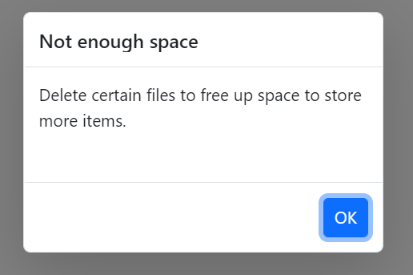
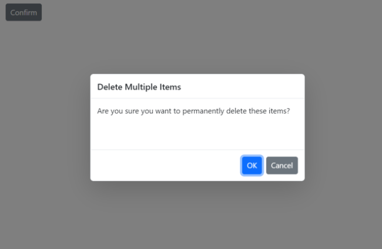
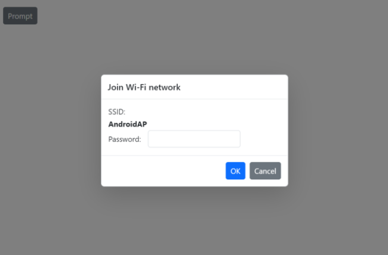
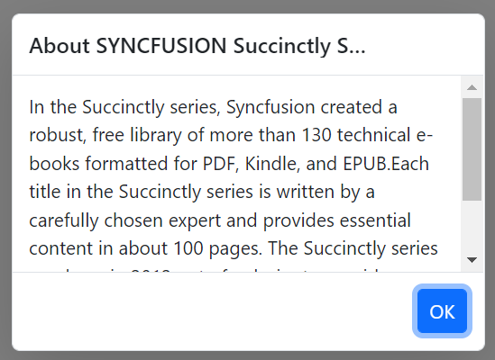
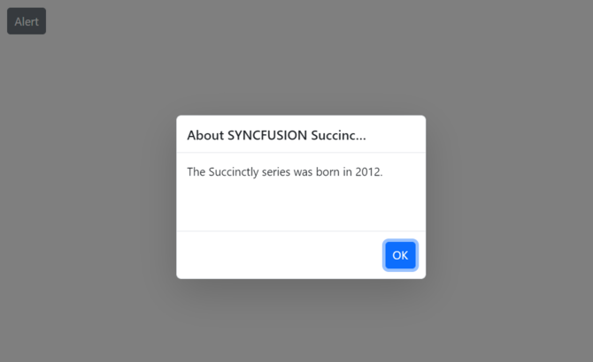

# Dimension in Predefined Dialogs in Blazor

Customize predefined dialog dimensions using the [DialogOptions.Height](https://help.syncfusion.com/cr/blazor/Syncfusion.Blazor.Popups.DialogOptions.html#Syncfusion_Blazor_Popups_DialogOptions_Height) and [DialogOptions.Width](https://help.syncfusion.com/cr/blazor/Syncfusion.Blazor.Popups.DialogOptions.html#Syncfusion_Blazor_Popups_DialogOptions_Width) properties.

By default, the `Width` and `Height` properties are set to `auto`. The dialog size adapts to its content when these values are not specified. Dimensions can be provided in pixels (for example, `300px`) or percentages (for example, `50%`) to override the default sizing.

Use the following code snippet for **alert.razor**, **confirm.razor**, and **prompt.razor** to customize dialog dimensions.

















**Results from the code snippet**

**Alert**

**Confirm**

**Prompt**

## Max-width and max-height

To constrain the dialog’s maximum size, specify `max-width` and `max-height` CSS properties for the component’s container using the [CssClass](https://help.syncfusion.com/cr/blazor/Syncfusion.Blazor.Popups.DialogOptions.html#Syncfusion_Blazor_Popups_DialogOptions_CssClass) property. The component may apply an inline `max-height`; to override it, use a higher-specificity selector (or `!important` if necessary).

Use the following code to customize the max-width and max-height for the alert dialog:









## Min-width and min-height

To ensure a minimum dialog size (for example, to keep action buttons visible), specify `min-width` and `min-height` CSS properties for the component’s container using the [CssClass](https://help.syncfusion.com/cr/blazor/Syncfusion.Blazor.Popups.DialogOptions.html#Syncfusion_Blazor_Popups_DialogOptions_CssClass) property.

Use the following code to customize the min-width and min-height for the alert dialog:









