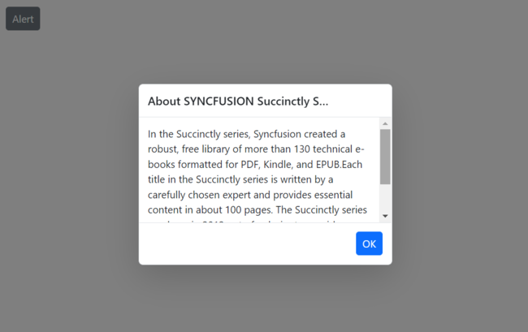

# Dimension in Predefined Dialogs in Blazor

Customize the predefined dialogs dimensions using the [DialogOptions.Height](https://help.syncfusion.com/cr/blazor/Syncfusion.Blazor.Popups.DialogOptions.html#Syncfusion_Blazor_Popups_DialogOptions_Height) and [DialogOptions.Width](https://help.syncfusion.com/cr/blazor/Syncfusion.Blazor.Popups.DialogOptions.html#Syncfusion_Blazor_Popups_DialogOptions_Width) properties.

By default, the predefined dialogs `Width` and `Height` property value is set as `auto`. Depends on the dialog content the width and height values are automatically adjust. You can specify the dimension values in both pixels and percentage format to change the default dialog width and height values.

Use the following code snippet for **alert.razor**, **confirm.razor** and **prompt.razor** to customize the dialog dimensions.

















**Results from the code snippet**

**Alert**

**Confirm**

**Prompt**

## Max-width and max-height

To have a restricted max-width and max-height dialog dimension, you need to specify the max-width, max-height CSS properties for the component’s container element by using the [CssClass](https://help.syncfusion.com/cr/blazor/Syncfusion.Blazor.Popups.DialogOptions.html#Syncfusion_Blazor_Popups_DialogOptions_CssClass) property. The max-height value is calculated in source level and set to the dialog. so, need to override the max-height property.

Use the following code to customize the max-width and max-height for alert dialog:









## Min-width and min-height

To have a restricted min-width and min-height dialog dimension, you need to specify the min-width, min-height CSS properties for the component’s container element by using the [CssClass](https://help.syncfusion.com/cr/blazor/Syncfusion.Blazor.Popups.DialogOptions.html#Syncfusion_Blazor_Popups_DialogOptions_CssClass) property.

Use the following code to customize the min-width and min-height for alert dialog:









