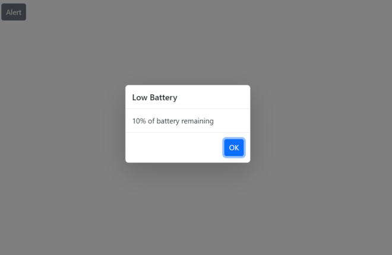

# Getting Started with Predefined Dialogs in Blazor

This section briefly explains how to include the predefined dialogs in your Blazor Server App and Blazor WebAssembly App using Visual Studio.

## Prerequisites

* [System requirements for Blazor components](https://blazor.syncfusion.com/documentation/system-requirements)

## Create a new Blazor App in Visual Studio

Create the **Blazor Server App** or **Blazor WebAssembly App** using Visual Studio in one of the following ways:

* [Create a Project using Microsoft Templates](https://docs.microsoft.com/en-us/aspnet/core/blazor/tooling?pivots=windows)

* [Create a Project using Syncfusion Blazor Extension](https://blazor.syncfusion.com/documentation/visual-studio-integration/vs2019-extensions/create-project)

## Install Syncfusion Blazor Popups NuGet in the App

The Syncfusion Blazor components are available in [nuget.org](https://www.nuget.org/packages?q=syncfusion.blazor). To use Syncfusion Blazor components in the application, add a reference to the corresponding NuGet. Refer to [NuGet packages topic](https://blazor.syncfusion.com/documentation/nuget-packages) for available NuGet packages list with component details and [Benefits of using individual NuGet packages](https://blazor.syncfusion.com/documentation/nuget-packages#benefits-of-using-individual-nuget-packages).

To add the Blazor Predefined Dialog component in the app, open the NuGet package manager in Visual Studio (Tools → NuGet Package Manager → Manage NuGet Packages for Solution), search for [Syncfusion.Blazor.Popups](https://www.nuget.org/packages/Syncfusion.Blazor.Popups), then install it.

## Register Syncfusion Blazor Service and Sycnfusion Dialog Service

Open the **~/_Imports.razor** file and import the Syncfusion.Blazor and Syncfusion.Blazor.Popups namespace.




@using Syncfusion.Blazor
@using Syncfusion.Blazor.Popups




Now, register the Syncfusion Blazor Service and Sycnfusion Dialog Service in the Blazor Server App or Blazor WebAssembly App. Here, the Syncfusion Blazor Service is registered by setting the [IgnoreScriptIsolation](https://help.syncfusion.com/cr/blazor/Syncfusion.Blazor.GlobalOptions.html#Syncfusion_Blazor_GlobalOptions_IgnoreScriptIsolation) property as true to load the scripts externally in the [next steps](#add-script-reference).

> From 2022 Vol1 (20.1) version: The default value of the `IgnoreScriptIsolationis` changed to `true`, so you don’t have to set the `IgnoreScriptIsolation` property explicitly to refer to scripts externally.

### Blazor Server App

* For the **.NET 6** app, open the **~/Program.cs** file and import the Syncfusion Blazor Service and Sycnfusion Blazor Dialog Service.

* For the **.NET 5 and .NET 3.X** app, open the **~/Startup.cs** file and import the Syncfusion Blazor Service and Sycnfusion Blazor Dialog Service.

The **DialogService** must be registered as scoped service using the **SfDialogService** method for getting the Predefined dialogs instance at any page.




@using Syncfusion.Blazor
@using Syncfusion.Blazor.Popups

// Add services to the container.
builder.Services.AddRazorPages();
builder.Services.AddServerSideBlazor();
builder.Services.AddScoped<SfDialogService>();
builder.Services.AddSyncfusionBlazor(options => { options.IgnoreScriptIsolation = true; });

var app = builder.Build();
....





@using Syncfusion.Blazor
@using Syncfusion.Blazor.Popups

namespace BlazorApplication
{
    public class Startup
    {
        ...
        public void ConfigureServices(IServiceCollection services)
        {
         	services.AddRazorPages();
    		services.AddServerSideBlazor();
    		services.AddScoped<SfDialogService>();
            services.AddSyncfusionBlazor(options => { options.IgnoreScriptIsolation = true; });
    		services.AddServerSideBlazor().AddCircuitOptions(options => { options.DetailedErrors = true; });
    		services.AddServerSideBlazor().AddHubOptions(o =>
        }
        ...
    }
}




### Blazor WebAssembly App

Open the **~/Program.cs** file and register the Syncfusion Blazor Service and Sycnfusion Blazor Dialog Service in the client web app.




@using Syncfusion.Blazor
@using Syncfusion.Blazor.Popups

// Add services to the container.

builder.Services.AddScoped(sp => new HttpClient { BaseAddress = new Uri(builder.HostEnvironment.BaseAddress) });
builder.Services.AddScoped<SfDialogService>();
builder.Services.AddSyncfusionBlazor(options => { options.IgnoreScriptIsolation = true; });
await builder.Build().RunAsync();
....





@using Syncfusion.Blazor
@using Syncfusion.Blazor.Popups

namespace WebApplication1
{
    public class Program
    {
        public static async Task Main(string[] args)
        {
            ....
            builder.Services.AddScoped<SfDialogService>();
            builder.Services.AddSyncfusionBlazor(options => { options.IgnoreScriptIsolation = true; });
            await builder.Build().RunAsync();
        }
    }
}




## Add Style Sheet

Check out the [Blazor Themes topic](https://blazor.syncfusion.com/documentation/appearance/themes) to learn different ways ([Static Web Assets](https://blazor.syncfusion.com/documentation/appearance/themes#static-web-assets), [CDN](https://blazor.syncfusion.com/documentation/appearance/themes#cdn-reference), and [CRG](https://blazor.syncfusion.com/documentation/common/custom-resource-generator)) to refer to themes in the Blazor application, and to have the expected appearance for the Syncfusion Blazor components. Here, the theme is referred to using the [Static Web Assets](https://blazor.syncfusion.com/documentation/appearance/themes#static-web-assets). Refer to the Enable static web assets usage topic to use static assets in your project.

To add a theme to the app, open the NuGet package manager in Visual Studio (Tools → NuGet Package Manager → Manage NuGet Packages for Solution), search for [Syncfusion.Blazor.Themes](https://www.nuget.org/packages/Syncfusion.Blazor.Themes/), then install it. The theme style sheet from NuGet can be referred to as follows.

> If you are using the [Syncfusion.Blazor](https://www.nuget.org/packages/Syncfusion.Blazor/) single NuGet, you don't have to refer to the Syncfusion.Blazor.Themes](https://www.nuget.org/packages/Syncfusion.Blazor.Themes/) NuGet. Since the style sheets are already inside the assets of the `Syncfusion.Blazor` NuGet.

### Blazor Server App

* For the **.NET 6** app, add the Syncfusion bootstrap5 theme in the `<head>` of the **~/Pages/_Layout.cshtml** file.

* For the **.NET 5 and .NET 3.X** app, add the Syncfusion bootstrap5 theme in the `<head>` of the **~/Pages/_Host.cshtml** file.




<head>
    ...
    <link href="_content/Syncfusion.Blazor.Themes/bootstrap5.css" rel="stylesheet" />
    <!--Refer theme style sheet as below if you are using Syncfusion.Blazor Single NuGet-->
    <!--<link href="_content/Syncfusion.Blazor/styles/bootstrap5.css" rel="stylesheet" />-->
</head>





<head>
    ...
    <link href="_content/Syncfusion.Blazor.Themes/bootstrap5.css" rel="stylesheet" />
    <!--Refer theme style sheet as below if you are using Syncfusion.Blazor Single NuGet-->
    <!--<link href="_content/Syncfusion.Blazor/styles/bootstrap5.css" rel="stylesheet" />-->
</head>




### Blazor WebAssembly App

For the Blazor WebAssembly App, Refer to the theme style sheet from NuGet in the `<head>` of the **wwwroot/index.html** file in the client web app.




<head>
    ...
    <link href="_content/Syncfusion.Blazor.Themes/bootstrap5.css" rel="stylesheet" />
    <!--Refer theme style sheet as below if you are using Syncfusion.Blazor Single NuGet-->
    <!--<link href="_content/Syncfusion.Blazor/styles/bootstrap5.css" rel="stylesheet" />-->
</head>




## Add Script Reference

Check out the [Adding Script Reference topic](https://blazor.syncfusion.com/documentation/common/adding-script-references) to learn different ways to add script references in the Blazor Application. In this getting started walk-through, the required scripts are referred to using the [Static Web Assets](https://blazor.syncfusion.com/documentation/common/adding-script-references#static-web-assets) externally inside the `<head>` as follows. Refer to the [Enable static web assets usage](https://blazor.syncfusion.com/documentation/common/adding-script-references#enable-static-web-assets-usage) topic to use static assets in your project.

### Blazor Server App

* For the **.NET 6**, refer to the script in the `<head>` of the **~/Pages/_Layout.cshtml** file.

* For the **.NET 5 and .NET 3.X** app, refer to the script in the `<head>` of the **~/Pages/_Host.cshtml** file.




<head>
    ....
    <link href="_content/Syncfusion.Blazor.Themes/bootstrap5.css" rel="stylesheet" />
    
    <!--Use below script reference if you are using Syncfusion.Blazor Single NuGet-->
    <!---->
</head>





<head>
    ....
    <link href="_content/Syncfusion.Blazor.Themes/bootstrap5.css" rel="stylesheet" />
    
    <!--Use below script reference if you are using Syncfusion.Blazor Single NuGet-->
    <!---->
</head>




### Blazor WebAssembly App

For the Blazor WebAssembly App, refer to the script in the `<head>` of the **~/index.html** file.




<head>
    ....
    <link href="_content/Syncfusion.Blazor.Themes/bootstrap5.css" rel="stylesheet" />
    
    <!--Use below script reference if you are using Syncfusion.Blazor Single NuGet-->
    <!---->
</head>




> Syncfusion recommends to reference scripts using the [Static Web Assets](https://blazor.syncfusion.com/documentation/common/adding-script-references#static-web-assets), [CDN](https://blazor.syncfusion.com/documentation/common/adding-script-references#cdn-reference), and [CRG](https://blazor.syncfusion.com/documentation/common/custom-resource-generator) by [disabling JavaScript isolation](https://blazor.syncfusion.com/documentation/common/adding-script-references#disable-javascript-isolation) for better loading performance of the Blazor application.

## Add Dialog Provider

`SfDialogProvider` allows to open predefined dialogs based on `SfDialogService` settings from any where in application. You can add `SfDialogProvider` in `MainLayout.razor` or any page. But it should be added only once in the app. If you add in `MainLayout.razor`, you can open predefined dialogs from any where in application. If you add in particular page, you can open dialogs only within the page.
    
* Open the **~/_Imports.razor** file or any other page under the `~/Pages` folder where the component is to be added and import the **Syncfusion.Blazor.Popups** namespace.




@using Syncfusion.Blazor
@using Syncfusion.Blazor.Popups




* Now, add `SfDialogProvider` in the **~/_MainLayout.razor** file.




<Syncfusion.Blazor.Popups.SfDialogProvider/>




## Open Predefined Dialog

Once you added `SfDialogService` and `SfDialogProvider`, you can open predefined dialogs from any where in application using [AlertAsync](https://help.syncfusion.com/cr/blazor/Syncfusion.Blazor.Popups.SfDialogService.html#Syncfusion_Blazor_Popups_SfDialogService_AlertAsync_System_String_System_String_Syncfusion_Blazor_Popups_DialogOptions_),[ConfirmAsync](https://help.syncfusion.com/cr/blazor/Syncfusion.Blazor.Popups.SfDialogService.html#Syncfusion_Blazor_Popups_SfDialogService_ConfirmAsync_System_String_System_String_Syncfusion_Blazor_Popups_DialogOptions_) or [PromptAsync](https://help.syncfusion.com/cr/blazor/Syncfusion.Blazor.Popups.SfDialogService.html#Syncfusion_Blazor_Popups_SfDialogService_PromptAsync_System_String_System_String_Syncfusion_Blazor_Popups_DialogOptions_) methods in [DialogServices](https://help.syncfusion.com/cr/blazor/Syncfusion.Blazor.Popups.SfDialogService.html).

### Show alert dialog

An alert dialog box used to display errors, warnings, and information alerts that needs user awareness. This can be achieved by using the [DialogService.AlertAsync](https://help.syncfusion.com/cr/blazor/Syncfusion.Blazor.Popups.SfDialogService.html#Syncfusion_Blazor_Popups_SfDialogService_AlertAsync_System_String_System_String_Syncfusion_Blazor_Popups_DialogOptions_) method. The alert dialog is displayed along with the `OK` button. When user clicks on `OK` button, alery dialog will get closed.

In the below code exmaple aleary dialog displayed on button click action.
    








### Show confirm dialog

A `Confirm` dialog displays a specified message along with the ‘OK’ and ‘Cancel’ buttons, which returns a boolean value according to the user's click action. This can be achieved by using the [DialogService.ConfirmAsync](https://help.syncfusion.com/cr/blazor/Syncfusion.Blazor.Popups.SfDialogService.html#Syncfusion_Blazor_Popups_SfDialogService_ConfirmAsync_System_String_System_String_Syncfusion_Blazor_Popups_DialogOptions_) method. It is used to get approval from the user, and it appears before any critical action.

Use the following code to render a simple confirm dialog in an application:









### Show prompt dialog

A `Prompt` dialog is used to get input from the user by using the [DialogService.PromptAsync](https://help.syncfusion.com/cr/blazor/Syncfusion.Blazor.Popups.SfDialogService.html#Syncfusion_Blazor_Popups_SfDialogService_PromptAsync_System_String_System_String_Syncfusion_Blazor_Popups_DialogOptions_) method. When the user clicks ‘OK,’ the input value is returned. When they click ‘Cancel,’ the null value is returned.

Use the following code to render a simple prompt dialog in an application:









