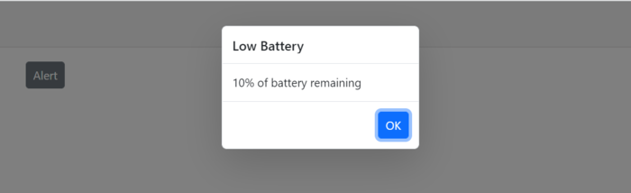
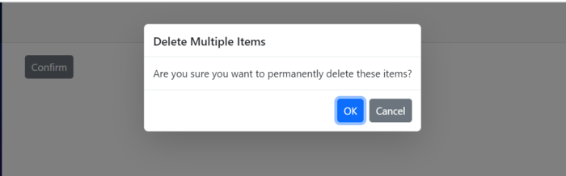
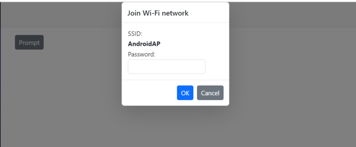

# Positioning in Predefined Dialogs in Blazor

Customize the dialog position using the [DialogOptions.Position](https://help.syncfusion.com/cr/blazor/Syncfusion.Blazor.Popups.DialogOptions.html#Syncfusion_Blazor_Popups_DialogOptions_Position) property. The position is defined by `X` and `Y` values on the [PositionDataModel](https://help.syncfusion.com/cr/blazor/Syncfusion.Blazor.Popups.PositionDataModel.html) type and is relative to the target container.

* `PositionDataModel.X` can be set to `left`, `center`, `right`, or an offset value. The default is `center`.
* `PositionDataModel.Y` can be set to `top`, `center`, `bottom`, or an offset value. The default is `center`.

Use the following code snippets for **alert.razor**, **confirm.razor**, and **prompt.razor** to customize the position. In this example, the dialog position is set to X = `center` and Y = `top`.
















**Results from the code snippet**

**Alert**

**Confirm**

**Prompt**

